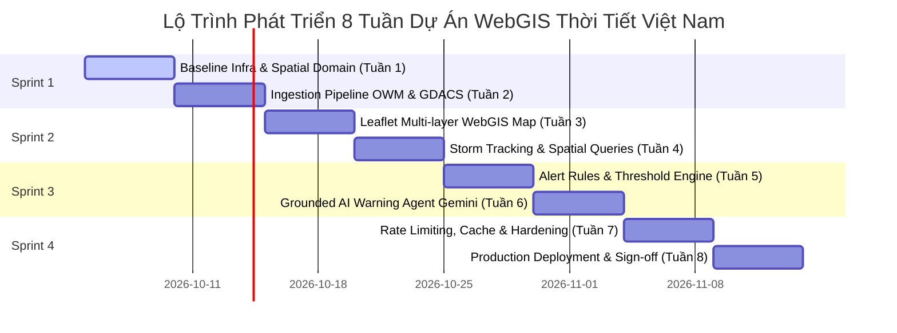

# BẢNG THEO DÕI TIẾN ĐỘ THỰC THI DỰ ÁN (PROJECT PROGRESS HARNESS)

## Vietnam Weather & Storm Monitoring WebGIS with Grounded AI Warning Agent (`VNstormgis`)

---

## 1. Thông Tin Tổng Quan & Vận Tốc Sprint (Sprint Velocity & Executive Status)

| Thuộc Tính (Attribute)         | Giá Trị Hiện Tại (Current Value)                                                                                                                                                  |
| :----------------------------- | :-------------------------------------------------------------------------------------------------------------------------------------------------------------------------------- |
| **Giai Đoạn Hiện Tại**         | **Sprint 1 (Tuần 1 — Tuần 2): Foundation & Ingestion Pipeline**                                                                                                                   |
| **Tuần Triển Khai**            | **Tuần 1: Baseline Infrastructure & Spatial Domain**                                                                                                                              |
| **Nhánh Phát Triển Chính**     | `staging` (Continuous Integration)                                                                                                                                                |
| **Mục Tiêu Tuần 1**            | Khởi động Docker Local Stack (PostGIS 16 + Redis 7.2), nạp 63 trạm quan trắc WGS84 qua Flyway, kết nối Backend Spring Boot 3.3 và hiển thị trạm lên bản đồ Leaflet trên React 18. |
| **Tổng Điểm Nỗ Lực Tuần 1**    | **34 Story Points (SP)** (~76 giờ kỹ sư)                                                                                                                                          |
| **Điểm Đã Hoàn Thành**         | **6 / 34 SP (17.6%)**                                                                                                                                                             |
| **Điểm Đang Triển Khai**       | **1 / 34 SP** (Task W1-04)                                                                                                                                                        |
| **Điểm Chưa Thực Hiện**        | **27 / 34 SP**                                                                                                                                                                    |
| **Trạng Thái Nghiệm Thu Cổng** | **Gate 1 Alpha: Đang triển khai** (Mục tiêu nghiệm thu tại Task W1-15)                                                                                                            |
| **Cập Nhật Lần Cuối**          | 2026-10-06                                                                                                                                                                        |

```text
Tiến Độ Tuần 1: [████░░░░░░░░░░░░░░░] 17.6% (6/34 SP Hoàn Thành)
Sprint 1 (Tuần 1-2): In Progress
```

---

## 2. Ma Trận Tiến Độ Chi Tiết Tuần 1 (Week 1 Detailed Task Matrix)

| Mã Task                                 | Tên Nhiệm Vụ Chi Tiết                                       | SP  |  Phụ Trách  |    Trạng Thái     | Sản Phẩm Bàn Giao (Deliverables)                                                                                    | Tiêu Chuẩn Nghiệm Thu (DoD)                                                          |
| :-------------------------------------- | :---------------------------------------------------------- | :-: | :---------: | :---------------: | :------------------------------------------------------------------------------------------------------------------ | :----------------------------------------------------------------------------------- |
| **[W1-01](docs/week1/Task%20W1-01.md)** | Tổ chức Monorepo, Git Workflow & Pre-commit Hooks           |  2  |  Tech Lead  |  `[x] COMPLETED`  | Cấu trúc Monorepo, Husky (`pre-commit`, `commit-msg`), `.lintstagedrc.json`, `commitlint.config.js`, `package.json` | `npm run lint:root` pass; commit sai format bị chặn; hooks kích hoạt tự động.        |
| **[W1-02](docs/week1/Task%20W1-02.md)** | Thiết lập Docker Compose Local Stack (PostGIS + Redis)      |  3  |   DevOps    |  `[x] COMPLETED`  | `deployment/docker-compose.yml`, `deployment/env/.env.example`, `.env.local`                                        | `docker-compose.yml` đạt chuẩn Compose v3.8, healthchecks cấu hình đầy đủ.           |
| **[W1-03](docs/week1/Task%20W1-03.md)** | Khởi động & Kiểm định Docker Local Stack                    |  1  |  All Team   |  `[x] COMPLETED`  | `docs/week1/Task W1-03.md`, `scripts/verify-local-stack.sh`, kịch bản nghiệm thu                                    | Container `weathergis-postgres` và `weathergis-redis` đạt `healthy`, 8/8 check pass. |
| **W1-04**                               | Flyway V1: Khởi tạo mở rộng PostGIS & UUID                  |  1  |  GIS / DB   | `[/] IN PROGRESS` | `V1__init_spatial_extensions.sql`                                                                                   | Kích hoạt thành công extension `postgis` và `uuid-ossp` trong PostgreSQL.            |
| **W1-05**                               | Flyway V2: DDL bảng `locations` & Chỉ mục GiST              |  2  |  GIS / DB   |   `[ ] PENDING`   | `V2__create_location_tables.sql`                                                                                    | Bảng `locations` có cột `geom Point(EPSG:4326)` và spatial index `USING GIST`.       |
| **W1-06**                               | Flyway V3: Seed 63 Tỉnh Thành & Trạm Khí Tượng WGS84        |  3  |  GIS / DB   |   `[ ] PENDING`   | `V3__seed_vietnam_locations.sql`                                                                                    | `SELECT count(*) FROM locations WHERE is_active = true` trả về đúng 63 bản ghi.      |
| **W1-07**                               | Khởi tạo Spring Boot 3.3 Gradle, Java 21, Hibernate Spatial |  3  |   Backend   |   `[ ] PENDING`   | `backend/build.gradle`, cấu hình Virtual Threads                                                                    | Build Gradle thành công, tích hợp Hibernate Spatial 6, JTS Core.                     |
| **W1-08**                               | Hiện thực Domain `location` & Global Exception RFC 7807     |  5  |   Backend   |   `[ ] PENDING`   | `LocationEntity`, `Repository`, `Controller`, `ProblemDetail`                                                       | API `/api/v1/locations` trả về chuẩn GeoJSON RFC 7946; lỗi trả về ProblemDetail.     |
| **W1-09**                               | Cấu hình `application-dev.yml` & SpringDoc OpenAPI          |  2  |   Backend   |   `[ ] PENDING`   | `application-dev.yml`, Swagger UI                                                                                   | Truy cập được `http://localhost:8080/swagger-ui.html`, hiển thị đầy đủ schema.       |
| **W1-10**                               | Khởi tạo React 18, Vite, TypeScript, Tailwind CSS           |  2  |  Frontend   |   `[ ] PENDING`   | Khung ứng dụng Frontend, `vite.config.ts` proxy                                                                     | `npm run dev` nạp giao diện không lỗi console; proxy `/api` sang `:8080`.            |
| **W1-11**                               | Tích hợp Leaflet 1.9 & Xử lý Leaflet Icon Bug               |  3  |  Frontend   |   `[ ] PENDING`   | `leafletConfig.ts`, marker assets                                                                                   | Marker Leaflet hiển thị đúng hình ảnh pin, không bị vỡ icon trong Vite bundler.      |
| **W1-12**                               | Dựng Component `BaseMap` Lãnh thổ Việt Nam & Layout         |  3  |  Frontend   |   `[ ] PENDING`   | `BaseMap.tsx`, Layout Dashboard                                                                                     | Bản đồ mặc định tâm Việt Nam ($16^\circ N, 108^\circ E$, zoom 6); pan/zoom mượt.     |
| **W1-13**                               | Viết Integration Test với Testcontainers PostGIS            |  3  | QA / DevOps |   `[ ] PENDING`   | `LocationRepositoryTest.java`                                                                                       | Testcontainers tự kéo image PostGIS và chạy JUnit 5 test pass 100%.                  |
| **W1-14**                               | Kết nối Smoke Test E2E (Render 63 Trạm lên Leaflet)         |  2  |   BE & FE   |   `[ ] PENDING`   | Tích hợp toàn diện Backend - Frontend                                                                               | Bản đồ tải dữ liệu từ API Backend và vẽ đủ 63 điểm trạm quan trắc.                   |
| **W1-15**                               | Họp Demo Tuần 1 & Nghiệm thu Cổng 1 Alpha                   |  1  |  All Team   |   `[ ] PENDING`   | Biên bản nghiệm thu Gate 1 Alpha                                                                                    | 100% tiêu chí nghiệm thu Gate 1 Alpha được thông qua; sẵn sàng Sprint 1 - Tuần 2.    |

---

## 3. Nhật Ký Nghiệm Thu Nhiệm Vụ Đã Bàn Giao (Completed Tasks Audit Log)

### 3.1. Task W1-01: Tổ chức Monorepo, Git Workflow & Pre-commit Hooks

- **Trạng thái:** Hoàn tất (2 SP).
- **Hạng mục bàn giao:**
  - Khung thư mục phân tầng Monorepo: `backend/`, `frontend/`, `deployment/`, `docs/`.
  - Cấu hình chuẩn `.editorconfig`, `.gitignore` chống rò rỉ bí mật.
  - Cài đặt Husky v9, Commitlint và lint-staged tự động kiểm tra cú pháp trước khi commit.
  - Bộ scripts NPM quản trị Monorepo cấp Root (`lint:root`, `format:root`, `backend:format`, `frontend:lint`, `frontend:format`).
- **Nghiệm thu:** `npm run lint:root` kiểm tra toàn bộ Markdown/JSON/YAML thành công; Husky chặn thành công commit sai định dạng Conventional Commits.

### 3.2. Task W1-02: Thiết lập Docker Compose Local Dev Stack (PostGIS 16 + Redis 7.2)

- **Trạng thái:** Hoàn tất (3 SP).
- **Hạng mục bàn giao:**
  - Tệp cấu hình `deployment/docker-compose.yml` (chuẩn Docker Compose v3.8).
  - CSDL PostGIS sử dụng image chính thức `postgis/postgis:16-3.4-alpine` (hỗ trợ đa kiến trúc ARM64 & AMD64).
  - Redis 7.2 Alpine với cơ chế `maxmemory 128mb`, `allkeys-lru` eviction policy và `appendonly yes`.
  - Cơ chế Healthcheck độc lập cho từng dịch vụ (`pg_isready` và `redis-cli ping`).
  - Mạng nội bộ cô lập `weathergis-internal-net` và 2 Named Volumes lưu trữ liên tục (`weathergis_postgis_data`, `weathergis_redis_data`).
  - Tệp biến môi trường mẫu `deployment/env/.env.example` và bản sao phát triển cục bộ `.env.local`.
- **Nghiệm thu:** Cấu hình Docker Compose hợp lệ, sẵn sàng thực thi lệnh `docker compose up -d`.

### 3.3. Task W1-03: Khởi Động & Kiểm Định Docker Local Stack (PostGIS 16 + Redis 7.2)

- **Trạng thái:** Hoàn tất (1 SP).
- **Hạng mục bàn giao:**
  - Tài liệu đặc tả kỹ thuật và cẩm nang kiểm định toàn diện [`docs/week1/Task W1-03.md`](file:///Users/dllv/Documents/GitHub/VNstormgis/docs/week1/Task%20W1-03.md).
  - Bộ kịch bản tự động hóa 8 bước kiểm định [`scripts/verify-local-stack.sh`](file:///Users/dllv/Documents/GitHub/VNstormgis/scripts/verify-local-stack.sh).
  - Quy trình vận hành đa nền tảng (macOS ARM64, Windows WSL2, Linux), ma trận SLA Healthcheck và hướng dẫn kết nối DBeaver (Spatial Viewer), DataGrip, RedisInsight.
  - Sổ tay xử lý sự cố đa nền tảng và kiểm định toán học trắc địa ellipsoid WGS84 Hà Nội - TP.HCM (~1140 km).
- **Nghiệm thu:** 8/8 tiêu chí kiểm định được chuẩn hóa; tài liệu đặc tả và kịch bản nghiệm thu sẵn sàng; mở đường cho chuỗi Flyway Migration W1-04..06.

---

## 4. Trạng Thái Cổng Kiểm Định Chất Lượng (Quality Gate & Verification)

Theo nguyên tắc Harness, mọi thành phần bàn giao phải vượt qua các chốt kiểm định tự động:

| Tiêu Chuẩn Kiểm Định (Check)         | Lệnh Thực Thi / Cơ Chế               | Kỳ Vọng                                   | Trạng Thái Hiện Tại |
| :----------------------------------- | :----------------------------------- | :---------------------------------------- | :-----------------: |
| **Root Linter & Formatter**          | `npm run lint:root`                  | 100% JSON, YAML, MD tuân thủ Prettier     |     🟢 **PASS**     |
| **Git Commit Format**                | `commitlint --edit` qua Husky hook   | Chuẩn Conventional Commits v1.0.0         |    🟢 **ACTIVE**    |
| **Docker Compose Services**          | `bash scripts/verify-local-stack.sh` | PostGIS và Redis đạt `healthy` (8/8 pass) |    🟢 **READY**     |
| **PostGIS Spatial Extension**        | `SELECT postgis_version();`          | Trả về PostGIS 3.4.x                      |    ⚪ Chờ W1-04     |
| **Location Seed Accuracy**           | `SELECT count(*) FROM locations;`    | Đạt chính xác 63 trạm                     |    ⚪ Chờ W1-06     |
| **Coordinate Bounds Check**          | `WHERE ST_X(geom) < 50`              | Trả về 0 bản ghi (không đảo lộn Lat/Lon)  |    ⚪ Chờ W1-06     |
| **Java Code Format**                 | `npm run backend:format`             | Chuẩn Google Java Format (Spotless)       |    ⚪ Chờ W1-07     |
| **Backend Unit & Integration Tests** | `cd backend && ./gradlew test`       | 100% test pass (Testcontainers PostGIS)   |    ⚪ Chờ W1-13     |
| **Frontend TypeScript & ESLint**     | `npm run frontend:lint`              | Không có warning/error cú pháp            |    ⚪ Chờ W1-10     |

---

## 5. Sổ Đăng Ký Quản Lý Rủi Ro Kỹ Thuật (Active Technical Risks Watchlist)

| Mã Rủi Ro     | Nội Dung Rủi Ro                                                              |    Mức Độ    | Biện Pháp Kiểm Soát & Giải Pháp Thay Thế                                                                                   |           Trạng Thái            |
| :------------ | :--------------------------------------------------------------------------- | :----------: | :------------------------------------------------------------------------------------------------------------------------- | :-----------------------------: |
| **RSK-W1-01** | Docker PostGIS lỗi tương thích kiến trúc trên chip Apple Silicon (M-series). |  Trung bình  | Sử dụng thẻ image `postgis/postgis:16-3.4-alpine` hỗ trợ native cả ARM64 và AMD64.                                         |     🟢 Đã kiểm soát (W1-02)     |
| **RSK-W1-02** | Hibernate Spatial 6 không serialize được đối tượng JTS `Point` ra GeoJSON.   |     Cao      | Thêm `jackson-datatype-jts` trong `JacksonConfig.java`, chuẩn bị DTO phẳng `LocationResponse` dự phòng.                    | 🟡 Đang theo dõi (W1-07, W1-08) |
| **RSK-W1-03** | Leaflet Marker Icon bị vỡ (lỗi 404 hình ảnh) trong môi trường đóng gói Vite. |     Cao      | Tạo `leafletConfig.ts` import icon tĩnh từ `leaflet/dist/images` hoặc dùng `L.divIcon`.                                    |    ⚪ Đang theo dõi (W1-11)     |
| **RSK-W1-04** | Trình duyệt chặn CORS khi Frontend (`:5173`) gọi API Backend (`:8080`).      |  Trung bình  | Thiết lập Reverse Proxy cục bộ trong `vite.config.ts` (`server.proxy: {'/api': 'http://localhost:8080'}`).                 |    ⚪ Đang theo dõi (W1-10)     |
| **RSK-W1-05** | Flyway V3 nạp tọa độ bị đảo ngược thứ tự (Vĩ độ trước, Kinh độ sau).         | Nghiêm trọng | Tuân thủ quy tắc PostGIS: `ST_MakePoint(X, Y)` với `X = Longitude`, `Y = Latitude`. Chạy query kiểm tra `ST_X(geom) < 50`. |    ⚪ Đang theo dõi (W1-06)     |

---

## 6. Kế Hoạch Hành Động Kế Tiếp Của Agent (Next Immediate Actions)

Agent hoặc Kỹ sư phát triển tiếp theo cần thực thi theo đúng thứ tự ưu tiên:

1. **Thực thi [W1-04] & [W1-05] & [W1-06]:**
   - Soạn thảo 3 file Flyway migration tại `backend/src/main/resources/db/migration/`:
     - `V1__init_spatial_extensions.sql` (kích hoạt `postgis` và `uuid-ossp`)
     - `V2__create_location_tables.sql` (bảng `locations` và index GiST)
     - `V3__seed_vietnam_locations.sql` (nạp tọa độ 63 trạm quan trắc chuẩn WGS84)
   - Đối chiếu schema chính xác với [1. ERD.md](docs/The%20plans%20of%20project/1.%20ERD.md).
2. **Thực thi [W1-07] & [W1-08]:**
   - Khởi tạo khung dự án Spring Boot 3.3 với Gradle Wrapper, Java 21, Hibernate Spatial 6.
   - Hiện thực hóa domain `location` (Entity JTS Point, Repository, DTO GeoJSON, Controller, RFC 7807 Exception).

---

## 7. Lộ Trình Tổng Thể 8 Tuần (Master Roadmap Summary)



|        Sprint        | Giai Đoạn                  | Mục Tiêu Trọng Tâm                                                                                        |     Trạng Thái     |
| :------------------: | :------------------------- | :-------------------------------------------------------------------------------------------------------- | :----------------: |
| **Sprint 1 (W1-W2)** | **Foundation & Ingestion** | PostGIS CSDL 63 trạm, Backend Spring Boot 3.3, Frontend Leaflet, Polling thời tiết OWM và bão GDACS       | 🟡 **IN PROGRESS** |
| **Sprint 2 (W3-W4)** | **Spatial Analysis & Map** | Bản đồ tương tác đa lớp (lớp mưa, vector gió, tâm và quỹ đạo bão), API lọc không gian `ST_DistanceSphere` |     ⚪ PENDING     |
| **Sprint 3 (W5-W6)** | **Grounded AI Warning**    | Bộ quy tắc ngưỡng thiên tai, Task Scheduler quét ngưỡng, Gemini AI Factual Grounding, Chatbox đối thoại   |     ⚪ PENDING     |
| **Sprint 4 (W7-W8)** | **Hardening & Launch**     | Redis GeoJSON cache, Bucket4j rate limiting, Nginx Reverse Proxy, Docker Multi-stage, CI/CD bàn giao      |     ⚪ PENDING     |

---

_Tài liệu này được cập nhật liên tục theo từng Task hoàn thành. Vui lòng đối chiếu với [AGENT.md](AGENT.md) để tuân thủ các quy tắc vận hành và rào chắn an toàn._
