# 1. Entity Relationship Diagram (ERD): WebGIS Giám Sát Mưa Gió Bão & AI Cảnh Báo

Tài liệu này định nghĩa mô hình thực thể quan hệ (ERD) và lược đồ cơ sở dữ liệu chi tiết cho hệ thống **WebGIS Giám sát Mưa Gió Bão tích hợp AI Agent**. Hệ thống sử dụng **PostgreSQL** kết hợp tiện ích mở rộng không gian **PostGIS** để lưu trữ và phân tích dữ liệu địa lý thời gian thực.

---

## 1. Sơ đồ ERD Tổng thể (Mermaid Diagram)

```mermaid
erDiagram
    locations ||--o{ weather_records : "has"
    locations ||--o{ alerts : "targeted_at"
    storms ||--|{ storm_tracks : "contains"
    storms ||--o{ alerts : "triggers"
    alert_thresholds ||--o{ alerts : "defines"
    chat_sessions ||--o{ chat_messages : "contains"
    alerts ||--o{ chat_messages : "referenced_in"

    locations {
        uuid id PK "Khóa chính UUID"
        varchar code UK "Mã trạm/tỉnh (e.g. HAN, DNG, SGN)"
        varchar name "Tên điểm giám sát/tỉnh/thành phố"
        varchar region "Khu vực (Bắc Bộ, Trung Bộ, Nam Bộ...)"
        geometry geom "Tọa độ trạm Point(EPSG:4326)"
        geometry boundary "Ranh giới hành chính MultiPolygon"
        boolean is_active "Trạng thái trạm đang giám sát"
        timestamptz created_at "Thời gian tạo"
        timestamptz updated_at "Thời gian cập nhật"
    }

    weather_records {
        bigserial id PK "Khóa chính tự tăng"
        uuid location_id FK "Trạm/Vị trí quan trắc"
        timestamptz recorded_at "Thời điểm đo từ OpenWeatherMap"
        float temperature "Nhiệt độ hiện tại (°C)"
        float feels_like "Nhiệt độ cảm nhận (°C)"
        float humidity "Độ ẩm không khí (%)"
        float pressure "Áp suất khí quyển (hPa)"
        float wind_speed "Tốc độ gió (m/s)"
        float wind_direction "Hướng gió (0 - 360 độ)"
        float wind_gust "Tốc độ gió giật (m/s)"
        float rain_1h "Lượng mưa tích lũy 1h (mm)"
        float rain_3h "Lượng mưa tích lũy 3h (mm)"
        varchar weather_condition "Tình trạng thời tiết (Rain, Clouds...)"
        varchar weather_description "Mô tả chi tiết thời tiết"
        jsonb raw_data "Payload gốc từ OpenWeatherMap API"
        timestamptz created_at "Thời gian ghi bản ghi"
    }

    storms {
        varchar id PK "Mã định danh bão từ GDACS (e.g. TC1000987)"
        varchar name "Tên quốc tế hoặc số hiệu bão (e.g. YAGI)"
        int year "Năm xảy ra bão"
        varchar category "Cấp độ bão (Depression, Cat 1-5)"
        float max_wind_speed "Tốc độ gió lớn nhất (km/h)"
        float min_pressure "Áp suất tâm bão thấp nhất (hPa)"
        varchar status "Trạng thái (active, dissipated)"
        timestamptz start_date "Thời điểm bắt đầu ghi nhận"
        timestamptz end_date "Thời điểm bão tan/suy yếu"
        geometry geom_current "Vị trí tâm bão hiện tại Point(EPSG:4326)"
        jsonb raw_metadata "Dữ liệu JSON gốc từ GDACS API"
        timestamptz updated_at "Thời điểm cập nhật mới nhất"
    }

    storm_tracks {
        bigserial id PK "Khóa chính tự tăng"
        varchar storm_id FK "Liên kết cơn bão"
        varchar track_type "historical hoặc forecast"
        timestamptz forecast_time "Mốc thời gian của vị trí tâm bão"
        geometry geom "Tọa độ tâm bão Point(EPSG:4326)"
        float wind_speed "Tốc độ gió tại mốc này (km/h)"
        float wind_gust "Gió giật tại mốc này (km/h)"
        float pressure "Áp suất tâm bão (hPa)"
        varchar category "Cấp bão tại mốc"
        float impact_radius_km "Bán kính vùng gió bão nguy hiểm (km)"
        geometry impact_polygon "Vùng ảnh hưởng Polygon(EPSG:4326)"
        timestamptz created_at "Thời gian tạo"
    }

    alert_thresholds {
        serial id PK "Khóa chính tự tăng"
        varchar name "Tên quy chuẩn ngưỡng cảnh báo"
        varchar parameter "Thông số so sánh (rain_1h, wind_speed...)"
        varchar operator "Toán tử điều kiện (>=, >, <=, <)"
        float threshold_value "Giá trị ngưỡng kích hoạt"
        varchar severity_level "Mức độ (INFO, WARNING, DANGER, CRITICAL)"
        text description "Mô tả ý nghĩa và hướng dẫn ứng phó"
        boolean is_enabled "Bật/Tắt áp dụng kiểm tra"
        timestamptz updated_at "Thời gian cấu hình gần nhất"
    }

    alerts {
        uuid id PK "Mã định danh cảnh báo UUID"
        int threshold_id FK "Ngưỡng tiêu chuẩn được kích hoạt"
        uuid location_id FK "Khu vực/Điểm cảnh báo"
        varchar storm_id FK "Cơn bão gây ra cảnh báo nếu có"
        varchar title "Tiêu đề cảnh báo ngắn gọn"
        varchar severity_level "Mức độ cảnh báo (INFO, WARNING...)"
        text trigger_reason "Chi tiết vi phạm chỉ số vượt ngưỡng"
        text ai_explanation "Bản tin cảnh báo & giải thích do Gemini sinh"
        geometry affected_geom "Hình học vùng cảnh báo Geometry(EPSG:4326)"
        varchar status "Trạng thái (active, resolved, dismissed)"
        timestamptz triggered_at "Thời điểm phát sinh cảnh báo"
        timestamptz resolved_at "Thời điểm kết thúc cảnh báo"
        timestamptz created_at "Thời gian lưu vào hệ thống"
    }

    chat_sessions {
        uuid id PK "Định danh phiên hội thoại UUID"
        varchar session_token UK "Mã định danh duy nhất của phiên truy cập"
        varchar title "Tiêu đề tóm tắt cuộc hội thoại"
        timestamptz created_at "Thời gian bắt đầu phiên"
        timestamptz updated_at "Thời gian tương tác gần nhất"
    }

    chat_messages {
        uuid id PK "Khóa chính tin nhắn UUID"
        uuid session_id FK "Liên kết phiên hội thoại"
        varchar sender_type "Người gửi (user, assistant, system)"
        text content "Nội dung câu hỏi hoặc câu trả lời"
        uuid referenced_alert_id FK "Cảnh báo được người dùng hỏi sâu"
        jsonb spatial_filter "Tọa độ/Bbox hiển thị trên Leaflet"
        int tokens_used "Lượng token Gemini tiêu thụ"
        timestamptz created_at "Thời điểm gửi tin nhắn"
    }

    data_sync_logs {
        bigserial id PK "Khóa chính nhật ký"
        varchar source "Nguồn đồng bộ (OPENWEATHERMAP, GDACS, AI_MONITOR)"
        varchar status "Trạng thái (SUCCESS, FAILED, RUNNING)"
        int records_processed "Số lượng bản ghi nạp vào CSDL"
        text error_message "Chi tiết lỗi nếu thất bại"
        timestamptz started_at "Thời điểm bắt đầu tiến trình"
        timestamptz completed_at "Thời điểm kết thúc tiến trình"
    }
```



---

## 2. Từ điển Dữ liệu Chi tiết (Data Dictionary)

### 2.1. Bảng `locations` (Điểm quan trắc / Vị trí địa lý giám sát)
Quản lý các trạm quan trắc hoặc các tỉnh/thành phố trên toàn lãnh thổ Việt Nam mà Java - Spring Boot Backend định kỳ gọi API lấy dữ liệu thời tiết.

| Cột | Kiểu dữ liệu | Ràng buộc | Mô tả nghiệp vụ |
| :--- | :--- | :--- | :--- |
| `id` | `UUID` | **PK**, Default `gen_random_uuid()` | Khóa chính duy nhất của điểm giám sát |
| `code` | `VARCHAR(32)` | **UNIQUE**, NOT NULL | Mã định danh trạm/tỉnh (ví dụ: `HAN`, `DNG`, `SGN`, `QNH`) |
| `name` | `VARCHAR(128)` | NOT NULL | Tên địa phương (ví dụ: "Hà Nội", "Đà Nẵng", "Quảng Ninh") |
| `region` | `VARCHAR(64)` | NOT NULL | Vùng địa lý ("Bắc Bộ", "Bắc Trung Bộ", "Nam Trung Bộ", "Tây Nguyên", "Nam Bộ") |
| `geom` | `GEOMETRY(Point, 4326)` | NOT NULL | Tọa độ WGS84 kinh độ / vĩ độ trạm (phục vụ hiển thị Marker trên Leaflet) |
| `boundary` | `GEOMETRY(MultiPolygon, 4326)` | NULL | Ranh giới hành chính để thực hiện không gian: `ST_Contains`, `ST_Intersects` với tâm bão |
| `is_active` | `BOOLEAN` | Default `true` | Đánh dấu trạm có đang tiếp tục gọi API thu thập dữ liệu hay không |
| `created_at` | `TIMESTAMPTZ` | Default `CURRENT_TIMESTAMP` | Thời điểm tạo trạm |
| `updated_at` | `TIMESTAMPTZ` | Default `CURRENT_TIMESTAMP` | Thời điểm cập nhật thông tin trạm |

---

### 2.2. Bảng `weather_records` (Dữ liệu quan trắc thời tiết OpenWeatherMap)
Lưu trữ chuỗi thời gian (time-series) dữ liệu khí tượng mưa và gió theo chu kỳ nạp định kỳ (ví dụ mỗi 10 - 30 phút).

| Cột | Kiểu dữ liệu | Ràng buộc | Mô tả nghiệp vụ |
| :--- | :--- | :--- | :--- |
| `id` | `BIGSERIAL` | **PK** | Khóa chính tự tăng |
| `location_id` | `UUID` | **FK** references `locations(id)`, NOT NULL | Trạm đo tương ứng |
| `recorded_at` | `TIMESTAMPTZ` | NOT NULL | Thời điểm quan trắc thực tế do OpenWeatherMap cung cấp (`dt`) |
| `temperature` | `FLOAT` | NOT NULL | Nhiệt độ hiện tại (°C) |
| `feels_like` | `FLOAT` | NOT NULL | Nhiệt độ cảm nhận thực tế (°C) |
| `humidity` | `FLOAT` | NOT NULL | Độ ẩm tương đối (%) |
| `pressure` | `FLOAT` | NOT NULL | Áp suất khí quyển (hPa) |
| `wind_speed` | `FLOAT` | NOT NULL | Vận tốc gió (m/s) |
| `wind_direction` | `FLOAT` | NOT NULL | Hướng gió (độ từ 0 - 360) |
| `wind_gust` | `FLOAT` | Default `0` | Vận tốc gió giật tức thời (m/s) |
| `rain_1h` | `FLOAT` | Default `0` | Lượng mưa tích lũy trong 1 giờ gần nhất (mm) |
| `rain_3h` | `FLOAT` | Default `0` | Lượng mưa tích lũy trong 3 giờ gần nhất (mm) |
| `weather_condition` | `VARCHAR(64)` | NOT NULL | Trạng thái thời tiết vắn tắt (`Rain`, `Thunderstorm`, `Clouds`, `Clear`...) |
| `weather_description` | `VARCHAR(255)` | NOT NULL | Mô tả thời tiết chi tiết (`heavy intensity rain`, `scattered clouds`...) |
| `raw_data` | `JSONB` | NULL | Toàn bộ payload JSON trả về từ OpenWeatherMap phục vụ audit hoặc mở rộng |
| `created_at` | `TIMESTAMPTZ` | Default `CURRENT_TIMESTAMP` | Thời điểm lưu bản ghi vào CSDL |

---

### 2.3. Bảng `storms` (Thông tin cơn bão từ GDACS)
Quản lý các cơn bão nhiệt đới (Tropical Cyclone) đang hoạt động trên biển Đông hoặc khu vực lân cận ảnh hưởng đến Việt Nam.

| Cột | Kiểu dữ liệu | Ràng buộc | Mô tả nghiệp vụ |
| :--- | :--- | :--- | :--- |
| `id` | `VARCHAR(64)` | **PK** | Mã sự kiện định danh từ GDACS (ví dụ: `TC1000987`, `1001045`) |
| `name` | `VARCHAR(128)` | NOT NULL | Tên cơn bão (ví dụ: `YAGI`, `PRAPIROON`, `BÃO SỐ 3`) |
| `year` | `INT` | NOT NULL | Năm phát sinh bão |
| `category` | `VARCHAR(64)` | NOT NULL | Cấp bão (`Tropical Depression`, `Category 1 - 5`, `Super Typhoon`) |
| `max_wind_speed` | `FLOAT` | NOT NULL | Tốc độ gió mạnh nhất vùng gần tâm bão (km/h) |
| `min_pressure` | `FLOAT` | NOT NULL | Khí áp trung tâm bão thấp nhất (hPa) |
| `status` | `VARCHAR(32)` | NOT NULL, Default `'active'` | Trạng thái bão (`active`: đang hoạt động, `dissipated`: đã tan) |
| `start_date` | `TIMESTAMPTZ` | NOT NULL | Thời điểm bão bắt đầu hình thành |
| `end_date` | `TIMESTAMPTZ` | NULL | Thời điểm bão suy yếu thành vùng áp thấp hoặc tan hẳn |
| `geom_current` | `GEOMETRY(Point, 4326)` | NOT NULL | Vị trí tâm bão cập nhật mới nhất (Kinh độ, Vĩ độ) |
| `raw_metadata` | `JSONB` | NULL | Thuộc tính chi tiết và siêu dữ liệu bổ sung từ GDACS API |
| `updated_at` | `TIMESTAMPTZ` | Default `CURRENT_TIMESTAMP` | Thời điểm hệ thống cập nhật mới nhất từ GDACS |

---

### 2.4. Bảng `storm_tracks` (Quỹ đạo và vùng ảnh hưởng của bão)
Lưu vết đường đi trong quá khứ (`historical`) và đường đi dự báo (`forecast`) của bão kèm vùng bán kính nguy hiểm.

| Cột | Kiểu dữ liệu | Ràng buộc | Mô tả nghiệp vụ |
| :--- | :--- | :--- | :--- |
| `id` | `BIGSERIAL` | **PK** | Khóa chính tự tăng |
| `storm_id` | `VARCHAR(64)` | **FK** references `storms(id)`, NOT NULL | Cơn bão tương ứng |
| `track_type` | `VARCHAR(32)` | NOT NULL | Loại điểm: `'historical'` (đã đi qua) hoặc `'forecast'` (dự báo tương lai) |
| `forecast_time` | `TIMESTAMPTZ` | NOT NULL | Thời điểm tương ứng của điểm tâm bão |
| `geom` | `GEOMETRY(Point, 4326)` | NOT NULL | Tọa độ tâm bão tại mốc thời gian đó |
| `wind_speed` | `FLOAT` | NOT NULL | Sức gió dự báo/quan trắc tại mốc (km/h) |
| `wind_gust` | `FLOAT` | Default `0` | Gió giật dự báo tại mốc (km/h) |
| `pressure` | `FLOAT` | NOT NULL | Áp suất tại tâm bão (hPa) |
| `category` | `VARCHAR(64)` | NOT NULL | Cấp độ dự báo tại mốc thời gian đó |
| `impact_radius_km` | `FLOAT` | NOT NULL, Default `100` | Bán kính vùng gió mạnh nguy hiểm (km) quanh tâm |
| `impact_polygon` | `GEOMETRY(Polygon, 4326)` | NULL | Vùng đa giác ảnh hưởng (tạo từ Buffer tâm bão hoặc GDACS Wind Radii) |
| `created_at` | `TIMESTAMPTZ` | Default `CURRENT_TIMESTAMP` | Thời điểm nạp dữ liệu |

---

### 2.5. Bảng `alert_thresholds` (Bộ ngưỡng cảnh báo)
Cung cấp bộ quy tắc định lượng để Backend Java - Spring Boot kiểm tra dữ liệu quan trắc và phát hiện nguy cơ vượt ngưỡng.

| Cột | Kiểu dữ liệu | Ràng buộc | Mô tả nghiệp vụ |
| :--- | :--- | :--- | :--- |
| `id` | `SERIAL` | **PK** | Khóa chính tự tăng |
| `name` | `VARCHAR(128)` | NOT NULL | Tên quy tắc (ví dụ: "Ngưỡng mưa to diện rộng", "Ngưỡng gió bão giật cấp 10") |
| `parameter` | `VARCHAR(64)` | NOT NULL | Chỉ số giám sát (`rain_1h`, `rain_3h`, `wind_speed`, `wind_gust`, `storm_distance_km`) |
| `operator` | `VARCHAR(8)` | NOT NULL | Toán tử điều kiện (`>=`, `>`, `<=`, `<`, `=`) |
| `threshold_value` | `FLOAT` | NOT NULL | Giá trị ngưỡng (ví dụ: `50.0` mm đối với mưa, `20.0` m/s đối với gió) |
| `severity_level` | `VARCHAR(32)` | NOT NULL | Mức độ cảnh báo: `'INFO'`, `'WARNING'`, `'DANGER'`, `'CRITICAL'` |
| `description` | `TEXT` | NOT NULL | Hướng dẫn ứng phó và ý nghĩa phân cấp khí tượng |
| `is_enabled` | `BOOLEAN` | Default `true` | Cờ bật/tắt bộ ngưỡng trong worker giám sát |
| `updated_at` | `TIMESTAMPTZ` | Default `CURRENT_TIMESTAMP` | Thời gian điều chỉnh ngưỡng |

---

### 2.6. Bảng `alerts` (Sự kiện cảnh báo do AI Agent chủ động tạo)
Lưu trữ các cảnh báo do AI Agent tự động phát hiện khi vượt ngưỡng và tạo bài giải thích bằng Gemini API.

| Cột | Kiểu dữ liệu | Ràng buộc | Mô tả nghiệp vụ |
| :--- | :--- | :--- | :--- |
| `id` | `UUID` | **PK**, Default `gen_random_uuid()` | Khóa chính cảnh báo UUID |
| `threshold_id` | `INT` | **FK** references `alert_thresholds(id)`, NULL | Ngưỡng chỉ số bị vượt qua |
| `location_id` | `UUID` | **FK** references `locations(id)`, NULL | Điểm trạm chịu ảnh hưởng |
| `storm_id` | `VARCHAR(64)` | **FK** references `storms(id)`, NULL | Cơn bão liên quan trực tiếp (nếu có) |
| `title` | `VARCHAR(255)` | NOT NULL | Tiêu đề cảnh báo (ví dụ: "Cảnh báo mưa đặc biệt lớn tại TP. Hạ Long") |
| `severity_level` | `VARCHAR(32)` | NOT NULL | Mức độ: `'INFO'`, `'WARNING'`, `'DANGER'`, `'CRITICAL'` |
| `trigger_reason` | `TEXT` | NOT NULL | Lý do kích hoạt định lượng (ví dụ: "Mưa 1h đạt 65.5mm > ngưỡng 50mm") |
| `ai_explanation` | `TEXT` | NOT NULL | Nội dung phân tích, nhận định và khuyến nghị bằng ngôn ngữ tự nhiên từ Gemini API |
| `affected_geom` | `GEOMETRY(Geometry, 4326)` | NULL | Vùng địa lý bị ảnh hưởng (Point trạm hoặc Polygon vùng bão) để tô màu trên WebGIS Leaflet |
| `status` | `VARCHAR(32)` | NOT NULL, Default `'active'` | Trạng thái: `'active'` (đang diễn ra), `'resolved'` (đã an toàn), `'dismissed'` |
| `triggered_at` | `TIMESTAMPTZ` | NOT NULL, Default `CURRENT_TIMESTAMP` | Thời điểm bắt đầu vi phạm ngưỡng |
| `resolved_at` | `TIMESTAMPTZ` | NULL | Thời điểm dữ liệu khí tượng trở lại mức bình thường |
| `created_at` | `TIMESTAMPTZ` | Default `CURRENT_TIMESTAMP` | Thời điểm lưu bản ghi |

---

### 2.7. Bảng `chat_sessions` (Phiên trò chuyện của người dùng với AI Agent)
Quản lý ngữ cảnh và lịch sử trao đổi của người dùng với AI Agent bị động.

| Cột | Kiểu dữ liệu | Ràng buộc | Mô tả nghiệp vụ |
| :--- | :--- | :--- | :--- |
| `id` | `UUID` | **PK**, Default `gen_random_uuid()` | Khóa chính phiên hội thoại |
| `session_token` | `VARCHAR(128)` | **UNIQUE**, NOT NULL | Định danh phiên truy cập từ browser của người dùng |
| `title` | `VARCHAR(255)` | NOT NULL, Default `'Hội thoại mới'` | Tiêu đề tóm tắt chủ đề hội thoại |
| `created_at` | `TIMESTAMPTZ` | Default `CURRENT_TIMESTAMP` | Thời điểm bắt đầu phiên |
| `updated_at` | `TIMESTAMPTZ` | Default `CURRENT_TIMESTAMP` | Thời điểm cập nhật tin nhắn cuối cùng |

---

### 2.8. Bảng `chat_messages` (Nội dung tin nhắn hỏi - đáp ngôn ngữ tự nhiên)
Lưu từng lượt tin nhắn qua lại giữa người dùng và AI Agent (Gemini API).

| Cột | Kiểu dữ liệu | Ràng buộc | Mô tả nghiệp vụ |
| :--- | :--- | :--- | :--- |
| `id` | `UUID` | **PK**, Default `gen_random_uuid()` | Khóa chính tin nhắn |
| `session_id` | `UUID` | **FK** references `chat_sessions(id)`, NOT NULL | Thuộc phiên hội thoại nào |
| `sender_type` | `VARCHAR(32)` | NOT NULL | Đối tượng phát ngôn: `'user'`, `'assistant'`, `'system'` |
| `content` | `TEXT` | NOT NULL | Nội dung câu hỏi của người dùng hoặc phản hồi phân tích của Gemini |
| `referenced_alert_id` | `UUID` | **FK** references `alerts(id)`, NULL | Liên kết nếu người dùng bấm vào một cảnh báo để hỏi sâu ("Vì sao có cảnh báo này?") |
| `spatial_filter` | `JSONB` | NULL | Tọa độ tâm bản đồ hoặc Bounding Box mà người dùng đang nhìn trên Leaflet |
| `tokens_used` | `INT` | Default `0` | Số lượng tokens tiêu thụ trong lượt gọi Gemini API |
| `created_at` | `TIMESTAMPTZ` | Default `CURRENT_TIMESTAMP` | Thời điểm gửi tin nhắn |

---

### 2.9. Bảng `data_sync_logs` (Nhật ký đồng bộ dữ liệu thời tiết & bão)
Theo dõi tình trạng thực thi các tiến trình chạy nền (Background Scheduled Task / Worker) trong Java - Spring Boot Backend.

| Cột | Kiểu dữ liệu | Ràng buộc | Mô tả nghiệp vụ |
| :--- | :--- | :--- | :--- |
| `id` | `BIGSERIAL` | **PK** | Khóa chính nhật ký |
| `source` | `VARCHAR(64)` | NOT NULL | Nguồn tác vụ (`OPENWEATHERMAP`, `GDACS`, `AI_MONITOR`) |
| `status` | `VARCHAR(32)` | NOT NULL | Trạng thái: `'RUNNING'`, `'SUCCESS'`, `'FAILED'` |
| `records_processed` | `INT` | Default `0` | Số lượng bản ghi thời tiết hoặc điểm bão được nạp/cập nhật |
| `error_message` | `TEXT` | NULL | Thông báo lỗi chi tiết nếu tiến trình gặp lỗi mạng hoặc API |
| `started_at` | `TIMESTAMPTZ` | NOT NULL | Thời điểm bắt đầu chạy tác vụ |
| `completed_at` | `TIMESTAMPTZ` | NULL | Thời điểm hoàn thành tác vụ |

---

## 3. Mối Quan Hệ Giữa Các Thực Thể (Relationships)

1. **`locations` (1) —— (N) `weather_records`**:
   - Một trạm quan trắc địa lý ghi nhận nhiều bản ghi thời tiết theo chuỗi thời gian (mưa, gió, nhiệt độ, áp suất).
   - Khi xóa trạm quan trắc, cấu hình `ON DELETE CASCADE` đảm bảo dọn dẹp các bản ghi liên quan nếu cần.

2. **`storms` (1) —— (N) `storm_tracks`**:
   - Mỗi cơn bão có danh sách các điểm lịch sử và điểm dự báo tọa độ di chuyển theo các mốc thời gian tương lai.
   - Cặp `(storm_id, forecast_time)` đảm bảo tính duy nhất của điểm tâm bão tại mỗi mốc thời gian.

3. **`locations` (1) —— (N) `alerts`**:
   - Một cảnh báo khí tượng thường gắn liền với một điểm/khu vực quan trắc cụ thể (ví dụ: cảnh báo ngập lụt cục bộ tại Đà Nẵng).
   - Giá trị `location_id` có thể `NULL` nếu cảnh báo mang tính quy mô vùng biển hoặc diện rộng do bão.

4. **`storms` (1) —— (N) `alerts`**:
   - Một cơn bão có thể kích hoạt nhiều cảnh báo liên tiếp (gió mạnh cấp 12, sóng lớn, mưa xối xả khi đổ bộ).

5. **`alert_thresholds` (1) —— (N) `alerts`**:
   - Mỗi cảnh báo sinh ra đều tham chiếu tới quy tắc ngưỡng đã bị vượt qua để làm căn cứ đánh giá định lượng.

6. **`chat_sessions` (1) —— (N) `chat_messages`**:
   - Một phiên hội thoại gồm chuỗi tin nhắn hỏi - đáp tuần tự giữa người dùng và Gemini AI Agent.

7. **`alerts` (1) —— (N) `chat_messages`**:
   - Cho phép người dùng bấm trực tiếp vào một cảnh báo trên giao diện WebGIS để đặt câu hỏi chi tiết ("Cảnh báo này có nguy cơ gây ngập đến mấy giờ?"), AI Agent sẽ sử dụng `referenced_alert_id` làm ngữ cảnh truy vấn.

---

## 4. Tối Ưu Hóa Truy Vấn Không Gian (PostGIS Spatial Indexing)

Để đảm bảo hiệu năng cao cho ứng dụng WebGIS khi hiển thị trực tiếp lên **Leaflet** và phân tích không gian ở Backend Java - Spring Boot:

1. **Chỉ mục không gian GiST (Generalized Search Tree)**:
   - `idx_locations_geom`: Tăng tốc truy vấn tìm trạm gần nhất quanh vị trí người dùng (`ST_DWithin`, `ST_Distance`).
   - `idx_storm_tracks_geom`: Tăng tốc vẽ đường đi của bão trên bản đồ WebGIS.
   - `idx_storm_tracks_impact_polygon`: Tăng tốc kiểm tra trạm hoặc người dùng có nằm trong vùng gió bão nguy hiểm hay không (`ST_Intersects`).
   - `idx_alerts_affected_geom`: Hỗ trợ lọc các cảnh báo đang hiển thị trong phạm vi khung nhìn (Bounding Box) của Leaflet.

2. **Chỉ mục B-Tree kép (Composite Indexes)**:
   - `weather_records(location_id, recorded_at DESC)`: Lấy dữ liệu quan trắc mới nhất của một trạm với tốc độ $O(\log N)$.
   - `storm_tracks(storm_id, forecast_time ASC)`: Lấy quỹ đạo bão theo đúng thứ tự thời gian.
   - `alerts(status, triggered_at DESC)`: Phục vụ hiển thị thanh danh sách cảnh báo khẩn cấp đang kích hoạt (`status = 'active'`).
   - `chat_messages(session_id, created_at ASC)`: Tải lại lịch sử hội thoại nhanh chóng.

---

## 5. Kịch Bản Khởi Tạo Cơ Sở Dữ Liệu (PostgreSQL + PostGIS DDL)

Dưới đây là mã SQL chuẩn sẵn sàng thực thi để khởi tạo hệ thống cơ sở dữ liệu:

```sql
-- 1. Kích hoạt tiện ích mở rộng PostGIS và UUID
CREATE EXTENSION IF NOT EXISTS "uuid-ossp";
CREATE EXTENSION IF NOT EXISTS "postgis";

-- 2. Bảng trạm/vị trí quan trắc địa lý
CREATE TABLE locations (
    id UUID PRIMARY KEY DEFAULT uuid_generate_v4(),
    code VARCHAR(32) NOT NULL UNIQUE,
    name VARCHAR(128) NOT NULL,
    region VARCHAR(64) NOT NULL,
    geom GEOMETRY(Point, 4326) NOT NULL,
    boundary GEOMETRY(MultiPolygon, 4326),
    is_active BOOLEAN NOT NULL DEFAULT TRUE,
    created_at TIMESTAMPTZ NOT NULL DEFAULT CURRENT_TIMESTAMP,
    updated_at TIMESTAMPTZ NOT NULL DEFAULT CURRENT_TIMESTAMP
);

CREATE INDEX idx_locations_geom ON locations USING GIST (geom);
CREATE INDEX idx_locations_region ON locations (region);

-- 3. Bảng dữ liệu quan trắc thời tiết OpenWeatherMap
CREATE TABLE weather_records (
    id BIGSERIAL PRIMARY KEY,
    location_id UUID NOT NULL REFERENCES locations(id) ON DELETE CASCADE,
    recorded_at TIMESTAMPTZ NOT NULL,
    temperature DOUBLE PRECISION NOT NULL,
    feels_like DOUBLE PRECISION NOT NULL,
    humidity DOUBLE PRECISION NOT NULL,
    pressure DOUBLE PRECISION NOT NULL,
    wind_speed DOUBLE PRECISION NOT NULL,
    wind_direction DOUBLE PRECISION NOT NULL,
    wind_gust DOUBLE PRECISION NOT NULL DEFAULT 0,
    rain_1h DOUBLE PRECISION NOT NULL DEFAULT 0,
    rain_3h DOUBLE PRECISION NOT NULL DEFAULT 0,
    weather_condition VARCHAR(64) NOT NULL,
    weather_description VARCHAR(255) NOT NULL,
    raw_data JSONB,
    created_at TIMESTAMPTZ NOT NULL DEFAULT CURRENT_TIMESTAMP
);

CREATE INDEX idx_weather_records_loc_time ON weather_records (location_id, recorded_at DESC);
CREATE INDEX idx_weather_records_recorded_at ON weather_records (recorded_at DESC);

-- 4. Bảng thông tin cơn bão từ GDACS
CREATE TABLE storms (
    id VARCHAR(64) PRIMARY KEY,
    name VARCHAR(128) NOT NULL,
    year INT NOT NULL,
    category VARCHAR(64) NOT NULL,
    max_wind_speed DOUBLE PRECISION NOT NULL,
    min_pressure DOUBLE PRECISION NOT NULL,
    status VARCHAR(32) NOT NULL DEFAULT 'active',
    start_date TIMESTAMPTZ NOT NULL,
    end_date TIMESTAMPTZ,
    geom_current GEOMETRY(Point, 4326) NOT NULL,
    raw_metadata JSONB,
    updated_at TIMESTAMPTZ NOT NULL DEFAULT CURRENT_TIMESTAMP
);

CREATE INDEX idx_storms_geom_current ON storms USING GIST (geom_current);
CREATE INDEX idx_storms_status ON storms (status);

-- 5. Bảng quỹ đạo và vùng ảnh hưởng bão
CREATE TABLE storm_tracks (
    id BIGSERIAL PRIMARY KEY,
    storm_id VARCHAR(64) NOT NULL REFERENCES storms(id) ON DELETE CASCADE,
    track_type VARCHAR(32) NOT NULL, -- 'historical' hoặc 'forecast'
    forecast_time TIMESTAMPTZ NOT NULL,
    geom GEOMETRY(Point, 4326) NOT NULL,
    wind_speed DOUBLE PRECISION NOT NULL,
    wind_gust DOUBLE PRECISION NOT NULL DEFAULT 0,
    pressure DOUBLE PRECISION NOT NULL,
    category VARCHAR(64) NOT NULL,
    impact_radius_km DOUBLE PRECISION NOT NULL DEFAULT 100,
    impact_polygon GEOMETRY(Polygon, 4326),
    created_at TIMESTAMPTZ NOT NULL DEFAULT CURRENT_TIMESTAMP,
    CONSTRAINT uq_storm_track UNIQUE (storm_id, track_type, forecast_time)
);

CREATE INDEX idx_storm_tracks_geom ON storm_tracks USING GIST (geom);
CREATE INDEX idx_storm_tracks_impact_polygon ON storm_tracks USING GIST (impact_polygon);
CREATE INDEX idx_storm_tracks_time ON storm_tracks (storm_id, forecast_time ASC);

-- 6. Bảng cấu hình bộ ngưỡng cảnh báo
CREATE TABLE alert_thresholds (
    id SERIAL PRIMARY KEY,
    name VARCHAR(128) NOT NULL,
    parameter VARCHAR(64) NOT NULL, -- 'rain_1h', 'wind_speed', 'wind_gust', 'storm_dist'
    operator VARCHAR(8) NOT NULL,   -- '>=', '>', '<=', '<'
    threshold_value DOUBLE PRECISION NOT NULL,
    severity_level VARCHAR(32) NOT NULL, -- 'INFO', 'WARNING', 'DANGER', 'CRITICAL'
    description TEXT NOT NULL,
    is_enabled BOOLEAN NOT NULL DEFAULT TRUE,
    updated_at TIMESTAMPTZ NOT NULL DEFAULT CURRENT_TIMESTAMP
);

-- 7. Bảng cảnh báo chủ động sinh bởi AI Agent
CREATE TABLE alerts (
    id UUID PRIMARY KEY DEFAULT uuid_generate_v4(),
    threshold_id INT REFERENCES alert_thresholds(id) ON DELETE SET NULL,
    location_id UUID REFERENCES locations(id) ON DELETE SET NULL,
    storm_id VARCHAR(64) REFERENCES storms(id) ON DELETE SET NULL,
    title VARCHAR(255) NOT NULL,
    severity_level VARCHAR(32) NOT NULL,
    trigger_reason TEXT NOT NULL,
    ai_explanation TEXT NOT NULL,
    affected_geom GEOMETRY(Geometry, 4326),
    status VARCHAR(32) NOT NULL DEFAULT 'active', -- 'active', 'resolved', 'dismissed'
    triggered_at TIMESTAMPTZ NOT NULL DEFAULT CURRENT_TIMESTAMP,
    resolved_at TIMESTAMPTZ,
    created_at TIMESTAMPTZ NOT NULL DEFAULT CURRENT_TIMESTAMP
);

CREATE INDEX idx_alerts_affected_geom ON alerts USING GIST (affected_geom);
CREATE INDEX idx_alerts_status_time ON alerts (status, triggered_at DESC);

-- 8. Bảng phiên hội thoại chat
CREATE TABLE chat_sessions (
    id UUID PRIMARY KEY DEFAULT uuid_generate_v4(),
    session_token VARCHAR(128) NOT NULL UNIQUE,
    title VARCHAR(255) NOT NULL DEFAULT 'Hội thoại mới',
    created_at TIMESTAMPTZ NOT NULL DEFAULT CURRENT_TIMESTAMP,
    updated_at TIMESTAMPTZ NOT NULL DEFAULT CURRENT_TIMESTAMP
);

-- 9. Bảng tin nhắn hỏi - đáp với AI Agent
CREATE TABLE chat_messages (
    id UUID PRIMARY KEY DEFAULT uuid_generate_v4(),
    session_id UUID NOT NULL REFERENCES chat_sessions(id) ON DELETE CASCADE,
    sender_type VARCHAR(32) NOT NULL, -- 'user', 'assistant', 'system'
    content TEXT NOT NULL,
    referenced_alert_id UUID REFERENCES alerts(id) ON DELETE SET NULL,
    spatial_filter JSONB,
    tokens_used INT NOT NULL DEFAULT 0,
    created_at TIMESTAMPTZ NOT NULL DEFAULT CURRENT_TIMESTAMP
);

CREATE INDEX idx_chat_messages_session_time ON chat_messages (session_id, created_at ASC);

-- 10. Bảng nhật ký đồng bộ dữ liệu hệ thống
CREATE TABLE data_sync_logs (
    id BIGSERIAL PRIMARY KEY,
    source VARCHAR(64) NOT NULL, -- 'OPENWEATHERMAP', 'GDACS', 'AI_MONITOR'
    status VARCHAR(32) NOT NULL, -- 'RUNNING', 'SUCCESS', 'FAILED'
    records_processed INT NOT NULL DEFAULT 0,
    error_message TEXT,
    started_at TIMESTAMPTZ NOT NULL,
    completed_at TIMESTAMPTZ
);

CREATE INDEX idx_sync_logs_source_time ON data_sync_logs (source, started_at DESC);
```
