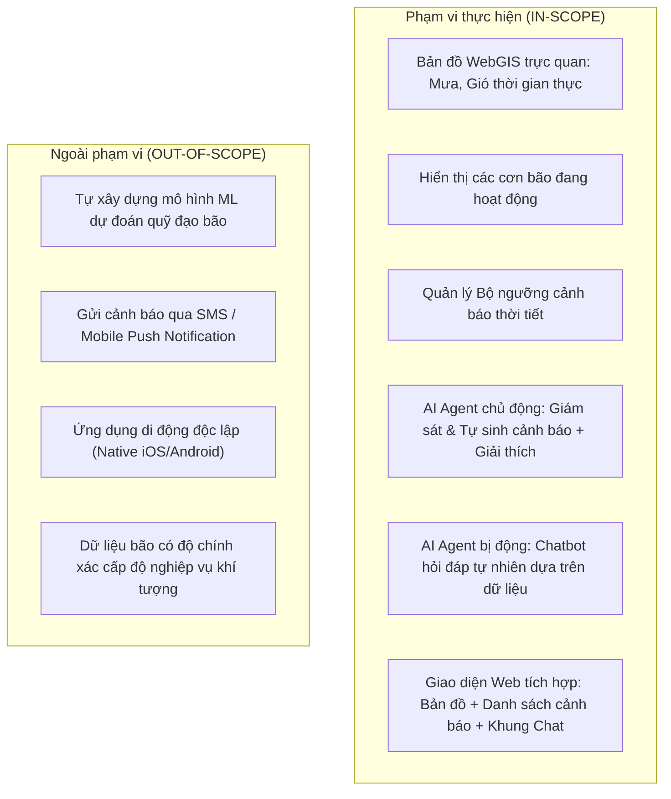
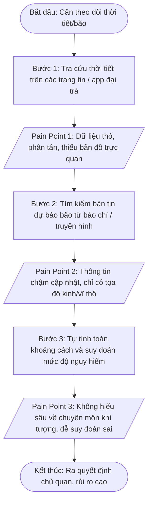
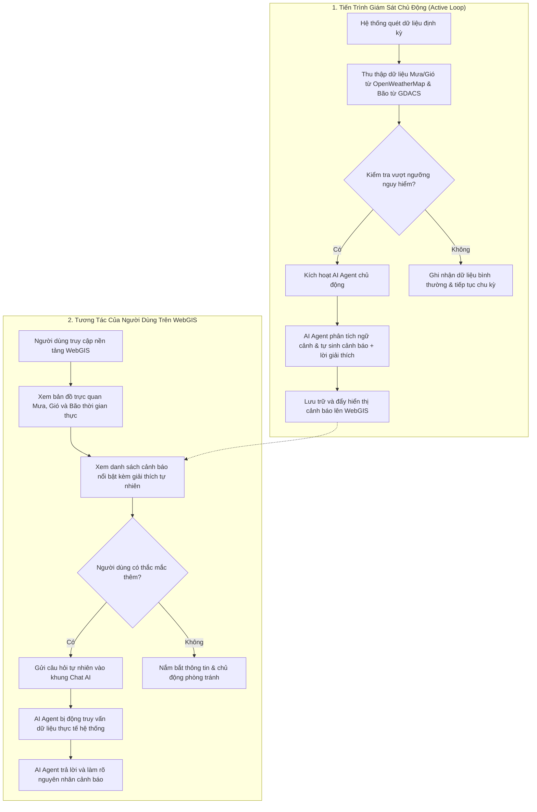

# BUSINESS REQUIREMENTS DOCUMENT (BRD)
## Hệ Thống WebGIS Giám Sát Mưa Gió Bão Tích Hợp AI Agent Cảnh Báo

---

## 1. Document Overview

* **Document Title:** Business Requirements Document (BRD) - WebGIS Giám sát Mưa Gió Bão tích hợp AI Agent cảnh báo
* **Project Name:** WebGIS for Weather Monitoring and Storm Tracking in Vietnam with AI Warning Agent
* **Version:** 1.0
* **Date:** 2026-10-03
* **Author:** Senior Business Analyst / Product Analyst
* **Status:** Baseline Review
* **Target Audience:** Product Management, Backend Engineering, Frontend Engineering, AI/ML Engineering, QA, and DevOps Teams.
* **Purpose of the Document:** 
  Tài liệu này xác định toàn bộ yêu cầu nghiệp vụ (Business Requirements), mục tiêu kinh doanh, đối tượng người dùng, phạm vi chức năng, quy tắc nghiệp vụ và các ràng buộc cốt lõi của dự án. Tài liệu đóng vai trò là nguồn chân lý duy nhất (Single Source of Truth) cấp độ kinh doanh để định hướng việc xây dựng tài liệu đặc tả yêu cầu phần mềm (SRS), thiết kế kiến trúc hệ thống và kế hoạch kiểm thử.

---

## 2. Executive Summary

Việt Nam là quốc gia có đường bờ biển dài hơn 3.260 km, thường xuyên đối mặt với các hình thái thời tiết cực đoan như bão nhiệt đới, áp thấp, mưa lớn gây ngập úng và gió giật mạnh. Mặc dù các nguồn dữ liệu khí tượng toàn cầu và khu vực hiện nay khá phong phú, nhưng thông tin thường ở dạng bảng biểu số liệu thô hoặc bản đồ chuyên ngành phức tạp, gây khó khăn cho người dân và cán bộ cơ sở trong việc nắm bắt nhanh chóng và hiểu rõ mức độ nguy hiểm đối với khu vực của mình.

Dự án **WebGIS Giám sát Mưa Gió Bão tích hợp AI Agent cảnh báo** ra đời nhằm giải quyết vấn đề trên bằng cách kết hợp:
1. **Nền tảng WebGIS trực quan:** Cho phép theo dõi không gian và thời gian thực về lượng mưa, tốc độ gió và vị trí các cơn bão đang hoạt động.
2. **AI Agent chủ động:** Liên tục giám sát số liệu, tự động phát hiện khi các chỉ số vượt ngưỡng nguy hiểm và lập tức tạo cảnh báo kèm giải thích ngữ nghĩa bằng ngôn ngữ tự nhiên.
3. **AI Agent bị động:** Hỗ trợ người dùng tra cứu, hỏi đáp tự nhiên về tình hình thời tiết và làm rõ nguyên nhân của các cảnh báo đã phát ra dựa trên dữ liệu thực tế của hệ thống.

Dự án tập trung vào trải nghiệm web trực quan, tận dụng nguồn dữ liệu mở từ OpenWeatherMap và GDACS kết hợp sức mạnh suy luận của Google Gemini API, đảm bảo cung cấp thông tin kịp thời, minh bạch và dễ tiếp cận cho người dùng.

---

## 3. Business Context

### 3.1. Bối cảnh
Thời tiết cực đoan tại Việt Nam ngày càng có xu hướng gia tăng về tần suất và cường độ do biến đổi khí hậu toàn cầu. Việc tiếp cận thông tin thời tiết chính xác, trực quan và kịp thời là yếu tố then chốt giúp cộng đồng chủ động ứng phó, bảo vệ tính mạng và tài sản.

### 3.2. Business Problem (Vấn đề kinh doanh)
* **Dữ liệu thô thiếu tính trực quan:** Người dùng bình thường không thể dễ dàng chuyển đổi các chỉ số khí tượng kỹ thuật (như áp suất khí quyển $hPa$, tốc độ gió $m/s$, lượng mưa tích lũy $mm$) thành nhận thức rủi ro thực tế.
* **Thiếu khả năng giải thích ngữ nghĩa:** Các hệ thống cảnh báo truyền thống thường chỉ đưa ra các cảnh báo dạng mã màu hoặc con số mà không giải thích rõ tại sao lại có nguy cơ, bão đang cách bao xa, hoặc tác động cụ thể đến khu vực người dùng là gì.
* **Rào cản tương tác:** Người dùng muốn biết *"khu vực nào đang mưa to nhất?"* hoặc *"vì sao trạm A lại phát cảnh báo gió cấp độ này?"* thường phải tự tìm kiếm, so sánh số liệu giữa nhiều nguồn khác nhau.

### 3.3. Root Causes (Nguyên nhân gốc rễ)
* Các ứng dụng thời tiết đại trà thường tập trung vào dự báo nhiệt độ hàng ngày dưới dạng danh sách văn bản, thiếu lớp bản đồ GIS trực quan theo thời gian thực cho mưa/gió/bão.
* Chưa có sự kết hợp hiệu quả giữa công nghệ địa không gian (GIS) và mô hình ngôn ngữ lớn (LLM / AI Agent) để chuyển hóa dữ liệu số học thành thông tin cảnh báo tự nhiên, dễ hiểu.

### 3.4. Current Situation (Hiện trạng)
* Người dùng phụ thuộc vào các bản tin phát thanh, truyền hình định kỳ (vốn có độ trễ) hoặc các ứng dụng quốc tế hiển thị thông tin chung chung, khó tra cứu chuyên sâu về bão và mưa cực đoan theo tọa độ cụ thể.
* Quy trình theo dõi thời tiết đòi hỏi nhiều bước tra cứu thủ công và suy diễn cá nhân.

### 3.5. Why the Project is Needed (Tính cấp thiết)
Cần có một nền tảng WebGIS tập trung hóa dữ liệu mưa, gió, bão thời gian thực tại Việt Nam, tích hợp trợ lý AI thông minh đóng vai trò như một chuyên viên diễn giải dữ liệu 24/7, tự động phát hiện rủi ro và giải đáp thắc mắc của người dân một cách tức thì.

---

## 4. Business Objectives

| Objective ID | Description | Expected Outcome | Measurement / KPI |
| :--- | :--- | :--- | :--- |
| **OBJ-01** | Trực quan hóa dữ liệu mưa và gió theo thời gian thực trên nền tảng bản đồ số. | Người dùng có thể quan sát trực tiếp phân bố và cường độ mưa, gió tại các trạm/khu vực trên toàn lãnh thổ Việt Nam. | **TBD** *(Chưa có số liệu KPI cụ thể từ tài liệu đầu vào)* |
| **OBJ-02** | Giám sát vị trí và hiện trạng các cơn bão đang hoạt động trên biển Đông và khu vực lân cận. | Người dùng nắm bắt được vị trí tâm bão và tình trạng bão đang hoạt động để chủ động theo dõi nguy cơ. | **TBD** *(Chưa có số liệu KPI cụ thể từ tài liệu đầu vào)* |
| **OBJ-03** | Tự động hóa phát hiện rủi ro và sinh cảnh báo thời tiết kèm giải thích bằng ngôn ngữ tự nhiên. | Giảm thiểu thời gian từ khi số liệu vượt ngưỡng nguy hiểm đến khi cảnh báo dễ hiểu được gửi tới người dùng. | **TBD** *(Chưa có số liệu KPI cụ thể từ tài liệu đầu vào)* |
| **OBJ-04** | Cung cấp kênh hỏi đáp tự nhiên (AI Q&A) dựa trên dữ liệu khí tượng thực tế của hệ thống. | Người dùng được giải đáp tức thì các thắc mắc về tình hình thời tiết và lý do phát sinh cảnh báo mà không cần hiểu sâu về kỹ thuật khí tượng. | **TBD** *(Chưa có số liệu KPI cụ thể từ tài liệu đầu vào)* |

---

## 5. Stakeholders

| Stakeholder | Role | Responsibility | Interest | Influence |
| :--- | :--- | :--- | :--- | :--- |
| **Product Owner / Project Sponsor** | Chủ dự án / Quản lý sản phẩm | Định hướng mục tiêu, phê duyệt phạm vi, ngân sách và đánh giá kết quả bàn giao. | High | High |
| **Development Team (BE/FE/GIS)** | Đội ngũ kỹ thuật phát triển | Thiết kế kiến trúc, xây dựng hệ thống WebGIS, tích hợp API dữ liệu và giao diện web. | High | High |
| **AI / Data Engineering Team** | Kỹ sư AI / Xử lý dữ liệu | Tích hợp Gemini API, xây dựng cơ chế Grounding, Prompt Engineering cho AI Agent chủ động & bị động. | High | High |
| **QA / Testing Team** | Đội ngũ đảm bảo chất lượng | Kiểm thử chức năng, tính chính xác của ngưỡng cảnh báo và chất lượng câu trả lời của AI. | High | Medium |
| **DevOps / Infra Team** | Đội ngũ vận hành hệ thống | Triển khai hạ tầng server, cơ sở dữ liệu GIS, quản lý uptime và chi phí tài nguyên API. | Medium | Medium |
| **End Users (Người dân / Cộng đồng)** | Người sử dụng cuối | Truy cập website theo dõi bản đồ thời tiết, đọc cảnh báo và tương tác với AI chat. | High | Low |
| **Third-Party Data Providers (OpenWeatherMap, GDACS, Google)** | Đơn vị cung ứng dịch vụ ngoài | Cung cấp nguồn cấp dữ liệu thời tiết, dữ liệu bão và API mô hình ngôn ngữ lớn. | Medium | High |

---

## 6. User / Actor Analysis

### 6.1. Primary Users (Người dùng chính)
* **Đại diện:** Người dân tại các khu vực chịu ảnh hưởng bởi mưa bão, người có nhu cầu theo dõi thời tiết để lập kế hoạch sinh hoạt/di chuyển.
* **Nhu cầu:** Nắm bắt nhanh khu vực nào đang mưa lớn, gió mạnh, bão có đang tiến vào đất liền không, và cảnh báo hiện tại có ý nghĩa gì.
* **Mục tiêu:** Đưa ra quyết định ứng phó an toàn cho bản thân và gia đình.
* **Tương tác chính:** Xem bản đồ WebGIS, bật/tắt các lớp mưa/gió/bão, đọc danh sách cảnh báo trên web, gõ câu hỏi vào hộp thoại AI chat.

### 6.2. Secondary Users (Người dùng thứ cấp - *Assumption*)
* **Đại diện:** Điều phối viên cộng đồng, người quản lý nhóm tình nguyện cứu trợ hoặc phụ trách an toàn cơ sở.
* **Nhu cầu:** Tra cứu nhanh dữ liệu thời tiết cục bộ và lý do cảnh báo tại nhiều địa điểm để điều phối hoạt động.
* **Mục tiêu:** Cập nhật thông tin nhanh chóng để hỗ trợ đưa ra khuyến nghị an toàn cho nhóm.
* **Tương tác chính:** Tra cứu dữ liệu trạm, đối thoại với AI để làm rõ nguyên nhân các đợt cảnh báo vượt ngưỡng.

### 6.3. Internal Stakeholders (Quản trị viên hệ thống - *Assumption*)
* **Đại diện:** Quản trị viên kỹ thuật / Vận hành hệ thống (System Administrator).
* **Nhu cầu:** Quản lý tham số bộ ngưỡng cảnh báo (mưa, gió, khoảng cách bão), giám sát tiến trình quét tự động.
* **Mục tiêu:** Đảm bảo hệ thống cảnh báo vận hành liên tục và ổn định.
* **Tương tác chính:** Cấu hình thông số ngưỡng rủi ro, theo dõi log hoạt động của các worker định kỳ.

### 6.4. External / System Actors (Hệ thống bên ngoài)
* **OpenWeatherMap API:** Cung cấp dữ liệu quan trắc thời tiết thời gian thực (lượng mưa, tốc độ gió, nhiệt độ, áp suất) theo tọa độ.
* **GDACS (Global Disaster Alert and Coordination System):** Cung cấp dữ liệu về các cơn bão đang hoạt động (vị trí tâm bão, cấp độ, tốc độ gió tối đa).
* **Google Gemini API:** Tiếp nhận dữ liệu khí tượng và bối cảnh cảnh báo để sinh văn bản giải thích tự nhiên (cho Agent chủ động) và trả lời câu hỏi của người dùng (cho Agent bị động).
* **Periodic Monitoring Worker (Cron Engine nội bộ):** Tiến trình hệ thống chạy ngầm định kỳ thu thập dữ liệu và so sánh với bộ ngưỡng cảnh báo.

---

## 7. Scope

### 7.1. In-Scope (Phạm vi thực hiện)
Theo tài liệu định hướng dự án, các thành phần sau nằm hoàn toàn trong phạm vi phát triển:
1. **Bản đồ WebGIS hiển thị dữ liệu thời tiết:** Trực quan hóa dữ liệu mưa và gió theo thời gian thực trên nền tảng bản đồ web.
2. **Hiển thị bão:** Thể hiện trực quan các cơn bão đang hoạt động (active storms) trên bản đồ số.
3. **Bộ ngưỡng cảnh báo:** Thiết lập và quản lý các tham số ngưỡng nguy hiểm đối với mưa lớn, gió mạnh và bão tiến gần.
4. **AI Agent chủ động (Proactive AI Agent):** 
   - Tiến trình định kỳ giám sát dữ liệu thời tiết và bão.
   - Tự động phát hiện khi các chỉ số vượt ngưỡng nguy hiểm.
   - Tự động sinh cảnh báo và giải thích nguyên nhân bằng ngôn ngữ tự nhiên.
5. **AI Agent bị động (Passive / Interactive AI Agent):** 
   - Nhận câu hỏi tự nhiên từ người dùng thông qua khung chat.
   - Trả lời dựa trên dữ liệu thực tế đang có trong hệ thống (grounded data).
   - Giải thích chi tiết về nguyên nhân một cảnh báo cụ thể đã phát ra.
6. **Giao diện hợp nhất trên Web:** Tích hợp đồng thời bản đồ tương tác, khu vực hiển thị danh sách cảnh báo, và giao diện chat với AI trên cùng một ứng dụng web.

### 7.2. Out-of-Scope (Phạm vi không thực hiện)
Dự án xác định rõ ràng các hạng mục sau **không** thực hiện nhằm tránh phình phạm vi (Scope Creep):
1. **Không tự nghiên cứu/xây dựng mô hình Machine Learning dự đoán quỹ đạo bão:** Dữ liệu bão được tiếp nhận nguyên bản từ nguồn bên ngoài (GDACS), không tự tính toán đường đi bão.
2. **Không phát triển cơ chế gửi cảnh báo real-time qua SMS hoặc Mobile Push Notification:** Cảnh báo chỉ hiển thị trực tiếp trên giao diện web của hệ thống.
3. **Không xây dựng ứng dụng di động riêng biệt (Native Mobile Apps):** Hệ thống chỉ tập trung vào nền tảng Web; giao diện trên thiết bị di động chỉ duy trì ở mức responsive cơ bản.
4. **Không cam kết dữ liệu bão đạt độ chính xác cấp độ nghiệp vụ khí tượng:** Dữ liệu mang tính chất tham khảo, tổng hợp từ các dịch vụ quốc tế mở, không thay thế dữ liệu từ Trung tâm Dự báo Khí tượng Thủy văn Quốc gia.

### 7.3. Scope Boundary (Ranh giới hệ thống)
* Hệ thống đóng vai trò là **tầng xử lý trung gian, trực quan hóa và trợ lý ngữ nghĩa thông minh**.
* Hệ thống **không** sở hữu cảm biến phần cứng (IoT/Radar) đo đạc trực tiếp và **không** chịu trách nhiệm pháp lý đối với việc dự báo thiên tai quốc gia.

---

## 8. Current Business Process (AS-IS)

Quy trình theo dõi thời tiết và nhận định nguy cơ hiện tại của người dùng khi chưa có hệ thống:

### Chi tiết các bước quy trình AS-IS:

#### Bước 1: Tra cứu dữ liệu thời tiết
1. **Actor:** Người dùng cuối (Người dân).
2. **Action:** Mở các ứng dụng thời tiết mặc định trên điện thoại hoặc truy cập báo điện tử để xem thông tin tại địa phương.
3. **Input:** Vị trí hiện tại hoặc tên thành phố/tỉnh.
4. **Output:** Nhiệt độ, tỷ lệ phần trăm khả năng có mưa, vận tốc gió theo bảng danh sách.
5. **Pain point:** Không nhìn thấy bức tranh tổng thể về vùng mưa, hướng di chuyển của gió trên không gian địa lý; các con số tách rời nhau.

#### Bước 2: Theo dõi diễn biến cơn bão
1. **Actor:** Người dùng cuối.
2. **Action:** Tìm đọc các bản tin bão khẩn cấp trên các phương tiện truyền thông khi nghe tin có bão trên biển Đông.
3. **Input:** Tên bão hoặc số hiệu bão.
4. **Output:** Đoạn văn bản mô tả tọa độ tâm bão (ví dụ: $16.5^\circ N, 112.0^\circ E$), cấp gió giật cấp 12 - 14.
5. **Pain point:** Người dùng không định vị được tọa độ đó cách nơi mình ở bao xa, khi nào bão ảnh hưởng đến đất liền, và khu vực nào lân cận sẽ bị mưa to nhất.

#### Bước 3: Phân tích nguy cơ và giải mã cảnh báo
1. **Actor:** Người dùng cuối.
2. **Action:** Tự đánh giá mức độ nguy hiểm đối với bản thân dựa trên cảm tính hoặc hỏi người xung quanh.
3. **Input:** Bản tin văn bản và nhận thức cá nhân.
4. **Output:** Quyết định phòng chống hoặc di chuyển.
5. **Pain point:** Dễ đánh giá thấp hoặc phóng đại nguy cơ do thiếu công cụ phân tích tự động; không có kênh tương tác hỏi đáp để được giải thích cặn kẽ nguyên nhân cảnh báo.

---

## 9. Proposed Business Process (TO-BE)

### 9.1. Quy trình tổng thể TO-BE

### 9.2. Chi tiết các quy trình con

#### Quy trình 1: Giám sát định kỳ & Tự động phát cảnh báo (Active Workflow)
1. **Actor:** Monitoring Worker & Proactive AI Agent.
2. **Action:** Tiến trình ngầm định kỳ lấy dữ liệu thời tiết và bão, so sánh với bộ ngưỡng cảnh báo.
3. **Input:** Dữ liệu mưa, gió (OpenWeatherMap API), dữ liệu bão (GDACS API), bảng cấu hình ngưỡng nguy hiểm.
4. **Business decision / rule:**
   - Nếu Lượng mưa $\ge$ Ngưỡng mưa nguy hiểm, HOẶC Tốc độ gió $\ge$ Ngưỡng gió mạnh, HOẶC Bão tiến gần khu vực giám sát $\le$ Ngưỡng khoảng cách an toàn: **Kích hoạt phát cảnh báo**.
5. **Output:** Bản ghi cảnh báo mới chứa nội dung phân tích và giải thích bằng ngôn ngữ tự nhiên từ AI Agent.
6. **Expected business outcome:** Thông tin rủi ro được phát hiện tức thời, loại bỏ sự phụ thuộc vào việc trực số liệu thủ công.

#### Quy trình 2: Khám phá trực quan trên WebGIS (Visual Exploration Workflow)
1. **Actor:** Người dùng cuối.
2. **Action:** Người dùng điều hướng trên bản đồ số (phóng to, thu nhỏ, di chuyển), bật/tắt các lớp thông tin mưa, gió và vị trí bão.
3. **Input:** Thao tác tương tác chuột/cảm ứng của người dùng.
4. **Business decision / rule:** Chỉ hiển thị các cơn bão có trạng thái đang hoạt động (active); dữ liệu mưa/gió được cập nhật theo mốc thời gian gần nhất của hệ thống.
5. **Output:** Giao diện trực quan phản ánh tình trạng khí tượng không gian.
6. **Expected business outcome:** Người dùng nắm bắt tổng thể bức tranh thời tiết trong vài giây quan sát.

#### Quy trình 3: Hỏi đáp và làm rõ cảnh báo qua AI Chat (Passive Workflow)
1. **Actor:** Người dùng cuối & Interactive AI Agent.
2. **Action:** Người dùng nhập câu hỏi vào hộp thoại chat (ví dụ: *"Khu vực nào đang mưa lớn nhất?"*, *"Tại sao trạm Đà Nẵng lại có cảnh báo gió giật?"*).
3. **Input:** Câu hỏi ngôn ngữ tự nhiên của người dùng, ngữ cảnh dữ liệu hiện hành trong hệ thống, dữ liệu các cảnh báo đã phát.
4. **Business decision / rule:** AI Agent bắt buộc phải suy luận và trả lời dựa trên dữ liệu thực tế lưu trữ trong hệ thống (Grounding Rule), không tự ý suy diễn các con số không tồn tại.
5. **Output:** Câu trả lời tự nhiên, rõ ràng, giải thích cặn kẽ nguyên nhân và số liệu đo đạc thực tế.
6. **Expected business outcome:** Giải đáp thắc mắc người dùng ngay lập tức, tăng độ tin cậy và hiểu biết về rủi ro thời tiết.

---

## 10. Business Requirements

| ID | Requirement | Business Rationale | Priority | Source | Acceptance Criteria |
| :--- | :--- | :--- | :--- | :--- | :--- |
| **BR-001** | Hệ thống phải trực quan hóa dữ liệu mưa thời gian thực trên bản đồ WebGIS. | Giúp người dùng quan sát được vị trí và cường độ mưa theo không gian địa lý thay vì chỉ đọc số liệu dạng bảng. | **Must Have** | Scope 1.2 (Confirmed) | Bản đồ hiển thị được lớp thông tin mưa tại các điểm/vùng giám sát với dữ liệu được cập nhật từ nguồn thời tiết thời gian thực. |
| **BR-002** | Hệ thống phải trực quan hóa dữ liệu gió thời gian thực trên bản đồ WebGIS. | Giúp người dùng nắm bắt tốc độ và hướng gió để phòng ngừa nguy cơ dông lốc, gió giật. | **Must Have** | Scope 1.2 (Confirmed) | Bản đồ hiển thị được lớp thông tin gió (tốc độ, hướng) thời gian thực tại các điểm giám sát. |
| **BR-003** | Hệ thống phải hiển thị các cơn bão đang hoạt động trên bản đồ WebGIS. | Cung cấp nhận thức không gian về vị trí tâm bão đối với các vùng ven biển và đất liền Việt Nam. | **Must Have** | Scope 1.2 (Confirmed) | Mọi cơn bão có trạng thái hoạt động (active) từ nguồn bão phải được định vị trực quan trên bản đồ kèm thông tin cấp độ/tên bão. |
| **BR-004** | Hệ thống phải duy trì một bộ quy tắc ngưỡng cảnh báo rủi ro thời tiết. | Làm tiêu chuẩn căn cứ để xác định khi nào điều kiện thời tiết chuyển sang mức độ nguy hiểm cần thông báo. | **Must Have** | Scope 1.2 (Confirmed) | Hệ thống có danh mục cấu hình các ngưỡng đo lường nguy hiểm (đối với mưa lớn, gió mạnh, bão tiếp cận) để làm căn cứ kích hoạt cảnh báo. |
| **BR-005** | Hệ thống phải có cơ chế giám sát định kỳ tự động phát hiện số liệu vượt ngưỡng nguy hiểm. | Đảm bảo tính liên tục và loại bỏ việc giám sát thủ công của con người. | **Must Have** | Scope 1.2 (Confirmed) | Tiến trình tự động quét định kỳ phát hiện chính xác khi có bản ghi thời tiết hoặc thông số bão chạm/vượt ngưỡng định trước. |
| **BR-006** | AI Agent phải tự động sinh cảnh báo và giải thích bằng ngôn ngữ tự nhiên khi dữ liệu vượt ngưỡng. | Chuyển đổi số liệu đo lường kỹ thuật thành thông điệp cảnh báo dễ hiểu, nêu rõ lý do nguy hiểm cho cộng đồng. | **Must Have** | Scope 1.1, 1.2 (Confirmed) | Cảnh báo được sinh ra tự động, có tiêu đề rủi ro và đoạn văn bản giải thích ngữ nghĩa tự nhiên, liên kết rõ ràng với chỉ số gây vượt ngưỡng. |
| **BR-007** | Hệ thống phải tiếp nhận câu hỏi bằng ngôn ngữ tự nhiên từ người dùng qua khung chat và trả lời dựa trên dữ liệu hệ thống. | Cho phép người dùng tra cứu dữ liệu linh hoạt mà không cần tự thao tác lọc dữ liệu phức tạp. | **Must Have** | Scope 1.1, 1.2 (Confirmed) | Người dùng gửi câu hỏi (tiếng Việt), AI Agent phản hồi câu trả lời chính xác dựa trên dữ liệu thời tiết/bão hiện hành trong hệ thống. |
| **BR-008** | AI Agent phải có khả năng giải thích chi tiết nguyên nhân phát sinh của một cảnh báo cụ thể khi người dùng yêu cầu. | Giúp người dùng hiểu tường tận bối cảnh rủi ro (vì sao có cảnh báo đó, dựa trên thông số nào). | **Must Have** | Scope 1.1, 1.2 (Confirmed) | Khi người dùng hỏi về một cảnh báo đã phát, AI Agent phân tích và giải thích được nguyên nhân gốc dựa trên dữ liệu đo lường liên kết. |
| **BR-009** | Giao diện web phải tích hợp đồng bộ giữa bản đồ số, khu vực hiển thị cảnh báo và khung chat AI. | Cung cấp trải nghiệm người dùng liền mạch trên cùng một màn hình làm việc tập trung. | **Must Have** | Scope 1.2 (Confirmed) | Người dùng có thể vừa xem bản đồ, vừa theo dõi danh sách cảnh báo, vừa thực hiện trò chuyện với AI chat trên một giao diện thống nhất. |
| **BR-010** | Hệ thống phải hiển thị rõ thông báo miễn trừ trách nhiệm pháp lý về độ chính xác nghiệp vụ khí tượng. | Tránh hiểu lầm rằng hệ thống thay thế cơ quan dự báo quốc gia và bảo vệ dự án về mặt pháp lý. | **Should Have** | Scope 1.3 (Assumption) | Giao diện hiển thị rõ nguồn dữ liệu tham khảo và thông báo dữ liệu mang tính tham khảo cộng đồng. |

---

## 11. Functional Business Requirements

Các yêu cầu nghiệp vụ được chuẩn hóa theo cấu trúc bắt buộc:
$$\text{Actor} \longrightarrow \text{Action} \longrightarrow \text{Business Need / Outcome} \longrightarrow \text{Business Rule / Constraint}$$

---

### 11.1. BR-MAP — Trực quan hóa Địa không gian (WebGIS Visualization)

* **Business Objective:** Cung cấp trải nghiệm theo dõi trực quan dữ liệu khí tượng mưa và gió theo không gian thời gian thực.
* **Actors:** Người dùng cuối (End User).

#### Business Requirements:
* **BR-MAP-01:** Người dùng $\longrightarrow$ Xem bản đồ thời tiết $\longrightarrow$ Nắm bắt trực quan lượng mưa tại các trạm/khu vực trên toàn quốc $\longrightarrow$ Dữ liệu phản ánh trạng thái thời gian thực được thu thập gần nhất từ nhà cung cấp thời tiết.
* **BR-MAP-02:** Người dùng $\longrightarrow$ Xem bản đồ thời tiết $\longrightarrow$ Nắm bắt trực quan tốc độ và hướng gió tại các trạm/khu vực $\longrightarrow$ Hướng gió và vận tốc gió được hiển thị rõ ràng trên bản đồ.
* **BR-MAP-03:** Người dùng $\longrightarrow$ Thao tác phóng to, thu nhỏ và di chuyển bản đồ $\longrightarrow$ Khám phá dữ liệu chi tiết theo từng khu vực địa lý cụ thể $\longrightarrow$ Bản đồ phải hỗ trợ điều hướng mượt mà trên nền tảng web.

#### Business Rules:
* Dữ liệu thời tiết trên bản đồ phải gắn liền với vị trí tọa độ địa lý xác định (WGS84).
* Dữ liệu hiển thị phải đồng bộ với chu kỳ cập nhật dữ liệu gần nhất của hệ thống.

#### Expected Outcome:
Người dùng quan sát được toàn cảnh diễn biến mưa gió mà không phải đọc các bảng thống kê số liệu rời rạc.

---

### 11.2. BR-STORM — Giám sát & Quản lý Thông tin Bão (Storm Tracking)

* **Business Objective:** Nhận biết vị trí và diễn biến các cơn bão đang hoạt động có nguy cơ ảnh hưởng đến Việt Nam.
* **Actors:** Người dùng cuối, Hệ thống thu thập bão (Storm Ingestion Worker).

#### Business Requirements:
* **BR-STM-01:** Hệ thống $\longrightarrow$ Thu thập và cập nhật thông tin bão từ nguồn quốc tế (GDACS) $\longrightarrow$ Duy trì danh mục các cơn bão đang hoạt động trên hệ thống $\longrightarrow$ Chỉ thu nạp các cơn bão có trạng thái đang hoạt động (active storms).
* **BR-STM-02:** Người dùng $\longrightarrow$ Xem lớp thông tin bão trên WebGIS $\longrightarrow$ Nhận biết vị trí tâm bão, tên bão và cấp độ bão trong tương quan với lãnh thổ Việt Nam $\longrightarrow$ Phải hiển thị rõ ràng vị trí tâm bão hiện tại trên bản đồ.

#### Business Rules:
* **Rule BR-RULE-01:** Chỉ các cơn bão đang hoạt động (active) mới được hiển thị trên bản đồ cảnh báo chính. Các cơn bão đã tan hoặc suy yếu hoàn toàn sẽ không được biểu diễn ở chế độ theo dõi khẩn cấp.
* **Constraint:** Hệ thống không tự tính toán hay dự đoán quỹ đạo bão; chỉ hiển thị dữ liệu do GDACS cung cấp.

#### Expected Outcome:
Người dùng nắm được thông tin định vị cơn bão để chủ động đề phòng.

---

### 11.3. BR-ALERT — Quản lý Ngưỡng & Giám Sát Cảnh Báo (Alerts & Thresholds)

* **Business Objective:** Tự động hóa phát hiện rủi ro khí tượng vượt ngưỡng để sinh cảnh báo kịp thời.
* **Actors:** Quản trị viên (Cấu hình), Tiến trình giám sát ngầm (Monitoring Worker).

#### Business Requirements:
* **BR-ALT-01:** Quản trị viên $\longrightarrow$ Thiết lập các tham số trong bộ ngưỡng cảnh báo $\longrightarrow$ Quy định giới hạn định lượng để hệ thống kích hoạt trạng thái nguy hiểm $\longrightarrow$ Ngưỡng bao gồm: mức mưa nguy hiểm, tốc độ gió nguy hiểm và bán kính bão tiếp cận (Giá trị số cụ thể: *TBD*).
* **BR-ALT-02:** Tiến trình giám sát ngầm $\longrightarrow$ Quét định kỳ dữ liệu quan trắc $\longrightarrow$ Phát hiện các điểm đo hoặc sự kiện vượt ngưỡng quy định $\longrightarrow$ Chu kỳ quét phải được thực hiện tự động và liên tục.
* **BR-ALT-03:** Tiến trình giám sát $\longrightarrow$ Kích hoạt phát sinh cảnh báo $\longrightarrow$ Đưa sự kiện rủi ro vào hàng đợi để AI Agent tạo nội dung cảnh báo $\longrightarrow$ Sự kiện cảnh báo phải gắn với thời điểm, địa điểm và chỉ số gây vượt ngưỡng cụ thể.

#### Business Rules:
* **Rule BR-RULE-02:** Ngưỡng cảnh báo bắt buộc phải bao quát 3 yếu tố rủi ro: Mưa lớn, Gió mạnh, và Bão tiến gần.
* Cảnh báo chỉ được phát sinh khi có ít nhất một chỉ số thực tế chạm hoặc vượt ngưỡng cấu hình.

#### Expected Outcome:
Loại bỏ hoàn toàn sự chậm trễ do chờ con người đọc số liệu; rủi ro được phát hiện ngay khi dữ liệu được nạp vào.

---

### 11.4. BR-AGENT — AI Agent Đa Chế Độ (Active & Passive AI Agent)

* **Business Objective:** Trí tuệ hóa hệ thống cảnh báo và hỗ trợ người dùng bằng ngôn ngữ tự nhiên.
* **Actors:** AI Agent (Chủ động & Bị động), Người dùng cuối.

#### Business Requirements:
* **BR-AGT-01 (Chủ động):** AI Agent $\longrightarrow$ Tiếp nhận dữ liệu sự kiện vượt ngưỡng $\longrightarrow$ Tự động sinh nội dung cảnh báo kèm giải thích ngữ nghĩa bằng ngôn ngữ tự nhiên $\longrightarrow$ Nội dung phải giải thích rõ ràng tại sao chỉ số này gây nguy hiểm và khuyến nghị cơ bản, sử dụng ngôn ngữ tiếng Việt tự nhiên.
* **BR-AGT-02 (Bị động):** Người dùng $\longrightarrow$ Gửi câu hỏi ngôn ngữ tự nhiên về tình hình thời tiết $\longrightarrow$ Nhận câu trả lời chính xác, dễ hiểu $\longrightarrow$ AI Agent bắt buộc phải suy luận dựa trên dữ liệu thực tế đang có trong hệ thống (Grounding Rule), không tự bịa đặt số liệu.
* **BR-AGT-03 (Bị động - Giải thích cảnh báo):** Người dùng $\longrightarrow$ Yêu cầu giải thích về một cảnh báo cụ thể đã phát $\longrightarrow$ Hiểu rõ căn cứ và nguyên nhân của cảnh báo đó $\longrightarrow$ AI Agent phải truy vấn đúng bản ghi cảnh báo và dữ liệu quan trắc liên quan để diễn giải chi tiết.

#### Business Rules:
* **Rule BR-RULE-03:** Mọi cảnh báo phát sinh từ hệ thống bắt buộc phải đi kèm đoạn văn bản giải thích bằng ngôn ngữ tự nhiên do AI tạo ra (không được phát cảnh báo chỉ có mã lỗi hoặc con số thô).
* **Rule BR-RULE-04 (Grounding Rule):** Toàn bộ câu trả lời của AI Agent trong hội thoại chat phải dựa trên dữ liệu thời tiết, bão và cảnh báo thực tế được lưu trữ trong hệ thống; nghiêm cấm hallucination (tự bịa đặt) về thông số khí tượng.

#### Expected Outcome:
Người dùng bình thường không cần kiến thức khí tượng chuyên sâu vẫn hiểu rõ mức độ nguy hiểm và được giải đáp thắc mắc 24/7.

---

### 11.5. BR-UI — Giao Diện Người Dùng Hợp Nhất (Unified Web Experience)

* **Business Objective:** Cung cấp trải nghiệm tập trung, tiện lợi trên một màn hình ứng dụng web duy nhất.
* **Actors:** Người dùng cuối.

#### Business Requirements:
* **BR-UI-01:** Người dùng $\longrightarrow$ Truy cập ứng dụng web $\longrightarrow$ Xem đồng thời bản đồ WebGIS và khu vực hiển thị danh sách các cảnh báo hiện hành $\longrightarrow$ Cảnh báo mới nhất phải được làm nổi bật trên giao diện.
* **BR-UI-02:** Người dùng $\longrightarrow$ Mở khung chat trên giao diện web $\longrightarrow$ Tương tác hội thoại hỏi đáp với AI Agent $\longrightarrow$ Khung chat phải tích hợp trực tiếp trên web mà không làm gián đoạn việc xem bản đồ.
* **BR-UI-03:** Người dùng $\longrightarrow$ Sử dụng hệ thống trên trình duyệt máy tính hoặc thiết bị di động $\longrightarrow$ Tiếp cận được các tính năng cơ bản của bản đồ và chat $\longrightarrow$ Giao diện web phải hỗ trợ hiển thị responsive ở mức cơ bản (Basic Responsive Web).

#### Business Rules:
* Không xây dựng ứng dụng di động native riêng biệt (tuân thủ giới hạn Out-of-Scope).

#### Expected Outcome:
Giao diện trực quan, trực tiếp, người dùng không cần cài đặt ứng dụng phức tạp.

---

## 12. Business Rules

| Rule ID | Business Rule | Applies To | Reason / Source |
| :--- | :--- | :--- | :--- |
| **BR-RULE-001** | Chỉ theo dõi và trực quan hóa các cơn bão có trạng thái đang hoạt động (active storms). Bão đã tan hoặc suy yếu hoàn toàn không nằm trong diện cảnh báo bão trực tiếp. | BR-STM-01, BR-STM-02 | Tránh làm nhiễu thông tin cảnh báo khẩn cấp cho người dùng (Confirmed from Scope 1.2). |
| **BR-RULE-002** | Hệ thống bắt buộc phải duy trì bộ ngưỡng cảnh báo nguy hiểm áp dụng cho cả 3 đối tượng rủi ro: Mưa lớn, Gió mạnh, và Bão tiến gần. | BR-ALT-01, BR-ALT-02 | Đảm bảo tính toàn diện của hệ thống giám sát thời tiết cực đoan (Confirmed from Scope 1.1). |
| **BR-RULE-003** | Mọi cảnh báo phát sinh từ hệ thống bắt buộc phải chứa tiêu đề rủi ro và nội dung giải thích bằng ngôn ngữ tự nhiên do AI Agent tự động tạo ra. | BR-AGT-01, BR-UI-01 | Loại bỏ rào cản kỹ thuật của số liệu thô đối với người dân (Confirmed from Scope 1.1). |
| **BR-RULE-004** | Toàn bộ phản hồi của AI Agent (cả chủ động cảnh báo và bị động đối thoại) phải được căn cứ (grounded) trên dữ liệu thực tế có trong hệ thống, không tự sinh số liệu thời tiết. | BR-AGT-01, BR-AGT-02, BR-AGT-03 | Tránh tình trạng AI hallucination gây hoang mang dư luận (Core Business Safety Rule). |
| **BR-RULE-005** | Hệ thống chỉ phát cảnh báo trực quan trên giao diện ứng dụng web; không phát cảnh báo qua SMS hoặc thông báo đẩy (Push Notification) di động. | BR-UI-01 | Tuân thủ tuyệt đối ranh giới phạm vi dự án (Confirmed from Scope 1.3). |
| **BR-RULE-006** | Dữ liệu thời tiết và bão hiển thị trên hệ thống phải ghi rõ nguồn gốc (OpenWeatherMap, GDACS) kèm khuyến cáo chỉ mang tính chất tham khảo. | BR-010, BR-MAP-01, BR-STM-02 | Tuân thủ quy định về pháp lý thông tin khí tượng tham khảo (Confirmed from Scope 1.3). |

---

## 13. Data Requirements

Mô tả các yêu cầu dữ liệu ở góc độ nghiệp vụ kinh doanh:

### 13.1. Phân loại dữ liệu nghiệp vụ
1. **Dữ liệu quan trắc thời tiết điểm (Weather Records):**
   * *Nội dung:* Lượng mưa (1h, 3h), tốc độ gió, hướng gió, gió giật, nhiệt độ, độ ẩm, áp suất khí quyển.
   * *Nguồn cung cấp:* OpenWeatherMap API.
   * *Mục đích sử dụng:* Hiển thị bản đồ thời tiết thời gian thực và làm căn cứ so sánh ngưỡng cảnh báo.
   * *Data Owner:* Bên thứ ba (OpenWeatherMap). Hệ thống lưu trữ bản sao phục vụ nghiệp vụ.
2. **Dữ liệu sự kiện bão (Storm Records):**
   * *Nội dung:* Mã bão, tên bão, năm, cấp độ bão, tốc độ gió tối đa, áp suất tâm bão, trạng thái hoạt động (active/dissipated), tọa độ tâm bão hiện tại.
   * *Nguồn cung cấp:* GDACS (Global Disaster Alert and Coordination System).
   * *Mục đích sử dụng:* Hiển thị bão trên bản đồ và giám sát khoảng cách tiếp cận đất liền.
   * *Data Owner:* Bên thứ ba (GDACS).
3. **Dữ liệu cấu hình ngưỡng cảnh báo (Alert Thresholds):**
   * *Nội dung:* Chỉ số mưa nguy hiểm ($mm$), chỉ số tốc độ gió nguy hiểm ($m/s$ hoặc cấp gió), bán kính khoảng cách bão tiếp cận ($km$).
   * *Nguồn cung cấp:* Ban quản trị dự án / Quản trị viên hệ thống.
   * *Mục đích sử dụng:* Điều kiện logic để kích hoạt AI Agent chủ động.
   * *Data Owner:* Dự án WebGIS.
4. **Dữ liệu cảnh báo phát sinh (Alert Logs):**
   * *Nội dung:* Thời điểm phát cảnh báo, vị trí/trạm bị ảnh hưởng, loại rủi ro, chỉ số vượt ngưỡng, nội dung giải thích bằng văn bản do AI sinh ra.
   * *Nguồn cung cấp:* Hệ thống giám sát kết hợp Gemini API.
   * *Mục đích sử dụng:* Hiển thị trên giao diện web và làm dữ liệu ngữ cảnh cho AI chat giải thích.
   * *Data Owner:* Dự án WebGIS.
5. **Dữ liệu hội thoại người dùng (Chat Interaction):**
   * *Nội dung:* Câu hỏi của người dùng, câu trả lời của AI Agent, ngữ cảnh phiên trò chuyện.
   * *Nguồn cung cấp:* Người dùng cuối và Gemini API.
   * *Mục đích sử dụng:* Phục vụ trải nghiệm hỏi đáp và phân tích cải thiện chất lượng AI.
   * *Data Owner:* Dự án WebGIS / Người dùng.

### 13.2. Data Retention & Privacy (Lưu trữ và Bảo mật)
* **Thời gian lưu trữ (Retention):** **TBD** *(Chưa có quy định cụ thể từ tài liệu đầu vào về thời gian lưu lịch sử thời tiết và cảnh báo cũ)*.
* **Tính riêng tư / Nhạy cảm (Sensitivity):** Dữ liệu khí tượng là dữ liệu công cộng (Public Data). Dữ liệu hội thoại chat không thu thập thông tin định danh cá nhân nhạy cảm (PII) trong phạm vi công khai.

---

## 14. Non-Functional Business Requirements

Các yêu cầu phi chức năng phục vụ mục tiêu kinh doanh, không đi sâu vào chi tiết kỹ thuật phần cứng:

| Nhóm yêu cầu | Mô tả yêu cầu nghiệp vụ | Tiêu chí đo lường / Chỉ số cụ thể |
| :--- | :--- | :--- |
| **Availability (Tính sẵn sàng)** | Hệ thống WebGIS và dịch vụ cảnh báo phải sẵn sàng cao, đặc biệt trong các giai đoạn cao điểm thiên tai bão lũ để phục vụ người dân tra cứu liên tục. | **TBD** *(Cần xác nhận SLA, ví dụ: 99.5% uptime)* |
| **Performance (Hiệu năng phản hồi)** | Bản đồ WebGIS phải tải nhanh chóng; khung chat AI và danh sách cảnh báo phải phản hồi trong thời gian chấp nhận được để đảm bảo tính thời sự của thông tin rủi ro. | **TBD** *(Thời gian tải bản đồ < X giây, phản hồi chat < Y giây)* |
| **Scalability (Khả năng mở rộng)** | Hệ thống phải có khả năng chịu tải khi lượng người dùng đồng thời tăng đột biến trong thời điểm có bão đổ bộ. | **TBD** *(Số lượng người dùng đồng thời cần đáp ứng)* |
| **Reliability & Freshness (Độ tin cậy & Tính tươi mới)** | Dữ liệu thời tiết và bão phải được đồng bộ định kỳ đều đặn từ các nguồn API bên ngoài để đảm bảo thông tin không bị lỗi thời. | **TBD** *(Chu kỳ đồng bộ: ví dụ 15 phút hay 30 phút/lần)* |
| **Security & Integrity (Bảo mật)** | Bảo vệ hệ thống khỏi việc can thiệp trái phép vào cấu hình bộ ngưỡng cảnh báo; bảo mật thông tin khóa API bên thứ ba. | Toàn bộ API nội bộ phải có cơ chế xác thực an toàn. |
| **Usability (Tính khả dụng)** | Giao diện bản đồ và chat phải trực quan, dễ thao tác với người dùng phổ thông, hỗ trợ hiển thị tiếng Việt hoàn chỉnh và responsive cơ bản trên thiết bị di động. | Tuân thủ trải nghiệm web chuẩn, tương thích các trình duyệt hiện đại. |
| **Compliance & Disclaimer (Pháp lý)** | Phải có thông báo từ chối trách nhiệm pháp lý (Disclaimer) công khai trên giao diện về việc dữ liệu mang tính tham khảo cộng đồng. | Bắt buộc hiển thị nhãn disclaimer tại chân trang web. |

---

## 15. Constraints

1. **Business Constraints:**
   * Dự án hướng đến việc nâng cao nhận thức rủi ro thời tiết cho cộng đồng; không tham gia cung cấp dịch vụ dự báo khí tượng chuyên môn có thu phí.
   * Thông tin cảnh báo không được trình bày như một mệnh lệnh hành chính của cơ quan nhà nước.
2. **Resource Constraints:**
   * Phụ thuộc vào giới hạn hạn ngạch (Rate Limits & Quota) của các nhà cung cấp bên thứ ba: OpenWeatherMap API, GDACS API, và Google Gemini API.
3. **Time Constraints:**
   * **TBD** *(Chưa có thông tin về deadline bàn giao các giai đoạn dự án)*.
4. **Budget Constraints:**
   * Ngân sách vận hành bị ràng buộc bởi chi phí sử dụng API (đặc biệt là chi phí token của Gemini API và chi phí cuộc gọi API thời tiết nếu vượt gói miễn phí).
5. **Regulatory Constraints:**
   * Tuân thủ quy định pháp luật Việt Nam về việc phổ biến thông tin dự báo, cảnh báo khí tượng thủy văn (yêu cầu ghi rõ nguồn gốc thông tin tham khảo).
6. **Data Constraints:**
   * Dữ liệu bão từ GDACS và thời tiết từ OpenWeatherMap có độ trễ nhất định và độ chính xác ở cấp độ dịch vụ mở toàn cầu, không đạt độ chính xác cấp độ nghiệp vụ của đài khí tượng quốc gia.
7. **Technical Constraints:**
   * Phạm vi triển khai chỉ trên nền tảng Web; không phát triển ứng dụng di động riêng biệt.
   * Không hỗ trợ gửi tin nhắn SMS hay Push Notification ra ngoài trình duyệt.
   * Công nghệ định hướng đã xác nhận: PostgreSQL + PostGIS (Database), Java - Spring Boot (Backend), React + Leaflet (Frontend), Gemini API (AI Engine).

---

## 16. Dependencies

| Loại phụ thuộc | Tên phụ thuộc | Mô tả sự phụ thuộc & Tác động |
| :--- | :--- | :--- |
| **Third-Party Data Service** | OpenWeatherMap API | Cung cấp toàn bộ dữ liệu quan trắc mưa và gió. Nếu dịch vụ này gián đoạn hoặc thay đổi cấu trúc dữ liệu, bản đồ thời tiết sẽ mất dữ liệu cập nhật. |
| **Third-Party Data Service** | GDACS API | Cung cấp dữ liệu bão đang hoạt động. Nếu GDACS chậm cập nhật hoặc lỗi kết nối, thông tin bão trên hệ thống sẽ không hiển thị được. |
| **AI Cloud Service** | Google Gemini API | Nền tảng suy luận ngôn ngữ cho cả AI Agent chủ động và bị động. Sự ổn định và thời gian phản hồi của hệ thống chat phụ thuộc trực tiếp vào Gemini API. |
| **Infrastructure** | Cloud Hosting / Server Environment | Hạ tầng máy chủ lưu trữ Database (PostgreSQL/PostGIS) và Backend Java - Spring Boot phục vụ các tiến trình quét ngầm và API. |
| **Human Stakeholders** | Product Owner / Chuyên viên nghiệp vụ | Quyết định các thông số chính xác cho bộ ngưỡng cảnh báo nguy hiểm (mưa bao nhiêu, gió cấp mấy thì kích hoạt). |

---

## 17. Risks

| Risk ID | Risk (Rủi ro) | Cause (Nguyên nhân) | Business Impact (Tác động kinh doanh) | Likelihood (Khả năng) | Mitigation (Biện pháp giảm thiểu) |
| :--- | :--- | :--- | :--- | :--- | :--- |
| **RSK-001** | AI Agent sinh nội dung sai lệch số liệu thực tế (Hallucination). | Bản chất mô hình LLM suy diễn tự do nếu thiếu ngữ cảnh chặt chẽ. | Người dùng nhận thông tin sai về tình hình thời tiết, gây hoang mang hoặc làm mất uy tín hệ thống. | **Medium** | Áp dụng kỹ thuật Grounding nghiêm ngặt: Ràng buộc AI chỉ được tóm tắt và giải thích dựa trên dữ liệu khí tượng có thực từ DB. |
| **RSK-002** | Vượt hạn mức chi phí hoặc bị khóa hạn ngạch (Quota Exceeded) API bên ngoài. | Lượng người dùng chat đột biến hoặc tiến trình quét dữ liệu chạy với tần suất quá dày. | Hệ thống ngừng hoạt động chức năng AI chat hoặc không cập nhật được bản đồ thời tiết. | **Medium** | Thiết lập cơ chế cache dữ liệu thông minh, giới hạn tần suất chat (rate limiting) cho người dùng vãng lai, tối ưu chu kỳ quét. |
| **RSK-003** | Trách nhiệm pháp lý liên quan đến độ chính xác của thông tin cảnh báo bão. | Dữ liệu bão từ GDACS không hoàn toàn trùng khớp với Trung tâm Khí tượng Thủy văn Quốc gia. | Khiếu nại từ người dùng hoặc cơ quan quản lý về việc đưa tin bão sai lệch. | **Low** | Luôn hiển thị thông báo miễn trừ trách nhiệm (Disclaimer) nổi bật: "Dữ liệu chỉ mang tính chất tham khảo cộng đồng, trích xuất từ OpenWeatherMap & GDACS". |
| **RSK-004** | Gián đoạn kết nối từ dịch vụ dữ liệu bên ngoài (OpenWeatherMap / GDACS). | Sự cố mạng quốc tế hoặc bên thứ ba bảo trì hệ thống. | Dữ liệu trên bản đồ bị cũ, cảnh báo không được kích hoạt đúng giờ. | **Medium** | Lưu trữ bản ghi gần nhất có đóng dấu thời gian (timestamp) rõ ràng; cảnh báo người dùng về trạng thái dữ liệu đang ở chế độ offline/chờ cập nhật. |
| **RSK-005** | Phình phạm vi dự án (Scope Creep). | Đội ngũ phát triển hoặc người dùng yêu cầu thêm tính năng dự báo đường đi bão hoặc gửi tin SMS. | Chậm tiến độ phát triển, đội chi phí và sai lệch mục tiêu ban đầu. | **High** | Tuân thủ nghiêm ngặt ranh giới Out-of-Scope đã phê duyệt trong BRD. |

---

## 18. Assumptions

| Assumption ID | Assumption (Giả định) | Impact if Incorrect (Tác động nếu giả định sai) |
| :--- | :--- | :--- |
| **ASM-001** | Người dùng chấp nhận việc theo dõi cảnh báo trực tiếp trên giao diện web mà không cần nhận tin nhắn SMS hay thông báo đẩy ra ngoài màn hình điện thoại. | Nếu người dùng bắt buộc cần SMS/Push, hệ thống sẽ phải bổ sung tích hợp hạ tầng SMS Gateway/FCM, làm tăng ngân sách và thay đổi phạm vi dự án. |
| **ASM-002** | Dữ liệu cung cấp từ OpenWeatherMap API và GDACS bao quát đầy đủ phạm vi lãnh thổ và vùng biển Việt Nam với tần suất cập nhật định kỳ ổn định. | Nếu nguồn API thiếu dữ liệu vùng biển Đông hoặc không có trạm tại các đảo/tỉnh thành trọng yếu, bản đồ WebGIS sẽ xuất hiện nhiều "vùng mù" dữ liệu. |
| **ASM-003** | Bộ ngưỡng cảnh báo có thể được thiết lập dưới dạng các chỉ số định lượng cố định (ví dụ: mưa > 50mm/3h, gió giật > 15m/s, khoảng cách bão < 300km) để làm căn cứ kích hoạt AI. | Nếu quy tắc xác định rủi ro đòi hỏi tính toán động phức tạp đa yếu tố, tiến trình giám sát ngầm sẽ phải thiết kế lại thuật toán logic. |
| **ASM-004** | Ngôn ngữ giao tiếp mặc định của AI Agent (cả thông điệp cảnh báo chủ động và hội thoại chat) là Tiếng Việt. | Nếu cần hỗ trợ đa ngôn ngữ (Tiếng Anh, v.v.), sẽ cần mở rộng kiểm thử prompt engineering và giao diện người dùng. |
| **ASM-005** | Người dùng vãng lai (khách không đăng nhập) được phép sử dụng bản đồ và hỏi đáp AI ở một mức độ giới hạn nhất định. | Nếu hệ thống yêu cầu 100% người dùng phải đăng ký tài khoản mới được xem, tỷ lệ tiếp cận cộng đồng sẽ giảm đáng kể. |

---

## 19. Open Questions

| Question ID | Question (Câu hỏi mở cần làm rõ) | Why It Matters (Ý nghĩa đối với dự án) | Suggested Owner |
| :--- | :--- | :--- | :--- |
| **OQ-001** | Giá trị cụ thể của bộ ngưỡng cảnh báo nguy hiểm (mức mưa bao nhiêu $mm$, tốc độ gió bao nhiêu $m/s$, bão cách đất liền bao nhiêu $km$) là bao nhiêu? | Cần thông số cụ thể để đội ngũ phát triển cấu hình bộ quy tắc giám sát tự động cho AI Agent chủ động. | Product Owner / Chuyên gia khí tượng |
| **OQ-002** | Tần suất quét dữ liệu tự động của tiến trình giám sát định kỳ là bao nhiêu phút một lần (ví dụ: 15 phút, 30 phút hay 60 phút)? | Ảnh hưởng trực tiếp đến tính kịp thời của cảnh báo và chi phí gọi API OpenWeatherMap/GDACS. | Product Owner & Tech Lead |
| **OQ-003** | Có áp dụng giới hạn số lượng câu hỏi (Rate Limiting) trong khung chat AI cho mỗi phiên người dùng không? | Giúp kiểm soát chi phí token gọi Gemini API và ngăn chặn hành vi spam/lạm dụng hệ thống. | Product Owner & DevOps |
| **OQ-004** | Hệ thống có yêu cầu lưu trữ lịch sử các phiên chat của người dùng không, hay phiên chat sẽ mất khi người dùng đóng trình duyệt? | Quyết định phạm vi thiết kế dữ liệu người dùng và chính sách bảo mật lưu trữ. | Product Owner |
| **OQ-005** | Phạm vi địa lý giám sát của WebGIS được giới hạn cụ thể theo ranh giới hành chính Việt Nam hay mở rộng toàn bộ khu vực Đông Nam Á? | Ảnh hưởng đến việc cấu hình trạm quan trắc và tải dữ liệu không gian PostGIS. | Product Owner |

---

## 20. Success Criteria

Dự án được đánh giá là thành công khi thỏa mãn cả 3 khía cạnh đo lường:

### 20.1. Business Success (Thành công về mặt kinh doanh)
* Xây dựng thành công nền tảng WebGIS kết hợp AI cảnh báo thời tiết đầu tiên vận hành thông suốt theo đúng định hướng đề ra.
* 100% các điều kiện vượt ngưỡng nguy hiểm được phát hiện tự động và sinh cảnh báo có giải thích ngữ nghĩa mà không cần sự can thiệp biên tập thủ công của con người.
* Kiểm soát chi phí vận hành dịch vụ API bên ngoài trong phạm vi ngân sách dự án cho phép.

### 20.2. User Success (Thành công về mặt người dùng)
* Người dùng có thể quan sát trực tiếp vị trí mưa, gió và các cơn bão đang hoạt động trên bản đồ trong vòng dưới 5 giây sau khi tải trang.
* Người dùng nhận được câu trả lời từ AI Agent giải thích rõ ràng lý do của cảnh báo và tình hình thời tiết bằng tiếng Việt tự nhiên, chính xác theo số liệu thực tế.
* Người dân dễ dàng tiếp cận thông tin trên trình duyệt web mà không gặp rào cản về cài đặt hay kiến thức khí tượng chuyên môn.

### 20.3. Operational Success (Thành công về mặt vận hành)
* Tiến trình quét ngầm định kỳ hoạt động bền bỉ, không bị treo hoặc rò rỉ bộ nhớ.
* Dữ liệu bão và dữ liệu thời tiết được nạp đồng bộ đều đặn vào cơ sở dữ liệu GIS.
* Cơ chế Grounding hoạt động chuẩn xác, không ghi nhận các sự cố AI bịa đặt số liệu bão hay gây hoang mang dư luận.

---

## 21. MVP Definition

```mermaid
flowchart LR
    subgraph MVP [" MVP (Giai đoạn cốt lõi) "]
        M1["Bản đồ WebGIS: Mưa & Gió thời gian thực"]
        M2["Hiển thị các cơn bão đang hoạt động"]
        M3["Bộ ngưỡng cảnh báo tĩnh cấu hình sẵn"]
        M4["AI Agent chủ động tự sinh cảnh báo + giải thích"]
        M5["Khu vực danh sách cảnh báo trên Web"]
        M6["AI Chat bị động hỏi đáp dựa trên dữ liệu hệ thống"]
    end

    subgraph POST_MVP [" Post-MVP (Mở rộng nâng cao) "]
        P1["Tùy biến ngưỡng cảnh báo theo từng tỉnh/vùng"]
        P2["Hiệu ứng luồng gió động học (Wind particle)"]
        P3["Kho lưu trữ tra cứu lịch sử các cơn bão cũ"]
        P4["Cơ chế Streaming phản hồi token cho AI Chat"]
    end

    subgraph FUTURE [" Tương Lai (Tiềm năng dài hạn) "]
        F1["Tích hợp kênh gửi tin: Telegram / Zalo OA / Web Push"]
        F2["Mô hình hóa nguy cơ ngập lụt kết hợp mô hình DEM"]
        F3["Kết nối dữ liệu Radar thời tiết chuyên sâu nếu được cấp phép"]
    end

    MVP --> POST_MVP --> FUTURE
```

### 21.1. Minimum Viable Product (MVP)
Giai đoạn MVP chỉ bao gồm các tính năng tối thiểu bắt buộc để kiểm chứng giá trị nghiệp vụ cốt lõi:
1. Bản đồ WebGIS hiển thị lớp dữ liệu mưa và gió theo thời gian thực từ OpenWeatherMap API.
2. Hiển thị các cơn bão đang hoạt động lấy từ GDACS trên bản đồ.
3. Bộ ngưỡng cảnh báo cơ bản (thiết lập thông số cố định cho mưa, gió, bão).
4. AI Agent chủ động: Quét dữ liệu định kỳ, phát hiện vượt ngưỡng và tự động tạo văn bản cảnh báo kèm giải thích ngữ nghĩa.
5. Khu vực hiển thị danh sách các cảnh báo trên giao diện web.
6. AI Agent bị động: Khung chat tích hợp cho phép người dùng hỏi đáp về thời tiết hiện tại và yêu cầu giải thích nguyên nhân cảnh báo dựa trên dữ liệu thực tế.

### 21.2. Post-MVP
Các tính năng gia tăng giá trị sẽ được triển khai sau khi MVP đã hoạt động ổn định:
1. Khả năng tùy chỉnh bộ ngưỡng cảnh báo linh hoạt theo từng vùng khí hậu (Bắc Bộ, Trung Bộ, Nam Bộ).
2. Nâng cấp hiệu ứng trực quan hóa hướng gió dạng hạt động học (wind particle animation).
3. Lưu trữ và tra cứu lịch sử đường đi của các cơn bão đã tan trong quá khứ.
4. Tối ưu hóa trải nghiệm chat bằng cơ chế Server-Sent Events (SSE) để hiển thị phản hồi của AI dạng streaming.

### 21.3. Future Possibilities (Tiềm năng dài hạn)
1. Mở rộng kênh thông báo qua Bot Telegram, Zalo Official Account hoặc Web Push Notification (nếu có tài trợ ngân sách bổ sung).
2. Tích hợp dữ liệu trạm quan trắc nội địa chuyên sâu hoặc dữ liệu radar phản xạ cực đại từ cơ quan khí tượng nhà nước khi có thỏa thuận chia sẻ dữ liệu.
3. Dự báo nguy cơ ngập úng đô thị cục bộ kết hợp dữ liệu lượng mưa và độ cao địa hình số (DEM).

---

## 22. Requirement Traceability Matrix (RTM)

Bảo đảm mọi yêu cầu nghiệp vụ đều phục vụ trực tiếp cho mục tiêu kinh doanh và gắn với quy trình cụ thể:

| Objective ID | Requirement IDs | Business Process | Stakeholder | Success Metric |
| :--- | :--- | :--- | :--- | :--- |
| **OBJ-01** | BR-001, BR-002, BR-MAP-01, BR-MAP-02, BR-MAP-03, BR-UI-01 | Quy trình 2: Khám phá trực quan trên WebGIS | End Users, Dev Team | Người dùng xem được lớp mưa/gió trên bản đồ trong 5s đầu tải trang. |
| **OBJ-02** | BR-003, BR-STM-01, BR-STM-02, BR-RULE-001 | Quy trình 2: Khám phá trực quan trên WebGIS | End Users, Dev Team | 100% bão đang hoạt động (GDACS) được hiển thị đúng vị trí tâm bão. |
| **OBJ-03** | BR-004, BR-005, BR-006, BR-ALT-01, BR-ALT-02, BR-ALT-03, BR-AGT-01, BR-RULE-002, BR-RULE-003 | Quy trình 1: Giám sát định kỳ & Tự động phát cảnh báo | End Users, Product Owner, AI Team | 100% sự kiện vượt ngưỡng được tự động phát cảnh báo có giải thích tự nhiên. |
| **OBJ-04** | BR-007, BR-008, BR-AGT-02, BR-AGT-03, BR-UI-02, BR-RULE-004 | Quy trình 3: Hỏi đáp & Làm rõ cảnh báo qua AI Chat | End Users, AI Team | Người dùng nhận được phản hồi chính xác, có cơ sở dữ liệu thực tế từ hệ thống. |
| **Governance**| BR-009, BR-010, BR-UI-03, BR-RULE-005, BR-RULE-006 | Toàn bộ các quy trình giao diện và pháp lý | Product Owner, QA Team | Giao diện hợp nhất, hiển thị nhãn Disclaimer đầy đủ, responsive cơ bản. |

---

## 23. Final Analysis

### 23.1. Confirmed Facts (Thông tin đã được xác nhận)
* Dự án xây dựng hệ thống WebGIS theo dõi mưa, gió và bão theo thời gian thực tại Việt Nam.
* Tích hợp AI Agent hoạt động theo hai cơ chế: Chủ động (giám sát định kỳ, phát hiện vượt ngưỡng, tự tạo cảnh báo + giải thích) và Bị động (hỏi đáp tự nhiên, giải thích cảnh báo đã phát).
* Dữ liệu thời tiết sử dụng OpenWeatherMap API; dữ liệu bão lấy từ GDACS.
* Định hướng công nghệ: Java - Spring Boot (Backend), PostgreSQL + PostGIS (Database), React + Leaflet (Frontend), Gemini API (AI Agent).
* Các hạng mục xác nhận **Out-of-Scope**: Không tự xây mô hình ML dự đoán đường đi bão; không gửi cảnh báo qua SMS/Push; không làm app mobile native; không cam kết dữ liệu bão đạt cấp độ nghiệp vụ khí tượng quốc gia.

### 23.2. Assumptions (Các giả định kỹ thuật & nghiệp vụ)
* Người dùng sử dụng sản phẩm qua trình duyệt web trên máy tính hoặc điện thoại với giao diện responsive cơ bản.
* Bộ ngưỡng cảnh báo có thể cấu hình trước được bởi quản trị viên hệ thống dưới dạng các con số định lượng tĩnh cho giai đoạn đầu.
* AI Agent sử dụng ngôn ngữ Tiếng Việt làm ngôn ngữ giao tiếp chuẩn.
* Nguồn dữ liệu từ OpenWeatherMap và GDACS đáp ứng đủ thông tin cho khu vực biển và đất liền Việt Nam.

### 23.3. Open Decisions (Các quyết định mở cần Business chốt)
* **Chốt giá trị số cụ thể cho bộ ngưỡng:** Cần định lượng chính xác ngưỡng mưa lớn ($mm$), tốc độ gió giật ($m/s$) và khoảng cách bão ($km$) để đội ngũ kỹ thuật cấu hình worker.
* **Quyết định chu kỳ quét định kỳ:** Cần chốt tần suất quét (15 phút, 30 phút hay 60 phút/lần) dựa trên cân đối giữa tính kịp thời và chi phí API.
* **Chính sách kiểm soát truy cập và chi phí chat:** Có cần giới hạn số lượt hỏi của người dùng ẩn danh (Rate Limit) để bảo vệ ngân sách Gemini API hay không.

### 23.4. Potential Scope Risks (Nguy cơ phình phạm vi)
* **Nguy cơ đòi hỏi tính năng dự báo quỹ đạo bão:** Các bên liên quan có thể nhầm lẫn giữa việc "hiển thị bão" và "dự đoán hướng bão tiếp theo bằng AI". Cần giữ vững ranh giới Out-of-Scope: chỉ hiển thị vị trí và thông tin do GDACS cung cấp.
* **Nguy cơ đòi hỏi tính năng gửi SMS khẩn cấp:** Trong mùa bão, người dùng có thể đòi hỏi nhận tin nhắn điện thoại. Cần duy trì giới hạn hệ thống chỉ phát cảnh báo trực tiếp trên web app.

### 23.5. Recommended Next Documents (Đề xuất các tài liệu tiếp theo)
Sau khi BRD này được phê duyệt làm tài liệu nền tảng (Baseline), các tài liệu sau cần được triển khai:
1. **Product Requirements Document (PRD):** Chi tiết hóa luồng trải nghiệm người dùng, wireframes và tương tác giao diện.
2. **Software Requirements Specification (SRS):** Kỹ thuật hóa các yêu cầu nghiệp vụ thành đặc tả chức năng phần mềm cho đội Dev.
3. **Use Case Specification & User Stories:** Xây dựng danh mục User Story chi tiết kèm Acceptance Criteria cụ thể cho từng sprint.
4. **AI Prompt Engineering & Grounding Specification:** Đặc tả cấu trúc prompt và luồng nạp dữ liệu (RAG/Grounding) cho Gemini API để chống hallucination.
5. **Quality Assurance & Test Plan:** Kế hoạch kiểm thử chức năng bản đồ, tiến trình quét vượt ngưỡng và kiểm thử hội thoại AI.

---

# BRD Quality Check

Bảng tự đánh giá chất lượng tài liệu BRD trước khi bàn giao:

| Category | Status | Notes |
| :--- | :---: | :--- |
| **Business Objective** | ✅ | Các mục tiêu kinh doanh (OBJ-01 đến OBJ-04) rõ ràng, tập trung vào giá trị mang lại; các chỉ số KPI chưa có được đánh dấu rõ ràng là **TBD**, không tự bịa đặt. |
| **Scope** | ✅ | Phân định ranh giới In-Scope, Out-of-Scope và Scope Boundary tuyệt đối tuân thủ theo nội dung tài liệu `0. Introduction.md`. |
| **Requirements** | ✅ | Mọi yêu cầu đều có ID duy nhất (BR-xxx), phân loại Priority theo chuẩn MoSCoW, mô tả theo chuẩn cấu trúc: Actor $\rightarrow$ Action $\rightarrow$ Business Need $\rightarrow$ Business Rule. |
| **Business Rules** | ✅ | Danh mục quy tắc nghiệp vụ (BR-RULE-001 đến 006) chặt chẽ, có căn cứ nguồn gốc, bảo vệ tính trung thực và an toàn của hệ thống AI. |
| **Stakeholders** | ✅ | Xác định đầy đủ các bên liên quan nội bộ, bên ngoài và hệ thống thứ ba kèm ma trận vai trò, mức độ quan tâm và ảnh hưởng. |
| **Risks** | ✅ | Xác định rõ các rủi ro về AI hallucination, cạn kiệt ngân sách API, tính pháp lý và đưa ra giải pháp giảm thiểu khả thi. |
| **Assumptions** | ✅ | Phân loại và ghi nhận rõ ràng các giả định kỹ thuật/nghiệp vụ kèm phân tích tác động nếu giả định sai. |
| **Open Questions** | ✅ | Liệt kê chi tiết các thông tin còn thiếu (bộ số đo ngưỡng, chu kỳ quét, rate limit) để Product Owner và Business đưa ra quyết định. |
| **Traceability** | ✅ | Ma trận truy xuất nguồn gốc (RTM) liên kết chặt chẽ từ Business Objective $\rightarrow$ Requirements $\rightarrow$ Process $\rightarrow$ Stakeholder $\rightarrow$ Success Metric. |
