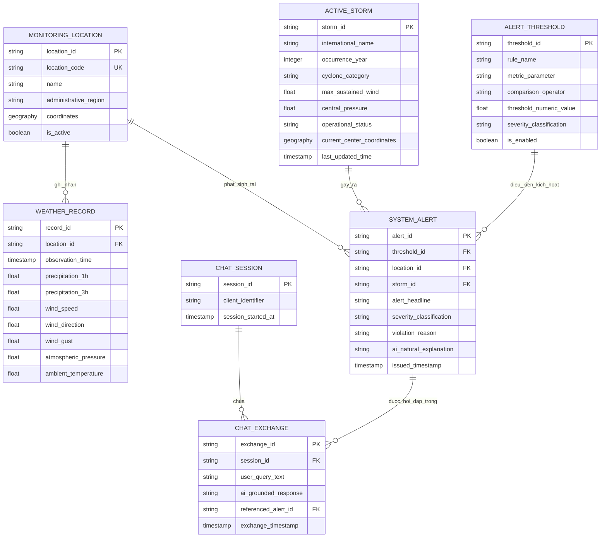
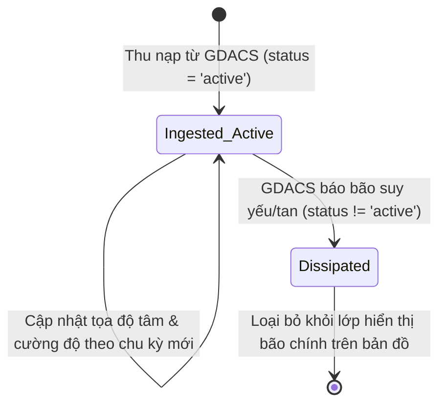
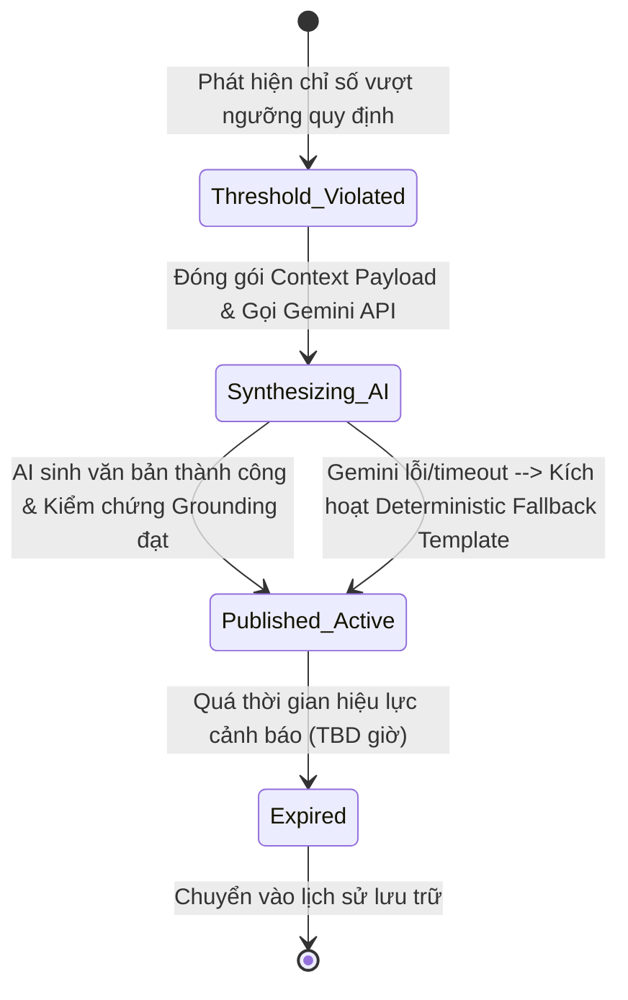
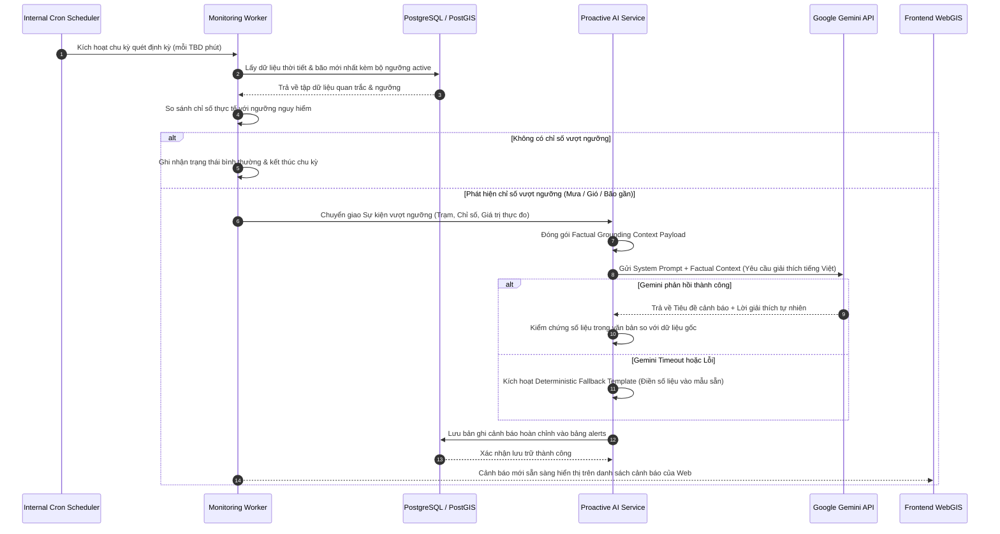
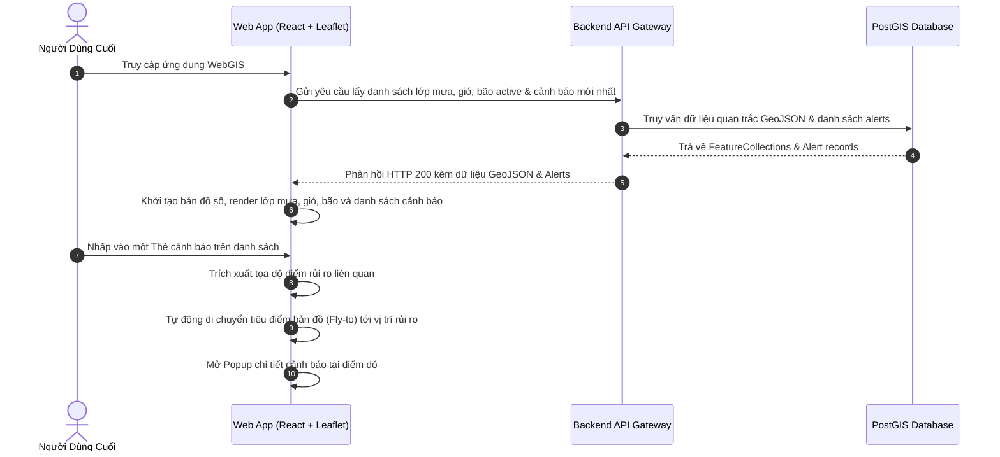
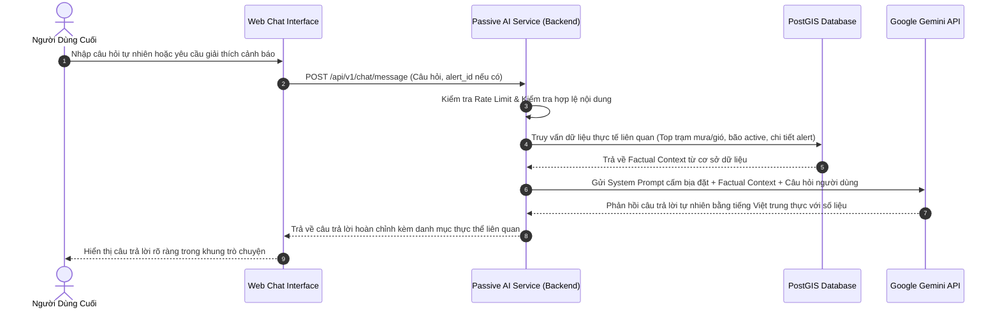

# SOFTWARE REQUIREMENTS SPECIFICATION (SRS)
## Hệ Thống WebGIS Giám Sát Mưa Gió Bão Tích Hợp AI Agent Cảnh Báo

---

## 1. Document Overview

* **Document Title:** Software Requirements Specification (SRS) - Hệ Thống WebGIS Giám Sát Mưa Gió Bão Tích Hợp AI Agent Cảnh Báo
* **System Name:** Vietnam Weather & Storm Monitoring WebGIS with Grounded AI Warning Agent
* **Document Version:** 1.0
* **Date:** 2026-10-03
* **Author:** Senior System Analyst / Software Architect
* **Document Status:** Baseline Proposal (Ready for Architecture & Engineering Baseline)
* **Related BRD:** [3. BRD.md](file:///Users/dllv/Documents/GitHub/WebGIS-for-weather-of-Vietnam/docs/The%20plans%20of%20project/3.%20BRD.md) (Version 1.0, dated 2026-10-03)
* **Document Purpose:** 
  Tài liệu Đặc tả Yêu cầu Phần mềm (SRS) này chuyển đổi các mục tiêu và yêu cầu nghiệp vụ từ Business Requirements Document (BRD) thành các yêu cầu kỹ thuật chi tiết, có cấu trúc, có thể đo lường và kiểm chứng được. Tài liệu xác định chính xác hệ thống phần mềm phải làm gì, trong điều kiện nào, với dữ liệu vào/ra ra sao, tuân thủ các quy tắc xử lý nào và phản ứng thế nào trong từng kịch bản ngoại lệ. Tài liệu này đóng vai trò là đường cơ sở kỹ thuật (Technical Baseline) bắt buộc cho Kiến trúc sư phần mềm (Software Architect), Kỹ sư Backend (Java - Spring Boot), Kỹ sư Frontend (React/Leaflet), Kỹ sư AI/ML (Gemini Integration), Đội ngũ Kiểm thử (QA/QC) và Kỹ sư Vận hành (DevOps).
* **Intended Audience:**
  - **Software Architects & Tech Leads:** Thiết kế kiến trúc giải pháp, module hệ thống, pipeline dữ liệu và giao thức tích hợp.
  - **Backend Developers (Java - Spring Boot):** Hiện thực hóa các API dịch vụ, tiến trình giám sát ngầm (Worker), tích hợp nhà cung cấp bên thứ ba và xử lý logic nghiệp vụ.
  - **Frontend Developers (React + Leaflet):** Hiện thực hóa giao diện bản đồ số tương tác, khu vực hiển thị cảnh báo và khung chatbox AI.
  - **AI / Prompt Engineers:** Thiết kế cơ chế Grounding, Prompt Engineering kết nối Gemini API và chống ảo giác (hallucination).
  - **QA / Test Engineers:** Thiết kế ma trận kiểm thử (Test Matrix), kịch bản kiểm thử (Test Cases) và kiểm chứng tiêu chí chấp nhận (Acceptance Criteria).
  - **DevOps Engineers:** Thiết lập hạ tầng, pipeline CI/CD, giám sát tài nguyên và bảo vệ hạn ngạch API.
  - **Product Owner / Business Analysts:** Đối chiếu, nghiệm thu tính năng phần mềm theo đúng phạm vi nghiệp vụ đã phê duyệt trong BRD.

---

## 2. Introduction

### 2.1 Purpose
Tài liệu này đặc tả chi tiết toàn bộ các yêu cầu chức năng (Functional Requirements), yêu cầu phi chức năng (Non-Functional Requirements), các quy tắc hệ thống (System Rules), giao diện bên ngoài (External Interfaces) và ràng buộc kỹ thuật của hệ thống WebGIS Giám Sát Mưa Gió Bão Tích Hợp AI Agent Cảnh Báo. Mọi yêu cầu trong tài liệu này đều được truy vết trực tiếp từ BRD hoặc được suy diễn một cách cần thiết (`Derived`) để hệ thống phần mềm có thể vận hành trơn tru.

### 2.2 Scope
* **Phạm vi hệ thống:**
  - Nền tảng ứng dụng WebGIS hợp nhất hỗ trợ hiển thị lớp dữ liệu lượng mưa và trường gió (tốc độ, hướng) theo thời gian thực dựa trên nguồn cấp dữ liệu khí tượng.
  - Theo dõi không gian và hiển thị các cơn bão đang hoạt động (active storms) trong khu vực Biển Đông và lân cận từ nguồn cấp dữ liệu thảm họa quốc tế.
  - Quản lý cấu hình bộ ngưỡng cảnh báo nguy hiểm áp dụng cho 3 yếu tố rủi ro: Lượng mưa lớn, Tốc độ gió mạnh và Bán kính tiếp cận của bão.
  - Tiến trình hậu đài định kỳ (Background Monitoring Engine) tự động quét dữ liệu quan trắc, phát hiện vượt ngưỡng và kích hoạt chuỗi xử lý cảnh báo.
  - AI Agent chủ động (Proactive Agent): Tự động tiếp nhận dữ liệu vượt ngưỡng, phân tích ngữ cảnh và sinh bản tin cảnh báo kèm đoạn văn bản giải thích ngữ nghĩa bằng tiếng Việt tự nhiên.
  - AI Agent bị động (Passive / Interactive Agent): Tiếp nhận câu hỏi ngôn ngữ tự nhiên từ người dùng qua khung chat trên web, thực hiện truy xuất dữ liệu thực tế trong cơ sở dữ liệu (Grounding Rule) và phản hồi giải thích chính xác lý do cảnh báo cũng như diễn biến thời tiết.
  - Giao diện người dùng Web tích hợp đồng thời: Bản đồ số Leaflet tương tác, Panel danh sách cảnh báo thời gian thực và Drawer/Box chat AI.
* **Ranh giới ngoài phạm vi (Out-of-Scope):**
  - Không xây dựng mô hình học máy (Machine Learning) để tự dự báo quỹ đạo di chuyển của bão (sử dụng nguyên bản dữ liệu từ GDACS).
  - Không triển khai kênh thông báo đẩy qua tin nhắn viễn thông SMS hoặc Mobile Push Notification.
  - Không phát triển ứng dụng di động bản địa (Native iOS/Android App); chỉ hỗ trợ Web Responsive cơ bản.
  - Không cam kết độ chính xác cấp độ nghiệp vụ của cơ quan khí tượng thủy văn quốc gia; hệ thống đóng vai trò thông tin tham khảo hỗ trợ cộng đồng.

### 2.3 Definitions, Acronyms and Abbreviations

| Term / Acronym | Definition |
| :--- | :--- |
| **BRD** | Business Requirements Document (Tài liệu Yêu cầu Nghiệp vụ) |
| **SRS** | Software Requirements Specification (Đặc tả Yêu cầu Phần mềm) |
| **GIS** | Geographic Information System (Hệ thống Thông tin Địa lý) |
| **WebGIS** | Ứng dụng GIS được triển khai và truy cập trên nền tảng trình duyệt Web |
| **EPSG:4326 / WGS84** | Hệ tọa độ trắc địa thế giới năm 1984, chuẩn quy chiếu biểu diễn kinh độ/vĩ độ |
| **GeoJSON** | Định dạng tiêu chuẩn mở (RFC 7946) mã hóa cấu trúc dữ liệu địa lý dựa trên JSON |
| **GDACS** | Global Disaster Alert and Coordination System (Hệ thống Điều phối và Cảnh báo Thảm họa Toàn cầu) |
| **OpenWeatherMap** | Dịch vụ API thương mại cung cấp dữ liệu thời tiết quan trắc và dự báo toàn cầu |
| **Gemini API** | Dịch vụ giao diện lập trình ứng dụng truy cập mô hình ngôn ngữ lớn của Google |
| **Grounding** | Kỹ thuật ràng buộc và cung cấp dữ liệu thực tế từ cơ sở dữ liệu cho mô hình AI nhằm ngăn chặn ảo giác (hallucination) |
| **LLM** | Large Language Model (Mô hình Ngôn ngữ Lớn) |
| **Active Storm** | Cơn bão đang trong trạng thái hoạt động theo phân loại của GDACS (chưa tan/suy yếu) |
| **Monitoring Worker** | Tiến trình phần mềm chạy nền độc lập thực hiện thu thập dữ liệu và so sánh ngưỡng theo chu kỳ |
| **RTM** | Requirements Traceability Matrix (Ma trận Truy xuất Nguồn gốc Yêu cầu) |
| **TBD** | To Be Determined (Chưa xác định, cần phê duyệt bổ sung) |
| **PostGIS** | Phần mở rộng không gian cho hệ quản trị cơ sở dữ liệu quan hệ PostgreSQL |

### 2.4 References
1. **Dự án WebGIS - Business Requirements Document (BRD):** [3. BRD.md](file:///Users/dllv/Documents/GitHub/WebGIS-for-weather-of-Vietnam/docs/The%20plans%20of%20project/3.%20BRD.md), Version 1.0, 2026-10-03.
2. **Dự án WebGIS - Tài liệu giới thiệu phạm vi:** [0. Introduction.md](file:///Users/dllv/Documents/GitHub/WebGIS-for-weather-of-Vietnam/docs/The%20plans%20of%20project/0.%20Introduction.md).
3. **Dự án WebGIS - Thiết kế Mô hình Thực thể Quan hệ:** [1. ERD.md](file:///Users/dllv/Documents/GitHub/WebGIS-for-weather-of-Vietnam/docs/The%20plans%20of%20project/1.%20ERD.md).
4. **Dự án WebGIS - Đặc tả Giao diện Lập trình RESTful API:** [2. API docs.md](file:///Users/dllv/Documents/GitHub/WebGIS-for-weather-of-Vietnam/docs/The%20plans%20of%20project/2.%20API%20docs.md).
5. **Dự án WebGIS - Thiết kế Kiến trúc Hệ thống & Cấu trúc Dự án:** [5. System Architecture.md](file:///Users/dllv/Documents/GitHub/WebGIS-for-weather-of-Vietnam/docs/The%20plans%20of%20project/5.%20System%20Architecture.md).
6. **Tiêu chuẩn IETF GeoJSON:** RFC 7946 - The GeoJSON Format.
7. **Tiêu chuẩn IEEE 830 / ISO/IEC/IEEE 29148:2018:** Systems and software engineering — Life cycle processes — Requirements engineering.

---

## 3. Product / System Overview

### 3.1 System Purpose
Hệ thống WebGIS Giám Sát Mưa Gió Bão Tích Hợp AI Agent Cảnh Báo được thiết kế để giải quyết điểm nghẽn lớn nhất trong việc phòng chống thiên tai cộng đồng: sự phân tán của dữ liệu số học thô và sự thiếu hụt khả năng diễn giải ngữ nghĩa thời gian thực. Hệ thống tự động thu nạp dữ liệu từ các nguồn mở uy tín, liên tục đối chiếu với các ngưỡng rủi ro định lượng, sử dụng AI Agent để chuyển đổi dữ liệu thời tiết khô khan thành các bản tin cảnh báo dễ hiểu bằng tiếng Việt và duy trì một kênh đối thoại thông minh trả lời tức thì mọi băn khoăn của người dùng.

### 3.2 Main Capabilities
1. **Trực quan hóa không gian địa lý đa lớp:** Hiển thị trực quan dữ liệu lượng mưa tích lũy, trường vector gió (vận tốc, hướng gió) và vị trí tâm bão kèm thông số trên nền bản đồ số.
2. **Giám sát ngưỡng & Tự động cảnh báo:** Cơ chế quét dữ liệu tự động theo chu kỳ giúp phát hiện ngay lập tức các điều kiện cực đoan vượt ngưỡng quy định.
3. **Phát sinh cảnh báo tự nhiên bằng AI chủ động:** Tự động tạo bản tin cảnh báo có ngữ cảnh, tiêu đề rõ ràng và đoạn văn giải thích lý do chỉ số gây nguy hiểm.
4. **Trợ lý hỏi đáp AI có kiểm chứng (Grounded AI Chat):** Trả lời các truy vấn tự nhiên của người dân về trạng thái thời tiết và phân tích sâu nguyên nhân phát sinh của các cảnh báo cụ thể.
5. **Giao diện hợp nhất tương tác một màn hình:** Tích hợp đồng bộ bản đồ GIS, danh sách cảnh báo nổi bật và cửa sổ hội thoại AI.

### 3.3 Primary Users & External Systems
* **Người dùng cuối (End Users / Public Citizens):** Người dân truy cập qua trình duyệt web để theo dõi bão, mưa, gió và tương tác với AI chat.
* **Quản trị viên hệ thống (System Administrator - Derived/Assumption):** Cấu hình các tham số đo lường trong bộ ngưỡng cảnh báo và giám sát hoạt động hệ thống.
* **OpenWeatherMap API:** Cung cấp nguồn dữ liệu quan trắc thời tiết thời gian thực theo trạm/tọa độ.
* **GDACS API:** Cung cấp nguồn dữ liệu về các cơn bão đang hoạt động (tọa độ tâm, cấp độ, áp suất, vận tốc gió).
* **Google Gemini API:** Dịch vụ mô hình ngôn ngữ lớn đóng vai trò nhân tố suy luận ngữ nghĩa cho cả hai chế độ AI Agent.

### 3.4 High-Level Workflow
1. Tiến trình `Monitoring Worker` định kỳ gọi API OpenWeatherMap & GDACS để nạp dữ liệu thời tiết và bão mới nhất vào cơ sở dữ liệu không gian.
2. `Monitoring Worker` chạy logic so sánh các chỉ số khí tượng với bảng cấu hình `Alert Thresholds`.
3. Khi phát hiện dữ liệu chạm hoặc vượt ngưỡng rủi ro, hệ thống tạo một sự kiện vượt ngưỡng và kích hoạt `Proactive AI Engine`.
4. `Proactive AI Engine` trích xuất thông tin quan trắc thực tế, gửi payload có cấu trúc tới `Gemini API` để sinh tiêu đề và văn bản giải thích tự nhiên bằng tiếng Việt (tuân thủ nguyên tắc Grounding, chống bịa số liệu).
5. Hệ thống lưu bản ghi cảnh báo hoàn chỉnh và công bố lên giao diện WebGIS.
6. Người dùng truy cập WebGIS xem bản đồ, nhấp vào danh sách cảnh báo, hoặc mở khung chat gửi câu hỏi tự nhiên.
7. Khi có câu hỏi, `Passive AI Engine` truy xuất các bản ghi thời tiết/cảnh báo liên quan từ cơ sở dữ liệu làm ngữ cảnh (Context), gửi kèm câu hỏi tới `Gemini API` để nhận câu trả lời trung thực và phản hồi cho người dùng.

### 3.5 System Boundary & Context Diagram

```mermaid
flowchart TB
    subgraph External_Services [" Dịch Vụ Bên Ngoài (Third-Party Services) "]
        OWM["OpenWeatherMap API<br/>(Dữ liệu Mưa, Gió, Khí áp)"]
        GDACS["GDACS API<br/>(Dữ liệu Cơn bão đang hoạt động)"]
        GEMINI["Google Gemini API<br/>(Suy luận Ngôn ngữ Tự nhiên & LLM)"]
    end

    subgraph System_Boundary [" Ranh Giới Hệ Thống WebGIS (System Boundary) "]
        subgraph Backend_Services [" Backend Core (Java - Spring Boot) "]
            INGEST["Ingestion Engine<br/>(Thu nạp dữ liệu định kỳ)"]
            MONITOR["Monitoring & Threshold Engine<br/>(Quét & So sánh ngưỡng)"]
            AI_PRO["Proactive AI Agent Service<br/>(Sinh cảnh báo tự động)"]
            AI_PAS["Passive AI Agent Service<br/>(Hỏi đáp có Grounding)"]
            API_GW["RESTful API Gateway<br/>(Phục vụ Client & Phân quyền)"]
        end

        subgraph Storage_Layer [" Tầng Dữ Liệu (PostgreSQL + PostGIS) "]
            DB_GEO[("Cơ sở dữ liệu Không gian<br/>- Trạm & Thời tiết<br/>- Bão & Tọa độ tâm<br/>- Ngưỡng cấu hình<br/>- Cảnh báo & Hội thoại")]
        end

        subgraph Frontend_App [" Giao Diện Người Dùng (React + Leaflet) "]
            MAP_VIEW["Bản đồ WebGIS Đa Lớp<br/>(Lớp Mưa, Lớp Gió, Lớp Bão)"]
            ALERT_PANEL["Panel Danh Sách Cảnh Báo<br/>(Hiển thị bản tin & Đánh dấu vị trí)"]
            CHAT_BOX["Khung Hội Thoại AI Chat<br/>(Hỏi đáp tự nhiên)"]
        end
    end

    subgraph System_Actors [" Tác Nhân Người Dùng (Actors) "]
        USER(("Người Dùng Cuối<br/>(End User / Public)"))
        ADMIN(("Quản Trị Viên<br/>(System Admin)"))
    end

    %% Data Flow Connections
    OWM -->|Dữ liệu quan trắc thời tiết| INGEST
    GDACS -->|Dữ liệu bão active| INGEST
    INGEST -->|Lưu trữ dữ liệu thời gian thực| DB_GEO
    
    MONITOR -->|Đọc dữ liệu mới & Ngưỡng cấu hình| DB_GEO
    MONITOR -->|Phát hiện vượt ngưỡng| AI_PRO
    AI_PRO <-->|Prompt có Grounding / Văn bản giải thích| GEMINI
    AI_PRO -->|Lưu bản ghi cảnh báo kèm giải thích| DB_GEO

    API_GW <-->|Đọc/Ghi dữ liệu| DB_GEO
    AI_PAS <-->|Truy vấn dữ liệu làm Context| DB_GEO
    AI_PAS <-->|Prompt đối thoại / Phản hồi| GEMINI

    API_GW <-->|GeoJSON Mưa, Gió, Bão| MAP_VIEW
    API_GW <-->|Danh sách Cảnh báo| ALERT_PANEL
    AI_PAS <-->|Tin nhắn hỏi đáp| CHAT_BOX

    USER -->|Xem bản đồ, đọc cảnh báo| MAP_VIEW
    USER -->|Xem cảnh báo chi tiết| ALERT_PANEL
    USER -->|Nhập câu hỏi tự nhiên| CHAT_BOX

    ADMIN -->|Cấu hình bộ tham số ngưỡng| API_GW
```



---

## 4. Stakeholders and User Roles

| Role ID | Role Name | Description | Permissions & Responsibilities | BRD Reference | Certainty |
| :--- | :--- | :--- | :--- | :--- | :--- |
| **ROLE-PUBLIC** | Public End User (Người dùng cuối) | Người dân hoặc cộng đồng có nhu cầu theo dõi điều kiện thời tiết, bão và nhận cảnh báo rủi ro. | - Xem bản đồ WebGIS trực quan (mưa, gió, bão).<br/>- Xem danh sách cảnh báo thời gian thực.<br/>- Gửi câu hỏi vào khung chat AI và nhận phản hồi.<br/>- Yêu cầu AI giải thích chi tiết về nguyên nhân cảnh báo. | BR-001, BR-002, BR-003, BR-007, BR-008, BR-009 | Confirmed |
| **ROLE-ADMIN** | System Administrator (Quản trị viên) | Cán bộ kỹ thuật phụ trách vận hành và thiết lập tham số nghiệp vụ cho hệ thống. | - Quản lý, cấu hình và kích hoạt các tham số trong bộ ngưỡng cảnh báo (mưa, gió, bão).<br/>- Giám sát trạng thái hoạt động của các tiến trình quét ngầm.<br/>- Đảm bảo tính toàn vẹn của dữ liệu hệ thống. | BR-004, BR-ALT-01, BRD Sec 6.3 | Assumption (from BRD 6.3) |
| **ROLE-WORKER** | Internal Ingestion & Monitoring Worker | Tiến trình phần mềm chạy ngầm định kỳ trong hệ thống backend. | - Tự động gọi API OpenWeatherMap & GDACS để nạp dữ liệu.<br/>- Quét dữ liệu định kỳ so khớp với bộ ngưỡng.<br/>- Kích hoạt sự kiện sinh cảnh báo cho AI Agent. | BR-005, BR-ALT-02, BR-ALT-03, BRD Sec 6.4 | Confirmed |
| **ROLE-EXT-OWM** | OpenWeatherMap API | Dịch vụ cung cấp dữ liệu khí tượng toàn cầu. | - Cung cấp dữ liệu nhiệt độ, độ ẩm, áp suất, vận tốc gió, hướng gió, gió giật, lượng mưa 1h và 3h theo tọa độ. | BR-001, BR-002, BR-MAP-01, BR-MAP-02 | Confirmed |
| **ROLE-EXT-GDACS** | GDACS API | Dịch vụ cung cấp dữ liệu thảm họa thiên tai toàn cầu. | - Cung cấp dữ liệu định danh bão, tọa độ tâm bão hiện tại, cấp bão, áp suất tâm bão, tốc độ gió tối đa và trạng thái hoạt động. | BR-003, BR-STM-01, BR-STM-02 | Confirmed |
| **ROLE-EXT-GEMINI**| Google Gemini API | Nền tảng mô hình ngôn ngữ lớn điện toán đám mây. | - Tiếp nhận bối cảnh số liệu được trích xuất từ DB.<br/>- Sinh tiêu đề và đoạn văn bản giải thích cảnh báo bằng tiếng Việt.<br/>- Sinh câu trả lời đối thoại hội thoại theo cơ chế Grounding. | BR-006, BR-007, BR-008, BR-AGT-01, BR-AGT-02 | Confirmed |

---

## 5. System Functional Requirements

---

### 5.1 Module 1: WebGIS Map Visualization (SR-MAP)

#### SR-MAP-001: Khởi tạo và Điều hướng Bản đồ Số
* **Statement:** The system shall initialize an interactive digital base map centered on the geographic territory of Vietnam and allow users to pan and zoom smoothly within predefined coordinate bounds.
* **Rationale:** Cung cấp không gian trực quan hóa nền tảng để hiển thị các lớp dữ liệu thời tiết và bão.
* **Preconditions:** Trình duyệt web của người dùng hỗ trợ HTML5 Canvas/WebGL và JavaScript được kích hoạt.
* **Input:** Thao tác tương tác kéo chuột (pan), cuộn chuột hoặc cử chỉ cảm ứng (zoom in/out), hoặc nút điều khiển độ phóng đại trên giao diện.
* **Processing / Behavior:**
  1. Hệ thống khởi tạo đối tượng bản đồ WebGIS với hệ quy chiếu chuẩn WGS84 (EPSG:4326).
  2. Thiết lập khung nhìn mặc định bao quát toàn vẹn lãnh thổ đất liền và vùng biển Việt Nam.
  3. Cập nhật tỷ lệ hiển thị và tọa độ trung tâm tức thì theo thao tác của người dùng.
* **Output:** Khung nhìn bản đồ được render liên tục và mượt mà tương ứng với mức phóng to và tọa độ di chuyển.
* **Postconditions:** Trạng thái tọa độ tâm bản đồ và mức zoom được cập nhật trên client.
* **Business Rules:** BR-MAP-03.
* **Exceptions:** Mất kết nối tải mảnh bản đồ (map tiles) $\rightarrow$ Hệ thống hiển thị biểu tượng thông báo lỗi kết nối tải nền bản đồ nhưng vẫn duy trì hiển thị các vector dữ liệu cục bộ.
* **Priority:** Must Have.
* **Source:** BR-MAP-03, BR-001, BR-002.
* **Acceptance Criteria:** AC-MAP-001.
* **Certainty:** Confirmed.

#### SR-MAP-002: Trực quan hóa Lớp Dữ liệu Lượng Mưa Thời Gian Thực
* **Statement:** The system shall fetch and render the real-time rainfall data layer on the WebGIS map based on the most recently ingested weather records.
* **Rationale:** Cho phép người dùng quan sát trực quan cường độ và phạm vi phân bố mưa trên các địa bàn quan sát.
* **Preconditions:** Bản đồ nền đã khởi tạo thành công; có bản ghi thời tiết gần nhất trong cơ sở dữ liệu.
* **Input:** Yêu cầu tải lớp dữ liệu mưa từ Client (tọa độ giới hạn Bounding Box hoặc toàn bộ trạm giám sát).
* **Processing / Behavior:**
  1. Hệ thống truy vấn bản ghi lượng mưa ($rain\_1h$, $rain\_3h$) mới nhất của các điểm quan trắc.
  2. Chuyển đổi dữ liệu thành cấu trúc chuẩn GeoJSON FeatureCollection.
  3. Phân cấp mức độ mưa và gán mã màu trực quan trên bản đồ (theo thang đo mưa chuẩn được quy định).
* **Output:** Lớp thông tin mưa được biểu diễn trực quan trên bản đồ số kèm nhãn chỉ số lượng mưa ($mm$).
* **Postconditions:** Lớp dữ liệu mưa được kích hoạt và hiển thị trên màn hình.
* **Business Rules:** Dữ liệu hiển thị phải gắn liền với tọa độ WGS84 và đồng bộ với mốc thời gian cập nhật gần nhất.
* **Exceptions:** Điểm đo không có dữ liệu mưa ($rain\_1h = null$) $\rightarrow$ Hệ thống gán giá trị mặc định là $0.0\,mm$ hoặc trạng thái "Không có mưa".
* **Priority:** Must Have.
* **Source:** BR-001, BR-MAP-01.
* **Acceptance Criteria:** AC-MAP-002.
* **Certainty:** Confirmed.

#### SR-MAP-003: Trực quan hóa Lớp Dữ liệu Trường Gió Thời Gian Thực
* **Statement:** The system shall fetch and render the real-time wind data layer displaying wind speed, wind direction, and wind gusts on the WebGIS map.
* **Rationale:** Giúp người dùng nắm bắt được tốc độ và hướng di chuyển của gió để phòng ngừa rủi ro dông lốc, gió bão.
* **Preconditions:** Bản đồ nền đã sẵn sàng; dữ liệu quan trắc gió gần nhất đã được nạp.
* **Input:** Yêu cầu bật/hiển thị lớp dữ liệu gió từ giao diện người dùng.
* **Processing / Behavior:**
  1. Hệ thống truy vấn các thông số gió ($wind\_speed$, $wind\_direction$, $wind\_gust$) từ cơ sở dữ liệu.
  2. Tạo biểu diễn trực quan hướng gió theo góc phương vị ($0^\circ - 360^\circ$) tại từng điểm trạm bằng mũi tên chỉ hướng hoặc ký hiệu hướng gió chuẩn.
  3. Áp dụng mã màu biểu thị cấp độ tốc độ gió ($m/s$ hoặc $km/h$).
* **Output:** Lớp trường gió trực quan thể hiện rõ tốc độ và chiều hướng gió tại các trạm quan sát trên bản đồ.
* **Postconditions:** Lớp dữ liệu gió hiển thị trên khung nhìn bản đồ.
* **Business Rules:** BR-MAP-02.
* **Exceptions:** Hướng gió bị khuyết thiếu $\rightarrow$ Hệ thống chỉ hiển thị giá trị tốc độ gió kèm ký hiệu cảnh báo dữ liệu hướng chưa xác định.
* **Priority:** Must Have.
* **Source:** BR-002, BR-MAP-02.
* **Acceptance Criteria:** AC-MAP-003.
* **Certainty:** Confirmed.

#### SR-MAP-004: Chuyển Đổi Bật/Tắt Lớp Dữ Liệu Bản Đồ (Layer Toggling)
* **Statement:** The system shall provide controls allowing users to independently toggle the visibility of the rainfall layer, wind layer, and active storm layer on the map.
* **Rationale:** Giúp người dùng tùy chỉnh thông tin cần xem, tránh việc chồng lấn quá nhiều thông tin trên giao diện.
* **Preconditions:** Bản đồ đã nạp các lớp dữ liệu.
* **Input:** Thao tác chọn/bỏ chọn checkbox của từng lớp dữ liệu trên thanh điều khiển (Layer Control).
* **Processing / Behavior:** Hệ thống cập nhật thuộc tính hiển thị (visible/hidden) của lớp tương ứng ngay tức thì mà không cần nạp lại toàn bộ trang web.
* **Output:** Giao diện bản đồ chỉ hiển thị các lớp dữ liệu đang được người dùng kích hoạt.
* **Postconditions:** Trạng thái hiển thị của các lớp được cập nhật trên giao diện người dùng.
* **Business Rules:** Derived from BR-009, BR-UI-01.
* **Exceptions:** Không có.
* **Priority:** Must Have.
* **Source:** BR-009, BR-UI-01.
* **Acceptance Criteria:** AC-MAP-004.
* **Certainty:** Derived.

---

### 5.2 Module 2: Storm Ingestion & Tracking (SR-STM)

#### SR-STM-001: Thu Thập Dữ Liệu Cơn Bão Đang Hoạt Động Từ GDACS
* **Statement:** The system shall periodically ingest storm feeds from the GDACS API, parsing storm identifiers, names, current center coordinates, categories, maximum wind speeds, and operational status.
* **Rationale:** Đảm bảo hệ thống luôn có dữ liệu cập nhật về các cơn bão có khả năng đe dọa khu vực Biển Đông và Việt Nam.
* **Preconditions:** Kết nối mạng tới dịch vụ GDACS khả dụng; tiến trình Worker được kích hoạt.
* **Input:** Payload dữ liệu XML/JSON từ API ngoài của GDACS.
* **Processing / Behavior:**
  1. Tiến trình Worker gửi yêu cầu HTTP GET tới điểm cuối dịch vụ GDACS.
  2. Bóc tách danh mục các sự kiện thảm họa thuộc loại hình Bão nhiệt đới (Tropical Cyclone).
  3. Lọc và chỉ trích xuất các bản ghi bão có cờ trạng thái `status = 'active'`.
  4. Cập nhật hoặc thêm mới thông tin bão vào bảng thực thể `storms` trong cơ sở dữ liệu.
* **Output:** Dữ liệu các cơn bão đang hoạt động được lưu trữ bền vững trong cơ sở dữ liệu.
* **Postconditions:** Cơ sở dữ liệu chứa dữ liệu bão active mới nhất kèm dấu thời gian cập nhật.
* **Business Rules:** BR-RULE-001, BR-STM-01.
* **Exceptions:** 
  - GDACS API không phản hồi hoặc trả về lỗi HTTP 5xx $\rightarrow$ Ghi nhật ký lỗi (log error), giữ nguyên trạng thái dữ liệu bão đã lưu trước đó và thử lại ở chu kỳ tiếp theo.
  - Cơn bão chuyển trạng thái sang tan/suy yếu (`status != 'active'`) $\rightarrow$ Cập nhật trạng thái trong cơ sở dữ liệu và đánh dấu ngừng hiển thị khẩn cấp.
* **Priority:** Must Have.
* **Source:** BR-003, BR-STM-01, BR-RULE-001.
* **Acceptance Criteria:** AC-STM-001.
* **Certainty:** Confirmed.

#### SR-STM-002: Trực Quan Hóa Vị Trí Cơn Bão Đang Hoạt Động Trên Bản Đồ
* **Statement:** The system shall render all active storms on the WebGIS map, indicating current storm center coordinates, international name, cyclone category, and maximum sustained wind speed.
* **Rationale:** Cung cấp nhận thức không gian trực quan về khoảng cách và mức độ nguy hiểm của bão đối với đất liền Việt Nam.
* **Preconditions:** Dữ liệu bão active tồn tại trong cơ sở dữ liệu; lớp dữ liệu bão đang được bật.
* **Input:** Yêu cầu truy vấn danh sách bão đang hoạt động từ giao diện người dùng.
* **Processing / Behavior:**
  1. Hệ thống lấy danh sách các cơn bão có `status = 'active'`.
  2. Render biểu tượng tâm bão đặc trưng tại tọa độ kinh độ/vĩ độ ($geom\_current$) trên bản đồ Leaflet.
  3. Gắn nhãn hoặc cửa sổ thông tin nổi (Tooltip/Popup) chứa: Tên bão, Cấp bão, Vận tốc gió tối đa ($km/h$) và Áp suất tâm bão ($hPa$).
* **Output:** Biểu tượng tâm bão hiển thị rõ ràng tại đúng tọa độ địa lý trên bản đồ.
* **Postconditions:** Người dùng có thể nhấp vào biểu tượng bão để xem thông tin chi tiết.
* **Business Rules:** BR-RULE-001, BR-STM-02.
* **Exceptions:** Không có cơn bão nào đang hoạt động trong khu vực $\rightarrow$ Hệ thống không render biểu tượng bão nào và hiển thị thông báo "Hiện không có bão hoạt động trong khu vực theo dõi".
* **Priority:** Must Have.
* **Source:** BR-003, BR-STM-02, BR-RULE-001.
* **Acceptance Criteria:** AC-STM-002.
* **Certainty:** Confirmed.

#### SR-STM-003: Loại Trừ Biểu Diễn Bão Đã Tan Khỏi Chế Độ Cảnh Báo Trực Tiếp
* **Statement:** The system shall automatically exclude dissipated or inactive storms from the active storm map layer and the real-time emergency monitoring scope.
* **Rationale:** Tránh gây nhiễu thông tin, hoang mang hoặc làm phân tán sự chú ý của người dùng vào các hiện tượng không còn nguy hiểm.
* **Preconditions:** Cơn bão được cập nhật trạng thái `dissipated` từ GDACS hoặc hết hiệu lực theo dõi.
* **Input:** Bản ghi bão có trạng thái không còn là `active`.
* **Processing / Behavior:**
  1. Hệ thống cập nhật trường `status = 'dissipated'` và lưu thời điểm kết thúc `end_date`.
  2. Lọc bỏ cơn bão này khỏi tập kết quả truy vấn của API lấy bão active phục vụ bản đồ chính.
* **Output:** Cơn bão không còn xuất hiện trên lớp hiển thị bão khẩn cấp của WebGIS.
* **Postconditions:** Chỉ các cơn bão thực sự đang hoạt động mới được duy trì trên bản đồ.
* **Business Rules:** BR-RULE-001.
* **Exceptions:** Không có.
* **Priority:** Must Have.
* **Source:** BR-RULE-001, BRD Sec 11.2.
* **Acceptance Criteria:** AC-STM-003.
* **Certainty:** Confirmed.

---

### 5.3 Module 3: Alert Thresholds & Background Monitoring Engine (SR-ALT)

#### SR-ALT-001: Quản Lý Cấu Hình Bộ Ngưỡng Cảnh Báo Rủi Ro
* **Statement:** The system shall maintain a configurable registry of alert thresholds covering three mandatory risk dimensions: heavy rainfall, strong wind speeds, and approaching storm distance.
* **Rationale:** Thiết lập tiêu chuẩn định lượng khách quan làm căn cứ cho hệ thống tự động kích hoạt cảnh báo nguy hiểm.
* **Preconditions:** Người dùng có quyền Quản trị viên (`ROLE-ADMIN`) đã đăng nhập hợp lệ.
* **Input:** Danh mục cấu hình gồm: Mã tham số (`rain_1h`, `rain_3h`, `wind_speed`, `storm_distance`), toán tử điều kiện (`>=`, `>`, `<=`), giá trị ngưỡng định lượng (giá trị số: *TBD*), mức độ nghiêm trọng (`INFO`, `WARNING`, `DANGER`, `CRITICAL`), và trạng thái kích hoạt (`is_enabled`).
* **Processing / Behavior:**
  1. Hệ thống xác thực quyền hạn quản trị của người gửi yêu cầu.
  2. Kiểm tra tính hợp lệ về kiểu dữ liệu và giới hạn logic của tham số ngưỡng.
  3. Lưu các giá trị cấu hình vào bảng `alert_thresholds`.
* **Output:** Bản ghi ngưỡng cảnh báo được tạo mới hoặc cập nhật thành công kèm mã phản hồi HTTP 200/201.
* **Postconditions:** Các tiến trình quét ngầm áp dụng ngay bộ giá trị ngưỡng mới trong chu kỳ kiểm tra kế tiếp.
* **Business Rules:** BR-RULE-002, BR-ALT-01.
* **Exceptions:** Dữ liệu giá trị ngưỡng không hợp lệ (ví dụ: giá trị âm, toán tử không hỗ trợ) $\rightarrow$ Hệ thống từ chối cập nhật và trả về thông báo lỗi chi tiết.
* **Priority:** Must Have.
* **Source:** BR-004, BR-ALT-01, BR-RULE-002.
* **Acceptance Criteria:** AC-ALT-001.
* **Certainty:** Confirmed (giá trị số ngưỡng cụ thể là *TBD*).

#### SR-ALT-002: Tiến Trình Quét Định Kỳ Phát Hiện Dữ Liệu Vượt Ngưỡng
* **Statement:** The system shall execute an automated periodic background scan comparing the latest ingested weather metrics and storm positions against active alert thresholds.
* **Rationale:** Đảm bảo việc phát hiện rủi ro thời tiết diễn ra liên tục, tự động 24/7 mà không phụ thuộc vào con người.
* **Preconditions:** Tiến trình `Monitoring Worker` đang chạy; cơ sở dữ liệu có các bản ghi thời tiết/bão mới; chu kỳ quét định kỳ (*TBD* phút) đến hạn kích hoạt.
* **Input:** Tập dữ liệu quan trắc mới nhất của các trạm, tọa độ các cơn bão active, và tập quy tắc ngưỡng có `is_enabled = true`.
* **Processing / Behavior:**
  1. Tiến trình quét duyệt qua các điểm quan trắc thời tiết:
     - So sánh lượng mưa thực tế với ngưỡng mưa.
     - So sánh tốc độ gió và gió giật thực tế với ngưỡng gió.
  2. Tiến trình quét tính toán khoảng cách không gian (sử dụng hàm trắc địa PostGIS `ST_DistanceSphere` hoặc `ST_Distance`) từ tâm cơn bão active gần nhất tới từng trạm/tỉnh thành và so sánh với ngưỡng khoảng cách tiếp cận.
  3. Nếu phát hiện bất kỳ chỉ số nào thỏa mãn điều kiện vi phạm ngưỡng: Đánh dấu sự kiện vượt ngưỡng kèm các tham số đo đạc cụ thể.
* **Output:** Danh sách các sự kiện vi phạm ngưỡng (Threshold Violation Events) chứa: trạm vi phạm, chỉ số vi phạm, giá trị thực đo, giá trị ngưỡng và mốc thời gian.
* **Postconditions:** Chuyển giao các sự kiện vi phạm sang module AI Agent chủ động để tiến hành tạo nội dung cảnh báo.
* **Business Rules:** BR-ALT-02, BR-ALT-03, BR-RULE-002.
* **Exceptions:** Không có chỉ số nào vượt ngưỡng $\rightarrow$ Hệ thống ghi nhận chu kỳ kiểm tra hoàn tất ở mức an toàn và chờ chu kỳ tiếp theo.
* **Priority:** Must Have.
* **Source:** BR-005, BR-ALT-02, BR-ALT-03.
* **Acceptance Criteria:** AC-ALT-002.
* **Certainty:** Confirmed (Chu kỳ quét định kỳ cụ thể là *TBD*).

---

### 5.4 Module 4: Proactive AI Agent Warning Generation (SR-AGT-PRO)

#### SR-AGT-001: Tiếp Nhận Sự Kiện Vượt Ngưỡng & Xây Dựng Ngữ Cảnh Grounding
* **Statement:** The system shall assemble a structured, factual grounding payload from the threshold violation event and submit it to the Gemini API for natural language warning synthesis.
* **Rationale:** Cung cấp đầy đủ dữ kiện thực tế cho mô hình ngôn ngữ, ngăn chặn việc suy diễn sai lệch (hallucination).
* **Preconditions:** Sự kiện vượt ngưỡng được tạo ra từ `Monitoring Worker`; khóa API Google Gemini hợp lệ được nạp trong biến môi trường.
* **Input:** Mã định danh trạm/khu vực, tọa độ địa lý, loại chỉ số vi phạm ($rain\_1h$, $wind\_speed$, $storm\_distance$), giá trị đo đạc thực tế, giá trị ngưỡng bị vượt, và thông tin cơn bão liên quan (nếu có).
* **Processing / Behavior:**
  1. Hệ thống tạo cấu trúc dữ liệu bối cảnh (Context Payload) chứa đầy đủ các con số thực tế.
  2. Tạo câu nhắc hệ thống (System Prompt) bằng tiếng Việt với các quy tắc nghiêm ngặt:
     - Bắt buộc phải trích dẫn chính xác con số thực đo được cung cấp.
     - Nghiêm cấm tự bịa đặt hoặc thay đổi số liệu đo đạc.
     - Diễn giải mức độ nguy hiểm đối với đời sống, sinh hoạt và an toàn của người dân khu vực.
     - Đưa ra lời khuyên/hành động phòng ngừa cơ bản.
  3. Gửi yêu cầu suy luận đồng bộ tới Google Gemini API.
* **Output:** Chuỗi JSON chứa tiêu đề cảnh báo ngắn gọn và đoạn văn bản phân tích, giải thích ngữ nghĩa bằng tiếng Việt tự nhiên.
* **Postconditions:** Payload được sẵn sàng để kiểm chứng và lưu trữ.
* **Business Rules:** BR-RULE-003, BR-RULE-004.
* **Exceptions:** Gemini API trả về phản hồi không đúng cấu trúc $\rightarrow$ Hệ thống áp dụng bộ phân tích dự phòng (fallback parser) hoặc cấu trúc cảnh báo mặc định.
* **Priority:** Must Have.
* **Source:** BR-006, BR-AGT-01, BR-RULE-003, BR-RULE-004.
* **Acceptance Criteria:** AC-AGT-PRO-001.
* **Certainty:** Confirmed.

#### SR-AGT-002: Kiểm Chứng Dữ Liệu Grounding & Lưu Trữ Cảnh Báo
* **Statement:** The system shall verify that the generated AI warning content conforms strictly to the grounded numerical metrics before persisting the alert into the database and publishing it to the web.
* **Rationale:** Bảo đảm 100% các cảnh báo công bố cho người dân đều có căn cứ số liệu trung thực, loại bỏ hoàn toàn rủi ro ảo giác AI gây hoang mang dư luận.
* **Preconditions:** Phản hồi văn bản từ Gemini API đã được nhận.
* **Input:** Văn bản giải thích do AI sinh ra và tập thông số gốc của sự kiện vượt ngưỡng.
* **Processing / Behavior:**
  1. Kiểm tra tính hiện diện của các giá trị số chính trong đoạn văn bản giải thích.
  2. Nếu phát hiện sai lệch nghiêm trọng về số liệu hoặc vi phạm quy tắc an toàn: Chuyển sang sử dụng bản mẫu giải thích chuẩn hóa có sẵn của hệ thống (System Deterministic Fallback Template).
  3. Lưu bản ghi cảnh báo vào bảng `alerts` gồm: `location_id`, `storm_id`, `threshold_id`, `title`, `severity_level`, `trigger_reason`, `ai_explanation`, và `created_at`.
* **Output:** Bản ghi cảnh báo mới được lưu trữ bền vững với trạng thái sẵn sàng hiển thị.
* **Postconditions:** Cảnh báo có thể truy vấn ngay lập tức qua API danh sách cảnh báo của Client.
* **Business Rules:** BR-RULE-003, BR-RULE-004.
* **Exceptions:** Lỗi kết nối cơ sở dữ liệu khi lưu cảnh báo $\rightarrow$ Ghi log mức Critical và lưu trữ tạm vào bộ nhớ đệm (retry queue) để thực hiện lại.
* **Priority:** Must Have.
* **Source:** BR-006, BR-AGT-01, BR-RULE-003, BR-RULE-004, RSK-001.
* **Acceptance Criteria:** AC-AGT-PRO-002.
* **Certainty:** Derived.

#### SR-AGT-003: Cơ Chế Dự Phòng Khi Gemini API Gián Đoạn (Deterministic Fallback)
* **Statement:** The system shall automatically fallback to a predefined deterministic template to generate warnings if the Gemini API call times out or returns an error.
* **Rationale:** Đảm bảo hệ thống phát cảnh báo không bị gián đoạn hay tê liệt ngay cả khi dịch vụ đám mây của bên thứ ba gặp sự cố.
* **Preconditions:** Yêu cầu gọi Gemini API bị timeout (ngưỡng thời gian: *TBD* ms) hoặc trả về mã lỗi HTTP 4xx/5xx.
* **Input:** Thông số sự kiện vượt ngưỡng cục bộ.
* **Processing / Behavior:**
  1. Hệ thống bắt lỗi ngoại lệ từ kết nối Gemini API.
  2. Kích hoạt bộ sinh bản tin dự phòng: Điền trực tiếp các tham số thực đo vào mẫu câu định sẵn (ví dụ: *"Cảnh báo mưa lớn tại [Địa điểm]: Lượng mưa tích lũy đo được đạt [Giá trị] mm, vượt ngưỡng an toàn [Ngưỡng] mm. Đề nghị người dân lưu ý nguy cơ ngập úng."*).
  3. Lưu cảnh báo với ghi chú cờ cảnh báo dự phòng (`is_fallback = true`).
* **Output:** Bản tin cảnh báo chuẩn xác được lưu và phát hành mà không gây trễ hạn cảnh báo.
* **Postconditions:** Bản ghi cảnh báo được xuất bản bình thường trên web.
* **Business Rules:** Derived from RSK-002, BR-006.
* **Exceptions:** Không có.
* **Priority:** Must Have.
* **Source:** BR-006, RSK-002, BRD Sec 17.
* **Acceptance Criteria:** AC-AGT-PRO-003.
* **Certainty:** Derived.

---

### 5.5 Module 5: Passive AI Conversational Assistant & Grounded Q&A (SR-AGT-PAS)

#### SR-AGT-001-PAS: Tiếp Nhận Truy Vấn Tự Nhiên & Truy Xuất Dữ Liệu Thực Tế (RAG/Grounding)
* **Statement:** The system shall receive natural language queries from users via the web chat interface, retrieve corresponding factual data from the database, and inject it as context into the Gemini API prompt.
* **Rationale:** Giúp người dùng tra cứu thông tin thời tiết tự nhiên mà vẫn đảm bảo câu trả lời phản ánh chính xác dữ liệu của hệ thống.
* **Preconditions:** Người dùng gửi câu hỏi qua giao diện chat; dịch vụ backend AI đang hoạt động.
* **Input:** Chuỗi văn bản câu hỏi tiếng Việt của người dùng (ví dụ: *"Khu vực nào đang có mưa to nhất?"*, *"Tình hình bão hiện nay ra sao?"*).
* **Processing / Behavior:**
  1. Hệ thống tiếp nhận câu hỏi, thực hiện tiền xử lý và phân loại ý định (Intent Recognition):
     - Truy vấn thời tiết hiện tại (mưa, gió, trạm).
     - Truy vấn tình hình bão đang hoạt động.
     - Truy vấn về các cảnh báo nguy hiểm gần đây.
  2. Thực hiện truy vấn cơ sở dữ liệu PostGIS để lấy dữ liệu thực tế tương ứng (Top trạm mưa cao nhất, danh sách bão active, cảnh báo mới nhất).
  3. Đóng gói dữ liệu truy vấn được thành khối ngữ cảnh sự thật (Factual Context).
  4. Gửi câu hỏi kèm Factual Context tới Gemini API kèm ràng buộc: *"Chỉ trả lời dựa trên dữ liệu được cung cấp. Nếu dữ liệu không có thông tin, hãy thông báo lịch sự rằng hệ thống chưa ghi nhận số liệu này."*
* **Output:** Câu trả lời tự nhiên, chính xác, sử dụng tiếng Việt thân thiện, phản ánh đúng dữ liệu thực đo.
* **Postconditions:** Phản hồi được chuyển tới giao diện chat của người dùng.
* **Business Rules:** BR-RULE-004, BR-007, BR-AGT-02.
* **Exceptions:** 
  - Câu hỏi hoàn toàn nằm ngoài phạm vi thời tiết/thiên tai $\rightarrow$ AI Agent từ chối trả lời lịch sự và hướng dẫn người dùng tập trung vào thông tin mưa, gió, bão.
  - Gemini API quá tải hoặc lỗi kết nối $\rightarrow$ Hệ thống phản hồi thông báo: *"Trợ lý AI đang bận hoặc quá tải, xin vui lòng thử lại sau giây lát."*
* **Priority:** Must Have.
* **Source:** BR-007, BR-AGT-02, BR-RULE-004.
* **Acceptance Criteria:** AC-AGT-PAS-001.
* **Certainty:** Confirmed.

#### SR-AGT-002-PAS: Giải Thích Chi Tiết Nguyên Nhân Phát Cảnh Báo Cụ Thể
* **Statement:** The system shall allow users to inquire about a specific alert and generate a detailed natural language explanation clarifying the exact triggers and measurements behind that alert.
* **Rationale:** Giúp người dân hiểu tường tận bản chất của mối nguy hiểm, giải tỏa thắc mắc và tin tưởng vào tính xác thực của thông tin cảnh báo.
* **Preconditions:** Bản ghi cảnh báo hợp lệ tồn tại trong hệ thống; người dùng chỉ định mã cảnh báo hoặc nhấp từ danh sách cảnh báo vào khung chat.
* **Input:** Mã định danh cảnh báo (`alert_id`) kèm yêu cầu giải thích của người dùng (ví dụ: *"Tại sao trạm Đà Nẵng lại phát cảnh báo này?"*).
* **Processing / Behavior:**
  1. Hệ thống truy vấn bản ghi cảnh báo trong bảng `alerts`, liên kết với trạm đo (`locations`), ngưỡng áp dụng (`alert_thresholds`), và dữ liệu bão (`storms`).
  2. Tổng hợp báo cáo kỹ thuật gốc: Trạm đo, giá trị thực tế đo được tại thời điểm kích hoạt, giá trị ngưỡng quy chuẩn bị vi phạm, và chênh lệch vượt ngưỡng.
  3. Chuyển thông tin trên cho Gemini API để sinh văn bản giải thích chi tiết, nêu rõ nguyên nhân vì sao hiện tượng thời tiết này lại kích hoạt mức độ nghiêm trọng đó.
* **Output:** Đoạn văn giải thích cặn kẽ nguyên nhân gốc của cảnh báo kèm các số liệu dẫn chứng cụ thể.
* **Postconditions:** Lời giải thích hiển thị trực tiếp trong dòng thời gian hội thoại chat.
* **Business Rules:** BR-RULE-004, BR-008, BR-AGT-03.
* **Exceptions:** Không tìm thấy mã cảnh báo tương ứng $\rightarrow$ Trả về thông báo lỗi: *"Không tìm thấy thông tin cảnh báo yêu cầu hoặc cảnh báo đã hết hiệu lực."*
* **Priority:** Must Have.
* **Source:** BR-008, BR-AGT-03, BR-RULE-004.
* **Acceptance Criteria:** AC-AGT-PAS-002.
* **Certainty:** Confirmed.

---

### 5.6 Module 6: Unified Web Interface & User Experience (SR-UI)

#### SR-UI-001: Bố Cục Giao Diện Hợp Nhất Một Màn Hình (Unified Dashboard Layout)
* **Statement:** The system shall present an integrated single-page web interface concurrently hosting the interactive WebGIS map, an active alerts panel, and a non-intrusive AI chat interface.
* **Rationale:** Cung cấp trải nghiệm tập trung, liền mạch, cho phép người dùng vừa quan sát không gian vừa nắm bắt cảnh báo và tra cứu trợ lý ảo trên cùng một màn hình.
* **Preconditions:** Người dùng truy cập vào trang chủ hệ thống bằng trình duyệt web.
* **Input:** Yêu cầu tải trang (HTTP GET `/`).
* **Processing / Behavior:**
  1. Trình duyệt tải gói giao diện ứng dụng React.
  2. Bố trí thành phần:
     - Khu vực trung tâm/chính: Bản đồ số Leaflet chiếm toàn bộ không gian nền hoặc khung nhìn chủ đạo.
     - Khu vực cảnh báo: Panel thanh bên (sidebar) hoặc danh sách nổi có thể thu gọn, hiển thị các bản tin cảnh báo mới nhất.
     - Khu vực chatbox AI: Khung trò chuyện dạng drawer/nổi ở góc dưới màn hình, có thể đóng/mở dễ dàng mà không làm che khuất các điểm nóng thời tiết quan trọng trên bản đồ.
* **Output:** Giao diện hợp nhất được dựng hoàn chỉnh trên màn hình người dùng.
* **Postconditions:** Người dùng có thể tương tác đồng thời giữa 3 thành phần giao diện.
* **Business Rules:** BR-009, BR-UI-01, BR-UI-02.
* **Exceptions:** Màn hình kích thước nhỏ (mobile) $\rightarrow$ Tự động chuyển đổi bố cục dạng tab/drawer xếp lớp để tránh tràn viền.
* **Priority:** Must Have.
* **Source:** BR-009, BR-UI-01, BR-UI-02.
* **Acceptance Criteria:** AC-UI-001.
* **Certainty:** Confirmed.

#### SR-UI-002: Hiển Thị Danh Sách Cảnh Báo & Tương Tác Đồng Bộ Với Bản Đồ
* **Statement:** The system shall display the list of active alerts ordered chronologically and pan/zoom the map to the affected location when a user selects an alert card.
* **Rationale:** Tạo sự gắn kết trực quan giữa danh sách thông báo dạng chữ và vị trí không gian thực tế trên bản đồ số.
* **Preconditions:** Có ít nhất một bản ghi cảnh báo trong hệ thống; danh sách cảnh báo đang hiển thị.
* **Input:** Thao tác nhấp chuột (click) hoặc chạm của người dùng vào một thẻ cảnh báo trong danh sách.
* **Processing / Behavior:**
  1. Hệ thống xác định tọa độ địa lý ($geom$) của trạm hoặc tâm bão liên quan đến cảnh báo đó.
  2. Kích hoạt hiệu ứng di chuyển khung nhìn bản đồ (Map Pan/Fly-to) tới tọa độ tương ứng với mức zoom cận cảnh phù hợp.
  3. Mở popup hiển thị tóm tắt nội dung cảnh báo và nút "Hỏi AI về cảnh báo này".
* **Output:** Bản đồ tự động định vị chính xác vị trí xảy ra rủi ro và làm nổi bật khu vực đó.
* **Postconditions:** Trạng thái tiêu điểm của bản đồ chuyển về vị trí rủi ro được chọn.
* **Business Rules:** Derived from BR-009, BR-UI-01.
* **Exceptions:** Tọa độ địa lý không hợp lệ $\rightarrow$ Hệ thống hiển thị cảnh báo dạng pop-up thông báo mà không di chuyển bản đồ.
* **Priority:** Must Have.
* **Source:** BR-009, BR-UI-01.
* **Acceptance Criteria:** AC-UI-002.
* **Certainty:** Derived.

#### SR-UI-003: Hiển Thị Thông Báo Miễn Trừ Trách Nhiệm Pháp Lý (Disclaimer Banner)
* **Statement:** The system shall display a persistent disclaimer banner stating that weather and storm data are compiled from OpenWeatherMap and GDACS for community reference only.
* **Rationale:** Bảo vệ tính pháp lý của dự án, tránh gây hiểu nhầm cho người dân rằng hệ thống thay thế cơ quan dự báo khí tượng thủy văn quốc gia.
* **Preconditions:** Bất kỳ trang nào của ứng dụng web được hiển thị.
* **Input:** Tải giao diện ứng dụng.
* **Processing / Behavior:** Hệ thống render dòng chữ thông báo miễn trừ tại chân trang (footer) hoặc thanh cố định: *"Thông tin mưa, gió, bão được tổng hợp từ OpenWeatherMap và GDACS, chỉ mang tính chất tham khảo cộng đồng. Vui lòng theo dõi bản tin chính thức từ Trung tâm Dự báo Khí tượng Thủy văn Quốc gia trong các tình huống khẩn cấp."*
* **Output:** Dòng thông báo hiển thị rõ ràng, dễ đọc cho người dùng.
* **Postconditions:** Thông báo luôn duy trì trên màn hình làm việc của người dùng.
* **Business Rules:** BR-010, BR-RULE-006.
* **Exceptions:** Không có.
* **Priority:** Should Have.
* **Source:** BR-010, BR-RULE-006.
* **Acceptance Criteria:** AC-UI-003.
* **Certainty:** Confirmed.

#### SR-UI-004: Tương Thích Trình Duyệt Web Responsive Cơ Bản
* **Statement:** The system shall render the web interface adaptively on standard desktop and mobile browser viewports with basic responsive ergonomics.
* **Rationale:** Cho phép người dân tiếp cận thông tin khẩn cấp thuận tiện trên cả điện thoại thông minh lẫn máy tính cá nhân.
* **Preconditions:** Thiết bị sử dụng trình duyệt web hiện đại (Chrome, Safari, Firefox, Edge).
* **Input:** Kích thước độ phân giải màn hình hiển thị của thiết bị.
* **Processing / Behavior:**
  - Trên màn hình lớn (Desktop $\ge 1024px$): Bố cục chia đa cột song song (Bản đồ rộng + Sidebar cảnh báo + Khung chat ghim).
  - Trên màn hình nhỏ (Mobile $< 768px$): Bản đồ hiển thị toàn màn hình; danh sách cảnh báo và khung chat thu gọn thành các nút bấm mở rộng dạng modal/drawer trượt lên từ đáy màn hình.
* **Output:** Trải nghiệm người dùng không bị vỡ layout, các nút bấm thao tác dễ dàng trên màn hình cảm ứng.
* **Postconditions:** Không yêu cầu người dùng cài đặt ứng dụng native.
* **Business Rules:** BR-UI-03, Tuân thủ phạm vi Out-of-Scope (không làm Native App).
* **Exceptions:** Không có.
* **Priority:** Must Have.
* **Source:** BR-UI-03, Scope 1.3.
* **Acceptance Criteria:** AC-UI-004.
* **Certainty:** Confirmed.

---

### 5.7 Module 7: Ingestion & Internal Automation Engine (SR-ING)

#### SR-ING-001: Định Kỳ Thu Thập Dữ Liệu Thời Tiết Từ OpenWeatherMap API
* **Statement:** The system shall periodically query the OpenWeatherMap API to retrieve the latest weather observations for all registered monitoring locations.
* **Rationale:** Duy trì tính tươi mới của dữ liệu khí tượng phục vụ trực quan hóa bản đồ và kiểm tra cảnh báo.
* **Preconditions:** Danh mục các trạm/tỉnh thành giám sát (`locations`) đã được khởi tạo trong cơ sở dữ liệu; khóa API OpenWeatherMap hợp lệ.
* **Input:** Tọa độ địa lý (kinh độ, vĩ độ) của danh sách các điểm quan sát.
* **Processing / Behavior:**
  1. Tiến trình Ingestion gửi yêu cầu HTTP GET tới OpenWeatherMap API cho từng điểm hoặc theo gói.
  2. Bóc tách dữ liệu JSON: nhiệt độ, áp suất, độ ẩm, tốc độ gió, hướng gió, gió giật, lượng mưa 1h và 3h.
  3. Ghi bản ghi mới vào bảng `weather_records` kèm dấu thời gian quan trắc (`recorded_at`).
* **Output:** Các bản ghi quan trắc thời tiết mới được lưu vào cơ sở dữ liệu.
* **Postconditions:** Dữ liệu mới sẵn sàng cho các truy vấn WebGIS và tiến trình giám sát ngưỡng.
* **Business Rules:** Dữ liệu gắn liền với tọa độ WGS84 và cập nhật đồng bộ.
* **Exceptions:** Gọi API vượt hạn mức (Rate Limit HTTP 429) $\rightarrow$ Tạm dừng theo thuật toán Exponential Backoff, ghi log cảnh báo và tiếp tục ở chu kỳ sau.
* **Priority:** Must Have.
* **Source:** BR-001, BR-002, BR-MAP-01, BR-MAP-02.
* **Acceptance Criteria:** AC-ING-001.
* **Certainty:** Confirmed.

#### SR-ING-002: Bảo Mật Giao Thức Kích Hoạt Worker Bằng Mã Bí Mật Nội Bộ
* **Statement:** The system shall authenticate and authorize background sync/worker requests using an internal secret key header (`X-Internal-Secret`).
* **Rationale:** Ngăn chặn các tác nhân bên ngoài kích hoạt tiến trình nạp dữ liệu trái phép làm cạn kiệt tài nguyên hệ thống và quota API bên ngoài.
* **Preconditions:** Yêu cầu HTTP được gửi tới endpoint nội bộ (ví dụ: `/api/v1/sync/weather` hoặc `/api/v1/sync/storms`).
* **Input:** Header HTTP `X-Internal-Secret: <secret_value>`.
* **Processing / Behavior:**
  1. Hệ thống kiểm tra sự tồn tại và đối chiếu giá trị header với biến môi trường hệ thống.
  2. Nếu trùng khớp: Cho phép thực thi tiến trình.
  3. Nếu không trùng khớp hoặc thiếu header: Lập tức từ chối và trả về mã lỗi HTTP 403 Forbidden.
* **Output:** Cho phép xử lý hoặc từ chối truy cập.
* **Postconditions:** Tiến trình chỉ được kích hoạt bởi nguồn tin cậy (Cron nội bộ).
* **Business Rules:** BRD Sec 14 (Security & Integrity).
* **Exceptions:** Không có.
* **Priority:** Must Have.
* **Source:** BRD Sec 14, API docs Sec 1.3.
* **Acceptance Criteria:** AC-ING-002.
* **Certainty:** Derived.

---

## 6. Functional Requirement Writing Rules

Tất cả các System Requirements trong tài liệu này đều tuân thủ các nguyên tắc kỹ thuật chuẩn hóa:
1. **Atomic:** Mỗi yêu cầu chỉ đặc tả một hành vi hệ thống duy nhất, không ghép nối nhiều tính năng độc lập vào một ID.
2. **Testable & Verifiable:** Mọi yêu cầu đều có tiêu chí chấp nhận (Acceptance Criteria) kiểm thử được theo kịch bản Given-When-Then hoặc phép thử định lượng rõ ràng.
3. **Unambiguous:** Sử dụng cấu trúc câu chuẩn hóa: **"The system shall + [hành động] + [đối tượng] + [điều kiện/ràng buộc]"**. Nghiêm cấm dùng các từ ngữ cảm tính như *"hệ thống phải chạy nhanh"*, *"giao diện thân thiện"*, *"xử lý tối ưu"* mà không có chỉ số đo lường.
4. **Consistent:** Không có mâu thuẫn giữa các yêu cầu chức năng, luồng nghiệp vụ và quy tắc hệ thống.
5. **Traceable:** Mọi yêu cầu hệ thống (`SR-xxx`) đều được truy xuất nguồn gốc về yêu cầu nghiệp vụ trong BRD (`BR-xxx`) hoặc được đánh dấu rõ ràng là `Derived` từ ràng buộc kỹ thuật/bảo mật.

---

## 7. Use Case Specifications

---

### UC-001: Khám Phá Bản Đồ Thời Tiết WebGIS (Mưa & Gió)

* **Goal:** Người dùng xem được sự phân bố không gian và cường độ của lượng mưa và trường gió theo thời gian thực trên lãnh thổ Việt Nam.
* **Primary Actor:** Người dùng cuối (`ROLE-PUBLIC`).
* **Secondary Actors:** OpenWeatherMap API, Cơ sở dữ liệu PostGIS.
* **Trigger:** Người dùng mở ứng dụng web hoặc tương tác bật các lớp dữ liệu trên bản đồ.
* **Preconditions:** Ứng dụng web đã tải thành công trên trình duyệt; hệ thống đã có dữ liệu quan trắc thời tiết.
* **Main Success Scenario:**
  1. Người dùng điều hướng trên bản đồ số (phóng to, thu nhỏ, kéo bản đồ đến khu vực quan tâm).
  2. Người dùng nhấp chọn bật lớp dữ liệu "Lượng mưa" và "Gió" trên bảng điều khiển lớp.
  3. Hệ thống gửi yêu cầu lấy dữ liệu GeoJSON mưa và gió tương ứng với khung nhìn.
  4. Hệ thống render lớp mưa với thang màu quy chuẩn và các vector mũi tên chỉ hướng gió kèm vận tốc gió tại từng trạm.
  5. Người dùng nhấp vào một trạm quan sát cụ thể trên bản đồ.
  6. Hệ thống hiển thị popup chứa đầy đủ chỉ số: Tên trạm/tỉnh thành, Lượng mưa 1h/3h ($mm$), Vận tốc gió ($m/s$), Hướng gió ($^\circ$), Gió giật ($m/s$), Nhiệt độ và Độ ẩm.
* **Alternative Flows:**
  * **A1 - Người dùng chỉ chọn xem lớp Gió:** Tại bước 2, người dùng tắt lớp mưa. Hệ thống ẩn toàn bộ các biểu diễn về mưa, chỉ giữ lại trường vector gió.
* **Exception Flows:**
  * **E1 - Mất kết nối tới máy chủ:** Tại bước 3, yêu cầu lấy dữ liệu thất bại. Hệ thống hiển thị thông báo góc màn hình: *"Không thể tải dữ liệu thời tiết mới nhất. Vui lòng kiểm tra kết nối mạng."*
* **Postconditions:** Người dùng nắm bắt được trực quan tình trạng mưa và gió tại địa bàn cần theo dõi.
* **Business Rules:** BR-MAP-01, BR-MAP-02, BR-MAP-03, BR-001, BR-002.
* **Related Requirements:** SR-MAP-001, SR-MAP-002, SR-MAP-003, SR-MAP-004.
* **Related Business Requirements:** BR-001, BR-002, BR-MAP-01, BR-MAP-02, BR-MAP-03.

---

### UC-002: Giám Sát Cơn Bão Đang Hoạt Động Trên Bản Đồ

* **Goal:** Người dùng định vị được vị trí tâm bão, tên bão và cường độ của các cơn bão đang hoạt động trong tương quan khoảng cách với bờ biển Việt Nam.
* **Primary Actor:** Người dùng cuối (`ROLE-PUBLIC`).
* **Secondary Actors:** GDACS API, Cơ sở dữ liệu PostGIS.
* **Trigger:** Người dùng kích hoạt lớp xem bão hoặc truy cập vào nền tảng khi có bão hoạt động.
* **Preconditions:** Hệ thống đã thu nạp và duy trì ít nhất một cơn bão có `status = 'active'`.
* **Main Success Scenario:**
  1. Hệ thống tự động tải danh sách bão đang hoạt động và biểu diễn ký hiệu tâm bão tại tọa độ thực trên bản đồ WebGIS.
  2. Người dùng quan sát thấy vị trí tâm bão trên vùng biển Đông.
  3. Người dùng nhấp chuột vào biểu tượng cơn bão.
  4. Hệ thống mở cửa sổ thông tin bão (Storm Info Box) hiển thị: Tên quốc tế của bão, Cấp bão, Vận tốc gió tối đa vùng gần tâm bão ($km/h$), Áp suất tâm bão ($hPa$), và mốc thời gian ghi nhận gần nhất.
* **Alternative Flows:**
  * **A1 - Không có cơn bão nào đang hoạt động:** Hệ thống kiểm tra cơ sở dữ liệu không có bão `active`. Lớp bão không hiển thị ký hiệu nào; giao diện hiển thị nhãn trạng thái: *"Biển Đông hiện không có bão hoạt động."*
* **Exception Flows:**
  * **E1 - Cơn bão vừa tan nhưng cache trình duyệt chưa xóa:** Người dùng nhấp vào bão vừa tan. Hệ thống làm mới dữ liệu và hiển thị thông báo bão đã suy yếu thành vùng áp thấp hoặc đã tan hoàn toàn.
* **Postconditions:** Người dùng nắm bắt được vị trí và hiện trạng cơn bão.
* **Business Rules:** BR-RULE-001, BR-STM-01, BR-STM-02, BR-003.
* **Related Requirements:** SR-STM-001, SR-STM-002, SR-STM-003.
* **Related Business Requirements:** BR-003, BR-STM-01, BR-STM-02, BR-RULE-001.

---

### UC-003: Cấu Hình Bộ Ngưỡng Cảnh Báo Nguy Hiểm

* **Goal:** Quản trị viên thiết lập hoặc cập nhật các giá trị định lượng kích hoạt cảnh báo cho mưa lớn, gió mạnh và bán kính tiếp cận của bão.
* **Primary Actor:** Quản trị viên hệ thống (`ROLE-ADMIN`).
* **Secondary Actors:** Hệ thống cơ sở dữ liệu.
* **Trigger:** Quản trị viên truy cập màn hình cấu hình ngưỡng cảnh báo hoặc gửi yêu cầu API cập nhật ngưỡng.
* **Preconditions:** Quản trị viên đã xác thực danh tính thành công với quyền quản trị.
* **Main Success Scenario:**
  1. Quản trị viên mở bảng tham số cấu hình ngưỡng.
  2. Quản trị viên chọn tham số cần điều chỉnh (ví dụ: `rain_1h`, `wind_speed`, hoặc `storm_distance`).
  3. Quản trị viên nhập giá trị ngưỡng kích hoạt mới (ví dụ: $50.0\,mm$, $20.0\,m/s$, hoặc $300.0\,km$) và mức độ nghiêm trọng tương ứng (`WARNING`, `DANGER`).
  4. Quản trị viên nhấn "Lưu cấu hình".
  5. Hệ thống thực hiện kiểm tra tính hợp lệ dữ liệu (giá trị số dương, toán tử so sánh hợp lệ).
  6. Hệ thống cập nhật bản ghi trong bảng `alert_thresholds` và ghi nhận nhật ký cập nhật (`updated_at`).
  7. Hệ thống thông báo cập nhật thành công cho Quản trị viên.
* **Alternative Flows:**
  * **A1 - Bật/Tắt một quy tắc ngưỡng:** Quản trị viên chuyển trạng thái cờ `is_enabled` từ `true` sang `false`. Hệ thống lưu trạng thái và dừng áp dụng kiểm tra quy tắc này trong chu kỳ quét kế tiếp.
* **Exception Flows:**
  * **E1 - Giá trị nhập không hợp lệ:** Tại bước 5, Quản trị viên nhập giá trị chuỗi hoặc số âm. Hệ thống từ chối cập nhật, hiển thị thông báo lỗi: *"Giá trị ngưỡng phải là số thực dương."*
* **Postconditions:** Bộ quy tắc ngưỡng cảnh báo mới có hiệu lực ngay lập tức cho các chu kỳ quét của Worker.
* **Business Rules:** BR-RULE-002, BR-ALT-01.
* **Related Requirements:** SR-ALT-001.
* **Related Business Requirements:** BR-004, BR-ALT-01, BR-RULE-002.

---

### UC-004: Giám Sát Định Kỳ & Tự Động Sinh Cảnh Báo Bằng AI

* **Goal:** Hệ thống tự động phát hiện số liệu thời tiết hoặc bão chạm/vượt ngưỡng nguy hiểm và kích hoạt AI Agent sinh bản tin cảnh báo kèm văn bản giải thích tự nhiên.
* **Primary Actor:** Tiến trình giám sát ngầm (`ROLE-WORKER`).
* **Secondary Actors:** Google Gemini API, Cơ sở dữ liệu PostGIS.
* **Trigger:** Bộ lập lịch nội bộ (Internal Cron Scheduler) kích hoạt theo chu kỳ định kỳ (*TBD* phút/lần).
* **Preconditions:** Dữ liệu quan trắc mới nhất đã được nạp; bộ ngưỡng đang ở trạng thái kích hoạt (`is_enabled = true`).
* **Main Success Scenario:**
  1. `Monitoring Worker` truy vấn dữ liệu quan trắc thời tiết và tọa độ bão mới nhất.
  2. Hệ thống so sánh từng chỉ số đo với bảng ngưỡng cảnh báo:
     - Phát hiện trạm X có lượng mưa $rain\_1h = 65.0\,mm \ge$ Ngưỡng cảnh báo $50.0\,mm$.
  3. Hệ thống tạo sự kiện vượt ngưỡng và kích hoạt `Proactive AI Agent Service`.
  4. `Proactive AI Agent` tổng hợp bối cảnh vi phạm thành JSON payload chuẩn và gửi tới Google Gemini API kèm prompt chỉ thị nghiêm ngặt.
  5. Google Gemini API sinh tiêu đề cảnh báo ngắn gọn và đoạn văn bản giải thích ngữ nghĩa bằng tiếng Việt tự nhiên (nêu rõ số liệu $65.0\,mm$, rủi ro gây ngập lụt cục bộ, và khuyến nghị an toàn).
  6. Hệ thống kiểm chứng các số liệu trong phản hồi của Gemini so với số liệu gốc.
  7. Hệ thống lưu bản ghi cảnh báo mới vào bảng `alerts`.
  8. Bản ghi cảnh báo xuất hiện trên danh sách cảnh báo của ứng dụng WebGIS.
* **Alternative Flows:**
  * **A1 - Nhiều chỉ số cùng vượt ngưỡng tại một trạm:** Hệ thống tổng hợp tất cả các chỉ số vi phạm (ví dụ: vừa mưa to vừa gió giật) vào một payload để AI Agent sinh một bản tin cảnh báo thống nhất, tránh phát trùng lặp cảnh báo rời rạc.
* **Exception Flows:**
  * **E1 - Gemini API không phản hồi (Timeout / Error 5xx):** Tại bước 5, Gemini API gặp sự cố. Hệ thống kích hoạt cơ chế Fallback: Sử dụng mẫu văn bản định sẵn (Deterministic Template) điền tự động số liệu thực tế để tạo cảnh báo, đảm bảo bản tin cảnh báo không bị chậm trễ.
* **Postconditions:** Cảnh báo mới kèm giải thích dễ hiểu được công bố công khai trên hệ thống Web.
* **Business Rules:** BR-RULE-002, BR-RULE-003, BR-RULE-004, BR-ALT-02, BR-ALT-03, BR-AGT-01.
* **Related Requirements:** SR-ALT-002, SR-AGT-001, SR-AGT-002, SR-AGT-003.
* **Related Business Requirements:** BR-005, BR-006, BR-ALT-02, BR-ALT-03, BR-AGT-01, BR-RULE-003, BR-RULE-004.

---

### UC-005: Hỏi Đáp Tự Nhiên Về Tình Hình Thời Tiết Qua AI Chat

* **Goal:** Người dùng nhập câu hỏi bằng tiếng Việt tự nhiên vào khung chat và nhận được câu trả lời chính xác, trung thực dựa trên dữ liệu thực tế đang có trong hệ thống.
* **Primary Actor:** Người dùng cuối (`ROLE-PUBLIC`).
* **Secondary Actors:** Google Gemini API, Cơ sở dữ liệu PostGIS.
* **Trigger:** Người dùng gõ câu hỏi vào ô nhập liệu chat và nhấn nút "Gửi" (Enter).
* **Preconditions:** Ứng dụng web đang mở; khung chat AI đã sẵn sàng tiếp nhận tin nhắn.
* **Main Success Scenario:**
  1. Người dùng nhập câu hỏi: *"Hiện tại khu vực nào đang có mưa lớn nhất?"*
  2. Ứng dụng gửi câu hỏi tới backend API `/api/v1/chat/message`.
  3. Hệ thống phân tích ý định truy vấn, thực hiện câu lệnh truy vấn PostGIS lấy ra danh sách các trạm có chỉ số lượng mưa tích lũy cao nhất tại thời điểm hiện tại.
  4. Hệ thống đóng gói danh sách số liệu thực tế này thành Factual Context và gửi kèm câu hỏi của người dùng tới Gemini API.
  5. Gemini API xử lý dựa trên Factual Context và tạo phản hồi bằng tiếng Việt tự nhiên (ví dụ: *"Theo dữ liệu trạm quan trắc ghi nhận gần nhất, trạm A (tỉnh B) đang có lượng mưa lớn nhất với 45.2 mm/1h..."*).
  6. Hệ thống chuyển câu trả lời về giao diện web và hiển thị trong dòng hội thoại chat của người dùng.
* **Alternative Flows:**
  * **A1 - Người dùng hỏi về tình hình bão:** Hệ thống truy xuất dữ liệu từ bảng `storms`, cung cấp tọa độ và cấp gió của cơn bão active gần nhất để AI diễn giải cho người dùng.
* **Exception Flows:**
  * **E1 - Người dùng hỏi thông tin không có trong cơ sở dữ liệu:** Tại bước 3, cơ sở dữ liệu không có thông tin người dùng yêu cầu (ví dụ hỏi thời tiết 10 ngày tới hoặc hỏi ngoài lãnh thổ). AI Agent phản hồi trung thực: *"Hệ thống hiện chỉ có dữ liệu quan trắc thời gian thực trong nước và không có thông tin dự báo mở rộng cho yêu cầu của bạn."*
  * **E2 - Vượt hạn mức gọi chat (Rate Limiting):** Người dùng gửi liên tục nhiều câu hỏi trong thời gian ngắn. Hệ thống trả về thông báo: *"Bạn đang gửi câu hỏi quá nhanh. Xin vui lòng chờ [X] giây trước khi gửi tiếp."*
* **Postconditions:** Người dùng nhận được câu trả lời chính xác, không có số liệu bịa đặt.
* **Business Rules:** BR-RULE-004, BR-007, BR-AGT-02.
* **Related Requirements:** SR-AGT-001-PAS, SR-UI-001.
* **Related Business Requirements:** BR-007, BR-AGT-02, BR-RULE-004.

---

### UC-006: Yêu Cầu AI Giải Thích Nguyên Nhân Phát Sinh Cảnh Báo

* **Goal:** Người dùng yêu cầu làm rõ lý do tại sao hệ thống lại phát sinh một cảnh báo cụ thể và nhận được giải thích căn cứ trên dữ liệu đo đạc thực tế.
* **Primary Actor:** Người dùng cuối (`ROLE-PUBLIC`).
* **Secondary Actors:** Google Gemini API, Cơ sở dữ liệu PostGIS.
* **Trigger:** Người dùng nhấp vào nút "Hỏi AI về cảnh báo này" trên một thẻ cảnh báo hoặc gõ câu hỏi liên quan trong khung chat.
* **Preconditions:** Cảnh báo cần hỏi đang tồn tại trong hệ thống.
* **Main Success Scenario:**
  1. Người dùng chọn một cảnh báo cụ thể trên giao diện (ví dụ cảnh báo gió mạnh tại trạm Đà Nẵng).
  2. Giao diện mở khung chat và tự động gửi truy vấn yêu cầu giải thích nguyên nhân cảnh báo kèm `alert_id`.
  3. Backend truy xuất bản ghi cảnh báo trong bảng `alerts`, liên kết với trạm đo, dữ liệu đo đạc chi tiết tại thời điểm cảnh báo phát sinh và quy tắc ngưỡng đã bị vi phạm.
  4. Hệ thống xây dựng ngữ cảnh giải thích và yêu cầu Gemini API phân tích mối liên hệ nhân quả giữa số liệu thực đo và mức độ nguy hiểm.
  5. Gemini API sinh câu trả lời giải thích chi tiết: nêu rõ vận tốc gió đo được là bao nhiêu, gió giật cấp mấy, vượt ngưỡng quy định bao nhiêu $m/s$, và tác động thực tế của cấp gió này đối với cây cối/nhà cửa ven biển.
  6. Khung chat hiển thị câu trả lời tường minh cho người dùng.
* **Alternative Flows:**
  * Không có.
* **Exception Flows:**
  * **E1 - Cảnh báo đã bị hủy hoặc mã cảnh báo không hợp lệ:** Hệ thống phản hồi thông báo cảnh báo không tồn tại trong hệ thống.
* **Postconditions:** Người dùng hiểu rõ căn cứ đo lường kỹ thuật dẫn đến cảnh báo.
* **Business Rules:** BR-RULE-003, BR-RULE-004, BR-008, BR-AGT-03.
* **Related Requirements:** SR-AGT-002-PAS, SR-UI-002.
* **Related Business Requirements:** BR-008, BR-AGT-03, BR-RULE-004.

---

## 8. Business Rules $\longrightarrow$ System Rules

Chuyển đổi toàn bộ các Quy tắc Nghiệp vụ (Business Rules) từ BRD thành các Quy tắc Thực thi Hệ thống (System Rules):

| Rule ID | BR Rule Nguồn | System Requirement | Cơ Chế Kiểm Soát & Hành Vi Hệ Thống (Validation / System Behavior) |
| :--- | :--- | :--- | :--- |
| **SYS-RULE-001** | **BR-RULE-001:** Chỉ theo dõi và trực quan hóa các cơn bão có trạng thái đang hoạt động (`active`). Bão đã tan không thuộc diện theo dõi khẩn cấp. | SR-STM-001, SR-STM-002, SR-STM-003 | **Database / Query Filter:** Mọi API truy vấn bão phục vụ bản đồ chính và tiến trình tính khoảng cách cảnh báo bắt buộc phải áp dụng điều kiện `WHERE status = 'active'`. Các cơn bão có trạng thái khác (`dissipated`) bị loại bỏ khỏi luồng xử lý cảnh báo tức thời. |
| **SYS-RULE-002** | **BR-RULE-002:** Hệ thống bắt buộc phải duy trì bộ ngưỡng cảnh báo bao quát cả 3 yếu tố rủi ro: Mưa lớn, Gió mạnh, và Bão tiến gần. | SR-ALT-001, SR-ALT-002 | **Configuration Integrity:** Hệ thống không cho phép vô hiệu hóa đồng thời toàn bộ các ngưỡng của một trong 3 nhóm rủi ro trên. Giao diện quản trị phải hiển thị cảnh báo nếu thiếu vắng cấu hình của bất kỳ nhóm rủi ro nào trong 3 nhóm. |
| **SYS-RULE-003** | **BR-RULE-003:** Mọi cảnh báo phát sinh bắt buộc phải chứa tiêu đề rủi ro và nội dung giải thích bằng ngôn ngữ tự nhiên do AI tự động tạo ra. | SR-AGT-001, SR-AGT-002, SR-AGT-003 | **Data Completeness Constraint:** Bản ghi cảnh báo khi lưu vào bảng `alerts` bắt buộc trường `ai_explanation` và `title` không được rỗng (`NOT NULL`). Nếu AI gặp sự cố, hệ thống bắt buộc kích hoạt Fallback Template để điền dữ liệu giải thích trước khi lưu. Nghiêm cấm lưu cảnh báo chỉ có mã lỗi hoặc chỉ có số đo thô. |
| **SYS-RULE-004** | **BR-RULE-004 (Grounding Rule):** Toàn bộ phản hồi của AI Agent (cả chủ động và bị động) phải được căn cứ trên dữ liệu thực tế trong hệ thống; nghiêm cấm ảo giác số liệu. | SR-AGT-001, SR-AGT-002, SR-AGT-001-PAS, SR-AGT-002-PAS | **Prompting & Output Guardrail:** Prompt gửi sang Gemini API luôn chứa khối `[FACTUAL_SYSTEM_DATA]` và chỉ thị cấm bịa đặt số liệu. Đầu ra của mô hình được đối soát số liệu số học với dữ liệu đầu vào. Nếu phát hiện vi phạm hoặc không có dữ liệu, trả về thông báo không có số liệu thay vì tự suy diễn. |
| **SYS-RULE-005** | **BR-RULE-005:** Hệ thống chỉ phát cảnh báo trực quan trên giao diện ứng dụng web; không gửi cảnh báo qua SMS hoặc Mobile Push Notification. | SR-UI-001, SR-UI-002 | **Scope Enforcement:** Tuyệt đối không tích hợp hay kích hoạt bất kỳ tiến trình gọi cổng SMS Gateway, Firebase Cloud Messaging (FCM) hay Apple Push Notification Service (APNs) nào trong toàn bộ mã nguồn hệ thống. |
| **SYS-RULE-006** | **BR-RULE-006:** Dữ liệu hiển thị phải ghi rõ nguồn gốc (OpenWeatherMap, GDACS) kèm khuyến cáo chỉ mang tính tham khảo cộng đồng. | SR-UI-003 | **UI Static Compliance:** Thành phần `DisclaimerBanner` được ghim cứng tại layout gốc của ứng dụng Frontend; không cung cấp tùy chọn ẩn vĩnh viễn thông báo này đối với người dùng vãng lai. |

---

## 9. Input / Output Requirements

### 9.1 Giao Tiếp Dữ Liệu Thời Tiết Quan Trắc (Weather Observations)
* **Input (từ OpenWeatherMap API):**
  - *Required Fields:* `coord.lat` (Float, -90 đến 90), `coord.lon` (Float, -180 đến 180), `weather[0].main` (String), `main.temp` (Float, Kelvin hoặc Celsius), `main.pressure` (Float, hPa), `main.humidity` (Float, 0-100%), `wind.speed` (Float, m/s), `dt` (Integer Unix Timestamp).
  - *Optional Fields:* `wind.deg` (Float, 0-360 độ), `wind.gust` (Float, m/s), `rain.1h` (Float, mm), `rain.3h` (Float, mm).
  - *Validation:* Tọa độ phải nằm trong lãnh thổ hoặc vùng biển quan sát; các giá trị tốc độ gió, lượng mưa không được âm.
* **Output (phục vụ WebGIS Client qua REST API GeoJSON):**
  - *Success Response:* HTTP 200 kèm GeoJSON `FeatureCollection`, mỗi Feature là một `Point` trạm kèm thuộc tính: `station_code`, `station_name`, `rainfall_1h`, `wind_speed`, `wind_direction`, `recorded_at`.
  - *Failure Response:* HTTP 500 kèm mã lỗi `"DATA_FETCH_FAILED"` nếu cơ sở dữ liệu không thể truy vấn.

### 9.2 Giao Tiếp Dữ Liệu Cơn Bão Đang Hoạt Động (Active Storms)
* **Input (từ GDACS API):**
  - *Required Fields:* `eventid` (String), `name` (String), `year` (Integer), `class` (String: Tropical Cyclone), `status` (String: active/dissipated), `geometry.coordinates` (Array [lon, lat]), `windspeed` (Float, km/h hoặc knots).
  - *Optional Fields:* `pressure` (Float, hPa), `category` (String).
  - *Validation:* Tọa độ vĩ độ/kinh độ hợp lệ; chỉ tiếp nhận bản ghi khi `status == 'active'`.
* **Output (phục vụ WebGIS Client qua REST API GeoJSON):**
  - *Success Response:* HTTP 200 kèm danh sách GeoJSON Features chứa tọa độ tâm bão, tên bão, cấp độ bão, tốc độ gió lớn nhất, và thời điểm cập nhật.
  - *Failure Response:* HTTP 200 với danh sách rỗng `{"type": "FeatureCollection", "features": []}` khi không có bão active.

### 9.3 Giao Tiếp Hội Thoại Hỏi Đáp AI (Interactive AI Chat)
* **Input (từ Người dùng):**
  - *Required Fields:* `message` (String, độ dài từ 1 đến 500 ký tự tiếng Việt/tiếng Anh UTF-8).
  - *Optional Fields:* `alert_id` (UUID, khi người dùng yêu cầu giải thích về một cảnh báo cụ thể).
  - *Validation:* Kiểm tra chuỗi rỗng hoặc chỉ chứa khoảng trắng; cắt tỉa (sanitize) các ký tự độc hại (XSS prevention).
* **Output (trả về Client):**
  - *Success Response:* HTTP 200 kèm payload JSON:
    ```json
    {
      "success": true,
      "data": {
        "reply": "Nội dung trả lời tự nhiên của AI...",
        "referenced_entities": {
          "stations": ["DANANG", "HUE"],
          "alert_ids": ["3fa85f64-5717-4562-b3fc-2c963f66afa6"]
        },
        "timestamp": "2026-10-03T19:30:00Z"
      }
    }
    ```
  - *Failure Response:* 
    - HTTP 400 (`"INVALID_PROMPT"`): Câu hỏi rỗng hoặc vượt quá giới hạn ký tự.
    - HTTP 429 (`"RATE_LIMIT_EXCEEDED"`): Người dùng gửi câu hỏi vượt tần suất cho phép.
    - HTTP 503 (`"AI_SERVICE_UNAVAILABLE"`): Dịch vụ Gemini API không phản hồi kịp thời.

---

## 10. Data Requirements

SRS đặc tả các thực thể dữ liệu ở cấp độ Logic (Logical Entities) phục vụ thiết kế kiến trúc phần mềm, không áp đặt script tạo bảng SQL vật lý hay chỉ định index chuyên sâu:



### 10.1 Logical Entities Specification

| Logical Entity | Purpose | Key Attributes | Data Owner | Data Sensitivity | Lifecycle & Retention | Source |
| :--- | :--- | :--- | :--- | :--- | :--- | :--- |
| **Monitoring Location** | Định danh điểm đo đạc hoặc trạm khí tượng trên lãnh thổ. | `location_id`, `location_code`, `name`, `coordinates` (Point WGS84), `region`, `is_active` | Dự án WebGIS | Public Data | Tồn tại lâu dài, cập nhật khi có trạm mới. | BRD Sec 13.1 |
| **Weather Record** | Lưu trữ các chỉ số thời tiết đo đạc theo mốc thời gian. | `record_id`, `location_id`, `observation_time`, `precipitation_1h`, `wind_speed`, `wind_direction`, `wind_gust`, `ambient_temperature`, `atmospheric_pressure` | OpenWeatherMap (bản sao tại hệ thống) | Public Data | Lưu định kỳ theo chu kỳ nạp. Thời gian lưu trữ: **TBD**. | BR-001, BR-002, BRD 13.1 |
| **Active Storm** | Biểu diễn thông tin về cơn bão đang hoạt động. | `storm_id`, `international_name`, `cyclone_category`, `max_sustained_wind`, `central_pressure`, `operational_status`, `current_center_coordinates` | GDACS (bản sao tại hệ thống) | Public Data | Duy trì khi `status = 'active'`. Chuyển trạng thái khi bão tan. | BR-003, BR-STM-01 |
| **Alert Threshold** | Bộ quy chuẩn tham số kích hoạt trạng thái cảnh báo nguy hiểm. | `threshold_id`, `rule_name`, `metric_parameter`, `comparison_operator`, `threshold_numeric_value`, `severity_classification`, `is_enabled` | Ban Quản Trị Dự Án | Internal / Sensitive (Cần bảo vệ chống can thiệp) | Cập nhật theo quyết định nghiệp vụ của Quản trị viên. | BR-004, BR-ALT-01 |
| **System Alert** | Bản ghi cảnh báo hoàn chỉnh chứa phân tích và lời giải thích của AI. | `alert_id`, `location_id`, `storm_id`, `threshold_id`, `alert_headline`, `severity_classification`, `violation_reason`, `ai_natural_explanation`, `issued_timestamp` | Hệ thống WebGIS + Gemini API | Public Data (Công bố cộng đồng) | Hiển thị nổi bật theo phiên. Thời gian lưu trữ lịch sử: **TBD**. | BR-006, BR-AGT-01 |
| **Chat Session & Exchange** | Quản lý phiên và nội dung câu hỏi/câu trả lời giữa người dùng và AI Agent. | `session_id`, `user_query_text`, `ai_grounded_response`, `referenced_alert_id`, `exchange_timestamp` | Người dùng & Hệ thống WebGIS | Anonymous Public (Không thu thập PII) | Lưu trữ phiên tạm thời phục vụ ngữ cảnh hội thoại; chính sách lưu trữ lâu dài: **TBD** (OQ-004). | BR-007, BR-008 |

---

## 11. State and Lifecycle Requirements

### 11.1 Cơn Bão (Storm Entity Lifecycle)



* **Mô tả chuyển trạng thái:**
  - **Trạng thái `Ingested_Active`:** Cơn bão xuất hiện trên bản đồ chính; được đưa vào thuật toán đo khoảng cách tiếp cận của `Monitoring Worker`.
  - **Sự kiện kích hoạt chuyển tiếp:** Tiến trình đồng bộ nhận được payload mới từ GDACS với `status = 'dissipated'` hoặc `status = 'inactive'`.
  - **Trạng thái `Dissipated`:** Cơn bão được cập nhật trạng thái trong cơ sở dữ liệu; bị loại trừ ngay lập tức khỏi kết quả truy vấn bão active của bản đồ WebGIS.

### 11.2 Bản Tin Cảnh Báo (Alert Entity Lifecycle)



* **Mô tả chuyển trạng thái:**
  - **Trạng thái `Threshold_Violated`:** Sự kiện nội bộ được tạo khi một trạm có chỉ số mưa/gió hoặc khoảng cách bão chạm ngưỡng rủi ro.
  - **Trạng thái `Synthesizing_AI`:** Hàng đợi xử lý bối cảnh, chờ phản hồi từ Gemini API.
  - **Trạng thái `Published_Active`:** Bản ghi cảnh báo chính thức hiển thị trên giao diện web, nhấp nháy hoặc hiển thị huy hiệu mức độ nguy hiểm trên bản đồ.
  - **Trạng thái `Expired`:** Cảnh báo hết hạn hiệu lực theo quy định thời gian (*TBD*), không còn hiển thị ở nhóm cảnh báo khẩn cấp hiện thời.

---

## 12. Validation Requirements

Bảng chi tiết các điều kiện kiểm tra hợp lệ dữ liệu trên toàn hệ thống:

| Validation ID | Field / Object | Loại Kiểm Tra | Điều Kiện Hợp Lệ (Condition) | Hành Vi Hệ Thống Khi Vi Phạm (Expected Behavior) | Source |
| :--- | :--- | :--- | :--- | :--- | :--- |
| **VAL-LOC-001** | `coordinates` (Location) | Range & Format | Kinh độ trong khoảng $[-180.0, 180.0]$, Vĩ độ trong khoảng $[-90.0, 90.0]$ | Từ chối nạp bản ghi trạm; ghi nhật ký cảnh báo dữ liệu không gian sai lệch. | BRD 13.1 |
| **VAL-WTH-001** | `precipitation_1h`, `precipitation_3h` | Range | Giá trị là số thực $\ge 0.0$ | Gán giá trị $0.0\,mm$ nếu nhận giá trị null; báo lỗi nếu nhận giá trị âm. | BR-MAP-01 |
| **VAL-WTH-002** | `wind_speed`, `wind_gust` | Range | Giá trị là số thực $\ge 0.0$ | Từ chối bản ghi thời tiết nếu tốc độ gió mang giá trị âm. | BR-MAP-02 |
| **VAL-WTH-003** | `wind_direction` | Range | Số thực trong khoảng $[0.0, 360.0]$ độ | Đánh dấu thuộc tính hướng gió là không xác định, chỉ hiển thị tốc độ gió. | BR-MAP-02 |
| **VAL-STM-001** | `operational_status` (Storm) | Enumeration | Giá trị chuỗi phải thuộc tập `['active', 'dissipated']` | Nếu nhận giá trị lạ, mặc định coi là không hoạt động cho đến khi được xác minh. | BR-RULE-001 |
| **VAL-ALT-001** | `metric_parameter` (Threshold) | Allowed Values | Phải thuộc tập `['rain_1h', 'rain_3h', 'wind_speed', 'wind_gust', 'storm_distance']` | Trả về mã lỗi HTTP 400 Bad Request cho Quản trị viên: Tham số không được hỗ trợ. | BR-RULE-002 |
| **VAL-ALT-002** | `comparison_operator` (Threshold) | Allowed Values | Phải thuộc tập `['>=', '>', '<=', '<']` | Trả về mã lỗi HTTP 400 Bad Request: Toán tử so sánh không hợp lệ. | SR-ALT-001 |
| **VAL-ALT-003** | `threshold_numeric_value` | Range | Số thực dương $> 0.0$ | Trả về mã lỗi HTTP 400: Giá trị ngưỡng phải là số dương lớn hơn 0. | SR-ALT-001 |
| **VAL-CHT-001** | `message` (User Chat) | Length & Format | Chuỗi ký tự UTF-8, độ dài sau khi cắt tỉa khoảng trắng từ 1 đến 500 ký tự | Trả về mã lỗi HTTP 400: Nội dung câu hỏi không được rỗng hoặc vượt quá 500 ký tự. | SR-AGT-001-PAS |
| **VAL-SEC-001** | `X-Internal-Secret` | Secret Matching | Chuỗi ký tự khớp chính xác 100% với biến môi trường hệ thống | Lập tức trả về HTTP 403 Forbidden; chặn hoàn toàn quyền kích hoạt tiến trình ngầm. | SR-ING-002 |

---

## 13. Error Handling Requirements

Bảng đặc tả hành vi của hệ thống khi phát sinh các sự cố kỹ thuật hoặc vi phạm quy tắc:

| Error ID | Điều Kiện Gây Lỗi (Condition) | Phân Loại Lỗi | Hành Vi Xử Lý Nội Bộ Của Hệ Thống (System Behavior) | Kết Quả Phản Hồi Cho Người Dùng (User-Facing Result) |
| :--- | :--- | :--- | :--- | :--- |
| **ERR-EXT-001** | OpenWeatherMap API timeout hoặc trả về mã lỗi 5xx | External Failure | Ghi nhật ký lỗi, duy trì bản ghi thời tiết gần nhất trong cơ sở dữ liệu, thử lại sau theo chu kỳ. | Hiển thị dữ liệu thời tiết của lần cập nhật gần nhất kèm nhãn thời gian và cảnh báo *"Dữ liệu đang được đồng bộ lại"*. |
| **ERR-EXT-002** | OpenWeatherMap API trả về mã lỗi 429 (Too Many Requests) | External Rate Limit | Tạm dừng các yêu cầu tiếp theo, áp dụng cơ chế Exponential Backoff, gửi cảnh báo cho DevOps. | Bản đồ tiếp tục phục vụ dữ liệu đã lưu trong bộ đệm (cache/database). |
| **ERR-EXT-003** | GDACS API không phản hồi hoặc payload lỗi cấu trúc | External Failure | Giữ nguyên danh sách các cơn bão active hiện tại trong cơ sở dữ liệu, ghi log chi tiết lỗi phân tích. | Bản đồ hiển thị trạng thái bão của chu kỳ trước đó kèm dấu thời gian. |
| **ERR-AI-001** | Gemini API bị timeout hoặc trả về lỗi 503 khi sinh cảnh báo chủ động | External AI Failure | Kích hoạt bộ sinh bản tin Deterministic Fallback Template; tạo cảnh báo với nội dung chuẩn hóa; ghi log lỗi. | Người dùng vẫn nhận được bản tin cảnh báo đầy đủ số liệu thực tế mà không bị gián đoạn. |
| **ERR-AI-002** | Gemini API bị lỗi hoặc timeout khi người dùng gửi câu hỏi chat | External AI Failure | Bắt lỗi kết nối, không để tiến trình backend bị crash; đóng luồng xử lý và ghi log. | Chatbox phản hồi thông điệp thân thiện: *"Hệ thống trợ lý AI đang tạm thời gián đoạn kết nối. Vui lòng thử lại sau ít phút."* |
| **ERR-AI-003** | Gemini sinh nội dung vi phạm số liệu Grounding (Ảo giác) | AI Hallucination Risk | Bộ lọc đối soát phát hiện con số trong văn bản không khớp với dữ liệu thực đo $\rightarrow$ Loại bỏ đoạn văn bản AI, thay bằng bản mẫu chuẩn. | Người dùng nhận được bản tin cảnh báo chuẩn xác số liệu, không tiếp xúc với thông tin ảo giác. |
| **ERR-USR-001** | Người dùng gửi câu hỏi chat vượt quá tần suất cho phép (Rate Limit) | Rate Limiting | Backend từ chối xử lý, không gọi sang Gemini API để tiết kiệm chi phí token. | Chatbox hiển thị thông báo: *"Bạn đang gửi tin nhắn quá nhanh. Xin vui lòng đợi vài giây."* |
| **ERR-SEC-001** | Gọi endpoint nội bộ nhưng thiếu hoặc sai `X-Internal-Secret` | Authorization Error | Ghi nhật ký bảo mật (Security Audit Log) với địa chỉ IP nguồn; ngắt kết nối ngay lập tức. | Trả về phản hồi lỗi tiêu chuẩn HTTP 403 Forbidden. |
| **ERR-DB-001** | Cơ sở dữ liệu PostgreSQL/PostGIS mất kết nối | System Failure | Backend kích hoạt cơ chế tự động kết nối lại (reconnection pool); ghi log mức Fatal; báo động hệ thống. | Giao diện web hiển thị thông báo lỗi dịch vụ đang bảo trì hoặc mất kết nối máy chủ. |

---

## 14. Non-Functional Requirements (NFR)

---

### 14.1 Security
* **NFR-SEC-001:** Toàn bộ lưu lượng truy cập giữa trình duyệt người dùng và hệ thống máy chủ WebGIS bắt buộc phải được mã hóa qua giao thức HTTPS/TLS (phiên bản TLS 1.2 trở lên).
* **NFR-SEC-002:** Các khóa bí mật giao tiếp dịch vụ bên ngoài (OpenWeatherMap API Key, Google Gemini API Key) và mã bí mật nội bộ (`X-Internal-Secret`) bắt buộc phải được quản lý bằng biến môi trường (Environment Variables) hoặc công cụ quản lý bí mật an toàn; tuyệt đối không lưu cứng (hardcode) trong mã nguồn.
* **NFR-SEC-003:** Endpoint cấu hình bộ ngưỡng cảnh báo bắt buộc phải yêu cầu xác thực quyền quản trị viên (`ROLE-ADMIN`).

### 14.2 Performance
* **NFR-PERF-001 (Map Rendering Latency):** Thời gian tải và hiển thị bản đồ số WebGIS cùng các lớp dữ liệu cơ bản (mưa, gió, bão) trên trình duyệt người dùng trong điều kiện mạng tiêu chuẩn: **TBD** giây *(Cần xác nhận từ PO/Arch, mục tiêu đề xuất: dưới 5 giây theo BRD 20.2)*.
* **NFR-PERF-002 (AI Chat Response Latency):** Thời gian phản hồi trung bình của hệ thống đối với một câu hỏi chat thông thường của người dùng (tính từ lúc gửi câu hỏi đến khi nhận trọn vẹn câu trả lời): **TBD** giây *(Phụ thuộc trực tiếp vào thời gian xử lý của Gemini API và cơ chế RAG)*.
* **NFR-PERF-003 (Database Spatial Query Latency):** Thời gian thực thi các truy vấn không gian PostGIS (như tính khoảng cách tâm bão đến trạm hoặc lọc điểm trong khung nhìn Bounding Box): **TBD** ms.

### 14.3 Availability
* **NFR-AVL-001:** Tính sẵn sàng tổng thể của hệ thống WebGIS và dịch vụ cảnh báo: **TBD** % SLA *(Đặc biệt yêu cầu duy trì ổn định cao trong các đợt thiên tai, mưa bão đổ bộ theo BRD 14)*.
* **NFR-AVL-002:** Khi dịch vụ AI bên ngoài (Gemini API) gặp sự cố gián đoạn, dịch vụ bản đồ WebGIS và tiến trình phát cảnh báo theo mẫu định sẵn vẫn phải duy trì hoạt động bình thường, không được phép sập toàn bộ hệ thống.

### 14.4 Reliability & Freshness
* **NFR-REL-001 (Data Freshness / Sync Cycle):** Chu kỳ định kỳ thu thập dữ liệu thời tiết và quét ngưỡng rủi ro của tiến trình `Monitoring Worker`: **TBD** phút/lần *(Đang chờ Product Owner phê duyệt theo Open Question OQ-002, cân đối giữa độ trễ cảnh báo và chi phí gọi API)*.
* **NFR-REL-002 (Data Persistence):** Mọi bản ghi cảnh báo sau khi sinh thành công bắt buộc phải được ghi nhận bền vững vào cơ sở dữ liệu trước khi công bố ra ngoài giao diện.

### 14.5 Scalability
* **NFR-SCA-001:** Hệ thống phải có khả năng chịu tải đồng thời khi lượng người dân truy cập tra cứu tăng đột biến trong các giai đoạn bão đổ bộ vào đất liền: **TBD** người dùng đồng thời (Concurrent Users) *(Đang chờ PO xác nhận chỉ số theo BRD 14)*.

### 14.6 Maintainability
* **NFR-MNT-001:** Kiến trúc hệ thống phải được phân tách độc lập giữa Tầng Thu Nạp Dữ Liệu (Ingestion), Tầng Nghiệp Vụ & Giám Sát Ngưỡng (Monitoring Core), Tầng Tích Hợp AI (AI Service Layer), và Tầng Trình Diễn (Frontend) để dễ dàng bảo trì hoặc thay thế nhà cung cấp dịch vụ bên ngoài khi cần thiết.

### 14.7 Usability
* **NFR-USA-001:** Giao diện người dùng bản đồ và khung chatbox bắt buộc phải hỗ trợ hiển thị hoàn chỉnh ngôn ngữ Tiếng Việt có dấu theo bảng mã Unicode UTF-8.
* **NFR-USA-002:** Giao diện bản đồ phải có các nút điều khiển trực quan (phóng to, thu nhỏ, bật tắt lớp) với kích thước vùng chạm tối thiểu phù hợp cho cả thao tác chuột trên máy tính và chạm cảm ứng trên màn hình điện thoại di động.

### 14.8 Accessibility
* **NFR-ACS-001:** Màu sắc hiển thị các cấp độ cảnh báo (INFO, WARNING, DANGER, CRITICAL) trên bản đồ và danh sách cảnh báo phải có độ tương phản rõ ràng và đi kèm ký hiệu chữ/icon để người dùng có khiếm khuyết về phân biệt màu sắc vẫn nhận biết được mức độ nghiêm trọng.

### 14.9 Observability / Auditability
* **NFR-OBS-001:** Toàn bộ các chu kỳ quét của `Monitoring Worker`, số lượng trạm vượt ngưỡng, các yêu cầu gọi sang Gemini API (thời gian phản hồi, trạng thái thành công/thất bại) đều phải được ghi lại trong nhật ký hệ thống (Structured System Logs).
* **NFR-OBS-002:** Ghi nhật ký kiểm toán (Audit Trail) mọi thao tác thay đổi giá trị cấu hình trong bộ ngưỡng cảnh báo của Quản trị viên, bao gồm mã quản trị viên, giá trị cũ, giá trị mới và dấu thời gian.

### 14.10 Privacy & Compliance
* **NFR-PRV-001:** Hệ thống không thu thập hoặc lưu trữ thông tin định danh cá nhân nhạy cảm (PII) của người dùng công cộng truy cập vãng lai.
* **NFR-CMP-001:** Bắt buộc tuân thủ quy định pháp luật về phổ biến thông tin khí tượng thủy văn bằng cách hiển thị nhãn miễn trừ trách nhiệm pháp lý (Disclaimer) rõ ràng trên giao diện theo quy tắc `SYS-RULE-006`.

---

## 15. Security Requirements

SRS đặc tả hành vi bảo mật ở cấp độ yêu cầu chức năng hệ thống:
1. **Phân Quyền Truy Cập (Access Control Enforcement):**
   - Phân định rõ 3 vùng truy cập: Vùng công khai (`ROLE-PUBLIC`), Vùng quản trị cấu hình (`ROLE-ADMIN`), và Vùng tác vụ tự động nội bộ (`ROLE-WORKER`).
   - Mọi nỗ lực truy cập vào chức năng cấu hình ngưỡng mà không có chứng thực hợp lệ đều phải bị chặn ở tầng kiểm soát trước khi chạm vào logic nghiệp vụ.
2. **Bảo Vệ Ngăn Ngừa Lạm Dụng Khung Chat (AI Rate Limiting):**
   - Áp dụng cơ chế giới hạn tần suất yêu cầu (Rate Limiting) trên từng định danh phiên hoặc địa chỉ IP người dùng đối với chức năng hỏi đáp AI: Số lượng câu hỏi tối đa cho phép trong 1 phút là **TBD** *(Chờ phê duyệt OQ-003)* nhằm bảo vệ ngân sách token của Gemini API.
3. **Chống Tiêm Nhiễm Dữ Liệu & Mã Độc (Input Sanitization):**
   - Toàn bộ nội dung câu hỏi người dùng nhập vào khung chat phải được làm sạch, loại bỏ các ký tự điều khiển nguy hiểm hoặc mã script HTML/JS trước khi đưa vào ngữ cảnh xử lý hoặc lưu trữ, ngăn chặn triệt để tấn công Cross-Site Scripting (XSS).
4. **Bảo Mật Tiến Trình Hậu Đài (Worker Security):**
   - Các API kích hoạt đồng bộ dữ liệu thời tiết và quét ngưỡng nội bộ chỉ chấp nhận yêu cầu chứa mã bí mật hợp lệ qua header `X-Internal-Secret` hoặc chỉ cho phép gọi từ mạng nội bộ (Internal Loopback / Private Subnet).

---

## 16. External Interface Requirements

### 16.1 User Interface Requirements
* **Bản đồ WebGIS (Map Container):** 
  - Chiếm không gian chủ đạo trên màn hình, hỗ trợ điều hướng mượt mà với thư viện Leaflet.
  - Tích hợp thanh công cụ chọn lớp (Layer Switcher) ở góc trên bên phải cho phép bật/tắt độc lập: Lớp Mưa, Lớp Gió, Lớp Bão.
  - Hiển thị bảng chú giải màu sắc (Legend) giải thích ý nghĩa các thang đo mưa ($mm$) và cấp gió ($m/s$).
* **Khu vực Danh Sách Cảnh Báo (Alert Feed Panel):**
  - Bố trí ở thanh cạnh bên (Sidebar) có thể thu gọn hoặc mở rộng linh hoạt.
  - Liệt kê các cảnh báo đang có hiệu lực, thẻ cảnh báo mới nhất được đặt ở vị trí trên cùng với hiệu ứng làm nổi bật (Highlight/Badge).
  - Mỗi thẻ cảnh báo hiển thị: Thời gian phát, Tên địa bàn/trạm, Mức độ nghiêm trọng, Tiêu đề cảnh báo, và đoạn trích tóm tắt lời giải thích của AI.
  - Nhấp vào thẻ cảnh báo sẽ kích hoạt bản đồ tự động di chuyển tiêu điểm tới vị trí đó.
* **Khung Chat AI Trực Quan (Conversational Chatbox):**
  - Nút bấm biểu tượng chat nổi ở góc dưới bên phải màn hình.
  - Khi nhấp vào, khung chat mở rộng dạng cửa sổ nổi hoặc drawer mà không làm che mất toàn bộ bản đồ.
  - Hỗ trợ hiển thị lịch sử trao đổi trong phiên, trạng thái "AI đang suy nghĩ...", và bong bóng chat hiển thị rõ ràng câu hỏi người dùng và câu trả lời giải thích của trợ lý.
* **Thanh Miễn Trừ Trách Nhiệm (Disclaimer Banner):**
  - Cố định tại chân trang ứng dụng, hiển thị văn bản khuyến cáo theo đúng quy tắc `SYS-RULE-006`.

### 16.2 External System Interfaces

| Interface ID | Tên Hệ Thống Bên Ngoài | Mục Đích Tích Hợp | Dữ Liệu Đầu Vào Gửi Đi | Dữ Liệu Đầu Ra Nhận Về | Hành Vi Khi Giao Tiếp Thất Bại |
| :--- | :--- | :--- | :--- | :--- | :--- |
| **INT-EXT-01** | OpenWeatherMap API | Lấy dữ liệu quan trắc thời tiết thời gian thực theo tọa độ. | Tọa độ địa lý (`lat`, `lon`), API Key, đơn vị đo lường. | Payload JSON chứa nhiệt độ, áp suất, độ ẩm, tốc độ/hướng gió, lượng mưa 1h/3h. | Áp dụng Exponential Backoff, ghi log lỗi, duy trì số liệu của chu kỳ trước đó. |
| **INT-EXT-02** | GDACS API | Lấy thông tin các cơn bão đang hoạt động. | Yêu cầu HTTP GET danh mục thảm họa Tropical Cyclone. | Payload GeoJSON/XML chứa danh sách bão, tọa độ tâm, cấp độ, trạng thái hoạt động. | Ghi log cảnh báo, giữ nguyên danh mục bão đã nạp trước đó, thử lại ở chu kỳ sau. |
| **INT-EXT-03** | Google Gemini API (Proactive) | Sinh tiêu đề và văn bản giải thích tự nhiên cho cảnh báo khi vượt ngưỡng. | System Prompt + Factual Context JSON (trạm, chỉ số vi phạm thực tế, ngưỡng). | Đoạn văn bản tiếng Việt phân tích ngữ nghĩa nguyên nhân gây rủi ro. | Kích hoạt Deterministic Fallback Template để sinh bản tin chuẩn hóa mà không làm trễ cảnh báo. |
| **INT-EXT-04** | Google Gemini API (Passive) | Trả lời câu hỏi tự nhiên của người dùng dựa trên dữ liệu hệ thống. | System Prompt + Grounding Context (dữ liệu DB liên quan) + Câu hỏi người dùng. | Câu trả lời tự nhiên bằng tiếng Việt phản ánh trung thực số liệu. | Phản hồi thông báo trợ lý AI đang bận, yêu cầu người dùng thử lại sau. |

### 16.3 Communication Interfaces
* **Client - Server Protocol:** Sử dụng giao thức HTTPS chuẩn (HTTP/1.1 hoặc HTTP/2) trao đổi dữ liệu định dạng JSON (`application/json`) và GeoJSON (`application/geo+json`).
* **GIS Spatial Format:** Định dạng dữ liệu hình học địa không gian chuẩn hóa theo RFC 7946 GeoJSON sử dụng hệ quy chiếu WGS84 (EPSG:4326).
* **AI Streaming (Post-MVP consideration):** Giao diện giao tiếp thời gian thực cho phản hồi chat dạng Server-Sent Events (SSE) được quy định cho giai đoạn Post-MVP, phiên bản MVP sử dụng cơ chế Request-Response chuẩn.

---

## 17. System Workflow

### 17.1 Workflow 1: Giám Sát Định Kỳ, Quét Ngưỡng & Tự Động Sinh Cảnh Báo (Active Loop)



### 17.2 Workflow 2: Người Dùng Khám Phá Bản Đồ WebGIS & Điều Hướng Cảnh Báo



### 17.3 Workflow 3: Hỏi Đáp Tự Nhiên & Làm Rõ Cảnh Báo Qua AI Chatbox (Passive Loop)



---

## 18. Access Control Matrix

Ma trận phân quyền kiểm soát chức năng hệ thống theo vai trò:

| Chức Năng / Điểm Cuối Hệ Thống | Khách Vãng Lai (`ROLE-PUBLIC`) | Quản Trị Viên (`ROLE-ADMIN`) | Tiến Trình Ngầm (`ROLE-WORKER`) | Cơ Chế Kiểm Soát Kỹ Thuật |
| :--- | :---: | :---: | :---: | :--- |
| **Xem bản đồ WebGIS (Mưa, Gió, Bão)** | Allow | Allow | Deny | Public Access |
| **Xem danh sách và chi tiết Cảnh Báo** | Allow | Allow | Deny | Public Access |
| **Gửi câu hỏi hội thoại AI Chat** | Allow *(Có Rate Limit)* | Allow | Deny | Public / Session Rate Limited |
| **Xem thông số bộ Ngưỡng Cảnh Báo** | Allow *(Chỉ xem public)* | Allow | Allow | Public Read / Admin Full |
| **Tạo mới / Cập nhật / Xóa Ngưỡng Cảnh Báo** | **Deny** | **Allow** | **Deny** | Yêu cầu xác thực Quản trị viên (`ROLE-ADMIN`) |
| **Kích hoạt nạp dữ liệu từ OpenWeatherMap** | **Deny** | **Deny** | **Allow** | Yêu cầu Header `X-Internal-Secret` |
| **Kích hoạt nạp dữ liệu bão từ GDACS** | **Deny** | **Deny** | **Allow** | Yêu cầu Header `X-Internal-Secret` |
| **Kích hoạt quét ngưỡng thủ công** | **Deny** | **Allow** | **Allow** | Admin Token hoặc `X-Internal-Secret` |
| **Xem nhật ký hệ thống & Nhật ký kiểm toán** | **Deny** | **Allow** | **Deny** | Yêu cầu quyền Quản trị viên |

---

## 19. Requirements Traceability Matrix (RTM)

Ma trận truy xuất nguồn gốc yêu cầu bảo đảm mọi yêu cầu nghiệp vụ đều có yêu cầu kỹ thuật, use case, quy tắc hệ thống và tiêu chí chấp nhận tương ứng:

| BR ID | System Requirement (SR) | Use Case (UC) | System / Business Rule | Acceptance Criteria (AC) | Trạng Thái |
| :--- | :--- | :--- | :--- | :--- | :---: |
| **BR-001** | SR-MAP-001, SR-MAP-002, SR-ING-001 | UC-001 | BR-MAP-01 | AC-MAP-001, AC-MAP-002, AC-ING-001 | Confirmed |
| **BR-002** | SR-MAP-001, SR-MAP-003, SR-ING-001 | UC-001 | BR-MAP-02 | AC-MAP-001, AC-MAP-003, AC-ING-001 | Confirmed |
| **BR-003** | SR-STM-001, SR-STM-002, SR-STM-003 | UC-002 | SYS-RULE-001 (BR-RULE-001) | AC-STM-001, AC-STM-002, AC-STM-003 | Confirmed |
| **BR-004** | SR-ALT-001 | UC-003 | SYS-RULE-002 (BR-RULE-002) | AC-ALT-001 | Confirmed |
| **BR-005** | SR-ALT-002 | UC-004 | SYS-RULE-002 (BR-RULE-002) | AC-ALT-002 | Confirmed |
| **BR-006** | SR-AGT-001, SR-AGT-002, SR-AGT-003 | UC-004 | SYS-RULE-003 (BR-RULE-003), SYS-RULE-004 | AC-AGT-PRO-001, AC-AGT-PRO-002, AC-AGT-PRO-003 | Confirmed |
| **BR-007** | SR-AGT-001-PAS, SR-UI-001 | UC-005 | SYS-RULE-004 (BR-RULE-004) | AC-AGT-PAS-001, AC-UI-001 | Confirmed |
| **BR-008** | SR-AGT-002-PAS | UC-006 | SYS-RULE-004 (BR-RULE-004) | AC-AGT-PAS-002 | Confirmed |
| **BR-009** | SR-UI-001, SR-UI-002, SR-MAP-004 | UC-001, UC-002 | BR-UI-01, BR-UI-02 | AC-UI-001, AC-UI-002, AC-MAP-004 | Confirmed |
| **BR-010** | SR-UI-003 | Toàn hệ thống | SYS-RULE-006 (BR-RULE-006) | AC-UI-003 | Confirmed |
| **BR-MAP-01**| SR-MAP-002 | UC-001 | Dữ liệu WGS84, chu kỳ tươi mới | AC-MAP-002 | Confirmed |
| **BR-MAP-02**| SR-MAP-003 | UC-001 | Hướng gió phương vị, tốc độ gió | AC-MAP-003 | Confirmed |
| **BR-MAP-03**| SR-MAP-001 | UC-001 | Điều hướng mượt mà, bao quát VN | AC-MAP-001 | Confirmed |
| **BR-STM-01**| SR-STM-001 | UC-002 | SYS-RULE-001 (Chỉ lấy active) | AC-STM-001 | Confirmed |
| **BR-STM-02**| SR-STM-002 | UC-002 | Hiển thị tọa độ tâm, cấp độ | AC-STM-002 | Confirmed |
| **BR-ALT-01**| SR-ALT-001 | UC-003 | SYS-RULE-002 (Đủ 3 nhóm rủi ro) | AC-ALT-001 | Confirmed |
| **BR-ALT-02**| SR-ALT-002 | UC-004 | Quét định kỳ tự động | AC-ALT-002 | Confirmed |
| **BR-ALT-03**| SR-ALT-002, SR-AGT-001 | UC-004 | Kích hoạt AI Agent tạo cảnh báo | AC-ALT-002, AC-AGT-PRO-001 | Confirmed |
| **BR-AGT-01**| SR-AGT-001, SR-AGT-002 | UC-004 | SYS-RULE-003, SYS-RULE-004 | AC-AGT-PRO-001, AC-AGT-PRO-002 | Confirmed |
| **BR-AGT-02**| SR-AGT-001-PAS | UC-005 | SYS-RULE-004 (Grounding Rule) | AC-AGT-PAS-001 | Confirmed |
| **BR-AGT-03**| SR-AGT-002-PAS | UC-006 | SYS-RULE-004 (Căn cứ số liệu cảnh báo) | AC-AGT-PAS-002 | Confirmed |
| **BR-UI-01** | SR-UI-001, SR-UI-002 | UC-001 | Hiển thị đồng bộ bản đồ + cảnh báo | AC-UI-001, AC-UI-002 | Confirmed |
| **BR-UI-02** | SR-UI-001 | UC-005 | Khung chat không che lấp bản đồ | AC-UI-001 | Confirmed |
| **BR-UI-03** | SR-UI-004 | Toàn hệ thống | Responsive Web cơ bản | AC-UI-004 | Confirmed |

---

## 20. Acceptance Criteria (Given - When - Then)

---

#### AC-MAP-001: Khởi Tạo & Điều Hướng Bản Đồ
* **Given:** Người dùng mở ứng dụng WebGIS trên trình duyệt web có hỗ trợ chuẩn HTML5.
* **When:** Trang web hoàn tất quá trình tải ban đầu.
* **Then:** Hệ thống phải render bản đồ số Leaflet bao quát toàn bộ lãnh thổ Việt Nam (tọa độ trung tâm và zoom level mặc định); cho phép người dùng thực hiện thao tác kéo bản đồ (pan) và phóng to/thu nhỏ (zoom) mà không gặp lỗi đơ giật giao diện.

#### AC-MAP-002: Trực Quan Hóa Lớp Lượng Mưa
* **Given:** Lớp dữ liệu lượng mưa đang được kích hoạt và cơ sở dữ liệu có các bản ghi đo lượng mưa mới nhất.
* **When:** Người dùng quan sát bản đồ hoặc nhấp vào một điểm trạm quan sát.
* **Then:** Hệ thống phải hiển thị các điểm/vùng mưa với phân cấp màu sắc trực quan tương ứng với lượng mưa ($mm$); khi nhấp chuột vào trạm, popup phải hiển thị chính xác chỉ số lượng mưa tích lũy $rain\_1h$ và $rain\_3h$ từ bản ghi mới nhất.

#### AC-MAP-003: Trực Quan Hóa Lớp Gió
* **Given:** Lớp dữ liệu gió đang được kích hoạt trên thanh điều khiển lớp.
* **When:** Người dùng xem bản đồ tại khu vực có trạm quan sát.
* **Then:** Hệ thống phải render mũi tên hoặc ký hiệu hướng gió xoay theo đúng góc phương vị ($0^\circ - 360^\circ$) và hiển thị tốc độ gió ($m/s$) tương ứng với số liệu trạm quan trắc gần nhất.

#### AC-MAP-004: Bật/Tắt Lớp Dữ Liệu
* **Given:** Bản đồ đang hiển thị đồng thời cả lớp mưa và lớp gió.
* **When:** Người dùng bỏ chọn checkbox "Lớp gió" trên thanh điều khiển lớp.
* **Then:** Toàn bộ ký hiệu và vector của lớp gió phải biến mất ngay lập tức khỏi khung nhìn bản đồ trong khi lớp lượng mưa và lớp bão vẫn giữ nguyên trạng thái hiển thị.

#### AC-STM-001: Thu Thập & Lọc Bão Đang Hoạt Động
* **Given:** Dịch vụ GDACS cung cấp danh sách bão chứa cả bão đang hoạt động (`status = 'active'`) và bão đã tan (`status = 'dissipated'`).
* **When:** Tiến trình `Ingestion Worker` thực thi chu kỳ nạp dữ liệu bão.
* **Then:** Hệ thống chỉ được nạp và cập nhật vào bảng bão hoạt động các cơn bão có `status = 'active'`; các cơn bão có trạng thái khác tuyệt đối không được đưa vào diện theo dõi bão khẩn cấp.

#### AC-STM-002: Hiển Thị Bão Đang Hoạt Động Trên Bản Đồ
* **Given:** Có ít nhất một cơn bão đang hoạt động được lưu trong cơ sở dữ liệu.
* **When:** Người dùng truy cập bản đồ WebGIS với lớp bão được kích hoạt.
* **Then:** Hệ thống phải hiển thị biểu tượng tâm bão tại đúng tọa độ kinh độ/vĩ độ ($geom\_current$) trên bản đồ; khi nhấp vào biểu tượng, cửa sổ thông tin phải hiển thị rõ: Tên bão, Cấp bão, Vận tốc gió tối đa ($km/h$) và Áp suất tâm bão ($hPa$).

#### AC-STM-003: Tự Động Ẩn Bão Đã Tan Khỏi Lớp Cảnh Báo Chính
* **Given:** Cơn bão X trước đó hiển thị trên bản đồ ở trạng thái active.
* **When:** GDACS cập nhật cơn bão X sang trạng thái `dissipated` và hệ thống đồng bộ dữ liệu.
* **Then:** Biểu tượng của cơn bão X phải tự động không còn xuất hiện trên lớp hiển thị bão chính của WebGIS trong lần nạp dữ liệu tiếp theo.

#### AC-ALT-001: Cấu Hình Tham Số Ngưỡng Cảnh Báo
* **Given:** Quản trị viên đã đăng nhập với quyền `ROLE-ADMIN`.
* **When:** Quản trị viên gửi yêu cầu cập nhật ngưỡng với tham số hợp lệ (ví dụ: `rain_1h >= 60.0`, mức độ `DANGER`).
* **Then:** Hệ thống phải lưu bản ghi ngưỡng vào cơ sở dữ liệu, trả về mã phản hồi HTTP 200/201 kèm thông báo thành công; bộ ngưỡng mới này phải được áp dụng ngay trong chu kỳ quét kế tiếp.

#### AC-ALT-002: Tự Động Quét Ngưỡng & Phát Hiện Vi Phạm
* **Given:** Bảng cấu hình ngưỡng quy định $rain\_1h \ge 50.0\,mm$ là nguy hiểm, và tiến trình nạp vừa ghi nhận trạm Y có $rain\_1h = 55.0\,mm$.
* **When:** Tiến trình `Monitoring Worker` thực thi chu kỳ quét định kỳ.
* **Then:** Hệ thống phải tự động phát hiện trạm Y vi phạm ngưỡng lượng mưa lớn và lập tức đẩy sự kiện vi phạm này sang hàng đợi xử lý của `Proactive AI Service`.

#### AC-AGT-PRO-001: Tự Động Sinh Cảnh Báo Kèm Giải Thích Bằng Ngôn Ngữ Tự Nhiên
* **Given:** Sự kiện vượt ngưỡng tại trạm Y ($rain\_1h = 55.0\,mm$) được gửi tới `Proactive AI Service`.
* **When:** Dịch vụ AI hoàn tất việc gọi Gemini API với Factual Context.
* **Then:** Hệ thống phải nhận được tiêu đề cảnh báo ngắn gọn và đoạn văn bản giải thích bằng tiếng Việt tự nhiên nêu rõ con số $55.0\,mm$, cảnh báo nguy cơ ngập úng và hướng dẫn an toàn; nội dung này được lưu vào bảng `alerts`.

#### AC-AGT-PRO-002: Chống Ảo Giác Dữ Liệu Cảnh Báo (Grounding Verification)
* **Given:** Sự kiện vi phạm ngưỡng ghi nhận tốc độ gió thực tế là $22.5\,m/s$.
* **When:** Gemini API phản hồi bản tin cảnh báo.
* **Then:** Đoạn văn bản cảnh báo của AI bắt buộc phải trích dẫn số liệu gió là $22.5\,m/s$ (không được tự sửa thành con số khác); nếu phát hiện sai lệch số liệu, hệ thống phải loại bỏ văn bản AI và thay bằng mẫu Deterministic Template chuẩn xác.

#### AC-AGT-PRO-003: Kích Hoạt Dự Phòng Khi Gemini API Gặp Sự Cố
* **Given:** Gemini API bị mất kết nối hoặc phản hồi timeout quá thời gian quy định.
* **When:** Sự kiện vượt ngưỡng đang chờ sinh văn bản cảnh báo.
* **Then:** Hệ thống phải tự động kích hoạt Deterministic Fallback Template để điền trực tiếp tên trạm và số đo thực tế vào mẫu câu cảnh báo chuẩn, lưu cảnh báo thành công mà không để gián đoạn thời gian phát cảnh báo.

#### AC-AGT-PAS-001: Trả Lời Câu Hỏi Tự Nhiên Dựa Trên Dữ Liệu Thực Tế (Grounded AI Chat)
* **Given:** Người dùng mở khung chat và nhập câu hỏi: *"Trạm nào đang có gió mạnh nhất?"*.
* **When:** Hệ thống xử lý yêu cầu thông qua cơ chế RAG/Grounding với cơ sở dữ liệu.
* **Then:** AI Agent phải phản hồi câu trả lời bằng tiếng Việt nêu chính xác tên trạm và chỉ số vận tốc gió thực tế đo được cao nhất đang lưu trong cơ sở dữ liệu; tuyệt đối không đưa ra các con số hư cấu.

#### AC-AGT-PAS-002: Giải Thích Chi Tiết Căn Cứ Phát Cảnh Báo
* **Given:** Người dùng gửi yêu cầu giải thích về một cảnh báo có `alert_id = 'A123'`.
* **When:** Hệ thống truy vấn bản ghi cảnh báo và dữ liệu quan trắc liên quan để Gemini diễn giải.
* **Then:** AI Agent phải phản hồi bằng một đoạn văn mạch lạc giải thích rõ: Cảnh báo này được phát lúc mấy giờ, do chỉ số nào (mưa/gió/khoảng cách bão) đã vượt ngưỡng bao nhiêu đơn vị so với tiêu chuẩn an toàn, và mức độ ảnh hưởng thực tế.

#### AC-UI-001: Tích Hợp Bố Cục Giao Diện Một Màn Hình
* **Given:** Người dùng truy cập ứng dụng WebGIS trên trình duyệt máy tính.
* **When:** Trang chủ được hiển thị hoàn tất.
* **Then:** Người dùng phải thấy đồng thời: Bản đồ số WebGIS tương tác ở khu vực trung tâm, Panel danh sách các cảnh báo mới nhất ở thanh bên, và Nút mở khung chat AI sẵn sàng ở góc màn hình mà không thành phần nào làm gián đoạn thành phần khác.

#### AC-UI-002: Tương Tác Đồng Bộ Từ Danh Sách Cảnh Báo Sang Bản Đồ
* **Given:** Danh sách cảnh báo đang hiển thị thẻ cảnh báo tại tỉnh Thừa Thiên Huế.
* **When:** Người dùng nhấp chuột vào thẻ cảnh báo này.
* **Then:** Bản đồ WebGIS phải tự động thực hiện hiệu ứng di chuyển khung nhìn (Pan/Fly-to) đến đúng tọa độ địa lý của khu vực Thừa Thiên Huế và mở popup chi tiết cảnh báo tại điểm đó.

#### AC-UI-003: Hiển Thị Thông Báo Miễn Trừ Trách Nhiệm Pháp Lý
* **Given:** Ứng dụng WebGIS đang hoạt động trên trình duyệt của bất kỳ người dùng nào.
* **When:** Người dùng cuộn trang hoặc quan sát chân trang web.
* **Then:** Dòng thông báo miễn trừ trách nhiệm (nêu rõ nguồn OpenWeatherMap, GDACS và tính chất tham khảo cộng đồng) phải luôn hiện diện và đọc được rõ ràng.

#### AC-UI-004: Thích Ứng Giao Diện Trên Thiết Bị Di Động
* **Given:** Người dùng truy cập website bằng trình duyệt trên điện thoại thông minh (chiều rộng màn hình $< 768px$).
* **When:** Trang web được dựng trên màn hình thiết bị.
* **Then:** Bản đồ hiển thị bao quát toàn màn hình; danh sách cảnh báo và khung chatbox tự động thu gọn vào các nút điều khiển trượt (drawer/modal), đảm bảo các nút bấm cảm ứng có diện tích thao tác thuận tiện và không bị vỡ bố cục.

---

## 21. Requirement Dependencies

Bảng phân tích mối quan hệ phụ thuộc giữa các yêu cầu hệ thống:

| Requirement ID | Phụ Thuộc Vào (Depends On) | Lý Do Kỹ Thuật / Nghiệp Vụ |
| :--- | :--- | :--- |
| **SR-MAP-002** (Render lớp mưa) | SR-ING-001 (Thu thập dữ liệu OWM) | Phải nạp thành công dữ liệu quan trắc thời tiết vào cơ sở dữ liệu thì bản đồ mới có dữ liệu GeoJSON để render. |
| **SR-MAP-003** (Render lớp gió) | SR-ING-001 (Thu thập dữ liệu OWM) | Cần có dữ liệu tốc độ và hướng gió mới nhất trong cơ sở dữ liệu để biểu diễn trường vector gió. |
| **SR-STM-002** (Hiển thị bão active) | SR-STM-001 (Thu thập bão GDACS) | Phải có dữ liệu bão được bóc tách và lọc từ GDACS thì bản đồ mới có tọa độ tâm bão để vẽ. |
| **SR-ALT-002** (Quét ngưỡng định kỳ) | SR-ALT-001 (Quản lý cấu hình ngưỡng), SR-ING-001 | Cần có bộ quy tắc ngưỡng đã cấu hình và tập dữ liệu thời tiết mới nạp để thực hiện phép so sánh logic. |
| **SR-AGT-001** (AI sinh cảnh báo) | SR-ALT-002 (Phát hiện vượt ngưỡng), INT-EXT-03 (Gemini API) | Phải phát hiện được sự kiện vi phạm ngưỡng và kết nối được tới dịch vụ Gemini API thì mới tạo được cảnh báo tự nhiên. |
| **SR-AGT-002** (Lưu cảnh báo kiểm chứng)| SR-AGT-001 (AI sinh cảnh báo) | Phải nhận được nội dung sinh từ AI hoặc mẫu Fallback thì mới có dữ liệu hoàn chỉnh để lưu vào bảng `alerts`. |
| **SR-AGT-001-PAS** (AI Chat Q&A) | SR-ING-001, SR-STM-001, INT-EXT-04 (Gemini API) | Cần có dữ liệu thời tiết và bão thực tế trong cơ sở dữ liệu để đóng gói bối cảnh Grounding cho Gemini trả lời. |
| **SR-AGT-002-PAS** (AI giải thích cảnh báo)| SR-AGT-002 (Bản ghi cảnh báo đã lưu), INT-EXT-04 | Cần có bản ghi cảnh báo và dữ liệu trắc lượng gốc trong DB để AI phân tích nguyên nhân. |
| **SR-UI-002** (Đồng bộ cảnh báo sang bản đồ) | SR-UI-001, SR-AGT-002, SR-MAP-001 | Phải có bản ghi cảnh báo hiển thị trên giao diện và bản đồ đã khởi tạo thì mới kích hoạt được hiệu ứng di chuyển tiêu điểm. |

---

## 22. Constraints

SRS chuyển đổi và duy trì nghiêm ngặt các ràng buộc từ BRD và quyết định kỹ thuật:

1. **Business Constraints:**
   - Hệ thống được xây dựng phục vụ mục đích nâng cao nhận thức rủi ro thời tiết cho cộng đồng; không được phát hành dưới danh nghĩa cơ quan dự báo khí tượng thủy văn quốc gia có thu phí.
   - Các thông điệp cảnh báo phải dùng ngôn từ hướng dẫn, cảnh báo rủi ro tự nhiên, không phát ngôn dưới hình thức mệnh lệnh hành chính nhà nước.
2. **Resource & Quota Constraints:**
   - Bị giới hạn bởi hạn ngạch gọi API miễn phí/thương mại của các nhà cung cấp bên thứ ba: Giới hạn số lượt gọi/phút của OpenWeatherMap API, tần suất làm mới của GDACS API, và giới hạn Rate Limit / Chi phí token của Google Gemini API.
3. **Data Constraints:**
   - Hệ thống không sở hữu trạm đo đạc phần cứng (IoT/Radar) riêng; phụ thuộc hoàn toàn vào dữ liệu mở toàn cầu từ OpenWeatherMap và GDACS. Do đó, dữ liệu có độ trễ nhất định và độ chính xác ở cấp độ dịch vụ tham khảo.
4. **Regulatory & Legal Constraints:**
   - Tuân thủ quy định pháp luật Việt Nam về việc truyền phát thông tin dự báo, cảnh báo thiên tai: Bắt buộc phải gắn thông báo miễn trừ trách nhiệm và ghi rõ nguồn gốc dữ liệu tham khảo trên giao diện người dùng.
5. **Technical Architecture Constraints (Confirmed):**
   - Nền tảng triển khai: Ứng dụng Web duy nhất (không xây dựng Native Mobile Apps).
   - Ngôn ngữ & Framework lập trình Backend: **Java - Spring Boot** (hiện thực các dịch vụ REST API, Spring Data JPA/Hibernate Spatial, và Scheduled Worker định kỳ).
   - Hệ quản trị cơ sở dữ liệu: **PostgreSQL** kết hợp tiện ích mở rộng không gian **PostGIS**.
   - Thư viện Frontend: **React** kết hợp thư viện bản đồ số **Leaflet**.
   - Nền tảng suy luận AI: **Google Gemini API**.
   - Phạm vi kênh cảnh báo: Chỉ hiển thị trực quan trên giao diện ứng dụng Web; tuyệt đối không gửi tin nhắn SMS viễn thông hay Mobile Push Notification.

---

## 23. Assumptions and TBD Items

Bảng tập hợp toàn bộ các Giả định (Assumptions), Hạng mục Chưa xác định (TBD), và Câu hỏi mở (Open Questions) được duy trì minh bạch từ BRD:

| ID | Tên Hạng Mục | Phân Loại | Mô Tả Chi Tiết & Tác Động Kỹ Thuật | Tác Động Đến Kiến Trúc / Phát Triển |
| :--- | :--- | :--- | :--- | :--- |
| **ASM-SRS-001** | Kênh Cảnh Báo Duy Nhất Trên Web | Assumption | Giả định rằng người dân chấp nhận việc theo dõi cảnh báo trực tiếp trên giao diện trình duyệt web mà không cần nhận tin nhắn SMS hay thông báo đẩy ngoài màn hình điện thoại. | Nếu thay đổi, hệ thống sẽ phải thiết kế thêm module tích hợp SMS Gateway hoặc FCM, làm thay đổi lớn kiến trúc backend. |
| **ASM-SRS-002** | Độ Bao Phủ Của Nguồn Dữ Liệu | Assumption | Giả định rằng dữ liệu từ OpenWeatherMap và GDACS bao quát đầy đủ tọa độ đất liền và vùng biển Việt Nam với tần suất ổn định. | Nếu nguồn API thiếu trạm tại các vùng đảo hoặc ven biển, bản đồ WebGIS sẽ xuất hiện "vùng mù" dữ liệu quan sát. |
| **ASM-SRS-003** | Ngôn Ngữ Giao Tiếp Mặc Định | Assumption | Ngôn ngữ giao tiếp mặc định của AI Agent (cả bản tin cảnh báo chủ động và hội thoại chat) là Tiếng Việt. | Cần tập trung kiểm thử chất lượng Prompt tiếng Việt; chưa cần thiết kế chuyển đổi đa ngôn ngữ phức tạp. |
| **ASM-SRS-004** | Quyền Sử Dụng Của Khách Vãng Lai | Assumption | Người dùng không cần đăng nhập vẫn được phép xem bản đồ và đặt câu hỏi cho AI ở mức giới hạn tần suất nhất định. | Hệ thống không bắt buộc phải xây dựng cổng đăng nhập bắt buộc mới cho xem bản đồ. |
| **TBD-SRS-001** | Giá Trị Cụ Thể Của Bộ Ngưỡng Cảnh Báo | TBD / OQ-001 | Các con số định lượng cụ thể: Mưa bao nhiêu $mm$ ($rain\_1h$, $rain\_3h$), gió giật cấp mấy ($m/s$), bão cách đất liền bao nhiêu $km$ thì kích hoạt mức độ cảnh báo tương ứng. | Cần Product Owner / Chuyên viên khí tượng phê duyệt giá trị số cụ thể để cấu hình mặc định vào bảng `alert_thresholds`. |
| **TBD-SRS-002** | Tần Suất Quét Định Kỳ Của Worker | TBD / OQ-002 | Chu kỳ chạy ngầm của tiến trình giám sát định kỳ là bao nhiêu phút một lần (ví dụ: 15 phút, 30 phút hay 60 phút). | Quyết định tính thời sự của cảnh báo và chi phí ngân sách gọi API OpenWeatherMap & GDACS. |
| **TBD-SRS-003** | Hạn Mức Tần Suất Chat Của Người Dùng | TBD / OQ-003 | Quy định hạn ngạch số lượt câu hỏi tối đa mà một người dùng vãng lai được phép gửi trong 1 phút / 1 giờ để bảo vệ ngân sách Gemini API. | Cần PO chốt để cấu hình middleware Rate Limiting ở tầng Backend. |
| **TBD-SRS-004** | Chính Sách Lưu Trữ Lịch Sử Chat | TBD / OQ-004 | Quyết định xem các phiên chat có được lưu trữ vĩnh viễn vào cơ sở dữ liệu hay chỉ duy trì tạm thời trong bộ nhớ phiên của trình duyệt client. | Quyết định thiết kế bảng dữ liệu lưu trữ lịch sử người dùng và chính sách bảo mật dữ liệu. |
| **TBD-SRS-005** | Phạm Vi Ranh Giới Địa Lý Giám Sát | TBD / OQ-005 | Giới hạn tọa độ địa lý hiển thị của WebGIS được ghim cố định theo ranh giới hành chính Việt Nam hay mở rộng toàn bộ khu vực Đông Nam Á. | Quyết định cấu hình Bounding Box giới hạn kéo bản đồ Leaflet (`maxBounds`). |
| **TBD-SRS-006** | Thời Gian Lưu Trữ Dữ Liệu (Retention Period) | TBD | Quy định thời gian lưu trữ tối đa đối với các bản ghi thời tiết lịch sử và cảnh báo cũ trước khi dọn dẹp hoặc nén lưu trữ. | Ảnh hưởng đến dung lượng ổ đĩa cơ sở dữ liệu PostgreSQL và chiến lược dọn dẹp dữ liệu (Vacuum/Partitioning). |
| **TBD-SRS-007** | Tiêu Chí Đo Lường SLA / Performance | TBD | Các con số cụ thể về tỷ lệ Uptime hệ thống (ví dụ: 99.5%) và thời gian tải bản đồ tối đa (ví dụ: $< 5$ giây). | Cần Product Owner phê duyệt chính thức để làm căn cứ nghiệm thu phi chức năng. |

---

## 24. Out of Scope

Nhằm đảm bảo ranh giới phát triển chặt chẽ, loại bỏ hoàn toàn nguy cơ phình phạm vi (Scope Creep), các tính năng sau đây được tuyên bố **TUYỆT ĐỐI NGOÀI PHẠM VI DỰ ÁN**:
1. **Không tự nghiên cứu hoặc phát triển mô hình Machine Learning dự đoán quỹ đạo bão:** Hệ thống chỉ tiếp nhận và hiển thị tọa độ tâm bão do GDACS cung cấp nguyên bản; không tự tính toán đường đi tương lai của bão.
2. **Không phát triển cơ chế gửi cảnh báo khẩn cấp qua tin nhắn SMS:** Không tích hợp cổng kết nối viễn thông SMS Gateway; mọi thông báo chỉ hiển thị trên giao diện web.
3. **Không phát triển cơ chế thông báo đẩy trên thiết bị di động (Mobile Push Notifications):** Không triển khai Apple Push Notification service (APNs) hay Firebase Cloud Messaging (FCM).
4. **Không xây dựng ứng dụng di động độc lập (Native iOS / Android Apps):** Ứng dụng chỉ được phát triển và vận hành trên nền tảng trình duyệt Web, duy trì khả năng co giãn bố cục responsive cơ bản.
5. **Không cam kết dữ liệu bão đạt độ chính xác cấp độ nghiệp vụ khí tượng thủy văn quốc gia:** Không chịu trách nhiệm pháp lý thay thế cơ quan chức năng nhà nước trong việc chỉ đạo phòng chống thiên tai.

---

## 25. MVP Requirements

Bảng phân bổ các yêu cầu chức năng cho giai đoạn sản phẩm khả dụng tối thiểu (MVP):

| Tính Năng Cốt Lõi MVP | Danh Mục Yêu Cầu Kỹ Thuật (SR IDs) | Mức Độ Ưu Tiên | Phụ Thuộc Kỹ Thuật | Trạng Thái Baseline |
| :--- | :--- | :---: | :--- | :---: |
| **Bản đồ WebGIS Mưa & Gió Thời Gian Thực** | SR-MAP-001, SR-MAP-002, SR-MAP-003, SR-MAP-004, SR-ING-001 | **Must Have** | OpenWeatherMap API, PostGIS | Confirmed |
| **Hiển Thị Các Cơn Bão Đang Hoạt Động** | SR-STM-001, SR-STM-002, SR-STM-003 | **Must Have** | GDACS API, PostGIS | Confirmed |
| **Bộ Ngưỡng Cảnh Báo Nguy Hiểm Cơ Bản** | SR-ALT-001, SR-ALT-002 | **Must Have** | Database PostgreSQL | Confirmed (Giá trị số: TBD) |
| **AI Agent Chủ Động Tự Sinh Cảnh Báo + Giải Thích** | SR-AGT-001, SR-AGT-002, SR-AGT-003 | **Must Have** | Gemini API, Monitoring Worker | Confirmed |
| **Giao Diện Danh Sách Cảnh Báo Thời Gian Thực** | SR-UI-001, SR-UI-002, SR-UI-003 | **Must Have** | Backend Alert API | Confirmed |
| **AI Agent Bị Động: Khung Chat Hỏi Đáp Grounded** | SR-AGT-001-PAS, SR-AGT-002-PAS | **Must Have** | Gemini API, PostGIS | Confirmed |
| **Thông Báo Miễn Trừ Trách Nhiệm Pháp Lý** | SR-UI-003 | **Should Have**| Không | Confirmed |
| **Bố Cục Web Responsive Cơ Bản** | SR-UI-004 | **Must Have** | CSS Flexbox/Grid | Confirmed |

---

## 26. QA / Testability Considerations

Đội ngũ Đảm bảo Chất lượng Phần mềm (QA/QC) phải căn cứ vào các nhóm phân loại kiểm thử dưới đây để thiết lập kế hoạch kiểm thử (Test Plan) chi tiết:

1. **Kiểm Thử Chức Năng Bản Đồ (Functional Map Testing):**
   - Kiểm tra khả năng render chính xác tọa độ trắc địa WGS84 của các trạm đo và tâm bão trên bản đồ Leaflet.
   - Kiểm tra tính độc lập khi bật/tắt các lớp: Khi tắt lớp mưa, lớp gió và lớp bão vẫn hoạt động bình thường và ngược lại.
   - Kiểm tra hành vi zoom/pan bản đồ: Đảm bảo không bị vỡ mảnh bản đồ hoặc lệch vị trí các điểm marker khi thay đổi tỷ lệ phóng đại.
2. **Kiểm Thử Kiểm Tra Tính Hợp Lệ Dữ Liệu (Validation Testing):**
   - Kiểm tra việc từ chối các giá trị cấu hình ngưỡng không hợp lệ (số âm, chuỗi ký tự, toán tử sai).
   - Kiểm tra việc lọc bỏ các bản ghi bão có trạng thái `dissipated` khỏi luồng xử lý active.
   - Kiểm tra việc cắt tỉa và làm sạch chuỗi câu hỏi người dùng nhập vào khung chat.
3. **Kiểm Thử Giám Sát Ngưỡng & AI Chủ Động (Alert & Proactive AI Testing):**
   - Giả lập (Mock) dữ liệu đầu vào có chỉ số lượng mưa/gió vượt ngưỡng định trước để kiểm tra xem `Monitoring Worker` có kích hoạt tạo cảnh báo đúng logic không.
   - Kiểm tra tính đầy đủ của bản ghi cảnh báo: Bắt buộc phải có cả tiêu đề và văn bản giải thích tự nhiên.
   - Kiểm thử kịch bản ngoại lệ (Negative Test): Ngắt kết nối mạng tới Gemini API để kiểm chứng xem cơ chế Deterministic Fallback Template có tự động kích hoạt tạo bản tin dự phòng không.
4. **Kiểm Thử Chống Ảo Giác AI (AI Grounding Verification Testing):**
   - Đối chiếu các con số xuất hiện trong câu trả lời của AI chat và bản tin cảnh báo với các số liệu thực tế lưu trữ trong cơ sở dữ liệu. Mọi trường hợp AI tự bịa ra con số không tồn tại đều bị đánh giá là lỗi nghiêm trọng (Severity: Critical).
5. **Kiểm Thử Phân Quyền & Bảo Mật (Permission & Security Testing):**
   - Kiểm tra việc bảo vệ các endpoint cấu hình ngưỡng: Người dùng không có quyền quản trị phải nhận mã lỗi 401/403.
   - Kiểm tra endpoint kích hoạt tiến trình ngầm: Bắt buộc phải có header `X-Internal-Secret` hợp lệ, từ chối toàn bộ các yêu cầu không có header này.
6. **Kiểm Thử Tích Hợp Dịch Vụ Ngoài (External Integration Testing):**
   - Kiểm tra khả năng xử lý của hệ thống khi OpenWeatherMap hoặc GDACS trả về mã lỗi HTTP 429 hoặc 500: Hệ thống phải ghi log và duy trì hoạt động từ dữ liệu cache mà không bị sập.

---

## 27. Requirement Quality Review

Tự đánh giá toàn diện tài liệu SRS theo các tiêu chuẩn kỹ thuật:

### 27.1 Completeness
- 100% các yêu cầu nghiệp vụ từ BRD (BR-001 đến BR-010, BR-MAP, BR-STM, BR-ALT, BR-AGT, BR-UI) đều đã được chuyển đổi thành các System Requirements (`SR-xxx`) cụ thể.
- Mọi tác nhân (End User, Admin, Worker, OWM, GDACS, Gemini) đều được định nghĩa rõ vai trò và quyền hạn.
- Tất cả các quy tắc nghiệp vụ cốt lõi (Grounding Rule, chỉ hiển thị bão active, cảnh báo phải có giải thích, giới hạn web-only, disclaimer) đều đã được kỹ thuật hóa thành các `SYS-RULE`.

### 27.2 Consistency
- Hệ thống thuật ngữ, mã định danh yêu cầu và vai trò người dùng nhất quán xuyên suốt toàn bộ tài liệu.
- Mô hình trạng thái vòng đời của bão và cảnh báo hoàn toàn khớp với logic xử lý của tiến trình `Monitoring Worker` và cơ sở dữ liệu.
- Ranh giới phạm vi được bảo vệ chặt chẽ, không có mâu thuẫn giữa các module.

### 27.3 Testability
- Mọi yêu cầu hệ thống chức năng đều được gán với một tiêu chí chấp nhận cụ thể theo chuẩn kịch bản Given-When-Then.
- Loại bỏ hoàn toàn các từ ngữ mơ hồ; các chỉ số chưa có dữ liệu chính thức được định danh rõ ràng là **TBD**, tuyệt đối không tự bịa đặt số liệu.

### 27.4 Traceability
- Toàn bộ các yêu cầu hệ thống đều được truy xuất nguồn gốc hai chiều thông qua Ma trận RTM (Section 19).
- Không có yêu cầu mồ côi (orphan requirement) nào xuất hiện trong tài liệu.

### 27.5 Technical Leakage Prevention
- Tài liệu tuân thủ nghiêm ngặt các công nghệ đã được phê duyệt trong định hướng dự án (Java - Spring Boot, PostgreSQL/PostGIS, React/Leaflet, Redis, Gemini API).
- Không tự ý đưa vào các công nghệ, thư viện, hoặc mẫu thiết kế chưa được xác nhận (như Kafka, Elasticsearch, Microservices, Kubernetes...).

---

## 28. Final Technical Analysis

### 28.1 Confirmed System Requirements
- Khởi tạo và điều hướng bản đồ số WebGIS tập trung vào lãnh thổ Việt Nam (SR-MAP-001).
- Trực quan hóa lớp lượng mưa thời gian thực ($mm$) và trường vector gió ($m/s$, hướng xoay) từ dữ liệu OpenWeatherMap (SR-MAP-002, SR-MAP-003).
- Thu thập, lọc và hiển thị các cơn bão đang hoạt động (`status = 'active'`) từ GDACS (SR-STM-001, SR-STM-002).
- Loại bỏ các cơn bão đã tan khỏi bản đồ hiển thị khẩn cấp (SR-STM-003).
- Duy trì bộ cấu hình ngưỡng cảnh báo bao quát 3 yếu tố rủi ro: mưa lớn, gió mạnh, bão tiếp cận (SR-ALT-001).
- Tiến trình chạy ngầm định kỳ quét dữ liệu và tự động phát hiện vượt ngưỡng (SR-ALT-002).
- AI Agent chủ động tạo tiêu đề cảnh báo và văn bản giải thích tự nhiên bằng tiếng Việt (SR-AGT-001, SR-AGT-002).
- AI Agent bị động tiếp nhận câu hỏi tự nhiên qua khung chat và trả lời dựa trên dữ liệu thực tế hệ thống (SR-AGT-001-PAS).
- AI Agent giải thích chi tiết nguyên nhân phát sinh của một cảnh báo cụ thể (SR-AGT-002-PAS).
- Giao diện web hợp nhất đồng thời bản đồ, danh sách cảnh báo và khung chatbox (SR-UI-001, SR-UI-002).
- Hiển thị thông báo miễn trừ trách nhiệm pháp lý tại chân trang (SR-UI-003).
- Responsive web cơ bản trên máy tính và thiết bị di động (SR-UI-004).

### 28.2 Derived System Requirements
- Chuyển đổi bật/tắt độc lập các lớp dữ liệu bản đồ mưa/gió/bão (SR-MAP-004).
- Cơ chế dự phòng Deterministic Fallback Template khi Gemini API gặp sự cố timeout/lỗi nhằm đảm bảo bản tin cảnh báo không bị chậm trễ (SR-AGT-003).
- Cơ chế bảo mật tiến trình worker ngầm bằng header `X-Internal-Secret` (SR-ING-002).
- Kiểm chứng đối soát con số trong văn bản AI trước khi lưu vào DB nhằm chống ảo giác (SR-AGT-002).
- Giới hạn tần suất gửi tin nhắn (Rate Limiting) trên khung chat để bảo vệ hạn mức Gemini API (SR-AGT-001-PAS, Sec 15).

### 28.3 TBD Items (Chưa Xác Định - Cần Phê Duyệt Bổ Sung)
1. **Giá trị số định lượng của bộ ngưỡng cảnh báo:** Mức mưa bao nhiêu $mm$, tốc độ gió bao nhiêu $m/s$, khoảng cách bão bao nhiêu $km$ thì kích hoạt các mức độ cảnh báo (`INFO`, `WARNING`, `DANGER`, `CRITICAL`).
2. **Chu kỳ quét của Monitoring Worker:** Chu kỳ chạy ngầm là bao nhiêu phút/lần (15, 30 hay 60 phút).
3. **Chỉ số giới hạn Rate Limit:** Số câu hỏi tối đa cho phép trong 1 phút đối với một phiên chat của người dùng vãng lai.
4. **Thời gian lưu trữ lịch sử (Retention):** Thời hạn lưu trữ các bản ghi thời tiết quan trắc và cảnh báo cũ trước khi dọn dẹp.
5. **Chỉ số đo lường hiệu năng & Uptime:** Tỷ lệ Uptime cam kết (% SLA) và thời gian phản hồi mục tiêu của bản đồ và chat.

### 28.4 Open Questions (Câu Hỏi Mở Dành Cho PO & Architecture)
1. **OQ-001:** Bộ ngưỡng cảnh báo có áp dụng chung một giá trị cho toàn quốc hay sẽ phân hóa theo từng vùng địa lý (Bắc Bộ, Trung Bộ, Nam Bộ) ngay trong giai đoạn MVP? *(Khuyến nghị: Áp dụng ngưỡng chung toàn quốc cho MVP theo BRD)*.
2. **OQ-002:** Ngân sách token dự kiến cho Gemini API và gói cước OpenWeatherMap API có thể chi trả cho chu kỳ quét tối thiểu là bao nhiêu phút?
3. **OQ-003:** Có cần thiết kế cơ chế lưu trữ phiên chat vào LocalStorage trên trình duyệt để khi người dùng tải lại trang không bị mất lịch sử chat hay không?

### 28.5 Requirement Conflicts Analysis
- **Không ghi nhận mâu thuẫn trực tiếp:** Các yêu cầu giữa BRD và SRS hoàn toàn tương thích.
- **Điểm cần lưu ý về mặt kỳ vọng người dùng:** Người dùng có thể kỳ vọng nhận được cảnh báo tức thì ngay trên điện thoại khi bão tới, tuy nhiên ranh giới dự án đã xác định rõ ràng là `Out-of-Scope` đối với tin nhắn SMS và Mobile Push. Đội ngũ phát triển cần đảm bảo giao diện web thông báo trực quan rõ ràng để người dùng không nhầm lẫn.

### 28.6 Scope Risks
- **Nguy cơ đòi hỏi tính năng dự báo quỹ đạo bão bằng AI:** Người dùng hoặc bên liên quan có thể hiểu lầm việc "AI Agent giải thích cảnh báo bão" thành "AI tự dự báo đường bão sẽ đi đâu trong 48h tới". Đội ngũ kỹ thuật phải duy trì nguyên tắc Scope Boundary: Chỉ hiển thị dữ liệu tâm bão và giải thích dựa trên số liệu GDACS cung cấp.
- **Nguy cơ quá tải chi phí token Gemini API:** Nếu có lượng lớn người dùng cùng truy cập và liên tục gửi câu hỏi vào khung chat trong thời điểm có bão đổ bộ, chi phí gọi API có thể tăng vọt. Bắt buộc phải hiện thực hóa cơ chế Rate Limiting và cân nhắc áp dụng bộ đệm phản hồi (Caching) cho các câu hỏi phổ biến.

---

## 29. SRS Quality Check

Bảng tổng hợp tự đánh giá chất lượng tài liệu Đặc tả Yêu cầu Phần mềm (SRS):

| Hạng Mục Đánh Giá (Category) | Trạng Thái (Status) | Ghi Chú Đánh Giá (Notes) |
| :--- | :---: | :--- |
| **BR $\longrightarrow$ SR Traceability** | ✅ Đạt | 100% các Business Requirements (BR-001 đến BR-010) và Functional BRs đều được ánh xạ đầy đủ sang các System Requirements cụ thể; có ma trận RTM hai chiều. |
| **Functional Requirements** | ✅ Đạt | Đặc tả chi tiết theo chuẩn atomic, testable, định dạng "The system shall...", đầy đủ Preconditions, Input, Processing, Output, Postconditions, Business Rules, Exceptions và Priority. |
| **Use Cases** | ✅ Đạt | Đầy đủ 6 Use Cases trọng tâm bao quát toàn bộ hành trình người dùng và tiến trình hậu đài, có Main Success Scenario, Alternative Flows và Exception Flows. |
| **Business Rules $\longrightarrow$ System Rules** | ✅ Đạt | Bảng chuyển đổi chi tiết các quy tắc nghiệp vụ thành cơ chế kiểm soát hệ thống (Database filter, prompt guardrails, fallback templates). |
| **Validation Requirements** | ✅ Đạt | Bảng đặc tả kiểm tra hợp lệ dữ liệu chặt chẽ cho toàn bộ các trường dữ liệu quan trọng, xác định rõ hành vi khi vi phạm. |
| **Error Handling Requirements** | ✅ Đạt | Danh mục mã lỗi chi tiết bao quát lỗi dịch vụ bên ngoài, lỗi AI timeout/hallucination, lỗi người dùng và sự cố cơ sở dữ liệu. |
| **Data Requirements** | ✅ Đạt | Mô hình thực thể logic (Logical ERD) kèm bảng chi tiết thuộc tính, chủ sở hữu dữ liệu, mức độ nhạy cảm và vòng đời; không rò rỉ mã nguồn SQL vật lý. |
| **Security Requirements** | ✅ Đạt | Xác định rõ cơ chế phân quyền RBAC, kiểm soát token nội bộ `X-Internal-Secret`, làm sạch dữ liệu chống XSS và giới hạn tần suất gọi AI chat. |
| **Non-Functional Requirements** | ✅ Đạt | Bao quát đủ 10 khía cạnh NFR; các chỉ số chưa có số liệu được giữ nguyên dưới dạng **TBD**, tuyệt đối không tự bịa đặt số liệu SLA hay throughput. |
| **External Interfaces** | ✅ Đạt | Đặc tả tường minh giao diện người dùng (Bản đồ, Alert Feed, Chatbox, Disclaimer) và các giao diện tích hợp API với OpenWeatherMap, GDACS và Gemini API. |
| **Acceptance Criteria** | ✅ Đạt | 100% các yêu cầu cốt lõi đều có kịch bản nghiệm thu kiểm thử được theo định dạng chuẩn **Given - When - Then**. |
| **MVP Alignment** | ✅ Đạt | Bảng phân bổ MVP bám sát 100% định nghĩa MVP trong BRD; không tự ý bổ sung tính năng mới. |
| **Assumptions & TBDs** | ✅ Đạt | Giữ nguyên và làm rõ toàn bộ các giả định và câu hỏi mở từ BRD; không làm biến mất bất kỳ mục TBD nào trong quá trình kỹ thuật hóa. |
| **Scope Compliance** | ✅ Đạt | Ranh giới Out-of-Scope được nhắc lại và kiểm soát nghiêm ngặt; không tự ý thêm tính năng dự báo đường đi bão, native mobile app hay SMS push. |
| **Technical Leakage Prevention**| ✅ Đạt | Chỉ sử dụng các công nghệ đã được xác nhận trong BRD và tài liệu định hướng (Java - Spring Boot, PostgreSQL/PostGIS, React/Leaflet, Gemini API); không tự ý đưa vào các công nghệ chưa được phê duyệt. |
