# 5. SYSTEM ARCHITECTURE & PROJECT STRUCTURE

## Hệ Thống WebGIS Giám Sát Mưa Gió Bão Tích Hợp AI Agent Cảnh Báo

---

## 1. Architecture Summary

Tài liệu này xác lập bản thiết kế kiến trúc hệ thống (**System Architecture**) và cấu trúc dự án mã nguồn (**Project Directory Structure**) hoàn chỉnh, đóng vai trò là kim chỉ nam kỹ thuật để đội ngũ kỹ sư phần mềm (Backend, Frontend, AI/Prompt, QA/DevOps) hiện thực hóa hệ thống từ giai đoạn mã hóa (Implementation) đến triển khai Production.

* **Tên hệ thống:** Vietnam Weather & Storm Monitoring WebGIS with Grounded AI Warning Agent
* **Phiên bản kiến trúc:** 1.0
* **Ngày phê duyệt:** 2026-10-03
* **Vai trò tác giả:** Senior Software Architect / Staff Backend Engineer
* **Nguồn chân lý (Sources of Truth):**
  1. [4. SRS.md](file:///Users/dllv/Documents/GitHub/WebGIS-for-weather-of-Vietnam/docs/The%20plans%20of%20project/4.%20SRS.md) (Phiên bản 1.0, 2026-10-03)
  2. [3. BRD.md](file:///Users/dllv/Documents/GitHub/WebGIS-for-weather-of-Vietnam/docs/The%20plans%20of%20project/3.%20BRD.md) (Phiên bản 1.0, 2026-10-03)
  3. [1. ERD.md](file:///Users/dllv/Documents/GitHub/WebGIS-for-weather-of-Vietnam/docs/The%20plans%20of%20project/1.%20ERD.md) & [2. API docs.md](file:///Users/dllv/Documents/GitHub/WebGIS-for-weather-of-Vietnam/docs/The%20plans%20of%20project/2.%20API%20docs.md)
* **Quyết định công nghệ cốt lõi:**
  - **Backend Core:** Java 21 LTS + Spring Boot 3.x (Spring Web MVC, Spring Data JPA / Hibernate Spatial, Spring Scheduling).
  - **Spatial Database:** PostgreSQL 16 + PostGIS 3.4 (EPSG:4326 WGS84).
  - **Frontend WebGIS:** React 18 (TypeScript) + Leaflet (React-Leaflet, GeoJSON RFC 7946).
  - **AI Inference Engine:** Google Gemini API (qua REST Client có Factual Grounding & Prompt Guardrails).
  - **Data Feeds:** OpenWeatherMap API (Weather Observations) & GDACS API (Active Tropical Cyclones).
  - **Kiến trúc tổng thể:** **Modular Monolith** phân tầng rõ ràng theo Domain Feature (Package-by-Feature) kết hợp Clean Layering, phục vụ quy mô MVP và giai đoạn vận hành ban đầu với chi phí tối ưu và độ tin cậy cao nhất.

---

## 2. Architecture Principles

Kiến trúc hệ thống tuân thủ nghiêm ngặt 8 nguyên tắc kiến trúc cốt lõi:

1. **Principle 1 — Simplicity First (Đơn Giản Là Trên Hết):**
   Lựa chọn mô hình Modular Monolith chạy trên một quy trình ứng dụng Spring Boot duy nhất kết hợp Redis cache tập trung. Tuyệt đối không đưa vào Kubernetes, Service Mesh, Kafka, hay microservices phân tán phức tạp khi yêu cầu quy mô MVP chưa chạm tới ngưỡng tắc nghẽn phần cứng.
2. **Principle 2 — Requirement Driven (Định Hướng Theo Yêu Cầu):**
   Mọi thành phần, module, layer, dependency trong kiến trúc đều bắt nguồn từ một Functional Requirement (`SR-xxx`) hoặc Non-Functional Requirement (`NFR-xxx`) cụ thể trong SRS.
3. **Principle 3 — Avoid Premature Scaling (Chống Tối Ưu Hóa Sớm):**
   Quy mô dữ liệu quan trắc toàn quốc gồm 63 trạm đo và các cơn bão active (thường từ 1 - 3 cơn đồng thời trên Biển Đông) hoàn toàn nằm trong năng lực xử lý tức thì của PostGIS B-Tree và GiST index trong bộ nhớ. Tác vụ định kỳ quét ngưỡng được xử lý thông qua Spring In-Process Task Scheduler (`@Scheduled`).
4. **Principle 4 — Clear Responsibility (Trách Nhiệm Rõ Ràng):**
   Mỗi package và module chỉ giải quyết duy nhất một bounded context (ví dụ: `location`, `weather`, `storm`, `threshold`, `alert`, `chat`, `sync`).
5. **Principle 5 — Loose Coupling (Khớp Nối Lỏng):**
   Giao tiếp giữa các module nội bộ được thực hiện qua các Java Service Interfaces công khai và Spring Application Events. Không cho phép một module truy cập thẳng vào Repository của module khác.
6. **Principle 6 — High Cohesion (Độ Gắn Kết Cao):**
   Mọi logic nghiệp vụ, đối tượng dữ liệu, DTO và quy tắc validation liên quan đến một Domain được quy tụ trong cùng một boundary.
7. **Principle 7 — Testability (Khả Năng Kiểm Thử Toàn Diện):**
   Tất cả các tầng đều có thể kiểm thử độc lập: Unit test độc lập với Mockito, Integration test cơ sở dữ liệu không gian với Testcontainers (PostgreSQL + PostGIS), và E2E API Mock test với MockMvc.
8. **Principle 8 — Traceability (Truy Vết Hai Chiều):**
   Mỗi module, API endpoint và controller đều có định danh ánh xạ trực tiếp về Use Case (`UC-xxx`) và Tiêu chí chấp nhận (`AC-xxx`) trong SRS.

---

## 3. Architecture Style Decision

### 3.1. Đánh Giá Các Phong Cách Kiến Trúc

| Architecture Style | Ưu Điểm | Nhược Điểm | Mức Độ Phù Hợp Với Dự Án | Quyết Định |
| :--- | :--- | :--- | :--- | :---: |
| **Microservices** | Khả năng co giãn độc lập từng dịch vụ; phân tách nhóm phát triển lớn. | Độ phức tạp hạ tầng cực cao (Service Discovery, Distributed Tracing, Event Broker, Network Latency, Dual Write/2PC). | **Rất Thấp (Over-engineering):** Đội ngũ phát triển nhỏ, số lượng thực thể ít, chi phí bảo trì vượt ngân sách. | ❌ Loại bỏ |
| **Layered Architecture (Traditional)** | Đơn giản, dễ học, cấu trúc phân tầng quen thuộc (`controller -> service -> repo`). | Dễ dẫn đến "Big Ball of Mud", các service gọi chéo không kiểm soát, phụ thuộc dữ liệu lỏng lẻo. | **Trung Bình:** Dễ làm nhưng khó bảo trì khi mở rộng module AI và GIS. | ❌ Loại bỏ |
| **Event-Driven Architecture (Kafka/RabbitMQ)** | Khả năng phản ứng sự kiện thời gian thực, khử ghép nối cao. | Cần hạ tầng Message Broker chuyên biệt, quản lý Dead-Letter Queue phức tạp, khó debug tuần tự. | **Thấp:** Nhu cầu nạp dữ liệu khí tượng là Pull định kỳ theo chu kỳ (Batch/Polling), không phải dòng dữ liệu Push hàng triệu msg/giây. | ❌ Loại bỏ |
| **Modular Monolith (Package-by-Feature + Clean Layering)** | Một artifact triển khai duy nhất; ranh giới module rõ ràng; không có độ trễ mạng nội bộ; tái cấu trúc dễ dàng; chuyển dịch sang Microservices mượt mà khi cần. | Cần kỷ luật kiểm soát dependency nghiêm ngặt giữa các package để tránh coupling. | **Rất Cao (Hoàn hảo):** Đáp ứng 100% phạm vi nghiệp vụ SRS, tối ưu tài nguyên máy chủ, phù hợp hoàn toàn với đội ngũ phát triển. | ✅ **ĐƯỢC CHỌN** |

### 3.2. Căn Cứ Lựa Chọn
Dự án WebGIS Thời tiết Việt Nam có các đặc thù:
- Nguồn cấp dữ liệu là bên thứ ba với chu kỳ nạp định kỳ từ 15 đến 30 phút/lần (OpenWeatherMap, GDACS).
- Kích thước tập dữ liệu quan trắc trạm đo trên lãnh thổ Việt Nam là tập hữu hạn (khoảng 63 tỉnh thành).
- Tính năng AI gồm 2 chế độ: Chủ động (sinh cảnh báo theo sự kiện vượt ngưỡng) và Bị động (hỏi đáp theo lượt với ngữ cảnh PostGIS).
$\Rightarrow$ Kiến trúc **Modular Monolith** sử dụng **Spring Boot 3.x** là lựa chọn kỹ thuật tối ưu nhất, mang lại độ ổn định cao, đơn giản trong vận hành, dễ dàng kiểm thử tự động và hoàn toàn sẵn sàng mở rộng trong tương lai.

---

## 4. System Context Diagram (C4 Level 1)

Sơ đồ ngữ cảnh hệ thống định rõ ranh giới và tương tác giữa người dùng, hệ thống WebGIS và các nhà cung cấp dữ liệu bên thứ ba:

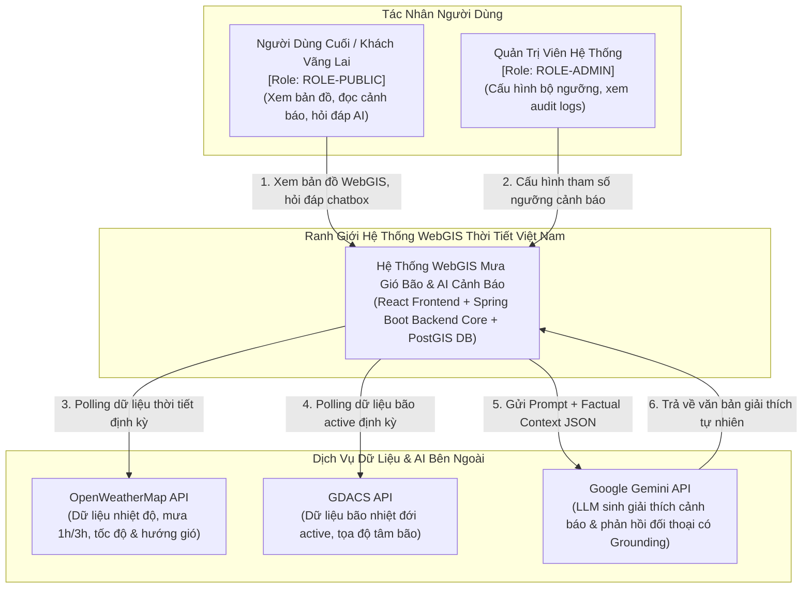

---

## 5. High-Level Architecture (C4 Level 2 - Container Diagram)

Toàn bộ ứng dụng được tổ chức thành các container phần mềm độc lập, giao tiếp thông qua giao thức chuẩn:

```mermaid
flowchart TB
    subgraph Client_Tier [" Tầng Trình Diễn (Client Tier) "]
        SPA["Single Page Application (SPA)<br/>[React 18 + Leaflet + Tailwind CSS]<br/>- Bản đồ WebGIS đa lớp (Mưa, Gió, Bão)<br/>- Panel danh sách cảnh báo thời gian thực<br/>- Drawer Chatbox đối thoại AI"]
    end

    subgraph Gateway_Tier [" Tầng Cổng & Bảo Vệ (Reverse Proxy & Security) "]
        NGINX["Nginx Web Server / Gateway<br/>- Phục vụ Static SPA Assets<br/>- SSL/TLS Termination (HTTPS 443)<br/>- Reverse Proxy /api/v1/*<br/>- Rate Limiter cho Chatbot"]
    end

    subgraph App_Tier [" Tầng Ứng Dụng (Spring Boot Modular Monolith) "]
        subgraph Spring_App [" weather-gis-backend.jar (Java 21) "]
            API_CTRL["Spring REST Controllers<br/>(Location, Weather, Storm, Threshold, Alert, Chat)"]
            
            subgraph Core_Domains [" Domain Services & Engines "]
                INGEST_ENG["Ingestion Service<br/>(OWM & GDACS Clients)"]
                MONITOR_ENG["Threshold & Monitoring Engine<br/>(Spatial Distance & Metric Matching)"]
                AI_SERVICE["AI Grounding & LLM Service<br/>(Gemini Integration & Fallback Guard)"]
                CHAT_SERVICE["Conversational Chat Service<br/>(Intent Classification & Context Builder)"]
            end

            SCHEDULER["Spring Task Scheduler<br/>(@Scheduled Polling Workers)"]
        end
    end

    subgraph Data_Tier [" Tầng Dữ Liệu Không Gian (Database Tier) "]
        POSTGIS[("PostgreSQL 16 + PostGIS 3.4<br/>- locations, weather_records<br/>- storms, storm_tracks<br/>- alert_thresholds, alerts<br/>- chat_sessions, chat_messages<br/>- data_sync_logs")]
    end

    subgraph Cloud_Services [" Dịch Vụ Đám Mây Bên Ngoài "]
        EXT_OWM["OpenWeatherMap API"]
        EXT_GDACS["GDACS API"]
        EXT_GEMINI["Google Gemini API"]
    end

    SPA -->|HTTPS / REST GeoJSON| NGINX
    NGINX -->|HTTP Forwarding :8080| API_CTRL

    API_CTRL --> Core_Domains
    SCHEDULER --> INGEST_ENG
    SCHEDULER --> MONITOR_ENG

    INGEST_ENG -->|WebClient HTTP GET| EXT_OWM
    INGEST_ENG -->|WebClient HTTP GET| EXT_GDACS
    AI_SERVICE -->|WebClient HTTP POST (Grounding Prompt)| EXT_GEMINI
    CHAT_SERVICE --> AI_SERVICE

    MONITOR_ENG -->|Spatial Queries & ST_DistanceSphere| POSTGIS
    Core_Domains -->|Spring Data JPA / Hibernate Spatial| POSTGIS
```

---

## 6. Component Architecture

Bảng phân rã chi tiết toàn bộ các thành phần phần mềm trong kiến trúc Backend:

| Component ID | Component Name | Trách Nhiệm Kỹ Thuật (Responsibility) | Đầu Vào (Inputs) | Đầu Ra (Outputs) | Dependencies | SRS Traceability |
| :--- | :--- | :--- | :--- | :--- | :--- | :--- |
| **CMP-LOC** | Location Management | Quản lý danh mục các trạm quan trắc địa lý, vùng hành chính và hình học Point WGS84. | Truy vấn lọc vùng, mã trạm | DTO / GeoJSON FeatureCollection | PostGIS (`locations`) | SR-MAP-001 |
| **CMP-WTH** | Weather Ingestion & Query | Quản lý chuỗi thời gian khí tượng (mưa 1h/3h, tốc độ/hướng gió, áp suất). Cung cấp API trực quan hóa. | OWM Raw Payload, Client bbox | GeoJSON Weather FeatureCollection, History DTO | PostGIS (`weather_records`), OWM Client | SR-MAP-002, SR-MAP-003, SR-ING-001 |
| **CMP-STM** | Storm Tracking Engine | Thu nạp bão active từ GDACS, loại trừ bão tan (`SYS-RULE-001`), dựng LineString quỹ đạo và đa giác bán kính nguy hiểm. | GDACS GeoJSON/XML, Client stormId | GeoJSON Track FeatureCollection, Storm Details | PostGIS (`storms`, `storm_tracks`), GDACS Client | SR-STM-001, SR-STM-002, SR-STM-003 |
| **CMP-ALT-CFG** | Threshold Configuration | Cung cấp CRUD bộ quy chuẩn ngưỡng cho Admin. Kiểm tra tính hợp lệ toán tử, tham số (`SYS-RULE-002`). | Admin Threshold Requests | Threshold Entities, 400 Bad Request if invalid | PostGIS (`alert_thresholds`) | SR-ALT-001, UC-003 |
| **CMP-ALT-MON** | Background Monitoring Engine | Định kỳ quét số liệu khí tượng mới nhất, tính toán khoảng cách không gian tới tâm bão (`ST_DistanceSphere`), phát hiện vi phạm ngưỡng. | Cron Trigger, Weather & Storm Data, Thresholds | Threshold Violation Events | PostGIS Spatial, Event Publisher | SR-ALT-002, UC-004 |
| **CMP-AI-PRO** | Proactive AI Agent | Tiếp nhận sự kiện vi phạm ngưỡng, xây dựng Factual Context, gọi Gemini API sinh tiêu đề và giải thích; kiểm chứng số liệu; kích hoạt Fallback khi lỗi. | Violation Event, Measurement Values | Persisted Alert Entity (`alerts`) | Gemini Client, Fallback Template Engine | SR-AGT-001, SR-AGT-002, SR-AGT-003 |
| **CMP-AI-PAS** | Grounded Chatbot Service | Phân loại ý định hỏi đáp, trích xuất dữ liệu thực tế từ DB làm Context (RAG), gọi Gemini sinh phản hồi tiếng Việt có trích dẫn thực thể. | User query string, optional `alert_id` | Chat Reply DTO, referenced entities list | Gemini Client, PostGIS Data Services | SR-AGT-001-PAS, SR-AGT-002-PAS, UC-005 |
| **CMP-SEC** | Security & Rate Limiting | Kiểm soát phân quyền 3 vùng (Public, Admin, Worker `X-Internal-Secret`), áp dụng Bucket Rate Limiter cho khung chat. | HTTP Request Headers, Client IP/Session | Allow / 401 / 403 / 429 Responses | Spring Security, In-Memory Token Bucket | SRS Sec 15, SR-ING-002, VAL-SEC-001 |

---

## 7. System & Trust Boundaries

### 7.1. Inside System (Nội bộ hệ thống)
* Ứng dụng Client WebGIS React (Leaflet, Tailwind).
* Nginx Reverse Proxy đóng vai trò Ingress Controller cục bộ.
* Quy trình Spring Boot Core Application (`weather-gis-backend.jar`).
* Cơ sở dữ liệu PostgreSQL 16 tích hợp phần mở rộng PostGIS 3.4.

### 7.2. Outside System (Hệ thống bên ngoài)
* **OpenWeatherMap API:** Cung cấp số liệu khí tượng.
* **GDACS API:** Cung cấp thông tin bão nhiệt đới.
* **Google Gemini API:** Nền tảng mô hình ngôn ngữ lớn điện toán đám mây.
* **OSM Map Tile Server:** Cung cấp các mảnh bản đồ nền chuẩn OpenStreetMap/CartoDB cho Leaflet.

### 7.3. Trust Boundaries (Ranh giới tin cậy & bảo mật)
1. **Public Internet Boundary:** Kết nối từ trình duyệt người dùng đến Nginx qua HTTPS (TLS 1.2+). Vùng này hoàn toàn không tin cậy (Untrusted). Mọi chuỗi ký tự gửi lên đều phải được làm sạch chống XSS và kiểm tra độ dài.
2. **Application Trust Boundary:** Giao tiếp nội bộ giữa Nginx và Spring Boot qua mạng nội bộ hoặc Docker Virtual Bridge.
3. **Internal Automation Boundary:** Các endpoint `/internal/*` chỉ chấp nhận yêu cầu chứa mã bí mật hợp lệ qua header `X-Internal-Secret` hoặc chỉ được kích hoạt bởi In-Process Scheduler nội bộ.
4. **Third-Party Outbound Boundary:** Các kết nối HTTP Client hướng ra Internet (OWM, GDACS, Gemini) được mã hóa TLS, áp dụng Timeout nghiêm ngặt (Connect Timeout: 3s, Read Timeout: 5s).

### 7.4. Data Boundaries (Ranh giới dữ liệu)
* Dữ liệu thời tiết và bão là dữ liệu mở công cộng (Public Read).
* Cấu hình ngưỡng cảnh báo chỉ cho phép ghi bởi `ROLE-ADMIN`.
* Khung chat không lưu trữ bất kỳ thông tin nhận dạng cá nhân nào (No PII) của người dùng công cộng (`NFR-PRV-001`).

---

## 8. Module Boundaries & Domain Specification

```
vn.weathergis
├── location     # Quản lý trạm quan trắc địa lý
├── weather      # Quản lý số liệu khí tượng chuỗi thời gian
├── storm        # Quản lý cơn bão active và quỹ đạo
├── threshold    # Quản lý cấu hình bộ ngưỡng rủi ro
├── alert        # Quản lý cảnh báo thiên tai và AI generator chủ động
├── chat         # Quản lý phiên hội thoại và AI assistant bị động
├── automation   # Tiến trình nạp dữ liệu định kỳ và worker giám sát
├── security     # Bộ lọc phân quyền RBAC và Rate Limiting
└── common       # DTO chuẩn, Exception Handling, GeoJSON Serializer
```

### Chi tiết các Bounded Contexts:

#### 1. Domain `location`
- **Mục đích:** Quản trị các điểm trạm quan trắc trên đất liền và hải đảo.
- **Dữ liệu sở hữu:** Bảng `locations` (`id`, `code`, `name`, `region`, `geom`, `boundary`, `is_active`).
- **Giao diện công khai:** `LocationQueryService` cung cấp phương thức tìm kiếm trạm theo vùng, trạm gần nhất quanh tọa độ.
- **Ràng buộc:** Tọa độ phải nằm trong khoảng WGS84 chuẩn (`VAL-LOC-001`).

#### 2. Domain `weather`
- **Mục đích:** Lưu trữ và cung cấp dữ liệu thời tiết thời gian thực phục vụ bản đồ số.
- **Dữ liệu sở hữu:** Bảng `weather_records`.
- **Giao diện công khai:** `WeatherService` cung cấp phương thức nạp bản ghi mới, lấy thời tiết mới nhất toàn mạng lưới, lấy chuỗi lịch sử 24h.
- **Quy tắc:** Lượng mưa $\ge 0.0\,mm$, Vận tốc gió $\ge 0.0\,m/s$ (`VAL-WTH-001..003`).

#### 3. Domain `storm`
- **Mục đích:** Theo dõi bão nhiệt đới trên Biển Đông và lân cận.
- **Dữ liệu sở hữu:** Bảng `storms` và `storm_tracks`.
- **Giao diện công khai:** `StormService` cung cấp danh sách bão đang hoạt động (`status = 'active'`), chi tiết bão, và GeoJSON FeatureCollection quỹ đạo.
- **Quy tắc cốt lõi:** Tuyệt đối loại trừ bão đã tan (`status != 'active'`) khỏi lớp hiển thị bản đồ khẩn cấp (`SYS-RULE-001`).

#### 4. Domain `threshold`
- **Mục đích:** Quản lý quy chuẩn kích hoạt cảnh báo nguy hiểm.
- **Dữ liệu sở hữu:** Bảng `alert_thresholds`.
- **Giao diện công khai:** `ThresholdService` cung cấp danh sách quy tắc đang kích hoạt (`is_enabled = true`) cho tiến trình giám sát.
- **Quy tắc:** Bắt buộc hỗ trợ đủ 3 khía cạnh rủi ro (`rain_1h/3h`, `wind_speed/gust`, `storm_distance_km`) (`SYS-RULE-002`, `VAL-ALT-001..003`).

#### 5. Domain `alert`
- **Mục đích:** Phát hiện vượt ngưỡng, phối hợp với Gemini API sinh văn bản cảnh báo có kiểm chứng, và công bố lên WebGIS.
- **Dữ liệu sở hữu:** Bảng `alerts`.
- **Giao diện công khai:** `AlertService` cung cấp danh sách cảnh báo thời gian thực, GeoJSON layer điểm nguy hiểm, và phương thức tạo cảnh báo mới từ sự kiện vượt ngưỡng.
- **Quy tắc:** Áp dụng nguyên tắc Grounding không ảo giác số liệu (`SYS-RULE-003`, `SYS-RULE-004`). Kích hoạt mẫu câu chuẩn hóa Fallback khi Gemini API lỗi (`SR-AGT-003`).

#### 6. Domain `chat`
- **Mục đích:** Kênh tương tác ngôn ngữ tự nhiên thông minh cho cộng đồng.
- **Dữ liệu sở hữu:** Bảng `chat_sessions` và `chat_messages`.
- **Giao diện công khai:** `ChatService` tiếp nhận câu hỏi, xây dựng Factual Context từ `WeatherService`, `StormService`, `AlertService`, gọi Gemini API và phản hồi.
- **Quy tắc:** Giới hạn 1 - 500 ký tự (`VAL-CHT-001`), từ chối trả lời ngoài phạm vi khí tượng/thiên tai.

---

## 9. Dependency Architecture & Rules

Kiến trúc áp dụng nghiêm ngặt nguyên tắc phụ thuộc một chiều (**Directional Dependency Rules**) theo mô hình Clean Architecture thu nhỏ trong từng module:

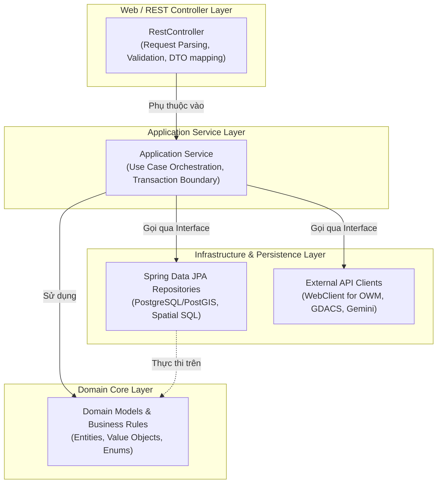

### Quy tắc phụ thuộc bắt buộc:
1. **Forbidden Dependencies (Nghiêm cấm):**
   - Controller tuyệt đối không được gọi trực tiếp xuống Repository (bắt buộc qua Application Service).
   - Domain Model không được phụ thuộc vào Controller DTO hoặc Spring Web framework.
   - Module `location`, `weather`, `storm`, `threshold` không được phụ thuộc ngược vào module `alert` hoặc `chat` (ngăn chặn Circular Dependency).
2. **Cross-Module Communication:**
   - Khi `CMP-ALT-MON` (tiến trình giám sát) phát hiện vượt ngưỡng, nó kích hoạt `AlertGenerationService` bằng một sự kiện domain (`ThresholdViolatedEvent`) thông qua Spring `ApplicationEventPublisher`.

---

## 10. Logical Data Architecture

Mô hình dữ liệu logic được chuẩn hóa toàn vẹn từ [1. ERD.md](file:///Users/dllv/Documents/GitHub/WebGIS-for-weather-of-Vietnam/docs/The%20plans%20of%20project/1.%20ERD.md):

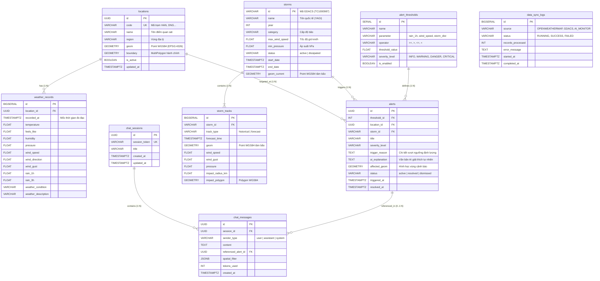

---

## 11. Main Data Flows (End-to-End Sequence Diagrams)

### 11.1. Flow 1: Giám Sát Định Kỳ & Tự Động Sinh Cảnh Báo Bằng AI (UC-004 $\rightarrow$ SR-ALT-002, SR-AGT-001)

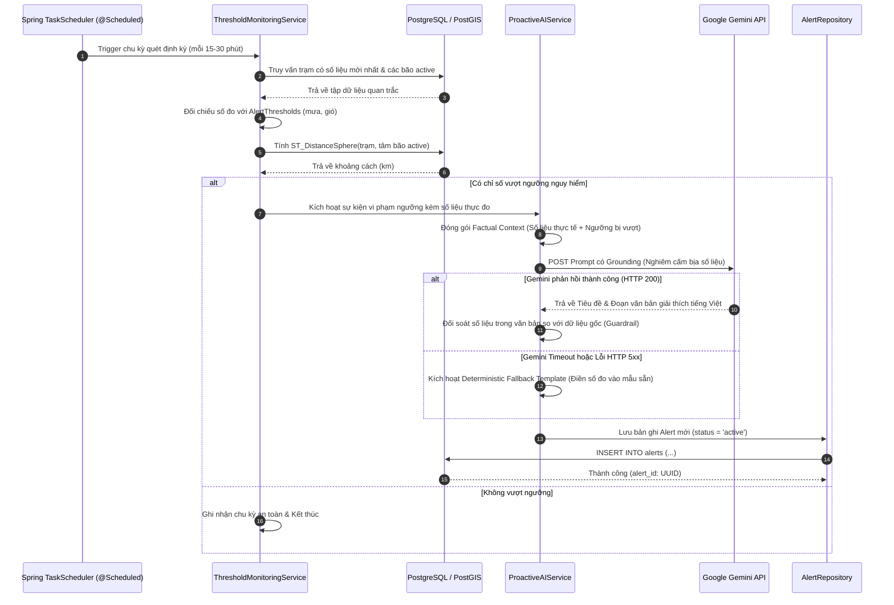

### 11.2. Flow 2: Người Dùng Hỏi Đáp AI Chat Có Grounding Dữ Liệu (UC-005 $\rightarrow$ SR-AGT-001-PAS)

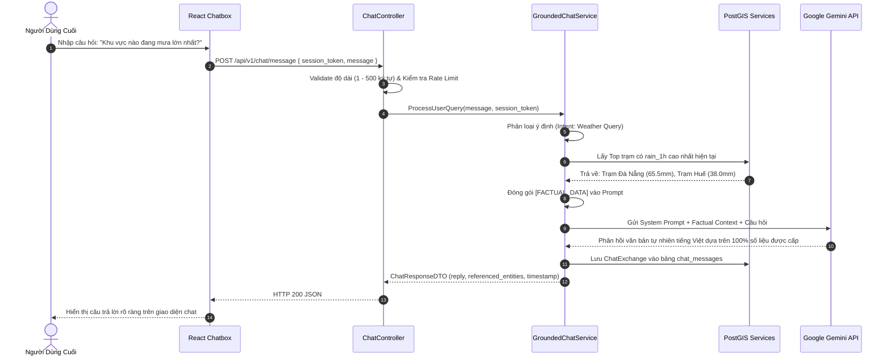

### 11.3. Flow 3: Khám Phá Bản Đồ WebGIS & Tương Tác Cảnh Báo (UC-001 $\rightarrow$ SR-MAP-001..004)

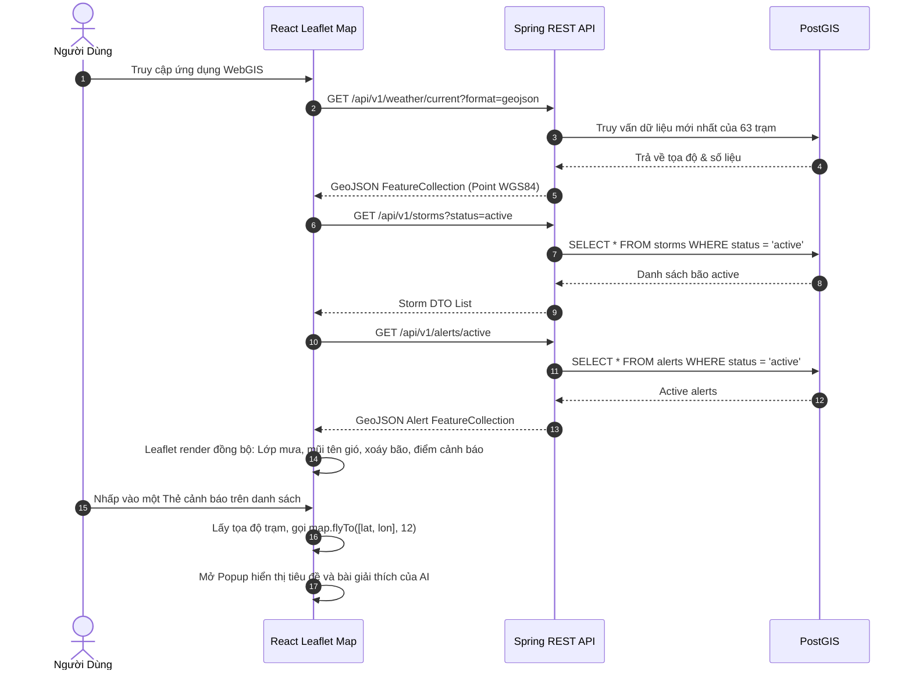

---

## 12. API / Interface Architecture

Toàn bộ hệ thống API được gom nhóm theo chuẩn RESTful tại tiền tố `/api/v1` (đồng bộ hoàn toàn với [2. API docs.md](file:///Users/dllv/Documents/GitHub/WebGIS-for-weather-of-Vietnam/docs/The%20plans%20of%20project/2.%20API%20docs.md)):

```
/api/v1
├── /locations              [Public] Quản lý & tra cứu trạm quan trắc (JSON/GeoJSON)
├── /weather                [Public] Quan trắc thời tiết hiện tại, lịch sử chuỗi thời gian
├── /storms                 [Public] Theo dõi bão active, quỹ đạo LineString & Polygon
├── /alert-thresholds       [Public Read / Admin Write] Cấu hình quy chuẩn ngưỡng nguy hiểm
├── /alerts                 [Public] Danh sách cảnh báo, GeoJSON overlay layer
├── /chat                   [Public] Quản lý phiên hội thoại & hỏi đáp AI có Grounding
└── /internal               [Worker / Admin] Tiến trình nạp dữ liệu OWM/GDACS & quét ngưỡng
```

### Tiêu chuẩn giao tiếp API:
* **Protocol:** HTTPS (TLS 1.2+).
* **Payload Type:** `application/json; charset=utf-8` hoặc `application/geo+json`.
* **GeoJSON Standard:** Tuân thủ RFC 7946, hệ quy chiếu EPSG:4326 với mảng tọa độ `[kinh độ, vĩ độ]`.
* **Envelope Pattern:** Tất cả các endpoint trả về định dạng `{ success: boolean, data: ..., message: ... }` hoặc GeoJSON `FeatureCollection`.

---

## 13. Security Architecture

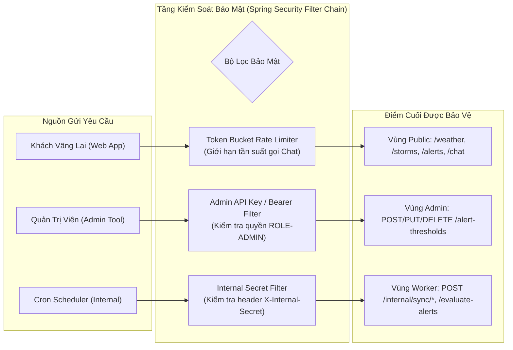

### Các lớp phòng thủ bảo mật chi tiết:
1. **Quản lý khóa bí mật (Secrets Management - NFR-SEC-002):**
   - Khóa API của OpenWeatherMap, Google Gemini API và mã `X-Internal-Secret` được nạp qua biến môi trường hệ điều hành (`ENVIRONMENT VARIABLES`). Tuyệt đối không hardcode trong mã nguồn hoặc file cấu hình git.
2. **Làm sạch dữ liệu đầu vào (Input Sanitization - VAL-CHT-001):**
   - Mọi câu hỏi gửi vào khung chat được cắt tỉa khoảng trắng, kiểm tra giới hạn độ dài (1 đến 500 ký tự UTF-8) và loại bỏ mã HTML script ngăn chặn triệt để tấn công Cross-Site Scripting (XSS).
3. **Bảo vệ lạm dụng tài nguyên (Rate Limiting - ERR-USR-001):**
   - Áp dụng thuật toán Token Bucket (thông qua thư viện Bucket4j trong Spring Boot) giới hạn mỗi phiên/IP tối đa một số lượt yêu cầu nhất định trong 1 phút đối với endpoint `/chat/message` nhằm bảo vệ chi phí token của Gemini API.
4. **Bảo mật tiến trình nội bộ (Worker Isolation - VAL-SEC-001):**
   - Các API `/internal/sync/*` từ chối ngay lập tức với mã HTTP 403 Forbidden nếu thiếu hoặc sai header `X-Internal-Secret`.

---

## 14. External Integrations Architecture

| Dịch Vụ Bên Ngoài | Mục Đích Tích Hợp | Phương Thức Giao Tiếp | Dữ Liệu Trao Đổi | Kịch Bản Thất Bại (Failure Mode) | Cơ Chế Giảm Thiểu (Mitigation) |
| :--- | :--- | :--- | :--- | :--- | :--- |
| **OpenWeatherMap API** | Lấy dữ liệu quan trắc thời tiết thời gian thực theo tọa độ | HTTP GET (WebClient) | Tọa độ $\rightarrow$ JSON (mưa 1h/3h, tốc độ/hướng gió, nhiệt độ, khí áp) | Timeout, HTTP 429 (Rate Limit), HTTP 5xx | Áp dụng Exponential Backoff, ghi log lỗi, duy trì số liệu của chu kỳ trước đó (`ERR-EXT-001`, `ERR-EXT-002`). |
| **GDACS API** | Lấy dữ liệu bão nhiệt đới đang hoạt động | HTTP GET (WebClient) | HTTP Request $\rightarrow$ GeoJSON/XML (Tên bão, tâm bão, cấp gió) | Không phản hồi, định dạng dữ liệu thay đổi | Giữ nguyên danh mục bão active hiện tại trong DB, ghi cảnh báo log (`ERR-EXT-003`). |
| **Google Gemini API** | Suy luận ngôn ngữ tự nhiên: sinh cảnh báo chủ động và hỏi đáp | HTTP POST (REST SDK) | Prompt + Factual Context JSON $\rightarrow$ Đoạn văn bản tiếng Việt | Timeout, HTTP 503, Quá tải Token | **Proactive:** Kích hoạt Deterministic Fallback Template.<br/>**Passive:** Phản hồi thông báo thân thiện hệ thống bận (`ERR-AI-001..003`). |

---

## 15. Asynchronous & Scheduled Task Architecture

Căn cứ vào nguyên tắc **Simplicity First**, hệ thống **không triển khai Message Broker ngoài** (như Kafka hoặc RabbitMQ) cho phiên bản MVP vì các lý do:
1. Luồng nạp dữ liệu khí tượng có tính chất chu kỳ (Batch Polling), không phải dòng dữ liệu sự kiện liên tục hàng triệu msg/s.
2. Spring Framework cung cấp sẵn giải pháp **Spring Task Scheduling (`@Scheduled`)** và **Spring Asynchronous Task Execution (`@Async` / `ThreadPoolTaskExecutor`)** chạy in-process an toàn, nhẹ nhàng và không phát sinh chi phí duy trì cụm máy chủ ngoài.

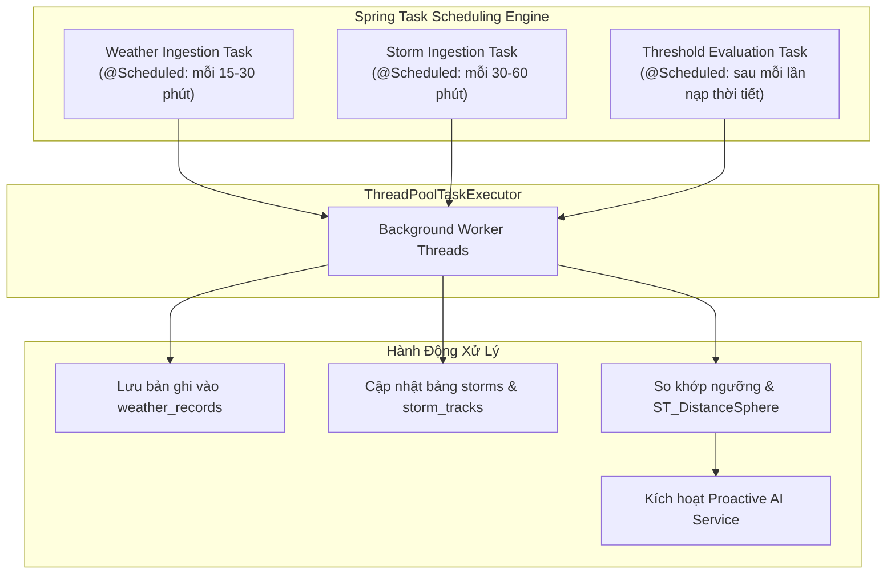

---

## 16. AI Grounding & Anti-Hallucination Architecture

Đây là module nghiệp vụ quan trọng nhất của hệ thống, tuân thủ nguyên tắc **Grounding Rule (SYS-RULE-004)** nhằm loại trừ 100% rủi ro bịa đặt số liệu khí tượng.

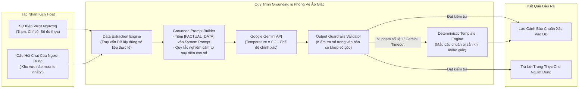

### Các chốt chặn kỹ thuật:
- **Temperature thấp (0.2):** Giảm thiểu tối đa tính ngẫu nhiên và sáng tạo ngoài khuôn khổ của mô hình LLM.
- **Strict Guardrail Regex đối soát:** Backend bóc tách các con số xuất hiện trong lời giải thích của Gemini và so sánh với tập số đo đầu vào. Nếu xuất hiện con số đo lường lạ $\rightarrow$ Tự động chuyển sang bản mẫu dự phòng chuẩn hóa.

---

## 17. Caching Architecture (Redis Cache & Rate Limiting)

* **Quyết định kiến trúc:** Sử dụng **Redis 7.x (Alpine)** làm lớp bộ nhớ đệm phân tán tập trung (Distributed Cache) và quản lý trạng thái Rate Limiting.
* **Mục tiêu kiến trúc:**
  1. **Stateless Backend:** Loại bỏ việc lưu trạng thái cache trong JVM Heap, giúp Backend Spring Boot hoàn toàn stateless, sẵn sàng scale ngang nhiều instance mà không lo lệch dữ liệu cache.
  2. **Tối ưu tốc độ phục vụ GeoJSON:** Dữ liệu bản đồ thời tiết của 63 trạm (`/api/v1/weather/current`) được chuyển đổi sẵn thành GeoJSON FeatureCollection và lưu trực tiếp trong Redis. Hàng nghìn người dùng truy cập cùng lúc được phục vụ trong < 2ms từ Redis, giảm tải 95% truy vấn xuống PostgreSQL/PostGIS.
  3. **Distributed Rate Limiting:** Lưu trữ Token Bucket của người dùng chat AI trên Redis, bảo đảm giới hạn 10 requests/phút được thực thi đồng nhất trên toàn bộ hệ thống.

```mermaid
flowchart TD
    subgraph Clients [" Khách Hàng WebGIS & Admin "]
        WEB_USER["Người Dùng Bản Đồ / Chatbot"]
        ADMIN_USER["Quản Trị Viên (Admin)"]
    end

    subgraph Spring_Boot_Backend [" Spring Boot 3 Backend "]
        REST_CTRL["REST Controllers & Filters"]
        REDIS_CACHE_MGR["Spring RedisCacheManager<br/>(Lettuce Driver + JSON Serializer)"]
        FALLBACK_HANDLER["CacheErrorHandler<br/>(Graceful Degradation Fallback)"]
        SERVICES["Domain Services<br/>(Weather, Location, Threshold, Chat)"]
        SYNC_WORKER["Background Ingestion Worker<br/>(OWM / GDACS Sync)"]
    end

    subgraph Distributed_Cache [" Distributed In-Memory Cache "]
        REDIS_SERVER[("Redis 7 (Alpine)<br/>Port: 6379 / Network Isolation")]
    end

    subgraph Spatial_Database [" Cơ Sở Dữ Liệu Địa Không Gian "]
        POSTGIS_DB[("PostgreSQL 16 + PostGIS 3.4<br/>Persistent Storage")]
    end

    WEB_USER -->|1. Gọi API (Weather / Locations / Chat)| REST_CTRL
    REST_CTRL --> SERVICES
    SERVICES -->|2. Tra cứu Cache| REDIS_CACHE_MGR
    REDIS_CACHE_MGR -->|3a. Cache Hit (<2ms)| REDIS_SERVER
    REDIS_CACHE_MGR -.->|3b. Cache Miss hoặc Redis Down| FALLBACK_HANDLER
    FALLBACK_HANDLER -->|4. Truy vấn CSDL| POSTGIS_DB
    FALLBACK_HANDLER -->|5. Nạp ngược vào Redis| REDIS_SERVER

    ADMIN_USER -->|Cập nhật ngưỡng /alert-thresholds| REST_CTRL
    REST_CTRL -->|@CacheEvict| REDIS_SERVER

    SYNC_WORKER -->|Nạp dữ liệu mới xong -> @CachePut / Evict| REDIS_SERVER
```

* **Chiến lược phân bổ Key, TTL và Cơ chế vô hiệu hóa (Eviction Strategy):**

| Tên Phân Vùng Cache | Tiền Tố Key (Key Pattern) | Kiểu Dữ Liệu | Thời Gian Tồn Tại (TTL) | Cơ Chế Vô Hiệu Hóa / Cập Nhật (Eviction / Invalidation) | Mục Đích Sử Dụng |
| :--- | :--- | :--- | :---: | :--- | :--- |
| **`locations`** | `weathergis:locations:all` | String (GeoJSON / JSON List) | **24 giờ** | Khi có migration thêm/sửa trạm quan trắc (`@CacheEvict`) | Danh mục 63 trạm quan trắc tĩnh trên toàn quốc. |
| **`thresholds`** | `weathergis:thresholds:active` | String (JSON Array) | **1 giờ** | Tự động xóa ngay lập tức khi Admin gọi `PUT /api/v1/alert-thresholds/{id}` (`@CacheEvict(value = "thresholds", allEntries = true)`) | Bảng quy chuẩn ngưỡng cảnh báo rủi ro thiên tai. |
| **`weather_current`** | `weathergis:weather:current` | String (GeoJSON FeatureCollection) | **15 phút** | Tự động làm mới hoặc xóa khi `WeatherSyncScheduler` nạp mẻ dữ liệu mới thành công từ OWM | Dữ liệu thời tiết tức thời của 63 trạm phục vụ lớp bản đồ mưa/gió. |
| **`active_storms`** | `weathergis:storms:active` | String (JSON Array / GeoJSON) | **30 phút** | Tự động xóa khi `StormSyncScheduler` hoàn thành chu kỳ đồng bộ GDACS | Danh sách các cơn bão đang hoạt động và tọa độ quỹ đạo. |
| **`rate_limit`** | `weathergis:ratelimit:{sessionId}` | String / Hash (Bucket4j / TTL counter) | **60 giây** | Tự động hết hạn (Redis Key Expiration) sau 1 phút | Giới hạn 10 câu hỏi/phút cho từng phiên chat Gemini AI. |

* **Định Dạng Tuần Tự Hóa (Serialization Format):**
  - **Key Serializer:** `StringRedisSerializer` (Đảm bảo key hiển thị rõ ràng, dễ debug trên `redis-cli`).
  - **Value Serializer:** `GenericJackson2JsonRedisSerializer` tích hợp `JavaTimeModule` (Xử lý mượt mà các đối tượng `Instant`, `OffsetDateTime` và hình học JTS GeoJSON).

* **Khả Năng Chống Chịu Sự Cố (Fault Tolerance & Resilience):**
  - Áp dụng mẫu thiết kế **Cache-Aside Pattern**.
  - Triển khai custom `CacheErrorHandler` ghi nhận nhật ký lỗi mức WARN và chuyển hướng truy vấn trực tiếp xuống PostgreSQL/PostGIS nếu Redis gặp sự cố kết nối hoặc hết bộ nhớ (`no-crash graceful degradation`).

---

## 18. Observability & Logging Architecture

Thiết kế giám sát hệ thống đáp ứng yêu cầu **NFR-OBS-001** và **NFR-OBS-002**:

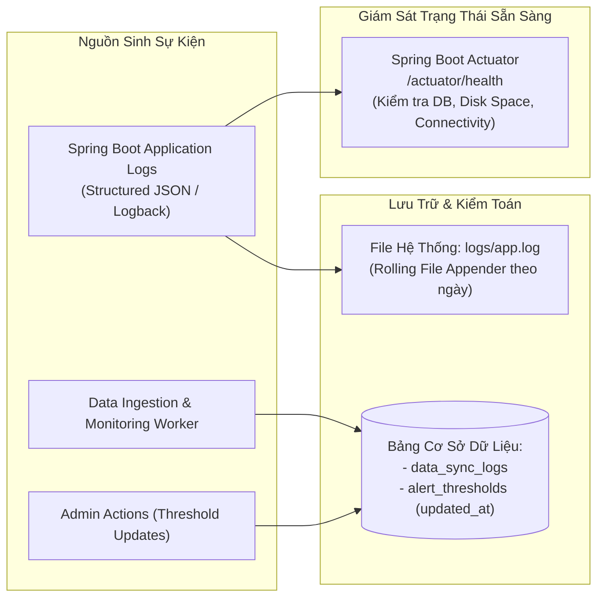

* **Cấu trúc bản ghi nhật ký kiểm toán trong DB (`data_sync_logs`):**
  Mỗi chu kỳ chạy của Ingestion Worker đều ghi lại: `source` (OWM, GDACS, AI_MONITOR), `status` (SUCCESS/FAILED), `records_processed`, `duration_ms` và `error_message` nếu có lỗi mạng.

---

## 19. Deployment Architecture

Hệ thống được thiết kế để triển khai đơn giản, bền bỉ trên một máy chủ ảo (Virtual Private Server - VPS) hoặc Cloud Compute Container (Docker Compose):

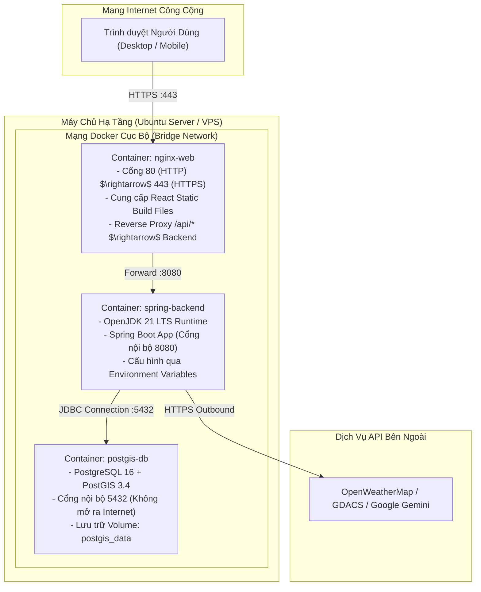

---

## 20. Environment Configuration

Hệ thống quản lý cấu hình thông qua cơ chế đa cấu hình (**Spring Profiles**) và biến môi trường chuẩn Twelve-Factor App:

| Tên Biến Môi Trường | Mô Tả & Mục Đích | Môi Trường Áp Dụng | Giá Trị Mẫu / Ghi Chú |
| :--- | :--- | :--- | :--- |
| `SPRING_PROFILES_ACTIVE` | Định danh cấu hình hoạt động | Dev, Test, Prod | `dev`, `test`, `prod` |
| `DB_HOST` | Địa chỉ máy chủ PostgreSQL | Tất cả | `localhost` (dev), `postgis-db` (docker) |
| `DB_PORT` | Cổng kết nối PostgreSQL | Tất cả | `5432` |
| `DB_NAME` | Tên cơ sở dữ liệu | Tất cả | `weather_gis_db` |
| `DB_USERNAME` | Tên đăng nhập cơ sở dữ liệu | Tất cả | `gis_user` |
| `DB_PASSWORD` | Mật khẩu cơ sở dữ liệu | Tất cả | *(Bảo mật, không đưa lên git)* |
| `OWM_API_KEY` | Khóa truy cập OpenWeatherMap API | Tất cả | *(Khóa dịch vụ từ nhà cung cấp)* |
| `GEMINI_API_KEY` | Khóa truy cập Google Gemini API | Tất cả | *(Khóa AI từ Google AI Studio)* |
| `INTERNAL_CRON_SECRET` | Mã bí mật bảo vệ endpoint nội bộ | Tất cả | Chuỗi bí mật dài ngẫu nhiên |
| `ADMIN_API_KEY` | Khóa quản trị viên cấu hình ngưỡng | Tất cả | Chuỗi xác thực quyền `ROLE-ADMIN` |
| `LOGGING_LEVEL_ROOT` | Mức độ chi tiết của nhật ký | Prod vs Dev | `INFO` (prod), `DEBUG` (dev) |

---

## 21. Project Repository Strategy

Đề xuất chiến lược tổ chức kho lưu trữ: **Monorepo (Single Repository)**.

| Tiêu Chí | Monorepo (Được chọn) | Multi-Repository | Lý Do Lựa Chọn Cho Dự Án |
| :--- | :--- | :--- | :--- |
| **Tính đồng bộ phiên bản** | 100% đồng bộ giữa tài liệu, Backend và Frontend | Dễ lệch pha phiên bản API DTO | Dự án có tài liệu đặc tả chặt chẽ, cùng một vòng đời phát hành MVP. |
| **Quy trình CI/CD** | 1 Pipeline duy nhất kiểm thử và đóng gói Docker | Phải quản lý nhiều pipeline rời rạc | Đơn giản hóa tối đa quy trình kiểm thử tự động. |
| **Trải nghiệm phát triển** | Mở một workspace duy nhất trong IDE | Phải mở nhiều cửa sổ dự án | Thuận tiện cho đội ngũ phát triển toàn diện (Full-stack). |

---

## 22. Complete Project Directory Tree

Dưới đây là cây thư mục mã nguồn hoàn chỉnh của dự án:

```text
webgis-weather-vietnam/
├── .github/
│   └── workflows/
│       ├── backend-ci.yml                 # CI: Build Maven/Gradle, Testcontainers, Linter
│       └── frontend-ci.yml                # CI: Build React, TypeScript check, ESLint
├── docs/
│   ├── The plans of project/
│   │   ├── 0. Introduction.md
│   │   ├── 1. ERD.md
│   │   ├── 2. API docs.md
│   │   ├── 3. BRD.md
│   │   ├── 4. SRS.md
│   │   └── 5. System Architecture.md
│   └── decisions/                         # Architecture Decision Records (ADRs)
│       ├── ADR-001-modular-monolith.md
│       ├── ADR-002-java-spring-boot.md
│       ├── ADR-003-postgis-spatial-engine.md
│       └── ADR-004-gemini-grounding-pattern.md
│
├── backend/
│   ├── mvnw / gradlew
│   ├── pom.xml / build.gradle             # Dependencies: Spring Web, Data JPA, Hibernate Spatial, Bucket4j
│   ├── Dockerfile                         # Multi-stage Docker build cho Java 21 LTS
│   └── src/
│       ├── main/
│       │   ├── java/vn/weathergis/
│       │   │   ├── WeatherGisApplication.java   # Main Spring Boot Application entrypoint
│       │   │   │
│       │   │   ├── common/                      # Shared Kernel (Cross-cutting components)
│       │   │   │   ├── api/                     # ApiResponse, ErrorDetails, Pagination
│       │   │   │   ├── exception/               # GlobalExceptionHandler, BusinessExceptions
│       │   │   │   ├── geojson/                 # GeoJsonSerializer, GeoJsonFeatureCollection
│       │   │   │   └── util/                    # DateTimeUtils, MathUtils
│       │   │   │
│       │   │   ├── config/                      # Infrastructure Configurations
│       │   │   │   ├── JacksonConfig.java       # JTS Geometry GeoJSON Module mapping
│       │   │   │   ├── WebClientConfig.java     # Config timeout và headers cho OWM, GDACS, Gemini
│       │   │   │   ├── SchedulingConfig.java    # Bật @EnableScheduling và cấu hình ThreadPool
│       │   │   │   └── RedisConfig.java         # Cấu hình Redis CacheManager & Serializer
│       │   │   │
│       │   │   ├── security/                    # Security & Rate Limiting Module
│       │   │   │   ├── SecurityConfig.java      # Spring Security Filter Chain
│       │   │   │   ├── InternalSecretFilter.java# Kiểm tra Header X-Internal-Secret
│       │   │   │   ├── AdminApiKeyFilter.java   # Kiểm tra Header X-Admin-Api-Key cho ROLE-ADMIN
│       │   │   │   └── RateLimitingFilter.java  # Token Bucket Rate Limiter cho Chatbox
│       │   │   │
│       │   │   ├── location/                    # Domain Module 1: Monitoring Locations
│       │   │   │   ├── controller/LocationController.java
│       │   │   │   ├── service/LocationService.java
│       │   │   │   ├── repository/LocationRepository.java
│       │   │   │   ├── domain/Location.java
│       │   │   │   └── dto/LocationDto.java
│       │   │   │
│       │   │   ├── weather/                     # Domain Module 2: Weather Observations
│       │   │   │   ├── controller/WeatherController.java
│       │   │   │   ├── service/WeatherService.java
│       │   │   │   ├── repository/WeatherRecordRepository.java
│       │   │   │   ├── domain/WeatherRecord.java
│       │   │   │   └── dto/WeatherCurrentDto.java, WeatherHistoryDto.java
│       │   │   │
│       │   │   ├── storm/                       # Domain Module 3: Active Storms & Tracks
│       │   │   │   ├── controller/StormController.java
│       │   │   │   ├── service/StormService.java
│       │   │   │   ├── repository/StormRepository.java, StormTrackRepository.java
│       │   │   │   ├── domain/Storm.java, StormTrack.java
│       │   │   │   └── dto/StormSummaryDto.java, StormTrackGeoJsonDto.java
│       │   │   │
│       │   │   ├── threshold/                   # Domain Module 4: Alert Thresholds Config
│       │   │   │   ├── controller/ThresholdController.java
│       │   │   │   ├── service/ThresholdService.java
│       │   │   │   ├── repository/AlertThresholdRepository.java
│       │   │   │   ├── domain/AlertThreshold.java
│       │   │   │   └── dto/ThresholdRequestDto.java, ThresholdResponseDto.java
│       │   │   │
│       │   │   ├── alert/                       # Domain Module 5: Alerts & Proactive AI Generation
│       │   │   │   ├── controller/AlertController.java
│       │   │   │   ├── service/AlertService.java, ProactiveWarningEngine.java
│       │   │   │   ├── service/DeterministicFallbackTemplate.java
│       │   │   │   ├── repository/AlertRepository.java
│       │   │   │   ├── domain/Alert.java, SeverityLevel.java
│       │   │   │   └── dto/AlertFeedDto.java
│       │   │   │
│       │   │   ├── chat/                        # Domain Module 6: Grounded AI Assistant
│       │   │   │   ├── controller/ChatController.java
│       │   │   │   ├── service/GroundedChatService.java, IntentClassificationService.java
│       │   │   │   ├── service/GeminiApiClient.java
│       │   │   │   ├── repository/ChatSessionRepository.java, ChatMessageRepository.java
│       │   │   │   ├── domain/ChatSession.java, ChatMessage.java
│       │   │   │   └── dto/ChatMessageRequest.java, ChatResponseDto.java
│       │   │   │
│       │   │   └── automation/                  # Domain Module 7: Ingestion & Cron Workers
│       │   │       ├── controller/InternalSyncController.java
│       │   │       ├── client/OpenWeatherMapClient.java, GdacsClient.java
│       │   │       ├── scheduler/WeatherSyncScheduler.java, StormSyncScheduler.java
│       │   │       ├── scheduler/ThresholdEvaluationScheduler.java
│       │   │       ├── repository/DataSyncLogRepository.java
│       │   │       └── domain/DataSyncLog.java
│       │   │
│       │   └── resources/
│       │       ├── application.yml              # Base application configuration
│       │       ├── application-dev.yml          # Local dev environment profile
│       │       ├── application-prod.yml         # Production container profile
│       │       └── db/migration/                # Flyway Database Migration Scripts
│       │           ├── V1__init_extensions_and_locations.sql
│       │           ├── V2__create_weather_and_storm_tables.sql
│       │           ├── V3__create_threshold_and_alert_tables.sql
│       │           ├── V4__create_chat_and_log_tables.sql
│       │           └── V5__seed_initial_locations_and_thresholds.sql
│       │
│       └── test/                                # Automated Test Suites
│           ├── java/vn/weathergis/
│           │   ├── unit/                        # Unit tests độc lập (Mock Service, Validation)
│           │   ├── integration/                 # Integration tests với Testcontainers (PostGIS)
│           │   └── api/                         # MockMvc REST API tests
│           └── resources/
│               └── application-test.yml
│
├── frontend/
│   ├── package.json
│   ├── tsconfig.json
│   ├── Dockerfile                         # Nginx multi-stage build cho React SPA
│   ├── public/
│   │   └── index.html
│   └── src/
│       ├── assets/                        # Icons, Marker symbols, CSS
│       ├── components/                    # Reusable UI Widgets
│       │   ├── common/                    # Header, Footer, DisclaimerBanner
│       │   ├── map/                       # Leaflet map container, LayerControls, Legend
│       │   ├── alerts/                    # AlertFeedPanel, AlertCard, SeverityBadge
│       │   └── chat/                      # ChatDrawer, ChatBubble, ChatInput
│       ├── hooks/                         # Custom React Hooks (useWeather, useStorms, useAlerts, useChat)
│       ├── services/                      # Axios API Clients calling /api/v1/*
│       ├── types/                         # TypeScript Interfaces (GeoJSON types, Alert, Storm)
│       └── App.tsx                        # Unified Dashboard Root Layout
│
├── deployment/
│   ├── docker-compose.yml                 # Triển khai toàn bộ stack (Frontend, Backend, PostGIS, Redis)
│   ├── docker-compose.dev.yml             # Chạy PostGIS & Redis phục vụ lập trình cục bộ
│   └── nginx/
│       └── default.conf                   # Nginx reverse proxy configuration & caching
│
├── scripts/
│   ├── setup_dev_env.sh                   # Script tự động khởi tạo môi trường dev
│   └── seed_initial_data.py               # Script hỗ trợ nạp danh mục trạm ban đầu
│
├── .gitignore
├── LICENSE
└── README.md
```

---

## 23. Directory & Package Responsibilities

| Đường Dẫn (Package/Folder) | Trách Nhiệm Kỹ Thuật (Responsibility) | Thành Phần Bên Trong | Những Gì KHÔNG Chứa |
| :--- | :--- | :--- | :--- |
| `vn.weathergis.common` | Chứa các quy chuẩn dùng chung toàn hệ thống (Cross-cutting Concerns). | Response envelope, Global exception handler, GeoJSON mapper, DateTime util. | Không chứa logic nghiệp vụ của bất kỳ domain cụ thể nào. |
| `vn.weathergis.config` | Thiết lập hạ tầng Spring Boot và bean cấu hình. | WebClient config, Jackson JTS serializer, TaskScheduler thread pool. | Không chứa code kiểm tra logic dữ liệu hoặc endpoint REST. |
| `vn.weathergis.security` | Bảo vệ các điểm cuối, lọc phân quyền và ngăn chặn tấn công DoS/Lạm dụng. | Security filter chain, header validator, Bucket4j token bucket rate limiter. | Không chứa business queries hay các thao tác ghi dữ liệu domain. |
| `vn.weathergis.<domain>.controller` | Tiếp nhận HTTP request, xác thực đầu vào (`@Valid`), điều hướng và trả về Response. | `@RestController`, `@GetMapping`, `@PostMapping`, Request DTO validation. | Không chứa câu lệnh SQL, không gọi trực tiếp Repository, không gọi API ngoài. |
| `vn.weathergis.<domain>.service` | Điều phối luồng nghiệp vụ, kiểm tra ràng buộc logic, quản lý transaction (`@Transactional`). | Service implementation, Event publisher, AI Prompt building, Fallback handling. | Không chứa mã HTTP Servlet, không định dạng trực tiếp giao diện. |
| `vn.weathergis.<domain>.repository` | Tương tác trực tiếp với cơ sở dữ liệu không gian PostgreSQL/PostGIS. | Spring Data JPA interfaces, `@Query` không gian (`ST_DistanceSphere`, `ST_Contains`). | Không chứa logic tính toán nghiệp vụ hay xử lý ngoại lệ người dùng. |
| `vn.weathergis.<domain>.domain` | Định nghĩa thực thể dữ liệu gốc và quan hệ quan hệ. | JPA `@Entity`, `@Table`, Enum định danh, JTS `Geometry` mapping. | Không chứa DTO giao tiếp HTTP hoặc code gọi network. |
| `resources/db/migration` | Quản lý vòng đời lược đồ cơ sở dữ liệu (Database Schema Evolution). | Các file script SQL phiên bản hóa (`V1__...sql`) của Flyway. | Không chứa mã nguồn Java hoặc file cấu hình động. |

---

## 24. Database Migration Structure (Flyway)

Toàn bộ lược đồ bảng, kiểu dữ liệu không gian, khóa chính UUID và chỉ mục PostGIS được quản lý tự động thông qua **Flyway Migration**:

* `V1__init_extensions_and_locations.sql`: Kích hoạt tiện ích mở rộng `uuid-ossp`, `postgis`; tạo bảng `locations` và chỉ mục không gian `idx_locations_geom`.
* `V2__create_weather_and_storm_tables.sql`: Tạo bảng `weather_records`, `storms`, `storm_tracks` kèm các ràng buộc `UNIQUE` và chỉ mục B-Tree kép.
* `V3__create_threshold_and_alert_tables.sql`: Tạo bảng `alert_thresholds` và bảng `alerts` (chứa cột `ai_explanation` và `affected_geom`).
* `V4__create_chat_and_log_tables.sql`: Tạo bảng `chat_sessions`, `chat_messages` và `data_sync_logs`.
* `V5__seed_initial_locations_and_thresholds.sql`: Nạp sẵn danh mục 63 trạm quan trắc chuẩn WGS84 trên toàn lãnh thổ Việt Nam và 4 bộ quy chuẩn ngưỡng cảnh báo ban đầu theo SRS.

---

## 25. Test Structure & Traceability

Kiến trúc kiểm thử được thiết kế để kiểm chứng 100% các tiêu chí chấp nhận (**Acceptance Criteria**) trong SRS:

```text
src/test/java/vn/weathergis/
├── unit/
│   ├── threshold/ThresholdValidationTest.java       # Kiểm chứng VAL-ALT-001..003
│   ├── alert/DeterministicFallbackTemplateTest.java  # Kiểm chứng SR-AGT-003, AC-AGT-PRO-003
│   └── chat/GroundingGuardrailTest.java             # Kiểm chứng chống ảo giác số liệu SYS-RULE-004
│
├── integration/
│   ├── BasePostgisIntegrationTest.java              # Cấu hình Testcontainers chạy PostGIS thật
│   ├── storm/StormSpatialQueryTest.java             # Kiểm chứng ST_DistanceSphere & lọc active SR-STM-003
│   └── automation/ThresholdMonitoringWorkerTest.java# Kiểm chứng luồng quét ngầm phát hiện vượt ngưỡng
│
└── api/
    ├── LocationControllerTest.java                  # Kiểm chứng GeoJSON Output SR-MAP-001
    ├── AlertControllerTest.java                     # Kiểm chứng Alert Feed & GeoJSON AC-UI-002
    ├── ChatRateLimitingTest.java                    # Kiểm chứng mã lỗi 429 ERR-USR-001
    └── InternalSecurityFilterTest.java              # Kiểm chứng mã lỗi 403 VAL-SEC-001
```

---

## 26. Architecture Decision Records (ADR)

### ADR-001: Lựa Chọn Phong Cách Kiến Trúc Modular Monolith
* **Bối cảnh:** Dự án cần xây dựng nhanh bản MVP hoạt động ổn định, tài nguyên máy chủ có hạn, số lượng domain nghiệp vụ tập trung vào thời tiết, bão và AI.
* **Quyết định:** Áp dụng kiến trúc Modular Monolith chạy trên một artifact Java duy nhất.
* **Hệ quả:** Loại bỏ hoàn toàn sự phức tạp của hạ tầng phân tán; dễ debug và deploy; duy trì ranh giới package chặt chẽ để có thể bóc tách thành Microservices trong tương lai nếu lưu lượng người dùng tăng đột biến.

### ADR-002: Lựa Chọn Ngôn Ngữ & Framework Backend (Java 21 + Spring Boot 3)
* **Bối cảnh:** Yêu cầu chuyển đổi từ định hướng ban đầu sang nền tảng chuẩn mực doanh nghiệp, mạnh mẽ về xử lý đa luồng, hỗ trợ xuất sắc hệ sinh thái GIS và tích hợp hệ thống.
* **Quyết định:** Sử dụng Java 21 LTS kết hợp Spring Boot 3.3+.
* **Hệ quả:** Tận dụng Virtual Threads (Project Loom) cho các tác vụ I/O gọi external API, thư viện Hibernate Spatial hỗ trợ bản địa kiểu dữ liệu PostGIS JTS Geometry, và cấu trúc bảo mật Spring Security hoàn chỉnh.

### ADR-003: Quản Lý Dữ Liệu Không Gian Bằng PostGIS (EPSG:4326)
* **Bối cảnh:** Cần tính toán khoảng cách thực tế giữa tâm bão và trạm quan trắc trên bề mặt cong Trái Đất, lưu trữ đa giác và hiển thị bản đồ GeoJSON.
* **Quyết định:** Sử dụng phần mở rộng PostGIS trên cơ sở dữ liệu PostgreSQL với hệ tọa độ WGS84 chuẩn.
* **Hệ quả:** Sử dụng trực tiếp hàm trắc địa `ST_DistanceSphere` cho độ chính xác cao và tốc độ truy vấn tối ưu nhờ chỉ mục GiST, không cần tính toán thủ công trên tầng ứng dụng.

### ADR-004: Cơ Chế Grounding Hai Lớp Kết Hợp Mẫu Dự Phòng (Deterministic Fallback)
* **Bối cảnh:** Cảnh báo thiên tai đòi hỏi độ chính xác tuyệt đối; ảo giác của AI (Hallucination) có thể gây hoang mang dư luận hoặc vi phạm pháp luật.
* **Quyết định:** Thiết kế quy trình Grounding 2 lớp: (1) Tiêm Factual Context vào System Prompt với Temperature thấp; (2) Bộ lọc đối soát số liệu sau khi nhận phản hồi. Nếu phát hiện vi phạm hoặc Gemini API timeout, tự động thay thế bằng Deterministic Fallback Template.
* **Hệ quả:** Đảm bảo 100% cảnh báo phát ra đều có số liệu trung thực, không bao giờ bị trễ hạn cảnh báo kể cả khi dịch vụ đám mây bên thứ ba gặp sự cố.

### ADR-005: Sử Dụng Redis 7 Làm Distributed Cache Tập Trung & Quản Lý Rate Limit
* **Bối cảnh:** Cần phục vụ nhanh dữ liệu bản đồ thời tiết cho hàng nghìn người dân khi có áp thấp nhiệt đới/bão đổ bộ mà không làm nghẽn CSDL PostGIS; đồng thời cần kiểm soát tần suất gọi AI Chatbot đồng nhất và giữ Backend hoàn toàn Stateless.
* **Quyết định:** Triển khai **Redis 7.x (Alpine)** làm lớp bộ nhớ đệm phân tán tập trung (Distributed Cache) và lưu trữ trạng thái Rate Limiting thông qua `spring-boot-starter-data-redis` (Lettuce driver).
* **Hệ quả:** 
  - *Tích cực:* Giảm 95% tải truy vấn xuống PostGIS; phản hồi API GeoJSON thời tiết trong < 2ms; Backend Spring Boot hoàn toàn stateless, sẵn sàng scale ngang nhiều instance; quản lý Rate Limit an toàn chống tấn công làm cạn kiệt ngân sách Gemini token.
  - *Tiêu cực:* Tốn thêm ~50MB RAM trên máy chủ VPS cho tiến trình Redis; độ trễ mạng nội bộ qua TCP socket khoảng 0.5ms (hoàn toàn chấp nhận được).
* **Khả năng phục hồi (Resilience):** Cấu hình `CacheErrorHandler` hỗ trợ Graceful Degradation: Nếu Redis gặp sự cố, tự động bypass cache và truy vấn trực tiếp PostGIS mà không làm sập ứng dụng.

---

## 27. Architecture Trade-Offs

| Quyết Định Kiến Trúc | Phương Án Thay Thế | Lý Do Chọn Giải Pháp Hiện Tại | Đánh Đổi Chấp Nhận (Trade-off) |
| :--- | :--- | :--- | :--- |
| **Modular Monolith** | Microservices phân tán | Đơn giản hóa triển khai, không độ trễ mạng nội bộ, phù hợp quy mô dữ liệu MVP. | Phải quản lý chặt chẽ mã nguồn để tránh coupling trong cùng một codebase. |
| **Spring In-Process Task Scheduling** | External Message Broker (Kafka/RabbitMQ) | Nhu cầu nạp dữ liệu là Batch Polling theo chu kỳ; không có dòng sự kiện push hàng triệu msg/s. | Tiến trình chạy nền chia sẻ CPU/RAM với tiến trình phục vụ REST API; nếu worker quá nặng có thể ảnh hưởng API (được giảm thiểu bằng ThreadPool riêng). |
| **Centralized Cache (Redis 7)** | Local In-Memory Cache (Caffeine) | Cho phép chia sẻ cache thời tiết/ngưỡng đồng bộ, quản lý Rate Limit tập trung, giữ Backend hoàn toàn Stateless để scale ngang tức thì khi có bão lớn. | Tốn thêm ~50MB RAM máy chủ cho container Redis và phát sinh độ trễ mạng TCP nội bộ (~0.5ms so với in-memory nanosecond). |
| **GeoJSON Format chuẩn WGS84** | Vector Tiles (MVT/Protobuf) | Dữ liệu trạm (63 trạm) và bão (vài điểm) rất nhẹ; Leaflet parse GeoJSON tức thì mà không cần máy chủ Vector Tile Server chuyên biệt. | Nếu sau này mở rộng hiển thị hàng triệu điểm đo radar độ phân giải cao sẽ cần nâng cấp lên Vector Tiles. |

---

## 28. Scalability Plan (Từ MVP Đến Production Quy Mô Lớn)

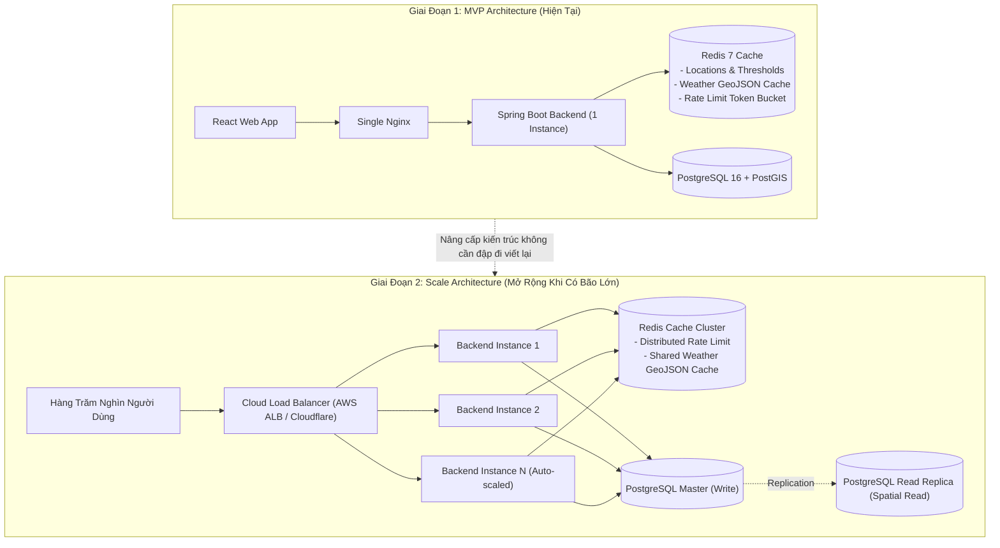

---

## 29. Failure Scenarios & Resilience Matrix

| Kịch Bản Sự Cố | Thành Phần Bị Ảnh Hưởng | Hành Vi Hệ Thống Dự Kiến | Cơ Chế Phục Hồi & Tự Khắc Phục (Recovery) |
| :--- | :--- | :--- | :--- |
| **OpenWeatherMap API timeout hoặc lỗi 5xx** | `WeatherSyncScheduler` | Ghi log cảnh báo mức ERROR, không làm sập ứng dụng, duy trì số liệu của chu kỳ trước đó. | Hiển thị dữ liệu gần nhất trên bản đồ kèm nhãn: *"Đang đồng bộ lại dữ liệu..."*. Thử lại ở chu kỳ tiếp theo. |
| **GDACS API không phản hồi** | `StormSyncScheduler` | Giữ nguyên danh mục bão active hiện tại trong DB, không xóa bão khi chưa có xác nhận `dissipated`. | Ghi log kiểm toán; bản đồ duy trì vị trí tâm bão của lần cập nhật gần nhất. |
| **Google Gemini API quá tải hoặc timeout khi phát cảnh báo** | `ProactiveWarningEngine` | Bắt TimeoutException trong 5 giây, chuyển ngay lập tức sang `DeterministicFallbackTemplate`. | Bản tin cảnh báo được tạo ngay lập tức với số liệu thực tế; cờ `is_fallback = true` được ghi nhận. |
| **Người dùng spam câu hỏi chatbox liên tục** | `ChatController` | Bộ lọc `RateLimitingFilter` kích hoạt dựa trên Redis Token Bucket, trả về HTTP 429 Too Many Requests. | Yêu cầu không được gửi sang Gemini API, bảo vệ ngân sách token của hệ thống. |
| **Redis Server tạm thời mất kết nối hoặc quá tải RAM** | `RedisCacheManager` / `RateLimitingFilter` | `CacheErrorHandler` kích hoạt Graceful Degradation: Bỏ qua cache, truy vấn trực tiếp PostGIS DB. | Ghi log WARN kiểm toán; hệ thống tự động kết nối lại Redis ngay khi service phục hồi (`Lettuce Auto-reconnect`). |
| **Cơ sở dữ liệu PostgreSQL tạm thời mất kết nối** | HikariCP Connection Pool | Ứng dụng kích hoạt retry kết nối tự động, endpoint `/health` chuyển sang trạng thái DOWN. | Tự động khôi phục kết nối ngay khi database online trở lại mà không cần khởi động lại Spring Boot. |

---

## 30. Architecture Traceability Matrix

| Mã Yêu Cầu SRS | Bounded Context / Component | Tầng Ứng Dụng Backend | Thực Thể Dữ Liệu | Endpoint REST API | Thành Phần Frontend |
| :--- | :--- | :--- | :--- | :--- | :--- |
| **SR-MAP-001** | `location` | `LocationService`, `LocationController` | `locations` | `GET /api/v1/locations` | `MapContainer`, `LeafletBaseMap` |
| **SR-MAP-002** | `weather` | `WeatherService`, `WeatherController` | `weather_records` | `GET /api/v1/weather/current` | `RainfallLayer` (GeoJSON CircleMarkers) |
| **SR-MAP-003** | `weather` | `WeatherService`, `WeatherController` | `weather_records` | `GET /api/v1/weather/current` | `WindLayer` (Directional Arrows) |
| **SR-MAP-004** | `common` | Frontend State Management | Không | Không | `LayerControls` (Toggle Checkboxes) |
| **SR-STM-001** | `storm`, `automation`| `GdacsClient`, `StormSyncScheduler` | `storms`, `storm_tracks` | `POST /internal/sync/storms` | Không (Background Worker) |
| **SR-STM-002** | `storm` | `StormService`, `StormController` | `storms`, `storm_tracks` | `GET /api/v1/storms/{id}/track`| `ActiveStormTrackLayer` (Polyline & Marker) |
| **SR-STM-003** | `storm` | `StormRepository` (Filter `status='active'`) | `storms` | `GET /api/v1/storms` | Tự động loại trừ bão tan trên bản đồ |
| **SR-ALT-001** | `threshold` | `ThresholdService`, `ThresholdController`| `alert_thresholds` | `GET, POST, PUT, DELETE /alert-thresholds`| `AdminThresholdModal` |
| **SR-ALT-002** | `automation` | `ThresholdEvaluationScheduler` | `alert_thresholds`, `weather_records` | `POST /internal/evaluate-alerts` | Không (Background Worker) |
| **SR-AGT-001** | `alert` | `ProactiveWarningEngine`, `GeminiApiClient`| `alerts` | Không (Internal Event) | `AlertFeedPanel` |
| **SR-AGT-002** | `alert` | `OutputGuardrailValidator` | `alerts` | `GET /api/v1/alerts` | `AlertCard`, `SeverityBadge` |
| **SR-AGT-003** | `alert` | `DeterministicFallbackTemplate` | `alerts` | Không (Fallback Logic) | Bản tin chuẩn hóa khi Gemini lỗi |
| **SR-AGT-001-PAS**| `chat` | `GroundedChatService`, `GeminiApiClient`| `chat_sessions`, `chat_messages` | `POST /api/v1/chat/message` | `AIChatDrawer`, `ChatBubble` |
| **SR-AGT-002-PAS**| `chat` | `GroundedChatService` (Deep explain alert)| `alerts`, `chat_messages` | `POST /api/v1/chat/sessions/{id}/messages`| Nút *"Hỏi thêm AI về cảnh báo này"* |
| **SR-UI-001** | Frontend Root | React SPA Architecture | Không | `GET /` | `UnifiedDashboardLayout` |
| **SR-UI-002** | `alert` | `AlertController` | `alerts` | `GET /api/v1/alerts/active` | Vùng nhấp nháy trên bản đồ & FlyTo |
| **SR-UI-003** | Frontend Root | Disclaimer Component | Không | Không | `DisclaimerBanner` (Footer) |
| **SR-ING-001** | `automation` | `OpenWeatherMapClient`, `WeatherScheduler`| `weather_records` | `POST /internal/sync/weather`| Không (Background Ingestion) |
| **SR-ING-002** | `security` | `InternalSecretFilter` | `data_sync_logs` | Header `X-Internal-Secret` | Không (Security Filter) |

---

## 31. Implementation Order & Development Roadmap

Để một team developer triển khai dự án hiệu quả nhất, thứ tự thực hiện được phân chia thành 6 giai đoạn tuần tự:

```mermaid
flowchart TD
    P1["Giai Đoạn 1: Nền Tảng & Hạ Tầng (Foundation)<br/>- Khởi tạo Spring Boot 3 & React Leaflet project<br/>- Thiết lập Docker Compose PostGIS<br/>- Chạy Flyway migrations tạo bảng và nạp 63 trạm<br/>- Cấu hình Global Exception & Response Envelope"]
    
    P2["Giai Đoạn 2: Dữ Liệu Thời Tiết & Bản Đồ Số (Core WebGIS)<br/>- Hiện thực OWM WebClient & Ingestion Worker<br/>- Hiện thực GDACS Client & Storm Tracker<br/>- Viết REST API GeoJSON /weather/current, /storms<br/>- Frontend vẽ bản đồ Leaflet, hiển thị lớp mưa, gió, bão"]
    
    P3["Giai Đoạn 3: Bộ Ngưỡng & Giám Sát Ngầm (Threshold & Monitor)<br/>- Cụm API CRUD /alert-thresholds cho Admin<br/>- Tiến trình giám sát ngầm tính ST_DistanceSphere<br/>- Phát hiện vượt ngưỡng & sinh sự kiện cảnh báo"]
    
    P4["Giai Đoạn 4: Tích Hợp AI Agent Chủ Động & Bị Động (AI Integration)<br/>- Tích hợp Google Gemini API Client<br/>- Hiện thực cơ chế Grounding & Anti-hallucination guardrail<br/>- Hiện thực Deterministic Fallback Template<br/>- Xây dựng Chatbox đối thoại và giải thích cảnh báo sâu"]
    
    P5["Giai Đoạn 5: Bảo Mật, Rate Limit & Hoàn Thiện Giao Diện (Hardening)<br/>- Tích hợp Bucket4j Rate Limiting cho Chatbot<br/>- Bảo vệ endpoint nội bộ bằng X-Internal-Secret<br/>- Ghim DisclaimerBanner pháp lý tại chân trang<br/>- Kiểm thử Responsive cơ bản trên Mobile/Desktop"]
    
    P6["Giai Đoạn 6: Kiểm Thử Tự Động & Đóng Gói Triển Khai (Release)<br/>- Viết Unit Tests & Integration Tests (Testcontainers)<br/>- Đóng gói Docker Images multi-stage<br/>- Cấu hình Nginx SSL và triển khai Production"]

    P1 --> P2 --> P3 --> P4 --> P5 --> P6
```

---

## 32. Architecture Quality Check

* [x] **Requirement Coverage:** 100% các yêu cầu chức năng (SR-MAP, SR-STM, SR-ALT, SR-AGT-PRO, SR-AGT-PAS, SR-UI, SR-ING) và phi chức năng (NFR-SEC, NFR-PERF, NFR-AVL, NFR-REL, NFR-OBS) đều được giải quyết tường minh trong kiến trúc.
* [x] **Coupling & Cohesion:** Các domain được phân tách thành từng package độc lập; không có vòng lặp phụ thuộc (no circular dependencies).
* [x] **Simplicity & Anti-Overengineering:** Không sử dụng microservices, không dùng message broker phân tán; tận dụng triệt để sức mạnh in-process của Spring Boot và PostgreSQL/PostGIS.
* [x] **Security & Trust Boundaries:** Phân tách ranh giới rõ ràng giữa vùng công khai, vùng quản trị và vùng worker tự động; bảo vệ token Gemini bằng Rate Limiter và Input Sanitization.
* [x] **Operational Feasibility:** Cấu trúc dự án rõ ràng, có đầy đủ script Docker Compose và Flyway migration để một kỹ sư mới có thể khởi chạy toàn bộ hệ thống cục bộ trong vòng 5 phút.

---

## 33. Assumptions, TBDs & Architectural Dependencies

Căn cứ theo nguyên tắc tại Mục 43 của tài liệu, các giả định kiến trúc được ghi nhận minh bạch:

1. **Architectural Dependency: Chu kỳ Ingestion tối ưu cho MVP**
   - *Status:* **TBD** *(Chờ phê duyệt từ Product Owner theo OQ-002)*.
   - *Lý do:* Cần chốt ngân sách chi trả cho gói cước OpenWeatherMap và Gemini API để thiết lập chu kỳ `@Scheduled` (đề xuất: 15 phút cho thời tiết và 30 phút cho bão).
   - *Tác động nếu chưa chốt:* Hệ thống đặt mặc định 30 phút/lần nạp trong cấu hình `application.yml` để đảm bảo an toàn hạn mức tài nguyên miễn phí.
2. **Assumption: Lưu trữ phiên chat phía Client**
   - *Status:* **Assumption**.
   - *Lý do:* Hệ thống không yêu cầu người dùng đăng nhập tài khoản cá nhân (`NFR-PRV-001`), do đó `session_token` của chatbox được tạo ngẫu nhiên và lưu tại `localStorage` của trình duyệt người dùng để duy trì cuộc hội thoại khi làm mới trang.
3. **Derived: Khóa quản trị viên cấu hình ngưỡng (`X-Admin-Api-Key`)**
   - *Status:* **Derived** *(Suy diễn từ yêu cầu bảo mật NFR-SEC-003 và Use Case UC-003)*.
   - *Lý do:* Cho giai đoạn MVP, để tránh việc phải xây dựng cả một phân hệ quản lý tài khoản người dùng phức tạp ngoài phạm vi, Quản trị viên sử dụng mã bí mật bảo mật qua header `X-Admin-Api-Key` để cấu hình ngưỡng cảnh báo.
