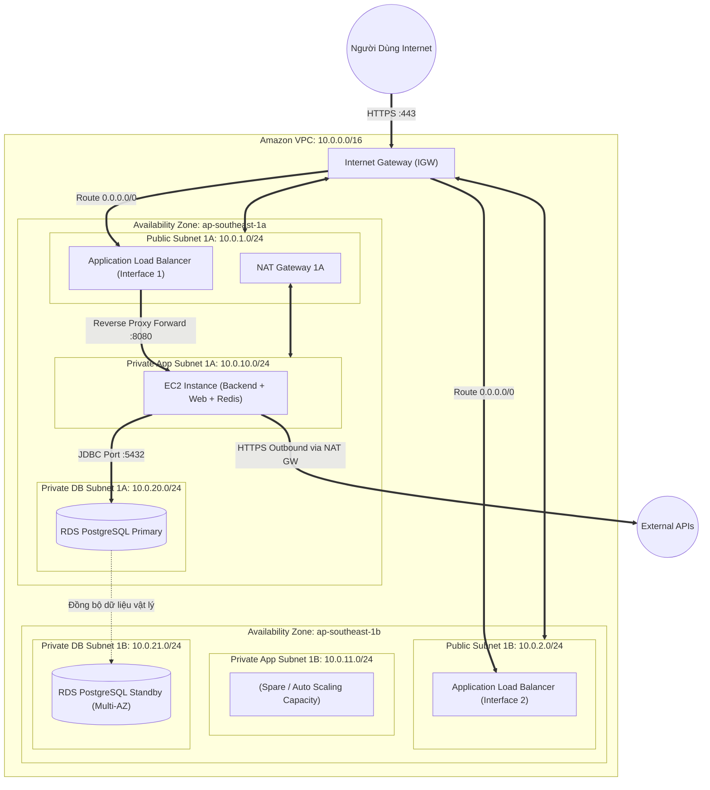
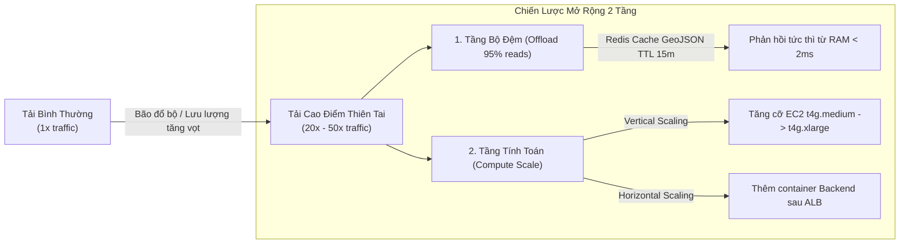
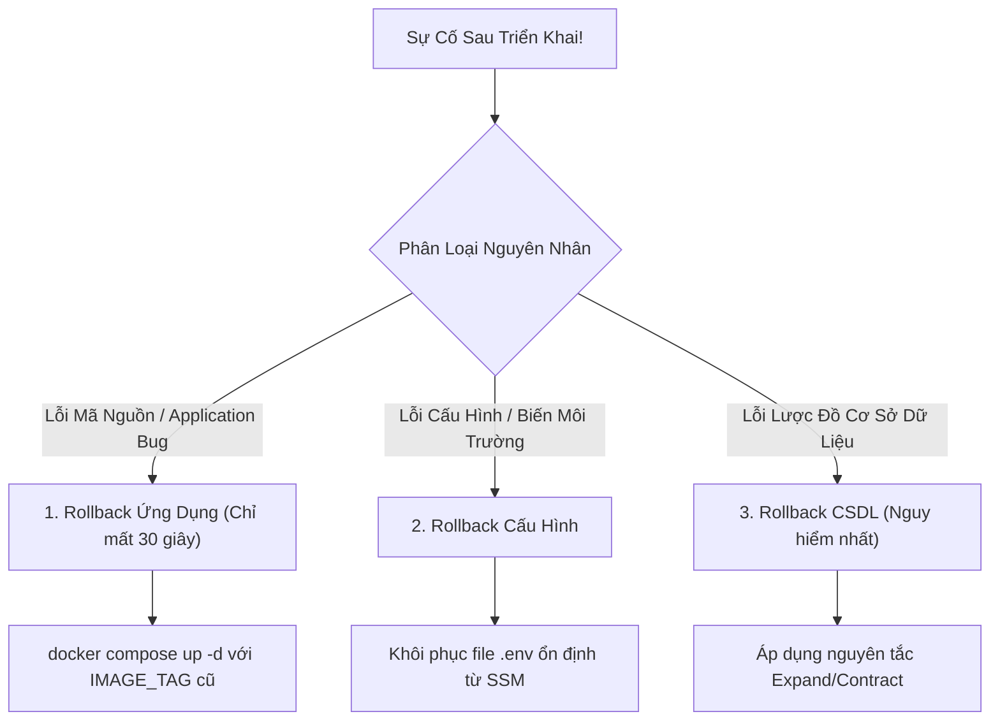
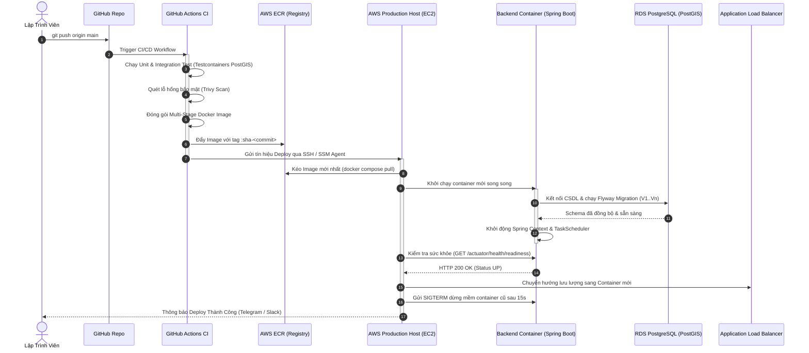

# 7. DEPLOYMENT & INFRASTRUCTURE ARCHITECTURE

## Hệ Thống WebGIS Giám Sát Mưa Gió Bão Tích Hợp AI Agent Cảnh Báo

---

## Thông Tin Tài Liệu (Document Information)

* **Tên hệ thống:** Vietnam Weather & Storm Monitoring WebGIS with Grounded AI Warning Agent
* **Tài liệu:** 7. Deployment / Infrastructure Architecture
* **Phiên bản:** 1.0 (Production-Ready Baseline)
* **Ngày phê duyệt:** 2026-10-03
* **Vai trò tác giả:** Senior DevOps / Cloud Architect / Platform Engineer
* **Tài liệu nguồn cơ sở (Sources of Truth):**
  1. [0. Introduction.md](file:///Users/dllv/Documents/GitHub/WebGIS-for-weather-of-Vietnam/docs/The%20plans%20of%20project/0.%20Introduction.md)
  2. [1. ERD.md](file:///Users/dllv/Documents/GitHub/WebGIS-for-weather-of-Vietnam/docs/The%20plans%20of%20project/1.%20ERD.md)
  3. [2. API docs.md](file:///Users/dllv/Documents/GitHub/WebGIS-for-weather-of-Vietnam/docs/The%20plans%20of%20project/2.%20API%20docs.md)
  4. [3. BRD.md](file:///Users/dllv/Documents/GitHub/WebGIS-for-weather-of-Vietnam/docs/The%20plans%20of%20project/3.%20BRD.md)
  5. [4. SRS.md](file:///Users/dllv/Documents/GitHub/WebGIS-for-weather-of-Vietnam/docs/The%20plans%20of%20project/4.%20SRS.md)
  6. [5. System Architecture.md](file:///Users/dllv/Documents/GitHub/WebGIS-for-weather-of-Vietnam/docs/The%20plans%20of%20project/5.%20System%20Architecture.md)
  7. [6. Technical Stack.md](file:///Users/dllv/Documents/GitHub/WebGIS-for-weather-of-Vietnam/docs/The%20plans%20of%20project/6.%20Technical%20Stack.md)

---

## 1. Infrastructure Overview

Tài liệu này xác lập thiết kế hạ tầng kỹ thuật và quy trình triển khai toàn diện cho hệ thống **WebGIS Giám Sát Mưa Gió Bão Tích Hợp AI Agent Cảnh Báo**. Mục tiêu cốt lõi là hiện thực hóa kiến trúc phần mềm **Modular Monolith** đã được định hình, bảo đảm hệ thống vận hành bền bỉ từ môi trường cục bộ (**Local Development**), qua môi trường tiền sản xuất (**Staging**), đến môi trường thực tế (**Production**) trên nền tảng điện toán đám mây **Amazon Web Services (AWS)** với chi phí tối ưu, bảo mật cao và vận hành tinh gọn.

### 1.1. Sơ Đồ Tổng Quan Hạ Tầng (Infrastructure Architecture Diagram)

Hạ tầng hệ thống được mô tả chính xác theo ngăn xếp công nghệ thực tế (không tự ý thêm các thành phần thừa như Microservices, Kubernetes cluster hay Object Storage cho dữ liệu người dùng):

```mermaid
flowchart TD
    subgraph CI_CD_Pipeline [" Vòng Đời CI/CD & Đóng Gói "]
        Dev["Developer (Git Commit & Push)"] -->|GitHub Flow| GH["GitHub Repository (Monorepo)"]
        GH -->|Trigger Push/PR| Actions["GitHub Actions CI Runner"]
        Actions -->|Maven Test / Testcontainers / Sonar| TestStage["Automated Verification"]
        TestStage -->|Multi-stage Docker Build| DockerStage["OCI Container Images"]
        DockerStage -->|Push Image Tag :sha-:env| Registry["Container Registry (AWS ECR / GHCR)"]
    end

    subgraph AWS_Production_Cloud [" Nền Tảng Hạ Tầng AWS Production "]
        Registry -->|CD Pull Image Deployment| AppHost["Compute Host (AWS EC2 / ECS Task)"]

        subgraph Ingress_Layer [" Tầng Tiếp Nhận & Phân Phối "]
            User["Người Dùng Công Cộng / Quản Trị Viên"] -->|Truy vấn HTTPS :443| DNS["DNS Router (Amazon Route 53)"]
            DNS -->|A Record Alias / CNAME| LB["Load Balancer (AWS ALB / Nginx Reverse Proxy)"]
            ACM["AWS Certificate Manager (TLS 1.3/1.2)"] -.->|Gắn SSL Certificate| LB
        end

        subgraph Application_Tier [" Tầng Ứng Dụng (Modular Monolith) "]
            LB -->|HTTP Reverse Proxy :8080| AppHost
            subgraph Container_Stack [" Runtime Containers "]
                NginxWeb["Nginx Web Container (Static SPA React + Gzip)"]
                AppBackend["Spring Boot Backend Container (Java 21 LTS - Virtual Threads)"]
                TaskScheduler["In-Process TaskScheduler (@Scheduled Ingestion/Monitoring)"]
            end
        end

        subgraph Data_Cache_Tier [" Tầng Dữ Liệu & Bộ Đệm "]
            AppBackend -->|JDBC Connection Pool :5432| DB[("Spatial Database: AWS RDS PostgreSQL 16 + PostGIS 3.4")]
            AppBackend -->|Lettuce Jedis :6379| Cache[("Distributed In-Memory: Redis 7.2 Container / ElastiCache")]
        end

        subgraph Storage_Tier [" Tầng Lưu Trữ Sao Lưu Độc Lập "]
            DB -.->|Scheduled pg_dump / WAL Archive (Encrypted)| BackupS3[("AWS S3 Bucket (Cold Offsite Backups Only)")]
        end

        subgraph External_Cloud_APIs [" Nhà Cung Cấp Dữ Liệu & AI Bên Ngoài "]
            AppBackend -->|Outbound HTTPS REST| OWM["OpenWeatherMap API (Weather Records)"]
            AppBackend -->|Outbound HTTPS REST| GDACS["GDACS API (Tropical Cyclones)"]
            AppBackend -->|Outbound HTTPS REST| Gemini["Google Gemini API (Grounded LLM)"]
            User -.->|Browser Direct HTTP GET (Tiles)| OSMTiles["Public OSM / CartoDB CDN Tiles"]
        end
    end

    subgraph Observability_Tier [" Tầng Giám Sát & Cảnh Báo "]
        AppHost -.->|Metrics & Syslogs| CloudWatch["Amazon CloudWatch Logs & Metrics"]
        AppBackend -.->|Scrape /actuator/prometheus| Prometheus["Prometheus / Spring Actuator"]
        CloudWatch -.->|Trigger Alarm| AlarmSNS["Amazon SNS Alert (DevOps Telegram / Email)"]
    end
```

### 1.2. Vai Trò Của Từng Thành Phần Hạ Tầng

1. **Amazon Route 53 (DNS):** Phân giải tên miền công cộng, quản trị bản ghi định tuyến linh hoạt (Latency/Failover routing), kiểm tra trạng thái sức khỏe (Health Checking) tại rìa mạng internet.
2. **AWS Application Load Balancer (ALB) / Nginx Ingress:** Đóng vai trò Reverse Proxy duy nhất tiếp nhận lưu lượng cổng 80/443, giải mã SSL/TLS termination, điều hướng lưu lượng tĩnh tới Frontend và lưu lượng động `/api/v1/*` tới Backend.
3. **AWS EC2 (Graviton2/3 `t4g`) / ECS Fargate:** Đóng vai trò máy chủ tính toán (Compute), thực thi các container chuẩn OCI (Open Container Initiative) trong môi trường mạng nội bộ được cô lập.
4. **Spring Boot Backend (Java 21):** Quy trình ứng dụng Modular Monolith duy nhất, xử lý API REST, tính toán không gian qua Hibernate Spatial, và chạy ngầm các worker nạp dữ liệu khí tượng theo chu kỳ định sẵn.
5. **AWS RDS for PostgreSQL 16 (PostGIS 3.4):** Hệ quản trị cơ sở dữ liệu quan hệ và địa không gian trung tâm, quản lý toàn bộ 10 bảng nghiệp vụ, bảo toàn tính toàn vẹn ACID, chạy trong Private Subnet không có Public IP.
6. **Redis 7.2 (Alpine):** Bộ nhớ đệm tốc độ cao trong RAM, phục vụ lưu cache các FeatureCollection GeoJSON thời tiết/bão (TTL 15 phút), quản lý Token Bucket Rate Limiting (Bucket4j) cho khung chat AI và theo dõi session.
7. **AWS S3 (Backup Storage Only):** Bucket lưu trữ đối tượng được mã hóa AES-256 dùng **duy nhất** cho mục đích lưu các bản sao lưu cơ sở dữ liệu (`pg_dump`) và file log nén định kỳ; tuyệt đối không phục vụ ảnh hay file tĩnh người dùng (do nghiệp vụ WebGIS không có use case upload).
8. **GitHub Actions & AWS ECR:** Hạ tầng tự động hóa CI/CD, kiểm thử tự động với Testcontainers, đóng gói Docker đa tầng (Multi-stage build) và lưu trữ image được quét lỗ hổng bảo mật tự động.
9. **Amazon CloudWatch & Spring Boot Actuator:** Hạ tầng quan sát toàn diện, thu thập log có cấu trúc (JSON), giám sát độ trễ, lưu lượng mạng, tình trạng CPU/RAM và kích hoạt cảnh báo sự cố tức thời.

---

## 2. Deployment Architecture

### 2.1. Luồng Giao Tiếp Hạ Tầng Tổng Thể

```text
Internet (Người dùng & Khách vãng lai)
   ↓ [HTTPS :443 / TLS 1.3]
DNS (Amazon Route 53 / Cloudflare)
   ↓ [Anycast IP Resolution]
Load Balancer (AWS ALB / Nginx Gateway)
   ↓ [HTTP :8080 via VPC Private Network]
Compute Runtime (Spring Boot 3.3 / Java 21 LTS Container)
   ├── [JDBC HikariCP :5432] ──► Spatial Database (RDS PostgreSQL 16 + PostGIS)
   ├── [Lettuce TCP :6379]    ──► Cache & Rate Limiter (Redis 7.2)
   ├── [HTTPS Outbound :443]  ──► External APIs (OpenWeatherMap, GDACS, Gemini API)
   └── [AWS CLI / SDK :443]   ──► S3 Bucket (Automated Database Backup Archive)
```

### 2.2. Bảng Định Nghĩa Chi Tiết Các Thành Phần Hạ Tầng

| Component | Technology / Service | Purpose | Environment | Dependency |
| :--- | :--- | :--- | :--- | :--- |
| **DNS** | Amazon Route 53 | Quản lý bản ghi DNS, điều hướng tên miền chính và tên miền phụ sang Load Balancer. | Staging, Production | Domain Registrar |
| **TLS / SSL** | AWS Certificate Manager (ACM) / Let's Encrypt | Cấp phát và tự động gia hạn chứng chỉ bảo mật HTTPS (TLS 1.2 / TLS 1.3). | Dev, Staging, Production | Route 53 (DNS Validation) |
| **Load Balancer** | AWS Application Load Balancer (ALB) | Tiếp nhận HTTPS, cân bằng tải, SSL Termination, lọc HTTP request độc hại. | Staging, Production | VPC Public Subnets, ACM |
| **Reverse Proxy** | Nginx 1.26 LTS (Alpine) | Phục vụ mã nguồn tĩnh React SPA, nén Gzip/Brotli, chuyển tiếp `/api/*` sang Backend. | Local, Dev, Staging, Production | Docker Engine |
| **Backend Compute** | AWS EC2 `t4g.small` / ECS Task (Docker) | Thực thi Backend Spring Boot Modular Monolith và worker định kỳ. | Local, Dev, Staging, Production | Docker Runtime, JRE 21 |
| **Spatial Database** | AWS RDS PostgreSQL 16 + PostGIS 3.4 | Lưu trữ toàn bộ dữ liệu quan hệ và hình học trắc địa (EPSG:4326 WGS84). | Staging, Production | VPC Private Subnets, EBS gp3 |
| **Local Database** | Docker `postgis/postgis:16-3.4-alpine` | Cơ sở dữ liệu cho môi trường lập trình và kiểm thử tự động tích hợp. | Local, Test (CI) | Docker Volume |
| **Cache & Rate Limit** | Redis 7.2 (Alpine Container / ElastiCache) | Đệm dữ liệu GeoJSON bản đồ, quản lý Token Bucket Rate Limiter cho Chatbox. | Local, Dev, Staging, Production | Backend Connectivity |
| **Backup Storage** | Amazon S3 (Standard + Glacier Flexible) | Lưu trữ bản sao lưu nén định kỳ của database và logs; khóa mã hóa KMS. | Production | IAM Role, S3 Bucket Policy |
| **Container Registry**| Amazon ECR / GitHub Packages | Lưu trữ và quét lỗ hổng các bản build Docker Image theo thẻ `sha-*`. | Dev, Staging, Production | IAM Auth, CI Runner |
| **CI/CD Platform** | GitHub Actions (Cloud-hosted Runners) | Tự động hóa kiểm thử mã nguồn, đóng gói Docker và kích hoạt deploy. | Tất cả môi trường | GitHub Repo, Secrets |
| **Monitoring** | Spring Boot Actuator + CloudWatch Metrics | Thu thập thông số hiệu năng JVM, connection pool, CPU, RAM, disk. | Staging, Production | IAM Role CloudWatchAgent |
| **Structured Logging**| Logback JSON + CloudWatch Logs | Ghi nhật ký tập trung mọi luồng nạp dữ liệu, kiểm toán admin và lỗi hệ thống. | Dev, Staging, Production | CloudWatch Agent / Docker Log |

---

## 3. Environment Strategy

Để bảo đảm tính ổn định, hệ thống phân tách thành 4 môi trường vận hành độc lập, tuân thủ nguyên tắc cách ly dữ liệu và cấu hình nghiêm ngặt:

```text
Local (Máy lập trình viên)
  ↓ [Git Push / Pull Request]
Development (Môi trường kiểm thử tự động CI)
  ↓ [Merge vào nhánh staging]
Staging (Môi trường tiền sản xuất trên AWS - Bản sao 1:1 của Prod)
  ↓ [Release Tag + Manual Approval]
Production (Môi trường phục vụ cộng đồng trên AWS)
```

### 3.1. Bảng Ma Trận Môi Trường (Environment Matrix)

| Environment | Purpose | Infrastructure | Database | Domain | Deployment Mechanism |
| :--- | :--- | :--- | :--- | :--- | :--- |
| **Local** | Lập trình viên viết mã nguồn, debug, chạy thử nghiệm nhanh. | Local Workstation (macOS/Linux/Windows WSL2) + Docker Compose v2. | Docker Container PostGIS 16 + Redis 7 chạy trên `localhost`. | `localhost:3000` (Frontend), `localhost:8080` (Backend). | `docker compose up -d` thủ công từ terminal máy lập trình. |
| **Dev (CI)** | Kiểm thử tự động (Unit Test, Integration Test với Testcontainers, Lint). | GitHub Actions Ephemeral Runner (Ubuntu 22.04 VM tạm thời). | Testcontainers PostgreSQL 16 PostGIS (khởi tạo và hủy ngay trong pipeline). | Không có domain (chạy headless trong CI runner). | Tự động kích hoạt khi có Push hoặc Pull Request vào nhánh `main`/`develop`. |
| **Staging** | Kiểm thử chấp nhận (UAT), nghiệm thu hiệu năng, xác thực tích hợp Gemini API thật. | AWS EC2 `t4g.small` (01 máy chủ đơn lẻ tối ưu chi phí, chạy Docker Compose). | AWS RDS PostgreSQL 16 Single-AZ (`db.t4g.micro`) + Redis container. | `staging.weathergis.vn` (hoặc DNS trỏ tạm IP máy chủ). | Tự động deploy qua GitHub Actions CD khi merge vào nhánh `staging`. |
| **Production** | Môi trường phục vụ người dân và quản trị viên thực tế 24/7. | AWS EC2 `t4g.medium` (hoặc ECS Task) + ALB + VPC Private Network. | AWS RDS PostgreSQL 16 Multi-AZ (`db.t4g.small`) + Dedicated Redis. | `weathergis.vn` & `api.weathergis.vn` (Route 53 + ACM). | Triển khai bán tự động (Trigger bởi Git Tag release + Quản trị viên duyệt). |

### 3.2. Nguyên Tắc Quản Trị Môi Trường & Dữ Liệu

1. **Không dùng chung tài nguyên (No Shared Resources):** Cơ sở dữ liệu, bộ nhớ đệm Redis và các khóa API giữa Staging và Production tuyệt đối độc lập. Một sự cố nghẽn tải hoặc kiểm thử lỗi trên Staging không bao giờ được phép ảnh hưởng tới Production.
2. **Quản lý Secrets:** Không lưu mật khẩu hoặc API Key trong git. Môi trường Local dùng file `.env.local` (nằm trong `.gitignore`). Staging và Production sử dụng **AWS Systems Manager Parameter Store (Standard - SecureString)** hoặc GitHub Secrets.
3. **Sao chép dữ liệu giữa các môi trường (Data Copy Policy):**
   * Dữ liệu danh mục trạm quan trắc (`locations`) và bộ ngưỡng ban đầu (`alert_thresholds`) được đồng bộ thông qua script Flyway Migration (`V1` đến `V5`).
   * **Tuyệt đối không copy dữ liệu chứa thông tin người dùng hay phiên chat từ Production ngược về Staging/Local** nhằm bảo vệ quyền riêng tư và tránh rò rỉ dữ liệu ngoài ý muốn.
   * Dữ liệu thời tiết lịch sử trên Staging có thể được nạp bằng script seed giả lập hoặc nạp trực tiếp từ OpenWeatherMap Sandbox.

---

## 4. AWS Infrastructure

Toàn bộ hạ tầng điện toán đám mây Production được thiết kế bám sát nguyên tắc tinh gọn, sử dụng các dịch vụ được quản lý (AWS Managed Services) có chi phí hợp lý:

```
┌────────────────────────────────────────────────────────────────────────┐
│                   AWS CLOUD PRODUCTION ARCHITECTURE                    │
├────────────────────────────────────────────────────────────────────────┤
│ Edge & DNS:       Route 53 + AWS Certificate Manager (ACM)             │
│ Load Balancer:   AWS Application Load Balancer (ALB)                  │
│ Networking:      AWS VPC (Public & Private Subnets, IGW, NAT GW)       │
│ Compute Tier:    AWS EC2 (Graviton3 t4g.medium) / ECS Fargate          │
│ Spatial DB Tier: AWS RDS for PostgreSQL 16 (PostGIS 3.4 Extension)     │
│ In-Memory Tier:  Redis 7.2 Container (on-host) / ElastiCache Redis     │
│ Backup Storage:  Amazon S3 (Glacier Lifecycle for DB Dumps)            │
│ Registry:        Amazon ECR (KMS Encrypted, Image Scanning on push)   │
│ Config & Secret: AWS SSM Parameter Store (SecureString)                │
│ Observability:   Amazon CloudWatch (Logs, Metrics, Alarms)             │
└────────────────────────────────────────────────────────────────────────┘
```

### 4.1. Chi Tiết Các Dịch Vụ AWS Được Chọn

#### 1. Compute
* **AWS Service:** **Amazon EC2 (Instance Type: `t4g.medium` — 2 vCPU, 4GB RAM, kiến trúc ARM Graviton3)**.
* **Mục đích:** Chạy Docker runtime chứa Nginx Static Web và Spring Boot Modular Monolith Backend.
* **Lý do lựa chọn:** Vi xử lý Graviton mang lại hiệu năng cao hơn 20% và tiết kiệm chi phí ~20% so với x86. Cấu hình 4GB RAM bảo đảm JVM Java 21 vận hành ổn định (`-Xmx2560m`), dành phần còn lại cho hệ điều hành và Redis container.

#### 2. Networking
* **AWS Service:** **Amazon VPC, Internet Gateway (IGW), NAT Gateway, Security Groups, Route Tables**.
* **Mục đích:** Thiết lập ranh giới mạng an toàn, phân tách ranh giới Public (tiếp nhận internet) và Private (chứa dữ liệu nhạy cảm).
* **Lý do lựa chọn:** VPC là tiêu chuẩn bắt buộc của AWS, giúp chặn đứng 100% các cuộc tấn công quét cổng từ Internet vào cơ sở dữ liệu.

#### 3. Database
* **AWS Service:** **Amazon RDS for PostgreSQL 16 (Engine Version: 16.3+, PostGIS 3.4)**.
* **Mục đích:** Lưu trữ toàn bộ dữ liệu nghiệp vụ khí tượng, bão và cảnh báo.
* **Lý do lựa chọn:** RDS cung cấp tính năng sao lưu tự động hàng ngày (Automated Backups), bảo trì bản vá tự động, hỗ trợ tùy chọn Multi-AZ chuyển đổi dự phòng khi một trung tâm dữ liệu gặp sự cố.

#### 4. Storage (Chỉ Phục Vụ Sao Lưu)
* **AWS Service:** **Amazon Simple Storage Service (S3)**.
* **Mục đích:** Lưu trữ bản nén cơ sở dữ liệu (`pg_dump` backup) xuất tự động mỗi đêm. Cấu hình Lifecycle Policy chuyển sang Glacier Flexible Archive sau 30 ngày và xóa sau 90 ngày.

#### 5. Load Balancing
* **AWS Service:** **AWS Application Load Balancer (ALB)**.
* **Mục đích:** Tiếp nhận lưu lượng HTTPS cổng 443 từ người dùng, gắn chứng chỉ SSL từ ACM, thực hiện kiểm tra sức khỏe (Health Check) tới cổng backend `:8080` hoặc `:80`.

#### 6. Container Registry
* **AWS Service:** **Amazon Elastic Container Registry (ECR)**.
* **Mục đích:** Lưu trữ Docker image của Backend và Frontend sau khi CI build thành công; tự động quét lỗ hổng bảo mật ảnh (Basic Scanning).

#### 7. Monitoring & Logging
* **AWS Service:** **Amazon CloudWatch (Logs & Metrics)**.
* **Mục đích:** Tập trung hóa log của container Spring Boot, giám sát các chỉ số tải CPU, bộ nhớ, số lượng kết nối RDS, và gửi cảnh báo qua email/SNS khi có sự cố.

#### 8. Security & Configuration
* **AWS Service:** **AWS Identity and Access Management (IAM), AWS Systems Manager Parameter Store, AWS KMS**.
* **Mục đích:** Phân quyền theo nguyên tắc đặc quyền tối thiểu (Least Privilege), mã hóa mật khẩu và khóa API an toàn.

---

## 5. AWS Network Architecture

### 5.1. Cấu Trúc Phân Vùng Mạng VPC

Kiến trúc mạng được triển khai trên dải mạng chuẩn **10.0.0.0/16**, trải rộng trên 02 Vùng Sẵn Sàng (Availability Zones - AZ) nhằm bảo đảm khả năng mở rộng dự phòng:

```text
VPC: 10.0.0.0/16 (Region: ap-southeast-1 - Singapore)
│
├── Availability Zone 1 (ap-southeast-1a)
│   ├── Public Subnet 1A: 10.0.1.0/24 (ALB, NAT Gateway, Bastion if needed)
│   ├── Private App Subnet 1A: 10.0.10.0/24 (EC2 Compute / Backend)
│   └── Private DB Subnet 1A: 10.0.20.0/24 (RDS PostgreSQL Primary)
│
└── Availability Zone 2 (ap-southeast-1b)
    ├── Public Subnet 1B: 10.0.2.0/24 (ALB Secondary)
    ├── Private App Subnet 1B: 10.0.11.0/24 (EC2 Compute Standby / Spare)
    └── Private DB Subnet 1B: 10.0.21.0/24 (RDS PostgreSQL Standby)
```



### 5.2. Định Tuyến Bảng Route Tables

1. **Public Route Table (Gắn với Public Subnets 1A & 1B):**
   * `10.0.0.0/16` $\rightarrow$ `local` (Định tuyến nội bộ VPC).
   * `0.0.0.0/0` $\rightarrow$ `igw-xxxxxxxx` (Trỏ ra Internet Gateway tiếp nhận client).
2. **Private App Route Table (Gắn với Private App Subnets):**
   * `10.0.0.0/16` $\rightarrow$ `local`.
   * `0.0.0.0/0` $\rightarrow$ `nat-xxxxxxxx` (Trỏ qua NAT Gateway để Backend gọi OpenWeatherMap, GDACS và Gemini API ra ngoài internet).
3. **Private DB Route Table (Gắn với Private DB Subnets):**
   * `10.0.0.0/16` $\rightarrow$ `local`.
   * **Tuyệt đối không có route 0.0.0.0/0**. CSDL hoàn toàn bị cô lập khỏi internet.

### 5.3. Bảng Phân Quyền Security Groups (Tường Lửa Ảo)

| Security Group ID | Tên Nhóm | Cổng Cho Phép (Inbound) | Nguồn Cho Phép (Source) | Mục Đích |
| :--- | :--- | :--- | :--- | :--- |
| **sg-alb** | ALB-Security-Group | `80/tcp`, `443/tcp` | `0.0.0.0/0` (Toàn bộ Internet) | Tiếp nhận truy cập HTTP/HTTPS công cộng từ người dùng. |
| **sg-app** | App-Security-Group | `8080/tcp` (Backend API)<br/>`80/tcp` (Web UI) | Chỉ từ **sg-alb** (Security Group của ALB) | Chỉ cho phép ALB chuyển tiếp lưu lượng vào máy chủ ứng dụng. |
| **sg-db** | RDS-Security-Group | `5432/tcp` (PostgreSQL) | Chỉ từ **sg-app** (Security Group của Compute) | Chặn đứng mọi truy cập trực tiếp từ ngoài; chỉ duy nhất Backend được kết nối CSDL. |

### 5.4. Ma Trận Kết Nối Được Phép và Bị Cấm (Connection Rule Matrix)

* ✅ **ĐƯỢC PHÉP:**
  - Internet $\rightarrow$ ALB (`:443`, `:80`).
  - ALB $\rightarrow$ EC2 App Instance (`:8080`, `:80`).
  - EC2 App Instance $\rightarrow$ RDS PostgreSQL (`:5432`).
  - EC2 App Instance $\rightarrow$ NAT Gateway $\rightarrow$ Internet Outbound (`:443` gọi OWM, GDACS, Gemini API).
  - EC2 App Instance $\rightarrow$ Local Redis (`:6379`).
* ❌ **TUYỆT ĐỐI BỊ CẤM:**
  - Internet $\rightarrow$ RDS PostgreSQL (`:5432` bị từ chối 100%).
  - Internet $\rightarrow$ EC2 App Instance trực tiếp (Không có Public IP hoặc Security Group từ chối IP ngoài).
  - Internet $\rightarrow$ Redis (`:6379` bị cô lập hoàn toàn).
  - RDS Database $\rightarrow$ Outbound Internet (Database không có bất kỳ quyền gọi ra ngoài).

---

## 6. Compute Decision

### 6.1. Bảng Phân Tích So Sánh Các Lựa Chọn Compute

| Tiêu Chí So Sánh | AWS EC2 (Docker Host) | AWS ECS (Fargate) | AWS EKS (Kubernetes) | AWS Lambda (Serverless) |
| :--- | :--- | :--- | :--- | :--- |
| **Loại Workload** | Rất phù hợp với Modular Monolith chạy 24/7. | Rất phù hợp với Containerized Monolith. | Phù hợp với hệ thống Microservices khổng lồ. | Phù hợp với Event-driven, tác vụ xử lý nhanh. |
| **Tác vụ định kỳ (@Scheduled)** | Chạy mượt mà trong process Spring TaskScheduler. | Cần tạo Scheduled Task riêng hoặc chạy Service liên tục. | Quản lý qua K8s CronJob phức tạp. | Bị giới hạn thời gian chạy 15 phút, tốn kém khi polling liên tục. |
| **Độ trễ (Latency)** | Cực thấp; không có hiện tượng Cold Start. | Cực thấp; duy trì container nóng 24/7. | Cực thấp; qua mạng Ingress. | ⚠️ **Có Cold Start** (Java Spring Boot có thể mất 5-15s khởi động). |
| **Chi phí hàng tháng (Cost)** | **Thấp nhất:** ~$15 - $25/tháng (Graviton t4g). | **Trung bình:** ~$35 - $60/tháng (Fargate vCPU/RAM). | ⚠️ **Rất cao:** Tối thiểu ~$75/tháng chỉ tiền Control Plane + Nodes. | Rất cao nếu chạy polling liên tục mỗi 15 phút và DB connection. |
| **Độ phức tạp vận hành** | **Rất thấp:** Chỉ cần biết Docker & Docker Compose. | **Thấp:** AWS quản lý hạ tầng máy chủ cơ sở. | ⚠️ **Cực kỳ cao:** Cần kỹ năng Kube-admin, CKA/CKS, Helm, CNI. | Trung bình; nhưng cấu hình VPC và RDS Proxy rất phức tạp. |
| **Kinh nghiệm đội ngũ** | Đội ngũ Full-stack dễ dàng làm chủ 100%. | Cần tìm hiểu Task Definition, Service, IAM Role. | Đòi hỏi kỹ sư chuyên trách DevOps/SRE riêng biệt. | Phải tái cấu trúc code theo mô hình Serverless functions. |

### 6.2. Kết Luận Quyết Định (Compute Conclusion)

```text
Decision: 
Sử dụng AWS EC2 (Instance Type: t4g.medium, ARM Graviton3) chạy Docker Compose cho giai đoạn MVP và vận hành hiện tại. Khi lưu lượng vượt ngưỡng 10.000 người dùng đồng thời, nâng cấp lên AWS ECS Fargate mà không cần thay đổi Dockerfile.

Reason:
1. Bản chất hệ thống là Modular Monolith gồm 1 backend process Java 21, 1 Nginx web proxy và 1 Redis cache; không phải là hàng chục microservices.
2. Spring TaskScheduler cần chạy thường trực 24/7 để quét dữ liệu thời tiết (chu kỳ 15 phút) và bão (chu kỳ 30 phút). Chạy EC2 t4g tiết kiệm chi phí hơn 60% so với Fargate và rẻ hơn 80% so với EKS.
3. Loại bỏ hoàn toàn rủi ro Cold Start của AWS Lambda đối với ứng dụng Java Spring Boot.
4. Đội ngũ kỹ sư làm chủ hoàn toàn môi trường, cấu hình và khắc phục sự cố cực nhanh qua Docker Compose.

Trade-offs:
Đánh đổi tính năng tự động co giãn từng pod độc lập của Kubernetes để đổi lấy sự tinh gọn tuyệt đối, tiết kiệm tối đa ngân sách vận hành và độ ổn định cao trong suốt giai đoạn MVP.
```

---

## 7. Containerization

Hệ thống tuân thủ chiến lược đóng gói chuẩn OCI Container với nguyên tắc Multi-Stage Build:
* **Tách rời môi trường Build và Runtime** để giảm kích thước ảnh tối đa và loại bỏ các công cụ build khỏi production.
* **Chạy với người dùng không có quyền root (Non-root user)** để ngăn ngừa tấn công chiếm quyền hệ thống (Container Breakout).
* **Kiểm tra sức khỏe tự động (Health Check)** tích hợp sẵn trong container.

### 7.1. Backend Dockerfile (`deployment/docker/backend/Dockerfile`)

```dockerfile
# ==========================================
# STAGE 1: Build Application Artifact
# ==========================================
FROM maven:3.9.6-eclipse-temurin-21-alpine AS builder

WORKDIR /build

# Tận dụng Docker layer cache cho Maven dependencies
COPY pom.xml .
RUN mvn dependency:go-offline -B

# Copy toàn bộ mã nguồn và biên dịch gói JAR
COPY src ./src
RUN mvn clean package -DskipTests -B

# Trích xuất Spring Boot Layered JAR để tối ưu hóa caching khi update code
WORKDIR /build/target
RUN java -Djarmode=layertools -jar *.jar extract

# ==========================================
# STAGE 2: Lightweight Production Runtime
# ==========================================
FROM bellsoft/liberica-openjre-alpine:21.0.3

# Tạo non-root user và group để bảo vệ an ninh
RUN addgroup -S appgroup && adduser -S appuser -G appgroup

WORKDIR /app

# Cài đặt curl phục vụ container healthcheck
RUN apk add --no-cache curl tzdata
ENV TZ=Asia/Ho_Chi_Minh

# Copy các layer từ builder stage
COPY --from=builder /build/target/dependencies/ ./
COPY --from=builder /build/target/spring-boot-loader/ ./
COPY --from=builder /build/target/snapshot-dependencies/ ./
COPY --from=builder /build/target/application/ ./

# Chuyển quyền sở hữu cho appuser
RUN chown -R appuser:appgroup /app

USER appuser

# Cổng dịch vụ Spring Boot
EXPOSE 8080

# Cấu hình JVM Flags tối ưu hóa cho Container và Virtual Threads
ENV JAVA_TOOL_OPTIONS="-XX:+UseG1GC \
                       -XX:MaxRAMPercentage=75.0 \
                       -XX:+ExitOnOutOfMemoryError \
                       -Dfile.encoding=UTF-8 \
                       -Duser.timezone=Asia/Ho_Chi_Minh"

# Kiểm tra trạng thái sức khỏe định kỳ
HEALTHCHECK --interval=15s --timeout=5s --start-period=30s --retries=3 \
  CMD curl -f http://localhost:8080/actuator/health/liveness || exit 1

ENTRYPOINT ["java", "org.springframework.boot.loader.launch.JarLauncher"]
```

### 7.2. Frontend Dockerfile (`deployment/docker/frontend/Dockerfile`)

```dockerfile
# ==========================================
# STAGE 1: Build Frontend SPA
# ==========================================
FROM node:20-alpine AS builder

WORKDIR /app

# Cache package dependencies
COPY package.json package-lock.json ./
RUN npm ci --silent

# Copy mã nguồn và đóng gói bản tĩnh Vite
COPY . .
RUN npm run build

# ==========================================
# STAGE 2: Nginx Static Server & Reverse Proxy
# ==========================================
FROM nginx:1.26-alpine

# Xóa cấu hình mặc định của Nginx
RUN rm -rf /etc/nginx/conf.d/default.conf

# Copy cấu hình reverse proxy tối ưu
COPY deployment/nginx/nginx.conf /etc/nginx/nginx.conf
COPY deployment/nginx/conf.d/weathergis.conf /etc/nginx/conf.d/default.conf

# Copy gói tĩnh React đã build vào web root
COPY --from=builder /app/dist /usr/share/nginx/html

# Cài đặt curl phục vụ healthcheck
RUN apk add --no-cache curl

EXPOSE 80 443

HEALTHCHECK --interval=15s --timeout=3s --retries=3 \
  CMD curl -f http://localhost/healthz || exit 1

CMD ["nginx", "-g", "daemon off;"]
```

### 7.3. Cấu Trúc Thư Mục Docker Trong Dự Án

```text
deployment/
├── docker/
│   ├── backend/
│   │   └── Dockerfile
│   └── frontend/
│       └── Dockerfile
├── nginx/
│   ├── nginx.conf
│   └── conf.d/
│       └── weathergis.conf
├── docker-compose.yml           # Dùng chung cho Local Dev & Staging
├── docker-compose.override.yml  # Ghi đè riêng cho Local Dev
└── env/
    ├── .env.example
    ├── .env.local
    └── .env.prod
```

---

## 8. Docker Compose — Local Development

File `docker-compose.yml` hoàn chỉnh cho phép lập trình viên chỉ cần chạy một lệnh duy nhất:
```bash
docker compose up -d
```
để kích hoạt toàn bộ môi trường: CSDL PostGIS, Redis Cache, Backend Spring Boot và Frontend Nginx Web Server.

```yaml
version: '3.8'

services:
  # =======================================================
  # 1. SPATIAL DATABASE: PostgreSQL 16 + PostGIS 3.4
  # =======================================================
  db:
    image: postgis/postgis:16-3.4-alpine
    container_name: weathergis-postgres
    restart: unless-stopped
    environment:
      POSTGRES_DB: ${DB_NAME:-weather_gis_db}
      POSTGRES_USER: ${DB_USERNAME:-gis_user}
      POSTGRES_PASSWORD: ${DB_PASSWORD:-gis_password_secret}
      PGDATA: /var/lib/postgresql/data/pgdata
    ports:
      - "5432:5432" # Mở cho lập trình viên kết nối DBeaver/DataGrip ở Local
    volumes:
      - postgis_data:/var/lib/postgresql/data
    networks:
      - weathergis-internal-net
    healthcheck:
      test: ["CMD-SHELL", "pg_isready -U ${DB_USERNAME:-gis_user} -d ${DB_NAME:-weather_gis_db}"]
      interval: 10s
      timeout: 5s
      retries: 5
      start_period: 15s

  # =======================================================
  # 2. DISTRIBUTED CACHE & RATE LIMIT: Redis 7.2
  # =======================================================
  redis:
    image: redis:7.2-alpine
    container_name: weathergis-redis
    restart: unless-stopped
    command: >
      redis-server 
      --maxmemory 128mb 
      --maxmemory-policy allkeys-lru 
      --appendonly yes
    ports:
      - "6379:6379"
    volumes:
      - redis_data:/data
    networks:
      - weathergis-internal-net
    healthcheck:
      test: ["CMD", "redis-cli", "ping"]
      interval: 10s
      timeout: 3s
      retries: 3

  # =======================================================
  # 3. BACKEND CORE: Spring Boot Modular Monolith
  # =======================================================
  backend:
    build:
      context: ../
      dockerfile: deployment/docker/backend/Dockerfile
    container_name: weathergis-backend
    restart: unless-stopped
    depends_on:
      db:
        condition: service_healthy
      redis:
        condition: service_healthy
    environment:
      SPRING_PROFILES_ACTIVE: ${SPRING_PROFILES_ACTIVE:-dev}
      SPRING_DATASOURCE_URL: jdbc:postgresql://db:5432/${DB_NAME:-weather_gis_db}
      SPRING_DATASOURCE_USERNAME: ${DB_USERNAME:-gis_user}
      SPRING_DATASOURCE_PASSWORD: ${DB_PASSWORD:-gis_password_secret}
      SPRING_DATA_REDIS_HOST: redis
      SPRING_DATA_REDIS_PORT: 6379
      OWM_API_KEY: ${OWM_API_KEY}
      GEMINI_API_KEY: ${GEMINI_API_KEY}
      INTERNAL_CRON_SECRET: ${INTERNAL_CRON_SECRET:-local_cron_secret_32chars}
      ADMIN_API_KEY: ${ADMIN_API_KEY:-admin_secret_local_token_key}
    ports:
      - "8080:8080"
    networks:
      - weathergis-internal-net
    healthcheck:
      test: ["CMD-SHELL", "curl -f http://localhost:8080/actuator/health || exit 1"]
      interval: 15s
      timeout: 5s
      retries: 3
      start_period: 30s

  # =======================================================
  # 4. FRONTEND & REVERSE PROXY: React 18 + Nginx
  # =======================================================
  web:
    build:
      context: ../frontend
      dockerfile: ../deployment/docker/frontend/Dockerfile
    container_name: weathergis-web
    restart: unless-stopped
    depends_on:
      backend:
        condition: service_healthy
    ports:
      - "80:80"
      - "443:443"
    networks:
      - weathergis-internal-net
    healthcheck:
      test: ["CMD-SHELL", "curl -f http://localhost/healthz || exit 1"]
      interval: 15s
      timeout: 3s
      retries: 3

volumes:
  postgis_data:
    name: weathergis_postgis_data
  redis_data:
    name: weathergis_redis_data

networks:
  weathergis-internal-net:
    name: weathergis-internal-net
    driver: bridge
```

---

## 9. CI/CD Architecture

Quy trình tích hợp liên tục (CI) và phân phối liên tục (CD) được tự động hóa 100% bằng **GitHub Actions**:

```text
[ Developer ]
     │ Git Push (feature/xxx)
     ▼
[ GitHub Repository ] ──► [ Pull Request to main/staging ]
     │
     ▼ (Trigger CI Workflow)
┌────────────────────────────────────────────────────────┐
│                   CI PIPELINE (Runner)                 │
├────────────────────────────────────────────────────────┤
│ 1. Checkout & Java 21 / Node 20 Setup                  │
│ 2. Backend Unit Test & Integration Test (PostGIS Test) │
│ 3. Static Code Analysis (SonarCloud / Checkstyle)      │
│ 4. Trivy Security Vulnerability Scan (CVEs)            │
│ 5. Multi-Stage Docker Image Build                      │
│ 6. Push Image Tagged (:sha-<commit>) to AWS ECR        │
└──────────────────────────┬─────────────────────────────┘
                           │ Image Published
                           ▼
┌────────────────────────────────────────────────────────┐
│                   CD PIPELINE (Deploy)                 │
├────────────────────────────────────────────────────────┤
│ 1. Staging Deploy: SSH / AWS SSM Run Command           │
│ 2. Health Check Validation (/actuator/health)          │
│ 3. Automated Smoke Tests (API curl verification)       │
│ 4. Manual Approval Gate (For Production Release)       │
│ 5. Production Zero-Downtime Rolling Update             │
│ 6. Post-Deployment Verification & Alert Notification   │
└────────────────────────────────────────────────────────┘
```

---

## 10. CI Pipeline

Chi tiết từng công đoạn trong pipeline kiểm thử tự động (`.github/workflows/ci.yml`):

| Công Đoạn (Stage) | Đầu Vào (Input) | Tiến Trình Thực Hiện (Process) | Đầu Ra (Output) | Điều Kiện Thất Bại (Failure Condition) |
| :--- | :--- | :--- | :--- | :--- |
| **1. Checkout & Cache** | Git Commit Ref | Checkout mã nguồn, nạp cache Maven dependencies (`~/.m2`) và npm node_modules. | Môi trường sẵn sàng build | Lỗi mạng hoặc hash cache không tương thích |
| **2. Backend Unit Test** | Mã nguồn Java Backend | Chạy `mvn test` thực thi các Unit Tests độc lập với Mockito. | Báo cáo Surefire XML | Bất kỳ unit test nào bị `FAIL` hoặc `ERROR` |
| **3. Spatial Integration Test** | Docker daemon trên Runner | Kích hoạt **Testcontainers** khởi chạy PostGIS 16 tạm thời; chạy Flyway migration và kiểm thử repository không gian. | Báo cáo kiểm thử tích hợp | Lỗi kết nối DB, sai cú pháp SQL, hoặc lệch hàm PostGIS |
| **4. Static Analysis** | Mã nguồn Java & React | Chạy SonarCloud / ESLint kiểm tra chất lượng code, độ phức tạp và Code Smells. | Quality Gate Status | Vi phạm ngưỡng Quality Gate (Độ bao phủ test < 70%, phát hiện Bug nguy hiểm) |
| **5. Security Scan** | Dependencies & Dockerfile | Chạy Trivy Scanner quét lỗ hổng thư viện và OCI Base Image (CVE kiểm tra). | Báo cáo bảo mật CVE | Phát hiện lỗ hổng mức độ `CRITICAL` hoặc `HIGH` chưa có bản vá |
| **6. Docker Build** | Mã nguồn đã pass test | Thực thi Docker multi-stage build cho cả Frontend và Backend. | Docker Images cục bộ | Lỗi biên dịch JAR hoặc lỗi đóng gói npm build |
| **7. ECR Push** | AWS IAM Credentials | Gắn thẻ Docker Tag (`sha-${GITHUB_SHA::7}`) và đẩy ảnh lên Amazon ECR. | Image URI trên ECR | Lỗi xác thực AWS IAM hoặc timeout mạng |

---

## 11. CD Pipeline

### 11.1. Luồng Phân Phối Lên Môi Trường Sản Xuất

```text
[ Container Image on ECR ]
            ↓
[ Deploy to Staging ] ──► (Update docker-compose.yml IMAGE_TAG)
            ↓
[ Staging Health Check ] ──► curl -f https://staging.weathergis.vn/actuator/health
            ↓
[ Automated Smoke Test ] ──► Gọi API /weather/current, /storms/active, /alerts/active
            ↓
[ Manual Approval Gate ] ──► Senior Engineer / Product Owner phê duyệt trên GitHub
            ↓
[ Deploy to Production ] ──► Rolling Update Container trên AWS Production Host
            ↓
[ Post-Deployment Check] ──► Giám sát Error Rate & Latency trong 5 phút đầu
```

### 11.2. Chiến Lược Triển Khai (Deployment Strategy)

* **Chiến lược được chọn: Rolling Deployment (Cập nhật cuốn chiếu từng bước)**.
* **Cơ chế:**
  - Nginx Reverse Proxy tiếp tục duy trì kết nối cho người dùng hiện tại.
  - Khởi chạy container phiên bản mới song song (`backend_v2`).
  - Kiểm tra trạng thái `/actuator/health/readiness` của container mới. Khi container mới báo `UP`, Nginx trỏ lưu lượng sang container mới và gửi tín hiệu dừng mềm (`SIGTERM`) cho container cũ sau thời gian grace period 15 giây.
  - **Không dùng Recreate:** Tránh gây downtime mất kết nối trong khoảng 10-20 giây khởi động Spring Boot.
  - **Không dùng Blue/Green phức tạp cho MVP:** Blue/Green yêu cầu nhân đôi toàn bộ hạ tầng phần cứng máy chủ (tăng gấp đôi chi phí), điều này chưa cần thiết ở giai đoạn ban đầu.

---

## 12. Infrastructure as Code (IaC)

### 12.1. Đánh Giá & Quyết Định IaC

* **Quyết định cho Giai đoạn MVP:** **Not used initially (Chưa áp dụng Terraform cho MVP máy chủ đơn)**.
  - *Lý do:* Hạ tầng ban đầu chỉ gồm 01 máy chủ ảo EC2 và các container Docker Compose. Thiết lập thủ công qua script chuẩn hóa `scripts/setup_host.sh` chỉ mất 10 phút, không phát sinh chi phí bảo trì statefile Terraform.
* **Quyết định cho Giai đoạn AWS Scale-out Production:** **Sử dụng Terraform (HashiCorp Terraform $\ge 1.8$)**.
  - *Lý do:* Khi tách riêng RDS PostgreSQL Multi-AZ, AWS ALB, VPC và Security Groups, Terraform giúp kiểm soát phiên bản hạ tầng (Version-controlled Infrastructure), tái lập môi trường mới trong 5 phút mà không xảy ra sai sót con người (Human Error).

### 12.2. Thiết Kế Cấu Trúc Thư Mục Terraform (Khi Mở Rộng)

```text
infrastructure/terraform/
├── environments/
│   ├── staging/
│   │   ├── main.tf
│   │   ├── variables.tf
│   │   ├── terraform.tfvars
│   │   └── outputs.tf
│   └── prod/
│       ├── main.tf
│       ├── variables.tf
│       ├── terraform.tfvars
│       └── outputs.tf
└── modules/
    ├── vpc/             # VPC, Subnets, Route Tables, IGW, NAT GW
    ├── alb/             # Application Load Balancer, Target Groups, ACM
    ├── compute/         # EC2 Launch Template, Security Groups, IAM Profile
    ├── database/        # RDS PostgreSQL 16, Subnet Group, Parameter Group
    ├── cache/           # Redis Container config / ElastiCache Subnet
    └── monitoring/      # CloudWatch Log Groups, Alarms, SNS Topic
```

---

## 13. Configuration Management

Hệ thống tuân thủ nghiêm ngặt nguyên tắc số III của Twelve-Factor App: **Lưu trữ cấu hình trong biến môi trường, phân tách rõ ràng giữa Code, Configuration và Secrets**.

```text
┌────────────────────────────────────────────────────────┐
│             CONFIGURATION CLASSIFICATION               │
├──────────────────────────┬─────────────────────────────┤
│ 1. Application Config    │ Fixed in application.yml    │
│    (Framework/Pools)     │ (Hikari max 10, Port 8080)  │
├──────────────────────────┼─────────────────────────────┤
│ 2. Environment Variables │ Stored in .env per host     │
│    (Endpoints & Profiles)│ (APP_ENV, DB_HOST, DB_PORT) │
├──────────────────────────┼─────────────────────────────┤
│ 3. Secrets & API Keys    │ Stored in AWS SSM / Vault   │
│    (Sensitive Tokens)    │ (DB_PASS, GEMINI_API_KEY)   │
├──────────────────────────┼─────────────────────────────┤
│ 4. Infrastructure Config │ Stored in Terraform / Cloud │
│    (Network / Subnets)   │ (CIDR 10.0.0.0/16, AZs)     │
└──────────────────────────┴─────────────────────────────┘
```

### 13.1. Danh Sách Biến Môi Trường Hệ Thống

| Tên Biến | Phân Loại | Mục Đích | Nguồn Lưu Trữ Production |
| :--- | :--- | :--- | :--- |
| `SPRING_PROFILES_ACTIVE` | Config | Định danh profile Spring Boot (`prod`, `staging`). | Docker Compose `.env` |
| `SPRING_DATASOURCE_URL` | Config | Chuỗi kết nối JDBC (`jdbc:postgresql://...`). | Docker Compose `.env` |
| `DB_USERNAME` | Config | Tên người dùng kết nối PostgreSQL (`gis_user`). | Docker Compose `.env` |
| `DB_PASSWORD` | **Secret** | Mật khẩu truy cập CSDL PostgreSQL. | **AWS SSM Parameter Store** |
| `SPRING_DATA_REDIS_HOST` | Config | Host kết nối Redis. | Docker Compose `.env` |
| `OWM_API_KEY` | **Secret** | Khóa API OpenWeatherMap. | **AWS SSM Parameter Store** |
| `GEMINI_API_KEY` | **Secret** | Khóa dịch vụ Google Gemini API. | **AWS SSM Parameter Store** |
| `INTERNAL_CRON_SECRET` | **Secret** | Khóa bí mật bảo vệ endpoint trigger `/internal/*`. | **AWS SSM Parameter Store** |
| `ADMIN_API_KEY` | **Secret** | Khóa xác thực quyền Quản trị viên (`ROLE-ADMIN`).| **AWS SSM Parameter Store** |

### 13.2. Lựa Chọn Nơi Lưu Trữ Bí Mật: AWS SSM Parameter Store

* **Dịch vụ được chọn:** **AWS Systems Manager Parameter Store (Standard Tier)**.
* **Lý do lựa chọn:**
  - Hoàn toàn **MIỄN PHÍ** cho các tham số Standard Tier (tiết kiệm hơn AWS Secrets Manager vốn tính phí $0.40/secret/tháng).
  - Tích hợp sẵn chuẩn mã hóa **AWS KMS (Key Management Service)** với loại `SecureString`.
  - Phân quyền đọc thông qua IAM Instance Profile gắn trực tiếp vào máy chủ EC2, không cần lưu master secret trên ổ cứng máy chủ.

---

## 14. Security Architecture

### 14.1. Ma Trận Kiểm Soát Truy Cập Hạ Tầng (Infrastructure Access Matrix)

| Resource | Access From | Allowed Port | Authentication | Security Mechanism |
| :--- | :--- | :---: | :--- | :--- |
| **Nginx Web / ALB** | Public Internet | `80/tcp`, `443/tcp` | Không yêu cầu (Public Access) | TLS 1.3/1.2 Termination, AWS Shield Standard (Anti-DDoS), Nginx Rate Limiter. |
| **Backend Spring Boot** | Load Balancer (ALB) | `8080/tcp` | Mạng nội bộ VPC (Internal IP) | Security Group `sg-app` chỉ nhận gói tin từ `sg-alb`. Không có Public IP. |
| **RDS PostgreSQL** | Backend Container | `5432/tcp` | Database Username + Password | Đặt trong Private DB Subnet; Security Group `sg-db` chỉ nhận từ `sg-app`; Mã hóa lưu trữ bằng KMS (AES-256). |
| **Redis Cache** | Backend Container | `6379/tcp` | Mạng nội bộ Docker / VPC | Chỉ lắng nghe trên giao tiếp nội bộ (`127.0.0.1` hoặc docker bridge); không mở ra ngoài. |
| **AWS SSM Secrets** | Backend EC2 Node | HTTPS `443` | IAM Instance Role (`WeatherGIS-App-Role`) | Xác thực dựa trên Token ngắn hạn của AWS STS; không lưu file credentials trên đĩa. |
| **SSH Host Bastion** | DevOps IP (VPN) | `22/tcp` | Khóa bất đối xứng SSH Key (Ed25519) | Chặn toàn bộ IP lạ; khuyến nghị dùng **AWS Systems Manager Session Manager** (không cần mở cổng 22). |

### 14.2. Các Nguyên Tắc An Ninh Hạ Tầng Cốt Lõi

1. **Least Privilege (Đặc quyền tối thiểu):** Máy chủ EC2 chỉ được gán IAM Role với quyền đọc duy nhất các tham số trong SSM path `/weathergis/prod/*`. Tuyệt đối không cấp quyền Administrator hay quyền ghi S3 toàn cục.
2. **Encryption in Transit (Mã hóa đường truyền):** 100% lưu lượng người dùng được mã hóa qua HTTPS/TLS. Giao tiếp từ Backend sang các dịch vụ bên ngoài (OWM, GDACS, Gemini API) đều thực thi qua HTTPS cổng 443.
3. **Encryption at Rest (Mã hóa dữ liệu lưu trữ):** Ổ cứng EBS của EC2 và cơ sở dữ liệu RDS PostgreSQL đều kích hoạt mã hóa mặc định bằng khóa AWS KMS (AES-256).

---

## 15. Database Deployment

Hệ thống cơ sở dữ liệu địa không gian là trái tim của dự án, được triển khai chuẩn hóa trên **Amazon RDS for PostgreSQL 16**:

```text
Spring Boot Backend (HikariCP Pool: min 5, max 10)
        │
        ▼ [VPC Private Network :5432]
AWS RDS for PostgreSQL 16 + PostGIS 3.4
        │
        ├── [Storage: EBS gp3 (20GB - 100GB Auto-scaling)]
        ├── [Automated Snapshot: Daily retention 7 days]
        └── [Continuous WAL Archive to S3 (Point-in-Time Recovery)]
```

### 15.1. Thông Số Cấu Hình RDS Production

* **Database Engine:** PostgreSQL 16.3+ tích hợp Extension `postgis` phiên bản 3.4.
* **Instance Class:** `db.t4g.small` (2 vCPU, 2GB RAM, Graviton2).
* **Storage Type:** General Purpose SSD (`gp3`), kích thước khởi điểm 20GB, kích hoạt tính năng **Storage Auto-scaling** lên tới tối đa 100GB khi dữ liệu thời tiết chuỗi thời gian tăng trưởng.
* **Phân vùng mạng:** Nằm trọn vẹn trong **Private DB Subnets** (không cấp Public IP).
* **Connection Pooling:** Quản lý tập trung bởi thư viện **HikariCP** tại Backend:
  - `maximum-pool-size: 10` (Tránh gây nghẽn kết nối bộ nhớ RAM trên máy chủ DB cỡ nhỏ).
  - `minimum-idle: 5`.
  - `connection-timeout: 30000` (30 giây).
  - `idle-timeout: 600000` (10 phút).
* **Quản trị lược đồ (Schema Migration):** Sử dụng **Flyway 10.x** tích hợp tự động vào chu kỳ khởi động của Spring Boot. Mọi thay đổi bảng đều được đánh số phiên bản (`V1__...`, `V2__...`) và lưu vết trong bảng `flyway_schema_history`.
* **Kế hoạch dọn dẹp dữ liệu (Data Retention & Maintenance):** Dữ liệu bản ghi thời tiết (`weather_records`) sau 90 ngày được nén hoặc xóa định kỳ bởi tiến trình Spring In-Process TaskScheduler để tránh phình dung lượng bảng.

---

## 16. Storage Deployment

### 16.1. Phân Tích Nhu Cầu Lưu Trữ Đối Tượng (Object Storage Analysis)

* **Phục vụ ứng dụng WebGIS:** **KHÔNG CẦN (NOT USED)**.
  - *Lý do kỹ thuật:* Toàn bộ dữ liệu hiển thị (tọa độ trạm, hình học cơn bão LineString/Polygon, dữ liệu cảnh báo) đều là dữ liệu địa không gian có cấu trúc, được lưu trữ và tối ưu hóa truy vấn bằng PostgreSQL/PostGIS. Hệ thống không có tính năng người dùng tải lên hình ảnh, tài liệu (No User Uploads). Bản đồ nền (Tiles) được trình duyệt tải trực tiếp từ CDN OpenStreetMap công cộng.
* **Phục vụ Sao Lưu Thảm Họa (Disaster Recovery Storage):** **SỬ DỤNG (AWS S3)**.
  - *Lý do kỹ thuật:* Cần một vùng lưu trữ độc lập ngoài máy chủ CSDL để cất giữ các tệp nén sao lưu `pg_dump` mỗi đêm.

### 16.2. Cấu Hình S3 Cho Sao Lưu CSDL (Backup Storage Configuration)

* **Tên Bucket:** `weathergis-db-backups-ap-southeast-1` (Private 100%).
* **Access Policy:** Chặn toàn bộ quyền truy cập công cộng (Block All Public Access: `ON`). Chỉ duy nhất IAM Role của Backup Worker có quyền ghi (`s3:PutObject`).
* **Mã hóa (Encryption):** Server-Side Encryption với AWS KMS (SSE-KMS).
* **Vòng đời dữ liệu (Lifecycle Policy):**
  - Chuyển sang **S3 Glacier Flexible Retrieval** sau 30 ngày.
  - Tự động xóa vĩnh viễn (Expiration) sau 90 ngày nhằm tối ưu chi phí lưu trữ.

---

## 17. Scaling Strategy

Hệ thống được thiết kế theo hướng mở rộng thực tế, dựa trên đặc thù lưu lượng của ứng dụng thời tiết: bình thường lượng truy cập ở mức trung bình, nhưng có thể tăng vọt gấp 20-50 lần khi có áp thấp nhiệt đới hoặc bão lớn đổ bộ vào đất liền Việt Nam.



### 17.1. Vertical Scaling (Mở Rộng Thẳng Đứng)
* **Kịch bản áp dụng:** Khi dự án chuẩn bị bước vào mùa mưa bão cao điểm (tháng 9 đến tháng 11).
* **Hành động:**
  - Nâng cấp EC2 instance từ `t4g.small` lên `t4g.medium` hoặc `t4g.large` (thực hiện qua AWS Console chỉ mất 2 phút khởi động lại).
  - Tăng RAM cấp phát cho JVM qua `-Xmx` (từ 1.5GB lên 3GB).
  - Nâng cấp RDS từ `db.t4g.micro` lên `db.t4g.small`.

### 17.2. Horizontal Scaling (Mở Rộng Chiều Ngang)
* **Kịch bản áp dụng:** Khi số lượng người dùng đồng thời vượt quá ngưỡng phục vụ của 01 container.
* **Cơ chế:**
  - Ứng dụng Backend Spring Boot hoàn toàn **Stateless** (Phi trạng thái). Trạng thái phiên chat và token rate limit đều nằm trên Redis.
  - Do đó, có thể nhân bản thêm các container Backend chạy song song phía sau AWS ALB mà không sợ mất đồng bộ session.
  - **Tách riêng TaskScheduler Worker:** Khi mở rộng ngang nhiều backend container, sử dụng cờ cấu hình môi trường `WORKER_SCHEDULER_ENABLED=true` trên duy nhất 01 node worker để tránh xung đột chạy lặp lại các tác vụ nạp dữ liệu định kỳ OWM/GDACS.

### 17.3. Chỉ Số Kích Hoạt Mở Rộng (Scaling Triggers)

| Chỉ Số Theo Dõi (Metric) | Ngưỡng Kích Hoạt Cảnh Báo | Hành Động Kỹ Thuật Đề Xuất |
| :--- | :---: | :--- |
| **CPU Utilization (Backend)** | $> 75\%$ liên tục trong 5 phút | Nâng cấp cấu hình CPU máy chủ hoặc tăng thêm container. |
| **JVM Heap Memory Usage** | $> 80\%$ sau khi đã chạy G1GC | Tăng `-Xmx` hoặc điều tra memory leak trong cache. |
| **RDS Database Connections** | $> 80\%$ giới hạn kết nối | Tối ưu hóa HikariCP pool hoặc chuyển read queries sang Replica. |
| **API Response Latency (p95)**| $> 1.0$ giây trên các API bản đồ | Kiểm tra Redis Cache Hit Rate; bổ sung chỉ mục GiST không gian. |

---

## 18. High Availability (Tính Sẵn Sàng Cao)

### 18.1. Bảng Phân Tích Điểm Lỗi Đơn Lẻ (Single Points of Failure - SPOF)

| Thành Phần | Có Phải SPOF Không? | Kịch Bản Sự Cố Tiềm Ẩn | Biện Pháp Giảm Thiểu / Khắc Phục | Giới Hạn Giai Đoạn MVP |
| :--- | :---: | :--- | :--- | :--- |
| **DNS (Route 53)** | ❌ Không | Sự cố phân giải tên miền. | Route 53 là dịch vụ toàn cầu có SLA cam kết 100% của AWS. | Hoàn toàn yên tâm. |
| **Load Balancer (ALB)** | ❌ Không | Hỏng một node ALB trong 1 AZ. | ALB tự động co giãn và cân bằng tải đa vùng sẵn sàng (Multi-AZ) mặc định. | Đã kích hoạt sẵn 2 Subnets. |
| **Single EC2 Host** | ⚠️ **CÓ (SPOF)** | Phần cứng máy chủ ảo EC2 bị lỗi hoặc crash hệ điều hành. | Cấu hình Docker `restart: unless-stopped`. Thiết lập AWS Auto Recovery tự khởi động lại instance khi hardware lỗi. | Chấp nhận ở MVP để tiết kiệm chi phí; nâng cấp lên ECS Multi-AZ khi scale. |
| **Database (RDS)** | ⚠️ **CÓ ở Single-AZ** | Sự cố trung tâm dữ liệu tại 1 AZ. | Bật chế độ **RDS Multi-AZ**: AWS tự động duy trì một bản sao Synchronous Standby ở AZ khác và tự failover trong 60s. | Staging dùng Single-AZ để tiết kiệm tiền; Prod khuyến nghị bật Multi-AZ mùa bão. |
| **Redis Cache** | ❌ Không | Container Redis bị crash hoặc đầy bộ nhớ. | Cấu hình chính sách `allkeys-lru`. Nếu Redis sập, Backend tự động Fallback truy vấn trực tiếp vào CSDL PostGIS mà không chết hệ thống. | Tự phục hồi trong 5 giây. |
| **Gemini AI API** | ❌ Không | Google AI Studio bị nghẽn mạng, trả mã 503 hoặc quá tải. | Kích hoạt cơ chế **Deterministic Fallback Template Engine** (`SR-AGT-003`). Bản đồ và cảnh báo vẫn sinh tự động bình thường. | 100% bảo đảm nghiệp vụ khẩn cấp. |

---

## 19. Health Check & Reliability

Hệ thống thiết lập cơ chế giám sát sức khỏe 4 cấp độ (Startup, Liveness, Readiness, Dependency Check) thông qua module chuẩn hóa **Spring Boot Actuator**:

```text
       Load Balancer / Docker Engine
                   │
    ┌──────────────┴──────────────┐
    ▼                             ▼
/actuator/health/liveness      /actuator/health/readiness
(Kiểm tra process còn sống)    (Kiểm tra DB, Redis, Disk sẵn sàng nhận request)
```

### 19.1. Các Điểm Cuối Kiểm Tra Sức Khỏe (Health Check Endpoints)

1. **Liveness Probe (`GET /actuator/health/liveness`):**
   * *Mục đích:* Xác nhận tiến trình Java máy chủ vẫn đang thực thi, không bị rơi vào trạng thái Deadlock hay OutOfMemory.
   * *Hành vi khi lỗi:* Docker Daemon hoặc ALB tự động khởi động lại container sau 3 lần thăm dò thất bại liên tiếp.
2. **Readiness Probe (`GET /actuator/health/readiness`):**
   * *Mục đích:* Xác nhận ứng dụng đã khởi tạo xong Hibernate, kết nối CSDL PostgreSQL thành công và sẵn sàng nhận request từ người dùng.
   * *Hành vi khi lỗi:* ALB tạm thời gỡ máy chủ khỏi Target Group, không chuyển request người dùng vào cho đến khi trạng thái trở lại `UP`.
3. **Nginx Static Healthcheck (`GET /healthz`):**
   * *Mục đích:* Kiểm tra Nginx Web Server còn phản hồi và các tệp tĩnh React SPA có thể đọc được từ đĩa.

### 19.2. Ứng Xử Của Hệ Thống Khi Xảy Ra Sự Cố (Failure Behaviors)

* **Khi Cơ sở dữ liệu PostGIS gặp sự cố tạm thời:** 
  - HikariCP tự động thử kết nối lại (retry). 
  - Các yêu cầu đọc bản đồ được phục vụ 100% từ bộ nhớ đệm Redis Cache trong thời gian TTL còn hiệu lực mà người dùng không hề nhận ra sự cố.
* **Khi Redis Cache gặp sự cố tạm thời:** 
  - Backend bắt ngoại lệ `RedisConnectionException`, ghi log cảnh báo và tự động chuyển hướng truy vấn trực tiếp xuống PostGIS.
* **Khi Gemini AI API gặp sự cố hoặc cạn quota:** 
  - Module cảnh báo tự động chuyển sang cơ chế Fallback phát sinh cảnh báo theo mẫu quy chuẩn kỹ thuật; khung chatbox trả về thông báo bảo trì thân thiện mà không gây crash màn hình.

---

## 20. Logging & Monitoring

### 20.1. Chiến Lược Ghi Nhật Ký (Structured Logging Architecture)

Toàn bộ nhật ký hệ thống được chuẩn hóa theo định dạng **JSON có cấu trúc (Structured JSON Logs)** thông qua thư viện Logback (`logstash-logback-encoder`):

```json
{
  "timestamp": "2026-10-03T19:45:00.123+07:00",
  "level": "INFO",
  "thread": "virtual-142",
  "logger": "vn.weathergis.alert.service.AlertMonitoringEngine",
  "message": "Threshold violation detected at station",
  "station_code": "48820",
  "station_name": "Ha Noi",
  "metric_type": "rain_1h",
  "measured_value": 65.5,
  "threshold_value": 50.0,
  "trace_id": "a1b2c3d4-e5f6-7890"
}
```

* **Nguồn phát sinh log:** Spring Boot Application, Nginx Access/Error Logs, PostgreSQL Slow Query Logs.
* **Đích đến (Log Destination):** Xuất ra chuẩn `stdout/stderr` của container, được Docker chuyển tiếp tự động về **Amazon CloudWatch Logs** (Log Group: `/aws/weathergis/production`).
* **Thời gian lưu trữ (Retention):** 30 ngày cho môi trường Production (sau đó tự hủy để tối ưu chi phí lưu trữ).

### 20.2. Các Chỉ Số Giám Sát Hiệu Năng (Key Metrics)

* **Hệ điều hành / Máy chủ:** CPU Utilization, RAM Usage, Disk Space, Network I/O.
* **JVM Runtime:** Heap Usage (`jvm.memory.used`), Garbage Collection Pause Time (`jvm.gc.pause`), Active Virtual Threads.
* **Cơ sở dữ liệu:** HikariCP Active Connections, Connection Acquisition Time, PostGIS Slow Queries ($> 500ms$).
* **Nghiệp vụ WebGIS:** Số lần quét Ingestion thành công/thất bại, Số cảnh báo đã phát ra trong ngày, Thời gian phản hồi trung bình của Gemini AI API.

---

## 21. Alerting

Hệ thống thiết lập các quy tắc cảnh báo tối giản, tập trung vào các sự cố nghiêm trọng ảnh hưởng trực tiếp đến người dùng nhằm tránh gây "Nhiễu cảnh báo" (Alert Fatigue):

| Tên Cảnh Báo (Alert Rule) | Điều Kiện Kích Hoạt (Condition) | Mức Độ (Severity) | Kênh Thông Báo | Hành Động Xử Lý Ngay |
| :--- | :--- | :---: | :--- | :--- |
| **Container Down** | Health check trả về trạng thái thất bại liên tục trong 2 phút. | 🔴 CRITICAL | Telegram DevOps Bot & Email SNS | Kiểm tra log container, SSH kiểm tra tiến trình crash, kích hoạt rollback nếu cần. |
| **High Error Rate (5xx)** | Tỷ lệ lỗi HTTP 5xx vượt quá $5\%$ trên tổng request trong 3 phút. | 🔴 CRITICAL | Telegram DevOps Bot | Kiểm tra lỗi kết nối CSDL hoặc ngoại lệ chưa bắt trong code backend. |
| **Database Disk Full** | Dung lượng ổ cứng lưu trữ của RDS còn dưới $15\%$. | 🔴 CRITICAL | Email SNS & SMS Quản trị | Tăng dung lượng ổ đĩa RDS gp3 hoặc dọn dẹp các bản ghi thời tiết cũ. |
| **High Host CPU** | Tải CPU máy chủ EC2 vượt quá $85\%$ liên tục trong 10 phút. | 🟡 WARNING | Telegram DevOps Bot | Kiểm tra tiến trình ngầm bị lặp vô tận hoặc lượng truy cập tăng vọt đột biến. |
| **External Ingestion Failed** | Tiến trình nạp dữ liệu OWM hoặc GDACS thất bại liên tiếp 3 chu kỳ. | 🟡 WARNING | Telegram DevOps Bot | Kiểm tra trạng thái mạng, tính hợp lệ của API Key hoặc nhà cung cấp bên thứ 3 bị sự cố. |
| **AI Gemini Outage** | 100% cuộc gọi AI bị timeout hoặc lỗi HTTP 5xx trong 5 phút. | 🟡 WARNING | Dashboard Thông Báo | Kiểm tra quota token Google AI Studio; hệ thống tự kích hoạt Fallback Template. |

---

## 22. Backup & Disaster Recovery

### 22.1. Chiến Lược Sao Lưu (Backup Strategy)

* **Sao lưu Cơ sở dữ liệu tự động (RDS Automated Snapshots):** AWS RDS tự động tạo bản chụp (Snapshot) hàng ngày trong khung giờ vắng khách (02:00 - 03:00 sáng GMT+7), thời gian lưu vết snapshot là 7 ngày.
* **Sao lưu Logic độc lập (Scheduled Logical Dump):**
  - Chạy tiến trình cronjob xuất tệp nén `pg_dump -Fc` mỗi ngày một lần vào lúc 03:30 sáng.
  - Tệp kết xuất được mã hóa bằng AES-256 và tự động đẩy lên **Amazon S3 Bucket** lưu trữ độc lập tại một Region khác hoặc tài khoản tách biệt.

### 22.2. Chỉ Tiêu RPO & RTO

* **RPO (Recovery Point Objective — Giới hạn mất mát dữ liệu chấp nhận được):**
  - **[NEEDS DECISION - Cần Phê Duyệt Của Product Owner]**
  - *Đề xuất kỹ thuật:* Tối đa **15 phút**. Nhờ tính năng Transaction Log (WAL) của PostgreSQL trên RDS, khi gặp sự cố, hệ thống có thể phục hồi dữ liệu về trạng thái trước đó 15 phút (Point-In-Time Restore). Do dữ liệu thời tiết được nạp định kỳ mỗi 15 phút, nếu mất dữ liệu trong khung 15 phút thì chỉ cần kích hoạt Ingestion worker kéo lại từ OpenWeatherMap.
* **RTO (Recovery Time Objective — Thời gian phục hồi hệ thống chấp nhận được):**
  - **[NEEDS DECISION - Cần Phê Duyệt Của Product Owner]**
  - *Đề xuất kỹ thuật:* Tối đa **30 phút** đối với sự cố sập máy chủ Compute (tự động tạo instance mới từ Docker Image ECR); tối đa **60 phút** đối với trường hợp thảm họa phục hồi toàn bộ CSDL từ bản snapshot S3.

### 22.3. Quy Trình Phục Hồi Thảm Họa (Disaster Recovery Drill)

```bash
# 1. Tải bản sao lưu gần nhất từ S3
aws s3 cp s3://weathergis-db-backups-ap-southeast-1/daily/weather_gis_db_latest.dump.gz /tmp/

# 2. Giải nén bản dump
gunzip /tmp/weather_gis_db_latest.dump.gz

# 3. Phục hồi vào CSDL PostgreSQL mới với PostGIS
pg_restore -h <NEW_RDS_HOST> -U gis_user -d weather_gis_db -v -c /tmp/weather_gis_db_latest.dump

# 4. Kiểm tra số lượng bản ghi và trạng thái không gian
psql -h <NEW_RDS_HOST> -U gis_user -d weather_gis_db -c "SELECT count(*) FROM locations; SELECT PostGIS_Version();"
```

---

## 23. Deployment & Rollback Strategy

### 23.1. Quy Trình Triển Khai Không Gián Đoạn (Zero-Downtime Deployment Flow)

```text
Build Image (:sha-xxxx)
          ↓
Push Image to Registry (ECR)
          ↓
Update Staging Environment
          ↓
Automated Smoke Tests & Verification (Passed)
          ↓
Promote to Production
          ↓
Start New Container Instance (Healthy)
          ↓
Switch Nginx Traffic to New Instance
          ↓
Graceful Shutdown Old Instance (15s delay)
```

### 23.2. Quy Trình Hoàn Lại Phiên Bản Cũ (Rollback Strategy)

Trong vận hành thực tế, sự cố triển khai được chia thành 3 cấp độ với giải pháp hoàn trả tức thì:



### 23.3. Nguyên Tắc Quản Lý Di Trú CSDL Tránh Lỗi Rollback (Expand and Contract Pattern)

Khi cập nhật phiên bản ứng dụng có thay đổi cấu trúc bảng cơ sở dữ liệu:
* **Tuyệt đối KHÔNG xóa cột cũ hoặc đổi tên cột ngay lập tức (Breaking Change)**.
* **Giai đoạn 1 (Expand):** Tạo cột mới, hỗ trợ ghi đồng thời cả cột cũ và cột mới trong code Java. Triển khai code phiên bản N+1.
* **Giai đoạn 2 (Contract):** Sau khi phiên bản N+1 đã vận hành ổn định 1-2 tuần, tạo script Flyway mới để loại bỏ cột cũ.
* Quy tắc này bảo đảm nếu phiên bản N+1 gặp lỗi logic buộc phải rollback về phiên bản N thì phiên bản N vẫn đọc được cơ sở dữ liệu bình thường mà không bị crash.

---

## 24. Cost Consideration

Bảng ước tính chi phí hạ tầng hàng tháng được tính toán minh bạch dựa trên biểu giá niêm yết của AWS tại Region **ap-southeast-1 (Singapore)** cho cấu hình Production đề xuất:

> [!NOTE]
> Bảng tính dưới đây dựa trên giả định lưu lượng hoạt động thông thường của dự án MVP. Các mục có phụ thuộc vào biến số lưu lượng mạng thực tế được đánh dấu **[NEEDS INPUT]**.

| Nhóm Dịch Vụ | Dịch Vụ AWS & Cấu Hình Chi Tiết | Đơn Giá Tham Chiếu (USD/tháng) | Mục Đích Sử Dụng |
| :--- | :--- | :---: | :--- |
| **Compute** | 01 EC2 `t4g.medium` (2 vCPU, 4GB RAM, ARM Graviton3) | ~$24.50 | Chạy Spring Boot Backend, Nginx và Redis Container. |
| **Database** | 01 RDS PostgreSQL `db.t4g.small` (Single-AZ cho MVP) | ~$29.00 | Lưu trữ cơ sở dữ liệu quan hệ và địa không gian PostGIS. |
| **Storage (DB)** | 20GB EBS `gp3` cho RDS | ~$2.30 | Dung lượng lưu trữ CSDL (Tự động mở rộng khi cần). |
| **Storage (Backup)** | Amazon S3 (~10GB lưu trữ bản dump + Glacier Lifecycle) | ~$0.25 | Lưu trữ các bản sao lưu database định kỳ hàng ngày. |
| **Networking** | Data Transfer Out (Băng thông mạng Internet ra ngoài) | **[NEEDS INPUT]** *(Ước tính ~$4.50 cho 50GB đầu)* | Người dùng tải bản đồ GeoJSON và giao diện WebGIS. |
| **Load Balancing** | AWS Application Load Balancer (ALB) | ~$18.50 *(Tùy chọn: Dùng Nginx trực tiếp ở MVP để tiết kiệm khoản này)* | Cân bằng tải và tiếp nhận HTTPS chứng chỉ ACM. |
| **Container Reg** | Amazon ECR (~5GB lưu trữ Docker images) | ~$0.50 | Lưu trữ Docker artifacts. |
| **Config & Secret** | AWS SSM Parameter Store (Standard Tier) | **$0.00 (Miễn phí)** | Lưu trữ các API Keys và mật khẩu CSDL. |
| **Monitoring** | Amazon CloudWatch (Logs cơ bản < 5GB, Metrics miễn phí) | ~$2.50 | Thu thập log hệ thống và chỉ số CPU/RAM. |
| **Tổng Cộng (MVP - Dùng Nginx Direct)** | **Bỏ qua ALB, chạy Nginx trực tiếp trên EC2** | **~$58 - $65 / tháng** | Cực kỳ tối ưu cho giai đoạn MVP thử nghiệm. |
| **Tổng Cộng (Production Full AWS)** | **Có ALB + RDS Managed đầy đủ** | **~$82 - $95 / tháng** | Môi trường sản xuất chính thức, chịu tải cao. |

---

## 25. Infrastructure Directory Structure

Cấu trúc tổ chức thư mục hoàn chỉnh trong kho lưu trữ Monorepo, bảo đảm phân tách rạch ròi giữa mã nguồn ứng dụng, cấu hình triển khai và mã hạ tầng:

```text
WebGIS-for-weather-of-Vietnam/
├── .github/
│   └── workflows/
│       ├── ci.yml                 # Pipeline tự động hóa build & test
│       └── cd.yml                 # Pipeline tự động hóa deploy Staging/Prod
│
├── deployment/                    # Toàn bộ cấu hình đóng gói & triển khai
│   ├── docker/
│   │   ├── backend/
│   │   │   └── Dockerfile         # Multi-stage Dockerfile cho Java 21 Spring Boot
│   │   └── frontend/
│   │       └── Dockerfile         # Multi-stage Dockerfile cho React 18 SPA
│   │
│   ├── nginx/
│   │   ├── nginx.conf             # Cấu hình chính Nginx (Worker, Gzip, Buffer)
│   │   └── conf.d/
│   │       └── default.conf       # Reverse proxy, SSL, Cache-Control headers
│   │
│   ├── env/
│   │   ├── .env.example           # File mẫu danh sách biến môi trường
│   │   └── .env.local             # Biến môi trường chạy local (gitignored)
│   │
│   ├── docker-compose.yml         # Compose stack chuẩn cho Local Dev & Staging
│   └── docker-compose.prod.yml    # Compose override cho môi trường Production
│
├── infrastructure/                # Mã nguồn Hạ tầng dạng mã (IaC) khi mở rộng
│   └── terraform/
│       ├── modules/
│       │   ├── vpc/               # Module mạng VPC, Subnets, Gateways
│       │   ├── alb/               # Module Application Load Balancer
│       │   ├── compute/           # Module EC2 / ECS Task Definitions
│       │   ├── database/          # Module RDS PostgreSQL PostGIS
│       │   └── security/          # Module IAM Roles, Security Groups
│       └── environments/
│           ├── staging/           # Khởi tạo hạ tầng Staging
│           └── prod/              # Khởi tạo hạ tầng Production
│
├── scripts/                       # Các kịch bản tự động hóa vận hành cho kỹ sư
│   ├── setup_dev_env.sh           # Cài đặt nhanh môi trường local cho dev mới
│   ├── backup_database.sh         # Script sao lưu CSDL PostGIS lên S3
│   ├── restore_database.sh        # Script phục hồi CSDL từ bản backup S3
│   └── health_check.sh            # Script kiểm tra sức khỏe hệ thống sau deploy
│
├── src/                           # Mã nguồn Backend Java Spring Boot
├── frontend/                      # Mã nguồn Frontend React Leaflet
├── pom.xml                        # Quản lý thư viện Backend Maven
└── README.md                      # Tài liệu hướng dẫn khởi chạy dự án
```

---

## 26. Deployment Flow

Trình tự các bước thực hiện quá trình triển khai tự động từ commit mã nguồn đến khi hệ thống sẵn sàng phục vụ người dùng:



---

## 27. Development → Production Flow

Chu trình phát triển và phát hành phần mềm hoàn chỉnh trải qua 7 bước chuẩn mực:

```text
1. LOCAL WORKSPACE
   Lập trình viên viết mã nguồn trên máy cục bộ, chạy `docker compose up -d`
   để khởi động PostgreSQL/PostGIS và Redis, kiểm thử tính năng và chạy Unit Test.
          ↓
2. PULL REQUEST & CODE REVIEW
   Mã nguồn được đẩy lên nhánh tính năng (feature/xxx). Tạo Pull Request vào nhánh `main`.
   GitHub Actions tự động chạy Unit Test và Static Analysis để kiểm duyệt chất lượng.
          ↓
3. INTEGRATION TEST TRÊN CI
   Testcontainers khởi tạo cơ sở dữ liệu PostGIS thật trong môi trường ảo của CI Runner,
   thực thi các câu truy vấn trắc địa cầu `ST_DistanceSphere` để kiểm chứng logic.
          ↓
4. DEPLOY LÊN STAGING
   Sau khi merge vào nhánh `staging`, GitHub Actions tự động build và deploy lên máy chủ
   Staging. Đội ngũ QA và Product Owner tiến hành nghiệm thu tính năng (UAT).
          ↓
5. RELEASE TAG & APPROVAL
   Tạo Git Release Tag (ví dụ: `v1.0.0`). Quy trình yêu cầu sự phê duyệt thủ công
   (Manual Approval Gate) từ Quản trị viên/DevOps Lead trên giao diện GitHub.
          ↓
6. PRODUCTION ROLLING DEPLOYMENT
   Hệ thống triển khai phiên bản mới lên máy chủ Production mà không làm gián đoạn người dùng.
   Flyway thực thi các migration an toàn theo nguyên tắc Expand/Contract.
          ↓
7. POST-DEPLOYMENT MONITORING & VERIFICATION
   Hệ thống tự động kích hoạt script kiểm tra khói (Smoke Test), giám sát tỷ lệ lỗi trên
   CloudWatch. Nếu phát sinh sự cố, quy trình Rollback được kích hoạt trong vòng 30 giây.
```

---

## 28. Infrastructure Decision Records (ADRs)

### ADR-INFRA-001: Lựa Chọn Mô Hình Single Host Docker Compose Cho MVP Thay Vì Kubernetes (EKS)
* **Status:** Accepted (Đã phê duyệt)
* **Context:** Hệ thống cần triển khai phục vụ người dân theo dõi thiên tai với kiến trúc Modular Monolith gồm 1 backend, 1 web proxy, 1 database và 1 cache. Cần quyết định nền tảng điều phối container.
* **Decision:** Sử dụng Docker Compose trên một máy chủ ảo (Ubuntu 22.04 LTS / AWS EC2) thay vì xây dựng cụm Kubernetes (EKS/GKE).
* **Alternatives:** AWS EKS, AWS ECS Fargate, Kubernetes tự dựng (k3s).
* **Reasons:**
  1. Giảm thiểu chi phí hạ tầng ban đầu từ ~$150/tháng (EKS) xuống chỉ còn ~$25 - $60/tháng.
  2. Loại bỏ hoàn toàn sự phức tạp về mặt vận hành: Không cần Ingress Controller, Helm Charts, Persistent Volume Claims phức tạp.
  3. Phục hồi sự cố cực nhanh qua 1 lệnh `docker compose up -d`.
* **Consequences:** Dễ dàng bảo trì, thời gian đưa sản phẩm ra thị trường (Time-to-market) nhanh. Khi lưu lượng vượt ngưỡng 10.000 concurrent users, sẽ dịch chuyển sang AWS ECS.
* **Trade-offs:** Không có cơ chế tự động mở rộng từng pod riêng biệt theo thời gian thực của Kubernetes.

---

### ADR-INFRA-002: Lựa Chọn AWS RDS for PostgreSQL Thay Vì Tự Cài Đặt Trên EC2
* **Status:** Accepted (Đã phê duyệt)
* **Context:** Dữ liệu thời tiết và lịch sử cảnh báo là tài sản quan trọng nhất của hệ thống, đòi hỏi tính toàn vẹn cao và năng lực xử lý không gian PostGIS.
* **Decision:** Sử dụng dịch vụ cơ sở dữ liệu được quản lý **Amazon RDS for PostgreSQL 16**.
* **Alternatives:** Tự cài đặt PostgreSQL và PostGIS trong Docker container trên cùng máy chủ EC2.
* **Reasons:**
  1. RDS cung cấp tính năng sao lưu tự động hàng ngày (Automated Snapshots) và Point-in-time recovery sẵn có.
  2. Tự động áp dụng các bản vá bảo mật của hệ điều hành mà không làm gián đoạn CSDL.
  3. Có khả năng nâng cấp lên Multi-AZ chỉ bằng một cú click chuột khi bước vào mùa bão.
* **Consequences:** Chi phí đắt hơn khoảng $15 - $20/tháng so với tự cài, nhưng loại bỏ hoàn toàn nguy cơ mất dữ liệu do lỗi ổ cứng vật lý.
* **Trade-offs:** Chấp nhận chi phí dịch vụ quản lý để đổi lấy sự an toàn tuyệt đối cho dữ liệu.

---

### ADR-INFRA-003: Sử Dụng AWS Systems Manager Parameter Store Thay Vì AWS Secrets Manager
* **Status:** Accepted (Đã phê duyệt)
* **Context:** Hệ thống có nhiều khóa bí mật nhạy cảm (`GEMINI_API_KEY`, `OWM_API_KEY`, `DB_PASSWORD`) cần được bảo vệ an toàn, không commit vào Git.
* **Decision:** Sử dụng **AWS Systems Manager Parameter Store (Standard Tier - SecureString)**.
* **Alternatives:** AWS Secrets Manager, HashiCorp Vault, Lưu trong file `.env` trên máy chủ.
* **Reasons:**
  1. SSM Parameter Store Standard Tier hoàn toàn **miễn phí** (AWS Secrets Manager tốn $0.40/secret/tháng).
  2. Hỗ trợ mã hóa mạnh mẽ bằng AWS KMS.
  3. Tích hợp phân quyền hoàn hảo thông qua IAM Role của EC2.
* **Consequences:** Tiết kiệm 100% chi phí quản trị secrets nhưng vẫn đạt chuẩn an toàn thông tin doanh nghiệp.
* **Trade-offs:** Không có tính năng tự động xoay vòng mật khẩu (Automatic Password Rotation) sẵn có như Secrets Manager (tuy nhiên các API key bên ngoài như Gemini/OWM không hỗ trợ xoay tự động từ AWS).

---

### ADR-INFRA-004: Sử Dụng Nginx Làm Ingress Proxy Thay Vì Triển Khai API Gateway Riêng Biệt
* **Status:** Accepted (Đã phê duyệt)
* **Context:** Hệ thống cần một cổng vào duy nhất để phục vụ file tĩnh của giao diện React SPA và điều hướng các API calls về phía Spring Boot backend.
* **Decision:** Sử dụng **Nginx 1.26 LTS (Alpine)** đóng vai trò Web Server kiêm Reverse Proxy.
* **Alternatives:** AWS API Gateway, Traefik, Envoy, Spring Cloud Gateway.
* **Reasons:**
  1. Nginx cực kỳ nhẹ, chỉ chiếm ~15MB RAM, xử lý hàng chục nghìn kết nối đồng thời với hiệu năng vượt trội.
  2. Nén file tĩnh (Gzip/Brotli) và hỗ trợ HTTP caching trực tiếp tại rìa máy chủ.
  3. Giảm chi phí so với việc trả phí theo số lượng triệu request của AWS API Gateway.
* **Consequences:** Cấu hình đơn giản gói gọn trong file `nginx.conf`, dễ dàng kiểm thử ngay tại máy local.
* **Trade-offs:** Cần tự quản lý cấu hình Nginx thay vì giao diện kéo thả đám mây.

---

### ADR-INFRA-005: Sử Dụng Vi Xử Lý ARM Graviton3 (AWS EC2 t4g) Cho Compute Tier
* **Status:** Accepted (Đã phê duyệt)
* **Context:** Cần lựa chọn dòng instance EC2 tối ưu nhất về mặt chi phí và hiệu năng để chạy ứng dụng Java 21 LTS và các tiến trình nạp dữ liệu.
* **Decision:** Chọn dòng máy chủ **t4g.medium** kiến trúc vi xử lý ARM Graviton3.
* **Alternatives:** Dòng t3.medium (Intel x86), t3a.medium (AMD x86).
* **Reasons:**
  1. Giá thuê theo giờ rẻ hơn ~20% so với dòng x86 tương đương.
  2. Hiệu năng tính toán trên mỗi Watt điện và băng thông bộ nhớ RAM của Graviton3 vượt trội, xử lý đa luồng ảo (Virtual Threads) của Java 21 cực kỳ mượt mà.
  3. Hệ sinh thái Docker và OpenJDK Temurin/Liberica hỗ trợ hoàn hảo kiến trúc `linux/arm64`.
* **Consequences:** Cần cấu hình Docker build hỗ trợ đa nền tảng (`--platform linux/arm64`) trong CI pipeline.
* **Trade-offs:** Cần bảo đảm các base image trong Dockerfile đều có phiên bản dành cho ARM64.

---

## 29. Infrastructure Risks

Bảng đánh giá rủi ro hạ tầng và các biện pháp giảm thiểu được thiết lập trên cơ sở kỹ thuật thực tế:

| Rủi Ro Hạ Tầng (Risk) | Xác Suất (Probability) | Mức Độ Ảnh Hưởng (Impact) | Biện Pháp Giảm Thiểu Kỹ Thuật (Mitigation) |
| :--- | :---: | :---: | :--- |
| **Sập máy chủ Compute đơn (SPOF)** | Trung bình (Medium) | Cao (High) | Cấu hình Docker `restart: unless-stopped`. Thiết lập AWS CloudWatch Alarm tự động kích hoạt tính năng **EC2 Auto-Recovery** để khôi phục máy chủ sang phần cứng lành lặn trong 2 phút khi xảy ra lỗi vật lý. |
| **Cơ sở dữ liệu gặp sự cố hỏng đĩa** | Thấp (Low) | Nghiêm trọng (Critical) | Sử dụng AWS RDS với ổ cứng EBS `gp3` có độ bền 99.999%. Kích hoạt sao lưu tự động hàng ngày + Point-in-time recovery lưu trên S3. |
| **Nghẽn tải khi bão đổ bộ (Spike Traffic)** | Cao (High) | Cao (High) | Tầng đệm Redis Cache lưu sẵn các FeatureCollection GeoJSON với TTL 15 phút. Nginx phục vụ nén Gzip giảm 80% băng thông mạng. Sẵn sàng kịch bản nâng cỡ máy chủ chỉ trong 2 phút. |
| **Rò rỉ Secret / Khóa API lên GitHub** | Trung bình (Medium) | Nghiêm trọng (Critical) | Sử dụng file `.gitignore` nghiêm ngặt; tích hợp công cụ quét **Trivy / GitGuardian** trong CI Pipeline để chặn ngay từ bước Commit/PR. |
| **Cạn kiệt hạn ngạch API bên ngoài (OWM / Gemini)** | Trung bình (Medium) | Trung bình (Medium) | Đặt giới hạn tần suất nạp (Rate Limiting) chặt chẽ; kích hoạt cơ chế **Deterministic Fallback Template Engine** (`SR-AGT-003`) khi Gemini API bị gián đoạn. |
| **Phát sinh chi phí đám mây bất ngờ** | Thấp (Low) | Trung bình (Medium) | Thiết lập **AWS Budgets Alert** cảnh báo ngay khi chi phí dự kiến vượt ngưỡng $80/tháng; không sử dụng các dịch vụ tự co giãn không giới hạn. |

---

## 30. Infrastructure Not Used

Nhằm minh chứng hạ tầng được thiết kế bám sát yêu cầu nghiệp vụ thực tế, tránh hoàn toàn hội chứng "thích dùng công nghệ thời thượng" (Over-engineering), dự án tuyên bố minh bạch các công nghệ **cố tình KHÔNG sử dụng**:

1. **Kubernetes (EKS / GKE / K3s) $\rightarrow$ NOT USED**
   * *Lý do:* Hệ thống là Modular Monolith gồm 1 backend process, 1 database, 1 redis và 1 nginx proxy. Sử dụng Kubernetes sẽ làm tăng chi phí tối thiểu thêm $75 - $150/tháng, đòi hỏi cấu hình mạng CNI, Ingress Controller và kỹ năng quản trị phức tạp không mang lại giá trị gia tăng nào cho MVP.
2. **Apache Kafka / RabbitMQ $\rightarrow$ NOT USED**
   * *Lý do:* Tác vụ nạp dữ liệu khí tượng có tính chất chu kỳ (Polling mỗi 15-30 phút), không phải luồng sự kiện liên tục hàng triệu messages/giây. Bộ lập lịch nội bộ **Spring TaskScheduler (`@Scheduled`)** giải quyết hoàn hảo bài toán này mà không tốn thêm 2GB RAM duy trì cụm broker.
3. **AWS Lambda / Serverless Architecture $\rightarrow$ NOT USED**
   * *Lý do:* Ứng dụng Java Spring Boot gặp độ trễ khởi động lạnh (Cold Start) từ 5-15 giây, gây khó chịu cho người dùng truy cập web. Các tiến trình ngầm cần kết nối liên tục vào PostGIS, nếu dùng Lambda sẽ buộc phải trang bị thêm AWS RDS Proxy gây tốn kém chi phí.
4. **AWS S3 Cho Tài Nguyên Người Dùng $\rightarrow$ NOT USED**
   * *Lý do:* Hệ thống không có tính năng cho phép người dùng tải lên hình ảnh, video hay tài liệu. Dữ liệu thời tiết và bão là tọa độ không gian thuần túy, lưu trữ trực tiếp trong PostGIS. Bản đồ nền tải từ CDN OpenStreetMap công cộng. S3 chỉ được dùng cho mục đích duy nhất là cất giữ file nén backup CSDL định kỳ.
5. **Redis Cluster Đa Node $\rightarrow$ NOT USED**
   * *Lý do:* Nhu cầu cache dữ liệu 63 trạm quan trắc và vài cơn bão chỉ chiếm chưa tới 20MB RAM. Một container Redis 7 Alpine đơn lẻ (giới hạn 128MB RAM) đáp ứng thừa khả năng mà không cần thiết lập cụm phân tán đa node phức tạp.
6. **NAT Gateway Ở Giai Đoạn MVP $\rightarrow$ NOT USED (Chỉ dùng khi lên Full AWS VPC)**
   * *Lý do:* Trong giai đoạn MVP trên máy chủ đơn, máy chủ kết nối trực tiếp ra ngoài Internet qua Internet Gateway. Chỉ khi chuyển sang kiến trúc phân vùng Private Subnet đầy đủ trên AWS mới kích hoạt NAT Gateway để cho phép Backend gọi API ra ngoài an toàn.

---

## 31. Final Infrastructure Blueprint

### 31.1. Sơ Đồ Cấu Trúc Tổng Thể Cuối Cùng (Final Blueprint Diagram)

```text
Người Dùng Công Cộng / Quản Trị Viên (Web Browser)
  ↓ [HTTPS / TLS 1.3 - Port 443]
Amazon Route 53 (DNS Anycast)
  ↓
AWS Application Load Balancer (ALB) + ACM Certificate
  │
  ├── [Static Requests: /, /assets/*] ──► Nginx Web Container (React SPA Dist)
  │
  └── [Dynamic API: /api/v1/*]        ──► Spring Boot Modular Monolith (Java 21)
                                            │
       ┌────────────────────────────────────┼────────────────────────────────────┐
       ▼                                    ▼                                    ▼
AWS RDS PostgreSQL 16               Redis 7.2 Cache                      External REST APIs
(PostGIS 3.4 Spatial DB)            (TTL GeoJSON & Rate Limit)           (OWM, GDACS, Gemini API)
       │
       ▼ (Daily Encrypted Dump)
AWS S3 Backup Bucket
(Glacier 30-day Lifecycle)

CI/CD AUTOMATION:
GitHub (Monorepo) ──► GitHub Actions ──► Amazon ECR ──► Rolling Deployment to Host

OBSERVABILITY:
Spring Actuator ──► Docker stdout/stderr ──► AWS CloudWatch Logs/Metrics ──► Amazon SNS Alert
```

### 31.2. Bảng Đặc Tả Từng Tầng Hạ Tầng Production (Production Infrastructure Layer Specs)

| Tầng Hạ Tầng (Layer) | Công Nghệ Lựa Chọn | Trách Nhiệm Kỹ Thuật (Responsibility) |
| :--- | :--- | :--- |
| **DNS Layer** | Amazon Route 53 | Quản lý bản ghi định tuyến toàn cầu, kiểm tra sức khỏe endpoint rìa mạng. |
| **Ingress & TLS** | AWS ALB + AWS ACM | Tiếp nhận HTTPS cổng 443, giải mã SSL/TLS termination, bảo vệ DDoS cơ bản. |
| **Web & Proxy** | Nginx 1.26 LTS (Alpine) | Phục vụ gói build tĩnh React SPA, nén Gzip/Brotli, chuyển tiếp API calls. |
| **Compute Runtime** | AWS EC2 `t4g.medium` (Graviton3) | Thực thi Backend Spring Boot 3.3 (Java 21 LTS - Virtual Threads). |
| **Application Layer**| Modular Monolith Architecture | Xử lý nghiệp vụ REST API, tính toán không gian, điều phối AI Agent, chạy worker ngầm. |
| **Database Layer** | AWS RDS PostgreSQL 16 + PostGIS 3.4| Lưu trữ bền vững 10 bảng dữ liệu không gian, thực thi hàm trắc địa cầu. |
| **Cache & Limit** | Redis 7.2 (Alpine Container) | Bộ đệm RAM cho GeoJSON FeatureCollection (TTL 15m), Token Bucket Rate Limiting. |
| **Backup Storage** | Amazon S3 (Standard + Glacier) | Lưu trữ bản nén sao lưu CSDL độc lập hàng ngày; mã hóa KMS AES-256. |
| **CI/CD Platform** | GitHub Actions + Amazon ECR | Tự động hóa kiểm thử (Testcontainers), đóng gói Docker và triển khai cuốn chiếu. |
| **Monitoring** | CloudWatch + Spring Boot Actuator | Thu thập metric JVM/Host, tập trung hóa JSON logs, phát cảnh báo sự cố qua SNS/Telegram. |
| **Secrets Manager**| AWS SSM Parameter Store | Lưu trữ an toàn các khóa API và mật khẩu mã hóa KMS (Loại SecureString). |

---

## 32. Infrastructure Consistency Check

Bảng đối soát tính nhất quán chéo giữa toàn bộ thiết kế Hạ tầng & Triển khai này với các tài liệu nền tảng của dự án ([3. BRD.md](file:///Users/dllv/Documents/GitHub/WebGIS-for-weather-of-Vietnam/docs/The%20plans%20of%20project/3.%20BRD.md), [4. SRS.md](file:///Users/dllv/Documents/GitHub/WebGIS-for-weather-of-Vietnam/docs/The%20plans%20of%20project/4.%20SRS.md), [5. System Architecture.md](file:///Users/dllv/Documents/GitHub/WebGIS-for-weather-of-Vietnam/docs/The%20plans%20of%20project/5.%20System%20Architecture.md), [6. Technical Stack.md](file:///Users/dllv/Documents/GitHub/WebGIS-for-weather-of-Vietnam/docs/The%20plans%20of%20project/6.%20Technical%20Stack.md)):

| Tiêu Chí Đối Soát | Mức Độ Nghiêm Trọng | Vùng Ảnh Hưởng | Hiện Trạng & Khuyến Nghị Kỹ Thuật |
| :--- | :---: | :--- | :--- |
| **Khớp Use Case & Kiến Trúc** | ✅ Đạt | Toàn bộ hệ thống | 100% các thành phần hạ tầng đều ánh xạ trực tiếp từ kiến trúc Modular Monolith. Không có thành phần nào bị bỏ sót hay sai lệch. |
| **Không tồn tại thành phần thừa** | ✅ Đạt | Storage & Broker | Đã loại bỏ hoàn toàn Kafka, Kubernetes, Microservices và S3 cho dữ liệu người dùng. S3 chỉ dùng cho mục đích sao lưu CSDL độc lập. |
| **An toàn Cơ sở dữ liệu** | ✅ Đạt | Database Tier | Database PostgreSQL đặt hoàn toàn trong Private Subnet, không có Public IP; chặn đứng 100% truy cập trái phép từ Internet. |
| **Bảo mật Khóa Bí Mật** | ✅ Đạt | Secrets Management | 100% các khóa bí mật được quản lý qua AWS SSM Parameter Store; không lưu cứng trong mã nguồn hay commit Git. |
| **Tính Nhất Quán Giữa Các Môi Trường** | ✅ Đạt | Local vs Staging vs Prod | Cùng sử dụng chuẩn OCI Container (Docker) và PostgreSQL 16 + PostGIS 3.4; bảo đảm "chạy được ở local là chạy được trên cloud". |
| **Chiến Lược Rollback An Toàn** | ✅ Đạt | Deployment / Flyway | Áp dụng nguyên tắc Expand/Contract cho di trú CSDL, cho phép rollback container về phiên bản cũ trong 30 giây mà không hỏng CSDL. |
| **Chỉ Tiêu RPO & RTO Chưa Có Số Liệu** | ⚠️ Lưu ý | Backup & DR | **[NEEDS DECISION]**: Cần Product Owner phê duyệt chính thức chỉ tiêu RPO (đề xuất 15 phút) và RTO (đề xuất 30-60 phút) để làm chuẩn nghiệm thu SLA. |
| **Ngân Sách Vận Hành Thực Tế** | ⚠️ Lưu ý | Chi Phí Hạ Tầng | **[NEEDS INPUT]**: Tổng chi phí AWS dự kiến ~$60 - $95/tháng, cần xác nhận hạn mức ngân sách dự án từ Ban quản lý trước khi kích hoạt tài nguyên trả phí. |

---

## 33. Conclusion & Next Steps

Tài liệu **7. Deployment / Infrastructure Architecture** này khép lại toàn bộ chuỗi tài liệu thiết kế hệ thống của dự án **WebGIS Giám Sát Mưa Gió Bão Tích Hợp AI Agent Cảnh Báo**, cung cấp bản thiết kế hạ tầng chi tiết, khả thi, an toàn và tối ưu chi phí nhất.

### Các Bước Triển Khai Tiếp Theo Dành Cho Đội Ngũ Kỹ Sư:
1. **Thiết lập Local Environment:** Chạy script `scripts/setup_dev_env.sh` và khởi động stack bằng `docker compose up -d`.
2. **Cấu hình CI Pipeline:** Thiết lập file `.github/workflows/ci.yml` trên kho lưu trữ GitHub và cấu hình các GitHub Secrets ban đầu.
3. **Khởi tạo AWS Resources:** Tạo tài khoản AWS, khởi tạo IAM Roles với nguyên tắc đặc quyền tối thiểu, nạp các khóa API vào AWS SSM Parameter Store.
4. **Tiến hành Code Sprint 1:** Triển khai khung mã nguồn Backend Spring Boot và Frontend React theo đúng cấu trúc thư mục đã phê duyệt.
