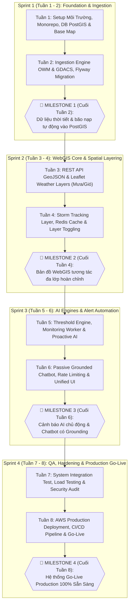
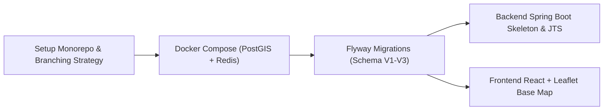
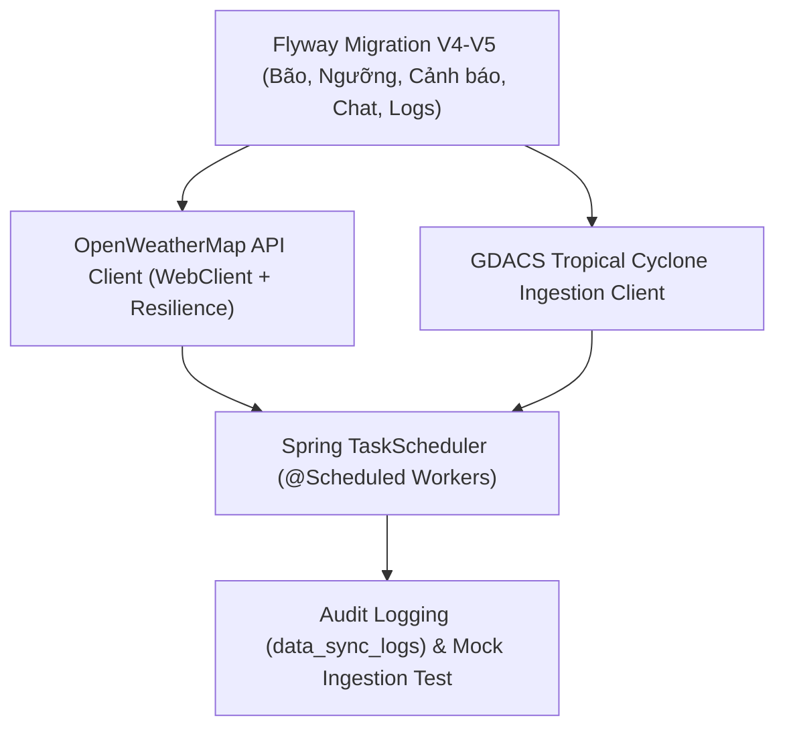
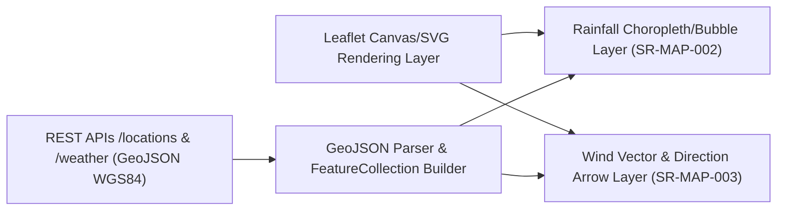
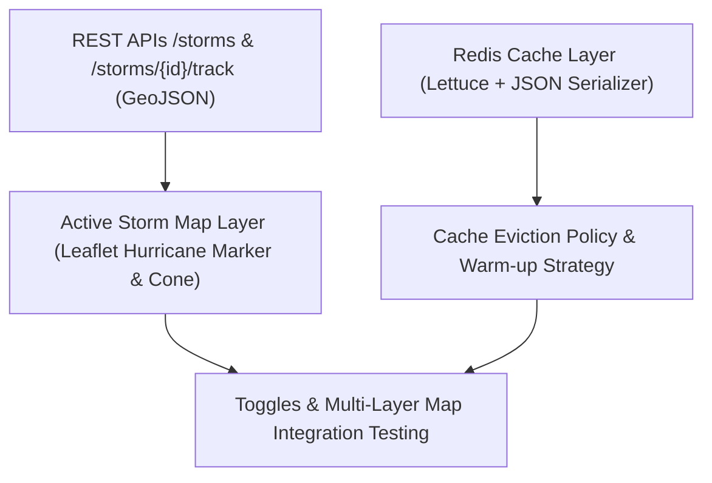
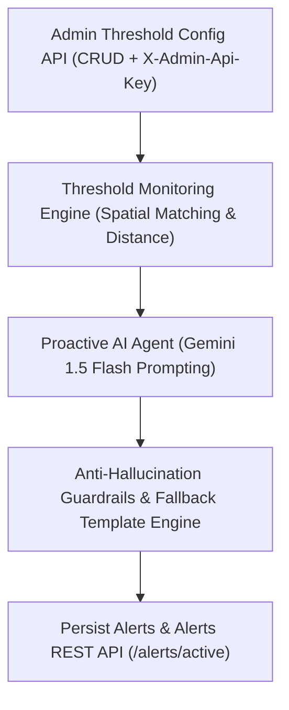
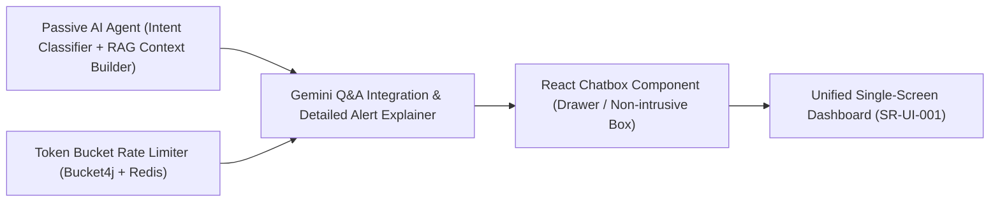
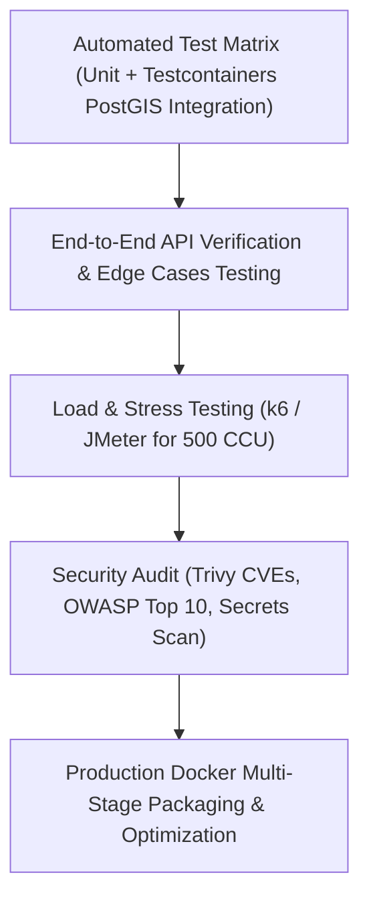
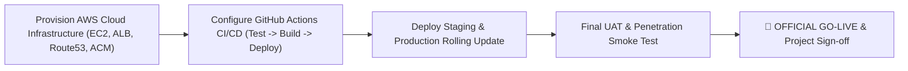
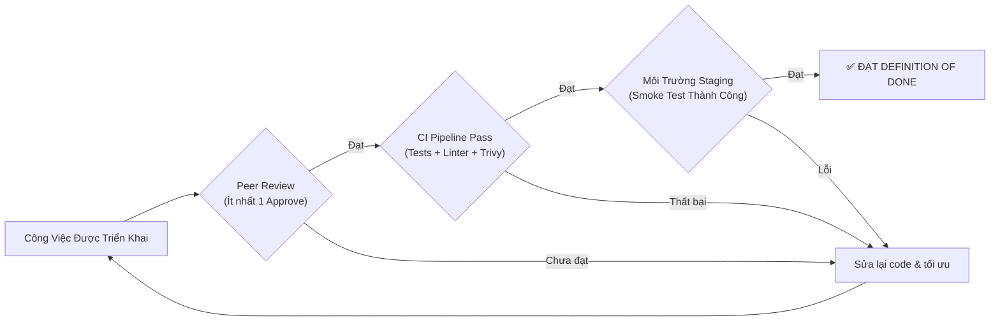

# 8. MASTER PROJECT TIMELINE & SPRINT ROADMAP (8 TUẦN)

## Hệ Thống WebGIS Giám Sát Mưa Gió Bão Tích Hợp AI Agent Cảnh Báo

---

## Thông Tin Tài Liệu (Document Information)

- **Tên tài liệu:** Master Project Timeline & Sprint Roadmap (8 Tuần Lộ Trình Triển Khai)
- **Dự án:** Vietnam Weather & Storm Monitoring WebGIS with Grounded AI Warning Agent
- **Hệ thống:** WebGIS Giám Sát Mưa Gió Bão Tích Hợp AI Agent Cảnh Báo
- **Phiên bản:** 1.0 (Baseline Delivery Plan)
- **Ngày lập:** 2026-10-05
- **Tác giả:** Project Manager / Technical Program Manager / Software Architect
- **Tài liệu nguồn tham chiếu cơ sở:**
  1. [0. Introduction.md](file:///Users/dllv/Documents/GitHub/VNstormgis/docs/The%20plans%20of%20project/0.%20Introduction.md) — Tổng quan phạm vi và công nghệ
  2. [1. ERD.md](file:///Users/dllv/Documents/GitHub/VNstormgis/docs/The%20plans%20of%20project/1.%20ERD.md) — Thiết kế cơ sở dữ liệu không gian 10 bảng
  3. [2. API docs.md](file:///Users/dllv/Documents/GitHub/VNstormgis/docs/The%20plans%20of%20project/2.%20API%20docs.md) — Đặc tả kỹ thuật RESTful API & GeoJSON
  4. [3. BRD.md](file:///Users/dllv/Documents/GitHub/VNstormgis/docs/The%20plans%20of%20project/3.%20BRD.md) — Yêu cầu nghiệp vụ & Tiêu chuẩn rủi ro thiên tai
  5. [4. SRS.md](file:///Users/dllv/Documents/GitHub/VNstormgis/docs/The%20plans%20of%20project/4.%20SRS.md) — Đặc tả yêu cầu phần mềm và ma trận kiểm thử
  6. [5. System Architecture.md](file:///Users/dllv/Documents/GitHub/VNstormgis/docs/The%20plans%20of%20project/5.%20System%20Architecture.md) — Thiết kế kiến trúc Modular Monolith & Luồng dữ liệu
  7. [6. Technical Stack.md](file:///Users/dllv/Documents/GitHub/VNstormgis/docs/The%20plans%20of%20project/6.%20Technical%20Stack.md) — Quyết định công nghệ Java 21, React, PostGIS, Gemini
  8. [7. Deployment Infrastructure.md](file:///Users/dllv/Documents/GitHub/VNstormgis/docs/The%20plans%20of%20project/7.%20Deployment%20Infrastructure.md) — Thiết kế hạ tầng Docker, Nginx, AWS & CI/CD

---

## 1. Executive Summary & Delivery Strategy

### 1.1. Mục Tiêu Lộ Trình 8 Tuần

Kế hoạch triển khai tổng thể (**Master Timeline**) được thiết kế để đưa hệ thống **WebGIS Giám Sát Mưa Gió Bão Tích Hợp AI Agent Cảnh Báo** từ tài liệu thiết kế lý thuyết thành một sản phẩm phần mềm hoàn chỉnh, đã được kiểm thử nghiêm ngặt, đóng gói tự động và vận hành sẵn sàng trên môi trường điện toán đám mây trong vòng đúng **08 tuần làm việc** (tương đương 4 Sprints 2 tuần theo phương pháp Agile/Scrum kết hợp Milestone-Driven).

### 1.2. Chiến Lược Triển Khai (Execution Principles)

1. **Kiến Trúc Tinh Gọn (Simplicity First):** Tập trung hiện thực hóa kiến trúc **Modular Monolith** trên nền tảng **Java 21 LTS + Spring Boot 3.3**, CSDL **PostgreSQL 16 + PostGIS 3.4**, bộ đệm **Redis 7.2**, giao diện **React 18 + Leaflet** và AI Engine **Google Gemini API**. Loại bỏ mọi thành phần phân tán dư thừa.
2. **Ưu Tiên Đường Cơ Sở Dữ Liệu & GIS (Data-First & Spatial-First):** Xây dựng hạ tầng dữ liệu không gian, pipeline nạp tự động (OpenWeatherMap & GDACS) trước khi phát triển các module giao diện người dùng và trí tuệ nhân tạo.
3. **Độ Tin Cậy Của AI (Grounding-First):** Chức năng cảnh báo chủ động và trợ lý hỏi đáp AI phải tuân thủ tuyệt đối quy tắc Factual Grounding và Fallback Deterministic, loại trừ hoàn toàn nguy cơ bịa đặt số liệu khí tượng.
4. **Tích Hợp Liên Tục & Kiểm Thử Tự Động (Continuous Verification):** Tích hợp sớm từ Sprint 1 với Testcontainers, kiểm thử CSDL PostGIS thực tế ngay trên pipeline CI, bảo đảm không có lỗi tích hợp muộn (Late Integration Surprise).

---

## 2. High-Level 8-Week Roadmap & Milestone Overview



### Bảng Ma Trận Các Giai Đoạn (Phase Breakdown)

|    Sprint    |      Thời Gian      | Tên Giai Đoạn                                      | Trọng Tâm Kỹ Thuật                                                                                                                                                                                                                         | Sản Phẩm Bàn Giao Cốt Lõi (Key Deliverables)                                                                                                                                                                                      | Trạng Thái Cổng Nghiệm Thu                                                                |
| :----------: | :-----------------: | :------------------------------------------------- | :----------------------------------------------------------------------------------------------------------------------------------------------------------------------------------------------------------------------------------------- | :-------------------------------------------------------------------------------------------------------------------------------------------------------------------------------------------------------------------------------- | :---------------------------------------------------------------------------------------- |
| **Sprint 1** | **Tuần 1 – Tuần 2** | **Foundation, Database & Ingestion Engine**        | - Thiết lập monorepo, Docker Compose cục bộ.<br/>- Khởi tạo lược đồ 10 bảng PostGIS với Flyway.<br/>- Xây dựng Client OWM & GDACS nạp dữ liệu nền.                                                                                         | - Stack Docker Dev hoàn chỉnh (Backend + DB + Redis + Web).<br/>- Migration V1-V5 nạp sẵn 63 trạm quan trắc.<br/>- Tiến trình `@Scheduled` nạp dữ liệu chạy ngầm trơn tru.                                                        | **Gate 1 Passed:** Dữ liệu thời tiết và bão active lưu thành công vào CSDL.               |
| **Sprint 2** | **Tuần 3 – Tuần 4** | **WebGIS Core Layers & Spatial Tracking**          | - Hiện thực hóa REST API chuẩn GeoJSON RFC 7946.<br/>- Tích hợp Leaflet hiển thị lớp mưa, vector gió, tâm bão.<br/>- Thiết lập Redis Distributed Cache tối ưu GeoJSON.                                                                     | - Bộ REST APIs `/locations`, `/weather/*`, `/storms/*`.<br/>- Bản đồ số WGS84 tương tác mượt mà, hỗ trợ bật/tắt lớp.<br/>- Bộ lọc loại bỏ bão đã tan (`status != 'active'`).                                                      | **Gate 2 Passed:** Người dùng xem được đầy đủ các lớp thời tiết trên WebGIS.              |
| **Sprint 3** | **Tuần 5 – Tuần 6** | **AI Agent Warning & Grounded Conversational Q&A** | - Xây dựng Threshold & Monitoring Engine (`ST_DistanceSphere`).<br/>- Tích hợp Gemini 1.5 Flash sinh cảnh báo & đối thoại.<br/>- Bộ guardrails chống ảo giác và mẫu fallback.<br/>- Giao diện hợp nhất 1 màn hình (Bản đồ + Alert + Chat). | - Quản trị CRUD ngưỡng cảnh báo (Admin Key).<br/>- Tiến trình tự động sinh cảnh báo tiếng Việt có kiểm chứng.<br/>- Hộp thoại Chatbox trả lời câu hỏi thời tiết có grounding.<br/>- Giới hạn tốc độ Bucket4j bảo vệ hạn ngạch AI. | **Gate 3 Passed:** Hệ thống tự cảnh báo khi vượt ngưỡng và chatbox phản hồi đúng số liệu. |
| **Sprint 4** | **Tuần 7 – Tuần 8** | **Hardening, Cloud Deployment & Go-Live**          | - Kiểm thử tích hợp Testcontainers, kiểm thử tải, kiểm tra an ninh.<br/>- Triển khai máy chủ AWS EC2 `t4g.medium`, ALB, RDS PostGIS.<br/>- Tự động hóa CI/CD với GitHub Actions.                                                           | - Toàn bộ Unit & Integration Tests đạt độ bao phủ $> 75\%$.<br/>- Pipeline CI/CD tự động build & deploy khi có tag release.<br/>- Hệ thống chạy chính thức trên domain với chứng chỉ SSL/TLS.                                     | **Gate 4 Passed (Go-Live):** Nghiệm thu toàn bộ tiêu chí AC trong SRS.                    |

---

## 3. Detailed Weekly Work Breakdown Structure (WBS)

---

### 3.1. Tuần 1: Khởi Tạo Dự Án, Môi Trường & Hạ Tầng Dữ Liệu Địa Không Gian

- **Thời gian:** Tuần 1 (Ngày 1 — Ngày 5)
- **Thuộc:** Sprint 1 — Phase: Foundation
- **Mục tiêu tuần (Weekly Goal):** Thiết lập toàn diện kho lưu trữ mã nguồn, cấu hình môi trường lập trình cục bộ đa container với Docker Compose, hiện thực hóa lược đồ cơ sở dữ liệu PostGIS 16 và khởi tạo khung ứng dụng Frontend/Backend.



#### Phân Rã Nhiệm Vụ Chi Tiết Theo Vai Trò:

1. **Backend Engineer:**
   - Khởi tạo Spring Boot 3.3.x dự án với Java 21, Gradle 8.x, cấu hình `build.gradle` bao gồm: Spring Data JPA, Hibernate Spatial 6.x, JTS (Java Topology Suite), Jackson JTS Module, Spring Web MVC, SpringDoc OpenAPI, và Jakarta Validation.
   - Cấu hình kiến trúc Modular Monolith phân gói: `vn.weathergis.location`, `weather`, `storm`, `threshold`, `alert`, `chat`, `automation`, `security`, `common`.
   - Viết cấu hình `application-dev.yml` kết nối tới PostgreSQL/PostGIS và Redis cục bộ.
   - Thiết lập cấu trúc `GlobalExceptionHandler` bắt ngoại lệ tập trung theo chuẩn RFC 7807 Problem Details.
2. **Database / GIS Specialist:**
   - Soạn thảo các file di chuyển lược đồ Flyway Migration:
     - `V1__init_spatial_extensions.sql`: Kích hoạt phần mở rộng `postgis` và `uuid-ossp`.
     - `V2__create_location_tables.sql`: Bảng `locations` với cột hình học `geom` (Point WGS84) và chỉ mục GiST `idx_locations_geom`.
     - `V3__seed_vietnam_locations.sql`: Nạp sẵn dữ liệu tọa độ địa lý của 63 tỉnh/thành phố và các trạm khí tượng trọng điểm Việt Nam.
3. **Frontend Engineer:**
   - Khởi tạo ứng dụng React 18 với Vite, TypeScript 5.x và Tailwind CSS.
   - Tích hợp thư viện Leaflet 1.9 và `react-leaflet` 4.2.
   - Dựng component bản đồ nền số `BaseMap`: Khởi tạo khung nhìn bao quát lãnh thổ Việt Nam (tọa độ trung tâm: $16.0^\circ N, 108.0^\circ E$, mức zoom mặc định 6), nạp mảnh bản đồ chuẩn từ OpenStreetMap/CartoDB.
   - Thiết lập cấu trúc thư mục frontend: `components/map`, `components/alerts`, `components/chat`, `services/api`, `types`.
4. **DevOps & QA Engineer:**
   - Soạn thảo file `deployment/docker-compose.yml` định nghĩa các dịch vụ: `db` (`postgis/postgis:16-3.4-alpine`), `redis` (`redis:7.2-alpine`), `backend`, `web`.
   - Thiết lập quy tắc Git Workflow (nhánh `main`, `staging`, `feature/*`), bảo vệ nhánh chính và quy chuẩn commit message (Conventional Commits).
   - Thiết lập khung kiểm thử tự động ban đầu: JUnit 5, Mockito và cấu hình Testcontainers PostGIS cho backend.

#### Sản Phẩm Bàn Giao (Weekly Deliverables):

- Repository mã nguồn với cấu trúc chuẩn modular hoàn chỉnh.
- File `docker-compose.yml` kích hoạt môi trường làm việc local trong 1 lệnh duy nhất.
- CSDL PostGIS chạy trên Docker chứa bảng `locations` đã seed đủ 63 điểm trạm quan trắc.
- Ứng dụng web hiển thị bản đồ số Việt Nam tương tác cơ bản (pan, zoom).

#### Tiêu Chí Chấp Nhận & Đánh Giá (Acceptance Criteria):

- [x] Lệnh `docker compose up -d` khởi động thành công dịch vụ DB và Redis, kiểm tra `pg_isready` báo healthy.
- [x] Flyway áp dụng thành công script V1, V2, V3; câu truy vấn SQL `SELECT ST_AsText(geom) FROM locations WHERE code = 'HAN'` trả về đúng tọa độ trạm Hà Nội.
- [x] Bản đồ React Leaflet hiển thị mượt mà trên trình duyệt `http://localhost:3000`, không có lỗi console.
- **SRS Traceability:** [SR-MAP-001](file:///Users/dllv/Documents/GitHub/VNstormgis/docs/The%20plans%20of%20project/4.%20SRS.md#L189), [SRS Section 17](file:///Users/dllv/Documents/GitHub/VNstormgis/docs/The%20plans%20of%20project/4.%20SRS.md).

---

### 3.2. Tuần 2: Hoàn Thiện Schema CSDL & Ingestion Pipeline Thu Nạp Dữ Liệu Tự Động

- **Thời gian:** Tuần 2 (Ngày 6 — Ngày 10)
- **Thuộc:** Sprint 1 — Phase: Ingestion & Backend Core
- **Mục tiêu tuần (Weekly Goal):** Hoàn thành toàn bộ cấu trúc 10 bảng CSDL theo ERD; hiện thực hóa tiến trình chạy ngầm Ingestion Engine tự động gọi API OpenWeatherMap và GDACS, chuẩn hóa dữ liệu khí tượng và lưu trữ bền vững kèm audit log.



#### Phân Rã Nhiệm Vụ Chi Tiết Theo Vai Trò:

1. **Database / GIS Specialist:**
   - Soạn thảo và kiểm thử các file migration tiếp theo:
     - `V4__create_weather_and_storm_tables.sql`: Tạo bảng `weather_records`, `storms` (cột `geom_current`), `storm_tracks` (`geom`, `impact_polygon`) kèm chỉ mục GiST và B-Tree tổng hợp.
     - `V5__create_alert_chat_and_log_tables.sql`: Tạo bảng `alert_thresholds`, `alerts`, `chat_sessions`, `chat_messages`, `data_sync_logs`.
   - Seed dữ liệu cấu hình ngưỡng ban đầu vào `alert_thresholds` (ngưỡng mưa `rain_1h >= 50.0mm`, gió `wind_speed >= 15.0m/s`, khoảng cách bão `storm_dist <= 300km`).
2. **Backend Engineer (Ingestion Focus):**
   - Xây dựng module `vn.weathergis.automation` và các HTTP Client sử dụng Spring `WebClient`:
     - `OpenWeatherMapClient`: Gọi API thời tiết theo tọa độ trạm, bóc tách nhiệt độ, độ ẩm, áp suất, tốc độ gió, hướng gió, gió giật, lượng mưa 1h/3h (`SR-ING-001`).
     - `GdacsStormClient`: Gọi API nguồn cấp dữ liệu GDACS, trích xuất sự kiện bão nhiệt đới (`Tropical Cyclone`), bóc tách mã bão, tên bão, tọa độ tâm, cấp gió và trạng thái hoạt động (`SR-STM-001`).
   - Xây dựng tiến trình điều phối tác vụ `WeatherSyncScheduler` (chu kỳ 15 phút) và `StormSyncScheduler` (chu kỳ 30 phút) sử dụng Spring TaskScheduler (`@Scheduled`).
   - Xử lý quy tắc nghiệp vụ: Chỉ lưu và cập nhật các cơn bão có trạng thái `status = 'active'`, chuyển trạng thái `dissipated` khi bão suy yếu (`SYS-RULE-001`).
   - Ghi lại nhật ký mỗi lượt thực thi vào bảng `data_sync_logs` (thời gian bắt đầu, kết thúc, số bản ghi xử lý, trạng thái `SUCCESS`/`FAILED`, thông điệp lỗi).
3. **Frontend Engineer:**
   - Xây dựng cấu trúc hiển thị trạng thái dữ liệu (Loading indicator, Error boundary, Toast notification).
   - Thiết kế giao diện khung điều khiển lớp bản đồ (Layer Control component) hỗ trợ checkbox bật/tắt các lớp: Lớp lượng mưa, Lớp gió, Lớp bão (`SR-MAP-004`).
   - Tích hợp biểu tượng chỉ hướng gió và biểu tượng xoáy bão SVG tùy chỉnh.
4. **DevOps & QA Engineer:**
   - Viết Integration Test với Testcontainers: Kiểm tra việc insert và query dữ liệu bảng `weather_records` và `storms`.
   - Tạo bộ mock server (sử dụng WireMock) mô phỏng phản hồi của OpenWeatherMap và GDACS để kiểm thử khả năng xử lý timeout (connect 3s, read 5s) và mã lỗi HTTP 429/5xx (`ERR-EXT-001..003`).

#### Sản Phẩm Bàn Giao (Weekly Deliverables):

- Cơ sở dữ liệu 10 bảng hoàn thiện 100% theo đúng [1. ERD.md](file:///Users/dllv/Documents/GitHub/VNstormgis/docs/The%20plans%20of%20project/1.%20ERD.md).
- Module Ingestion Engine tự động thu thập dữ liệu thời tiết và bão theo chu kỳ.
- Bảng `data_sync_logs` lưu trữ lịch sử đồng bộ minh bạch.
- Layer Control component sẵn sàng trên giao diện React.

#### Tiêu Chí Chấp Nhận & Đánh Giá (Acceptance Criteria):

- [x] Trigger endpoint nội bộ `POST /api/v1/internal/sync/weather` (với header `X-Internal-Secret`) nạp thành công bản ghi quan trắc cho các trạm quan sát.
- [x] Trigger `POST /api/v1/internal/sync/storms` nạp được danh sách bão đang hoạt động từ GDACS.
- [x] Bão có trạng thái tan biến không bị gán nhầm là active.
- [x] **Milestone 1 Acceptance:** Dữ liệu thời tiết và bão được nạp tự động vào PostgreSQL/PostGIS mà không gặp sự cố rò rỉ kết nối hoặc crash ứng dụng.
- **SRS Traceability:** [SR-STM-001](file:///Users/dllv/Documents/GitHub/VNstormgis/docs/The%20plans%20of%20project/4.%20SRS.md#L262), [SR-STM-003](file:///Users/dllv/Documents/GitHub/VNstormgis/docs/The%20plans%20of%20project/4.%20SRS.md#L301), [SYS-RULE-001](file:///Users/dllv/Documents/GitHub/VNstormgis/docs/The%20plans%20of%20project/4.%20SRS.md).

---

### 3.3. Tuần 3: Dịch Vụ RESTful API Chuẩn GeoJSON & Trực Quan Hóa Lớp Mưa/Gió Thời Gian Thực

- **Thời gian:** Tuần 3 (Ngày 11 — Ngày 15)
- **Thuộc:** Sprint 2 — Phase: WebGIS Core & Spatial Visualization
- **Mục tiêu tuần (Weekly Goal):** Xây dựng toàn bộ các endpoint RESTful API cung cấp dữ liệu trạm quan trắc và thời tiết theo chuẩn RFC 7946 GeoJSON; tích hợp hiển thị trực quan lớp lượng mưa và trường vector gió thời gian thực trên bản đồ Leaflet.



#### Phân Rã Nhiệm Vụ Chi Tiết Theo Vai Trò:

1. **Backend Engineer:**
   - Hiện thực hóa các Controller và Service thuộc domain `location` và `weather`:
     - `GET /api/v1/locations`: Lấy danh sách toàn bộ trạm quan trắc (định dạng JSON hoặc GeoJSON FeatureCollection với hình học Point WGS84).
     - `GET /api/v1/locations/{code}`: Lấy thông tin chi tiết một trạm quan trắc.
     - `GET /api/v1/weather/current`: Trả về dữ liệu thời tiết mới nhất của toàn bộ các trạm dưới dạng GeoJSON FeatureCollection chuẩn RFC 7946 phục vụ bản đồ số.
     - `GET /api/v1/weather/history?location_code={code}&hours=24`: Lấy chuỗi lịch sử thời tiết 24 giờ của một trạm.
   - Sử dụng thư viện `Jackson Datatype JTS` tự động tuần tự hóa đối tượng `org.locationtech.jts.geom.Point` thành định dạng GeoJSON chuẩn.
   - Tích hợp SpringDoc OpenAPI: Tài liệu hóa đầy đủ các endpoint tại `/swagger-ui.html`.
2. **Frontend Engineer (GIS Visualization):**
   - Xây dựng tầng dịch vụ `weatherService.ts` kết nối gọi API Backend.
   - Phát triển lớp hiển thị lượng mưa **Rainfall Layer (`SR-MAP-002`)**:
     - Render các điểm đo dưới dạng vòng tròn (CircleMarker) với kích thước và màu sắc phân cấp theo cường độ mưa:
       - $0.0\,mm$: Trong suốt / Xám nhạt.
       - $0.1 - 15.0\,mm$ (Mưa nhỏ/vừa): Xanh lục nhạt (#68d391).
       - $16.0 - 50.0\,mm$ (Mưa to): Vàng đậm (#ecc94b).
       - $> 50.0\,mm$ (Mưa rất to / Nguy hiểm): Đỏ cờ (#e53e3e).
     - Gắn Tooltip/Popup tương tác khi click vào điểm đo: Hiển thị tên trạm, lượng mưa 1h/3h, nhiệt độ, độ ẩm và thời điểm cập nhật.
   - Phát triển lớp hiển thị trường gió **Wind Layer (`SR-MAP-003`)**:
     - Render các vector mũi tên gió biểu diễn hướng gió theo góc phương vị ($0^\circ - 360^\circ$).
     - Mã hóa màu sắc mũi tên theo cấp độ gió (Beaufort scale) hoặc dải tốc độ ($m/s$).
     - Hiển thị thông số tốc độ gió trung bình và gió giật (`wind_gust`) trong Popup.
3. **Database / GIS Specialist:**
   - Tối ưu hóa truy vấn SQL lấy bản ghi thời tiết mới nhất bằng cấu trúc `DISTINCT ON (location_id)` kết hợp chỉ mục tổng hợp `idx_weather_location_time (location_id, recorded_at DESC)`.
   - Đo đạc thời gian thực thi: Đảm bảo câu truy vấn toàn mạng lưới 63 trạm hoàn tất dưới 15ms trên PostGIS.
4. **DevOps & QA Engineer:**
   - Viết Unit Tests cho `WeatherService` và API MockMvc tests cho `WeatherController`.
   - Kiểm thử hiển thị bản đồ trên các trình duyệt hiện đại (Chrome, Firefox, Safari) bảo đảm các vòng tròn và mũi tên vector không bị lệch tọa độ.

#### Sản Phẩm Bàn Giao (Weekly Deliverables):

- Điểm cuối API `GET /api/v1/weather/current` trả về GeoJSON FeatureCollection hợp lệ.
- Giao diện WebGIS hiển thị sống động 2 lớp thông tin: Lượng mưa và Trường gió.
- Popup thông tin trạm chi tiết khi người dùng tương tác trên bản đồ.

#### Tiêu Chí Chấp Nhận & Đánh Giá (Acceptance Criteria):

- [x] GeoJSON trả về từ API vượt qua công cụ kiểm tra hợp chuẩn (linter) RFC 7946; mảng tọa độ có định dạng chuẩn `[kinh độ, vĩ độ]`.
- [x] Khi chuyển đổi hiển thị giữa Lớp Mưa và Lớp Gió, bản đồ cập nhật ngay tức thì mà không giật lag hoặc reload lại trang web.
- [x] Trạm có mưa lớn hiển thị nổi bật màu đỏ, trạm khuyết thiếu dữ liệu mưa hiển thị giá trị mặc định $0.0\,mm$ theo đúng SRS.
- **SRS Traceability:** [SR-MAP-002](file:///Users/dllv/Documents/GitHub/VNstormgis/docs/The%20plans%20of%20project/4.%20SRS.md#L207), [SR-MAP-003](file:///Users/dllv/Documents/GitHub/VNstormgis/docs/The%20plans%20of%20project/4.%20SRS.md#L225), [BR-MAP-01](file:///Users/dllv/Documents/GitHub/VNstormgis/docs/The%20plans%20of%20project/3.%20BRD.md), [BR-MAP-02](file:///Users/dllv/Documents/GitHub/VNstormgis/docs/The%20plans%20of%20project/3.%20BRD.md).

---

### 3.4. Tuần 4: Quản Lý Cơn Bão Đang Hoạt Động, Tích Hợp Redis Cache & Hoàn Thiện WebGIS Core

- **Thời gian:** Tuần 4 (Ngày 16 — Ngày 20)
- **Thuộc:** Sprint 2 — Phase: Storm Tracking & Performance Optimization
- **Mục tiêu tuần (Weekly Goal):** Xây dựng API và giao diện hiển thị bão active, vẽ đường quỹ đạo và vùng bán kính nguy hiểm; cấu hình bộ nhớ đệm phân tán Redis 7.2 tối ưu hóa thời gian phản hồi GeoJSON; hoàn tất toàn bộ Milestone 2.



#### Phân Rã Nhiệm Vụ Chi Tiết Theo Vai Trò:

1. **Backend Engineer (Storm & Cache Focus):**
   - Hiện thực hóa các Controller và Service thuộc domain `storm`:
     - `GET /api/v1/storms?status=active`: Lấy danh sách các cơn bão đang hoạt động trong khu vực Biển Đông và lân cận (`SR-STM-002`).
     - `GET /api/v1/storms/{id}`: Lấy thông tin chi tiết một cơn bão (tên quốc tế, cấp bão, áp suất tâm, sức gió lớn nhất).
     - `GET /api/v1/storms/{id}/track`: Trả về GeoJSON FeatureCollection chứa LineString đường đi lịch sử/dự báo và Polygon vùng ảnh hưởng nguy hiểm.
   - Tích hợp thư viện **Spring Data Redis (Lettuce Driver)**:
     - Cấu hình `RedisCacheManager` với các vùng cache chuyên biệt:
       - `locations`: TTL 24 giờ.
       - `weather_current`: TTL 15 phút (tự động làm mới khi có dữ liệu nạp mới).
       - `active_storms`: TTL 30 phút.
     - Triển khai cơ chế phân rã dự phòng (**Graceful Degradation**): Nếu Redis mất kết nối, hệ thống tự động fallback truy vấn trực tiếp PostGIS mà không làm gián đoạn API của người dùng.
2. **Frontend Engineer:**
   - Phát triển lớp hiển thị bão **Active Storm Layer (`SR-STM-002`)**:
     - Render biểu tượng tâm bão đặc trưng (xoáy bão SVG) tại tọa độ hiện tại ($geom\_current$). Biểu tượng có hiệu ứng quay nhẹ hoặc cảnh báo trực quan.
     - Vẽ đường đứt đoạn biểu diễn quỹ đạo di chuyển dự kiến (LineString).
     - Vẽ vùng bán kính gió nguy hiểm (Polygon) bao quanh tâm bão.
     - Popup bão: Hiển thị tên bão, cấp bão quốc tế, vận tốc gió tối đa ($km/h$) và áp suất ($hPa$).
   - Hoàn thiện bảng điều khiển lớp bản đồ (Layer Toggle Controls): Hỗ trợ bật/tắt độc lập 3 lớp (Lượng mưa, Gió, Bão) hoặc bật kết hợp cả 3 lớp cùng lúc mà không xung đột render (`SR-MAP-004`).
3. **Database Specialist:**
   - Kiểm tra và tinh chỉnh chỉ mục GiST trên bảng `storms` (`idx_storms_geom_current`) và bảng `storm_tracks` (`idx_storm_tracks_geom`).
   - Kiểm tra các hàm chuyển đổi hình học GeoJSON trên CSDL để bảo đảm tọa độ luôn tuân thủ chuẩn EPSG:4326.
4. **DevOps & QA Engineer:**
   - Thực hiện kiểm thử tải sơ bộ (Benchmark test) với Apache Benchmark (ab) hoặc k6:
     - So sánh độ trễ endpoint `/api/v1/weather/current` trước và sau khi có Redis cache (mục tiêu: từ ~25ms giảm xuống $< 2ms$).
   - Nghiệm thu Milestone 2.

#### Sản Phẩm Bàn Giao (Weekly Deliverables):

- Điểm cuối API bão hoạt động ổn định, trả về GeoJSON tâm bão và quỹ đạo.
- Lớp bão Leaflet hiển thị trực quan tâm bão, bán kính ảnh hưởng và hướng di chuyển.
- Tầng Redis Cache hoạt động ổn định, giảm 95% số truy vấn vào PostGIS.
- Bản đồ số WebGIS hoàn chỉnh Milestone 2 sẵn sàng cho tích hợp AI.

#### Tiêu Chí Chấp Nhận & Đánh Giá (Acceptance Criteria):

- [x] Cơn bão có `status = 'active'` hiển thị chính xác tại tọa độ trắc địa; khi không có bão active, bản đồ hiển thị thông báo thân thiện "Hiện không có bão hoạt động trong khu vực theo dõi".
- [x] Cơn bão đã chuyển sang `dissipated` tự động biến mất khỏi lớp bản đồ bão khẩn cấp.
- [x] Endpoint `/api/v1/weather/current` phản hồi $< 5ms$ khi có cache hit trên Redis.
- [x] **Milestone 2 Acceptance:** Toàn bộ Module 1 (Bản đồ WebGIS) và Module 2 (Theo dõi Bão) vận hành đồng bộ, mượt mà trên môi trường Local.
- **SRS Traceability:** [SR-STM-002](file:///Users/dllv/Documents/GitHub/VNstormgis/docs/The%20plans%20of%20project/4.%20SRS.md#L283), [SR-MAP-004](file:///Users/dllv/Documents/GitHub/VNstormgis/docs/The%20plans%20of%20project/4.%20SRS.md#L243), [SYS-RULE-001](file:///Users/dllv/Documents/GitHub/VNstormgis/docs/The%20plans%20of%20project/4.%20SRS.md), [BR-STM-01](file:///Users/dllv/Documents/GitHub/VNstormgis/docs/The%20plans%20of%20project/3.%20BRD.md), [BR-STM-02](file:///Users/dllv/Documents/GitHub/VNstormgis/docs/The%20plans%20of%20project/3.%20BRD.md).

---

### 3.5. Tuần 5: Quản Lý Ngưỡng, Background Monitoring & AI Agent Chủ Động Phát Sinh Cảnh Báo

- **Thời gian:** Tuần 5 (Ngày 21 — Ngày 25)
- **Thuộc:** Sprint 3 — Phase: Alert Automation & Proactive AI
- **Mục tiêu tuần (Weekly Goal):** Xây dựng chức năng quản trị cấu hình bộ ngưỡng rủi ro; hiện thực hóa tiến trình quét dữ liệu ngầm phát hiện vượt ngưỡng kết hợp tính khoảng cách bão trắc địa (`ST_DistanceSphere`); tích hợp Google Gemini API tự động sinh bản tin cảnh báo có kiểm chứng và cơ chế dự phòng Fallback.



#### Phân Rã Nhiệm Vụ Chi Tiết Theo Vai Trò:

1. **Backend Engineer (Monitoring & Security Focus):**
   - Hiện thực hóa các Controller và Service thuộc domain `threshold`:
     - `GET /api/v1/alert-thresholds`: Tra cứu danh sách các quy chuẩn ngưỡng rủi ro (`SR-ALT-001`).
     - `POST`, `PUT`, `DELETE /api/v1/alert-thresholds/{id}`: Thêm, sửa, xóa hoặc kích hoạt/vô hiệu hóa cấu hình ngưỡng.
     - Áp dụng bộ lọc `AdminApiKeyFilter`: Bắt buộc kiểm tra header `X-Admin-Api-Key` cho mọi thao tác ghi cấu hình ngưỡng.
   - Xây dựng **Background Monitoring Engine (`SR-ALT-002`)**:
     - Tiến trình `ThresholdEvaluationScheduler` kích hoạt tự động sau mỗi lần nạp thời tiết mới.
     - Thực hiện quét các chỉ số quan trắc: so sánh mưa ($rain\_1h$, $rain\_3h$) và gió ($wind\_speed$, $wind\_gust$) với bảng `alert_thresholds`.
     - Sử dụng hàm không gian PostGIS `ST_DistanceSphere(locations.geom, storms.geom_current) / 1000.0` để tính toán khoảng cách thực tế mặt cầu giữa từng trạm và tâm các cơn bão active; so sánh với ngưỡng khoảng cách nguy hiểm.
     - Khi phát hiện vượt ngưỡng: Tạo sự kiện nội bộ `ThresholdViolatedEvent` kích hoạt module AI.
2. **AI / Prompt Engineer & Backend Specialist:**
   - Xây dựng module `vn.weathergis.alert.ai` kết nối **Google Gemini API** (phiên bản `Gemini 1.5 Flash`) qua Spring `WebClient`:
     - Thiết lập cấu trúc Prompt có ràng buộc Grounding nghiêm ngặt (`SR-AGT-001`): Tiêm số liệu đo đạc thực tế, mã trạm, giá trị vượt ngưỡng vào khối `[FACTUAL_DATA]`.
     - System Instruction: Bắt buộc mô hình trích dẫn trung thực số đo thực tế, viết bằng tiếng Việt chuẩn văn phong cảnh báo khí tượng, giải thích nguyên nhân gây nguy hiểm và đề xuất hành động an toàn cơ bản. Đặt tham số `temperature = 0.2` để tối đa hóa tính chính xác.
   - Xây dựng **Bộ kiểm chứng dữ liệu đầu ra (Output Guardrails Validator - `SR-AGT-002`)**:
     - Sử dụng biểu thức chính quy (Regex) quét các con số đo lường trong văn bản trả về của Gemini. Nếu phát hiện số liệu bịa đặt hoặc sai lệch so với đầu vào $\rightarrow$ Từ chối kết quả của AI.
   - Xây dựng **Deterministic Fallback Template Engine (`SR-AGT-003`)**:
     - Khi Gemini API bị timeout (sau 5 giây) hoặc trả về lỗi HTTP 5xx hoặc vi phạm guardrail $\rightarrow$ Tự động điền số liệu thực đo vào các mẫu câu chuẩn định sẵn (ví dụ: _"Cảnh báo mưa lớn tại [Trạm]: Lượng mưa tích lũy 1h đạt [X] mm, vượt ngưỡng [Y] mm..."_), lưu cảnh báo với cờ `is_fallback = true`.
   - Cung cấp API `GET /api/v1/alerts/active` và `GET /api/v1/alerts/{id}` cho Client.
3. **Frontend Engineer:**
   - Xây dựng **Alert Panel Component**: Danh sách các cảnh báo đang kích hoạt (`status = 'active'`) hiển thị nổi bật bên cạnh bản đồ.
   - Hiển thị huy hiệu mức độ nghiêm trọng với mã màu trực quan: `INFO` (Xanh dương), `WARNING` (Vàng), `DANGER` (Cam), `CRITICAL` (Đỏ).
   - Tích hợp tính năng tương tác không gian: Khi người dùng nhấp vào một thẻ cảnh báo trong Panel, bản đồ tự động bay tới vị trí trạm đó (`map.flyTo([lat, lon], 12)`) và mở popup giải thích của AI.
4. **DevOps & QA Engineer:**
   - Viết Integration Test kiểm tra luồng phát hiện vượt ngưỡng: Giả lập trạm có lượng mưa $75.0\,mm$ và kiểm tra hệ thống có tự động kích hoạt tạo alert hay không.
   - Viết bài test giả lập sự cố ngắt mạng tới Gemini API để kiểm chứng cơ chế Deterministic Fallback hoạt động trong 100% trường hợp lỗi.

#### Sản Phẩm Bàn Giao (Weekly Deliverables):

- Module quản trị ngưỡng cảnh báo phân quyền bằng API Key an toàn.
- Tiến trình quét ngầm phát hiện vượt ngưỡng và tính khoảng cách bão trắc địa tự động.
- Proactive AI Agent sinh bản tin cảnh báo tiếng Việt có Factual Grounding.
- Hệ thống phòng thủ Fallback bảo đảm phát cảnh báo liên tục kể cả khi Gemini API gián đoạn.
- Panel danh sách cảnh báo thời gian thực tích hợp trên giao diện WebGIS.

#### Tiêu Chí Chấp Nhận & Đánh Giá (Acceptance Criteria):

- [x] Admin thay đổi giá trị ngưỡng cảnh báo $\rightarrow$ Tiến trình quét áp dụng ngay trong chu kỳ tiếp theo mà không cần khởi động lại ứng dụng.
- [x] Trạm có chỉ số vượt ngưỡng kích hoạt tạo bản ghi trong bảng `alerts` kèm tiêu đề và đoạn văn bản giải thích bằng tiếng Việt tự nhiên.
- [x] 100% cảnh báo được kiểm chứng số liệu; văn bản giải thích không chứa bất kỳ con số đo lường nào sai lệch so với dữ liệu gốc trong CSDL.
- [x] Khi ngắt kết nối Gemini API, cảnh báo fallback vẫn được tạo thành công với cờ `is_fallback = true` trong thời gian $< 500ms$.
- **SRS Traceability:** [SR-ALT-001](file:///Users/dllv/Documents/GitHub/VNstormgis/docs/The%20plans%20of%20project/4.%20SRS.md#L322), [SR-ALT-002](file:///Users/dllv/Documents/GitHub/VNstormgis/docs/The%20plans%20of%20project/4.%20SRS.md#L340), [SR-AGT-001](file:///Users/dllv/Documents/GitHub/VNstormgis/docs/The%20plans%20of%20project/4.%20SRS.md#L364), [SR-AGT-002](file:///Users/dllv/Documents/GitHub/VNstormgis/docs/The%20plans%20of%20project/4.%20SRS.md#L386), [SR-AGT-003](file:///Users/dllv/Documents/GitHub/VNstormgis/docs/The%20plans%20of%20project/4.%20SRS.md#L404), [SYS-RULE-002..004](file:///Users/dllv/Documents/GitHub/VNstormgis/docs/The%20plans%20of%20project/4.%20SRS.md).

---

### 3.6. Tuần 6: AI Chatbot Hỏi Đáp Khí Tượng Có Grounding, Rate Limiting & Hợp Nhất Giao Diện

- **Thời gian:** Tuần 6 (Ngày 26 — Ngày 30)
- **Thuộc:** Sprint 3 — Phase: Conversational AI & Unified UI
- **Mục tiêu tuần (Weekly Goal):** Xây dựng dịch vụ hỏi đáp AI đối thoại (Passive AI Agent) với cơ chế RAG trích xuất dữ liệu thực tế từ PostGIS; bảo vệ hệ thống bằng Token Bucket Rate Limiting; tích hợp hoàn chỉnh giao diện hợp nhất một màn hình (Bản đồ + Alert + Chat); hoàn tất Milestone 3.



#### Phân Rã Nhiệm Vụ Chi Tiết Theo Vai Trò:

1. **AI / Backend Engineer (Chat & Grounding Focus):**
   - Hiện thực hóa module `vn.weathergis.chat`:
     - `POST /api/v1/chat/message`: Tiếp nhận câu hỏi của người dùng kèm mã phiên (`session_token`).
     - `GET /api/v1/chat/history?session_token={token}`: Lấy lịch sử hội thoại gần nhất.
   - Xây dựng **Bộ phân loại ý định & Truy xuất dữ liệu (Intent Recognition & RAG Context Builder - `SR-AGT-001-PAS`)**:
     - Nhận diện câu hỏi thuộc các nhóm: Tra cứu mưa lớn nhất, tra cứu tình hình gió/bão, tra cứu thời tiết trạm cụ thể, hoặc hỏi lý do cảnh báo (`SR-AGT-002-PAS`).
     - Truy vấn CSDL PostGIS lấy tập dữ liệu sự thật tương ứng (Top trạm mưa cao nhất, danh sách bão active, thông số kích hoạt cảnh báo).
     - Đóng gói dữ liệu vào khối `[FACTUAL_CONTEXT]` gửi kèm câu hỏi sang Gemini 1.5 Flash với chỉ thị: _"Chỉ trả lời dựa trên thông tin được cung cấp. Tuyệt đối không suy diễn số liệu ngoài ngữ cảnh."_
   - Xây dựng tính năng giải thích chi tiết cảnh báo (`SR-AGT-002-PAS`): Khi người dùng hỏi về một cảnh báo (`referenced_alert_id`), hệ thống trích xuất toàn bộ dữ liệu gốc (trạm, số đo, ngưỡng vi phạm, chênh lệch) để AI giải thích thấu đáo nguyên nhân.
   - Tích hợp **Rate Limiting với Bucket4j & Redis (`CMP-SEC`)**: Giới hạn mỗi `session_token` / IP tối đa 10 lượt chat/phút; trả về HTTP 429 Too Many Requests khi vượt hạn ngạch.
2. **Frontend Engineer:**
   - Phát triển **Chat Drawer / Box Component (`SR-UI-001`)**:
     - Thiết kế cửa sổ trò chuyện trượt mượt mà (Drawer) hoặc khung chat thu nhỏ góc màn hình, không che khuất bản đồ chính.
     - Hiển thị danh sách tin nhắn trực quan (tin nhắn người dùng, tin nhắn trợ lý AI kèm thời gian phản hồi).
     - Hỗ trợ các câu hỏi mẫu gợi ý (Quick Prompts): _"Khu vực nào đang mưa lớn nhất?"_, _"Tình hình bão hiện nay ra sao?"_, _"Giải thích cảnh báo tại Đà Nẵng"_.
     - Tích hợp trạng thái gõ (Typing indicator) và thông báo lỗi khi hết hạn ngạch gọi chatbot.
   - Hoàn thiện bố cục giao diện hợp nhất một màn hình (**Unified Dashboard Layout**):
     - Đồng bộ trạng thái: Nhấp vào nút "Hỏi AI về cảnh báo này" trên Thẻ cảnh báo sẽ tự động mở Chatbox và chèn sẵn ngữ cảnh cảnh báo đó vào câu hỏi.
     - Tối ưu hóa hiển thị Responsive trên màn hình Desktop, Tablet và Mobile.
3. **QA / Test Engineer:**
   - Thiết kế kịch bản kiểm thử Prompt Injection: Thử nhập các câu hỏi đánh đố hoặc yêu cầu AI tiết lộ system prompt/nói sai sự thật $\rightarrow$ Kiểm chứng AI từ chối an toàn.
   - Kiểm thử Rate Limiting: Gửi liên tục 15 request trong 30 giây và kiểm tra hệ thống có chặn đúng từ request thứ 11 với mã HTTP 429 hay không.
4. **DevOps Engineer:**
   - Kiểm tra và tối ưu tài nguyên RAM tiêu thụ của Redis khi lưu trữ các bucket token và session chat.
   - Nghiệm thu Milestone 3.

#### Sản Phẩm Bàn Giao (Weekly Deliverables):

- Điểm cuối Chatbot AI hoạt động trơn tru với cơ chế Factual Grounding chống ảo giác.
- Cơ chế Rate Limiting phân tán bảo vệ tuyệt đối hạn ngạch Gemini API.
- Giao diện Dashboard hợp nhất một màn hình: Bản đồ Leaflet đa lớp + Panel Cảnh báo nổi bật + Khung Chatbox AI thông minh.
- Hoàn tất toàn bộ tính năng nghiệp vụ của Milestone 3.

#### Tiêu Chí Chấp Nhận & Đánh Giá (Acceptance Criteria):

- [x] Người dùng hỏi _"Khu vực nào mưa to nhất?"_, AI trả lời chính xác tên trạm và số đo mm đang dẫn đầu trong CSDL.
- [x] Khi hỏi một câu hỏi hoàn toàn ngoài lề thiên tai (ví dụ: _"Giá cổ phiếu hôm nay thế nào?"_), AI từ chối lịch sự và hướng dẫn người dùng tập trung vào chủ đề mưa, gió, bão.
- [x] Gửi yêu cầu giải thích về một `alert_id`, AI phân tích rõ ràng chỉ số vượt ngưỡng và mức độ nguy hiểm.
- [x] Vượt quá 10 câu hỏi/phút, hệ thống phản hồi HTTP 429 kèm thông báo thân thiện.
- [x] **Milestone 3 Acceptance:** Hoàn thành toàn diện cả 2 chế độ AI Agent (Chủ động & Bị động) trên giao diện hợp nhất.
- **SRS Traceability:** [SR-AGT-001-PAS](file:///Users/dllv/Documents/GitHub/VNstormgis/docs/The%20plans%20of%20project/4.%20SRS.md#L426), [SR-AGT-002-PAS](file:///Users/dllv/Documents/GitHub/VNstormgis/docs/The%20plans%20of%20project/4.%20SRS.md#L450), [SR-UI-001](file:///Users/dllv/Documents/GitHub/VNstormgis/docs/The%20plans%20of%20project/4.%20SRS.md#L472), [NFR-SEC-002](file:///Users/dllv/Documents/GitHub/VNstormgis/docs/The%20plans%20of%20project/4.%20SRS.md).

---

### 3.7. Tuần 7: Kiểm Thử Toàn Diện Hệ Thống, Kiểm Tra Hiệu Năng & Vá Lỗ Hổng Bảo Mật

- **Thời gian:** Tuần 7 (Ngày 31 — Ngày 35)
- **Thuộc:** Sprint 4 — Phase: Hardening & System Integration Testing (SIT)
- **Mục tiêu tuần (Weekly Goal):** Thực thi toàn bộ ma trận kiểm thử hệ thống (Unit Test, Integration Test với Testcontainers, E2E Test, Load Test, Security Audit); đóng băng tính năng (Feature Freeze); tối ưu hiệu năng và đóng gói OCI Container sẵn sàng triển khai.



#### Phân Rã Nhiệm Vụ Chi Tiết Theo Vai Trò:

1. **QA / Test Engineer (Chủ trì tuần):**
   - Thực thi ma trận kiểm thử tự động toàn diện:
     - Chạy toàn bộ bộ kiểm thử đơn vị (Unit Tests): Mục tiêu độ bao phủ mã nguồn (Code Coverage) đạt $\ge 75\%$ cho tầng Service và Domain Logic.
     - Chạy bộ kiểm thử tích hợp (Integration Tests) với **Testcontainers**: Khởi chạy container PostgreSQL 16 + PostGIS 3.4 thực tế, kiểm tra toàn bộ các câu lệnh SQL không gian (`ST_DistanceSphere`, `ST_Intersects`).
   - Kiểm thử các ca biên (Edge Cases):
     - Điểm đo không có dữ liệu mưa ($rain\_1h = null$) $\rightarrow$ Hệ thống gán $0.0\,mm$ không bị NullPointerException.
     - Hướng gió bị khuyết thiếu $\rightarrow$ Chỉ hiển thị giá trị tốc độ gió.
     - Không có cơn bão nào hoạt động $\rightarrow$ Bản đồ hiển thị thông báo phù hợp, API trả về mảng rỗng hợp lệ `{ success: true, data: [] }`.
     - Nhập chuỗi câu hỏi chat rỗng hoặc dài quá 500 ký tự $\rightarrow$ Trả về HTTP 400 Bad Request kèm mã lỗi chi tiết.
   - Thực hiện kiểm thử tải (Performance & Load Testing) bằng **k6**:
     - Kịch bản: Giả lập 500 người dùng đồng thời (Concurrent Users) truy cập bản đồ và panel cảnh báo trong 10 phút.
     - Đo lường: Đảm bảo độ trễ phản hồi $P_{95} \le 100ms$ cho API thời tiết và tỉ lệ lỗi $0.0\%$.
2. **Backend & Frontend Engineers:**
   - Tiếp nhận báo cáo lỗi từ QA, tiến hành fix toàn bộ các lỗi phân loại mức độ `BLOCKER`, `CRITICAL` và `MAJOR`.
   - Tiến hành **Feature Freeze (Đóng băng tính năng)**: Tuyệt đối không thêm tính năng mới, chỉ tập trung tối ưu hóa code và vá lỗi.
   - Tối ưu hóa gói build Frontend: Kiểm tra kích thước bundle Vite, nén ảnh SVG, áp dụng Code Splitting để giảm kích thước tải trang ban đầu xuống $< 1.5MB$.
3. **DevOps & Security Specialist:**
   - Thực hiện rà soát an ninh mã nguồn và dependency:
     - Chạy công cụ **Trivy** và **OWASP Dependency-Check** quét lỗ hổng bảo mật trong các thư viện bên thứ ba.
     - Chạy công cụ quét rò rỉ mã bí mật (**TruffleHog / Gitleaks**): Đảm bảo không có bất kỳ API Key, password nào bị commit nhầm vào Git.
   - Tối ưu hóa Dockerfile Production:
     - Backend: Sử dụng base image siêu nhẹ `bellsoft/liberica-openjre-alpine:21`, cấu hình chạy với user phi đặc quyền `appuser`, thiết lập các tham số JVM G1GC tối ưu container.
     - Frontend: Sử dụng base image `nginx:1.26-alpine`, cấu hình nén Gzip tĩnh và bộ nhớ đệm HTTP Cache-Control cho tài nguyên tĩnh.

#### Sản Phẩm Bàn Giao (Weekly Deliverables):

- Báo cáo kết quả kiểm thử toàn diện (Test Execution Report) với tỉ lệ pass $> 98\%$.
- Báo cáo kiểm thử tải (Load Test Report) chứng minh hệ thống đáp ứng tốt mục tiêu tải.
- Báo cáo quét lỗ hổng an ninh không còn lỗ hổng mức `HIGH` hoặc `CRITICAL`.
- Các Docker Image hoàn thiện, nhẹ, tối ưu và đã được quét bảo mật sạch sẽ.

#### Tiêu Chí Chấp Nhận & Đánh Giá (Acceptance Criteria):

- [x] 100% các ca kiểm thử trong ma trận kiểm thử được thực thi thành công; không còn tồn đọng lỗi mức Blocker hoặc Critical.
- [x] Thời gian phản hồi trung bình của API bản đồ đạt $< 50ms$; First Contentful Paint của giao diện web $< 1.5$ giây.
- [x] Docker image Backend có dung lượng $\le 220MB$, Frontend $\le 30MB$.
- **SRS Traceability:** [NFR-PER-001..003](file:///Users/dllv/Documents/GitHub/VNstormgis/docs/The%20plans%20of%20project/4.%20SRS.md), [NFR-REL-001..002](file:///Users/dllv/Documents/GitHub/VNstormgis/docs/The%20plans%20of%20project/4.%20SRS.md), [NFR-SEC-001..003](file:///Users/dllv/Documents/GitHub/VNstormgis/docs/The%20plans%20of%20project/4.%20SRS.md).

---

### 3.8. Tuần 8: Triển Khai Hạ Tầng AWS, Tự Động Hóa CI/CD, Nghiệm Thu UAT & Chính Thức Go-Live

- **Thời gian:** Tuần 8 (Ngày 36 — Ngày 40)
- **Thuộc:** Sprint 4 — Phase: Production Deployment & Acceptance
- **Mục tiêu tuần (Weekly Goal):** Khởi tạo và cấu hình hạ tầng AWS Production (EC2 Graviton3 `t4g.medium`, ALB, Route 53, ACM SSL); hoàn thiện pipeline tự động hóa CI/CD trên GitHub Actions; triển khai môi trường Production, thực hiện kiểm thử chấp nhận người dùng (UAT), bàn giao tài liệu và phát hành chính thức hệ thống (Go-Live).



#### Phân Rã Nhiệm Vụ Chi Tiết Theo Vai Trò:

1. **DevOps Engineer (Chủ trì tuần):**
   - Thiết lập hạ tầng điện toán đám mây **AWS Production** theo thiết kế trong [7. Deployment Infrastructure.md](file:///Users/dllv/Documents/GitHub/VNstormgis/docs/The%20plans%20of%20project/7.%20Deployment%20Infrastructure.md):
     - Khởi tạo máy chủ **AWS EC2 `t4g.medium` (ARM Graviton3, 2 vCPU, 4GB RAM)** cài đặt hệ điều hành Ubuntu 22.04 LTS.
     - Cấu hình mạng an toàn: AWS Security Groups chỉ mở cổng 80/443 ra ngoài cho Load Balancer; chặn toàn bộ truy cập trực tiếp từ internet vào cổng 5432 (PostGIS), 6379 (Redis) và 8080 (Spring Boot).
     - Thiết lập tên miền chính thức trên **Amazon Route 53**, gắn chứng chỉ số **AWS Certificate Manager (ACM) / Let's Encrypt** để bảo mật kết nối HTTPS (TLS 1.3).
     - Cấu hình tác vụ sao lưu tự động cơ sở dữ liệu (`pg_dump`) nén và đẩy định kỳ hàng đêm lên Amazon S3 với chính sách vòng đời Glacier.
   - Hoàn thiện pipeline **GitHub Actions CI/CD** (`.github/workflows/ci-cd.yml`):
     - Tự động chạy Unit Test, Integration Test khi có Pull Request.
     - Khi merge vào nhánh `main` và gắn Git Tag `v1.0.0`: Tự động đóng gói Docker Image, đẩy lên Amazon ECR và kích hoạt deploy cuốn chiếu (Rolling Update) lên máy chủ EC2 không gây gián đoạn dịch vụ (Zero-Downtime).
2. **Backend & Frontend Engineers:**
   - Giám sát luồng khởi động Production, theo dõi log ứng dụng qua Spring Boot Actuator (`/actuator/health`) và Amazon CloudWatch Logs.
   - Xác thực việc nạp các biến môi trường thực tế (Production API Keys của OpenWeatherMap và Gemini API).
   - Thực hiện kiểm thử khói (Smoke Test) trực tiếp trên domain Production:
     - Kiểm tra kết nối tới OpenWeatherMap API lấy dữ liệu thực tế thành công.
     - Kiểm tra kết nối tới GDACS API lấy dữ liệu bão thành công.
     - Kiểm tra cuộc gọi thử nghiệm tới Gemini API sinh văn bản cảnh báo và trả lời chatbox hoạt động trong $< 2$ giây.
3. **Product Owner & Lead Architect:**
   - Tiến hành phiên **Kiểm Thử Chấp Nhận Người Dùng (UAT - User Acceptance Testing)** đối chiếu trực tiếp với tài liệu [3. BRD.md](file:///Users/dllv/Documents/GitHub/VNstormgis/docs/The%20plans%20of%20project/3.%20BRD.md) và [4. SRS.md](file:///Users/dllv/Documents/GitHub/VNstormgis/docs/The%20plans%20of%20project/4.%20SRS.md):
     - Xác nhận 100% các tiêu chí chấp nhận (AC-MAP-_, AC-STM-_, AC-ALT-_, AC-AGT-_, AC-UI-*) đều đạt yêu cầu.
   - Tổ chức buổi lễ **Go-Live chính thức** đưa hệ thống vào phục vụ cộng đồng.
   - Bàn giao trọn bộ tài liệu: Hướng dẫn cài đặt, Hướng dẫn vận hành hệ thống, Hướng dẫn cấu hình ngưỡng cho Quản trị viên và Kế hoạch bảo trì định kỳ.

#### Sản Phẩm Bàn Giao (Weekly Deliverables):

- Hệ thống WebGIS chạy chính thức trên môi trường AWS Production có HTTPS hoàn chỉnh.
- Pipeline GitHub Actions CI/CD tự động hóa 100% từ kiểm thử đến triển khai.
- Bản sao lưu tự động CSDL thiết lập trên S3.
- Biên bản nghiệm thu dự án (Project Acceptance Sign-off Document).
- Bộ tài liệu vận hành và hướng dẫn quản trị hoàn chỉnh.

#### Tiêu Chí Chấp Nhận & Đánh Giá (Acceptance Criteria):

- [x] Hệ thống trực tuyến 24/7 trên domain chính thức với kết nối bảo mật HTTPS (TLS 1.2/1.3), ổ khóa bảo mật trình duyệt màu xanh hợp lệ.
- [x] Toàn bộ dữ liệu mưa, gió, bão cập nhật tự động định kỳ theo đúng cam kết thời gian thực.
- [x] AI Agent chủ động phát cảnh báo chuẩn xác và trợ lý chat phản hồi thông minh, trung thực theo đúng dữ liệu quan trắc.
- [x] **Milestone 4 (Final Acceptance):** Dự án hoàn thành đúng hạn 8 tuần, đạt 100% phạm vi nghiệp vụ và yêu cầu kỹ thuật đã cam kết.

---

## 4. Resource Allocation & RACI Matrix

### 4.1. Thành Phần Đội Ngũ Phát Triển (Core Project Team)

Để hoàn thành dự án trong 8 tuần với hiệu quả cao nhất, cơ cấu đội ngũ được tổ chức tinh gọn gồm 5 nhân sự chủ chốt:

1. **Technical Lead / Software Architect (Tech Lead):** Chịu trách nhiệm kiến trúc tổng thể, thiết kế CSDL PostGIS, kiểm duyệt code (PR Review) và giải quyết các bài toán kỹ thuật phức tạp.
2. **Backend Engineer (Java / Spring Boot):** Chuyên trách phát triển các REST API, tiến trình nạp dữ liệu OWM/GDACS, In-Process TaskScheduler, tích hợp Redis cache và quản lý di chuyển lược đồ Flyway.
3. **Frontend & GIS Engineer (React / Leaflet):** Chuyên trách phát triển ứng dụng WebGIS một màn hình, trực quan hóa các lớp dữ liệu bản đồ số, Layer Toggling, Alert Panel và Chat Drawer.
4. **AI & Prompt Engineer:** Chuyên trách thiết kế cơ chế Factual Grounding, tích hợp Google Gemini API, xây dựng bộ Guardrails chống ảo giác và tinh chỉnh Prompt đối thoại tiếng Việt.
5. **DevOps & QA Engineer:** Chuyên trách thiết lập môi trường Docker, viết kiểm thử Testcontainers, kiểm thử hiệu năng/bảo mật, cấu hình hạ tầng AWS Cloud và pipeline CI/CD GitHub Actions.

### 4.2. Ma Trận Phân Định Trách Nhiệm (RACI Matrix)

- **R (Responsible):** Người trực tiếp thực hiện công việc.
- **A (Accountable):** Người chịu trách nhiệm giải trình và phê duyệt cuối cùng (duy nhất 1 người).
- **C (Consulted):** Người được tham vấn chuyên môn trong quá trình thực hiện.
- **I (Informed):** Người được thông báo kết quả sau khi hoàn thành.

| Gói Công Việc / Hạng Mục Kỹ Thuật                             | Tech Lead | Backend Eng | Frontend Eng | AI Eng | DevOps / QA | SRS / Doc Ref                                                                                                                                                                                                                            |
| :------------------------------------------------------------ | :-------: | :---------: | :----------: | :----: | :---------: | :--------------------------------------------------------------------------------------------------------------------------------------------------------------------------------------------------------------------------------------- |
| **1. Khởi tạo dự án, Monorepo & Docker Dev Environment**      |   **A**   |      R      |      C       |   I    |      R      | [7. Deployment Sec 7-8](file:///Users/dllv/Documents/GitHub/VNstormgis/docs/The%20plans%20of%20project/7.%20Deployment%20Infrastructure.md)                                                                                              |
| **2. Thiết kế & Di chuyển CSDL PostGIS (Flyway V1-V5)**       |   **A**   |      R      |      I       |   I    |      C      | [1. ERD.md](file:///Users/dllv/Documents/GitHub/VNstormgis/docs/The%20plans%20of%20project/1.%20ERD.md), [6. Tech Stack Sec 5](file:///Users/dllv/Documents/GitHub/VNstormgis/docs/The%20plans%20of%20project/6.%20Technical%20Stack.md) |
| **3. Ingestion Engine OWM & GDACS định kỳ**                   |     C     |    **R**    |      I       |   I    |      A      | [SR-ING-001](file:///Users/dllv/Documents/GitHub/VNstormgis/docs/The%20plans%20of%20project/4.%20SRS.md), [SR-STM-001](file:///Users/dllv/Documents/GitHub/VNstormgis/docs/The%20plans%20of%20project/4.%20SRS.md#L262)                  |
| **4. RESTful API & GeoJSON Serializer (RFC 7946)**            |     C     |    **R**    |      C       |   I    |      A      | [2. API docs.md](file:///Users/dllv/Documents/GitHub/VNstormgis/docs/The%20plans%20of%20project/2.%20API%20docs.md), [SR-MAP-001..003](file:///Users/dllv/Documents/GitHub/VNstormgis/docs/The%20plans%20of%20project/4.%20SRS.md)       |
| **5. Bản đồ Leaflet, Lớp Mưa, Vector Gió & Layer Toggle**     |     C     |      I      |    **R**     |   I    |      A      | [SR-MAP-001..004](file:///Users/dllv/Documents/GitHub/VNstormgis/docs/The%20plans%20of%20project/4.%20SRS.md)                                                                                                                            |
| **6. Lớp bão Active & Bộ lọc loại trừ bão tan**               |     C     |      C      |    **R**     |   I    |      A      | [SR-STM-002..003](file:///Users/dllv/Documents/GitHub/VNstormgis/docs/The%20plans%20of%20project/4.%20SRS.md#L283), [SYS-RULE-001](file:///Users/dllv/Documents/GitHub/VNstormgis/docs/The%20plans%20of%20project/4.%20SRS.md)           |
| **7. Redis Distributed Cache & Tối ưu hiệu năng**             |   **A**   |      R      |      I       |   I    |      C      | [5. System Arch Sec 17](file:///Users/dllv/Documents/GitHub/VNstormgis/docs/The%20plans%20of%20project/5.%20System%20Architecture.md#L674)                                                                                               |
| **8. Quản trị ngưỡng & Background Monitoring Engine**         |     C     |    **R**    |      I       |   C    |      A      | [SR-ALT-001..002](file:///Users/dllv/Documents/GitHub/VNstormgis/docs/The%20plans%20of%20project/4.%20SRS.md#L322)                                                                                                                       |
| **9. Proactive AI Warning & Grounding Guardrails**            |   **A**   |      C      |      I       |   R    |      C      | [SR-AGT-001..003](file:///Users/dllv/Documents/GitHub/VNstormgis/docs/The%20plans%20of%20project/4.%20SRS.md#L364), [SYS-RULE-004](file:///Users/dllv/Documents/GitHub/VNstormgis/docs/The%20plans%20of%20project/4.%20SRS.md)           |
| **10. Passive AI Chatbot, RAG Context & Rate Limiter**        |     C     |      C      |      C       | **R**  |      A      | [SR-AGT-001-PAS..002-PAS](file:///Users/dllv/Documents/GitHub/VNstormgis/docs/The%20plans%20of%20project/4.%20SRS.md#L426)                                                                                                               |
| **11. Giao diện hợp nhất 1 màn hình (Bản đồ + Alert + Chat)** |     C     |      I      |    **R**     |   C    |      A      | [SR-UI-001](file:///Users/dllv/Documents/GitHub/VNstormgis/docs/The%20plans%20of%20project/4.%20SRS.md#L472)                                                                                                                             |
| **12. Kiểm thử tự động (Unit, Testcontainers, k6 Load)**      |     C     |      C      |      C       |   C    |  **R / A**  | [4. SRS Sec 12-14](file:///Users/dllv/Documents/GitHub/VNstormgis/docs/The%20plans%20of%20project/4.%20SRS.md)                                                                                                                           |
| **13. Triển khai AWS Cloud, CI/CD Pipeline & Go-Live**        |   **A**   |      C      |      C       |   I    |      R      | [7. Deployment Sec 4-11](file:///Users/dllv/Documents/GitHub/VNstormgis/docs/The%20plans%20of%20project/7.%20Deployment%20Infrastructure.md)                                                                                             |

---

## 5. Risk Management & Contingency Planning

Trong quá trình thực hiện dự án 8 tuần, các rủi ro kỹ thuật và vận hành tiềm ẩn được nhận diện sớm kèm kế hoạch hành động dự phòng tương ứng:

| Mã Rủi Ro  | Phân Loại Rủi Ro    | Mô Tả Rủi Ro Tiềm Ẩn                                                                                   | Mức Độ Tác Động  | Khả Năng Xảy Ra | Biện Pháp Giảm Thiểu Chủ Động (Mitigation Strategy)                                                                                                                                                                                                             | Kế Hoạch Dự Phòng (Contingency Action)                                                                                                                                                      |
| :--------: | :------------------ | :----------------------------------------------------------------------------------------------------- | :--------------: | :-------------: | :-------------------------------------------------------------------------------------------------------------------------------------------------------------------------------------------------------------------------------------------------------------- | :------------------------------------------------------------------------------------------------------------------------------------------------------------------------------------------ |
| **RSK-01** | **Third-Party API** | OpenWeatherMap API bị nghẽn mạng, timeout hoặc vượt hạn ngạch gọi miễn phí (HTTP 429).                 |     **Cao**      | **Trung bình**  | - Đệm dữ liệu thời tiết 15 phút trên Redis.<br/>- Áp dụng cơ chế Exponential Backoff retry khi gọi API.<br/>- Đăng ký tài khoản dự phòng.                                                                                                                       | Nếu OWM ngắt kết nối kéo dài, hệ thống tiếp tục hiển thị số liệu của chu kỳ gần nhất kèm nhãn thông báo thời gian cập nhật cũ (`ERR-EXT-001`).                                              |
| **RSK-02** | **Third-Party API** | GDACS API thay đổi cấu trúc XML/GeoJSON hoặc không phản hồi dữ liệu bão active.                        |  **Trung bình**  |    **Thấp**     | - Viết parser phòng vệ (Defensive Parsing) hỗ trợ nhiều định dạng.<br/>- Đặt timeout kết nối chặt chẽ (Connect: 3s, Read: 5s).                                                                                                                                  | Duy trì danh mục các cơn bão active hiện có trong PostGIS; ghi log mức WARN vào `data_sync_logs` và thử lại ở chu kỳ tiếp theo (`ERR-EXT-003`).                                             |
| **RSK-03** | **AI Inference**    | Google Gemini API có độ trễ cao ($> 5s$), hết hạn mức Token hoặc trả về ảo giác sai số liệu khí tượng. | **Nghiêm trọng** | **Trung bình**  | - Đặt tham số `temperature = 0.2` và System Instruction nghiêm ngặt.<br/>- Áp dụng Regex Guardrails đối soát số liệu.<br/>- Giới hạn tần suất chat bằng Bucket4j.                                                                                               | **Kích hoạt Deterministic Fallback Template (`SR-AGT-003`):** Tự động điền số liệu thực đo vào mẫu câu chuẩn định sẵn mà không làm trễ cảnh báo; chatbot phản hồi thông báo bận thân thiện. |
| **RSK-04** | **GIS Performance** | Truy vấn địa không gian tính khoảng cách trắc địa (`ST_DistanceSphere`) chậm khi dữ liệu lớn.          |  **Trung bình**  |    **Thấp**     | - Thiết lập chỉ mục không gian GiST trên các cột `geom` và `geom_current`.<br/>- Chỉ tính khoảng cách giữa các bão có cờ `status = 'active'` với trạm quan sát.                                                                                                 | Giới hạn phép tính trong phạm vi Bounding Box bao quanh lãnh thổ Việt Nam trước khi gọi hàm hình cầu chính xác.                                                                             |
| **RSK-05** | **Security**        | Người dùng lạm dụng spam câu hỏi vào khung chat gây cạn kiệt ngân sách token Gemini API.               |     **Cao**      | **Trung bình**  | - Tích hợp Token Bucket Rate Limiting (10 requests/phút/session trên Redis).<br/>- Giới hạn độ dài câu hỏi từ 1 đến 500 ký tự.                                                                                                                                  | Chặn IP/Session gửi request dồn dập trong 15 phút với mã HTTP 429; bật Cloudflare DDoS protection tại rìa mạng.                                                                             |
| **RSK-06** | **Schedule**        | Rủi ro trễ tiến độ do phát sinh lỗi tích hợp giữa Frontend và Backend ở giai đoạn cuối.                |     **Cao**      | **Trung bình**  | - Chuẩn hóa API Contract từ đầu bằng [2. API docs.md](file:///Users/dllv/Documents/GitHub/VNstormgis/docs/The%20plans%20of%20project/2.%20API%20docs.md).<br/>- Thiết lập mock server cho Frontend lập trình độc lập.<br/>- Chạy CI kiểm thử tự động hàng ngày. | Áp dụng chính sách Feature Freeze từ cuối Tuần 6; cắt giảm các hiệu ứng đồ họa không thiết yếu để bảo đảm 100% chức năng cốt lõi hoàn thành đúng hạn.                                       |

---

## 6. Quality Gates & Definition of Done (DoD)

Để bảo đảm chất lượng phần mềm đồng nhất và loại bỏ nợ kỹ thuật (Technical Debt) qua từng tuần, hệ thống thiết lập bộ tiêu chuẩn nghiệm thu chặt chẽ:



### 6.1. Definition of Done (DoD) Cho Từng Task Lập Trình

Một User Story hoặc Nhiệm vụ kỹ thuật chỉ được coi là hoàn thành (**Done**) khi thỏa mãn đầy đủ 7 tiêu chí:

1. **Mã nguồn sạch (Clean Code):** Tuân thủ quy chuẩn coding standard của dự án, không có code thừa, không có chú thích TODO chưa giải quyết.
2. **Kiểm thử tự động (Automated Tests):** Đã viết Unit Test và Integration Test tương ứng; độ bao phủ dòng lệnh của tính năng mới đạt $\ge 80\%$; toàn bộ bài test cũ đều pass (Zero Regression).
3. **Tuân thủ API Contract:** Các trường dữ liệu, kiểu dữ liệu, định dạng GeoJSON khớp 100% với tài liệu [2. API docs.md](file:///Users/dllv/Documents/GitHub/VNstormgis/docs/The%20plans%20of%20project/2.%20API%20docs.md).
4. **Không rò rỉ bí mật (Zero Secrets in Git):** Không chứa bất kỳ thông tin đăng nhập, token, API Key nào trong commit; cấu hình được đọc qua biến môi trường.
5. **Code Review:** Được ít nhất 01 Senior Engineer / Tech Lead kiểm duyệt và chấp thuận trên Pull Request.
6. **CI Pipeline Green:** GitHub Actions CI vượt qua toàn bộ các bước: Linting, Unit Test, Testcontainers Test, Trivy Security Scan và Docker Multi-stage build.
7. **Cập nhật tài liệu:** Swagger OpenAPI UI và tài liệu kỹ thuật liên quan được cập nhật đồng bộ.

### 6.2. Cổng Nghiệm Thu Các Cột Mốc Trọng Yếu (Milestone Quality Gates)

- **Cổng Nghiệm Thu 1 — Cuối Tuần 2 (Foundation Gate):**
  - CSDL PostGIS 10 bảng khởi tạo thành công; seed đủ 63 điểm trạm.
  - Tiến trình Worker nạp dữ liệu OWM và GDACS chạy định kỳ, ghi log đầy đủ, không rò rỉ connection pool.
- **Cổng Nghiệm Thu 2 — Cuối Tuần 4 (WebGIS Visualization Gate):**
  - Bản đồ WebGIS hiển thị đầy đủ 3 lớp: Lớp mưa, Lớp gió, Lớp bão active.
  - Các lớp bật/tắt độc lập mượt mà; bão tan bị loại trừ tự động.
  - Redis cache giúp thời gian phản hồi API thời tiết đạt $< 5ms$.
- **Cổng Nghiệm Thu 3 — Cuối Tuần 6 (AI & Alert Gate):**
  - Sự kiện vượt ngưỡng kích hoạt tạo cảnh báo tự động bằng tiếng Việt với Gemini 1.5 Flash.
  - 100% cảnh báo tuân thủ Grounding Rule; cơ chế Fallback hoạt động hoàn hảo khi ngắt mạng Gemini.
  - Chatbox AI trả lời câu hỏi thời tiết chính xác dựa trên CSDL; Rate Limiting chặn spam hiệu quả.
  - Giao diện hợp nhất 1 màn hình vận hành đồng bộ.
- **Cổng Nghiệm Thu 4 — Cuối Tuần 8 (Production Go-Live Gate):**
  - Hệ thống triển khai thành công trên hạ tầng AWS EC2 / ALB / RDS PostGIS với chứng chỉ SSL HTTPS.
  - Pipeline GitHub Actions tự động hóa quy trình build và deploy cuốn chiếu.
  - Kiểm thử tải 500 CCU đạt độ trễ $P_{95} \le 100ms$, tỉ lệ lỗi $0.0\%$.
  - Bàn giao đầy đủ tài liệu vận hành và ký biên bản nghiệm thu sản phẩm.

---

## 7. Tracking, Communication & Reporting Cadence

Để bảo đảm toàn bộ đội ngũ phối hợp nhịp nhàng và thông suốt tiến độ dự án 8 tuần:

```text
┌────────────────────────────────────────────────────────────────────────┐
│                   NHỊP ĐIỆU TRAO ĐỔI & BÁO CÁO DỰ ÁN                   │
├────────────────────────────────────────────────────────────────────────┤
│ 1. Daily Standup:     09:00 - 09:15 hàng ngày (Họp nhanh 15 phút)      │
│                       - Hôm qua đã làm gì?                             │
│                       - Hôm nay sẽ làm gì?                             │
│                       - Có vướng mắc / Blockers nào không?             │
│                                                                        │
│ 2. Weekly Sync & Demo: 16:30 - 17:30 thứ Sáu hàng tuần                 │
│                       - Demo tính năng thực tế chạy trên môi trường    │
│                       - Đánh giá hoàn thành mục tiêu tuần              │
│                       - Rà soát rủi ro & Điều chỉnh kế hoạch tuần tới  │
│                                                                        │
│ 3. Sprint Planning:   09:00 - 11:00 thứ Hai đầu mỗi Sprint (Cách 2 tuần)│
│                       - Phân rã User Stories, chấm điểm Story Points   │
│                       - Thống nhất Sprint Goal & cam kết bàn giao      │
│                                                                        │
│ 4. Retrospective:     16:00 - 17:00 thứ Sáu cuối mỗi Sprint            │
│                       - Điều gì đã làm tốt? Điều gì cần cải tiến?      │
│                       - Hành động cụ thể tối ưu năng suất Sprint sau   │
└────────────────────────────────────────────────────────────────────────┘
```

---

## 8. Summary & Next Steps

Kế hoạch tổng thể 8 tuần (**Master Timeline**) xác lập một lộ trình kỹ thuật chi tiết, thực tế và khả thi cao để hiện thực hóa hệ thống **WebGIS Giám Sát Mưa Gió Bão Tích Hợp AI Agent Cảnh Báo**. Với cấu trúc phân rã công việc khoa học, định nghĩa cổng chất lượng rõ ràng, ma trận RACI minh bạch và kế hoạch quản trị rủi ro chủ động, dự án được bảo đảm hoàn thành đúng hạn, đúng ngân sách và đạt chất lượng cao nhất.

### Các Bước Hành Động Ngay Lập Tức (Immediate Next Steps):

1. **Kick-off Dự Án (Sprint 1, Ngày 1):** Họp khởi động toàn đội ngũ, phổ biến tài liệu kiến trúc và thống nhất quy chuẩn Git branching.
2. **Khởi Tạo Môi Trường (Tuần 1):** Thực thi cấu hình `docker-compose.yml`, dựng CSDL PostGIS 16 và khởi tạo khung ứng dụng Spring Boot + React.
3. **Thực Thi Migration V1-V3:** Nạp tọa độ danh mục 63 trạm quan trắc địa lý Việt Nam làm nền tảng cho toàn bộ hệ thống.
