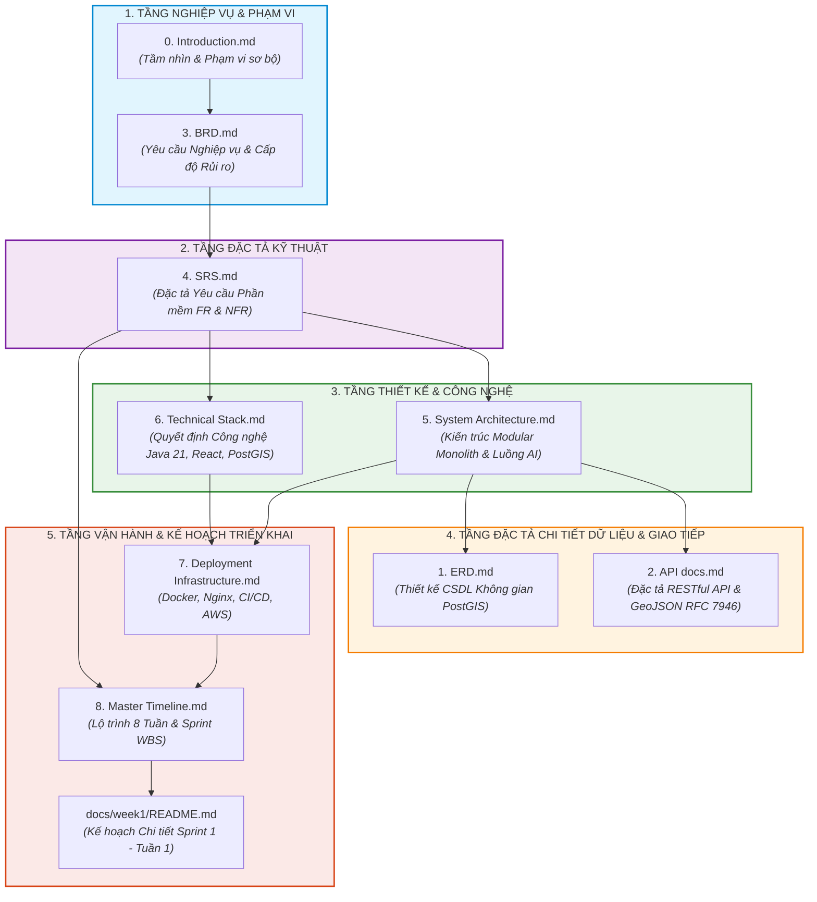
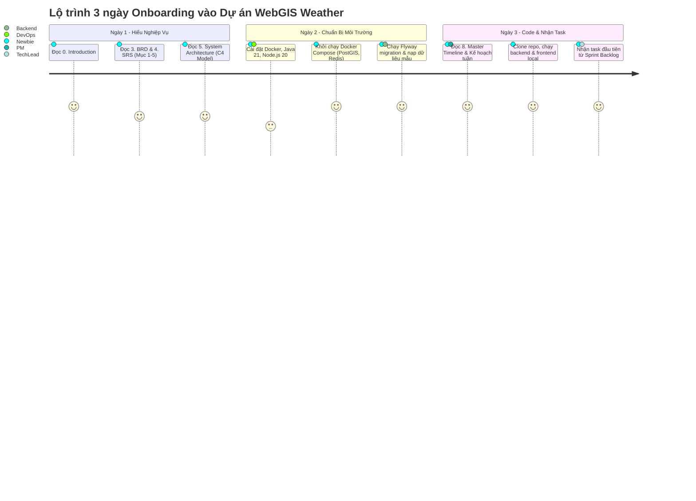
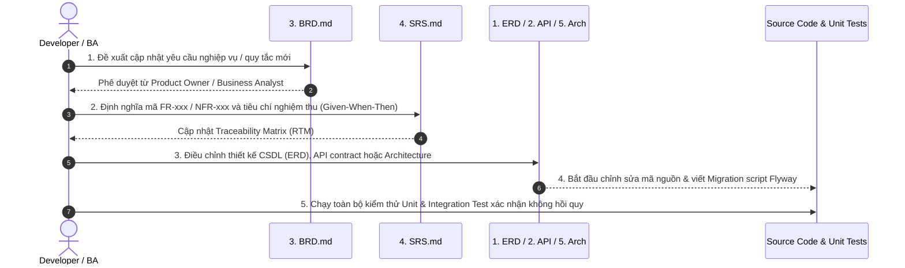

# HƯỚNG DẪN SỬ DỤNG BỘ TÀI LIỆU KỸ THUẬT & KẾ HOẠCH DỰ ÁN

## (Master Guide to Project Engineering Plans & Technical Specifications)

> **Dự án:** Hệ Thống WebGIS Giám Sát Mưa Gió Bão Tích Hợp AI Agent Cảnh Báo  
> **Tên tiếng Anh:** Vietnam Weather & Storm Monitoring WebGIS with Grounded AI Warning Agent  
> **Thư mục lưu trữ:** [`docs/The plans of project/`](file:///Users/dllv/Documents/GitHub/VNstormgis/docs/The%20plans%20of%20project)  
> **Trạng thái:** Baseline Approved (Sẵn sàng triển khai kỹ thuật)  
> **Phiên bản tài liệu:** 1.0  
> **Ngày cập nhật:** 2026-10-05

---

## 1. Tổng Quan Về Bộ Tài Liệu (Overview)

Thư mục **`The plans of project`** đóng vai trò là **Nguồn Chân Lý Duy Nhất (Single Source of Truth - SSOT)** và **Đường Cơ Sở Kỹ Thuật (Technical Baseline)** cho toàn bộ dự án _WebGIS Giám Sát Mưa Gió Bão Tích Hợp AI Agent Cảnh Báo_.

Bộ tài liệu này được thiết lập nhằm chuyển dịch một cách chặt chẽ, có cấu trúc từ **Mục tiêu Nghiệp vụ (Business Requirements)** sang **Đặc tả Yêu cầu Kỹ thuật (Software Specifications)**, **Thiết kế Kiến trúc Hệ thống (System Architecture)**, **Đặc tả Cơ sở Dữ liệu & API (ERD & RESTful API)**, cho đến **Hạ tầng Vận hành (Deployment Infrastructure)** và **Lộ trình Triển khai 8 tuần (Master Timeline)**.



### Các nguyên tắc vận hành bộ tài liệu:

1. **Tính Truy Vết Tuyệt Đối (Full Traceability):** Mọi dòng code, bảng CSDL, endpoint API và test case đều phải ánh xạ ngược về một mã định danh yêu cầu trong [4. SRS.md](file:///Users/dllv/Documents/GitHub/VNstormgis/docs/The%20plans%20of%20project/4.%20SRS.md) (`FR-xxx`, `NFR-xxx`) và mục tiêu trong [3. BRD.md](file:///Users/dllv/Documents/GitHub/VNstormgis/docs/The%20plans%20of%20project/3.%20BRD.md).
2. **Single Source of Truth:** Không giải thích hay triển khai tính năng dựa trên suy đoán cá nhân. Bất kỳ sự khác biệt nào giữa code và tài liệu phải được giải quyết bằng quy trình kiểm soát thay đổi (Change Control).
3. **Thực thi phân tầng (Separation of Concerns):** Mỗi tài liệu tập trung giải quyết trọn vẹn đúng một khía cạnh kỹ thuật, không lặp lại mã nguồn nhưng liên kết chặt chẽ với nhau thông qua chuẩn tham chiếu chéo.

---

## 2. Danh Mục & Bản Đồ Chi Tiết Các Tài Liệu (Document Map)

|  STT  | Tên Tài Liệu                | File Path                                                                                                                                               | Vai Trò Chính                     | Đối Tượng Độc Giả                 | Mục Tiêu & Trách Nhiệm Kỹ Thuật                                                                                                                        |
| :---: | :-------------------------- | :------------------------------------------------------------------------------------------------------------------------------------------------------ | :-------------------------------- | :-------------------------------- | :----------------------------------------------------------------------------------------------------------------------------------------------------- |
| **0** | **Introduction**            | [`0. Introduction.md`](file:///Users/dllv/Documents/GitHub/VNstormgis/docs/The%20plans%20of%20project/0.%20Introduction.md)                             | Project Manager / Sponsor         | Tất cả thành viên, Khách hàng     | Tuyên ngôn mục tiêu dự án, phạm vi In-scope & Out-of-scope, tổng quan bộ công nghệ áp dụng.                                                            |
| **1** | **ERD & Spatial DB**        | [`1. ERD.md`](file:///Users/dllv/Documents/GitHub/VNstormgis/docs/The%20plans%20of%20project/1.%20ERD.md)                                               | Database Architect / Backend Lead | Backend Dev, Data Engineer, DBA   | Thiết kế CSDL không gian PostgreSQL 16 + PostGIS 3.4 (9 bảng cốt lõi + Flyway), chỉ mục không gian GIST, kiểu `geometry(Point/MultiPolygon, 4326)`.    |
| **2** | **API Documentation**       | [`2. API docs.md`](file:///Users/dllv/Documents/GitHub/VNstormgis/docs/The%20plans%20of%20project/2.%20API%20docs.md)                                   | Backend Architect / Tech Lead     | Backend Dev, Frontend Dev, QA     | Hợp đồng giao tiếp RESTful API (`/api/v1`), chuẩn hóa dữ liệu bản đồ GeoJSON RFC 7946 (WGS84), ma trận mã lỗi HTTP và Validation.                      |
| **3** | **Business Requirements**   | [`3. BRD.md`](file:///Users/dllv/Documents/GitHub/VNstormgis/docs/The%20plans%20of%20project/3.%20BRD.md)                                               | Lead Business Analyst / PO        | Toàn bộ dự án, Stakeholders       | Bài toán thực tiễn tại Việt Nam, quy chuẩn thiên tai Quyết định 18/2021/QĐ-TTg, 4 Personas người dùng, luồng AS-IS vs TO-BE, tiêu chí thành công.      |
| **4** | **Software Specifications** | [`4. SRS.md`](file:///Users/dllv/Documents/GitHub/VNstormgis/docs/The%20plans%20of%20project/4.%20SRS.md)                                               | System Analyst / Architect        | Toàn bộ Kỹ sư (Dev, QA, DevOps)   | 29 chương đặc tả kỹ thuật chi tiết; ma trận yêu cầu chức năng (FR) & phi chức năng (NFR), kiểm thử chấp nhận (Given-When-Then), quy tắc an toàn PII.   |
| **5** | **System Architecture**     | [`5. System Architecture.md`](file:///Users/dllv/Documents/GitHub/VNstormgis/docs/The%20plans%20of%20project/5.%20System%20Architecture.md)             | Chief Architect / Tech Lead       | Backend Dev, Frontend Dev, DevOps | Thiết kế kiến trúc Modular Monolith (`vn.weathergis`), C4 Model, kiến trúc Factual Grounding & Prompt Guardrails AI 3 lớp, Flyway migration.           |
| **6** | **Technical Stack**         | [`6. Technical Stack.md`](file:///Users/dllv/Documents/GitHub/VNstormgis/docs/The%20plans%20of%20project/6.%20Technical%20Stack.md)                     | Senior Architect / Staff Engineer | Kỹ sư phát triển, DevOps          | Bản ghi quyết định công nghệ (ADR), lý do chọn Java 21, Spring Boot 3, React 18, Leaflet, PostGIS, Gemini, và danh mục công nghệ loại trừ.             |
| **7** | **Deployment Infra**        | [`7. Deployment Infrastructure.md`](file:///Users/dllv/Documents/GitHub/VNstormgis/docs/The%20plans%20of%20project/7.%20Deployment%20Infrastructure.md) | Cloud / Platform Architect        | DevOps, System Admin, Backend Dev | Cấu hình Docker đa tầng, Docker Compose local dev, Reverse Proxy Nginx, GitHub Actions CI/CD pipeline, chiến lược sao lưu PostGIS pg_dump.             |
| **8** | **Master Timeline**         | [`8. Master Timeline.md`](file:///Users/dllv/Documents/GitHub/VNstormgis/docs/The%20plans%20of%20project/8.%20Master%20Timeline.md)                     | Project Manager / Scrum Master    | Toàn bộ đội ngũ phát triển        | Lộ trình tổng thể 08 tuần (4 Sprints Agile 2 tuần), chi tiết bảng phân rã công việc WBS, ma trận phân quyền trách nhiệm RACI, tiêu chí nghiệm thu DoD. |

---

## 3. Hướng Dẫn Sử Dụng Theo Từng Vai Trò (Role-based Guides)

Tùy theo vị trí chuyên môn trong dự án, bạn nên tiếp cận và sử dụng bộ tài liệu theo lộ trình và mục tiêu hành động dưới đây:

### 3.1. Dành cho Tech Lead & System Architect

- **Lộ trình đọc tài liệu:**  
  [`0. Introduction.md`](file:///Users/dllv/Documents/GitHub/VNstormgis/docs/The%20plans%20of%20project/0.%20Introduction.md) $\longrightarrow$ [`3. BRD.md`](file:///Users/dllv/Documents/GitHub/VNstormgis/docs/The%20plans%20of%20project/3.%20BRD.md) $\longrightarrow$ [`4. SRS.md`](file:///Users/dllv/Documents/GitHub/VNstormgis/docs/The%20plans%20of%20project/4.%20SRS.md) $\longrightarrow$ [`5. System Architecture.md`](file:///Users/dllv/Documents/GitHub/VNstormgis/docs/The%20plans%20of%20project/5.%20System%20Architecture.md) $\longrightarrow$ [`6. Technical Stack.md`](file:///Users/dllv/Documents/GitHub/VNstormgis/docs/The%20plans%20of%20project/6.%20Technical%20Stack.md) $\longrightarrow$ [`7. Deployment Infrastructure.md`](file:///Users/dllv/Documents/GitHub/VNstormgis/docs/The%20plans%20of%20project/7.%20Deployment%20Infrastructure.md).
- **Mục tiêu & Nhiệm vụ trọng tâm:**
  - Nắm vững kiến trúc **Modular Monolith (Package-by-Feature + Clean Layering)** trong tài liệu số 5. Đảm bảo mã nguồn tuân thủ ranh giới giữa các domain: `location`, `weather`, `storm`, `threshold`, `alert`, `chat`, `sync`.
  - Giám sát việc tuân thủ các **Architecture Decision Records (ADR)** trong tài liệu số 6 và 5 (Không sử dụng Microservices phân tán, không đưa Kafka/RabbitMQ vào MVP, bắt buộc Factual Grounding khi gọi Gemini).
  - Duyệt cấu trúc Pull Request, đảm bảo không có circular dependencies giữa các package.

### 3.2. Dành cho Backend Developer (Java 21 / Spring Boot 3)

- **Lộ trình đọc tài liệu:**  
  [`1. ERD.md`](file:///Users/dllv/Documents/GitHub/VNstormgis/docs/The%20plans%20of%20project/1.%20ERD.md) $\longrightarrow$ [`2. API docs.md`](file:///Users/dllv/Documents/GitHub/VNstormgis/docs/The%20plans%20of%20project/2.%20API%20docs.md) $\longrightarrow$ [`4. SRS.md`](file:///Users/dllv/Documents/GitHub/VNstormgis/docs/The%20plans%20of%20project/4.%20SRS.md) $\longrightarrow$ [`5. System Architecture.md`](file:///Users/dllv/Documents/GitHub/VNstormgis/docs/The%20plans%20of%20project/5.%20System%20Architecture.md) $\longrightarrow$ [`7. Deployment Infrastructure.md`](file:///Users/dllv/Documents/GitHub/VNstormgis/docs/The%20plans%20of%20project/7.%20Deployment%20Infrastructure.md) (mục Docker Compose local).
- **Mục tiêu & Nhiệm vụ trọng tâm:**
  - Khởi tạo schema CSDL qua Flyway migration (`V1` đến `V5`) theo đúng DDL và chỉ mục không gian PostGIS định nghĩa tại [`1. ERD.md`](file:///Users/dllv/Documents/GitHub/VNstormgis/docs/The%20plans%20of%20project/1.%20ERD.md).
  - Viết Entity JPA sử dụng Hibernate Spatial với kiểu dữ liệu `org.locationtech.jts.geom.Point` và `MultiPolygon` (EPSG:4326).
  - Triển khai chính xác các Controller, Service, DTO, Validation rules và Exception Handling khớp 100% với hợp đồng tại [`2. API docs.md`](file:///Users/dllv/Documents/GitHub/VNstormgis/docs/The%20plans%20of%20project/2.%20API%20docs.md).
  - Hiện thực hóa Scheduled Workers (OpenWeatherMap sync 15 phút/lần, GDACS sync 30 phút/lần, Alert Evaluation 5 phút/lần) theo Mục 15 của [`5. System Architecture.md`](file:///Users/dllv/Documents/GitHub/VNstormgis/docs/The%20plans%20of%20project/5.%20System%20Architecture.md).

### 3.3. Dành cho Frontend Developer (React 18 / Leaflet / TypeScript)

- **Lộ trình đọc tài liệu:**  
  [`2. API docs.md`](file:///Users/dllv/Documents/GitHub/VNstormgis/docs/The%20plans%20of%20project/2.%20API%20docs.md) (đặc biệt Mục 1.2 & Mục 6) $\longrightarrow$ [`4. SRS.md`](file:///Users/dllv/Documents/GitHub/VNstormgis/docs/The%20plans%20of%20project/4.%20SRS.md) $\longrightarrow$ [`5. System Architecture.md`](file:///Users/dllv/Documents/GitHub/VNstormgis/docs/The%20plans%20of%20project/5.%20System%20Architecture.md) (Cây thư mục frontend).
- **Mục tiêu & Nhiệm vụ trọng tâm:**
  - Nắm vững định dạng chuẩn **RFC 7946 GeoJSON** trả về từ API backend: cấu trúc `FeatureCollection`, `Feature`, `Point`, `MultiPolygon`.
  - **Lưu ý quy ước tọa độ:** GeoJSON backend trả về theo chuẩn quốc tế `[Longitude, Latitude]` (Kinh độ trước, Vĩ độ sau). Khi đưa vào Leaflet thông qua `L.geoJSON(data)`, Leaflet tự động xử lý; nhưng khi khởi tạo Marker thủ công bằng `L.marker()`, bắt buộc dùng thứ tự `[latitude, longitude]`.
  - Triển khai 3 lớp bản đồ cốt lõi: (1) Lớp Trạm quan trắc & lượng mưa (`WeatherLayer`), (2) Lớp Cơn bão & vệt bão (`StormLayer`), (3) Vùng ảnh hưởng rủi ro (`AlertPolygonLayer`).
  - Xây dựng component chatbox tích hợp AI: Tự sinh `sessionId` (UUID v4) lưu tại `sessionStorage`, kiểm soát trạng thái chờ phản hồi và hiển thị fallback nếu kết nối gián đoạn.

### 3.4. Dành cho AI & Prompt Engineer

- **Lộ trình đọc tài liệu:**  
  [`0. Introduction.md`](file:///Users/dllv/Documents/GitHub/VNstormgis/docs/The%20plans%20of%20project/0.%20Introduction.md) $\longrightarrow$ [`3. BRD.md`](file:///Users/dllv/Documents/GitHub/VNstormgis/docs/The%20plans%20of%20project/3.%20BRD.md) $\longrightarrow$ [`4. SRS.md`](file:///Users/dllv/Documents/GitHub/VNstormgis/docs/The%20plans%20of%20project/4.%20SRS.md) (Mục 5.4, 5.5, 8, 14.10) $\longrightarrow$ [`5. System Architecture.md`](file:///Users/dllv/Documents/GitHub/VNstormgis/docs/The%20plans%20of%20project/5.%20System%20Architecture.md) (Mục 16 - AI Grounding & Anti-Hallucination).
- **Mục tiêu & Nhiệm vụ trọng tâm:**
  - Thiết kế System Prompts cho 2 tác vụ AI:
    1. **AI Agent Chủ Động (Active Generator):** Nhận context số liệu vượt ngưỡng từ DB $\rightarrow$ sinh thông điệp giải thích ngắn gọn, chuẩn mực theo Quyết định 18/2021/QĐ-TTg.
    2. **AI Agent Bị Động (Passive QA Chatbot):** Nhận câu hỏi tự nhiên $\rightarrow$ truy vấn ngữ cảnh PostGIS thực tế $\rightarrow$ trả lời đúng dữ liệu đã kiểm chứng.
  - Thiết lập **Prompt Guardrails & Anti-Hallucination:** Ngăn chặn tuyệt đối việc LLM bịa đặt số liệu không có trong DB. Nếu thông tin không có, bắt buộc trả lời từ chối theo kịch bản chuẩn.
  - Cấu hình cơ chế **Deterministic Fallback:** Nếu Gemini API timeout (> 10s) hoặc đạt giới hạn quota (HTTP 429), hệ thống tự động sinh cảnh báo dựa trên mẫu chuỗi cố định định nghĩa trong SRS, không để gián đoạn dịch vụ.

### 3.5. Dành cho DevOps & Cloud Platform Engineer

- **Lộ trình đọc tài liệu:**  
  [`6. Technical Stack.md`](file:///Users/dllv/Documents/GitHub/VNstormgis/docs/The%20plans%20of%20project/6.%20Technical%20Stack.md) $\longrightarrow$ [`7. Deployment Infrastructure.md`](file:///Users/dllv/Documents/GitHub/VNstormgis/docs/The%20plans%20of%20project/7.%20Deployment%20Infrastructure.md) $\longrightarrow$ [`8. Master Timeline.md`](file:///Users/dllv/Documents/GitHub/VNstormgis/docs/The%20plans%20of%20project/8.%20Master%20Timeline.md).
- **Mục tiêu & Nhiệm vụ trọng tâm:**
  - Cung cấp môi trường cục bộ thông qua `docker-compose.yml` (PostgreSQL 16 + PostGIS 3.4, Redis 7.2) cho toàn bộ lập trình viên.
  - Xây dựng Dockerfile tối ưu đa tầng (Multi-stage build) cho Backend (Eclipse Temurin JDK 21 Alpine) và Frontend (Node.js 20 $\rightarrow$ Nginx Alpine).
  - Thiết lập pipeline GitHub Actions CI (lint, compile, unit test với Testcontainers, build Docker image) và CD tự động triển khai lên máy chủ.
  - Cấu hình Nginx Reverse Proxy (SSL Let's Encrypt, CORS, Gzip, Rate Limiting tầng mạng) và kịch bản sao lưu CSDL PostGIS tự động hàng ngày qua Cron + AWS S3 / Rclone.

### 3.6. Dành cho QA / QC & Test Engineer

- **Lộ trình đọc tài liệu:**  
  [`3. BRD.md`](file:///Users/dllv/Documents/GitHub/VNstormgis/docs/The%20plans%20of%20project/3.%20BRD.md) $\longrightarrow$ [`4. SRS.md`](file:///Users/dllv/Documents/GitHub/VNstormgis/docs/The%20plans%20of%20project/4.%20SRS.md) (Mục 19 RTM, Mục 20 Given-When-Then, Mục 26) $\longrightarrow$ [`2. API docs.md`](file:///Users/dllv/Documents/GitHub/VNstormgis/docs/The%20plans%20of%20project/2.%20API%20docs.md).
- **Mục tiêu & Nhiệm vụ trọng tâm:**
  - Xây dựng Test Plan và Test Matrix bám sát 100% các tiêu chí chấp nhận trong [`4. SRS.md`](file:///Users/dllv/Documents/GitHub/VNstormgis/docs/The%20plans%20of%20project/4.%20SRS.md).
  - Kiểm thử chức năng (Functional Testing): Kiểm thử độ nhạy bộ ngưỡng cảnh báo, độ chính xác tọa độ hiển thị trên bản đồ số.
  - Kiểm thử phi chức năng: Tải đồng thời 500 CCU, thời gian phản hồi API < 500ms, cơ chế Rate Limiter chặn IP gửi quá số lượng request cho phép.
  - Kiểm thử an toàn thông tin: Xác minh hệ thống không lưu vết hay làm rò rỉ bất kỳ thông tin nhận dạng cá nhân (PII) nào của người dùng ẩn danh.

### 3.7. Dành cho Project Manager, Scrum Master & Product Owner

- **Lộ trình đọc tài liệu:**  
  [`0. Introduction.md`](file:///Users/dllv/Documents/GitHub/VNstormgis/docs/The%20plans%20of%20project/0.%20Introduction.md) $\longrightarrow$ [`3. BRD.md`](file:///Users/dllv/Documents/GitHub/VNstormgis/docs/The%20plans%20of%20project/3.%20BRD.md) $\longrightarrow$ [`8. Master Timeline.md`](file:///Users/dllv/Documents/GitHub/VNstormgis/docs/The%20plans%20of%20project/8.%20Master%20Timeline.md) $\longrightarrow$ Kế hoạch tuần chi tiết ([`week1/README.md`](file:///Users/dllv/Documents/GitHub/VNstormgis/docs/week1/README.md)...).
- **Mục tiêu & Nhiệm vụ trọng tâm:**
  - Giám sát tiến độ dự án qua 4 Sprints (8 tuần làm việc) theo đúng các mốc bàn giao Milestone M1 - M5 trong tài liệu số 8.
  - Quản lý phân bổ tài nguyên theo ma trận RACI, tổ chức Daily Standup, Sprint Planning và Sprint Retro.
  - Chủ động xử lý các rủi ro đã nhận diện (Rủi ro cạn hạn ngạch OpenWeatherMap/GDACS/Gemini, rủi ro trễ tiến độ tích hợp GIS).

---

## 4. Hướng Dẫn Hội Nhập Dành Cho Thành Viên Mới (Onboarding Guide)

Nếu bạn là thành viên mới vừa gia nhập dự án, hãy thực hiện theo quy trình 3 ngày chuẩn hóa sau:



### Ngày 1: Đọc & Thấu Hiểu Bức Tranh Dự Án

1. Đọc [`0. Introduction.md`](file:///Users/dllv/Documents/GitHub/VNstormgis/docs/The%20plans%20of%20project/0.%20Introduction.md) để hiểu tầm nhìn, mục tiêu và phạm vi dự án.
2. Đọc [`3. BRD.md`](file:///Users/dllv/Documents/GitHub/VNstormgis/docs/The%20plans%20of%20project/3.%20BRD.md) (Mục 2 Executive Summary, Mục 6 Personas, Mục 12 Business Rules) để nắm rõ logic phân loại rủi ro thiên tai theo Quyết định 18/2021/QĐ-TTg.
3. Đọc [`5. System Architecture.md`](file:///Users/dllv/Documents/GitHub/VNstormgis/docs/The%20plans%20of%20project/5.%20System%20Architecture.md) (Mục 4-6 về C4 Diagrams và Mục 8-9 về Domain Boundaries).

### Ngày 2: Thiết Lập Môi Trường Cục Bộ (Local Setup)

1. Cài đặt các công cụ nền tảng:
   - JDK 21 LTS (Eclipse Temurin khuyến nghị).
   - Gradle 8.x (hoặc sử dụng Gradle Wrapper `./gradlew` có sẵn trong dự án).
   - Node.js 20 LTS + npm.
   - Docker Desktop & Docker Compose v2.
   - DBeaver / pgAdmin để truy vấn CSDL không gian.
2. Khởi chạy CSDL PostGIS và Redis từ thư mục gốc thông qua Docker Compose (tham khảo [`7. Deployment Infrastructure.md`](file:///Users/dllv/Documents/GitHub/VNstormgis/docs/The%20plans%20of%20project/7.%20Deployment%20Infrastructure.md)):
   ```bash
   docker compose up -d postgres redis
   ```
3. Chạy script migration Flyway để khởi tạo toàn bộ cấu trúc bảng và dữ liệu tọa độ 63 tỉnh thành Việt Nam:
   ```bash
   cd backend && ./gradlew flywayMigrate
   ```
4. Kiểm tra kết nối CSDL và chạy truy vấn không gian mẫu:
   ```sql
   SELECT name, ST_AsText(geom) FROM locations LIMIT 5;
   ```

### Ngày 3: Chạy Ứng Dụng & Tiếp Nhận Công Việc

1. Mở file tài liệu tuần hiện tại (ví dụ: [`week1/README.md`](file:///Users/dllv/Documents/GitHub/VNstormgis/docs/week1/README.md)).
2. Đối chiếu mã Task được phân công trên Jira/GitLab Issue với mã WBS trong [`8. Master Timeline.md`](file:///Users/dllv/Documents/GitHub/VNstormgis/docs/The%20plans%20of%20project/8.%20Master%20Timeline.md).
3. Đọc kỹ đặc tả kỹ thuật tương ứng trong [`4. SRS.md`](file:///Users/dllv/Documents/GitHub/VNstormgis/docs/The%20plans%20of%20project/4.%20SRS.md), [`1. ERD.md`](file:///Users/dllv/Documents/GitHub/VNstormgis/docs/The%20plans%20of%20project/1.%20ERD.md), và [`2. API docs.md`](file:///Users/dllv/Documents/GitHub/VNstormgis/docs/The%20plans%20of%20project/2.%20API%20docs.md) trước khi viết dòng code đầu tiên.

---

## 5. Tóm Tắt Chuyên Sâu Từng Tài Liệu (Document Deep-Dives)

### 📄 0. Introduction.md

- **Mục đích:** Xác lập ranh giới dự án ban đầu.
- **Nội dung cốt lõi:**
  - **In-scope:** Bản đồ thời tiết thời gian thực (mưa, gió), hiển thị bão active, cảnh báo AI chủ động (khi số liệu vượt ngưỡng), trợ lý AI giải thích cảnh báo và trả lời câu hỏi tự nhiên.
  - **Out-of-scope:** Không tự huấn luyện mô hình ML dự báo quỹ đạo bão; không gửi SMS/Push Notification diện rộng; không làm Native Mobile App; không thay thế cơ quan khí tượng nhà nước.

### 📄 1. ERD.md (Cơ Sở Dữ Liệu Không Gian)

- **Mục đích:** Quy định toàn bộ lược đồ quan hệ và cấu trúc lưu trữ không gian địa lý.
- **Nội dung cốt lõi:**
  - Hệ quy chiếu trắc địa toàn cầu chuẩn: **WGS84 (EPSG:4326)**.
  - 9 bảng nghiệp vụ cốt lõi:
    1. `locations`: Điểm quan trắc, tọa độ trạm (`Point`), ranh giới hành chính (`MultiPolygon`).
    2. `weather_records`: Dữ liệu chuỗi thời gian (mưa mm/1h, mm/3h, tốc độ gió m/s, gió giật, độ ẩm, áp suất).
    3. `storms`: Thực thể cơn bão từ GDACS (mã hiệu quốc tế, tên bão, cấp gió bão, phân loại bão nhiệt đới/siêu bão).
    4. `storm_tracks`: Quỹ đạo di chuyển theo thời gian của tâm bão, bán kính gió mạnh R30/R50 (`geometry(Polygon)`).
    5. `alert_thresholds`: Bộ tham số cấu hình ngưỡng nguy hiểm (mưa rất to > 50mm, gió bão cấp 8 > 17.2 m/s).
    6. `alerts`: Bản ghi cảnh báo thiên tai do hệ thống phát hiện, vùng ảnh hưởng (`MultiPolygon`), nội dung do AI sinh.
    7. `chat_sessions`: Phiên hỏi đáp của người dùng với AI Agent (ẩn danh theo UUID session).
    8. `chat_messages`: Lịch sử câu hỏi người dùng và phản hồi AI kèm ngữ cảnh dữ liệu trích xuất.
    9. `data_sync_logs`: Bảng audit nhật ký đồng bộ dữ liệu thời tiết và bão bên ngoài.
  - Đánh chỉ mục không gian chuyên dụng: `CREATE INDEX idx_locations_geom ON locations USING GIST(geom);`.

### 📄 2. API docs.md (Đặc Tả RESTful API)

- **Mục đích:** Hợp đồng giao tiếp kỹ thuật giữa Frontend, Backend và AI Service.
- **Nội dung cốt lõi:**
  - Base URL chuẩn: `/api/v1`. Mặc định mã hóa UTF-8 JSON.
  - Tuân thủ tiêu chuẩn mở **RFC 7946 GeoJSON** (tương thích trực tiếp với Leaflet).
  - Phân quyền đơn giản, an toàn:
    - `ROLE-PUBLIC`: Khách vãng lai tra cứu bản đồ, bão, cảnh báo và chat AI (áp dụng Rate Limit 20 req/min/IP cho Chatbot).
    - `ROLE-ADMIN`: Quản trị hệ thống qua Bearer Token / API-Key nội bộ (cấu hình bộ ngưỡng cảnh báo, kích hoạt sync thủ công).
  - 5 nhóm endpoint chính:
    1. `/api/v1/locations/**`: Danh sách trạm, chi tiết trạm, GeoJSON bounds.
    2. `/api/v1/weather/**`: Thời tiết hiện tại thời gian thực, lịch sử quan trắc 24h.
    3. `/api/v1/storms/**`: Danh sách bão active, chi tiết quỹ đạo tâm bão và vùng ảnh hưởng.
    4. `/api/v1/alerts/**`: Cảnh báo nguy cơ cao đang có hiệu lực, bộ lọc theo tỉnh/thành.
    5. `/api/v1/chat/**`: Khởi tạo session chat, gửi câu hỏi tự nhiên cho AI Agent (`/ask`).

### 📄 3. BRD.md (Tài Liệu Yêu Cầu Nghiệp Vụ)

- **Mục đích:** Xác lập nền tảng nghiệp vụ và cơ sở pháp lý khí tượng tại Việt Nam.
- **Nội dung cốt lõi:**
  - Tuân thủ thang đo cấp gió bão Beaufort và quy chuẩn cảnh báo rủi ro thiên tai theo **Quyết định số 18/2021/QĐ-TTg của Thủ tướng Chính phủ**.
  - 4 Personas điển hình: Người dân vùng bão (Thao), Cán bộ phòng chống thiên tai cấp xã (Hùng), Tàu thuyền & ngư dân ven biển (Tuấn), Quản trị viên kỹ thuật (Hải).
  - So sánh chi tiết quy trình nghiệp vụ cũ (AS-IS: tìm kiếm rời rạc nhiều trang web, số liệu khó hiểu) sang quy trình mới (TO-BE: WebGIS trực quan một cửa + AI tự tổng hợp cảnh báo dễ hiểu).

### 📄 4. SRS.md (Đặc Tả Yêu Cầu Kỹ Thuật Phần Mềm)

- **Mục đích:** Đặc tả 100% chi tiết các hàm tính năng, quy tắc kiểm tra hợp lệ, xử lý ngoại lệ và ma trận kiểm thử.
- **Nội dung cốt lõi:**
  - Danh mục Yêu cầu chức năng: Quản lý trạm (`FR-LOC`), Đồng bộ thời tiết (`FR-WTH`), Quản lý bão (`FR-STM`), Đánh giá ngưỡng cảnh báo (`FR-ALT`), AI Agent chủ động & bị động (`FR-AGT`), Trực quan hóa WebGIS (`FR-GIS`).
  - Yêu cầu phi chức năng (NFR): Độ khả dụng 99.5%, phản hồi API bản đồ < 500ms, AI trả lời < 5s, tải đồng thời 500 người dùng trực tuyến.
  - Quy định an toàn quyền riêng tư (`NFR-PRV-001`): Nghiêm cấm thu thập Họ tên, Số điện thoại, Email hay địa chỉ nhà của người dùng công cộng.
  - 100% kịch bản kiểm thử mẫu định dạng BDD **Given - When - Then**.

### 📄 5. System Architecture.md (Kiến Trúc Hệ Thống)

- **Mục đích:** Thiết kế kiến trúc phần mềm, cấu trúc package mã nguồn và giải pháp kỹ thuật AI Grounding.
- **Nội dung cốt lõi:**
  - Mô hình phong cách: **Modular Monolith** kết hợp **Package-by-Feature** và **Clean Layering** bên trong mỗi domain.
  - Cấu trúc package chuẩn: `vn.weathergis.{common, config, security, location, weather, storm, threshold, alert, chat, sync}`.
  - Quy chuẩn phân tầng nghiêm ngặt: Controller $\rightarrow$ Service $\rightarrow$ Repository $\rightarrow$ Database. Cấm gọi chéo Repository giữa các domain khác nhau.
  - Kiến trúc chống ảo giác **AI Grounding 3 lớp**:
    1. Layer 1: Trích xuất context thực tế từ PostgreSQL/PostGIS.
    2. Layer 2: Ghép prompt với System Instruction ràng buộc nghiêm ngặt (Prompt Guardrails).
    3. Layer 3: Cơ chế **Deterministic Fallback** nếu Gemini API lỗi hoặc vượt hạn mức.

### 📄 6. Technical Stack.md (Ngăn Xếp Công Nghệ)

- **Mục đích:** Bản ghi các quyết định công nghệ và phân tích đánh đổi (Trade-offs).
- **Nội dung cốt lõi:**
  - **Backend:** Java 21 LTS + Spring Boot 3.3. Tận dụng Virtual Threads cho các tác vụ I/O blocking khi gọi OpenWeatherMap/GDACS/Gemini API.
  - **Spatial Data:** PostgreSQL 16 + PostGIS 3.4 (xử lý không gian trắc địa WGS84, truy vấn lân cận `ST_DWithin`, cắt vùng `ST_Intersects`).
  - **Frontend:** React 18 (TypeScript) + Leaflet / React-Leaflet + Vite + Tailwind CSS.
  - **AI Model:** Google Gemini API (Gemini 1.5 Flash / Gemini 2.0 Flash) — cân bằng tối ưu giữa tốc độ suy luận, chi phí và chất lượng ngôn ngữ tiếng Việt.
  - **Danh mục công nghệ KHÔNG sử dụng:** Loại bỏ Kafka/RabbitMQ (thay bằng Spring Scheduler), loại bỏ Elasticsearch (PostGIS và Postgres đã đủ cho MVP), loại bỏ Microservices phức tạp.

### 📄 7. Deployment Infrastructure.md (Hạ Tầng Vận Hành)

- **Mục đích:** Kiến trúc môi trường triển khai thực tế và kịch bản đóng gói tự động.
- **Nội dung cốt lõi:**
  - Thiết kế Containerization: Docker đa tầng tối ưu dung lượng (Backend image < 250MB, Frontend Nginx image < 35MB).
  - Cấu hình mạng Nginx Reverse Proxy: Định tuyến `/api/v1` về backend container, định tuyến `/` về frontend tĩnh, nén Gzip, cấu hình SSL tự động với Certbot.
  - Thiết lập CI/CD GitHub Actions: Tự động chạy Unit Test, Linting, Build Image và đẩy lên máy chủ qua SSH action.
  - Chiến lược Disaster Recovery & Backup: Tự động dump database PostGIS định kỳ 02:00 sáng hàng ngày và đẩy về kho lưu trữ an toàn.

### 📄 8. Master Timeline.md (Lộ Trình Tổng Thể 8 Tuần)

- **Mục đích:** Bản kế hoạch điều phối tiến độ, phân bổ nguồn lực và quản trị rủi ro bàn giao.
- **Nội dung cốt lõi:**
  - Lộ trình 8 tuần chia thành 4 Sprints 2 tuần:
    - **Sprint 1 (Tuần 1-2): Foundation & Baseline Infrastructure** (Hạ tầng, CSDL PostGIS, Khung Spring Boot, Crawl dữ liệu mẫu).
    - **Sprint 2 (Tuần 3-4): Core WebGIS & Realtime Data Engine** (Bản đồ Leaflet, Hiển thị trạm mưa, Quỹ đạo bão, RESTful API hoàn chỉnh).
    - **Sprint 3 (Tuần 5-6): Grounded AI Agent & Warning Engine** (Cảnh báo tự động, Tích hợp Gemini, Fallback tất định, Giao diện Chatbot).
    - **Sprint 4 (Tuần 7-8): Hardening, CI/CD, Deployment & Final Launch** (Kiểm thử tải, Tối ưu bảo mật, Triển khai Production, Nghiệm thu).
  - Ma trận phân quyền RACI chi tiết theo từng hạng mục công việc.

---

## 6. Ma Trận Tra Cứu Chéo Toàn Bộ Dự Án (Master Traceability Cheat Sheet)

Bảng tra cứu dưới đây giúp bất kỳ lập trình viên nào có thể ngay lập tức đối chiếu một tính năng từ yêu cầu nghiệp vụ đến file code, bảng CSDL và vị trí hiển thị trên giao diện:

| Phân Hệ Nghiệp Vụ      | Mã SRS ([4. SRS.md](file:///Users/dllv/Documents/GitHub/VNstormgis/docs/The%20plans%20of%20project/4.%20SRS.md)) | Bảng CSDL ([1. ERD.md](file:///Users/dllv/Documents/GitHub/VNstormgis/docs/The%20plans%20of%20project/1.%20ERD.md)) | RESTful API ([2. API docs.md](file:///Users/dllv/Documents/GitHub/VNstormgis/docs/The%20plans%20of%20project/2.%20API%20docs.md)) | Backend Package ([5. Arch.md](file:///Users/dllv/Documents/GitHub/VNstormgis/docs/The%20plans%20of%20project/5.%20System%20Architecture.md)) | Frontend Component                             | Sprint Triển Khai ([8. Timeline](file:///Users/dllv/Documents/GitHub/VNstormgis/docs/The%20plans%20of%20project/8.%20Master%20Timeline.md)) |
| :--------------------- | :--------------------------------------------------------------------------------------------------------------- | :------------------------------------------------------------------------------------------------------------------ | :-------------------------------------------------------------------------------------------------------------------------------- | :------------------------------------------------------------------------------------------------------------------------------------------- | :--------------------------------------------- | :-----------------------------------------------------------------------------------------------------------------------------------------: |
| **Trạm quan trắc**     | `FR-LOC-001` $\rightarrow$ `003`                                                                                 | `locations`                                                                                                         | `GET /api/v1/locations`<br/>`GET /api/v1/locations/geojson`                                                                       | `vn.weathergis.location`                                                                                                                     | `<StationMarker />`<br/>`<StationPopup />`     |                                                                Sprint 1 & 2                                                                 |
| **Dữ liệu thời tiết**  | `FR-WTH-001` $\rightarrow$ `004`                                                                                 | `weather_records`                                                                                                   | `GET /api/v1/weather/current`<br/>`GET /api/v1/weather/history`                                                                   | `vn.weathergis.weather`<br/>`vn.weathergis.sync`                                                                                             | `<WeatherLegend />`<br/>`<RainHeatmapLayer />` |                                                                Sprint 1 & 2                                                                 |
| **Giám sát bão**       | `FR-STM-001` $\rightarrow$ `004`                                                                                 | `storms`<br/>`storm_tracks`                                                                                         | `GET /api/v1/storms/active`<br/>`GET /api/v1/storms/{id}/tracks`                                                                  | `vn.weathergis.storm`<br/>`vn.weathergis.sync`                                                                                               | `<StormPath />`<br/>`<StormEyeMarker />`       |                                                                  Sprint 2                                                                   |
| **Ngưỡng & Cảnh báo**  | `FR-ALT-001` $\rightarrow$ `004`                                                                                 | `alert_thresholds`<br/>`alerts`                                                                                     | `GET /api/v1/alerts/active`<br/>`POST /api/v1/thresholds`                                                                         | `vn.weathergis.threshold`<br/>`vn.weathergis.alert`                                                                                          | `<AlertBanner />`<br/>`<AlertPolygonLayer />`  |                                                                  Sprint 3                                                                   |
| **AI Agent Chủ Động**  | `FR-AGT-001` $\rightarrow$ `003`                                                                                 | `alerts`                                                                                                            | Background Scheduler                                                                                                              | `vn.weathergis.alert.ai`<br/>`vn.weathergis.alert.fallback`                                                                                  | `<AlertDetailModal />`                         |                                                                  Sprint 3                                                                   |
| **AI Agent Hỏi - Đáp** | `FR-AGT-004` $\rightarrow$ `006`                                                                                 | `chat_sessions`<br/>`chat_messages`                                                                                 | `POST /api/v1/chat/sessions`<br/>`POST /api/v1/chat/ask`                                                                          | `vn.weathergis.chat`<br/>`vn.weathergis.chat.grounding`                                                                                      | `<AiChatDrawer />`<br/>`<ChatMessageList />`   |                                                                  Sprint 3                                                                   |
| **Hạ tầng & Vận hành** | `NFR-REL`, `NFR-SEC`                                                                                             | `flyway_schema_history`                                                                                             | `GET /actuator/health`                                                                                                            | `vn.weathergis.config`<br/>`vn.weathergis.security`                                                                                          | Nginx Proxy / Docker                           |                                                                Sprint 1 & 4                                                                 |

---

## 7. Quy Trình Quản Lý Thay Đổi & Duy Trì Tài Liệu (Change Protocol)

Để bảo vệ tính toàn vẹn của dự án, mọi sự thay đổi về yêu cầu nghiệp vụ hoặc quyết định kỹ thuật bắt buộc phải tuân thủ nghiêm ngặt quy trình 5 bước sau trước khi thực hiện viết code:



### Nguyên tắc "Bất Di Bất Dịch" Khi Code:

1. **Không code tính năng "mồ côi":** Mọi hàm logic nghiệp vụ mới đều phải tìm thấy mã yêu cầu `FR-xxx` tương ứng trong [`4. SRS.md`](file:///Users/dllv/Documents/GitHub/VNstormgis/docs/The%20plans%20of%20project/4.%20SRS.md).
2. **Không tự ý sửa schema database:** Bất kỳ thay đổi cấu trúc bảng nào phải được cập nhật vào [`1. ERD.md`](file:///Users/dllv/Documents/GitHub/VNstormgis/docs/The%20plans%20of%20project/1.%20ERD.md) trước, sau đó tạo file migration mới theo thứ tự Flyway (`V6__...sql`, `V7__...sql`), tuyệt đối không sửa đổi các file migration đã commit.
3. **Giữ API Contract ổn định:** Không được tùy tiện thêm/bớt trường trong API response mà không cập nhật [`2. API docs.md`](file:///Users/dllv/Documents/GitHub/VNstormgis/docs/The%20plans%20of%20project/2.%20API%20docs.md) và thông báo cho đội Frontend.

---

## 8. Những Lưu Ý Kỹ Thuật Trọng Yếu Cần Thuộc Lòng (Pitfalls & Gotchas)

> [!WARNING] **1. Cạm bẫy đảo ngược tọa độ Không gian (Spatial Coordinate Ordering)**
>
> - Chuẩn thế giới **GeoJSON RFC 7946** và **PostGIS** lưu trữ và trả về theo thứ tự: `[Kinh độ (Longitude), Vĩ độ (Latitude)]` (tương ứng `[X, Y]`).
> - Thư viện **Leaflet** khi nhận trực tiếp GeoJSON qua `L.geoJSON(data)` sẽ tự động nhận diện đúng. Tuy nhiên, nếu bạn khởi tạo điểm thủ công qua `L.marker([lat, lng])` hoặc `L.latLng(lat, lng)`, Leaflet yêu cầu **Vĩ độ (Latitude) đứng trước**!
> - **Giải pháp chuẩn:** Luôn kiểm tra kỹ các hàm ánh xạ giữa API DTO và Leaflet Component để tránh hiện tượng trạm quan trắc Việt Nam bị vẽ nhầm sang vùng biển Somalia.

> [!IMPORTANT] **2. Rào chắn AI Factual Grounding & Giới hạn Quota**
>
> - Không bao giờ gửi câu hỏi của người dùng trực tiếp cho Google Gemini API mà không đính kèm ngữ cảnh số liệu từ PostgreSQL/PostGIS.
> - Cấu hình chặt chẽ giới hạn token và kích hoạt cơ chế **Deterministic Fallback Template** định nghĩa trong [`4. SRS.md`](file:///Users/dllv/Documents/GitHub/VNstormgis/docs/The%20plans%20of%20project/4.%20SRS.md) nếu Gemini gặp lỗi HTTP 429 hoặc quá 10 giây không phản hồi.

> [!NOTE] **3. Kết nối với kế hoạch thực thi từng tuần**
> Thư mục này (`The plans of project`) chứa các tài liệu **Đường cơ sở cấp cao (High-Level Baseline)**. Để theo dõi và thực thi các đầu việc kỹ thuật chi tiết theo từng ngày, từng giờ của sprint hiện tại, hãy tham khảo các thư mục kế hoạch tuần tương ứng:
>
> - [`docs/week1/README.md`](file:///Users/dllv/Documents/GitHub/VNstormgis/docs/week1/README.md): Kế hoạch triển khai chi tiết Tuần 1 (Sprint 1 - Foundation & Data Baseline).

---

_Tài liệu này được biên soạn bởi Ban Kỹ Thuật Dự Án WebGIS Thời Tiết Việt Nam. Mọi thắc mắc hoặc đề xuất cải tiến xin liên hệ Tech Lead / Software Architect của dự án._
