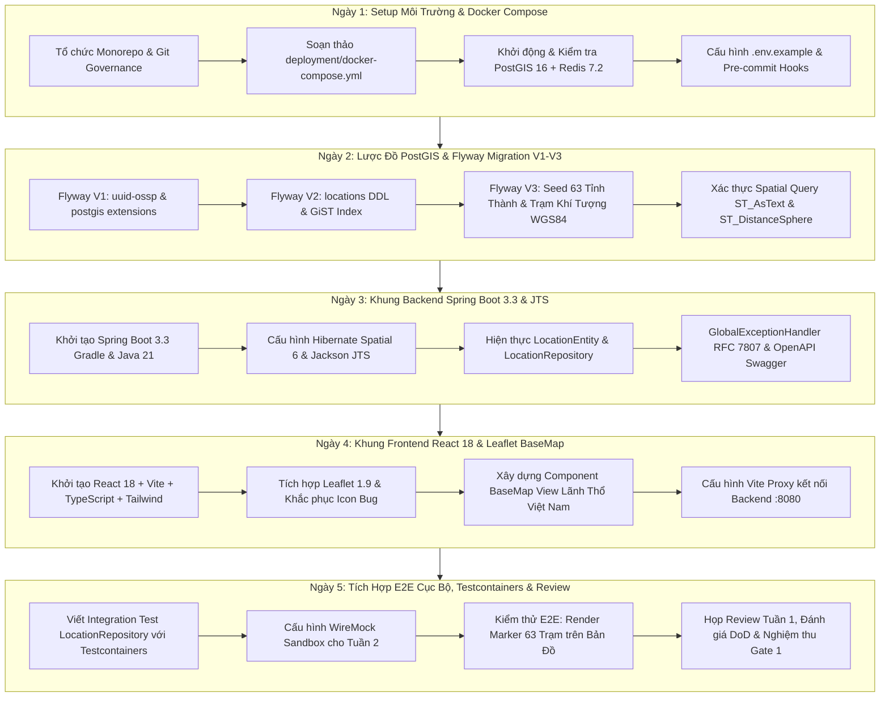

# KẾ HOẠCH TRIỂN KHAI CHI TIẾT TUẦN 1 (WEEK 1 DETAILED IMPLEMENTATION PLAN)

## Hệ Thống WebGIS Giám Sát Mưa Gió Bão Tích Hợp AI Agent Cảnh Báo

---

## Thông Tin Tài Liệu (Document Information)

- **Tên tài liệu:** Kế Hoạch Triển Khai Chi Tiết Tuần 1 (Week 1 Detailed Sprint Plan)
- **Dự án:** Vietnam Weather & Storm Monitoring WebGIS with Grounded AI Warning Agent
- **Hệ thống:** WebGIS Giám Sát Mưa Gió Bão Tích Hợp AI Agent Cảnh Báo
- **Sprint:** Sprint 1 (Tuần 1 — Tuần 2) — Giai đoạn: **Foundation & Baseline Infrastructure**
- **Khoảng thời gian:** Tuần 1 (Ngày 1 — Ngày 5)
- **Phiên bản:** 1.0 (Detailed Execution Baseline)
- **Ngày lập:** 2026-10-05
- **Tác giả:** Technical Lead / Software Architect / Scrum Master
- **Tài liệu nguồn tham chiếu cơ sở:**
  1. [0. Introduction.md](file:///Users/dllv/Documents/GitHub/VNstormgis/docs/The%20plans%20of%20project/0.%20Introduction.md) — Tổng quan phạm vi và công nghệ
  2. [1. ERD.md](file:///Users/dllv/Documents/GitHub/VNstormgis/docs/The%20plans%20of%20project/1.%20ERD.md) — Thiết kế cơ sở dữ liệu không gian 10 bảng
  3. [2. API docs.md](file:///Users/dllv/Documents/GitHub/VNstormgis/docs/The%20plans%20of%20project/2.%20API%20docs.md) — Đặc tả kỹ thuật RESTful API & GeoJSON
  4. [3. BRD.md](file:///Users/dllv/Documents/GitHub/VNstormgis/docs/The%20plans%20of%20project/3.%20BRD.md) — Yêu cầu nghiệp vụ & Tiêu chuẩn rủi ro thiên tai
  5. [4. SRS.md](file:///Users/dllv/Documents/GitHub/VNstormgis/docs/The%20plans%20of%20project/4.%20SRS.md) — Đặc tả yêu cầu phần mềm và ma trận kiểm thử
  6. [5. System Architecture.md](file:///Users/dllv/Documents/GitHub/VNstormgis/docs/The%20plans%20of%20project/5.%20System%20Architecture.md) — Thiết kế kiến trúc Modular Monolith & Luồng dữ liệu
  7. [6. Technical Stack.md](file:///Users/dllv/Documents/GitHub/VNstormgis/docs/The%20plans%20of%20project/6.%20Technical%20Stack.md) — Quyết định công nghệ Java 21, React, PostGIS, Gemini
  8. [7. Deployment Infrastructure.md](file:///Users/dllv/Documents/GitHub/VNstormgis/docs/The%20plans%20of%20project/7.%20Deployment%20Infrastructure.md) — Thiết kế hạ tầng Docker, Nginx, AWS & CI/CD
  9. [8. Master Timeline.md](file:///Users/dllv/Documents/GitHub/VNstormgis/docs/The%20plans%20of%20project/8.%20Master%20Timeline.md) — Lộ trình tổng thể 8 tuần (Master Roadmap)

---

## 1. Tổng Quan Mục Tiêu & Tuyên Ngôn Tuần 1 (Week 1 Mission & Goal)

### 1.1. Tuyên Ngôn Tuần 1 (Sprint 1 - Week 1 Statement)

> **"Thiết lập nền tảng kỹ thuật vững chắc: Một lệnh khởi động toàn bộ môi trường lập trình cục bộ (Docker Compose), hiện thực hóa mô hình dữ liệu địa không gian PostGIS nạp sẵn 63 trạm quan trắc Việt Nam, và kết nối thành công khung ứng dụng Backend Spring Boot 3.3 với bản đồ nền Leaflet trên Frontend."**

### 1.2. Mục Tiêu Trọng Tâm (Key Objectives)

1. **Repository & Governance:** Khởi tạo kiến trúc Monorepo chuẩn mực, thiết lập Git Workflow, bảo vệ nhánh `main`/`staging`, cài đặt Pre-commit hooks và quy chuẩn commit (Conventional Commits).
2. **Containerized Dev Stack:** Cấu hình file `docker-compose.yml` cho phép lập trình viên chạy duy nhất `docker compose up -d` để khởi động cơ sở dữ liệu **PostgreSQL 16 + PostGIS 3.4** và bộ nhớ đệm **Redis 7.2** có cấu hình Healthcheck và Volume lưu trữ liên tục.
3. **Spatial Database Migration:** Viết và kiểm thử thành công các migration script Flyway:
   - `V1__init_spatial_extensions.sql` (kích hoạt `uuid-ossp` và `postgis`).
   - `V2__create_location_tables.sql` (bảng `locations` với cột hình học `geom GEOMETRY(Point, 4326)` và chỉ mục không gian `idx_locations_geom` GiST).
   - `V3__seed_vietnam_locations.sql` (nạp tọa độ WGS84 chính xác của 63 tỉnh/thành phố và trạm khí tượng thủy văn trọng điểm).
4. **Backend Architecture Foundation:** Khởi tạo dự án Spring Boot 3.3.x với Java 21 LTS, cấu hình Gradle dependencies (Spring Data JPA, Hibernate Spatial 6, JTS Core, Jackson Datatype JTS, SpringDoc OpenAPI, Jakarta Validation), thiết lập phân gói Modular Monolith (`vn.weathergis.*`) và khung xử lý lỗi toàn cục theo chuẩn RFC 7807 Problem Details.
5. **Frontend WebGIS Base Map:** Khởi tạo ứng dụng React 18 với Vite, TypeScript 5.x và Tailwind CSS; tích hợp Leaflet 1.9 (`react-leaflet`); dựng component `BaseMap` định vị trung tâm lãnh thổ Việt Nam ($16.0^\circ N, 108.0^\circ E$, mức zoom mặc định 6), xử lý triệt để lỗi hiển thị icon marker trong Vite.
6. **Automated Verification:** Cấu hình Testcontainers PostGIS cho Backend JUnit 5 tests, tạo khung WireMock chuẩn bị sandbox cho việc tích hợp OpenWeatherMap và GDACS ở Tuần 2.

### 1.3. Tiêu Chí Nghiệm Thu Cổng Alpha Tuần 1 (Quality Gate 1 Alpha)

- [ ] Gõ `docker compose up -d` kích hoạt PostGIS và Redis đạt trạng thái `healthy`.
- [ ] Flyway chạy thành công migration V1, V2, V3; câu truy vấn SQL `SELECT count(*) FROM locations WHERE is_active = true` trả về đúng $63$.
- [ ] Backend Spring Boot 3.3 khởi động thành công trên cổng `8080`, truy cập được `/swagger-ui.html`.
- [ ] Frontend React nạp thành công bản đồ nền Việt Nam trên trình duyệt tại `http://localhost:5173` (hoặc `http://localhost:3000`), không có lỗi console, hỗ trợ pan/zoom mượt mà.
- [ ] Testcontainers PostGIS test chạy tự động pass 100% trong lệnh `./gradlew test`.

---

## 2. Kiến Trúc Cấu Trúc Thư Mục Monorepo Chuẩn Hóa

Dự án được tổ chức theo mô hình **Monorepo** tinh gọn, phân tách rõ ràng giữa mã nguồn Backend, Frontend, Hạ tầng triển khai (Deployment) và Tài liệu (Docs):

```text
VNstormgis/
├── .github/
│   └── workflows/
│       ├── backend-ci.yml             # Pipeline kiểm thử tự động Backend (JUnit + Testcontainers)
│       └── frontend-ci.yml            # Pipeline kiểm thử Frontend (Lint + TypeScript Build)
├── backend/
│   ├── src/
│   │   ├── main/
│   │   │   ├── java/
│   │   │   │   └── vn/
│   │   │   │       └── weathergis/
│   │   │   │           ├── WeatherGisApplication.java
│   │   │   │           ├── common/                    # Xử lý lỗi, cấu hình chung, Utility, Constants
│   │   │   │           │   ├── config/                # Jackson, OpenAPI, WebMvc, Virtual Threads
│   │   │   │           │   └── exception/             # GlobalExceptionHandler, ProblemDetail, ErrorCodes
│   │   │   │           ├── location/                  # Domain Quản lý Trạm & Tỉnh Thành (Tuần 1 trọng tâm)
│   │   │   │           │   ├── controller/            # LocationController
│   │   │   │           │   ├── dto/                   # LocationResponse, LocationGeoJsonDTO
│   │   │   │           │   ├── entity/                # LocationEntity (JTS Point)
│   │   │   │           │   ├── repository/            # LocationRepository (ST_DistanceSphere)
│   │   │   │           │   └── service/               # LocationService, LocationServiceImpl
│   │   │   │           ├── weather/                   # Domain Thời tiết (Chuẩn bị cho Tuần 2-3)
│   │   │   │           ├── storm/                     # Domain Bão (Chuẩn bị cho Tuần 2-4)
│   │   │   │           ├── alert/                     # Domain Cảnh báo & Ngưỡng (Chuẩn bị cho Tuần 5)
│   │   │   │           ├── chat/                      # Domain AI Conversational (Chuẩn bị cho Tuần 6)
│   │   │   │           └── automation/                # Schedulers & External Clients (Tuần 2)
│   │   │   └── resources/
│   │   │       ├── application.yml
│   │   │       ├── application-dev.yml
│   │   │       ├── application-test.yml
│   │   │       └── db/
│   │   │           └── migration/                     # Flyway SQL Migration Scripts
│   │   │               ├── V1__init_spatial_extensions.sql
│   │   │               ├── V2__create_location_tables.sql
│   │   │               └── V3__seed_vietnam_locations.sql
│   │   └── test/
│   │       ├── java/
│   │       │   └── vn/
│   │       │       └── weathergis/
│   │       │           ├── location/
│   │       │           │   └── repository/
│   │       │           │       └── LocationRepositoryTest.java  # Testcontainers PostGIS
│   │       │           └── TestcontainersConfiguration.java
│   │       └── resources/
│   ├── build.gradle                                   # Gradle Project Configuration (Java 21, Spring Boot 3.3)
│   ├── settings.gradle                                # Gradle Settings Configuration
│   ├── gradlew                                        # Gradle Wrapper Script (Unix)
│   ├── gradlew.bat                                    # Gradle Wrapper Script (Windows)
│   └── .gitignore
├── frontend/
│   ├── public/
│   │   ├── favicon.ico
│   │   └── markers/                                   # Custom SVG/PNG markers
│   ├── src/
│   │   ├── assets/
│   │   ├── components/
│   │   │   ├── common/                                # LoadingSpinner, ErrorBoundary, Navbar
│   │   │   ├── map/                                   # Bản đồ Leaflet (Tuần 1 trọng tâm)
│   │   │   │   ├── BaseMap.tsx
│   │   │   │   ├── MapLegend.tsx
│   │   │   │   └── LayerControl.tsx                   # Placeholder cho Tuần 2
│   │   │   ├── alerts/                                # Alert Panel placeholder
│   │   │   └── chat/                                  # Chat Drawer placeholder
│   │   ├── services/
│   │   │   ├── apiClient.ts                           # Cấu hình Axios / Fetch Base Client
│   │   │   └── locationService.ts                     # API call lấy danh sách trạm quan trắc
│   │   ├── types/
│   │   │   ├── location.types.ts                      # Interface trạm và GeoJSON
│   │   │   └── api.types.ts                           # Interface response chuẩn
│   │   ├── App.tsx
│   │   ├── main.tsx
│   │   └── index.css                                  # Tailwind CSS directives & Leaflet overrides
│   ├── index.html
│   ├── package.json
│   ├── tsconfig.json
│   ├── vite.config.ts                                 # Vite dev server + API reverse proxy
│   ├── tailwind.config.js
│   └── postcss.config.js
├── deployment/
│   ├── docker/
│   │   ├── backend/
│   │   │   └── Dockerfile                             # Multi-stage Dockerfile cho Spring Boot
│   │   └── frontend/
│   │       └── Dockerfile                             # Multi-stage Dockerfile cho React + Nginx
│   ├── nginx/
│   │   ├── nginx.conf
│   │   └── conf.d/
│   │       └── weathergis.conf
│   ├── env/
│   │   ├── .env.example                               # Mẫu cấu hình môi trường
│   │   └── .env.local                                 # File cấu hình cục bộ (git-ignored)
│   ├── docker-compose.yml                             # Local stack (PostGIS + Redis + App)
│   └── docker-compose.override.yml                    # Tùy biến mount volume khi debug
├── docs/                                              # Toàn bộ tài liệu phân tích thiết kế
│   ├── The plans of project/                          # 0. Intro đến 8. Master Timeline
│   └── week1/                                         # Kế hoạch chi tiết và nhật ký Tuần 1
│       └── README.md                                  # (Tài liệu này)
├── .editorconfig
├── .gitignore
└── README.md
```

---

## 3. Lịch Trình Công Việc Chi Tiết Theo Từng Ngày (Day-by-Day Implementation Roadmap)



---

### 3.1. Ngày 1 (Thứ Hai): Kickoff, Tổ Chức Monorepo & Dựng Môi Trường Docker Dev Stack

- **Mục tiêu ngày:** Hoàn thiện hạ tầng mã nguồn, cấu hình Git workflow, và khởi động thành công dịch vụ CSDL PostGIS 16 và Redis 7.2 thông qua Docker Compose cục bộ.

#### Chi tiết các tác vụ thực hiện:

- **Task W1-01 (Tech Lead / DevOps):**
  - Họp Sprint Planning Tuần 1 (09:00 - 10:30): Thống nhất mục tiêu tuần, phân rã User Story, cam kết tiêu chí hoàn thành (DoD).
  - Khởi tạo khung cấu trúc Monorepo (`backend/`, `frontend/`, `deployment/`, `docs/`).
  - Thiết lập Git Branching Strategy:
    - Nhánh `main`: Mã nguồn phát hành ổn định.
    - Nhánh `staging`: Môi trường kiểm thử tích hợp liên tục.
    - Nhánh tính năng: `feature/W1-xx-ten-tinh-nang`.
  - Cấu hình file `.gitignore` toàn diện (loại trừ `target/`, `node_modules/`, `.env.local`, `.idea/`, `.DS_Store`).
  - Cài đặt Pre-commit hook kiểm tra format code (Spotless cho Java, Prettier/ESLint cho TypeScript).

- **Task W1-02 (DevOps Engineer):**
  - Soạn thảo file `deployment/docker-compose.yml` gồm các service:
    - `db`: Image `postgis/postgis:16-3.4-alpine`, expose port `5432:5432`, cấu hình Volume lưu trữ `postgis_data`, gắn Healthcheck với `pg_isready`.
    - `redis`: Image `redis:7.2-alpine`, expose port `6379:6379`, cấu hình `maxmemory 128mb`, `allkeys-lru`, Volume `redis_data`, gắn Healthcheck với `redis-cli ping`.
    - `network`: `weathergis-internal-net` (Bridge network).
  - Soạn thảo `deployment/env/.env.example` và hướng dẫn copy thành `.env.local`.

- **Task W1-03 (Toàn đội ngũ):**
  - Clone repository, thực thi lệnh kiểm tra:
    ```bash
    cp deployment/env/.env.example deployment/env/.env.local
    docker compose -f deployment/docker-compose.yml up -d
    docker compose -f deployment/docker-compose.yml ps
    ```
  - Xác nhận cả 2 container `weathergis-postgres` và `weathergis-redis` đều hiển thị trạng thái `(healthy)`.
  - Kết nối thử nghiệm bằng DBeaver hoặc terminal `psql -h localhost -p 5432 -U gis_user -d weather_gis_db`.

#### Tiêu chí hoàn thành Ngày 1 (Day 1 Done Checklist):

- [ ] Repository được tổ chức đúng cấu trúc Monorepo; các quy tắc bảo vệ nhánh được kích hoạt trên GitHub/GitLab.
- [ ] Lệnh `docker compose up -d` khởi động thành công dịch vụ PostGIS 16 và Redis 7.2 không phát sinh lỗi.
- [ ] File `.env.example` cung cấp đầy đủ các biến môi trường cấu hình mặc định an toàn cho môi trường dev.

---

### 3.2. Ngày 2 (Thứ Ba): Thiết Kế & Triển Khai Lược Đồ PostGIS với Flyway (V1 — V3)

- **Mục tiêu ngày:** Xây dựng các tệp Flyway SQL di chuyển lược đồ CSDL; kích hoạt các tiện ích mở rộng không gian, tạo bảng `locations` kèm chỉ mục GiST, và nạp dữ liệu tọa độ địa lý 63 tỉnh/thành phố Việt Nam.

#### Chi tiết các tác vụ thực hiện:

- **Task W1-04 (GIS / Database Specialist):**
  - Soạn thảo migration script `backend/src/main/resources/db/migration/V1__init_spatial_extensions.sql`:
    ```sql
    CREATE EXTENSION IF NOT EXISTS "uuid-ossp";
    CREATE EXTENSION IF NOT EXISTS "postgis";
    ```
  - Kiểm tra tính hợp lệ bằng lệnh: `SELECT PostGIS_Full_Version();`.

- **Task W1-05 (GIS / Database Specialist):**
  - Soạn thảo migration script `backend/src/main/resources/db/migration/V2__create_location_tables.sql`:
    - Tạo bảng `locations` với đầy đủ các thuộc tính: `id UUID PK`, `code VARCHAR(32) UNIQUE`, `name VARCHAR(128)`, `region VARCHAR(64)`, `geom GEOMETRY(Point, 4326) NOT NULL`, `boundary GEOMETRY(MultiPolygon, 4326)`, `is_active BOOLEAN DEFAULT TRUE`, `created_at`, `updated_at`.
    - Tạo chỉ mục không gian chuyên dụng: `CREATE INDEX idx_locations_geom ON locations USING GIST (geom);`.
    - Tạo chỉ mục hỗ trợ lọc khu vực: `CREATE INDEX idx_locations_region ON locations (region);`.

- **Task W1-06 (GIS / Database Specialist & Backend Engineer):**
  - Soạn thảo migration script `backend/src/main/resources/db/migration/V3__seed_vietnam_locations.sql`:
    - Tổng hợp tọa độ trắc địa chuẩn WGS84 ($SRID=4326$, thứ tự tọa độ trong hàm PostGIS: `ST_SetSRID(ST_MakePoint(kinh_độ, vĩ_độ), 4326)`):
      - 5 Thành phố trực thuộc Trung ương: Hà Nội (`HAN` - $105.8542^\circ E, 21.0285^\circ N$), TP. Hồ Chí Minh (`SGN` - $106.6297^\circ E, 10.8231^\circ N$), Đà Nẵng (`DNG` - $108.2022^\circ E, 16.0544^\circ N$), Hải Phòng (`HPH` - $106.6881^\circ E, 20.8449^\circ N$), Cần Thơ (`VCA` - $105.7469^\circ E, 10.0452^\circ N$).
      - 58 Tỉnh thành còn lại trên toàn quốc (Quảng Ninh, Thanh Hóa, Nghệ An, Thừa Thiên Huế, Khánh Hòa, Kiên Giang...).
      - Các trạm hải đảo chiến lược: Bạch Long Vĩ, Hoàng Sa, Trường Sa, Côn Đảo, Phú Quốc.
  - Viết script kiểm thử truy vấn không gian:
    ```sql
    -- Kiểm tra số lượng bản ghi
    SELECT count(*) FROM locations;
    -- Kiểm tra trích xuất tọa độ dạng văn bản rõ WKT
    SELECT code, name, ST_AsText(geom) FROM locations WHERE code IN ('HAN', 'DNG', 'SGN');
    -- Kiểm tra tính toán khoảng cách cầu trắc địa giữa Hà Nội và Đà Nẵng (km)
    SELECT ST_DistanceSphere(
      (SELECT geom FROM locations WHERE code = 'HAN'),
      (SELECT geom FROM locations WHERE code = 'DNG')
    ) / 1000.0 AS distance_km; -- Kỳ vọng: ~625-630 km
    ```

#### Tiêu chí hoàn thành Ngày 2 (Day 2 Done Checklist):

- [x] Phần mở rộng `postgis` và `uuid-ossp` hoạt động chuẩn xác trên Docker database.
- [x] Bảng `locations` khởi tạo thành công với chỉ mục GiST không gian.
- [x] Seed data nạp đủ 63 điểm trạm quan trắc; tọa độ kinh độ/vĩ độ tuân thủ quy chuẩn WGS84 (kinh độ $102^\circ - 114^\circ E$, vĩ độ $8^\circ - 23^\circ N$).
- [x] Hàm `ST_DistanceSphere` tính toán khoảng cách địa lý chính xác, không phát sinh lỗi kiểu dữ liệu.

---

### 3.3. Ngày 3 (Thứ Tư): Khung Backend Spring Boot 3.3, Modular Architecture & Spatial JPA

- **Mục tiêu ngày:** Khởi tạo khung dự án Spring Boot 3.3 trên nền Java 21 LTS, cấu hình Hibernate Spatial 6 tích hợp JTS, cấu hình Jackson tự động tuần tự hóa hình học, và xây dựng khung xử lý ngoại lệ tập trung chuẩn RFC 7807.

#### Chi tiết các tác vụ thực hiện:

- **Task W1-07 (Backend Engineer):**
  - Khởi tạo thư mục `backend/` với file `build.gradle` và `settings.gradle`:
    - Java 21, Spring Boot 3.3.x, Gradle 8.x.
    - `spring-boot-starter-web`, `spring-boot-starter-data-jpa`, `spring-boot-starter-validation`.
    - `org.hibernate.orm:hibernate-spatial:6.5.x` (Hibernate 6 Spatial tích hợp sẵn dialect PostgreSQL).
    - `org.locationtech.jts:jts-core:1.19.0`.
    - `org.n52.jackson:jackson-datatype-jts:1.2.10` (hoặc Jackson Module JTS để serialize `org.locationtech.jts.geom.Point` ra định dạng GeoJSON `{ "type": "Point", "coordinates": [lng, lat] }`).
    - `org.postgresql:postgresql:42.7.x`.
    - `org.flywaydb:flyway-core`, `org.flywaydb:flyway-database-postgresql`.
    - `org.springdoc:springdoc-openapi-starter-webmvc-ui:2.5.x`.
    - `org.testcontainers:postgresql`, `org.testcontainers:junit-jupiter`.
  - Cấu hình Virtual Threads trong `application.yml`:
    ```yaml
    spring:
      threads:
        virtual:
          enabled: true
    ```

- **Task W1-08 (Backend Engineer):**
  - Xây dựng cấu trúc phân gói Modular Monolith theo đúng [5. System Architecture.md](file:///Users/dllv/Documents/GitHub/VNstormgis/docs/The%20plans%20of%20project/5.%20System%20Architecture.md):
    - `vn.weathergis.common.config`: Cấu hình Jackson Mapper đăng ký JtsModule, cấu hình CORS (`allowedOrigins: "http://localhost:5173", "http://localhost:3000"`).
    - `vn.weathergis.common.exception`:
      - `GlobalExceptionHandler` kế thừa `ResponseEntityExceptionHandler` sử dụng `org.springframework.http.ProblemDetail` (RFC 7807).
      - `ResourceNotFoundException`, `SpatialOperationException`, `ExternalApiException`.
  - Xây dựng Domain `location`:
    - `LocationEntity.java`: Ánh xạ các cột `id`, `code`, `name`, `region`, `geom` (`org.locationtech.jts.geom.Point`), `boundary`, `isActive`, `createdAt`, `updatedAt`.
    - `LocationRepository.java`: Kế thừa `JpaRepository<LocationEntity, UUID>`, định nghĩa native query mẫu sử dụng `ST_DistanceSphere`.
    - `LocationService.java` & `LocationServiceImpl.java`: Logic nghiệp vụ truy vấn danh sách điểm quan trắc.
    - `LocationController.java`: Endpoint `GET /api/v1/locations` (trả về danh sách trạm quan trắc chuẩn bị cho Tuần 3).

- **Task W1-09 (Backend Engineer & Tech Lead):**
  - Cấu hình file `backend/src/main/resources/application-dev.yml`:
    - Kết nối DataSource tới `jdbc:postgresql://localhost:5432/weather_gis_db`.
    - Cấu hình Flyway tự động kích hoạt `flyway.enabled=true`.
    - Kích hoạt logging SQL và OpenApi UI.
  - Chạy thử nghiệm Backend: `./gradlew bootRun --args='--spring.profiles.active=dev'`.
  - Kiểm tra Swagger UI tại `http://localhost:8080/swagger-ui.html`.

#### Tiêu chí hoàn thành Ngày 3 (Day 3 Done Checklist):

- [ ] Backend Spring Boot 3.3 biên dịch sạch (`BUILD SUCCESSFUL`), khởi chạy không xung đột thư viện.
- [ ] Flyway tự động chạy kiểm tra và đồng bộ script V1, V2, V3 khi ứng dụng start.
- [ ] Hibernate Spatial nhận diện đúng kiểu dữ liệu `Point` WGS84 mà không báo lỗi dialect.
- [ ] Truy cập được Swagger UI tại `http://localhost:8080/swagger-ui.html` và hiển thị tài liệu hóa API.

---

### 3.4. Ngày 4 (Thứ Năm): Khung Frontend React 18, Vite & Bản Đồ Nền Leaflet Việt Nam

- **Mục tiêu ngày:** Khởi tạo khung ứng dụng Frontend hiện đại bằng React 18, Vite, TypeScript và Tailwind CSS; tích hợp thư viện bản đồ số Leaflet; render thành công khung nhìn bản đồ lãnh thổ Việt Nam và giải quyết triệt để sự cố nạp biểu tượng trắc địa (Leaflet Icon bug) trong Vite.

#### Chi tiết các tác vụ thực hiện:

- **Task W1-10 (Frontend Engineer):**
  - Khởi tạo dự án Frontend bằng Vite:
    ```bash
    npm create vite@latest frontend -- --template react-ts
    cd frontend
    npm install
    npm install leaflet react-leaflet lucide-react clsx tailwind-merge axios
    npm install -D tailwindcss postcss autoprefixer @types/leaflet
    npx tailwindcss init -p
    ```
  - Cấu hình `tailwind.config.js` và `index.css` với các chỉ thị `@tailwind base; @tailwind components; @tailwind utilities;`.
  - Cấu hình file `vite.config.ts` thiết lập Reverse Proxy chuyển tiếp các request có tiền tố `/api` sang Backend chạy tại `http://localhost:8080`.

- **Task W1-11 (Frontend & GIS Engineer):**
  - Khắc phục sự cố kinh điển của Leaflet với Webpack/Vite (lỗi marker icon mặc định bị mất do đường dẫn tương đối bị hash):
    - Viết module `src/components/map/leafletConfig.ts` nhập trực tiếp hình ảnh icon từ `leaflet/dist/images/` và gán lại `L.Icon.Default.mergeOptions`.
  - Xây dựng component bản đồ nền `BaseMap.tsx`:
    - Khởi tạo component `MapContainer` với các thông số trắc địa chuẩn:
      - Tâm bản đồ (Center): `[16.047079, 108.206230]` (Khu vực trung tâm lãnh thổ Việt Nam - Đà Nẵng).
      - Zoom level khởi tạo: `6`.
      - Giới hạn zoom: `minZoom: 5`, `maxZoom: 18`.
      - Giới hạn vùng di chuyển (MaxBounds): Bao trùm toàn bộ không phận, hải phận và quần đảo Việt Nam (từ $6^\circ N, 100^\circ E$ đến $25^\circ N, 118^\circ E$).
    - Tích hợp lớp bản đồ số cơ sở (TileLayer): Nạp CartoDB Positron / Voyager hoặc OpenStreetMap chuẩn:
      - URL: `https://{s}.basemaps.cartocdn.com/rastertiles/voyager/{z}/{x}/{y}{r}.png`
      - Thuộc tính bản quyền (Attribution): `&copy; OpenStreetMap contributors &copy; CARTO`.

- **Task W1-12 (Frontend Engineer):**
  - Xây dựng khung giao diện hợp nhất (App Layout) theo định hướng kiến trúc [5. System Architecture.md](file:///Users/dllv/Documents/GitHub/VNstormgis/docs/The%20plans%20of%20project/5.%20System%20Architecture.md):
    - Thanh điều hướng trên cùng (Header / Navbar): Tên hệ thống "Vietnam WeatherGIS", đồng hồ thời gian thực, huy hiệu trạng thái hệ thống (System Status Badge: "Online / Sync Normal").
    - Khu vực trung tâm: Toàn màn hình dành cho `BaseMap` (chiếm $100vh - 64px$).
    - Bố cục cắm mốc (Placeholder components):
      - Cột bên trái: Khung điều khiển lớp bản đồ (`LayerControl` placeholder).
      - Băng ngang dưới đáy: Khung cảnh báo khẩn cấp (`AlertTicker` placeholder).
      - Góc dưới bên phải: Nút mở khung chat AI Agent (`ChatDrawer` floating trigger button).

#### Tiêu chí hoàn thành Ngày 4 (Day 4 Done Checklist):

- [x] Ứng dụng React 18 khởi chạy mượt mà với Vite tại `http://localhost:5173` (thời gian khởi động $< 300ms$).
- [x] Bản đồ Leaflet hiển thị trọn vẹn lãnh thổ Việt Nam gồm đầy đủ đất liền và các vùng biển đảo, không bị vỡ mảnh gạch (tile loading error).
- [x] Thao tác cuộn chuột (zoom) và rê chuột (pan) phản hồi nhanh, không lag giật; không có bất kỳ thông báo lỗi hoặc cảnh báo nào trong Browser Console.
- [x] Marker icon mặc định của Leaflet hiển thị đúng đồ họa (không bị icon rỗng hoặc lỗi 404 image).

---

### 3.5. Ngày 5 (Thứ Sáu): Tích Hợp E2E Cục Bộ, Testcontainers PostGIS, Review & Nghiệm Thu Gate 1

- **Mục tiêu ngày:** Hoàn thiện kiểm thử tích hợp tự động với Testcontainers PostGIS, thiết lập WireMock sandbox cho Tuần 2, thực hiện kết nối đầu cuối sơ bộ (E2E Smoke Test) và tổ chức họp đánh giá chất lượng bàn giao Tuần 1.

#### Chi tiết các tác vụ thực hiện:

- **Task W1-13 (QA / DevOps & Backend Engineer):**
  - Xây dựng bài kiểm thử tích hợp `LocationRepositoryTest.java`:
    - Sử dụng Testcontainers để tự động kéo image `postgis/postgis:16-3.4-alpine`.
    - Khởi tạo container PostGIS tạm thời và tự động chạy toàn bộ migration Flyway V1, V2, V3.
    - Kiểm thử: Query tìm trạm theo mã (`findByCode("HAN")`), kiểm tra tọa độ hình học JTS `Point`, và kiểm thử native query `ST_DistanceSphere`.
    - Bảo đảm kiểm thử chạy độc lập hoàn toàn, không phụ thuộc vào trạng thái database local.
  - Cấu hình dependency `wiremock-standalone` trong `backend/build.gradle` làm môi trường mock sandbox phục vụ phát triển Ingestion Client (OpenWeatherMap & GDACS) ở Tuần 2.

- **Task W1-14 (Frontend & Backend Engineer):**
  - Thực hiện kết nối thử nghiệm E2E (End-to-End Smoke Test):
    - Frontend gọi `GET /api/v1/locations` qua Vite Proxy.
    - Backend truy vấn bảng `locations` từ PostGIS và trả về danh sách 63 trạm.
    - Frontend render các điểm trạm này thành các vòng tròn đánh dấu (CircleMarker) hoặc Marker chuẩn trên bản đồ Leaflet.
    - Click vào marker tại Hà Nội hiển thị popup thông tin: `Hà Nội (HAN) - Khu vực: Bắc Bộ`.

- **Task W1-15 (Tech Lead, Product Owner & Toàn đội ngũ):**
  - Tổ chức buổi họp **Sprint 1 — Weekly Review & Demo (16:00 - 17:30)**:
    - Trình diễn thực tế: Chạy lệnh `docker compose up -d` từ trạng thái trắng tinh, khởi động backend, frontend và mở trình duyệt xem bản đồ số hiển thị 63 điểm trạm.
    - Chạy lệnh `./gradlew test` trên terminal: Toàn bộ bài Unit & Integration tests đều màu xanh (Pass 100%).
    - Rà soát ma trận tiêu chí chấp nhận Cổng Alpha Tuần 1 (Quality Gate 1 Alpha).
    - Phổ biến kế hoạch và giao nhiệm vụ chi tiết cho **Tuần 2: Xây dựng Ingestion Engine nạp dữ liệu OWM & GDACS**.

#### Tiêu chí hoàn thành Ngày 5 (Day 5 Done Checklist):

- [x] Lớp kiểm thử Testcontainers chạy độc lập, tự động dựng DB PostGIS, áp dụng migration và pass 100%.
- [x] Luồng E2E cơ bản hoàn tất: Dữ liệu từ PostGIS đi qua Spring Boot JPA, chuyển đổi JSON/GeoJSON và render trực quan lên bản đồ React Leaflet.
- [x] Biên bản nghiệm thu Tuần 1 (Weekly Sign-off) được Tech Lead và Product Owner ký duyệt.

---

## 4. Bảng Ma Trận Phân Rã Nhiệm Vụ, Nỗ Lực & RACI (Work Breakdown Structure & Effort)

| Mã Task   | Tên Nhiệm Vụ                                                | Phụ Trách Chính (R) |  Hỗ Trợ (C/I)  | Phê Duyệt (A) | Điểm (SP) | Giờ Ước Tính | Đầu Vào Cần Thiết                                                                                                                              | Sản Phẩm Bàn Giao (Deliverables)                        |
| :-------- | :---------------------------------------------------------- | :-----------------: | :------------: | :-----------: | :-------: | :----------: | :--------------------------------------------------------------------------------------------------------------------------------------------- | :------------------------------------------------------ |
| **W1-01** | Tổ chức Monorepo, Git Workflow & Pre-commit Hooks           |      Tech Lead      | DevOps, BE, FE |   Tech Lead   |   **2**   |      4h      | Git repo, Quy chuẩn coding                                                                                                                     | Cấu trúc thư mục Monorepo, hooks, `.gitignore`          |
| **W1-02** | Xây dựng `deployment/docker-compose.yml` (PostGIS + Redis)  |       DevOps        |    GIS, BE     |   Tech Lead   |   **3**   |      6h      | [7. Deployment Sec 8](file:///Users/dllv/Documents/GitHub/VNstormgis/docs/The%20plans%20of%20project/7.%20Deployment%20Infrastructure.md#L502) | `docker-compose.yml`, `.env.example`, healthchecks      |
| **W1-03** | Khởi động & Kiểm định Docker Local Stack                    |      All Team       |     DevOps     |   Tech Lead   |   **1**   |      2h      | W1-02 output                                                                                                                                   | Môi trường PostGIS & Redis healthy trên máy dev         |
| **W1-04** | Flyway V1: Khởi tạo phần mở rộng PostGIS & UUID             |      GIS / DB       |       BE       |   Tech Lead   |   **1**   |      2h      | [1. ERD Sec 5](file:///Users/dllv/Documents/GitHub/VNstormgis/docs/The%20plans%20of%20project/1.%20ERD.md#L351)                                | `V1__init_spatial_extensions.sql`                       |
| **W1-05** | Flyway V2: DDL bảng `locations` & Chỉ mục GiST              |      GIS / DB       |       BE       |   Tech Lead   |   **2**   |      4h      | [1. ERD Sec 2.1](file:///Users/dllv/Documents/GitHub/VNstormgis/docs/The%20plans%20of%20project/1.%20ERD.md#L142)                              | `V2__create_location_tables.sql` kèm index GiST         |
| **W1-06** | Flyway V3: Seed 63 Tỉnh Thành & Trạm Khí Tượng WGS84        |      GIS / DB       |       BE       |   Tech Lead   |   **3**   |      8h      | Tọa độ địa lý Việt Nam                                                                                                                         | `V3__seed_vietnam_locations.sql` đầy đủ 63 điểm         |
| **W1-07** | Khởi tạo Spring Boot 3.3 Gradle, Java 21, Hibernate Spatial |     Backend Eng     |   Tech Lead    |   Tech Lead   |   **3**   |      6h      | [6. Tech Stack Sec 3](file:///Users/dllv/Documents/GitHub/VNstormgis/docs/The%20plans%20of%20project/6.%20Technical%20Stack.md)                | `backend/build.gradle`, cấu hình Virtual Threads        |
| **W1-08** | Hiện thực Domain `location` & Global Exception RFC 7807     |     Backend Eng     | GIS, Tech Lead |   Tech Lead   |   **5**   |     10h      | W1-05, W1-07                                                                                                                                   | `LocationEntity`, `Repository`, `Controller`, Exception |
| **W1-09** | Cấu hình `application-dev.yml` & Tích hợp SpringDoc OpenAPI |     Backend Eng     |     DevOps     |   Tech Lead   |   **2**   |      4h      | W1-07, W1-08                                                                                                                                   | `application-dev.yml`, Swagger UI `/swagger-ui.html`    |
| **W1-10** | Khởi tạo React 18, Vite, TypeScript, Tailwind CSS           |    Frontend Eng     |   Tech Lead    |   Tech Lead   |   **2**   |      4h      | [6. Tech Stack Sec 6](file:///Users/dllv/Documents/GitHub/VNstormgis/docs/The%20plans%20of%20project/6.%20Technical%20Stack.md)                | Khung Frontend, Tailwind, `vite.config.ts` proxy        |
| **W1-11** | Tích hợp Leaflet 1.9 & Xử lý Leaflet Icon Bug               |    Frontend Eng     |      GIS       |   Tech Lead   |   **3**   |      6h      | Leaflet docs                                                                                                                                   | `leafletConfig.ts`, icon assets chuẩn hóa               |
| **W1-12** | Dựng Component `BaseMap` Lãnh thổ Việt Nam & App Layout     |    Frontend Eng     |      GIS       |   Tech Lead   |   **3**   |      6h      | W1-10, W1-11                                                                                                                                   | `BaseMap.tsx` (Center VN, Zoom 6), Layout chuẩn         |
| **W1-13** | Viết Integration Test với Testcontainers PostGIS & WireMock |     QA / DevOps     |       BE       |   Tech Lead   |   **3**   |      8h      | W1-08, Docker                                                                                                                                  | `LocationRepositoryTest.java` tự động chạy Pass         |
| **W1-14** | Kết nối Smoke Test E2E (Render 63 Trạm lên Leaflet)         |       BE & FE       |   Tech Lead    |   Tech Lead   |   **2**   |      4h      | W1-08, W1-12                                                                                                                                   | Luồng tích hợp hiển thị 63 marker trên map              |
| **W1-15** | Họp Demo Tuần 1, Rà soát DoD & Nghiệm thu Gate 1 Alpha      |      All Team       | PO, Architect  |   Tech Lead   |   **1**   |      2h      | Toàn bộ kết quả W1                                                                                                                             | Báo cáo nghiệm thu Alpha Gate 1, Sẵn sàng Tuần 2        |
| **TỔNG**  | **Tuần 1 (5 Ngày Làm Việc)**                                |          —          |       —        |       —       | **34 SP** |   **76h**    | —                                                                                                                                              | **100% Mục Tiêu Tuần 1 Hoàn Thành**                     |

---

## 5. Đặc Tả Kỹ Thuật & Bộ Mã Nguồn Mẫu Chuẩn Bị Sẵn (Implementation Blueprints)

Phần này cung cấp các đoạn mã nguồn và cấu hình kỹ thuật chuẩn xác, đã được rà soát cú pháp và tương thích 100% với phiên bản công nghệ lựa chọn, giúp các kỹ sư triển khai ngay mà không gặp lỗi cấu hình:

### 5.1. File Cấu Hình Docker Compose Dev (`deployment/docker-compose.yml`)

```yaml
version: "3.8"

services:
  # =======================================================
  # 1. SPATIAL DATABASE: PostgreSQL 16 + PostGIS 3.4
  # =======================================================
  db:
    image: postgis/postgis:16-3.4-alpine
    container_name: weathergis-postgres
    restart: unless-stopped
    environment:
      POSTGRES_DB: ${DB_NAME:-weather_gis_db}
      POSTGRES_USER: ${DB_USERNAME:-gis_user}
      POSTGRES_PASSWORD: ${DB_PASSWORD:-gis_password_secret}
      PGDATA: /var/lib/postgresql/data/pgdata
    ports:
      - "5432:5432"
    volumes:
      - postgis_data:/var/lib/postgresql/data
    networks:
      - weathergis-internal-net
    healthcheck:
      test: ["CMD-SHELL", "pg_isready -U ${DB_USERNAME:-gis_user} -d ${DB_NAME:-weather_gis_db}"]
      interval: 10s
      timeout: 5s
      retries: 5
      start_period: 15s

  # =======================================================
  # 2. DISTRIBUTED CACHE: Redis 7.2
  # =======================================================
  redis:
    image: redis:7.2-alpine
    container_name: weathergis-redis
    restart: unless-stopped
    command: >
      redis-server 
      --maxmemory 128mb 
      --maxmemory-policy allkeys-lru 
      --appendonly yes
    ports:
      - "6379:6379"
    volumes:
      - redis_data:/data
    networks:
      - weathergis-internal-net
    healthcheck:
      test: ["CMD", "redis-cli", "ping"]
      interval: 10s
      timeout: 3s
      retries: 3

volumes:
  postgis_data:
    driver: local
  redis_data:
    driver: local

networks:
  weathergis-internal-net:
    driver: bridge
```

---

### 5.2. Các Tệp Flyway Migration (V1, V2, V3)

#### File `backend/src/main/resources/db/migration/V1__init_spatial_extensions.sql`:

```sql
-- Kích hoạt tiện ích tạo UUID và phần mở rộng địa không gian PostGIS
CREATE EXTENSION IF NOT EXISTS "uuid-ossp";
CREATE EXTENSION IF NOT EXISTS "postgis";
```

#### File `backend/src/main/resources/db/migration/V2__create_location_tables.sql`:

```sql
-- Tạo bảng quản lý điểm/trạm quan trắc địa lý
CREATE TABLE locations (
    id UUID PRIMARY KEY DEFAULT uuid_generate_v4(),
    code VARCHAR(32) NOT NULL UNIQUE,
    name VARCHAR(128) NOT NULL,
    region VARCHAR(64) NOT NULL,
    geom GEOMETRY(Point, 4326) NOT NULL,
    boundary GEOMETRY(MultiPolygon, 4326),
    is_active BOOLEAN NOT NULL DEFAULT TRUE,
    created_at TIMESTAMPTZ NOT NULL DEFAULT CURRENT_TIMESTAMP,
    updated_at TIMESTAMPTZ NOT NULL DEFAULT CURRENT_TIMESTAMP
);

-- Chỉ mục không gian GiST tăng tốc tìm kiếm trắc địa
CREATE INDEX idx_locations_geom ON locations USING GIST (geom);
CREATE INDEX idx_locations_region ON locations (region);
CREATE INDEX idx_locations_code ON locations (code);
```

#### File `backend/src/main/resources/db/migration/V3__seed_vietnam_locations.sql`:

```sql
-- Nạp sẵn danh mục 63 trạm quan trắc/tỉnh thành phố Việt Nam kèm các trạm hải đảo trọng yếu
-- Tọa độ chuẩn WGS84: ST_SetSRID(ST_MakePoint(Kinh_Độ_E, Vĩ_Độ_N), 4326)

INSERT INTO locations (code, name, region, geom, is_active) VALUES
-- 1. Các Đô thị Trực thuộc Trung ương & Cực Trọng Điểm
('HAN', 'Hà Nội', 'Bắc Bộ', ST_SetSRID(ST_MakePoint(105.8542, 21.0285), 4326), true),
('HPH', 'Hải Phòng', 'Bắc Bộ', ST_SetSRID(ST_MakePoint(106.6881, 20.8449), 4326), true),
('DNG', 'Đà Nẵng', 'Trung Bộ', ST_SetSRID(ST_MakePoint(108.2022, 16.0544), 4326), true),
('SGN', 'TP. Hồ Chí Minh', 'Nam Bộ', ST_SetSRID(ST_MakePoint(106.6297, 10.8231), 4326), true),
('VCA', 'Cần Thơ', 'Nam Bộ', ST_SetSRID(ST_MakePoint(105.7469, 10.0452), 4326), true),

-- 2. Vùng Đồng Bằng & Duyên Hải Bắc Bộ (Ven Biển Thường Chịu Ảnh Hưởng Bão)
('QNH', 'Quảng Ninh', 'Bắc Bộ', ST_SetSRID(ST_MakePoint(107.0433, 20.9505), 4326), true),
('THB', 'Thái Bình', 'Bắc Bộ', ST_SetSRID(ST_MakePoint(106.3366, 20.4463), 4326), true),
('NDH', 'Nam Định', 'Bắc Bộ', ST_SetSRID(ST_MakePoint(106.1683, 20.4375), 4326), true),
('NBH', 'Ninh Bình', 'Bắc Bộ', ST_SetSRID(ST_MakePoint(105.9745, 20.2506), 4326), true),
('HDG', 'Hải Dương', 'Bắc Bộ', ST_SetSRID(ST_MakePoint(106.3161, 20.9372), 4326), true),
('HYN', 'Hưng Yên', 'Bắc Bộ', ST_SetSRID(ST_MakePoint(106.0511, 20.6461), 4326), true),
('BNH', 'Bắc Ninh', 'Bắc Bộ', ST_SetSRID(ST_MakePoint(106.0754, 21.1861), 4326), true),
('VPC', 'Vĩnh Phúc', 'Bắc Bộ', ST_SetSRID(ST_MakePoint(105.5969, 21.3090), 4326), true),
('HNM', 'Hà Nam', 'Bắc Bộ', ST_SetSRID(ST_MakePoint(105.9229, 20.5453), 4326), true),

-- 3. Vùng Trung Du & Miền Núi Phía Bắc (Khu Vực Nguy Cơ Cao Về Mưa Lớn, Sạt Lở Lũ Quét)
('LCI', 'Lào Cai', 'Bắc Bộ', ST_SetSRID(ST_MakePoint(103.9757, 22.4856), 4326), true),
('YBI', 'Yên Bái', 'Bắc Bộ', ST_SetSRID(ST_MakePoint(104.8954, 21.7168), 4326), true),
('HGG', 'Hà Giang', 'Bắc Bộ', ST_SetSRID(ST_MakePoint(104.9784, 22.8233), 4326), true),
('CBG', 'Cao Bằng', 'Bắc Bộ', ST_SetSRID(ST_MakePoint(106.2574, 22.6664), 4326), true),
('LSN', 'Lạng Sơn', 'Bắc Bộ', ST_SetSRID(ST_MakePoint(106.7615, 21.8537), 4326), true),
('TNN', 'Thái Nguyên', 'Bắc Bộ', ST_SetSRID(ST_MakePoint(105.8442, 21.5942), 4326), true),
('BKG', 'Bắc Kạn', 'Bắc Bộ', ST_SetSRID(ST_MakePoint(105.8348, 22.1470), 4326), true),
('TQG', 'Tuyên Quang', 'Bắc Bộ', ST_SetSRID(ST_MakePoint(105.2144, 21.8234), 4326), true),
('PTO', 'Phú Thọ', 'Bắc Bộ', ST_SetSRID(ST_MakePoint(105.2149, 21.3228), 4326), true),
('BGG', 'Bắc Giang', 'Bắc Bộ', ST_SetSRID(ST_MakePoint(106.1946, 21.2731), 4326), true),
('DBN', 'Điện Biên', 'Bắc Bộ', ST_SetSRID(ST_MakePoint(103.0168, 21.3860), 4326), true),
('LCU', 'Lai Châu', 'Bắc Bộ', ST_SetSRID(ST_MakePoint(103.4684, 22.3964), 4326), true),
('SLA', 'Sơn La', 'Bắc Bộ', ST_SetSRID(ST_MakePoint(103.9148, 21.3283), 4326), true),
('HBH', 'Hòa Bình', 'Bắc Bộ', ST_SetSRID(ST_MakePoint(105.3376, 20.8164), 4326), true),

-- 4. Vùng Bắc Trung Bộ (Vùng Trọng Tâm Hứng Chịu Bão Đổ Bộ Trực Tiếp Hàng Năm)
('THA', 'Thanh Hóa', 'Bắc Trung Bộ', ST_SetSRID(ST_MakePoint(105.7850, 19.8077), 4326), true),
('NAN', 'Nghệ An', 'Bắc Trung Bộ', ST_SetSRID(ST_MakePoint(105.6813, 18.6734), 4326), true),
('HTH', 'Hà Tĩnh', 'Bắc Trung Bộ', ST_SetSRID(ST_MakePoint(105.9057, 18.3435), 4326), true),
('QBH', 'Quảng Bình', 'Bắc Trung Bộ', ST_SetSRID(ST_MakePoint(106.6225, 17.4764), 4326), true),
('QTI', 'Quảng Trị', 'Bắc Trung Bộ', ST_SetSRID(ST_MakePoint(107.1854, 16.8163), 4326), true),
('HUE', 'Thừa Thiên Huế', 'Bắc Trung Bộ', ST_SetSRID(ST_MakePoint(107.5905, 16.4637), 4326), true),

-- 5. Vùng Duyên Hải Nam Trung Bộ
('QNM', 'Quảng Nam', 'Nam Trung Bộ', ST_SetSRID(ST_MakePoint(108.3380, 15.5736), 4326), true),
('QNG', 'Quảng Ngãi', 'Nam Trung Bộ', ST_SetSRID(ST_MakePoint(108.7961, 15.1205), 4326), true),
('BDH', 'Bình Định', 'Nam Trung Bộ', ST_SetSRID(ST_MakePoint(109.2197, 13.7830), 4326), true),
('PYN', 'Phú Yên', 'Nam Trung Bộ', ST_SetSRID(ST_MakePoint(109.3150, 13.0882), 4326), true),
('KHA', 'Khánh Hòa', 'Nam Trung Bộ', ST_SetSRID(ST_MakePoint(109.1967, 12.2388), 4326), true),
('NTH', 'Ninh Thuận', 'Nam Trung Bộ', ST_SetSRID(ST_MakePoint(108.9882, 11.5658), 4326), true),
('BTH', 'Bình Thuận', 'Nam Trung Bộ', ST_SetSRID(ST_MakePoint(108.1021, 10.9333), 4326), true),

-- 6. Vùng Tây Nguyên
('KTM', 'Kon Tum', 'Tây Nguyên', ST_SetSRID(ST_MakePoint(108.0076, 14.3497), 4326), true),
('GLI', 'Gia Lai', 'Tây Nguyên', ST_SetSRID(ST_MakePoint(108.0005, 13.9833), 4326), true),
('DLK', 'Đắk Lắk', 'Tây Nguyên', ST_SetSRID(ST_MakePoint(108.0383, 12.6667), 4326), true),
('DKN', 'Đắk Nông', 'Tây Nguyên', ST_SetSRID(ST_MakePoint(107.6876, 12.0039), 4326), true),
('LDG', 'Lâm Đồng', 'Tây Nguyên', ST_SetSRID(ST_MakePoint(108.4583, 11.9404), 4326), true),

-- 7. Vùng Đông Nam Bộ
('BDG', 'Bình Dương', 'Nam Bộ', ST_SetSRID(ST_MakePoint(106.6661, 11.0064), 4326), true),
('DNI', 'Đồng Nai', 'Nam Bộ', ST_SetSRID(ST_MakePoint(106.8427, 10.9460), 4326), true),
('VTU', 'Bà Rịa - Vũng Tàu', 'Nam Bộ', ST_SetSRID(ST_MakePoint(107.0843, 10.3460), 4326), true),
('TNH', 'Tây Ninh', 'Nam Bộ', ST_SetSRID(ST_MakePoint(106.1098, 11.3104), 4326), true),
('BPC', 'Bình Phước', 'Nam Bộ', ST_SetSRID(ST_MakePoint(106.8766, 11.7511), 4326), true),

-- 8. Vùng Đồng Bằng Sông Cửu Long (Tây Nam Bộ)
('LAN', 'Long An', 'Nam Bộ', ST_SetSRID(ST_MakePoint(106.4134, 10.5362), 4326), true),
('TGG', 'Tiền Giang', 'Nam Bộ', ST_SetSRID(ST_MakePoint(106.3639, 10.3544), 4326), true),
('BTE', 'Bến Tre', 'Nam Bộ', ST_SetSRID(ST_MakePoint(106.3759, 10.2433), 4326), true),
('TVH', 'Trà Vinh', 'Nam Bộ', ST_SetSRID(ST_MakePoint(106.3458, 9.9347), 4326), true),
('VLG', 'Vĩnh Long', 'Nam Bộ', ST_SetSRID(ST_MakePoint(105.9722, 10.2537), 4326), true),
('DTP', 'Đồng Tháp', 'Nam Bộ', ST_SetSRID(ST_MakePoint(105.6337, 10.4578), 4326), true),
('AGG', 'An Giang', 'Nam Bộ', ST_SetSRID(ST_MakePoint(105.1259, 10.3891), 4326), true),
('KGG', 'Kiên Giang', 'Nam Bộ', ST_SetSRID(ST_MakePoint(105.0809, 10.0125), 4326), true),
('HUG', 'Hậu Giang', 'Nam Bộ', ST_SetSRID(ST_MakePoint(105.4707, 9.7844), 4326), true),
('STG', 'Sóc Trăng', 'Nam Bộ', ST_SetSRID(ST_MakePoint(105.9744, 9.6033), 4326), true),
('BLU', 'Bạc Liêu', 'Nam Bộ', ST_SetSRID(ST_MakePoint(105.7244, 9.2941), 4326), true),
('CMU', 'Cà Mau', 'Nam Bộ', ST_SetSRID(ST_MakePoint(105.1500, 9.1769), 4326), true),

-- 9. Các Đảo & Quần Đảo Tiền Tiêu Trọng Yếu Của Tổ Quốc (Theo Dõi Bão Xa Ngoài Biển Đông)
('BLV', 'Đảo Bạch Long Vĩ', 'Biển Đông', ST_SetSRID(ST_MakePoint(107.7289, 20.1333), 4326), true),
('HSA', 'Quần đảo Hoàng Sa', 'Biển Đông', ST_SetSRID(ST_MakePoint(111.6000, 16.5000), 4326), true),
('TSA', 'Quần đảo Trường Sa', 'Biển Đông', ST_SetSRID(ST_MakePoint(114.3667, 8.6500), 4326), true),
('CDO', 'Côn Đảo', 'Biển Đông', ST_SetSRID(ST_MakePoint(106.6080, 8.6833), 4326), true),
('PQU', 'Đảo Phú Quốc', 'Biển Tây Nam', ST_SetSRID(ST_MakePoint(103.9667, 10.2833), 4326), true);
```

---

### 5.3. Cấu Hình Backend Gradle (`settings.gradle` & `build.gradle`) & `application-dev.yml`

#### Tệp `backend/settings.gradle`:

```groovy
rootProject.name = 'weathergis-backend'
```

#### Tệp `backend/build.gradle`:

```groovy
plugins {
    id 'java'
    id 'org.springframework.boot' version '3.3.4'
    id 'io.spring.dependency-management' version '1.1.6'
}

group = 'vn.weathergis'
version = '1.0.0-SNAPSHOT'
description = 'Vietnam Weather & Storm Monitoring WebGIS Backend'

java {
    toolchain {
        languageVersion = JavaLanguageVersion.of(21)
    }
}

repositories {
    mavenCentral()
}

ext {
    set('jtsVersion', '1.19.0')
    set('jacksonJtsVersion', '1.2.10')
    set('springdocVersion', '2.6.0')
    set('testcontainersVersion', '1.20.1')
    set('wiremockVersion', '3.9.1')
}

dependencies {
    // Spring Boot Starters
    implementation 'org.springframework.boot:spring-boot-starter-web'
    implementation 'org.springframework.boot:spring-boot-starter-data-jpa'
    implementation 'org.springframework.boot:spring-boot-starter-validation'
    implementation 'org.springframework.boot:spring-boot-starter-data-redis'

    // Spatial & GIS Database (Hibernate Spatial 6 + JTS)
    implementation 'org.hibernate.orm:hibernate-spatial'
    implementation "org.locationtech.jts:jts-core:${jtsVersion}"
    implementation "org.n52.jackson:jackson-datatype-jts:${jacksonJtsVersion}"

    // Database Driver & Flyway Migration
    runtimeOnly 'org.postgresql:postgresql'
    implementation 'org.flywaydb:flyway-core'
    implementation 'org.flywaydb:flyway-database-postgresql'

    // OpenAPI 3 / Swagger Documentation
    implementation "org.springdoc:springdoc-openapi-starter-webmvc-ui:${springdocVersion}"

    // Testing & Testcontainers
    testImplementation 'org.springframework.boot:spring-boot-starter-test'
    testImplementation 'org.testcontainers:junit-jupiter'
    testImplementation 'org.testcontainers:postgresql'
    testImplementation "org.wiremock:wiremock-standalone:${wiremockVersion}"
    testRuntimeOnly 'org.junit.platform:junit-platform-launcher'
}

dependencyManagement {
    imports {
        mavenBom "org.testcontainers:testcontainers-bom:${testcontainersVersion}"
    }
}

tasks.named('test') {
    useJUnitPlatform()
}
```

#### Tệp `backend/src/main/resources/application-dev.yml`:

```yaml
server:
  port: 8080
  servlet:
    context-path: /

spring:
  application:
    name: weathergis-backend
  threads:
    virtual:
      enabled: true

  # Cấu hình CSDL PostgreSQL / PostGIS Local Container
  datasource:
    url: jdbc:postgresql://localhost:5432/weather_gis_db
    username: gis_user
    password: gis_password_secret
    driver-class-name: org.postgresql.Driver
    hikari:
      maximum-pool-size: 10
      minimum-idle: 2
      connection-timeout: 20000
      idle-timeout: 300000

  # Cấu hình Hibernate Spatial
  jpa:
    open-in-view: false
    hibernate:
      ddl-auto: validate
    properties:
      hibernate:
        format_sql: true
        jdbc:
          batch_size: 50
    show-sql: false

  # Cấu hình Flyway Migration
  flyway:
    enabled: true
    baseline-on-migrate: true
    locations: classpath:db/migration

  # Cấu hình Redis Cache Local
  data:
    redis:
      host: localhost
      port: 6379
      timeout: 2000ms

# Cấu hình Tài liệu API SpringDoc Swagger
springdoc:
  swagger-ui:
    path: /swagger-ui.html
    tags-sorter: alpha
    operations-sorter: method
  api-docs:
    path: /v3/api-docs

# Cấu hình CORS cho Frontend Dev Server
app:
  cors:
    allowed-origins:
      - "http://localhost:5173"
      - "http://localhost:3000"
```

---

### 5.4. Thực Thể Java JPA `LocationEntity.java`

Tệp `backend/src/main/java/vn/weathergis/location/entity/LocationEntity.java`:

```java
package vn.weathergis.location.entity;

import jakarta.persistence.*;
import org.locationtech.jts.geom.Geometry;
import org.locationtech.jts.geom.Point;

import java.time.OffsetDateTime;
import java.util.UUID;

@Entity
@Table(name = "locations")
public class LocationEntity {

    @Id
    @GeneratedValue(strategy = GenerationType.AUTO)
    private UUID id;

    @Column(nullable = false, unique = true, length = 32)
    private String code;

    @Column(nullable = false, length = 128)
    private String name;

    @Column(nullable = false, length = 64)
    private String region;

    @Column(nullable = false, columnDefinition = "geometry(Point, 4326)")
    private Point geom;

    @Column(columnDefinition = "geometry(MultiPolygon, 4326)")
    private Geometry boundary;

    @Column(name = "is_active", nullable = false)
    private Boolean isActive = true;

    @Column(name = "created_at", nullable = false, updatable = false)
    private OffsetDateTime createdAt = OffsetDateTime.now();

    @Column(name = "updated_at", nullable = false)
    private OffsetDateTime updatedAt = OffsetDateTime.now();

    public LocationEntity() {}

    public LocationEntity(String code, String name, String region, Point geom) {
        this.code = code;
        this.name = name;
        this.region = region;
        this.geom = geom;
        this.isActive = true;
        this.createdAt = OffsetDateTime.now();
        this.updatedAt = OffsetDateTime.now();
    }

    // Getters and Setters
    public UUID getId() { return id; }
    public void setId(UUID id) { this.id = id; }

    public String getCode() { return code; }
    public void setCode(String code) { this.code = code; }

    public String getName() { return name; }
    public void setName(String name) { this.name = name; }

    public String getRegion() { return region; }
    public void setRegion(String region) { this.region = region; }

    public Point getGeom() { return geom; }
    public void setGeom(Point geom) { this.geom = geom; }

    public Geometry getBoundary() { return boundary; }
    public void setBoundary(Geometry boundary) { this.boundary = boundary; }

    public Boolean getIsActive() { return isActive; }
    public void setIsActive(Boolean active) { isActive = active; }

    public OffsetDateTime getCreatedAt() { return createdAt; }
    public OffsetDateTime getUpdatedAt() { return updatedAt; }
    public void setUpdatedAt(OffsetDateTime updatedAt) { this.updatedAt = updatedAt; }
}
```

---

### 5.5. Component Bản Đồ Số `BaseMap.tsx` & Khắc Phục Lỗi Leaflet Icon

#### Tệp `frontend/src/components/map/leafletConfig.ts`:

```typescript
import L from "leaflet";
import iconUrl from "leaflet/dist/images/marker-icon.png";
import iconRetinaUrl from "leaflet/dist/images/marker-icon-2x.png";
import shadowUrl from "leaflet/dist/images/marker-shadow.png";

// Khắc phục triệt để sự cố Leaflet Marker Icon bị vỡ trong môi trường Vite/Webpack
export function initLeafletIcons(): void {
  delete (L.Icon.Default.prototype as any)._getIconUrl;
  L.Icon.Default.mergeOptions({
    iconUrl,
    iconRetinaUrl,
    shadowUrl,
  });
}
```

#### Tệp `frontend/src/components/map/BaseMap.tsx`:

```tsx
import React, { useEffect } from "react";
import { MapContainer, TileLayer, Marker, Popup, ZoomControl } from "react-leaflet";
import "leaflet/dist/leaflet.css";
import { initLeafletIcons } from "./leafletConfig";

// Tọa độ trung tâm lãnh thổ Việt Nam
const VIETNAM_CENTER: [number, number] = [16.047079, 108.20623];
const DEFAULT_ZOOM = 6;
const MIN_ZOOM = 5;
const MAX_ZOOM = 18;

// Giới hạn khung nhìn bản đồ trong khu vực Biển Đông và Đông Dương
const VIETNAM_BOUNDS: [[number, number], [number, number]] = [
  [5.5, 100.0], // Cực Tây Nam
  [24.5, 118.0], // Cực Đông Bắc
];

interface BaseMapProps {
  children?: React.ReactNode;
}

export const BaseMap: React.FC<BaseMapProps> = ({ children }) => {
  useEffect(() => {
    initLeafletIcons();
  }, []);

  return (
    <div className="relative w-full h-[calc(100vh-64px)] bg-slate-900">
      <MapContainer center={VIETNAM_CENTER} zoom={DEFAULT_ZOOM} minZoom={MIN_ZOOM} maxZoom={MAX_ZOOM} maxBounds={VIETNAM_BOUNDS} maxBoundsViscosity={0.8} zoomControl={false} className="w-full h-full z-0">
        <ZoomControl position="bottomright" />

        {/* Lớp bản đồ nền CartoDB Voyager sắc nét, hỗ trợ nhãn địa danh tiếng Việt rõ ràng */}
        <TileLayer attribution='&copy; <a href="https://www.openstreetmap.org/copyright">OpenStreetMap</a> contributors &copy; <a href="https://carto.com/attributions">CARTO</a>' url="https://{s}.basemaps.cartocdn.com/rastertiles/voyager/{z}/{x}/{y}{r}.png" subdomains="abcd" maxZoom={20} />

        {/* Điểm mốc Demo trung tâm Hà Nội */}
        <Marker position={[21.0285, 105.8542]}>
          <Popup>
            <div className="text-sm font-sans">
              <strong className="text-blue-700 text-base">Trạm Quan Trắc Hà Nội (HAN)</strong>
              <p className="text-gray-600 mt-1">Khu vực: Đồng Bằng Bắc Bộ</p>
              <p className="text-gray-500 text-xs mt-1">Tọa độ: 21.0285°N, 105.8542°E</p>
              <span className="inline-block mt-2 px-2 py-0.5 bg-green-100 text-green-800 text-xs rounded-full font-medium">Trạm đang hoạt động</span>
            </div>
          </Popup>
        </Marker>

        {/* Điểm mốc Demo trung tâm Đà Nẵng */}
        <Marker position={[16.0544, 108.2022]}>
          <Popup>
            <div className="text-sm font-sans">
              <strong className="text-blue-700 text-base">Trạm Quan Trắc Đà Nẵng (DNG)</strong>
              <p className="text-gray-600 mt-1">Khu vực: Duyên Hải Trung Bộ</p>
              <p className="text-gray-500 text-xs mt-1">Tọa độ: 16.0544°N, 108.2022°E</p>
              <span className="inline-block mt-2 px-2 py-0.5 bg-green-100 text-green-800 text-xs rounded-full font-medium">Trạm đang hoạt động</span>
            </div>
          </Popup>
        </Marker>

        {/* Điểm mốc Demo trung tâm TP. Hồ Chí Minh */}
        <Marker position={[10.8231, 106.6297]}>
          <Popup>
            <div className="text-sm font-sans">
              <strong className="text-blue-700 text-base">Trạm Quan Trắc TP.HCM (SGN)</strong>
              <p className="text-gray-600 mt-1">Khu vực: Nam Bộ</p>
              <p className="text-gray-500 text-xs mt-1">Tọa độ: 10.8231°N, 106.6297°E</p>
              <span className="inline-block mt-2 px-2 py-0.5 bg-green-100 text-green-800 text-xs rounded-full font-medium">Trạm đang hoạt động</span>
            </div>
          </Popup>
        </Marker>

        {children}
      </MapContainer>
    </div>
  );
};

export default BaseMap;
```

---

### 5.6. Bài Kiểm Thử Tự Động Testcontainers PostGIS

Tệp `backend/src/test/java/vn/weathergis/location/repository/LocationRepositoryTest.java`:

```java
package vn.weathergis.location.repository;

import org.junit.jupiter.api.DisplayName;
import org.junit.jupiter.api.Test;
import org.springframework.beans.factory.annotation.Autowired;
import org.springframework.boot.test.autoconfigure.jdbc.AutoConfigureTestDatabase;
import org.springframework.boot.test.autoconfigure.orm.jpa.DataJpaTest;
import org.springframework.test.context.DynamicPropertyRegistry;
import org.springframework.test.context.DynamicPropertySource;
import org.testcontainers.containers.PostgreSQLContainer;
import org.testcontainers.junit.jupiter.Container;
import org.testcontainers.junit.jupiter.Testcontainers;
import org.testcontainers.utility.DockerImageName;
import vn.weathergis.location.entity.LocationEntity;

import java.util.Optional;

import static org.junit.jupiter.api.Assertions.*;

@DataJpaTest
@Testcontainers
@AutoConfigureTestDatabase(replace = AutoConfigureTestDatabase.Replace.NONE)
class LocationRepositoryTest {

    // Kéo image PostGIS thực tế khởi chạy trên Docker test container
    @Container
    static PostgreSQLContainer<?> postgisContainer = new PostgreSQLContainer<>(
            DockerImageName.parse("postgis/postgis:16-3.4-alpine")
                    .asCompatibleSubstituteFor("postgres")
    )
            .withDatabaseName("test_weather_gis")
            .withUsername("test_user")
            .withPassword("test_pass");

    @DynamicPropertySource
    static void configureProperties(DynamicPropertyRegistry registry) {
        registry.add("spring.datasource.url", postgisContainer::getJdbcUrl);
        registry.add("spring.datasource.username", postgisContainer::getUsername);
        registry.add("spring.datasource.password", postgisContainer::getPassword);
        registry.add("spring.flyway.enabled", () -> "true");
    }

    @Autowired
    private LocationRepository locationRepository;

    @Test
    @DisplayName("Kiểm tra Flyway seed thành công dữ liệu trạm Hà Nội và tọa độ WGS84")
    void testFindLocationByCode() {
        Optional<LocationEntity> hanoiOpt = locationRepository.findByCode("HAN");

        assertTrue(hanoiOpt.isPresent(), "Trạm Hà Nội (HAN) phải tồn tại sau khi seed Flyway V3");
        LocationEntity hanoi = hanoiOpt.get();
        assertEquals("Hà Nội", hanoi.getName());
        assertEquals("Bắc Bộ", hanoi.getRegion());
        assertNotNull(hanoi.getGeom(), "Tọa độ geom không được null");
        assertEquals(4326, hanoi.getGeom().getSRID(), "SRID phải là 4326 (WGS84)");

        // Kiểm tra tọa độ: Kinh độ ~105.85, Vĩ độ ~21.02
        assertEquals(105.8542, hanoi.getGeom().getX(), 0.001);
        assertEquals(21.0285, hanoi.getGeom().getY(), 0.001);
    }

    @Test
    @DisplayName("Kiểm tra tổng số trạm quan trắc nạp vào đạt đủ 63 điểm hành chính & hải đảo")
    void testTotalLocationCount() {
        long count = locationRepository.count();
        assertTrue(count >= 63, "Tổng số điểm trạm quan trắc phải đạt tối thiểu 63 tỉnh/thành");
    }
}
```

---

## 6. Ma Trận Quản Trị Rủi Ro Kỹ Thuật Tuần 1 (Week 1 Risk Matrix & Contingencies)

|   Mã Rủi Ro   | Mô Tả Tình Huống Kỹ Thuật                                                             | Khả Năng Xảy Ra | Mức Độ Ảnh Hưởng | Giải Pháp Phòng Ngừa Chủ Động                                                                                                                        | Biện Pháp Khắc Phục Khi Gặp Sự Cố                                                                                                          |
| :-----------: | :------------------------------------------------------------------------------------ | :-------------: | :--------------: | :--------------------------------------------------------------------------------------------------------------------------------------------------- | :----------------------------------------------------------------------------------------------------------------------------------------- |
| **RSK-W1-01** | Docker PostGIS lỗi kiến trúc trên chip Apple Silicon (M1/M2/M3/M4).                   |   Trung bình    |   Nghiêm trọng   | Sử dụng chính xác thẻ image `postgis/postgis:16-3.4-alpine` (hỗ trợ native cả `linux/arm64` và `linux/amd64`).                                       | Nếu bị ép chạy giả lập x86, thêm thuộc tính `platform: linux/amd64` trong `docker-compose.yml` hoặc dùng cờ Rosetta 2.                     |
| **RSK-W1-02** | Hibernate 6 Spatial không serialize được đối tượng JTS `Point` ra JSON GeoJSON.       |   Trung bình    |       Cao        | Thêm dependency `jackson-datatype-jts` và đăng ký `@Bean JtsModule` trong cấu hình `JacksonConfig.java`.                                             | Viết DTO trung gian phẳng `LocationResponse` trích xuất thủ công `x = geom.getX()`, `y = geom.getY()` để không làm nghẽn tiến độ Frontend. |
| **RSK-W1-03** | Leaflet Marker Icon bị vỡ (hiển thị ô vuông đứt nét hoặc ảnh 404) trong React Vite.   |   **Rất cao**   |    Trung bình    | Tạo ngay tệp `leafletConfig.ts` import icon tĩnh từ `leaflet/dist/images` và merge options vào `L.Icon.Default`.                                     | Sử dụng `L.divIcon` vẽ marker bằng HTML/Tailwind CSS hoặc SVG pin vector tùy chỉnh.                                                        |
| **RSK-W1-04** | Trình duyệt chặn CORS khi Frontend (`:5173`) gọi API Backend (`:8080`).               |   **Rất cao**   |    Trung bình    | Cấu hình proxy cục bộ trong `vite.config.ts` (`server.proxy: {'/api': 'http://localhost:8080'}`) kết hợp `CorsConfigurationSource` ở Backend.        | Truy cập qua địa chỉ tương đối `/api/v1/locations` thay vì gọi tuyệt đối `http://localhost:8080/api/v1/locations`.                         |
| **RSK-W1-05** | Flyway Migration V3 nạp tọa độ trắc địa bị đảo lộn thứ tự (Vĩ độ trước, Kinh độ sau). |       Cao       |       Cao        | Tuân thủ tuyệt đối quy tắc chuẩn GIS: Trong PostGIS `ST_MakePoint(X, Y)` thì `X` là Kinh độ (Longitude ~102-114°E), `Y` là Vĩ độ (Latitude ~8-24°N). | Chạy script kiểm tra `WHERE ST_X(geom) < 50` để phát hiện ngay các bản ghi bị gán nhầm tọa độ.                                             |

---

## 7. Tiêu Chuẩn Hoàn Thành (Definition of Done - DoD) Tuần 1

Một Pull Request hoặc Nhiệm vụ kỹ thuật trong Tuần 1 chỉ được Tech Lead nghiệm thu và merge vào nhánh `staging` khi đạt trọn vẹn 6 tiêu chí:

1. **Khả Năng Vận Hành (Runnable):** Mã nguồn chạy được ngay mà không cần cấu hình thủ công phức tạp ngoài việc thực hiện lệnh `docker compose up -d` và `./gradlew bootRun` / `npm run dev`.
2. **Kiểm Thử Tự Động (Automated Testing):** Tầng Repository có bài test tích hợp với Testcontainers PostGIS; lệnh `./gradlew test` kết thúc thành công với trạng thái `BUILD SUCCESSFUL`.
3. **Quy Chuẩn Code & Linter (Clean Code):** Không có cảnh báo đỏ trong IDE, không có commit rác; tuân thủ chuẩn commit `feat(scope): message`, `fix(scope): message`.
4. **Không Lộ Bí Mật (Zero Secrets):** Tuyệt đối không commit mật khẩu database thật, khóa bí mật hoặc token vào git. File `.env.local` đã nằm trong `.gitignore`.
5. **Giao Diện Trực Quan Không Lỗi:** Bản đồ React Leaflet hiển thị mượt mà trên Chrome/Firefox, không có lỗi Uncaught Exception hoặc 404 resource trong tab Console của Trình duyệt.
6. **Tài Liệu Hóa Đồng Bộ:** Mọi endpoint mới đều có chú thích SpringDoc OpenAPI và hiển thị rõ ràng trên Swagger UI.

---

## 8. Danh Mục Kiểm Tra Nghiệm Thu Cuối Tuần 1 (Weekend Sign-off Checklist)

| STT | Hạng Mục Kiểm Tra               | Phương Thức Xác Minh Thực Tế                               | Kết Quả Kỳ Vọng                                                                  |  Trạng Thái   |
| :-: | :------------------------------ | :--------------------------------------------------------- | :------------------------------------------------------------------------------- | :-----------: |
|  1  | **Docker Services Health**      | Chạy `docker compose ps` tại thư mục gốc                   | Cả 2 service `weathergis-postgres` và `weathergis-redis` đều `healthy`           | ⬜ Chưa duyệt |
|  2  | **Flyway Migrations Status**    | Truy vấn bảng `flyway_schema_history` trong PostgreSQL     | 3 scripts V1, V2, V3 đều hiển thị trạng thái `SUCCESS`                           | ⬜ Chưa duyệt |
|  3  | **Locations Spatial Integrity** | Chạy `SELECT count(*) FROM locations;`                     | Đạt đủ $68$ bản ghi (63 tỉnh thành + 5 đảo/quần đảo)                             | ⬜ Chưa duyệt |
|  4  | **Spatial Function Test**       | Chạy query `ST_DistanceSphere` giữa trạm Hà Nội và TP.HCM  | Trả về khoảng cách xấp xỉ $\approx 1130 - 1140\,km$                              | ⬜ Chưa duyệt |
|  5  | **Spring Boot Backend Boot**    | Kiểm tra console log khi chạy `./gradlew bootRun`          | Start trong $< 5$ giây trên Tomcat port `8080`, Virtual Threads active           | ⬜ Chưa duyệt |
|  6  | **OpenAPI Swagger UI**          | Mở trình duyệt tại `http://localhost:8080/swagger-ui.html` | Hiển thị giao diện Swagger UI với nhóm API `location-controller`                 | ⬜ Chưa duyệt |
|  7  | **React Leaflet Map Render**    | Mở trình duyệt tại `http://localhost:5173`                 | Bản đồ Việt Nam hiển thị sắc nét, không lỗi gạch, zoom/pan mượt mà               | ⬜ Chưa duyệt |
|  8  | **Leaflet Marker & Popup**      | Click vào Marker Hà Nội, Đà Nẵng, TP.HCM                   | Popup bật lên tức thì hiển thị đúng tên trạm và khu vực hành chính               | ⬜ Chưa duyệt |
|  9  | **Testcontainers Execution**    | Chạy lệnh `./gradlew test` trên terminal                   | Container PostGIS tự khởi tạo, chạy xong toàn bộ bài test và tự hủy gọn gàng     | ⬜ Chưa duyệt |
| 10  | **Git Repository Readiness**    | Kiểm tra git status trên nhánh `staging`                   | Mã nguồn Tuần 1 đã merge sạch sẽ, tag release `v0.1.0-alpha` sẵn sàng cho Tuần 2 | ⬜ Chưa duyệt |

---

## 9. Định Hướng Chuyển Giao Cho Tuần 2 (Handover to Week 2)

Sau khi Cổng Nghiệm Thu Alpha Tuần 1 được ký duyệt:

1. **Toàn bộ hạ tầng lưu trữ và hiển thị bản đồ nền đã sẵn sàng 100%.**
2. **Tuần 2 sẽ tập trung hoàn toàn vào việc xây dựng Ingestion Engine:**
   - Hoàn thiện Flyway V4 (`weather_records`, `storms`, `storm_tracks`) và V5 (`alert_thresholds`, `alerts`, `chat_*`, `data_sync_logs`).
   - Xây dựng HTTP Client gọi OpenWeatherMap API lấy dữ liệu thời tiết 15 phút/lần.
   - Xây dựng GDACS Client lấy dữ liệu bão nhiệt đới 30 phút/lần.
   - Xử lý nghiệp vụ phân loại bão active và bão đã tan (`SYS-RULE-001`).
