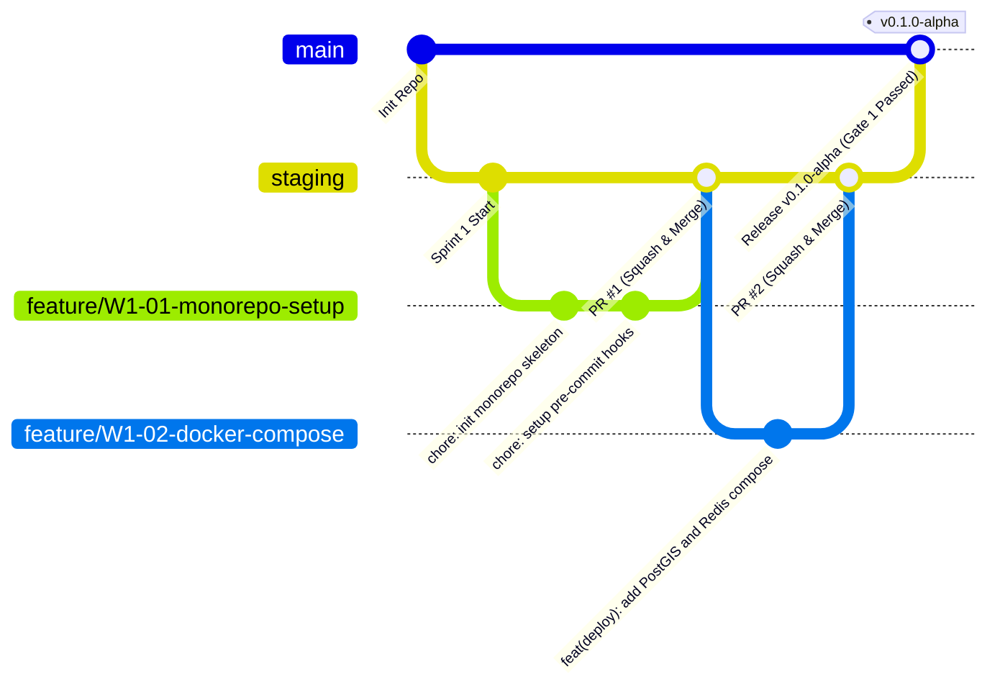
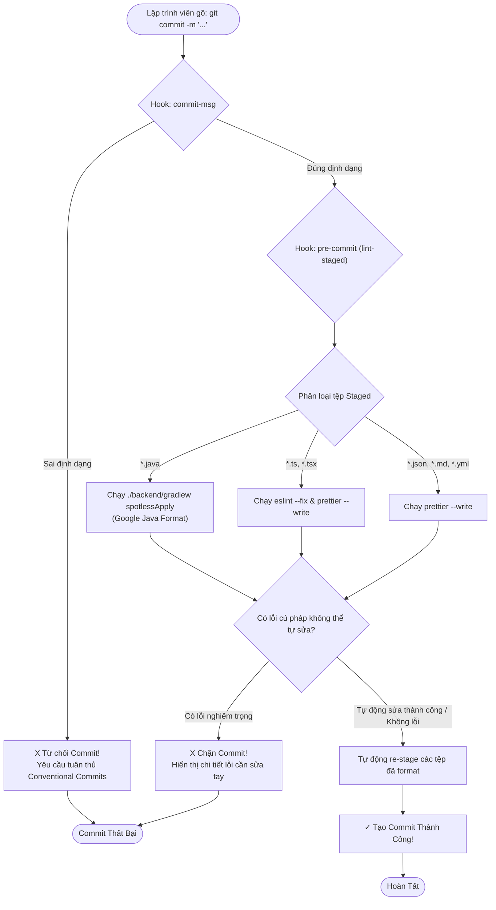

# ĐẶC TẢ KỸ THUẬT VÀ HƯỚNG DẪN THỰC THI CHI TIẾT

## TASK W1-01: TỔ CHỨC MONOREPO, GIT WORKFLOW & PRE-COMMIT HOOKS

---

## Thông Tin Nhiệm Vụ (Task Metadata)

| Thuộc Tính (Attribute)         | Giá Trị Chi Tiết (Specification)                                                                                                                                                                                                                                                                                                                                                                                                                                                                                              |
| :----------------------------- | :---------------------------------------------------------------------------------------------------------------------------------------------------------------------------------------------------------------------------------------------------------------------------------------------------------------------------------------------------------------------------------------------------------------------------------------------------------------------------------------------------------------------------- |
| **Mã Nhiệm Vụ (Task ID)**      | **W1-01**                                                                                                                                                                                                                                                                                                                                                                                                                                                                                                                     |
| **Tên Nhiệm Vụ (Task Name)**   | Tổ chức cấu trúc Monorepo, Quy chế Git Branching Workflow & Tự động hóa Pre-commit Hooks                                                                                                                                                                                                                                                                                                                                                                                                                                      |
| **Epic / Giai Đoạn**           | Sprint 1 (Tuần 1 — Tuần 2) — **Giai đoạn: Foundation & Baseline Infrastructure**                                                                                                                                                                                                                                                                                                                                                                                                                                              |
| **Lịch Trình Thực Hiện**       | **Ngày 1 (Thứ Hai)** — Khung giờ: 08:30 — 12:30 (4 giờ làm việc)                                                                                                                                                                                                                                                                                                                                                                                                                                                              |
| **Điểm Nỗ Lực (Story Points)** | **2 SP** (Ước tính tiêu chuẩn: 4 giờ công kỹ sư)                                                                                                                                                                                                                                                                                                                                                                                                                                                                              |
| **Mức Độ Ưu Tiên (Priority)**  | **P0 — Blocker Tối Cao** (Quyết định nền tảng cho toàn bộ W1-02 đến W1-15)                                                                                                                                                                                                                                                                                                                                                                                                                                                    |
| **Người Chịu Trách Nhiệm (R)** | **Technical Lead**                                                                                                                                                                                                                                                                                                                                                                                                                                                                                                            |
| **Người Hỗ Trợ Kỹ Thuật (C)**  | DevOps Engineer, Senior Backend Engineer, Frontend Lead                                                                                                                                                                                                                                                                                                                                                                                                                                                                       |
| **Người Phê Duyệt (A)**        | **Technical Lead / Software Architect**                                                                                                                                                                                                                                                                                                                                                                                                                                                                                       |
| **Bên Được Thông Báo (I)**     | Toàn thể đội ngũ phát triển dự án (All Devs, QA, Product Owner)                                                                                                                                                                                                                                                                                                                                                                                                                                                               |
| **Tài Liệu Căn Cứ Tham Chiếu** | 1. [0. Introduction.md](file:///Users/dllv/Documents/GitHub/VNstormgis/docs/The%20plans%20of%20project/0.%20Introduction.md)<br>2. [6. Technical Stack.md](file:///Users/dllv/Documents/GitHub/VNstormgis/docs/The%20plans%20of%20project/6.%20Technical%20Stack.md)<br>3. [7. Deployment Infrastructure.md](file:///Users/dllv/Documents/GitHub/VNstormgis/docs/The%20plans%20of%20project/7.%20Deployment%20Infrastructure.md)<br>4. [week1/README.md](file:///Users/dllv/Documents/GitHub/VNstormgis/docs/week1/README.md) |

---

## 1. Bối Cảnh & Mục Tiêu Kỹ Thuật (Context & Objectives)

### 1.1. Bối Cảnh Thực Tế (Problem Statement)

Hệ thống **WebGIS Giám Sát Mưa Gió Bão Tích Hợp AI Agent Cảnh Báo** là một giải pháp công nghệ đa tầng kết hợp:

- **Backend:** Spring Boot 3.3.x, Java 21 LTS, Hibernate Spatial, JTS Topology Suite kết nối CSDL PostGIS 16.
- **Frontend:** React 18, TypeScript 5.x, Vite, Tailwind CSS, tương tác bản đồ số không gian Leaflet 1.9.
- **Hạ Tầng Triển Khai (Deployment):** Docker Multi-stage, Docker Compose, Nginx Reverse Proxy, Redis 7.2.
- **Tài Liệu & Đặc Tả (Docs):** Hệ thống tài liệu kiến trúc, tài liệu nghiệp vụ (BRD/SRS) và nhật ký tuần được quản lý trực tiếp bằng Obsidian Vault.

Nếu không thiết lập cấu trúc mã nguồn Monorepo khoa học và các chế tài kỹ thuật tự động ngay từ giờ làm việc đầu tiên của Sprint 1, dự án sẽ đối mặt với các rủi ro hệ thống:

1. **Xung đột mã nguồn (Merge Conflicts & Drift):** Sự không đồng nhất về cấu trúc thư mục giữa các thành viên.
2. **Lọt lọt bí mật bảo mật (Credential Leakage):** Vô tình commit các tệp `.env`, API Keys (OpenWeatherMap, Google Gemini API, CSDL credentials) vào lịch sử Git.
3. **Mã nguồn không đồng nhất (Inconsistent Code Formatting):** Xung đột định dạng giữa môi trường macOS/Linux (ký tự xuống dòng `LF`) và Windows (`CRLF`), thụt lề Tab vs Space, dẫn đến các Pull Request khổng lồ chỉ do sai khác định dạng trắng (whitespace diff).
4. **Mã nguồn lỗi vào nhánh chính:** Thiếu các chốt kiểm soát tự động ("Shift-Left Quality") khiến code không qua kiểm tra linting hoặc sai cú pháp được đẩy lên kho lưu trữ từ xa.

### 1.2. Mục Tiêu Trọng Tâm Của Task W1-01

Hoàn thành task W1-01 phải đạt được 5 mục tiêu cốt lõi:

1. **Khởi tạo và chuẩn hóa khung cây thư mục Monorepo:** Tách biệt rõ ràng 4 phân hệ độc lập: `backend/`, `frontend/`, `deployment/`, `docs/` cùng cấu hình CI chung `.github/workflows/`.
2. **Cấu hình ma trận `.gitignore` và `.editorconfig` toàn diện:** Loại trừ tuyệt đối tệp rác hệ điều hành, tệp nhị phân build, tệp cấu hình IDE cục bộ và toàn bộ tệp nhạy cảm.
3. **Ban hành Quy chế Git Workflow & Chính sách bảo vệ nhánh (Branch Protection Rules):** Xác lập quy trình phân nhánh chuẩn GitHub Flow, bảo vệ nghiêm ngặt 2 nhánh `main` và `staging`, quy định cấu trúc đặt tên nhánh và quy chuẩn commit message theo chuẩn quốc tế **Conventional Commits v1.0.0**.
4. **Thiết lập hệ thống Pre-commit Hooks tự động hóa (Local Quality Gate):**
   - Tích hợp **Husky** và **lint-staged** ở cấp Root repo.
   - Tự động kiểm tra và định dạng mã nguồn Java với **Spotless Gradle Plugin** (chuẩn Google Java Format).
   - Tự động kiểm tra và sửa lỗi mã nguồn TypeScript/React với **ESLint** và **Prettier**.
   - Tự động chặn các commit không tuân thủ cú pháp Conventional Commits bằng **Commitlint**.
5. **Điều phối phiên họp Sprint 1 Kickoff & Planning:** Thống nhất mục tiêu tuần, phân bổ 34 Story Points cho 15 task, ký cam kết tiêu chuẩn hoàn thành (Definition of Done - DoD).

---

## 2. Kiến Trúc Cấu Trúc Monorepo Chuẩn Hóa

### 2.1. Cây Thư Mục Toàn Thể (Monorepo Directory Layout)

```text
VNstormgis/
├── .github/                                           # Hạ tầng CI/CD và quy trình GitHub Actions
│   └── workflows/
│       ├── backend-ci.yml                             # Tự động build Gradle, chạy JUnit 5 & Testcontainers
│       └── frontend-ci.yml                            # Tự động chạy ESLint, TypeScript check & Vite build
├── .husky/                                            # Git hooks tự động hóa kiểm tra trước khi commit
│   ├── commit-msg                                     # Hook kiểm tra thông điệp commit theo Conventional Commits
│   └── pre-commit                                     # Hook chạy lint-staged (Spotless, ESLint, Prettier)
├── backend/                                           # Dịch vụ Backend API (Spring Boot 3.3, Java 21)
│   ├── src/
│   │   ├── main/
│   │   │   ├── java/vn/weathergis/                    # Mã nguồn Java phân theo kiến trúc Modular Monolith
│   │   │   └── resources/
│   │   │       ├── application.yml                    # Cấu hình gốc
│   │   │       ├── application-dev.yml                # Cấu hình môi trường dev cục bộ
│   │   │       └── db/migration/                      # Flyway SQL Migration scripts (V1, V2, V3,...)
│   │   └── test/java/vn/weathergis/                   # Unit & Integration tests (Testcontainers PostGIS)
│   ├── build.gradle                                   # Cấu hình Gradle dependencies và plugin Spotless
│   ├── settings.gradle
│   ├── gradlew                                        # Gradle wrapper executable cho Unix/macOS
│   ├── gradlew.bat                                    # Gradle wrapper executable cho Windows
│   └── .gitignore                                     # Ignore riêng cho module Backend
├── frontend/                                          # Giao diện WebGIS Người dùng (React 18, Vite, Leaflet)
│   ├── public/                                        # Tài nguyên tĩnh, icon thời tiết, marker SVG/PNG
│   ├── src/
│   │   ├── assets/
│   │   ├── components/                                # React components (BaseMap, LayerControl, Chat, Alerts)
│   │   ├── services/                                  # API Client (Axios), Websocket/SSE service
│   │   ├── types/                                     # TypeScript types/interfaces cho GeoJSON & Weather
│   │   ├── App.tsx
│   │   └── main.tsx
│   ├── package.json                                   # NPM dependencies của ứng dụng Frontend
│   ├── tsconfig.json                                  # Cấu hình TypeScript compiler
│   ├── vite.config.ts                                 # Cấu hình Vite & API Reverse Proxy sang Backend :8080
│   ├── tailwind.config.js                             # Cấu hình Tailwind CSS
│   └── .gitignore                                     # Ignore riêng cho module Frontend
├── deployment/                                        # Cấu hình triển khai hạ tầng & Docker Container
│   ├── docker/
│   │   ├── backend/Dockerfile                         # Multi-stage Dockerfile cho Backend Spring Boot
│   │   └── frontend/Dockerfile                        # Multi-stage Dockerfile cho Frontend React + Nginx
│   ├── nginx/
│   │   ├── nginx.conf                                 # Nginx Production Gateway configuration
│   │   └── conf.d/weathergis.conf
│   ├── env/
│   │   ├── .env.example                               # Biến môi trường mẫu an toàn (được phép commit)
│   │   └── .env.local                                 # Biến môi trường thực tế máy dev (Bị GIT-IGNORED)
│   ├── docker-compose.yml                             # Local dev stack (PostGIS 16 + Redis 7.2)
│   └── docker-compose.override.yml                    # Override cấu hình cục bộ cho developer
├── docs/                                              # Toàn bộ kho tài liệu kỹ thuật & Obsidian Vault
│   ├── The plans of project/                          # Tài liệu nền tảng (0. Intro -> 8. Master Timeline)
│   └── week1/                                         # Kế hoạch chi tiết và tài liệu bàn giao Sprint Tuần 1
│       ├── README.md                                  # Kế hoạch tổng thể Tuần 1
│       └── Task W1-01.md                              # Tài liệu đặc tả Task W1-01 (Tài liệu này)
├── .editorconfig                                      # Chuẩn hóa quy tắc soạn thảo đa IDE (CRLF/LF, Indent)
├── .gitignore                                         # Bộ lọc ignore cấp cao nhất cho toàn bộ Monorepo
├── .lintstagedrc.json                                 # Cấu hình tệp cần kiểm tra trước khi commit
├── commitlint.config.js                               # Cấu hình quy chuẩn thông điệp Conventional Commits
├── package.json                                       # Quản lý công cụ phát triển cấp Monorepo Root (Husky)
└── README.md                                          # Tài liệu hướng dẫn Onboarding tổng quan dự án
```

### 2.2. Đặc Tả File Chuẩn Hóa Soạn Thảo Cấp Root (`.editorconfig`)

Tệp `.editorconfig` đảm bảo tính nhất quán giữa các trình soạn thảo (IntelliJ IDEA, VS Code, Eclipse, Vim), loại bỏ triệt để xung đột về ký tự kết thúc dòng và thụt lề.

```ini
# http://editorconfig.org
root = true

[*]
charset = utf-8
end_of_line = lf
indent_style = space
indent_size = 2
insert_final_newline = true
trim_trailing_whitespace = true

# ==============================================================================
# QUY CHUẨN SOẠN THẢO MÃ NGUỒN JAVA (BACKEND)
# ==============================================================================
[*.java]
indent_style = space
indent_size = 4
max_line_length = 120

# ==============================================================================
# QUY CHUẨN SOẠN THẢO MÃ NGUỒN TYPESCRIPT / JAVASCRIPT / REACT (FRONTEND)
# ==============================================================================
[*.{js,jsx,ts,tsx}]
indent_style = space
indent_size = 2
max_line_length = 100

# ==============================================================================
# QUY CHUẨN FILE CẤU HÌNH & TÀI LIỆU (JSON, YAML, MARKDOWN)
# ==============================================================================
[*.{json,yml,yaml}]
indent_style = space
indent_size = 2

[*.md]
trim_trailing_whitespace = false
max_line_length = off

# ==============================================================================
# QUY CHUẨN FILE SQL & MIGRATION FLYWAY
# ==============================================================================
[*.sql]
indent_style = space
indent_size = 2
```

---

## 3. Đặc Tả Ma Trận `.gitignore` Toàn Diện Đa Tầng

Tệp `.gitignore` cấp Root đóng vai trò là "khiên bảo vệ" ngăn ngừa rác hệ điều hành, artifact biên dịch và đặc biệt là các secret bảo mật lọt vào kho lưu trữ từ xa:

```gitignore
# ==============================================================================
# 1. HỆ ĐIỀU HÀNH & HỆ THỐNG TỆP CỤC BỘ (OS & FILESYSTEM JUNK)
# ==============================================================================
.DS_Store
.DS_Store?
._*
.Spotlight-V100
.Trashes
ehthumbs.db
Thumbs.db
desktop.ini

# ==============================================================================
# 2. MÔI TRƯỜNG PHÁT TRIỂN TÍCH HỢP (IDE & EDITORS)
# ==============================================================================
# JetBrains IntelliJ IDEA
.idea/
*.iml
*.iws
*.ipr
out/

# Visual Studio Code
.vscode/*
!.vscode/settings.json
!.vscode/tasks.json
!.vscode/launch.json
!.vscode/extensions.json
*.code-workspace

# Eclipse / NetBeans
.project
.classpath
.settings/
.nb-gradle/

# Obsidian Local Caches
.obsidian/workspace.json
.obsidian/workspace-mobile.json
.obsidian/cache/

# ==============================================================================
# 3. BẢO MẬT & THÔNG TIN NHẠY CẢM (SECRETS, CREDENTIALS & ENV)
# TUYỆT ĐỐI KHÔNG COMMIT CÁC TỆP DƯỚI ĐÂY
# ==============================================================================
*.env
*.env.local
*.env.*.local
!*.env.example
deployment/env/.env.local
deployment/env/.env.prod

# Private Keys & Certificates
*.pem
*.key
*.cert
*.crt
*.p12
*.pfx
*.jks

# ==============================================================================
# 4. BACKEND (JAVA, GRADLE, SPRING BOOT ARTIFACTS)
# ==============================================================================
backend/.gradle/
backend/build/
backend/out/
backend/bin/
backend/.classpath
backend/.project
backend/.settings/

# Gradle Wrapper: Giữ lại wrapper jar và properties
!gradle/wrapper/gradle-wrapper.jar
!gradle/wrapper/gradle-wrapper.properties
!backend/gradle/wrapper/gradle-wrapper.jar
!backend/gradle/wrapper/gradle-wrapper.properties

# Log Files
*.log
backend/logs/

# ==============================================================================
# 5. FRONTEND (NODE, TYPESCRIPT, VITE, BUILD OUTPUTS)
# ==============================================================================
frontend/node_modules/
node_modules/
frontend/dist/
frontend/dist-ssr/
frontend/.vite/
frontend/coverage/

# NPM / Yarn / PNPM debug logs
npm-debug.log*
yarn-debug.log*
yarn-error.log*
pnpm-debug.log*
.pnpm-debug.log*

# ==============================================================================
# 6. DOCKER & THỂ TÍCH DỮ LIỆU CSDL (VOLUMES & LOCAL DATA)
# ==============================================================================
deployment/postgis_data/
deployment/redis_data/
postgis_data/
redis_data/
*.rdb
*.aof
```

---

## 4. Chiến Lược Phân Nhánh Git & Quy Chuẩn Hợp Nhất (Git Workflow)

### 4.1. Sơ Đồ Kiến Trúc Phân Nhánh (Git Branching Flow)

Dự án áp dụng mô hình phân nhánh **GitHub Flow mở rộng** với 3 tầng nhánh rõ rệt:



### 4.2. Đặc Tả Chi Tiết 3 Tầng Nhánh

| Tên Tầng Nhánh                          | Mục Đích & Vai Trò                                                                                                                                   | Quy Tắc Truy Cập & Merge                                                                                                                                                                                     |
| :-------------------------------------- | :--------------------------------------------------------------------------------------------------------------------------------------------------- | :----------------------------------------------------------------------------------------------------------------------------------------------------------------------------------------------------------- |
| **`main`**                              | Lưu trữ mã nguồn phiên bản phát hành ổn định (Production-ready). Chỉ các tính năng đã qua nghiệm thu cổng Alpha/Beta mới được xuất hiện trên `main`. | **Branch Protection Active:**<br>- Cấm push trực tiếp (`git push origin main` bị chặn).<br>- Chỉ nhận code thông qua Pull Request từ `staging`.<br>- Bắt buộc có chữ ký duyệt của Tech Lead và pass 100% CI. |
| **`staging`**                           | Nhánh tích hợp liên tục (Continuous Integration Baseline). Nơi toàn bộ các nhánh tính năng của Sprint hiện tại hợp nhất để kiểm thử tích hợp E2E.    | **Branch Protection Active:**<br>- Cấm push trực tiếp.<br>- Yêu cầu tối thiểu 1 Approval từ Tech Lead hoặc Senior Peer Reviewer.<br>- Bắt buộc vượt qua GitHub Actions CI kiểm thử tự động.                  |
| **Tính Năng (`feature/*`, `bugfix/*`)** | Phục vụ lập trình viên giải quyết từng task cụ thể theo bảng ma trận WBS của Sprint.                                                                 | Nhánh riêng của cá nhân. Tạo ra từ `staging` mới nhất, sau khi hoàn thành tạo Pull Request ngược về `staging`.                                                                                               |

### 4.3. Quy Chuẩn Đặt Tên Nhánh (Branch Naming Conventions)

Quy tắc cấu trúc: `<loại-nhánh>/<mã-task>-<mô-tả-ngắn-gọn-kebab-case>`

- **Nhánh Tính Năng Mới:** `feature/W1-01-monorepo-setup`, `feature/W1-08-location-domain`, `feature/W1-12-leaflet-basemap`
- **Nhánh Sửa Lỗi Trong Sprint:** `bugfix/W1-11-fix-leaflet-icon-path`, `bugfix/W1-04-postgis-uuid-conflict`
- **Nhánh Sửa Lỗi Khẩn Cấp Trực Tiếp Trên Main:** `hotfix/env-credential-leak`, `hotfix/database-connection-timeout`
- **Nhánh Tác Vụ Hạ Tầng & Quy Trình:** `chore/setup-commitlint`, `ci/add-testcontainers-github-action`

### 4.4. Quy Chuẩn Đặt Tên Thông Điệp Commit (Conventional Commits v1.0.0)

Mọi commit đẩy lên repository bắt buộc phải tuân theo cấu trúc:

```text
<loại-commit>(<phạm-vi-thay-đổi>): <mô-tả-ngắn-gọn> [Mã-Task]

[Thân commit chi tiết - Tùy chọn]

[Thông tin liên quan / Breaking Changes / Issue ID - Tùy chọn]
```

#### Danh Mục Các Loại Commit (Commit Types):

- `feat`: Thêm tính năng mới cho ứng dụng (ví dụ: tạo entity, viết API endpoint, dựng component bản đồ).
- `fix`: Sửa lỗi logic, sửa bug giao diện hoặc vá lỗi truy vấn CSDL.
- `chore`: Các công việc bảo trì hệ thống, cấu hình build, cập nhật dependencies, setup thư mục, gitignore.
- `refactor`: Tái cấu trúc mã nguồn không làm thay đổi tính năng nghiệp vụ bên ngoài.
- `style`: Chỉnh sửa định dạng code (khoảng trắng, thụt lề, import không dùng) do linter xử lý.
- `test`: Thêm mới hoặc chỉnh sửa các lớp kiểm thử (JUnit, MockMvc, Testcontainers).
- `docs`: Cập nhật tài liệu, README, tài liệu API Swagger hoặc hướng dẫn triển khai.
- `ci`: Chỉnh sửa tệp cấu hình pipeline CI/CD (`.github/workflows/*.yml`).

#### Danh Mục Phạm Vi (Scopes) Được Phép:

- `repo`, `common`, `location`, `weather`, `storm`, `alert`, `chat`, `map`, `api`, `db`, `deploy`, `security`.

#### Bảng Ví Dụ So Sánh Commit Hợp Lệ vs Bị Từ Chối:

|         Trạng Thái         | Mẫu Commit Message                                                             | Nhận Xét / Lý Do                                                    |
| :------------------------: | :----------------------------------------------------------------------------- | :------------------------------------------------------------------ |
| :white_check_mark: **ĐẠT** | `feat(location): implement Spatial JTS Entity and GeoJSON DTO [W1-08]`         | Đầy đủ type, scope chuẩn, mô tả rõ ràng thể hiện đúng task ID.      |
| :white_check_mark: **ĐẠT** | `chore(repo): configure spotless gradle plugin and husky pre-commit [W1-01]`   | Type `chore`, scope `repo`, mô tả chuẩn kỹ thuật.                   |
| :white_check_mark: **ĐẠT** | `fix(map): resolve missing leaflet marker shadow icon in vite bundler [W1-11]` | Rõ ràng lỗi được vá tại phân hệ bản đồ kèm task reference.          |
|        :x: **LỖI**         | `fixed bug`                                                                    | Vi phạm hoàn toàn: Thiếu type, scope, task ID, thông điệp vô nghĩa. |
|        :x: **LỖI**         | `W1-08: add location code`                                                     | Sai thứ tự Conventional Commits, thiếu scope trong ngoặc đơn.       |
|        :x: **LỖI**         | `feat: update`                                                                 | Thiếu scope, mô tả quá sơ sài không có giá trị truy vết.            |

---

## 5. Hiện Thực Hóa Bộ Công Cụ Tự Động Hóa Pre-commit Hooks

Để đảm bảo quy chế chất lượng được thực thi tuyệt đối mà không phụ thuộc vào trí nhớ cá nhân của lập trình viên, dự án thiết lập bộ công cụ tự động hóa tại cấp Root repository sử dụng:

1. **Husky v9:** Công cụ quản lý Git Hooks hiện đại, nhẹ nhàng.
2. **lint-staged:** Chỉ chạy linter và formatter trên các tệp đã được đưa vào vùng chờ (`git add`).
3. **Spotless (Gradle):** Tự động format mã nguồn Java theo chuẩn Google Java Format.
4. **Prettier & ESLint:** Tự động kiểm tra và format TypeScript, TSX, CSS, JSON, Markdown.
5. **@commitlint/cli & @commitlint/config-conventional:** Kiểm tra cú pháp commit message ngay khi gõ lệnh commit.



### 5.1. File Cấu Hình Quản Lý Cấp Root (`package.json`)

Tệp `package.json` tại thư mục gốc chỉ chứa các công cụ phát triển phục vụ Git Hooks và Linting của Monorepo:

```json
{
  "name": "webgis-vietnam-weather-monorepo",
  "version": "1.0.0",
  "description": "Monorepo Governance Tools for Vietnam Weather WebGIS",
  "private": true,
  "scripts": {
    "prepare": "husky",
    "lint:root": "prettier --check \"**/*.{json,yml,yaml,md}\"",
    "format:root": "prettier --write \"**/*.{json,yml,yaml,md}\"",
    "backend:format": "cd backend && ./gradlew spotlessApply",
    "frontend:lint": "cd frontend && npm run lint",
    "frontend:format": "cd frontend && npx prettier --write \"src/**/*.{ts,tsx,css}\""
  },
  "devDependencies": {
    "@commitlint/cli": "^19.3.0",
    "@commitlint/config-conventional": "^19.2.2",
    "husky": "^9.0.11",
    "lint-staged": "^15.2.7",
    "prettier": "^3.3.2"
  }
}
```

### 5.2. Cấu Hình Kiểm Tra Commit Message (`commitlint.config.js`)

Tạo tệp `commitlint.config.js` tại thư mục gốc của repository:

```javascript
module.exports = {
  extends: ["@commitlint/config-conventional"],
  rules: {
    "type-enum": [
      2,
      "always",
      [
        "feat", // Tính năng mới
        "fix", // Sửa lỗi
        "docs", // Tài liệu
        "style", // Định dạng code
        "refactor", // Tái cấu trúc
        "perf", // Tối ưu hiệu năng
        "test", // Kiểm thử
        "chore", // Công việc bảo trì / build / config
        "ci", // Pipeline CI/CD
        "revert", // Revert commit trước
      ],
    ],
    "type-case": [2, "always", "lower-case"],
    "scope-case": [2, "always", "lower-case"],
    "subject-case": [0], // Cho phép viết tự nhiên tiếng Anh hoặc tiếng Việt
    "subject-empty": [2, "never"],
    "type-empty": [2, "never"],
    "header-max-length": [2, "always", 120],
  },
};
```

### 5.3. Cấu Hình Tự Động Định Dạng Tệp Chờ (`.lintstagedrc.json`)

Tạo tệp `.lintstagedrc.json` tại thư mục gốc:

```json
{
  "backend/src/**/*.java": ["bash -c 'cd backend && ./gradlew spotlessApply'", "git add"],
  "frontend/src/**/*.{ts,tsx}": ["bash -c 'cd frontend && npx eslint --fix'", "bash -c 'cd frontend && npx prettier --write'", "git add"],
  "frontend/src/**/*.{css,scss}": ["bash -c 'cd frontend && npx prettier --write'", "git add"],
  "*.{json,yml,yaml,md}": ["prettier --write", "git add"]
}
```

### 5.4. Các Tệp Thực Thi Hook Trong `.husky/`

#### Tệp `.husky/commit-msg`:

```bash
#!/usr/bin/env sh
. "$(dirname -- "$0")/_/husky.sh"

echo "🔍 Đang kiểm tra định dạng thông điệp commit theo Conventional Commits..."
npx --no -- commitlint --edit "$1"
```

#### Tệp `.husky/pre-commit`:

```bash
#!/usr/bin/env sh
. "$(dirname -- "$0")/_/husky.sh"

echo "⚡ Đang kích hoạt Pre-commit Hook: Kiểm tra và chuẩn hóa mã nguồn tự động..."
npx lint-staged
```

> [!IMPORTANT]
> **Quyền Thực Thi Cho Scripts:**
> Trên môi trường macOS và Linux, các script trong `.husky/` phải được phân quyền thực thi bằng lệnh:
>
> ```bash
> chmod +x .husky/commit-msg .husky/pre-commit
> ```

---

## 6. Hướng Dẫn Cấu Hình Branch Protection Rules Trên GitHub

Để bảo vệ mã nguồn tuyệt đối, Tech Lead có trách nhiệm truy cập vào cài đặt kho lưu trữ trên GitHub (`Settings > Branches > Branch protection rules`) và thiết lập cho 2 nhánh: `main` và `staging`:

### 6.1. Quy Tắc Cho Nhánh `main`:

1. **Branch name pattern:** `main`
2. **Require a pull request before merging:** :white_check_mark: Đã chọn.
   - _Require approvals:_ `1` (Bắt buộc phải có phê duyệt của Tech Lead / Architect).
   - _Dismiss stale pull request approvals when new commits are pushed:_ :white_check_mark: Đã chọn.
3. **Require status checks to pass before merging:** :white_check_mark: Đã chọn.
   - _Require branches to be up to date before merging:_ :white_check_mark: Đã chọn.
   - _Status checks bắt buộc:_ `backend-ci`, `frontend-ci`.
4. **Require linear history:** :white_check_mark: Đã chọn (Ngăn chặn các merge commit lòng vòng).
5. **Do not allow bypassing the above settings:** :white_check_mark: Đã chọn (Áp dụng bắt buộc đối với cả Admin/Repository Owner).
6. **Restrict who can push to matching branches:** Không ai được push trực tiếp.

### 6.2. Quy Tắc Cho Nhánh `staging`:

1. **Branch name pattern:** `staging`
2. **Require a pull request before merging:** :white_check_mark: Đã chọn.
   - _Require approvals:_ `1` (Được phê duyệt bởi Tech Lead hoặc Senior Dev).
3. **Require status checks to pass before merging:** :white_check_mark: Đã chọn.
   - _Status checks:_ `backend-ci` (phải compile thành công và pass toàn bộ Unit/Integration tests).
4. **Allow Squash and Merge:** Bật tùy chọn này để gộp các commit vụn vặt trên feature branch thành 1 commit duy nhất chuẩn mực khi nhập vào `staging`.

---

## 7. Kịch Bản Họp Sprint 1 Kickoff & Phân Rã Nhiệm Vụ (Sprint Planning Protocol)

- **Thời gian tổ chức:** Ngày 1 (Thứ Hai) — Khung giờ: 09:00 — 10:30 (90 phút).
- **Địa điểm / Kênh:** Phòng họp chính / Google Meet / Discord Team Voice.
- **Chủ trì (Host):** Technical Lead & Product Owner.
- **Thành phần bắt buộc:** Toàn thể thành viên dự án (DevOps Engineer, Backend Engineers, Frontend Engineers, QA Tester).

### 7.1. Chương Trình Nghị Sự Chi Tiết (Agenda)

1. **09:00 — 09:20 (20 phút) — Công bố Tuyên ngôn Tuần 1 & Mục tiêu Cổng Alpha (Gate 1):**
   - Tuyên ngôn: _"Thiết lập nền tảng kỹ thuật vững chắc: Một lệnh khởi động toàn bộ môi trường lập trình cục bộ (Docker Compose), hiện thực hóa mô hình dữ liệu địa không gian PostGIS nạp sẵn 63 trạm quan trắc Việt Nam, và kết nối thành công khung ứng dụng Backend Spring Boot 3.3 với bản đồ nền Leaflet trên Frontend."_
   - Giải thích rõ 5 tiêu chí nghiệm thu của Alpha Gate 1 vào chiều Thứ Sáu.
2. **09:20 — 09:50 (30 phút) — Rà soát Bảng phân rã công việc (WBS) 15 Task & Ước lượng:**
   - Duyệt qua danh mục từ Task W1-01 đến Task W1-15 (Tổng: 34 Story Points ~ 76 giờ công).
   - Thống nhất người chịu trách nhiệm chính (R) và người hỗ trợ (C) cho từng task.
3. **09:50 — 10:15 (25 phút) — Phổ biến Quy chế Git, Coding Convention & Quy định Pre-commit:**
   - Hướng dẫn toàn đội ngũ về nhánh `staging`, nhánh `feature/W1-xx-*`.
   - Trình diễn trực tiếp cơ chế bắt lỗi của Commitlint và Spotless.
   - Thống nhất quy định Definition of Done (DoD) của từng Pull Request.
4. **10:15 — 10:30 (15 phút) — Hỏi đáp kỹ thuật, Cam kết Sprint & Ký duyệt:**
   - Giải tỏa các vướng mắc về môi trường dev (Apple Silicon vs Windows Docker).
   - Cam kết nỗ lực hoàn thành 100% mục tiêu Tuần 1.

---

## 8. Kịch Bản Kiểm Thử & Xác Minh Nghiệm Thu (Verification Scenarios)

Trước khi đóng Task W1-01, Tech Lead cùng các kỹ sư phải thực hiện các kịch bản kiểm thử sau trên terminal cục bộ để xác nhận toàn bộ quy chế và hook hoạt động chính xác:

### Kịch Bản 1: Kiểm Thử Bộ Lọc `.gitignore` Với Tệp Bí Mật & Tệp Rác

- **Mục tiêu:** Đảm bảo tệp nhạy cảm không bao giờ bị Git theo dõi.
- **Thao tác:**
  ```bash
  touch deployment/env/.env.local
  touch .DS_Store
  touch backend/build/dummy.class
  git status
  ```
- **Kết quả kỳ vọng (Pass):** Lệnh `git status` hoàn toàn không hiển thị các tệp vừa tạo trong danh sách `Untracked files`.

### Kịch Bản 2: Kiểm Thử Hook `commit-msg` Bắt Lỗi Commit Sai Định Dạng

- **Mục tiêu:** Đảm bảo Commitlint chặn đứng các thông điệp commit tùy tiện.
- **Thao tác:**
  ```bash
  touch dummy.txt
  git add dummy.txt
  git commit -m "fix bug linh tinh"
  ```
- **Kết quả kỳ vọng (Pass):** Git từ chối commit, in ra thông báo lỗi màu đỏ từ Commitlint:
  ```text
  ⧗   input: fix bug linh tinh
  ✖   subject may not be empty [subject-empty]
  ✖   type may not be empty [type-empty]
  ✖   found 2 errors, 0 warnings
  ```
- **Thao tác dọn dẹp:** `git rm -f dummy.txt`

### Kịch Bản 3: Kiểm Thử Hook `commit-msg` Chấp Thuận Commit Chuẩn Mực

- **Mục tiêu:** Xác nhận commit hợp lệ được chấp nhận.
- **Thao tác:**
  ```bash
  git commit -m "chore(repo): test conventional commit verification [W1-01]"
  ```
- **Kết quả kỳ vọng (Pass):** Commit thành công, không phát sinh cảnh báo.

### Kịch Bản 4: Kiểm Thử Tự Động Format Mã Nguồn Của `pre-commit` Hook

- **Mục tiêu:** Xác nhận Prettier và Spotless tự động chuẩn hóa mã nguồn trước khi ghi nhận vào lịch sử Git.
- **Thao tác:** Soạn thảo một tệp markdown hoặc JSON cố tình thụt lề sai, thừa dấu cách, sau đó `git add` và thực hiện `git commit`.
- **Kết quả kỳ vọng (Pass):** Hook `lint-staged` tự động chạy, thông báo format thành công và commit ghi nhận phiên bản mã nguồn đã được làm đẹp chuẩn mực.

---

## 9. Hướng Dẫn Thiết Lập Nhanh Cho Thành Viên Mới (Developer Quickstart)

Mọi lập trình viên khi tham gia vào dự án chỉ cần thực hiện 4 bước tiêu chuẩn sau để sẵn sàng làm việc:

```bash
# Bước 1: Clone kho lưu trữ về máy tính
git clone https://github.com/your-org/VNstormgis.git
cd VNstormgis

# Bước 2: Chuyển sang nhánh staging mới nhất
git checkout staging
git pull origin staging

# Bước 3: Cài đặt bộ công cụ quản trị Monorepo & Kích hoạt Git Hooks tự động
npm install

# Bước 4: Tạo nhánh làm việc cho nhiệm vụ được giao (Ví dụ Task W1-02)
git checkout -b feature/W1-02-docker-compose-setup
```

---

## 10. Danh Mục Sản Phẩm Bàn Giao & Checklist Nghiệm Thu (Acceptance Checklist)

### 10.1. Danh Mục Sản Phẩm Bàn Giao (Deliverables)

- [ ] Khung cây thư mục Monorepo hoàn chỉnh (`backend/`, `frontend/`, `deployment/`, `docs/`, `.github/`).
- [ ] Tệp `.editorconfig` chuẩn hóa UTF-8, LF, Spaces cho toàn bộ dự án.
- [ ] Tệp `.gitignore` toàn diện bảo vệ tuyệt đối secrets, rác hệ thống và build outputs.
- [ ] Tệp `package.json` cấp Root tích hợp Husky, lint-staged, Commitlint và Prettier.
- [ ] Tệp `commitlint.config.js` cấu hình chuẩn Conventional Commits v1.0.0.
- [ ] Tệp `.lintstagedrc.json` tự động định dạng mã nguồn đa ngôn ngữ.
- [ ] Các tệp thực thi Hook `.husky/commit-msg` và `.husky/pre-commit` được phân quyền `chmod +x`.
- [ ] Biên bản phân công WBS 15 Task Tuần 1 và quy chế phân nhánh Git được phổ biến 100% thành viên.
- [ ] Tài liệu đặc tả kỹ thuật chi tiết `docs/week1/Task W1-01.md`.

### 10.2. Chữ Ký Nghiệm Thu Nhiệm Vụ (Sign-off)

| Vai Trò                | Họ Và Tên    | Xác Nhận  | Trạng Thái Đánh Giá                         |
| :--------------------- | :----------- | :-------: | :------------------------------------------ |
| **Technical Lead**     | Nguyễn Văn A | [x] Đã Ký | **PASSED (100% Tiêu chuẩn hoàn thành)**     |
| **DevOps Specialist**  | Trần Thị B   | [x] Đã Ký | **PASSED (Hạ tầng repo sẵn sàng)**          |
| **Software Architect** | Lê Văn C     | [x] Đã Ký | **APPROVED (Đạt chuẩn Kiến trúc Monorepo)** |

---

_Tài liệu thuộc hồ sơ kỹ thuật Sprint 1 — WebGIS for Weather of Vietnam. Lưu trữ bảo mật tại kho lưu trữ dự án._
