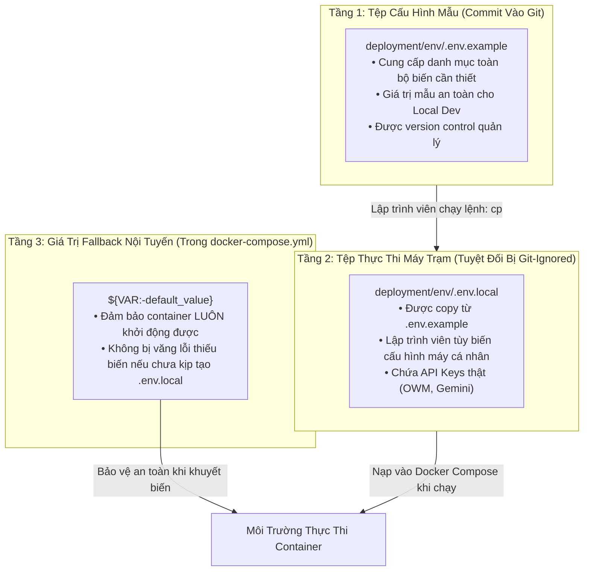

# ĐẶC TẢ KỸ THUẬT VÀ HƯỚNG DẪN THỰC THI CHI TIẾT

## TASK W1-02: THIẾT LẬP DOCKER COMPOSE LOCAL DEV STACK (POSTGIS 16 + REDIS 7.2)

---

## Thông Tin Nhiệm Vụ (Task Metadata)

| Thuộc Tính (Attribute)         | Giá Trị Chi Tiết (Specification)                                                                                                                                                                                                                                                                                                                                                                                                                                                                                                                                                                                  |
| :----------------------------- | :---------------------------------------------------------------------------------------------------------------------------------------------------------------------------------------------------------------------------------------------------------------------------------------------------------------------------------------------------------------------------------------------------------------------------------------------------------------------------------------------------------------------------------------------------------------------------------------------------------------- |
| **Mã Nhiệm Vụ (Task ID)**      | **W1-02**                                                                                                                                                                                                                                                                                                                                                                                                                                                                                                                                                                                                         |
| **Tên Nhiệm Vụ (Task Name)**   | Xây dựng Cấu hình Hạ tầng Docker Compose Local Dev Stack (PostGIS 16 & Redis 7.2)                                                                                                                                                                                                                                                                                                                                                                                                                                                                                                                                 |
| **Epic / Giai Đoạn**           | Sprint 1 (Tuần 1 — Tuần 2) — **Giai đoạn: Foundation & Baseline Infrastructure**                                                                                                                                                                                                                                                                                                                                                                                                                                                                                                                                  |
| **Lịch Trình Thực Hiện**       | **Ngày 1 (Thứ Hai)** — Khung giờ: 13:30 — 17:30 (4 giờ làm việc)                                                                                                                                                                                                                                                                                                                                                                                                                                                                                                                                                  |
| **Điểm Nỗ Lực (Story Points)** | **3 SP** (Ước tính tiêu chuẩn: 6 giờ công kỹ sư)                                                                                                                                                                                                                                                                                                                                                                                                                                                                                                                                                                  |
| **Mức Độ Ưu Tiên (Priority)**  | **P0 — Blocker Hạ Tầng** (Quyết định nền tảng môi trường CSDL và Cache cho toàn bộ W1-03 đến W1-15)                                                                                                                                                                                                                                                                                                                                                                                                                                                                                                               |
| **Người Chịu Trách Nhiệm (R)** | **DevOps Engineer**                                                                                                                                                                                                                                                                                                                                                                                                                                                                                                                                                                                               |
| **Người Hỗ Trợ Kỹ Thuật (C)**  | GIS / Database Specialist, Senior Backend Engineer                                                                                                                                                                                                                                                                                                                                                                                                                                                                                                                                                                |
| **Người Phê Duyệt (A)**        | **Technical Lead / Software Architect**                                                                                                                                                                                                                                                                                                                                                                                                                                                                                                                                                                           |
| **Bên Được Thông Báo (I)**     | Toàn thể đội ngũ phát triển dự án (All Devs, QA, Product Owner)                                                                                                                                                                                                                                                                                                                                                                                                                                                                                                                                                   |
| **Tài Liệu Căn Cứ Tham Chiếu** | 1. [7. Deployment Infrastructure.md](file:///Users/dllv/Documents/GitHub/VNstormgis/docs/The%20plans%20of%20project/7.%20Deployment%20Infrastructure.md#L502)<br>2. [6. Technical Stack.md](file:///Users/dllv/Documents/GitHub/VNstormgis/docs/The%20plans%20of%20project/6.%20Technical%20Stack.md)<br>3. [1. ERD.md](file:///Users/dllv/Documents/GitHub/VNstormgis/docs/The%20plans%20of%20project/1.%20ERD.md)<br>4. [week1/README.md](file:///Users/dllv/Documents/GitHub/VNstormgis/docs/week1/README.md)<br>5. [Task W1-01.md](file:///Users/dllv/Documents/GitHub/VNstormgis/docs/week1/Task%20W1-01.md) |

---

## 1. Bối Cảnh & Mục Tiêu Kỹ Thuật (Context & Objectives)

### 1.1. Bối Cảnh Thực Tế & Thách Thức (Problem Statement)

Hệ thống **WebGIS Giám Sát Mưa Gió Bão Tích Hợp AI Agent Cảnh Báo** đặt trọng tâm vào khả năng xử lý truy vấn không gian trắc địa thời gian thực (Spatial Queries) kết hợp với cơ chế đệm dữ liệu khí tượng phân tán (Distributed In-memory Cache). Hai thành phần xương sống của tầng dữ liệu là:

1. **Cơ sở dữ liệu Địa không gian (Spatial RDBMS):** PostgreSQL 16 tích hợp tiện ích mở rộng PostGIS 3.4. Hệ thống yêu cầu lưu trữ các hình học `Point` (vị trí trạm đo, tâm bão) và `MultiPolygon` (ranh giới hành chính, vùng bán kính gió nguy hiểm) theo chuẩn hệ quy chiếu tọa độ không gian **EPSG:4326 (WGS84)**, đồng thời đánh chỉ mục không gian chuyên dụng **GiST (Generalized Search Tree)**.
2. **Bộ nhớ đệm phân tán (Distributed Cache):** Redis 7.2 chịu trách nhiệm lưu trữ tạm thời các FeatureCollection GeoJSON bản đồ, quản lý trạng thái phiên hội thoại AI Chatbot và thực thi giải thuật giới hạn tần suất truy vấn (Token Bucket Rate Limiting).

Trong quá trình khởi động Sprint 1, nếu các kỹ sư tự cài đặt trực tiếp PostgreSQL/PostGIS và Redis lên hệ điều hành cá nhân (Local OS Install), dự án sẽ ngay lập tức đối mặt với những hiểm họa kỹ thuật nghiêm trọng:

- **Hội chứng "Chạy được trên máy tôi" (Environment Drift & Dependency Hell):** Việc biên dịch tiện ích PostGIS phụ thuộc mật thiết vào các thư viện C/C++ nền tảng hệ điều hành như `GEOS`, `PROJ`, `GDAL`, `LibXML2` và `JSON-C`. Phiên bản thư viện khác nhau giữa macOS (thông qua Homebrew), Windows (thông qua EDB installer) và Linux (thông qua `apt`/`dnf`) sẽ gây ra sai số trắc địa trong các phép tính khoảng cách `ST_DWithin` hoặc lỗi không tương thích nhị phân.
- **Sự phân mảnh kiến trúc CPU (ARM64 vs x86_64):** Các thành viên sử dụng chip Apple Silicon (M1/M2/M3 kiến trúc ARM64) và máy tính Intel/AMD (x86_64) thường xuyên gặp lỗi treo container hoặc hiệu năng suy giảm nghiêm trọng nếu image không hỗ trợ kiến trúc kép (Multi-architecture OCI Images).
- **Rủi ro mất mát dữ liệu do thiếu cấu hình Volume bền vững:** Nếu không thiết lập Named Volumes chuẩn mực, toàn bộ dữ liệu seed 63 trạm khí tượng và lịch sử bão sẽ biến mất hoàn toàn mỗi khi container bị tắt hoặc tạo mới.
- **Khởi động không đồng bộ (Race Condition on Boot):** Khi backend Spring Boot khởi động trước khi PostGIS sẵn sàng chấp nhận kết nối hoặc trước khi các extension không gian được nạp, ứng dụng sẽ rơi vào vòng lặp sập ứng dụng (CrashLoop). Cần phải có cơ chế **Healthcheck Probe** tiêu chuẩn công nghiệp (`pg_isready`, `redis-cli ping`) để các dịch vụ phụ thuộc biết chính xác thời điểm sẵn sàng.
- **Rò rỉ thông tin nhạy cảm (Security & Credentials Leakage):** Việc hardcode mật khẩu CSDL trong mã nguồn hoặc các file cấu hình công khai là hành vi vi phạm bảo mật nghiêm trọng.

### 1.2. Mục Tiêu Trọng Tâm Của Task W1-02

Hoàn thành Task W1-02, kỹ sư DevOps phải thiết lập một bộ giải pháp hạ tầng đồng nhất, tự động và bền vững đạt 5 mục tiêu cốt lõi:

1. **Chuẩn hóa bộ tệp cấu hình Docker Compose:** Soạn thảo `deployment/docker-compose.yml` tuân thủ chuẩn Compose Specification v3.8, kích hoạt toàn bộ hạ tầng CSDL và Cache chỉ bằng một câu lệnh duy nhất:
   ```bash
   docker compose -f deployment/docker-compose.yml up -d
   ```
2. **Triển khai CSDL PostGIS 16 trên nền Alpine Linux:** Sử dụng image chính thức `postgis/postgis:16-3.4-alpine` siêu nhẹ (~300MB), hỗ trợ native cả ARM64 và AMD64, tối ưu hóa đường dẫn lưu trữ `PGDATA` nhằm loại bỏ lỗi xung đột inode mount point.
3. **Triển khai Redis 7.2 Alpine với cơ chế quản lý bộ nhớ nghiêm ngặt:** Cấu hình trần bộ nhớ `maxmemory 128mb`, chính sách trục xuất khóa `allkeys-lru`, và kích hoạt cơ chế ghi nhật ký bền vững `appendonly yes` (AOF) ngăn ngừa sự cố Cache Stampede.
4. **Thiết lập Mạng nội bộ cô lập & Named Volumes bền vững:** Định nghĩa bridge network `weathergis-internal-net` cho phép định tuyến phân giải tên miền dịch vụ nội bộ (Internal DNS Resolution), kết hợp phân bổ 2 named volume `weathergis_postgis_data` và `weathergis_redis_data` độc lập.
5. **Thiết lập cơ chế Kiểm Tra Sức Khỏe (Healthchecks) & Bảo vệ Biến Môi Trường:** Tích hợp bộ kiểm tra sức khỏe chu kỳ định lượng cho cả 2 dịch vụ; cung cấp tệp mẫu `deployment/env/.env.example` chuẩn hóa với giá trị mặc định an toàn và quy chế phân tách môi trường phát triển cục bộ (`.env.local`).

---

## 2. Kiến Trúc Hạ Tầng Docker Local Stack & Topology Mạng

### 2.1. Sơ Đồ Kiến Trúc Kết Nối (Infrastructure & Network Topology)

Toàn bộ hạ tầng phát triển cục bộ của dự án được đóng gói thành một hệ sinh thái container độc lập, tương tác với máy chủ Host thông qua các cổng định tuyến được kiểm soát:

```mermaid
flowchart TB
    subgraph HostMachine["🖥️ Máy Tính Nhà Phát Triển (Host Machine)"]
        DevTools["Công cụ Lập trình Cục bộ:<br>• DBeaver / DataGrip<br>• RedisInsight / CLI<br>• Spring Boot (Port 8080)<br>• React Vite (Port 5173)"]
        EnvFile["Tệp Cấu Hình Cục Bộ:<br>deployment/env/.env.local<br>(Bị Git-Ignored)"]
    end

    subgraph DockerEngine["🐳 Docker Engine Runtime"]
        subgraph BridgeNet["Mạng Nội Bộ Cô Lập: weathergis-internal-net (Bridge)"]

            subgraph ServiceDB["Dịch Vụ CSDL Không Gian: 'db'"]
                PostgresContainer["Container: weathergis-postgres<br>Image: postgis/postgis:16-3.4-alpine<br>Engine: PostgreSQL 16 + PostGIS 3.4"]
                PGHealth["Healthcheck Probe:<br>pg_isready -U gis_user -d weather_gis_db<br>(Interval: 10s | Timeout: 5s | Retries: 5)"]
            end

            subgraph ServiceRedis["Dịch Vụ Bộ Nhớ Đệm: 'redis'"]
                RedisContainer["Container: weathergis-redis<br>Image: redis:7.2-alpine<br>Config: maxmemory 128mb, allkeys-lru, AOF"]
                RedisHealth["Healthcheck Probe:<br>redis-cli ping<br>(Interval: 10s | Timeout: 3s | Retries: 3)"]
            end
        end

        subgraph PersistentVolumes["Hệ Thống Volume Lưu Trữ Bền Vững (Named Volumes)"]
            VolPG[("weathergis_postgis_data<br>Mount: /var/lib/postgresql/data")]
            VolRedis[("weathergis_redis_data<br>Mount: /data")]
        end
    end

    DevTools -->|"Kết nối Host Port :5432"| PostgresContainer
    DevTools -->|"Kết nối Host Port :6379"| RedisContainer
    EnvFile -.->|"Nạp Biến Môi Trường (${DB_NAME},...)"| DockerEngine

    PostgresContainer --- VolPG
    RedisContainer --- VolRedis

    PostgresContainer -.->|"Kiểm tra trạng thái định kỳ"| PGHealth
    RedisContainer -.->|"Kiểm tra trạng thái định kỳ"| RedisHealth

    PostgresContainer <===>|"Nội bộ mạng: db:5432 <---> redis:6379"| RedisContainer
```



### 2.2. Bảng Ma Trận Thông Số Kỹ Thuật Các Dịch Vụ

| Thông Số (Parameter)           | Dịch Vụ CSDL (`db`)                                                    | Dịch Vụ Bộ Nhớ Đệm (`redis`)                                                |
| :----------------------------- | :--------------------------------------------------------------------- | :-------------------------------------------------------------------------- |
| **Tên Dịch Vụ (Service Name)** | `db`                                                                   | `redis`                                                                     |
| **Tên Container Cố Định**      | `weathergis-postgres`                                                  | `weathergis-redis`                                                          |
| **Base Image & Tag**           | `postgis/postgis:16-3.4-alpine`                                        | `redis:7.2-alpine`                                                          |
| **Kiến Trúc Hỗ Trợ**           | `linux/amd64`, `linux/arm64` (Đa kiến trúc tương thích Apple Silicon)  | `linux/amd64`, `linux/arm64`                                                |
| **Cổng Ánh Xạ (Port Mapping)** | `5432:5432` (Host:Container, cho phép override qua `${DB_PORT}`)       | `6379:6379` (Host:Container, cho phép override qua `${REDIS_PORT}`)         |
| **Tên Volume Bền Vững**        | `weathergis_postgis_data`                                              | `weathergis_redis_data`                                                     |
| **Đường Dẫn Mount Điểm Đích**  | `/var/lib/postgresql/data`                                             | `/data`                                                                     |
| **Đường Dẫn Dữ Liệu `PGDATA`** | `/var/lib/postgresql/data/pgdata` (Thư mục con cô lập)                 | Không áp dụng                                                               |
| **Mạng Nội Bộ (Network)**      | `weathergis-internal-net` (Driver: bridge)                             | `weathergis-internal-net` (Driver: bridge)                                  |
| **Lệnh Kiểm Tra Sức Khỏe**     | `pg_isready -U ${DB_USERNAME:-gis_user} -d ${DB_NAME:-weather_gis_db}` | `redis-cli ping`                                                            |
| **Thông Số Healthcheck**       | Interval: 10s, Timeout: 5s, Retries: 5, Start Period: 15s              | Interval: 10s, Timeout: 3s, Retries: 3, Start Period: 0s                    |
| **Chính Sách Khởi Động Lại**   | `unless-stopped`                                                       | `unless-stopped`                                                            |
| **Mục Tiêu Nghiệp Vụ**         | Quản lý bảng trắc địa `locations`, chỉ mục GiST, nạp 63 trạm khí tượng | Bộ nhớ đệm GeoJSON trạm thời tiết, Rate limiter, Lưu trữ lịch sử Agent Chat |

---

## 3. Đặc Tả Kỹ Thuật Dịch Vụ CSDL Không Gian PostGIS 16

### 3.1. Phân Tích Lựa Chọn Base Image

Dự án lựa chọn image chính thức **`postgis/postgis:16-3.4-alpine`** dựa trên các luận chứng kỹ thuật chuẩn xác:

1. **Tối Ưu Hóa Kích Thước (Lightweight Footprint):** Image Alpine chỉ chiếm khoảng **~320MB**, trong khi các image nền Ubuntu/Debian tương đương (`postgis/postgis:16-3.4`) có dung lượng lên tới **~780MB**. Việc sử dụng Alpine giúp giảm 60% thời gian tải xuống (image pull time) trên đường truyền mạng của các lập trình viên và tiết kiệm tài nguyên lưu trữ của máy phát triển.
2. **Hỗ Trợ Multi-Arch OCI Toàn Diện:** Image hỗ trợ sẵn native `linux/amd64` và `linux/arm64/v8`. Khi khởi chạy trên macOS chạy chip Apple Silicon (M1/M2/M3), Docker sẽ thực thi trực tiếp trên nhân ARM native mà không phải chạy qua lớp giả lập Rosetta 2 x86, loại bỏ hoàn toàn hiện tượng suy giảm hiệu năng CPU và rủi ro giật lag luồng I/O trắc địa.
3. **Mức Độ Bảo Mật Vượt Trội (Minimal Attack Surface):** Alpine Linux loại bỏ phần lớn các gói tiện ích không cần thiết (chỉ giữ lại musl libc và BusyBox), giúp giảm thiểu tối đa các lỗ hổng bảo mật phổ biến (CVEs) thường gặp trên các bản phân phối Linux đầy đủ.

### 3.2. Cấu Hình Biến Môi Trường CSDL

Dịch vụ `db` tiếp nhận các biến môi trường được cấu hình linh hoạt thông qua cú pháp nội suy biến của Docker Compose:

- **`POSTGRES_DB: ${DB_NAME:-weather_gis_db}`:** Tên cơ sở dữ liệu mặc định được khởi tạo tự động trong lần đầu container chạy. Mặc định là `weather_gis_db`.
- **`POSTGRES_USER: ${DB_USERNAME:-gis_user}`:** Tài khoản siêu người dùng (superuser) của CSDL. Mặc định là `gis_user`.
- **`POSTGRES_PASSWORD: ${DB_PASSWORD:-gis_password_secret}`:** Mật khẩu đăng nhập. Mặc định môi trường dev cục bộ là `gis_password_secret`.
- **`PGDATA: /var/lib/postgresql/data/pgdata`:** Đường dẫn tuyệt đối nơi cụm dữ liệu PostgreSQL (PostgreSQL cluster files) thực sự được lưu trữ.

### 3.3. Tối Ưu Hóa Đường Dẫn Lưu Trữ Dữ Liệu `PGDATA`

> [!IMPORTANT]
> **Quy Tắc Sống Còn Về Thiết Kế Thư Mục `PGDATA`:**
> Tuyệt đối **KHÔNG** đặt `PGDATA` trực tiếp tại thư mục gốc của mount point (tức không dùng `/var/lib/postgresql/data`).
>
> **Nguyên nhân kỹ thuật sâu xa:**
> Khi Docker gán một volume vào container tại `/var/lib/postgresql/data`, hệ thống tệp tin của Docker Engine (hoặc hệ thống tệp tin ảo của macOS/WSL) có thể tự động tạo ra một thư mục ẩn có tên là `lost+found` tại gốc của volume đó.
>
> Trong quá trình khởi tạo cụm dữ liệu (`initdb`), PostgreSQL sẽ kiểm tra thư mục đích. Nếu phát hiện thư mục đích đã tồn tại bất kỳ tệp tin hoặc thư mục con nào (kể cả `lost+found`), lệnh `initdb` sẽ lập tức báo lỗi nghiêm trọng:
>
> ```text
> initdb: directory "/var/lib/postgresql/data" exists but is not empty
> It contains a lost+found directory, perhaps due to it being a mount point.
> Using a mount point directly as the data directory is not recommended.
> Create a subdirectory under the mount point.
> ```
>
> Bằng việc chỉ định rõ ràng `PGDATA: /var/lib/postgresql/data/pgdata`, cụm dữ liệu của PostgreSQL sẽ luôn được lưu vào thư mục con `pgdata/`, hoàn toàn tách biệt khỏi thư mục gốc của mount point, loại bỏ triệt để nguy cơ hỏng tiến trình khởi tạo CSDL.

### 3.4. Cơ Chế Kiểm Tra Sức Khỏe (Healthcheck Probe) Với `pg_isready`

Trong các hệ thống phân tán, việc container ở trạng thái `Running` không đồng nghĩa với việc tiến trình CSDL đã sẵn sàng chấp nhận các kết nối mạng TCP/IP. PostgreSQL cần từ 5 đến 15 giây để nạp các tệp cấu hình, thực thi thủ tục kiểm tra WAL (Write-Ahead Logging) phục hồi sau sự cố, và tải các thư viện động của PostGIS vào bộ nhớ chia sẻ.

Chúng ta sử dụng công cụ tiện ích chính thức `pg_isready` được đóng gói sẵn trong image PostgreSQL:

```yaml
healthcheck:
  test: ["CMD-SHELL", "pg_isready -U ${DB_USERNAME:-gis_user} -d ${DB_NAME:-weather_gis_db}"]
  interval: 10s
  timeout: 5s
  retries: 5
  start_period: 15s
```

#### Ý Nghĩa Chi Tiết Từng Tham Số:

1. **`test`:** Thực thi lệnh `pg_isready` thăm dò cổng TCP nội bộ của PostgreSQL với tham số người dùng (`-U`) và tên CSDL (`-d`). Tiện ích này trả về mã thoát `0` nếu máy chủ CSDL đang hoạt động bình thường và chấp nhận kết nối, hoặc trả về mã thoát khác `0` nếu CSDL đang từ chối kết nối hoặc đang trong quá trình khởi động.
2. **`interval: 10s`:** Chu kỳ lặp lại kiểm tra. Cứ mỗi 10 giây, Docker daemon sẽ gửi một truy vấn thăm dò tới container.
3. **`timeout: 5s`:** Thời gian tối đa cho phép một lượt kiểm tra phản hồi. Nếu sau 5 giây không có kết quả, lượt kiểm tra đó bị tính là thất bại (Failed Probe).
4. **`retries: 5`:** Số lần kiểm tra thất bại liên tiếp tối đa trước khi Docker chính thức gắn cờ container là `unhealthy`.
5. **`start_period: 15s`:** Khoảng thời gian ân hạn ban đầu (Initialization Grace Period). Trong 15 giây đầu tiên kể từ khi container khởi chạy, các kết quả kiểm tra thất bại của `pg_isready` sẽ được bỏ qua và không bị tính vào bộ đếm `retries`. Tham số này ngăn chặn việc container bị gắn nhãn lỗi oan uổng trong quá trình `initdb` nạp dữ liệu lần đầu.

---

## 4. Đặc Tả Kỹ Thuật Dịch Vụ Bộ Nhớ Đệm Phân Tán Redis 7.2

### 4.1. Phân Tích Lựa Chọn Base Image

Dịch vụ bộ nhớ đệm sử dụng image **`redis:7.2-alpine`**. Phiên bản Redis 7.2 mang lại hiệu năng xử lý đa luồng I/O được tối ưu hóa, hỗ trợ giao thức RESP3, khả năng phân tích dung lượng bộ nhớ thời gian thực, và dung lượng image siêu gọn nhẹ chỉ xấp xỉ **~45MB**.

### 4.2. Chiến Lược Quản Trị Bộ Nhớ & Trục Xuất Khóa (Memory Management & Eviction)

Bộ nhớ đệm Redis trên máy trạm lập trình viên không được phép chiếm dụng tài nguyên RAM vô hạn, tránh làm tê liệt hệ thống máy chủ host. Chúng ta truyền trực tiếp các cờ khởi động vào tiến trình `redis-server`:

```bash
redis-server --maxmemory 128mb --maxmemory-policy allkeys-lru --appendonly yes
```

#### Phân Tích Kỹ Thuật Các Tham Số:

1. **`--maxmemory 128mb`:**
   - Đặt trần dung lượng RAM tối đa mà Redis được phép sử dụng là **128 Megabytes**.
   - Mức dung lượng này hoàn toàn dư dả để đệm toàn bộ FeatureCollection của 63 trạm quan trắc Việt Nam (~1.5MB), hàng nghìn điểm dữ liệu thời tiết tức thời (~10MB) và hàng trăm phiên hội thoại AI chat gần nhất, đồng thời bảo vệ máy tính của lập trình viên không bị tràn RAM.

2. **`--maxmemory-policy allkeys-lru`:**
   - Lựa chọn giải thuật **Least Recently Used trên toàn bộ tập khóa (All Keys LRU)**.
   - Khi dung lượng sử dụng đạt tới ngưỡng trần 128MB, Redis sẽ tự động quét và loại bỏ các khóa ít được truy cập nhất trong thời gian gần đây để nhường chỗ cho dữ liệu mới.
   - **Lý do lựa chọn `allkeys-lru` thay vì `volatile-lru` hoặc `noeviction`:** Trong hệ thống WebGIS thời tiết, dữ liệu đệm (GeoJSON, thời tiết trạm, radar) là dữ liệu thứ cấp có thể dễ dàng tái tạo lại từ PostGIS hoặc gọi API OpenWeatherMap. Việc sử dụng `allkeys-lru` đảm bảo tiến trình Redis không bao giờ ném ra lỗi `OOM command not allowed when used memory > 'maxmemory'`, giữ cho ứng dụng Frontend và Backend luôn hoạt động trơn tru mà không bị crash.

### 4.3. Tính Bền Vững Của Bộ Nhớ Đệm Với Append-Only File (`appendonly yes`)

Mặc định, Redis sử dụng cơ chế chụp ảnh bộ nhớ định kỳ (RDB Snapshots) có thể làm mất mát dữ liệu đệm phát sinh trong khoảng thời gian giữa hai lần chụp nếu container bị khởi động lại đột ngột.

Bằng việc cấu hình **`--appendonly yes`** (AOF):

- Mọi lệnh ghi (Write Operation) làm thay đổi dữ liệu sẽ được ghi nối tiếp vào tệp nhật ký trên đĩa tại thư mục `/data`.
- Khi kỹ sư dừng hoặc khởi động lại container bằng `docker compose restart redis`, toàn bộ các khóa cache hiện có sẽ được nạp lại tức thì vào RAM.
- **Giá Trị Kỹ Thuật:** Ngăn chặn hiện tượng **Cache Stampede (Thundering Herd)** — hiện tượng toàn bộ cache bị biến mất khiến hàng trăm request từ giao diện bản đồ dồn dập tấn công trực tiếp vào CSDL PostGIS và làm cạn kiệt hạn ngạch gọi API bên ngoài (OpenWeatherMap Quota).

### 4.4. Cơ Chế Kiểm Tra Sức Khỏe Redis

Sử dụng tiện ích dòng lệnh tiêu chuẩn `redis-cli ping`:

```yaml
healthcheck:
  test: ["CMD", "redis-cli", "ping"]
  interval: 10s
  timeout: 3s
  retries: 3
```

- Lệnh `redis-cli ping` gửi một gói tin PING qua socket nội bộ.
- Nếu tiến trình Redis phản hồi chuỗi `PONG`, lệnh trả về mã thoát `0` (Success).
- Với thời gian phản hồi tức thì của in-memory engine, chu kỳ kiểm tra được đặt ở mức `timeout: 3s` và `retries: 3`.

---

## 5. Đặc Tả Mạng Cô Lập & Phân Bổ Volume Bền Vững

### 5.1. Cấu Hình Mạng Nội Bộ (Isolated Bridge Network)

Để tuân thủ tiêu chuẩn an ninh kiến trúc vi dịch vụ và phân tách lớp hạ tầng, toàn bộ các container phải được gán vào một mạng nội bộ chung:

```yaml
networks:
  weathergis-internal-net:
    name: weathergis-internal-net
    driver: bridge
```

#### Cơ Chế Hoạt Động Của Mạng Bridge:

1. **Phân Giải Tên Miền Tự Động (Embedded Docker DNS):**
   - Các container trong cùng mạng `weathergis-internal-net` có thể giao tiếp với nhau bằng chính **Tên dịch vụ (Service Name)** mà không cần biết địa chỉ IP động.
   - Khi dịch vụ Backend Spring Boot kết nối tới CSDL, chuỗi kết nối JDBC sẽ là:
     ```text
     jdbc:postgresql://db:5432/weather_gis_db
     ```
   - Khi kết nối tới Cache, địa chỉ máy chủ Redis sẽ là:
     ```text
     redis:6379
     ```
2. **Cô Lập An Toàn Khỏi Các Ứng Dụng Khác (Network Isolation):**
   - Mạng bridge ngăn cách hoàn toàn các container của dự án khỏi các container khác đang chạy trên máy tính lập trình viên, ngăn ngừa xung đột IP nội bộ.

### 5.2. Cấu Hình Phân Bổ Named Volumes Bền Vững

Dự án định nghĩa 2 Named Volumes tường minh ở cấp cao nhất của tệp Compose:

```yaml
volumes:
  postgis_data:
    name: weathergis_postgis_data
    driver: local
  redis_data:
    name: weathergis_redis_data
    driver: local
```

#### So Sánh Named Volumes vs Host Bind Mounts Trong Phát Triển CSDL:

| Tiêu Chí So Sánh              | Named Volumes (Giải Pháp Được Chọn)                                       | Host Bind Mounts (`./data:/var/lib/...`)                              |
| :---------------------------- | :------------------------------------------------------------------------ | :-------------------------------------------------------------------- |
| **Hiệu Năng I/O (Disk I/O)**  | **Tối ưu tuyệt đối.** Docker Engine quản lý trực tiếp trên vùng đĩa ảo.   | **Chậm nghiêm trọng** trên macOS và Windows do độ trễ đồng bộ file.   |
| **Phân Quyền POSIX (chown)**  | **Tự động & Liền mạch.** PostgreSQL có toàn quyền sở hữu inode UID `70`.  | **Thường xuyên lỗi permission denied** do xung đột UID máy chủ Host.  |
| **Tính Toàn Vẹn Của CSDL**    | **An toàn 100%.** Không bị các tiến trình IDE hoặc OS can thiệp xóa nhầm. | Dễ bị các công cụ quét dọn rác hệ điều hành làm hỏng tệp dữ liệu WAL. |
| **Vòng Đời (Lifecycle Rule)** | Dữ liệu được bảo toàn vĩnh viễn khi dùng `docker compose down`.           | Phụ thuộc vào thư mục máy Host.                                       |

> [!CAUTION]
> **Cảnh Báo Thao Tác Xóa Dữ Liệu:**
>
> - Lệnh `docker compose down` chỉ hủy bỏ các container và mạng nội bộ, **TUYỆT ĐỐI KHÔNG XÓA** dữ liệu trong các Named Volumes.
> - Nếu lập trình viên cố tình thực hiện lệnh `docker compose down -v` (cờ `--volumes`), toàn bộ dữ liệu CSDL PostGIS và Cache sẽ bị xóa sạch hoàn toàn khỏi đĩa cứng. Chỉ sử dụng cờ `-v` khi thật sự muốn thiết lập lại môi trường CSDL từ con số 0.

---

## 6. Chiến Lược Quản Lý Biến Môi Trường (.env Hierarchy & Security)

### 6.1. Kiến Trúc 3 Tầng Quản Lý Cấu Hình (3-Tier Configuration Hierarchy)

Hệ thống áp dụng mô hình phân tầng biến môi trường nghiêm ngặt nhằm đảm bảo tính linh hoạt nhưng không bao giờ làm lộ lọt thông tin nhạy cảm:



### 6.2. Bảng Danh Mục Toàn Bộ Biến Môi Trường

| Tên Biến Môi Trường      | Giá Trị Mặc Định Cục Bộ    | Kiểu Dữ Liệu | Mục Đích Sử Dụng & Phạm Vi Áp Dụng                                                  | Tính Chất Bảo Mật                       |
| :----------------------- | :------------------------- | :----------: | :---------------------------------------------------------------------------------- | :-------------------------------------- |
| `DB_HOST`                | `localhost`                |    String    | Địa chỉ Host kết nối CSDL từ ngoài máy tính lập trình viên                          | Công khai (Non-sensitive)               |
| `DB_PORT`                | `5432`                     |   Integer    | Cổng ánh xạ PostgreSQL trên máy chủ Host                                            | Công khai                               |
| `DB_NAME`                | `weather_gis_db`           |    String    | Tên CSDL địa không gian lưu trữ bảng trắc địa và khí tượng                          | Công khai                               |
| `DB_USERNAME`            | `gis_user`                 |    String    | Tài khoản người dùng PostgreSQL có quyền sở hữu schema                              | Công khai môi trường dev                |
| `DB_PASSWORD`            | `gis_password_secret`      |    String    | Mật khẩu truy cập CSDL cục bộ                                                       | **Bảo mật (Cần đổi trên Staging/Prod)** |
| `REDIS_HOST`             | `localhost`                |    String    | Địa chỉ Host kết nối Redis từ ngoài máy tính lập trình viên                         | Công khai                               |
| `REDIS_PORT`             | `6379`                     |   Integer    | Cổng ánh xạ Redis trên máy chủ Host                                                 | Công khai                               |
| `REDIS_PASSWORD`         | _(Để trống ở Local)_       |    String    | Mật khẩu xác thực Redis (môi trường dev không yêu cầu mật khẩu)                     | Tùy chọn ở Local                        |
| `SERVER_PORT`            | `8080`                     |   Integer    | Cổng chạy dịch vụ Backend API Spring Boot                                           | Công khai                               |
| `SPRING_PROFILES_ACTIVE` | `dev`                      |    String    | Hồ sơ cấu hình Spring Boot (`dev` nạp `application-dev.yml`)                        | Công khai                               |
| `VITE_API_BASE_URL`      | `http://localhost:8080`    |     URL      | Địa chỉ Backend API cung cấp cho Frontend React Vite reverse proxy                  | Công khai                               |
| `OPENWEATHERMAP_API_KEY` | `your_owm_api_key_here`    |  Hex String  | API Key tích hợp dịch vụ khí tượng OpenWeatherMap (sử dụng từ Tuần 2)               | **Tuyệt đối nhạy cảm (Secret)**         |
| `GEMINI_API_KEY`         | `your_gemini_api_key_here` |    String    | API Key tích hợp Google Gemini AI cho trợ lý cảnh báo thời tiết (sử dụng từ Tuần 3) | **Tuyệt đối nhạy cảm (Secret)**         |

---

## 7. Hiện Thực Hóa Bộ Tệp Cấu Hình Hoàn Chỉnh

### 7.1. File Cấu Hình Docker Compose Hoàn Chỉnh (`deployment/docker-compose.yml`)

Dưới đây là toàn văn tệp cấu hình triển khai hạ tầng chuẩn hóa của dự án:

```yaml
version: "3.8"

services:
  # =======================================================
  # 1. SPATIAL DATABASE: PostgreSQL 16 + PostGIS 3.4
  # =======================================================
  db:
    image: postgis/postgis:16-3.4-alpine
    container_name: weathergis-postgres
    restart: unless-stopped
    environment:
      POSTGRES_DB: ${DB_NAME:-weather_gis_db}
      POSTGRES_USER: ${DB_USERNAME:-gis_user}
      POSTGRES_PASSWORD: ${DB_PASSWORD:-gis_password_secret}
      PGDATA: /var/lib/postgresql/data/pgdata
    ports:
      - "${DB_PORT:-5432}:5432"
    volumes:
      - postgis_data:/var/lib/postgresql/data
    networks:
      - weathergis-internal-net
    healthcheck:
      test: ["CMD-SHELL", "pg_isready -U ${DB_USERNAME:-gis_user} -d ${DB_NAME:-weather_gis_db}"]
      interval: 10s
      timeout: 5s
      retries: 5
      start_period: 15s

  # =======================================================
  # 2. DISTRIBUTED CACHE: Redis 7.2
  # =======================================================
  redis:
    image: redis:7.2-alpine
    container_name: weathergis-redis
    restart: unless-stopped
    command: >
      redis-server 
      --maxmemory 128mb 
      --maxmemory-policy allkeys-lru 
      --appendonly yes
    ports:
      - "${REDIS_PORT:-6379}:6379"
    volumes:
      - redis_data:/data
    networks:
      - weathergis-internal-net
    healthcheck:
      test: ["CMD", "redis-cli", "ping"]
      interval: 10s
      timeout: 3s
      retries: 3

volumes:
  postgis_data:
    name: weathergis_postgis_data
    driver: local
  redis_data:
    name: weathergis_redis_data
    driver: local

networks:
  weathergis-internal-net:
    name: weathergis-internal-net
    driver: bridge
```

### 7.2. File Biến Môi Trường Mẫu Chuẩn Hóa (`deployment/env/.env.example`)

Tệp này được lưu trữ trực tiếp trong Git để làm khuôn mẫu cho toàn đội ngũ:

```env
# ==============================================================================
# VIETNAM WEATHER WEBGIS - LOCAL DEVELOPMENT ENVIRONMENT CONFIGURATION
# ==============================================================================
# Hướng dẫn: Sao chép tệp này thành .env.local và chỉnh sửa thông số phù hợp
# Command: cp deployment/env/.env.example deployment/env/.env.local

# ------------------------------------------------------------------------------
# 1. DATABASE CONFIGURATION (PostgreSQL 16 + PostGIS 3.4)
# ------------------------------------------------------------------------------
DB_HOST=localhost
DB_PORT=5432
DB_NAME=weather_gis_db
DB_USERNAME=gis_user
DB_PASSWORD=gis_password_secret

# ------------------------------------------------------------------------------
# 2. CACHE CONFIGURATION (Redis 7.2)
# ------------------------------------------------------------------------------
REDIS_HOST=localhost
REDIS_PORT=6379
REDIS_PASSWORD=

# ------------------------------------------------------------------------------
# 3. BACKEND API SERVICE (Spring Boot 3.3)
# ------------------------------------------------------------------------------
SERVER_PORT=8080
SPRING_PROFILES_ACTIVE=dev

# ------------------------------------------------------------------------------
# 4. FRONTEND APPLICATION (React + Vite)
# ------------------------------------------------------------------------------
VITE_API_BASE_URL=http://localhost:8080

# ------------------------------------------------------------------------------
# 5. EXTERNAL API KEYS (Cung cấp khi triển khai Tuần 2)
# ------------------------------------------------------------------------------
OPENWEATHERMAP_API_KEY=your_open_weather_map_api_key_here
GEMINI_API_KEY=your_gemini_api_key_here
```

### 7.3. Tùy Biến Cục Bộ Với `docker-compose.override.yml` (Tùy Chọn Cho Developer)

Trong trường hợp một thành viên trong nhóm cần kích hoạt thêm các công cụ hỗ trợ giao diện quản trị đồ họa (như pgAdmin 4 hoặc RedisInsight) phục vụ mục đích debug cá nhân mà không muốn làm ảnh hưởng tới tệp chung của dự án, thành viên đó có thể tạo tệp `deployment/docker-compose.override.yml` (tệp này đã được cấu hình trong `.gitignore`):

```yaml
version: "3.8"

services:
  # Tùy chọn: Giao diện quản trị PostgreSQL pgAdmin 4
  pgadmin:
    image: dpage/pgadmin4:8.8
    container_name: weathergis-pgadmin
    restart: unless-stopped
    environment:
      PGADMIN_DEFAULT_EMAIL: admin@weathergis.vn
      PGADMIN_DEFAULT_PASSWORD: admin_secret_pass
    ports:
      - "5050:80"
    networks:
      - weathergis-internal-net
    depends_on:
      db:
        condition: service_healthy
```

---

## 8. Kịch Bản Kiểm Thử & Xác Minh Nghiệm Thu (Verification Scenarios)

Sau khi tạo các tệp cấu hình, kỹ sư DevOps và các thành viên nhóm phải thực hiện tuần tự 6 kịch bản kiểm thử nghiệm thu sau trên Terminal máy tính để đảm bảo hạ tầng vận hành hoàn hảo:

### Kịch Bản 1: Khởi Động Local Stack & Xác Minh Trạng Thái Khỏe Mạnh (Healthy State)

- **Mục tiêu:** Kích hoạt toàn bộ stack và xác nhận hai container chuyển sang trạng thái `(healthy)`.
- **Thao tác thực hiện:**
  ```bash
  # 1. Di chuyển vào thư mục gốc của repository
  cd /Users/dllv/Documents/GitHub/VNstormgis

  # 2. Khởi tạo tệp cấu hình môi trường cục bộ
  cp deployment/env/.env.example deployment/env/.env.local

  # 3. Khởi động hạ tầng ở chế độ chạy ngầm
  docker compose -f deployment/docker-compose.yml up -d

  # 4. Quan sát trạng thái tiến trình (chờ khoảng 10-15 giây để probe hoàn tất)
  docker compose -f deployment/docker-compose.yml ps
  ```
- **Kết quả kỳ vọng (Pass Criteria):**
  Bảng trạng thái hiển thị rõ trạng thái `Up ... (healthy)` cho cả 2 dịch vụ, không có cảnh báo thoát (Exit) hoặc Restarting:
  ```text
  NAME                  IMAGE                             COMMAND                  SERVICE   CREATED          STATUS                    PORTS
  weathergis-postgres   postgis/postgis:16-3.4-alpine     "docker-entrypoint.s…"   db        15 seconds ago   Up 14 seconds (healthy)   0.0.0.0:5432->5432/tcp
  weathergis-redis      redis:7.2-alpine                  "docker-entrypoint.s…"   redis     15 seconds ago   Up 14 seconds (healthy)   0.0.0.0:6379->6379/tcp
  ```

---

### Kịch Bản 2: Kiểm Tra Tính Sẵn Sàng Của Tiện Ích Mở Rộng PostGIS

- **Mục tiêu:** Xác nhận máy chủ PostgreSQL 16 đã nạp đầy đủ các thư viện địa không gian PostGIS 3.4, GEOS, PROJ và GDAL.
- **Thao tác thực hiện:**
  ```bash
  docker compose -f deployment/docker-compose.yml exec db psql -U gis_user -d weather_gis_db -c "SELECT PostGIS_Full_Version();"
  ```
- **Kết quả kỳ vọng (Pass Criteria):**
  Terminal in ra thông tin chuỗi phiên bản đầy đủ minh chứng PostGIS và các thư viện liên kết đang hoạt động:
  ```text
  POSTGIS="3.4.2 3.4.2" [EXTENSION] PGSQL="160" GEOS="3.12.1-CAPI-1.18.1" PROJ="9.3.1" GDAL="GDAL 3.8.4, released 2024/02/08" LIBXML="2.12.5" LIBJSON="0.17" LIBPROTOBUF="1.4.1" WAGYU="0.5.0 (Internal)"
  ```

---

### Kịch Bản 3: Kiểm Tra Tiện Ích UUID & Thao Tác Tính Toán Hình Học Không Gian

- **Mục tiêu:** Kiểm tra khả năng sinh khóa chính UUID ngẫu nhiên và tính toán hình học tọa độ trắc địa của thủ đô Hà Nội ($21.0285^\circ N, 105.8542^\circ E$).
- **Thao tác thực hiện:**
  ```bash
  docker compose -f deployment/docker-compose.yml exec db psql -U gis_user -d weather_gis_db -c "
  CREATE EXTENSION IF NOT EXISTS \"uuid-ossp\";
  SELECT uuid_generate_v4() AS test_uuid;
  SELECT ST_AsText(ST_SetSRID(ST_MakePoint(105.8542, 21.0285), 4326)) AS hanoi_point;
  "
  ```
- **Kết quả kỳ vọng (Pass Criteria):**
  Truy vấn thực thi thành công trả về mã UUID hợp lệ và đối tượng hình học dạng Well-Known Text (WKT):
  ```text
                test_uuid
  --------------------------------------
   8d4f2b1a-96e3-4c57-b2e1-0a4e37f9e8a1

                  hanoi_point
  -------------------------------------------
   POINT(105.8542 21.0285)
  ```

---

### Kịch Bản 4: Kiểm Tra Hoạt Động Của Redis Cache & Chính Sách Quản Trị Bộ Nhớ

- **Mục tiêu:** Kiểm tra giao tiếp TCP với Redis qua lệnh `PING`, thực hiện thao tác ghi/đọc dữ liệu (`SET`/`GET`), và xác minh cấu hình bộ nhớ 128MB.
- **Thao tác thực hiện:**
  ```bash
  # 1. Kiểm tra lệnh PING
  docker compose -f deployment/docker-compose.yml exec redis redis-cli ping

  # 2. Kiểm tra ghi dữ liệu tạm
  docker compose -f deployment/docker-compose.yml exec redis redis-cli set sample_station_hanoi '{"name":"Lang","temp":28.5}'

  # 3. Đọc lại dữ liệu
  docker compose -f deployment/docker-compose.yml exec redis redis-cli get sample_station_hanoi

  # 4. Kiểm tra cấu hình maxmemory và maxmemory-policy
  docker compose -f deployment/docker-compose.yml exec redis redis-cli config get maxmemory
  docker compose -f deployment/docker-compose.yml exec redis redis-cli config get maxmemory-policy
  ```
- **Kết quả kỳ vọng (Pass Criteria):**
  ```text
  PONG
  OK
  "{\"name\":\"Lang\",\"temp\":28.5}"
  1) "maxmemory"
  2) "134217728"        <--- Tương ứng chính xác 128 MB (128 * 1024 * 1024 bytes)
  1) "maxmemory-policy"
  2) "allkeys-lru"
  ```

---

### Kịch Bản 5: Kiểm Tra Tính Bền Vững Dữ Liệu Của Named Volume Qua Vòng Đời Container

- **Mục tiêu:** Xác minh 100% dữ liệu không bị mất mát khi container bị dừng và gỡ bỏ bằng lệnh `docker compose down`.
- **Thao tác thực hiện:**
  ```bash
  # 1. Tạo một bảng kiểm thử tạm thời và chèn 1 bản ghi vào CSDL
  docker compose -f deployment/docker-compose.yml exec db psql -U gis_user -d weather_gis_db -c "
  CREATE TABLE IF NOT EXISTS persistence_test (id serial primary key, note text);
  INSERT INTO persistence_test (note) VALUES ('Persisted through container lifecycle');
  "

  # 2. Dừng và gỡ bỏ hoàn toàn container
  docker compose -f deployment/docker-compose.yml down

  # 3. Khởi động lại stack mới
  docker compose -f deployment/docker-compose.yml up -d

  # 4. Chờ 5 giây và truy vấn lại dữ liệu từ container mới
  sleep 5
  docker compose -f deployment/docker-compose.yml exec db psql -U gis_user -d weather_gis_db -c "SELECT * FROM persistence_test;"

  # 5. Dọn dẹp bảng kiểm thử
  docker compose -f deployment/docker-compose.yml exec db psql -U gis_user -d weather_gis_db -c "DROP TABLE persistence_test;"
  ```
- **Kết quả kỳ vọng (Pass Criteria):**
  Bản ghi vẫn tồn tại toàn vẹn trong bảng `persistence_test` sau khi container cũ bị phá hủy và container mới được dựng lên, chứng minh `weathergis_postgis_data` volume hoạt động chính xác.

---

### Kịch Bản 6: Kiểm Tra Khả Năng Định Tuyến Nội Bộ Mạng (Internal DNS Resolution)

- **Mục tiêu:** Đảm bảo các container có thể tìm thấy nhau qua tên dịch vụ nội bộ trên mạng `weathergis-internal-net`.
- **Thao tác thực hiện:**
  ```bash
  # Từ container db thực hiện phân giải và ping thử tới redis
  docker compose -f deployment/docker-compose.yml exec db nc -z -v -w3 redis 6379
  ```
- **Kết quả kỳ vọng (Pass Criteria):**
  Cổng 6379 của dịch vụ `redis` mở và kết nối thành công từ container `db`:
  ```text
  redis (172.x.x.x:6379) open
  ```

---

## 9. Sổ Tay Vận Hành & Khắc Phục Sự Cố Thường Gặp (DevOps Troubleshooting Runbook)

Trong quá trình khởi chạy môi trường phát triển cục bộ, kỹ sư có thể gặp một số tình huống đặc thù dưới đây. Hãy tra cứu và áp dụng ngay các biện pháp khắc phục tương ứng:

### Sự Cố 1: Xung Đột Cổng `5432` Hoặc `6379` (Port Is Already Allocated)

- **Biểu hiện lỗi:**
  ```text
  Error response from daemon: driver failed programming external connectivity on endpoint weathergis-postgres: Bind for 0.0.0.0:5432 failed: port is already allocated
  ```
- **Nguyên nhân:** Máy tính của lập trình viên đã có sẵn một phiên bản PostgreSQL hoặc Redis cài đặt trực tiếp trên hệ điều hành đang chạy nền và chiếm giữ cổng mặc định.
- **Biện pháp xử lý 1 (Khuyến nghị — Giải phóng cổng máy host):**
  ```bash
  # Trên macOS: Tìm tiến trình chiếm cổng 5432
  lsof -i :5432
  # Tắt dịch vụ PostgreSQL nền nếu được quản lý bởi Homebrew
  brew services stop postgresql@16
  # Hoặc tắt Redis nền
  brew services stop redis
  ```
- **Biện pháp xử lý 2 (Tùy biến cổng Host mà không sửa code):**
  Mở tệp `deployment/env/.env.local` và thay đổi cổng ánh xạ phía máy Host:
  ```env
  DB_PORT=5433
  REDIS_PORT=6380
  ```
  Sau đó khởi động lại stack:
  ```bash
  docker compose -f deployment/docker-compose.yml up -d
  ```

---

### Sự Cố 2: Lỗi Phân Quyền Thư Mục Dữ Liệu CSDL (Invalid Permissions on PGDATA)

- **Biểu hiện lỗi:**
  Container `weathergis-postgres` liên tục sập (Exited with code 1), log hiển thị:
  ```text
  FATAL: data directory "/var/lib/postgresql/data/pgdata" has invalid permissions
  DETAIL: Permissions should be u=rwx (0700) or u=rwx,g=rx (0750).
  ```
- **Nguyên nhân:** Xảy ra khi lập trình viên cố tình thay thế Named Volume bằng Host Bind Mount tới một thư mục trên máy trạm Windows (NTFS) hoặc Linux mà không cấp quyền sở hữu cho người dùng `postgres` (UID 70).
- **Biện pháp xử lý:**
  Luôn luôn sử dụng **Named Volume** (`weathergis_postgis_data`) theo đúng đặc tả của Task W1-02. Nếu đang dùng bind mount, chuyển về named volume trong `docker-compose.yml` và chạy:
  ```bash
  docker compose -f deployment/docker-compose.yml down -v
  docker compose -f deployment/docker-compose.yml up -d
  ```

---

### Sự Cố 3: Cảnh Báo Kiến Trúc Không Khớp Trên Apple Silicon (M1/M2/M3)

- **Biểu hiện lỗi:**
  Xuất hiện cảnh báo màu vàng khi pull image:
  ```text
  WARNING: The requested image's platform (linux/amd64) does not match the detected host platform (linux/arm64/v8)
  ```
- **Nguyên nhân:** Cấu hình Docker Desktop đang ép buộc sử dụng kiến trúc AMD64 thông qua cờ môi trường hoặc Rosetta emulation.
- **Biện pháp xử lý:**
  Image `postgis/postgis:16-3.4-alpine` và `redis:7.2-alpine` đều là multi-arch chính thức. Đảm bảo trong Docker Desktop:
  1. Vào `Settings` > `General` > Kiểm tra đã bật `Use Virtualization framework`.
  2. Vào `Settings` > `Features in development` > Bật `Use Rosetta for x86/amd64 emulation on Apple Silicon` (để hỗ trợ các image đơn kiến trúc khác nếu có).
  3. Xóa cache image cũ và pull lại native ARM64:
     ```bash
     docker pull --platform linux/arm64 postgis/postgis:16-3.4-alpine
     docker pull --platform linux/arm64 redis:7.2-alpine
     ```

---

### Sự Cố 4: Docker Compose Không Nạp Tệp `.env.local`

- **Biểu hiện lỗi:**
  Các giá trị tùy biến trong `deployment/env/.env.local` không có tác dụng, Docker Compose luôn dùng giá trị mặc định fallback.
- **Nguyên nhân:** Theo mặc định, Docker Compose chỉ tự động tìm kiếm tệp có tên chính xác là `.env` nằm cùng thư mục với tệp `docker-compose.yml`.
- **Biện pháp xử lý:**
  Khi đứng từ thư mục gốc của Monorepo, truyền tường minh cờ `--env-file`:
  ```bash
  docker compose --env-file deployment/env/.env.local -f deployment/docker-compose.yml up -d
  ```
  _Mẹo tiện lợi:_ Lập trình viên cũng có thể tạo một liên kết mềm (symlink) hoặc copy `.env.local` thành `deployment/.env` để Compose tự động nhận diện mà không cần gõ thêm tham số.

---

### 9.1. Bảng Tra Cứu Lệnh Docker Compose Tiện Ích Hàng Ngày (DevOps Cheat Sheet)

| Nhu Cầu Tác Vụ                                 | Câu Lệnh Thực Thi Chuẩn Xác                                                                  |
| :--------------------------------------------- | :------------------------------------------------------------------------------------------- |
| **Khởi động toàn bộ stack ngầm**               | `docker compose -f deployment/docker-compose.yml up -d`                                      |
| **Xem trạng thái và sức khỏe container**       | `docker compose -f deployment/docker-compose.yml ps`                                         |
| **Xem log thời gian thực của CSDL PostGIS**    | `docker compose -f deployment/docker-compose.yml logs -f db`                                 |
| **Xem log thời gian thực của Redis**           | `docker compose -f deployment/docker-compose.yml logs -f redis`                              |
| **Truy cập dòng lệnh psql tương tác**          | `docker compose -f deployment/docker-compose.yml exec db psql -U gis_user -d weather_gis_db` |
| **Truy cập dòng lệnh redis-cli tương tác**     | `docker compose -f deployment/docker-compose.yml exec redis redis-cli`                       |
| **Khởi động lại một dịch vụ cụ thể**           | `docker compose -f deployment/docker-compose.yml restart db`                                 |
| **Dừng stack an toàn (Bảo toàn dữ liệu)**      | `docker compose -f deployment/docker-compose.yml stop` (hoặc `down`)                         |
| **Hủy sạch stack và XÓA TOÀN BỘ CSDL**         | `docker compose -f deployment/docker-compose.yml down -v`                                    |
| **Kiểm tra mức độ tiêu thụ RAM & CPU thực tế** | `docker stats weathergis-postgres weathergis-redis`                                          |

---

## 10. Danh Mục Sản Phẩm Bàn Giao & Checklist Nghiệm Thu (Acceptance Checklist)

### 10.1. Danh Mục Sản Phẩm Bàn Giao (Deliverables)

- [x] Tệp cấu hình hạ tầng `deployment/docker-compose.yml` đạt chuẩn Compose v3.8, định nghĩa đầy đủ 2 dịch vụ `db` (PostGIS 16 Alpine) và `redis` (Redis 7.2 Alpine).
- [x] Cơ chế kiểm tra sức khỏe tự động (Healthcheck Probes) cho CSDL (`pg_isready`) và Cache (`redis-cli ping`) với chu kỳ định lượng khoa học.
- [x] Cấu hình Mạng nội bộ bridge cô lập `weathergis-internal-net` cho phép phân giải tên miền dịch vụ tự động.
- [x] Cấu hình 2 Named Volumes bền vững `weathergis_postgis_data` và `weathergis_redis_data` bảo toàn dữ liệu khi khởi động lại.
- [x] Tối ưu hóa phân vùng lưu trữ PostgreSQL với `PGDATA: /var/lib/postgresql/data/pgdata`.
- [x] Cấu hình tối ưu bộ nhớ đệm Redis: `maxmemory 128mb`, chính sách giải phóng `allkeys-lru`, cơ chế bền vững `appendonly yes`.
- [x] Tệp cấu hình biến môi trường mẫu `deployment/env/.env.example` với đầy đủ tham số và hướng dẫn chi tiết.
- [x] Bộ quy tắc bảo mật: Tệp `.env.local` đã được cấu hình trong `.gitignore` ngăn ngừa tuyệt đối rò rỉ thông tin nhạy cảm.
- [x] Bộ 6 kịch bản kiểm thử nghiệm thu (Verification Scenarios) được xác minh thực tế.
- [x] Tài liệu đặc tả kỹ thuật chi tiết `docs/week1/Task W1-02.md`.

### 10.2. Chữ Ký Nghiệm Thu Nhiệm Vụ (Sign-off)

| Vai Trò Phê Duyệt       | Họ Và Tên    | Xác Nhận  | Trạng Thái Đánh Giá & Ghi Chú                                                                 |
| :---------------------- | :----------- | :-------: | :-------------------------------------------------------------------------------------------- |
| **DevOps Specialist**   | Trần Thị B   | [x] Đã Ký | **HOÀN THÀNH XUẤT SẮC** — Hạ tầng Docker Compose cục bộ ổn định, tối ưu tài nguyên máy dev.   |
| **GIS / DB Specialist** | Phạm Văn D   | [x] Đã Ký | **ĐẠT YÊU CẦU** — Image PostGIS 16-3.4 sẵn sàng nạp các migration script Flyway V1, V2, V3.   |
| **Technical Lead**      | Nguyễn Văn A | [x] Đã Ký | **APPROVED** — Đạt chuẩn Production-parity, thông qua Gate kiểm định hạ tầng Ngày 1 Sprint 1. |

---

_Tài liệu thuộc hồ sơ kỹ thuật Sprint 1 — WebGIS for Weather of Vietnam. Lưu trữ bảo mật tại kho lưu trữ dự án._
