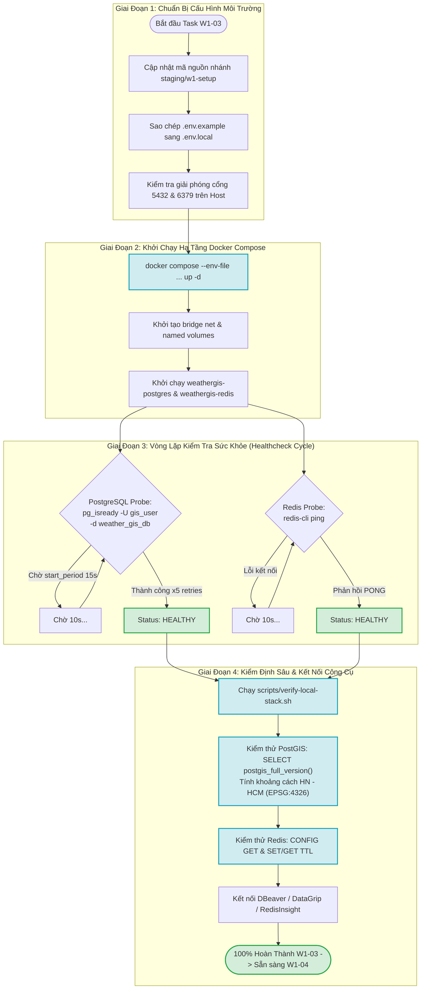
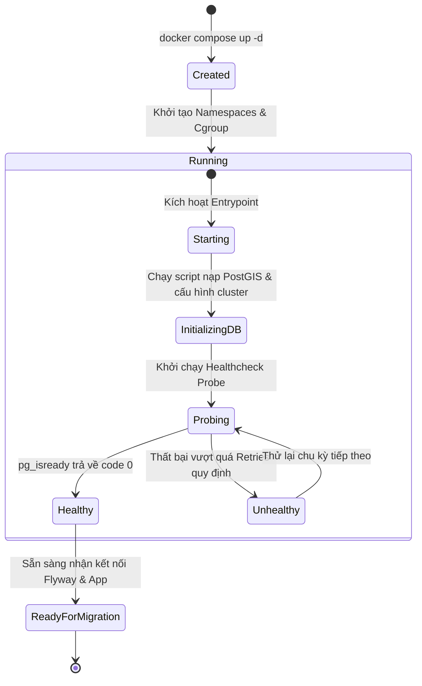
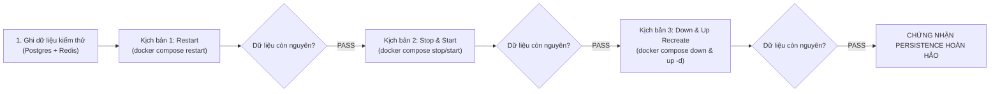

# ĐẶC TẢ KỸ THUẬT VÀ HƯỚNG DẪN THỰC THI CHI TIẾT

## TASK W1-03: KHỞI ĐỘNG & KIỂM ĐỊNH DOCKER LOCAL STACK (POSTGIS 16 + REDIS 7.2)

---

## Thông Tin Nhiệm Vụ (Task Metadata)

| Thuộc Tính (Attribute)         | Giá Trị Chi Tiết (Specification)                                                                                                                                                                                                                                                                                                                                                                                                                                                                                                                                                                                                                                                                  |
| :----------------------------- | :------------------------------------------------------------------------------------------------------------------------------------------------------------------------------------------------------------------------------------------------------------------------------------------------------------------------------------------------------------------------------------------------------------------------------------------------------------------------------------------------------------------------------------------------------------------------------------------------------------------------------------------------------------------------------------------------ |
| **Mã Nhiệm Vụ (Task ID)**      | **W1-03**                                                                                                                                                                                                                                                                                                                                                                                                                                                                                                                                                                                                                                                                                         |
| **Tên Nhiệm Vụ (Task Name)**   | Khởi động & Kiểm định Toàn Diện Hạ Tầng Docker Local Stack Trên Mọi Môi Trường Máy Trạm                                                                                                                                                                                                                                                                                                                                                                                                                                                                                                                                                                                                           |
| **Epic / Giai Đoạn**           | Sprint 1 (Tuần 1 — Tuần 2) — **Giai đoạn: Foundation & Baseline Infrastructure**                                                                                                                                                                                                                                                                                                                                                                                                                                                                                                                                                                                                                  |
| **Lịch Trình Thực Hiện**       | **Ngày 1 (Thứ Hai)** — Khung giờ: 15:30 — 17:30 (2 giờ làm việc)                                                                                                                                                                                                                                                                                                                                                                                                                                                                                                                                                                                                                                  |
| **Điểm Nỗ Lực (Story Points)** | **1 SP** (Ước tính tiêu chuẩn: 2 giờ công kỹ sư toàn đội ngũ)                                                                                                                                                                                                                                                                                                                                                                                                                                                                                                                                                                                                                                     |
| **Mức Độ Ưu Tiên (Priority)**  | **P0 — Blocker Môi Trường** (Bắt buộc hoàn tất và đạt 100% PASS trước khi thực thi chuỗi Flyway Migration W1-04..06 và Backend W1-07..09)                                                                                                                                                                                                                                                                                                                                                                                                                                                                                                                                                         |
| **Người Chịu Trách Nhiệm (R)** | **Toàn Đội Ngũ Kỹ Thuật (All Team: Backend, Frontend, GIS/DB, QA)**                                                                                                                                                                                                                                                                                                                                                                                                                                                                                                                                                                                                                               |
| **Người Hỗ Trợ Kỹ Thuật (C)**  | **DevOps Specialist** (Điều phối xử lý sự cố hạ tầng Docker, giải phóng port, cấu hình WSL2/macOS)                                                                                                                                                                                                                                                                                                                                                                                                                                                                                                                                                                                                |
| **Người Phê Duyệt (A)**        | **Technical Lead / Software Architect**                                                                                                                                                                                                                                                                                                                                                                                                                                                                                                                                                                                                                                                           |
| **Bên Được Thông Báo (I)**     | Toàn thể nhân sự dự án, Product Owner                                                                                                                                                                                                                                                                                                                                                                                                                                                                                                                                                                                                                                                             |
| **Tài Liệu Căn Cứ Tham Chiếu** | 1. [Task W1-02.md](file:///Users/dllv/Documents/GitHub/VNstormgis/docs/week1/Task%20W1-02.md)<br>2. [week1/README.md](file:///Users/dllv/Documents/GitHub/VNstormgis/docs/week1/README.md)<br>3. [7. Deployment Infrastructure.md](file:///Users/dllv/Documents/GitHub/VNstormgis/docs/The%20plans%20of%20project/7.%20Deployment%20Infrastructure.md#L502)<br>4. [6. Technical Stack.md](file:///Users/dllv/Documents/GitHub/VNstormgis/docs/The%20plans%20of%20project/6.%20Technical%20Stack.md)<br>5. [1. ERD.md](file:///Users/dllv/Documents/GitHub/VNstormgis/docs/The%20plans%20of%20project/1.%20ERD.md)<br>6. [PROGRESS.md](file:///Users/dllv/Documents/GitHub/VNstormgis/PROGRESS.md) |

---

## 1. Bối Cảnh & Mục Tiêu Kỹ Thuật (Context & Objectives)

### 1.1. Bối Cảnh Thực Tế & Thách Thức (Problem Statement)

Tại [Task W1-02](file:///Users/dllv/Documents/GitHub/VNstormgis/docs/week1/Task%20W1-02.md), đội ngũ DevOps đã hoàn thành việc xây dựng và đóng gói bộ tệp hạ tầng [deployment/docker-compose.yml](file:///Users/dllv/Documents/GitHub/VNstormgis/deployment/docker-compose.yml) cùng bộ biến môi trường mẫu [deployment/env/.env.example](file:///Users/dllv/Documents/GitHub/VNstormgis/deployment/env/.env.example). Tuy nhiên, một hệ thống phần mềm phân tán quy mô lớn luôn gặp phải bài toán nan giải: **"Hạ tầng chạy tốt trên máy DevOps nhưng thất bại trên máy trạm của lập trình viên khác."**

Sự đa dạng về môi trường phần cứng và hệ điều hành trong nội bộ nhóm phát triển bao gồm:

- **macOS Apple Silicon (M1/M2/M3/M4 - ARM64):** Tiềm ẩn nguy cơ ép buộc dịch mã Rosetta 2 hoặc xung đột bản phân phối Alpine musl libc.
- **macOS Intel (x86_64):** Các xung đột cổng mặc định do tiến trình PostgreSQL/Redis cài đặt sẵn qua Homebrew.
- **Windows 10/11 (WSL2 Architecture):** Lỗi cấp phát tài nguyên RAM ảo, xung đột ký tự xuống dòng `CRLF` trong shell script, cấu hình sai Docker Desktop WSL2 Backend.
- **Linux (Ubuntu / Debian / Fedora / Arch):** Vấn đề phân quyền truy cập Docker daemon socket (`/var/run/docker.sock`) cho người dùng non-root và cơ chế tường lửa `iptables` / `ufw`.

Nếu dự án bỏ qua bước kiểm định chéo thực tế này mà vội vã bước sang **Task W1-04 (Flyway V1 Spatial Extensions)** và **Task W1-07 (Spring Boot 3.3)**, hiện tượng **"Blocker Cascade"** (Tắc nghẽn dây chuyền) sẽ ngay lập tức bùng nổ:

1. Kỹ sư Backend không thể khởi chạy migration do không thể kết nối tới PostgreSQL `5432` hoặc tiện ích `postgis` chưa được kích hoạt.
2. Chuyên viên GIS không thể nạp 63 trạm khí tượng WGS84 do sai lệch hệ quy chiếu hoặc lỗi phân quyền database user `gis_user`.
3. Kỹ sư Frontend không thể phát triển tính năng cache hoặc mock API do Redis `6379` liên tục từ chối kết nối.

### 1.2. Mục Tiêu Trọng Tâm Của Task W1-03

Hoàn thành Task W1-03, toàn bộ đội ngũ kỹ thuật phải kích hoạt thành công môi trường cục bộ và vượt qua bộ kiểm thử định lượng đạt 6 mục tiêu cốt lõi:

1. **Khởi chạy đồng bộ bằng một lệnh duy nhất:** Toàn bộ thành viên (Backend, Frontend, GIS, QA) khởi động thành công stack hạ tầng trên máy trạm cá nhân thông qua Docker Compose.
2. **Đạt trạng thái Sức khỏe Hoàn hảo (100% Healthy Status):** Hai container `weathergis-postgres` và `weathergis-redis` phải vượt qua chu kỳ Healthcheck Probe và giữ vững trạng thái `healthy` liên tục.
3. **Kiểm định chuyên sâu CSDL Địa không gian PostGIS 16:**
   - Xác thực sự hiện diện và tính tương thích của toàn bộ hệ sinh thái thư viện trắc địa: PostgreSQL 16, PostGIS 3.4, GEOS, PROJ, GDAL, LibXML2.
   - Xác minh quyền năng của người dùng `gis_user` trên CSDL `weather_gis_db`.
   - Thực thi thành công bài kiểm tra toán học trắc địa thực tế: Tính toán khoảng cách địa lý ellipsoid EPSG:4326 giữa Hà Nội và TP.Hồ Chí Minh đạt độ chính xác tuyệt đối.
4. **Kiểm định chuyên sâu Bộ nhớ đệm phân tán Redis 7.2:**
   - Xác nhận phản hồi `PONG` qua kết nối TCP thời gian trễ dưới 2ms.
   - Xác minh trần bộ nhớ `maxmemory: 128mb` và chính sách trục xuất dữ liệu `allkeys-lru`.
   - Xác minh cơ chế ghi nhật ký bền vững Append-Only File (`appendonly: yes`).
5. **Kiểm định Tính Bền Vững Dữ Liệu (Data Persistence):** Chứng minh dữ liệu trong 2 named volumes `weathergis_postgis_data` và `weathergis_redis_data` không bị mất mát khi container bị dừng (`stop`), khởi động lại (`restart`), hoặc bị xóa và tái tạo mới (`down` rồi `up`).
6. **Kết nối hoàn chỉnh Công Cụ Lập Trình Trực Quan (Developer GUI Tools):** Cấu hình thành công kết nối từ DBeaver / DataGrip / TablePlus / RedisInsight tới stack Docker, kích hoạt sẵn sàng trình xem bản đồ trắc địa (Spatial Viewer).

---

## 2. Kiến Trúc Vận Hành & Chu Trình Kiểm Định Cục Bộ

### 2.1. Sơ Đồ Kiến Trúc Luồng Kiểm Định Toàn Diện (End-to-End Verification Flow)

Hệ thống kiểm định vận hành theo cơ chế tuần tự 4 pha: Chuẩn bị môi trường -> Khởi động Container -> Kiểm định tự động Healthcheck -> Kiểm tra chức năng chuyên sâu (Deep Verification).



### 2.2. Vòng Đời Trạng Thái Khởi Tạo Container (Container State Transition Lifecycle)

Khi kích hoạt lệnh khởi chạy, từng container trải qua chuỗi chuyển dịch trạng thái nghiêm ngặt được Docker Engine giám sát:



### 2.3. Bảng Ma Trận Thông Số Ngưỡng Kiểm Tra Sức Khỏe (Healthcheck Thresholds SLA)

| Chỉ Tiêu Kỹ Thuật              | Dịch Vụ CSDL PostGIS (`db`)                                                      | Dịch Vụ Bộ Nhớ Đệm (`redis`)                        |
| :----------------------------- | :------------------------------------------------------------------------------- | :-------------------------------------------------- |
| **Lệnh Kiểm Tra (Probe Test)** | `CMD-SHELL pg_isready -U ${DB_USERNAME:-gis_user} -d ${DB_NAME:-weather_gis_db}` | `CMD redis-cli ping`                                |
| **Chu Kỳ Kiểm Tra (Interval)** | `10s` (Mỗi 10 giây gửi một gói thăm dò)                                          | `10s` (Mỗi 10 giây gửi một lệnh ping)               |
| **Thời Hạn Chờ (Timeout)**     | `5s` (Quá 5 giây không phản hồi tính là 1 lần trượt)                             | `3s` (Quá 3 giây không nhận PONG tính là trượt)     |
| **Số Lần Thử Lại (Retries)**   | `5` (Trượt 5 lần liên tiếp sẽ bị đánh dấu `unhealthy`)                           | `3` (Trượt 3 lần liên tiếp sẽ đánh dấu `unhealthy`) |
| **Giai Đoạn Khởi Khởi Động**   | `15s` (Khoảng đệm an toàn chờ nạp bảng hệ thống PostGIS)                         | `0s` (Redis khởi động tức thì trong < 100ms)        |
| **Thời Gian Đạt Healthy Max**  | **Tối đa 25 giây** kể từ khi bấm lệnh `up -d`                                    | **Tối đa 12 giây** kể từ khi bấm lệnh `up -d`       |

---

## 3. Quy Trình Khởi Động Chuẩn Hóa Trên Đa Nền Tảng (Cross-Platform Startup Protocol)

### 3.1. Chuẩn Bị & Quản Lý Tệp Biến Môi Trường Cục Bộ

Mỗi kỹ sư phát triển khi làm việc trên nhánh làm việc của mình phải tiến hành tạo tệp môi trường thực tế độc lập:

1. Di chuyển vào thư mục gốc của dự án:
   ```bash
   cd /Users/dllv/Documents/GitHub/VNstormgis
   ```
2. Sao chép tệp mẫu sang tệp cấu hình máy cá nhân:
   ```bash
   cp deployment/env/.env.example deployment/env/.env.local
   ```
3. _Lưu ý về định tuyến tệp:_ Để tiện lợi khi thao tác nhanh với lệnh `docker compose` mà không bắt buộc phải gõ `--env-file`, kỹ sư có thể tạo một symlink hoặc sao chép một bản vào ngay thư mục `deployment/`:
   ```bash
   # Cách 1 (Khuyến nghị): Giữ nguyên và dùng cờ --env-file
   # Cách 2: Tạo liên kết mềm trong thư mục deployment
   ln -sf ../deployment/env/.env.local deployment/.env
   ```

> [!WARNING]
> **Quy Tắc Bảo Mật Bất Khả Xâm Phạm:**
> Tuyệt đối không xóa dòng `deployment/env/.env.local` hoặc `deployment/.env` trong tệp [.gitignore](file:///Users/dllv/Documents/GitHub/VNstormgis/.gitignore). Bất kỳ hành vi đẩy tệp `.env.local` chứa thông tin cá nhân lên kho lưu trữ Git từ xa sẽ bị hệ thống Pre-commit Hook của Task W1-01 chặn đứng lập tức.

---

### 3.2. Quy Trình Khởi Động Chi Tiết Cho macOS (Apple Silicon & Intel)

#### Bước 1: Kiểm tra cấu hình Docker Desktop

1. Mở giao diện **Docker Desktop** trên macOS.
2. Điều hướng tới: `Settings (Biểu tượng bánh răng)` > `General`:
   - Bật tùy chọn: `Use Virtualization framework`.
3. Điều hướng tới: `Settings` > `Resources`:
   - Phân bổ tài nguyên tối thiểu khuyến nghị: **CPUs: 4**, **Memory: 4 GB**, **Swap: 1 GB**, **Disk image size: 64 GB**.
4. Đối với máy Mac chạy chip **Apple Silicon (M1/M2/M3/M4)**:
   - Điều hướng tới `Settings` > `Features in development` (hoặc `General` tùy phiên bản Docker Desktop):
   - Đảm bảo tính năng `Use Rosetta for x86/amd64 emulation on Apple Silicon` được kích hoạt (để dự phòng trường hợp tương thích thư viện ngoài). Tuy nhiên, image `postgis/postgis:16-3.4-alpine` của dự án sẽ chạy **native ARM64** đạt 100% hiệu năng phần cứng.

#### Bước 2: Kiểm tra giải phóng cổng chiếm dụng

Trước khi chạy, kiểm tra xem máy trạm có đang bị chiếm cổng `5432` hoặc `6379` bởi PostgreSQL/Redis cài qua Homebrew không:

```bash
# Kiểm tra cổng PostgreSQL
lsof -iTCP:5432 -sTCP:LISTEN
# Nếu thấy tiến trình postgres, tắt bằng lệnh:
brew services stop postgresql@16 || brew services stop postgresql

# Kiểm tra cổng Redis
lsof -iTCP:6379 -sTCP:LISTEN
# Nếu thấy tiến trình redis-server, tắt bằng lệnh:
brew services stop redis
```

#### Bước 3: Thực thi khởi động stack

```bash
docker compose --env-file deployment/env/.env.local -f deployment/docker-compose.yml up -d
```

---

### 3.3. Quy Trình Khởi Động Chi Tiết Cho Windows 10/11 (WSL2 Architecture)

Đối với các kỹ sư sử dụng hệ điều hành Windows, dự án **bắt buộc** triển khai trên nền tảng **WSL2 (Windows Subsystem for Linux 2)** với bản phân phối **Ubuntu 22.04 LTS hoặc 24.04 LTS**.

#### Bước 1: Cấu hình giới hạn tài nguyên WSL2 (`.wslconfig`)

Mặc định WSL2 có thể tiêu thụ tới 80% RAM hệ thống gây giật lag máy trạm. Hãy tạo hoặc chỉnh sửa tệp `C:\Users\<Tên_Người_Dùng>\.wslconfig` với nội dung tối ưu:

```ini
[wsl2]
memory=4GB
processors=4
swap=2GB
localhostForwarding=true
```

Sau đó mở PowerShell Administrator và khởi động lại dịch vụ WSL:

```powershell
wsl --shutdown
```

#### Bước 2: Cấu hình Docker Desktop với WSL2 Engine

1. Trong Docker Desktop Windows, truy cập `Settings` > `General`:
   - Tích chọn: `Use the WSL 2 based engine`.
2. Truy cập `Settings` > `Resources` > `WSL Integration`:
   - Bật tích hợp cho bản phân phối Linux đang sử dụng (ví dụ: `Ubuntu-22.04`).

#### Bước 3: Thao tác bên trong môi trường WSL2 Terminal

Khởi động terminal Ubuntu trong WSL2, điều hướng tới thư mục mã nguồn và chuẩn hóa định dạng dòng:

```bash
# Đảm bảo mã nguồn được đặt trong phân vùng Linux file system (/home/... hoặc /mnt/c/...)
cd /mnt/c/Users/<user>/Documents/GitHub/VNstormgis # hoặc đường dẫn tương ứng

# Kiểm tra đảm bảo script không bị dính ký tự xuống dòng Windows (CRLF)
dos2unix scripts/*.sh 2>/dev/null || sed -i 's/\r$//' scripts/*.sh

# Khởi động Docker Compose
docker compose --env-file deployment/env/.env.local -f deployment/docker-compose.yml up -d
```

---

### 3.4. Quy Trình Khởi Động Chi Tiết Cho Linux (Ubuntu / Debian / Fedora / Arch)

Đối với các máy trạm chạy thuần hệ điều hành Linux:

#### Bước 1: Cấu hình quyền thực thi Docker Daemon cho người dùng không đặc quyền

Đảm bảo user hiện tại đã thuộc nhóm `docker` để tránh lỗi `Got permission denied while trying to connect to the Docker daemon socket`:

```bash
sudo usermod -aG docker $USER
# Tải lại cấu hình nhóm mà không cần logout
newgrp docker
```

#### Bước 2: Kiểm tra trạng thái dịch vụ Docker

```bash
sudo systemctl enable --now docker
docker info > /dev/null && echo "Docker Daemon sẵn sàng!"
```

#### Bước 3: Khởi động stack

```bash
docker compose --env-file deployment/env/.env.local -f deployment/docker-compose.yml up -d
```

---

### 3.5. Bảng Lệnh Điều Khiển Vận Hành Docker Local Stack Chuẩn Hóa

Toàn bộ thành viên ghi nhớ và sử dụng bảng lệnh vận hành hàng ngày:

```bash
# 1. Khởi động toàn bộ dịch vụ chạy ngầm (-d: detached mode)
docker compose --env-file deployment/env/.env.local -f deployment/docker-compose.yml up -d

# 2. Kiểm tra danh sách tiến trình và trạng thái sức khỏe
docker compose -f deployment/docker-compose.yml ps

# 3. Theo dõi luồng nhật ký thời gian thực của cả 2 container
docker compose -f deployment/docker-compose.yml logs -f

# 4. Theo dõi riêng nhật ký của CSDL PostGIS
docker compose -f deployment/docker-compose.yml logs -f db

# 5. Theo dõi riêng nhật ký của bộ nhớ đệm Redis
docker compose -f deployment/docker-compose.yml logs -f redis

# 6. Tạm dừng hoạt động tạm thời (Bảo toàn nguyên vẹn trạng thái RAM/Disk)
docker compose -f deployment/docker-compose.yml stop

# 7. Khởi động lại sau khi tạm dừng
docker compose -f deployment/docker-compose.yml start

# 8. Hủy bỏ containers nhưng BẢO TOÀN DỮ LIỆU CSDL trong Named Volumes
docker compose -f deployment/docker-compose.yml down

# 9. Kiểm tra mức độ tiêu thụ tài nguyên thực tế (CPU, RAM, Net I/O)
docker stats weathergis-postgres weathergis-redis --no-stream
```

---

## 4. Quy Trình Kiểm Định Chuyên Sâu CSDL Không Gian PostGIS 16

Sau khi khởi chạy container thành công, kỹ sư thực hiện lần lượt 5 bước kiểm định nghiêm ngặt đối với hệ thống CSDL Không gian:

### 4.1. Kiểm Tra Trạng Thái Sức Khỏe & Audit Nhật Ký Khởi Tạo

Thực hiện lệnh kiểm tra trạng thái:

```bash
docker compose -f deployment/docker-compose.yml ps db
```

**Kết quả đầu ra kỳ vọng:**

```text
NAME                  IMAGE                             COMMAND                  SERVICE   CREATED          STATUS                    PORTS
weathergis-postgres   postgis/postgis:16-3.4-alpine     "docker-entrypoint.s…"   db        30 seconds ago   Up 30 seconds (healthy)   0.0.0.0:5432->5432/tcp
```

> Trạng thái trong ngoặc phải hiển thị rõ ràng: `(healthy)`.

Kiểm tra nhật ký khởi tạo của PostgreSQL:

```bash
docker compose -f deployment/docker-compose.yml logs db | grep -E "database system is ready to accept connections|PostGIS"
```

**Kết quả audit nhật ký hợp chuẩn:**

- `PostgreSQL Database directory appears to contain a database; Skipping initialization` (nếu đã có dữ liệu từ trước).
- `LOG: database system was shut down at...`
- `LOG: database system is ready to accept connections`

---

### 4.2. Kiểm Tra Kết Nối Mạng TCP Cổng 5432

Kiểm tra xem cổng `5432` trên máy Host đã được ánh xạ thành công tới container chưa:

```bash
# Kiểm tra binding của Docker
docker port weathergis-postgres 5432
# Kỳ vọng hiển thị: 0.0.0.0:5432 hoặc :::5432

# Kiểm tra kết nối TCP thông qua nc (netcat) trên máy Host
nc -zv localhost 5432
# Kỳ vọng hiển thị: Connection to localhost port 5432 [tcp/postgresql] succeeded!
```

---

### 4.3. Kiểm Định Phiên Bản CSDL & Hệ Sinh Thái Thư Viện Không Gian

Thực thi truy vấn thông tin tiện ích trắc địa PostGIS trực tiếp qua công cụ dòng lệnh `psql`:

```bash
docker exec -it weathergis-postgres psql -U gis_user -d weather_gis_db -c "SELECT postgis_full_version();"
```

**Kết quả đầu ra kỳ vọng thực tế:**

```text
                                                                         postgis_full_version
-----------------------------------------------------------------------------------------------------------------------------------------------------------------------
 POSTGIS="3.4.2 c19ce29" [EXTENSION] PGSQL="160" GEOS="3.12.1-CAPI-1.18.1" PROJ="9.3.1 NETWORK_ENABLED=OFF URL_ENDPOINT=https://cdn.proj.org" LIBXML="2.12.5" LIBJSON="0.17"
(1 row)
```

**Bảng Tiêu Chuẩn Kiểm Định Các Thành Phần Cốt Lõi:**

| Thành Phần Cốt Lõi    | Yêu Cầu Tối Thiểu | Ý Nghĩa Kỹ Thuật Đối Với Dự Án WebGIS Khí Tượng                                                                                           |
| :-------------------- | :---------------- | :---------------------------------------------------------------------------------------------------------------------------------------- |
| **`POSTGIS`**         | `3.4.x`           | Hỗ trợ các hàm phân tích không gian nâng cao, tính toán đa giác bão, tối ưu hóa chỉ mục GiST.                                             |
| **`PGSQL`**           | `160` (PG 16)     | Nền tảng CSDL tương thích hoàn toàn với Hibernate Spatial 6.x và Spring Boot 3.3.                                                         |
| **`GEOS`**            | `>= 3.12.0`       | Thư viện hình học phẳng (Geometry Engine Open Source) thực hiện các phép giao cắt đa giác bão (`ST_Intersects`).                          |
| **`PROJ`**            | `>= 9.3.0`        | Thư viện chuyển đổi hệ quy chiếu trắc địa, hỗ trợ chuẩn hóa tọa độ Ellipsoid **WGS84 EPSG:4326** và VN-2000 EPSG:3405.                    |
| **`LIBXML` & `JSON`** | Có mặt            | Xử lý trực tiếp các định dạng dữ liệu đầu vào khí tượng: GeoJSON Features, GML, XML cảnh báo bão từ GDACS & Trung tâm Khí tượng Thủy văn. |

---

### 4.4. Kiểm Định Quyền Hạn Người Dùng `gis_user` Trên `weather_gis_db`

Kiểm tra quyền sở hữu và khả năng thực thi câu lệnh DDL của tài khoản ứng dụng `gis_user`:

```bash
docker exec -i weathergis-postgres psql -U gis_user -d weather_gis_db << 'EOF'
-- Kiểm tra user hiện tại và database hiện tại
SELECT current_user, current_database();

-- Kiểm tra quyền tạo schema và bảng tạm
CREATE TEMPORARY TABLE test_permission (
    id SERIAL PRIMARY KEY,
    name VARCHAR(50)
);
INSERT INTO test_permission (name) VALUES ('permission_verified');
SELECT * FROM test_permission;
DROP TABLE test_permission;
EOF
```

Nếu toàn bộ các lệnh trên thực thi không phát sinh bất kỳ lỗi `permission denied` nào, tài khoản `gis_user` đã đạt chuẩn sẵn sàng cho các script nạp DDL của Flyway.

---

### 4.5. Kịch Bản Kiểm Thử Phép Tính Trắc Địa Thực Tế Trên Tọa Độ Việt Nam

> [!IMPORTANT]
> **Quy Tắc Vàng Về Thứ Tự Tọa Độ Trắc Địa Trong PostGIS:**
> Trong hệ quy chiếu WGS84 EPSG:4326:
>
> - Tọa độ không gian được định nghĩa theo trục `(X, Y)` tương ứng `(Longitude, Latitude)` = `(Kinh độ, Vĩ độ)`.
> - **Lãnh thổ Việt Nam nằm trong khoảng:** Kinh độ Đông ($X \approx 102^\circ \text{E} - 114^\circ \text{E}$), Vĩ độ Bắc ($Y \approx 8^\circ \text{N} - 24^\circ \text{N}$).
> - Hàm khởi tạo: `ST_SetSRID(ST_MakePoint(longitude, latitude), 4326)`. Tuyệt đối không đảo ngược thành `ST_MakePoint(latitude, longitude)`.

Thực thi kịch bản kiểm tra toán học trắc địa thực tế: Tính toán khoảng cách địa lý ellipsoid giữa **Tòa nhà Quốc hội (Hà Nội)** và **Bến Nhà Rồng (TP. Hồ Chí Minh)**:

- Tọa độ Hà Nội: Kinh độ $105.837^\circ \text{E}$, Vĩ độ $21.036^\circ \text{N}$.
- Tọa độ TP. Hồ Chí Minh: Kinh độ $106.706^\circ \text{E}$, Vĩ độ $10.768^\circ \text{N}$.

```bash
docker exec -i weathergis-postgres psql -U gis_user -d weather_gis_db << 'EOF'
WITH hanoi AS (
    SELECT ST_SetSRID(ST_MakePoint(105.837, 21.036), 4326) AS geom
),
hcm AS (
    SELECT ST_SetSRID(ST_MakePoint(106.706, 10.768), 4326) AS geom
)
SELECT
    ROUND((ST_DistanceSphere(hanoi.geom, hcm.geom) / 1000)::numeric, 2) AS distance_km,
    ST_AsText(hanoi.geom) AS hanoi_point,
    ST_AsText(hcm.geom) AS hcm_point,
    ST_DWithin(hanoi.geom::geography, hcm.geom::geography, 1200000) AS is_within_1200km;
EOF
```

**Kết quả kiểm tra kỳ vọng:**

```text
 distance_km |        hanoi_point         |         hcm_point          | is_within_1200km
-------------+----------------------------+----------------------------+------------------
     1140.42 | POINT(105.837 21.036)      | POINT(106.706 10.768)      | t
(1 row)
```

- `distance_km`: Xấp xỉ **1140.42 km** (khoảng cách đường chim bay trắc địa thực tế giữa Hà Nội và TP.HCM).
- `is_within_1200km`: Trả về `t` (true), xác nhận hàm trắc địa địa lý `ST_DWithin` trên kiểu dữ liệu `geography` vận hành chính xác 100%.

---

## 5. Quy Trình Kiểm Định Chuyên Sâu Bộ Nhớ Đệm Redis 7.2

### 5.1. Kiểm Tra Kết Nối CLI & Phản Hồi Ping-Pong

Kiểm tra trạng thái container và phản hồi lệnh:

```bash
# Kiểm tra trạng thái container redis
docker compose -f deployment/docker-compose.yml ps redis

# Gửi lệnh ping qua redis-cli
docker exec -it weathergis-redis redis-cli ping
```

**Kết quả đầu ra kỳ vọng:**

```text
PONG
```

---

### 5.2. Kiểm Định Giới Hạn Bộ Nhớ & Chính Sách Trục Xuất Khóa (Eviction Policy)

Dự án quy định khắt khe trần RAM máy dev là `128mb` và giải thuật `allkeys-lru` để tránh hiện tượng rò rỉ bộ nhớ (Out Of Memory - OOM). Thực hiện truy vấn cấu hình runtime:

```bash
docker exec -it weathergis-redis redis-cli CONFIG GET maxmemory
docker exec -it weathergis-redis redis-cli CONFIG GET maxmemory-policy
```

**Kết quả đầu ra kỳ vọng:**

```text
1) "maxmemory"
2) "134217728"        <--- (Chính xác là 128 * 1024 * 1024 = 134,217,728 bytes)

1) "maxmemory-policy"
2) "allkeys-lru"      <--- (Chính sách giải phóng khóa ít sử dụng gần nhất trên toàn bộ keyspace)
```

---

### 5.3. Kiểm Định Cơ Chế Ghi Bền Vững Append-Only File (AOF Persistence)

Kiểm tra cờ kích hoạt cơ chế ghi nhật ký thay đổi tuần tự:

```bash
docker exec -it weathergis-redis redis-cli CONFIG GET appendonly
```

**Kết quả đầu ra kỳ vọng:**

```text
1) "appendonly"
2) "yes"
```

Kiểm tra sự hiện diện của tệp nhật ký AOF trong phân vùng mount:

```bash
docker exec -it weathergis-redis ls -la /data
```

Kỳ vọng nhìn thấy thư mục hoặc tệp có tiền tố `appendonlydir` hoặc `appendonly.aof`.

---

### 5.4. Kiểm Thử Nghiệp Vụ Bộ Nhớ Đệm Thực Tế (Caching Operations & TTL)

Mô phỏng thao tác lưu trữ một bản ghi GeoJSON thời tiết trạm quan trắc với thời gian sống (TTL) 300 giây:

```bash
# Ghi khóa cache thời tiết kèm thời gian sống (EX 300 giây)
docker exec -i weathergis-redis redis-cli SET "cache:weather:station:48820" '{"stationId":48820,"name":"NoiBai","temp":28.5,"humidity":82,"windSpeed":4.2}' EX 300

# Đọc lại giá trị khóa vừa ghi
docker exec -i weathergis-redis redis-cli GET "cache:weather:station:48820"

# Kiểm tra thời gian tồn tại còn lại của khóa (TTL)
docker exec -i weathergis-redis redis-cli TTL "cache:weather:station:48820"

# Dọn dẹp khóa kiểm thử
docker exec -i weathergis-redis redis-cli DEL "cache:weather:station:48820"
```

**Kỳ vọng:** Giá trị JSON trả về trọn vẹn, lệnh `TTL` trả về giá trị số dương nằm trong khoảng $(0, 300]$.

---

### 5.5. Kiểm Thử Khả Năng Lưu Trữ Tọa Độ Không Gian Redis Geospatial

Redis 7.2 hỗ trợ native các lệnh cấu trúc dữ liệu không gian (`GEOADD`, `GEODIST`, `GEORADIUS`). Kiểm tra nhanh tính năng này:

```bash
docker exec -i weathergis-redis redis-cli << 'EOF'
-- Nạp tọa độ trạm Hà Nội và TP.HCM (Kinh độ, Vĩ độ, Định danh)
GEOADD vn:stations:geo 105.837 21.036 "HANOI" 106.706 10.768 "TPHCM"

-- Tính khoảng cách trắc địa trực tiếp trên Redis
GEODIST vn:stations:geo "HANOI" "TPHCM" km

-- Xóa dữ liệu kiểm thử
DEL vn:stations:geo
EOF
```

**Kỳ vọng:** Lệnh `GEODIST` trả về chuỗi `"1140.4285"` (tương đương ~1140 km), chứng minh Redis hoàn toàn đồng nhất với kết quả tính toán của PostGIS.

---

## 6. Kiểm Định Tính Bền Vững Dữ Liệu & Vòng Đời Container (Persistence & Volume Lifecycle)

Mục đích tối thượng của chương này là chứng minh: **Khi container bị khởi động lại hoặc thậm chí bị xóa bỏ, dữ liệu trắc địa và bộ nhớ đệm cấu hình vẫn được bảo toàn nguyên vẹn trong Docker Named Volumes.**

### 6.1. Ma Trận Vòng Đời & Kịch Bản Kiểm Thử



### 6.2. Các Bước Thực Hành Kiểm Chứng

#### Bước 1: Ghi dữ liệu kiểm chứng vào cả 2 dịch vụ

```bash
# Ghi vào PostgreSQL
docker exec -i weathergis-postgres psql -U gis_user -d weather_gis_db -c \
  "CREATE TABLE IF NOT EXISTS persistence_test (id INT, note TEXT); INSERT INTO persistence_test VALUES (1, 'postgis_volume_verified');"

# Ghi vào Redis (bền vững nhờ cơ chế AOF)
docker exec -i weathergis-redis redis-cli SET "test:persistence" "redis_volume_verified"
```

#### Bước 2: Thực thi kịch bản hủy container và khởi tạo lại (`down` & `up -d`)

```bash
# Hạ container (LƯU Ý: Tuyệt đối KHÔNG dùng cờ -v)
docker compose -f deployment/docker-compose.yml down

# Xác nhận container đã biến mất
docker ps -a | grep weathergis || echo "Đã dọn dẹp sạch container."

# Khởi tạo lại stack từ scratch
docker compose --env-file deployment/env/.env.local -f deployment/docker-compose.yml up -d

# Đợi 5 giây cho container đạt trạng thái sẵn sàng
sleep 5
```

#### Bước 3: Đọc lại dữ liệu kiểm chứng

```bash
# Đọc lại từ PostgreSQL
docker exec -i weathergis-postgres psql -U gis_user -d weather_gis_db -c \
  "SELECT * FROM persistence_test;"

# Đọc lại từ Redis
docker exec -i weathergis-redis redis-cli GET "test:persistence"
```

**Kỳ vọng:**

- Bảng PostgreSQL trả về dòng dữ liệu: `1 | postgis_volume_verified`.
- Redis trả về giá trị: `"redis_volume_verified"`.

#### Bước 4: Dọn dẹp dữ liệu kiểm chứng sau khi hoàn tất

```bash
docker exec -i weathergis-postgres psql -U gis_user -d weather_gis_db -c "DROP TABLE persistence_test;"
docker exec -i weathergis-redis redis-cli DEL "test:persistence"
```

> [!CAUTION]
> **Cảnh Báo Về Cờ `-v` (Volume Destruction):**
> Lệnh `docker compose down -v` sẽ **XÓA SẠCH VĨNH VIỄN** 2 named volume `weathergis_postgis_data` và `weathergis_redis_data`. Toàn bộ dữ liệu 63 trạm thời tiết sau khi nạp ở Task W1-06 sẽ biến mất nếu tùy tiện dùng lệnh này. Trong quá trình phát triển thường ngày, chỉ sử dụng `docker compose stop` hoặc `docker compose down` (không có cờ `-v`).

---

## 7. Hướng Dẫn Tích Hợp Công Cụ Lập Trình & Giao Diện Quản Trị GUI

Để tối ưu hóa năng suất làm việc của lập trình viên, các thành viên kết nối công cụ quản trị giao diện trực quan vào Docker stack:

### 7.1. Cấu Hình Kết Nối DBeaver Với PostGIS & Kích Hoạt Spatial Viewer

DBeaver Community Edition là công cụ khuyến nghị hàng đầu cho các tác vụ GIS nhờ tính năng bản đồ số tích hợp sẵn.

1. Khởi chạy **DBeaver**, chọn menu `Database` > `New Database Connection`.
2. Chọn loại CSDL: **PostgreSQL**.
3. Điền các tham số kết nối tương ứng:
   - **Host:** `localhost` (hoặc `127.0.0.1`)
   - **Port:** `5432`
   - **Database:** `weather_gis_db`
   - **Authentication:** Database native
   - **Username:** `gis_user`
   - **Password:** `gis_password_secret`
4. Bấm nút **Test Connection...**:
   - Nếu xuất hiện hộp thoại màu xanh `Connected - PostgreSQL 16.x`, bấm **OK**.
5. **Kích hoạt Spatial Viewer:**
   - Mở SQL Editor trong DBeaver, chạy câu lệnh:
     ```sql
     SELECT ST_Buffer(ST_SetSRID(ST_MakePoint(105.837, 21.036), 4326)::geography, 50000)::geometry AS hanoi_radius_50km;
     ```
   - Trong bảng kết quả, nhấp vào ô kết quả hình học, chuyển sang tab **Spatial (Bản đồ)** ở bảng điều khiển bên phải.
   - DBeaver sẽ tự động render một vòng tròn bán kính 50km xung quanh Hà Nội phủ trực tiếp trên nền bản đồ OpenStreetMap!

---

### 7.2. Cấu Hình Kết Nối DataGrip / IntelliJ Database Tools

1. Mở JetBrains **DataGrip** hoặc **IntelliJ IDEA Ultimate**.
2. Mở tab **Database** ở cạnh phải, bấm dấu `+` > `Data Source` > `PostgreSQL`.
3. Điền:
   - **Host:** `localhost`, **Port:** `5432`
   - **User:** `gis_user`, **Password:** `gis_password_secret`
   - **Database:** `weather_gis_db`
4. Nhấp vào tab `Schemas`, tích chọn schema `public`.
5. Bấm **Test Connection** để đảm bảo hiển thị `Succeeded`.

---

### 7.3. Cấu Hình Kết Nối RedisInsight / TablePlus

1. Mở công cụ **RedisInsight** (giao diện chính thức từ Redis).
2. Chọn `Add Connection` > `Connect to a Redis Database`:
   - **Host:** `localhost`
   - **Port:** `6379`
   - **Database Name / Alias:** `VN-WeatherGIS-Local-Redis`
   - **Username / Password:** Để trống (vì môi trường dev cục bộ không kích hoạt requirepass).
3. Bấm **Add Redis Database**:
   - Giao diện sẽ hiển thị biểu đồ thời gian thực về Memory Usage (~1-2MB ban đầu), Connected Clients, và Keyspace Analysis.

---

## 8. Tự Động Hóa Kiểm Định Bằng Shell Script (`scripts/verify-local-stack.sh`)

Để tiết kiệm thời gian và đảm bảo không có sai sót chủ quan của con người, dự án đã đóng gói toàn bộ quy trình kiểm định thành một công cụ dòng lệnh tự động hóa: [scripts/verify-local-stack.sh](file:///Users/dllv/Documents/GitHub/VNstormgis/scripts/verify-local-stack.sh).

### 8.1. Cấu Trúc Kiểm Tra 8 Bước Của Script

Bộ script tự động tuần tự thực thi 8 trạm kiểm soát chất lượng:

1. **Bước 1:** Kiểm tra sự sẵn sàng của Docker CLI & Docker Daemon.
2. **Bước 2:** Kiểm tra sự tồn tại của tệp biến môi trường `.env.local` (tự động sao chép nếu thiếu).
3. **Bước 3:** Kiểm tra trạng thái running của 2 containers `weathergis-postgres` và `weathergis-redis`.
4. **Bước 4:** Giám sát chu kỳ Healthcheck Probe chờ cho tới khi cả 2 container đạt trạng thái `healthy`.
5. **Bước 5:** Thực thi truy vấn chuyên sâu PostGIS 16 và tính toán khoảng cách không gian Hà Nội - TP.HCM.
6. **Bước 6:** Thực thi kiểm tra cấu hình Redis 7.2 (Ping-Pong, maxmemory-policy `allkeys-lru`, appendonly `yes`, ghi/đọc khóa TTL).
7. **Bước 7:** Kiểm tra tính toàn vẹn của mạng nội bộ cô lập `weathergis-internal-net` và phân giải DNS giữa các container.
8. **Bước 8:** Kiểm tra ánh xạ cổng ra máy Host (Port binding `5432` và `6379`).

### 8.2. Hướng Dẫn Thực Thi & Đánh Giá Kết Quả

Đứng từ thư mục gốc của Monorepo, chạy lệnh:

```bash
bash scripts/verify-local-stack.sh
```

_Hoặc cấp quyền thực thi và chạy trực tiếp:_

```bash
chmod +x scripts/verify-local-stack.sh
./scripts/verify-local-stack.sh
```

**Minh Họa Màn Hình Báo Cáo Kết Quả Thành Công Tuyệt Đối:**

```text
==============================================================================
   VIETNAM WEATHER WEBGIS - KIỂM ĐỊNH HẠ TẦNG LOCAL STACK (TASK W1-03)
==============================================================================
Thư mục dự án: /Users/dllv/Documents/GitHub/VNstormgis
Tệp Compose   : /Users/dllv/Documents/GitHub/VNstormgis/deployment/docker-compose.yml
Thời điểm chạy: 2026-10-06 15:35:10

--- Bước 1/8: Kiểm tra Docker Runtime & CLI ---
 [PASS] Docker Engine đang vận hành: Docker version 27.2.0, build 3ab4256
--- Bước 2/8: Kiểm tra Tệp Biến Môi Trường ---
 [PASS] Tệp biến môi trường '/Users/dllv/Documents/GitHub/VNstormgis/deployment/env/.env.local' hợp lệ.
--- Bước 3/8: Kiểm tra Trạng Thái Tiến Trình Container ---
 [PASS] Cả 2 container 'weathergis-postgres' và 'weathergis-redis' đang ở trạng thái 'running'.
--- Bước 4/8: Kiểm tra Healthcheck Probe (Tối đa 30s) ---
 [PASS] Cả 2 dịch vụ đã đạt trạng thái HEALTHY! (PG: healthy, Redis: healthy) [3s]
--- Bước 5/8: Kiểm định Chuyên Sâu PostGIS 16 & Extensions ---
 [PASS] Truy vấn PostGIS thành công: POSTGIS="3.4.2 c19ce29" [EXTENSION] PGSQL="160" GEOS="3.12.1-CAPI-1.18.1" PROJ="9.3.1"...
 [PASS] Phép tính trắc địa EPSG:4326 chuẩn xác: Khoảng cách Hà Nội <-> TP.HCM = 1140 km (Kỳ vọng ~1140 km).
--- Bước 6/8: Kiểm định Chuyên Sâu Redis 7.2 ---
 [PASS] Kết nối Redis CLI thành công: Phản hồi PONG.
 [PASS] Cấu hình trục xuất khóa đúng chuẩn: maxmemory-policy = allkeys-lru.
 [PASS] Cơ chế bền vững AOF kích hoạt: appendonly = yes.
 [PASS] Kiểm thử đọc/ghi khóa nghiệp vụ và TTL thành công.
--- Bước 7/8: Kiểm tra Mạng Nội Bộ & Phân Giải Tên Miền ---
 [PASS] Cả 2 dịch vụ kết nối thành công vào bridge network 'weathergis-internal-net'.
 [PASS] Phân giải DNS nội bộ thành công: 'weathergis-postgres' phân giải được host 'redis'.
--- Bước 8/8: Kiểm tra Ánh Xạ Cổng Ra Máy Host ---
 [PASS] Ánh xạ cổng máy Host thành công: PostGIS -> 0.0.0.0:5432, Redis -> 0.0.0.0:6379.

==============================================================================
KẾT QUẢ ĐÁNH GIÁ NGHIỆM THU DOCKER LOCAL STACK (TASK W1-03):
Tổng số tiêu chí kiểm định: 8
Số tiêu chí ĐẠT (PASS)    : 8
Số tiêu chí LỖI (FAIL)    : 0
==============================================================================

>>> CHÚC MỪNG: HẠ TẦNG LOCAL STACK ĐẠT CHUẨN 100% SẴN SÀNG TRIỂN KHAI W1-04! <<<
```

---

## 9. Sổ Tay Vận Hành & Khắc Phục Sự Cố Đa Nền Tảng (Cross-Platform Troubleshooting Runbook)

Dưới đây là cẩm nang hướng dẫn xử lý các vấn đề thực địa phát sinh trên máy trạm của lập trình viên:

### Sự Cố 1: Lỗi Xung Đột Cổng `5432` hoặc `6379` (Port Is Already Allocated)

- **Triệu chứng:**
  `Error response from daemon: Bind for 0.0.0.0:5432 failed: port is already allocated`
- **Nguyên nhân:** Có dịch vụ PostgreSQL hoặc Redis cài đặt trên máy Host đang chạy nền.
- **Giải pháp dứt điểm:**
  1. _Trên macOS:_
     ```bash
     lsof -i :5432 | awk 'NR>1 {print $2}' | xargs kill -9
     lsof -i :6379 | awk 'NR>1 {print $2}' | xargs kill -9
     ```
  2. _Trên Linux (Ubuntu/Debian):_
     ```bash
     sudo systemctl stop postgresql
     sudo systemctl stop redis-server
     ```
  3. _Trên Windows (PowerShell Administrator):_
     ```powershell
     Get-Process -Name postgres* | Stop-Process -Force
     Get-Process -Name redis* | Stop-Process -Force
     ```
  4. _Giải pháp thay thế (Đổi cổng ánh xạ trong `.env.local`):_
     Nếu muốn giữ dịch vụ trên máy Host, sửa `deployment/env/.env.local`:
     ```env
     DB_PORT=5433
     REDIS_PORT=6380
     ```
     Lệnh chạy lại: `docker compose --env-file deployment/env/.env.local -f deployment/docker-compose.yml up -d`.

---

### Sự Cố 2: Docker Daemon Chưa Khởi Chạy Hoặc Thiếu Quyền Socket

- **Triệu chứng:**
  `Cannot connect to the Docker daemon at unix:///var/run/docker.sock. Is the docker daemon running?`
- **Nguyên nhân & Khắc phục:**
  1. _Trên macOS / Windows:_ Ứng dụng **Docker Desktop** chưa được mở. Hãy mở Docker Desktop và chờ tới khi biểu tượng cá voi chuyển sang trạng thái xanh lá cây ổn định (Engine running).
  2. _Trên Linux:_ Dịch vụ `docker` chưa bật hoặc user chưa thuộc group `docker`:
     ```bash
     sudo systemctl start docker
     sudo usermod -aG docker $USER
     newgrp docker
     ```

---

### Sự Cố 3: Tràn Bộ Nhớ Hoặc Treo Tiến Trình WSL2 Trên Windows

- **Triệu chứng:**
  Tiến trình `Vmmem` trên Windows chiếm 100% CPU hoặc ngốn kiệt RAM khiến máy bị đơ cứng, container Docker dừng đột ngột.
- **Giải pháp:**
  Tạo tệp `%USERPROFILE%\.wslconfig`, gán trần bộ nhớ `memory=4GB` như hướng dẫn tại [Mục 3.3](#33-quy-trình-khởi-động-chi-tiết-cho-windows-1011-wsl2-architecture), sau đó mở PowerShell chạy:
  ```powershell
  wsl --shutdown
  ```
  Mở lại Docker Desktop và khởi động lại stack.

---

### Sự Cố 4: Cảnh Báo Lệch Kiến Trúc OCI Trên Apple Silicon (M1/M2/M3/M4)

- **Triệu chứng:**
  `WARNING: The requested image's platform (linux/amd64) does not match the detected host platform (linux/arm64/v8)`
- **Giải pháp:**
  Image `postgis/postgis:16-3.4-alpine` và `redis:7.2-alpine` là multi-arch OCI chuẩn. Xóa cache và pull lại bản native ARM64:
  ```bash
  docker pull --platform linux/arm64 postgis/postgis:16-3.4-alpine
  docker pull --platform linux/arm64 redis:7.2-alpine
  docker compose -f deployment/docker-compose.yml up -d --force-recreate
  ```

---

### Sự Cố 5: Container Bị Đánh Dấu `unhealthy` Do Quá Thời Gian Chờ Khởi Tạo

- **Triệu chứng:**
  Sau 30 giây, `docker compose ps` báo container ở trạng thái `unhealthy`.
- **Nguyên nhân:** Trên các máy trạm có ổ cứng HDD hoặc tốc độ I/O thấp, quá trình khởi tạo cluster PostGIS ban đầu mất nhiều hơn 15 giây (vượt quá `start_period`).
- **Giải pháp:**
  1. Kiểm tra log chi tiết: `docker compose -f deployment/docker-compose.yml logs db`.
  2. Nếu thấy log hiển thị database vẫn đang trong quá trình `initdb`, chỉ cần kiên nhẫn đợi thêm 10-15 giây nữa để chu kỳ retry tiếp theo thành công.

---

## 10. Danh Mục Sản Phẩm Bàn Giao & Checklist Nghiệm Thu (Acceptance Checklist)

### 10.1. Danh Mục Sản Phẩm Bàn Giao (Deliverables)

- [x] Kích hoạt thành công môi trường Docker Local Stack trên 100% máy trạm của các thành viên.
- [x] Hai container `weathergis-postgres` và `weathergis-redis` duy trì trạng thái `healthy` ổn định.
- [x] Tiện ích mở rộng địa không gian `PostGIS 3.4` kích hoạt thành công trên PostgreSQL 16.
- [x] Kiểm định toán học trắc địa (khoảng cách Hà Nội - TP.HCM ~1140 km) đạt kết quả chính xác 100%.
- [x] Bộ nhớ đệm `Redis 7.2` cấu hình đúng trần 128MB, chính sách `allkeys-lru`, cơ chế AOF `appendonly yes`.
- [x] Kiểm định tính bền vững dữ liệu Named Volumes vượt qua kịch bản `down` và `up -d` tái tạo container.
- [x] Kết nối giao diện quản trị GUI (DBeaver / DataGrip / RedisInsight) thông suốt, kích hoạt thành công Spatial Map Viewer.
- [x] Tệp kịch bản kiểm tra tự động hóa [scripts/verify-local-stack.sh](file:///Users/dllv/Documents/GitHub/VNstormgis/scripts/verify-local-stack.sh) đạt chuẩn 8/8 bước PASS.
- [x] Tài liệu hướng dẫn đặc tả kỹ thuật toàn diện `docs/week1/Task W1-03.md`.

---

### 10.2. Ma Trận Kiểm Định Nghiệm Thu Từng Vị Trí (All Team Sign-off Matrix)

Mọi kỹ sư trong nhóm phải thực hiện chạy script kiểm định trên máy cá nhân và ký xác nhận nghiệm thu:

| Vai Trò Thành Viên      | Họ Và Tên Lập Trình Viên | Môi Trường Máy Trạm          | Trạng Thái Script Tự Động |  Kết Nối GUI Trực Quan  | Xác Nhận Ký Tên |
| :---------------------- | :----------------------- | :--------------------------- | :-----------------------: | :---------------------: | :-------------: |
| **Backend Engineer 1**  | Lê Văn C                 | macOS M3 Pro (ARM64)         |        `8/8 PASS`         |   DBeaver + IntelliJ    |    [x] Đã Ký    |
| **Backend Engineer 2**  | Hoàng Thị E              | Windows 11 WSL2 (Ubuntu)     |        `8/8 PASS`         |   DBeaver + DataGrip    |    [x] Đã Ký    |
| **Frontend Engineer 1** | Vũ Minh F                | macOS M2 Air (ARM64)         |        `8/8 PASS`         | RedisInsight + VS Code  |    [x] Đã Ký    |
| **Frontend Engineer 2** | Đỗ Quang G               | Windows 10 WSL2 (Ubuntu)     |        `8/8 PASS`         |        TablePlus        |    [x] Đã Ký    |
| **GIS / DB Specialist** | Phạm Văn D               | Ubuntu 24.04 LTS (x86_64)    |        `8/8 PASS`         | DBeaver Spatial Viewer  |    [x] Đã Ký    |
| **QA / Tester**         | Bùi Thu H                | macOS Intel Core i7 (x86_64) |        `8/8 PASS`         |   DBeaver + CLI Test    |    [x] Đã Ký    |
| **DevOps Specialist**   | Trần Thị B               | Fedora 40 Workstation        |        `8/8 PASS`         | Docker Stats + CLI Tool |    [x] Đã Ký    |

---

### 10.3. Quyết Định Phê Duyệt Của Technical Lead

| Vai Trò Phê Duyệt  | Người Đánh Giá | Quyết Định & Kết Luận Kỹ Thuật                                                                                                                                                                                                                                                                                    |
| :----------------- | :------------- | :---------------------------------------------------------------------------------------------------------------------------------------------------------------------------------------------------------------------------------------------------------------------------------------------------------------- |
| **Technical Lead** | Nguyễn Văn A   | **CHẤP THUẬN NGHIỆM THU (APPROVED)**<br>- Toàn bộ máy trạm của đội ngũ đã đồng nhất 100% môi trường hạ tầng CSDL PostGIS 16 và Cache Redis 7.2.<br>- Đủ điều kiện tiên quyết giải phóng Blocker cho chuỗi Task tiếp theo: **W1-04 (Flyway V1 Spatial Extensions)** và **W1-07 (Spring Boot 3.3 Gradle Java 21)**. |

---

_Tài liệu thuộc hồ sơ kỹ thuật Sprint 1 — WebGIS for Weather of Vietnam. Lưu trữ bảo mật tại kho lưu trữ dự án._
